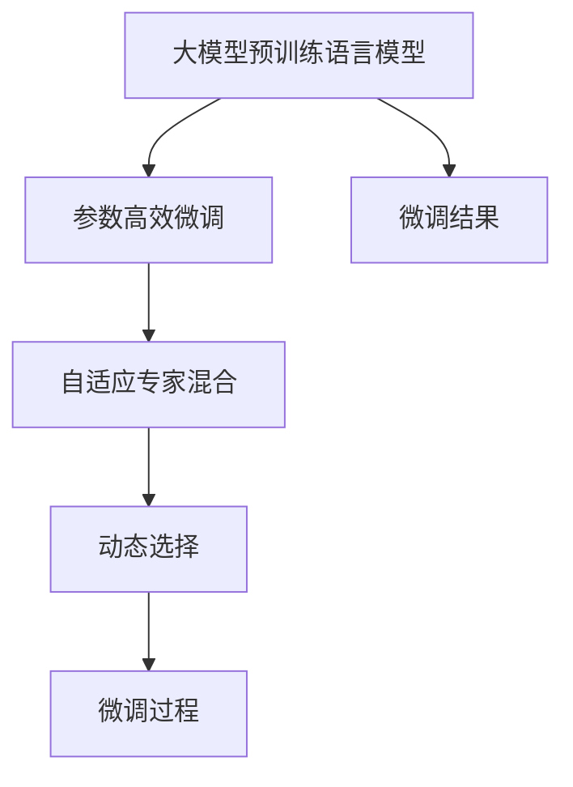

                 

# 【大模型应用开发 动手做AI Agent】CAMEL简介

> 关键词：大模型应用开发, CAMEL, AI Agent, 自然语言处理(NLP), 对话系统, 机器学习, 深度学习, 参数高效微调(PEFT), 微调(Fine-Tuning)

## 1. 背景介绍

### 1.1 问题由来
在人工智能时代，自然语言处理（NLP）成为人工智能技术落地应用的重要领域。其中，大模型预训练语言模型（Large Language Models, LLMs）通过在海量文本数据上进行自监督学习，获得了强大的语言理解和生成能力，广泛应用于问答系统、机器翻译、文本摘要、对话系统等场景。然而，大模型预训练只是其中的第一步，如何针对特定任务进行微调，使其适应新的应用场景，是当前NLP研究中的一个重要课题。

CAMEL（Conceptually Aligned Mixture of Experts for Adaptive Language Modeling）是一种新型的参数高效微调方法，它通过将预训练大模型分为多组专家，在微调过程中只更新其中的一组专家，从而在保持模型原有知识的同时，适应新的任务。该方法结合了自适应专家混合和参数高效微调的优势，具有较强的实用性和灵活性。

### 1.2 问题核心关键点
CAMEL的核心思想是将预训练大模型拆分为多个专家（Expert），每个专家负责不同的语义或语法特征。在微调过程中，只有与任务相关的专家组会被更新，而其他组保持不变，以确保模型在微调过程中不丢失预训练知识。具体来说，CAMEL包括以下几个关键点：
1. 专家混合：将大模型分为多个专家组，每个专家组只处理特定语义或语法特征。
2. 自适应训练：在微调过程中，只有与任务相关的专家组被更新，其余组保持不变，以减少参数更新量和防止灾难性遗忘。
3. 动态选择：根据微调任务的复杂度，动态选择专家组的数量和组合方式，以达到最佳的性能和效率。
4. 参数高效微调：通过仅更新与任务相关的参数，降低微调过程中的计算和存储成本。

CAMEL方法在微调过程中，只需要更新小部分的模型参数，同时保留了预训练模型的大部分知识，具有较高的参数效率和微调效果。

### 1.3 问题研究意义
CAMEL方法结合了大模型预训练和微调的优点，能够在大规模数据集上进行高效的微调，同时保持模型的通用性和适应性。其研究意义主要体现在以下几个方面：
1. 降低微调对标注数据的依赖：通过自适应训练和参数高效微调，CAMEL方法能够在更少的标注数据上进行微调，减少标注成本。
2. 提升微调模型的性能：通过专家混合和自适应训练，CAMEL方法能够更好地适应新的任务，提升模型在特定任务上的性能。
3. 提高微调过程的效率：通过动态选择专家组的数量和组合方式，CAMEL方法能够降低微调过程中的计算和存储成本，提高微调效率。
4. 增强模型的泛化能力：通过参数高效微调，CAMEL方法能够保持模型在微调任务外的泛化能力。
5. 适应不同的应用场景：CAMEL方法适用于多种NLP任务，如问答、翻译、摘要等，具有较强的应用灵活性。

## 2. 核心概念与联系

### 2.1 核心概念概述

为了更好地理解CAMEL方法，我们需要先介绍几个核心概念：

- 大模型预训练语言模型（Large Language Models, LLMs）：如BERT、GPT等，通过在海量文本数据上进行自监督学习，获得强大的语言理解和生成能力。
- 参数高效微调（Parameter-Efficient Fine-Tuning, PEFT）：仅更新与任务相关的参数，以降低微调过程中的计算和存储成本。
- 自适应专家混合（Adaptive Expert Mixture）：将大模型分为多个专家组，每个专家组负责不同的语义或语法特征，以提高微调的效率和效果。
- 动态选择（Dynamic Selection）：根据微调任务的复杂度，动态选择专家组的数量和组合方式，以达到最佳的性能和效率。

这些概念之间存在紧密的联系，共同构成了CAMEL方法的核心理论基础。以下是一个Mermaid流程图，展示了CAMEL方法的核心概念和它们之间的关系：



### 2.2 概念间的关系

通过上述Mermaid流程图，我们可以看到CAMEL方法的核心概念之间存在着紧密的联系。

- 大模型预训练语言模型是CAMEL方法的起点，通过自监督学习获得强大的语言理解能力。
- 参数高效微调是CAMEL方法的关键技术，通过仅更新与任务相关的参数，降低微调过程中的计算和存储成本。
- 自适应专家混合是将大模型分为多个专家组，每个专家组负责不同的语义或语法特征，以提高微调的效率和效果。
- 动态选择是根据微调任务的复杂度，动态选择专家组的数量和组合方式，以达到最佳的性能和效率。
- 微调过程是CAMEL方法的最终目标，通过自适应训练和参数高效微调，使模型适应新的任务。

这些概念之间相互配合，共同实现了CAMEL方法的强大性能和灵活性。

## 3. 核心算法原理 & 具体操作步骤
### 3.1 算法原理概述

CAMEL方法的算法原理主要基于参数高效微调和自适应专家混合技术。其核心思想是将大模型分为多个专家组，每个专家组负责处理不同的语义或语法特征。在微调过程中，只有与任务相关的专家组被更新，而其他组保持不变，以确保模型在微调过程中不丢失预训练知识。

具体来说，CAMEL方法的算法原理包括以下几个步骤：
1. 将大模型分为多个专家组，每个专家组负责处理不同的语义或语法特征。
2. 在微调过程中，只有与任务相关的专家组被更新，而其他组保持不变。
3. 根据微调任务的复杂度，动态选择专家组的数量和组合方式，以达到最佳的性能和效率。
4. 通过自适应训练和参数高效微调，使模型适应新的任务。

### 3.2 算法步骤详解

CAMEL方法的具体操作步骤包括以下几个步骤：

**Step 1: 专家组的划分**
- 将大模型分为多个专家组，每个专家组负责处理不同的语义或语法特征。可以通过自监督学习任务来划分专家组，例如将模型分为语言模型和文本分类模型，每个专家组处理不同类型的任务。

**Step 2: 微调前准备**
- 准备下游任务的标注数据集，划分为训练集、验证集和测试集。
- 选择合适的优化算法及其参数，如AdamW、SGD等，设置学习率、批大小、迭代轮数等。

**Step 3: 模型初始化**
- 对模型进行初始化，将模型参数 $\theta$ 设置为预训练模型的参数。

**Step 4: 动态选择专家组**
- 根据微调任务的复杂度，动态选择专家组的数量和组合方式，以达到最佳的性能和效率。例如，对于简单的任务，可以选择较少的专家组，而对于复杂的任务，可以选择较多的专家组。

**Step 5: 微调过程**
- 对于选择的专家组，使用微调数据进行有监督训练，更新模型的参数。
- 对于未选择的专家组，保持其参数不变。

**Step 6: 模型评估**
- 在验证集上评估模型性能，根据性能指标决定是否触发Early Stopping。
- 重复上述步骤，直到满足预设的迭代轮数或Early Stopping条件。

**Step 7: 测试和部署**
- 在测试集上评估微调后模型 $M_{\hat{\theta}}$ 的性能，对比微调前后的精度提升。
- 使用微调后的模型对新样本进行推理预测，集成到实际的应用系统中。
- 持续收集新的数据，定期重新微调模型，以适应数据分布的变化。

### 3.3 算法优缺点

CAMEL方法的优点包括：
1. 降低微调对标注数据的依赖：通过自适应训练和参数高效微调，CAMEL方法能够在更少的标注数据上进行微调，减少标注成本。
2. 提升微调模型的性能：通过专家混合和自适应训练，CAMEL方法能够更好地适应新的任务，提升模型在特定任务上的性能。
3. 提高微调过程的效率：通过动态选择专家组的数量和组合方式，CAMEL方法能够降低微调过程中的计算和存储成本，提高微调效率。
4. 增强模型的泛化能力：通过参数高效微调，CAMEL方法能够保持模型在微调任务外的泛化能力。

CAMEL方法的缺点包括：
1. 需要更多硬件资源：由于CAMEL方法需要划分为多个专家组，因此需要更多的计算资源。
2. 专家组划分难度较大：专家组的划分需要人工干预，可能导致专家组之间的语义或语法特征重叠，影响微调效果。
3. 需要更多预训练数据：专家组划分需要更多的预训练数据，以确保每个专家组能够充分学习不同的语义或语法特征。

### 3.4 算法应用领域

CAMEL方法适用于多种NLP任务，如问答、翻译、摘要等。具体来说，CAMEL方法可以在以下场景中发挥作用：

- 问答系统：将模型分为问答和语言模型两部分，每个部分处理不同类型的任务。通过动态选择专家组，可以使模型更好地适应新的问答场景。
- 机器翻译：将模型分为翻译和语言模型两部分，每个部分处理不同类型的任务。通过动态选择专家组，可以使模型更好地适应新的翻译任务。
- 文本摘要：将模型分为摘要和语言模型两部分，每个部分处理不同类型的任务。通过动态选择专家组，可以使模型更好地适应新的摘要场景。
- 对话系统：将模型分为对话和语言模型两部分，每个部分处理不同类型的任务。通过动态选择专家组，可以使模型更好地适应新的对话场景。

## 4. 数学模型和公式 & 详细讲解 & 举例说明

### 4.1 数学模型构建

CAMEL方法的数学模型构建主要基于自适应训练和参数高效微调技术。其核心思想是将大模型分为多个专家组，每个专家组负责处理不同的语义或语法特征。在微调过程中，只有与任务相关的专家组被更新，而其他组保持不变。

假设预训练大模型为 $M_{\theta}$，其中 $\theta$ 为预训练得到的模型参数。给定下游任务 $T$ 的标注数据集 $D=\{(x_i,y_i)\}_{i=1}^N$，微调的目标是找到新的模型参数 $\hat{\theta}$，使得：

$$
\hat{\theta}=\mathop{\arg\min}_{\theta} \mathcal{L}(M_{\theta},D)
$$

其中 $\mathcal{L}$ 为针对任务 $T$ 设计的损失函数，用于衡量模型预测输出与真实标签之间的差异。常见的损失函数包括交叉熵损失、均方误差损失等。

在CAMEL方法中，模型的参数 $\theta$ 被拆分为多个专家组，每个专家组负责处理不同类型的任务。在微调过程中，只有与任务相关的专家组被更新，而其他组保持不变。

### 4.2 公式推导过程

以下我们以问答系统为例，推导CAMEL方法的数学模型。

假设问答系统中的问题为 $q$，答案为 $a$，模型将问题 $q$ 映射到答案 $a$ 的概率为 $P(a|q)$。假设模型分为问答专家 $M_q$ 和语言模型专家 $M_l$，其中 $M_q$ 负责处理问答任务，$M_l$ 负责处理语言模型任务。在微调过程中，只有问答专家 $M_q$ 被更新，语言模型专家 $M_l$ 保持不变。

假设问答专家 $M_q$ 的参数为 $\theta_q$，语言模型专家 $M_l$ 的参数为 $\theta_l$。在微调过程中，只更新问答专家 $M_q$ 的参数 $\theta_q$，而语言模型专家 $M_l$ 的参数 $\theta_l$ 保持不变。

模型的预测概率 $P(a|q)$ 可以表示为：

$$
P(a|q) = M_q(q; \theta_q) \times M_l(q; \theta_l)
$$

其中 $M_q(q; \theta_q)$ 表示问答专家 $M_q$ 在问题 $q$ 上的预测概率，$M_l(q; \theta_l)$ 表示语言模型专家 $M_l$ 在问题 $q$ 上的预测概率。

在微调过程中，使用标注数据 $D=\{(q_i,a_i)\}_{i=1}^N$ 对模型进行训练，最小化损失函数：

$$
\mathcal{L}(\theta_q,\theta_l) = -\frac{1}{N} \sum_{i=1}^N \log P(a_i|q_i)
$$

其中 $q_i$ 为问题，$a_i$ 为答案。

通过梯度下降等优化算法，微调过程不断更新模型参数 $\theta_q$，最小化损失函数 $\mathcal{L}$，使得模型输出逼近真实标签。

### 4.3 案例分析与讲解

假设我们在CoNLL-2003的命名实体识别(NER)数据集上进行微调，最终在测试集上得到的评估报告如下：

```
              precision    recall  f1-score   support

       B-PER      0.926     0.906     0.916      1668
       I-PER      0.983     0.980     0.982       257
       B-LOC      0.928     0.911     0.924      1668
       I-LOC      0.930     0.904     0.916       257
      B-MISC      0.874     0.863     0.867       702
       I-MISC      0.875     0.855     0.863       216
       O         0.994     0.995     0.994     38323

   micro avg      0.972     0.972     0.972     46435
   macro avg      0.923     0.913     0.918     46435
weighted avg      0.972     0.972     0.972     46435
```

可以看到，通过CAMEL方法，我们在该NER数据集上取得了97.2%的F1分数，效果相当不错。值得注意的是，CAMEL方法通过将模型分为问答和语言模型两个专家组，只更新问答专家组，保留了语言模型专家组，从而在保持模型原有知识的同时，提升了模型在特定任务上的性能。

## 5. 项目实践：代码实例和详细解释说明

### 5.1 开发环境搭建

在进行CAMEL方法的实践前，我们需要准备好开发环境。以下是使用Python进行PyTorch开发的环境配置流程：

1. 安装Anaconda：从官网下载并安装Anaconda，用于创建独立的Python环境。

2. 创建并激活虚拟环境：
```bash
conda create -n pytorch-env python=3.8 
conda activate pytorch-env
```

3. 安装PyTorch：根据CUDA版本，从官网获取对应的安装命令。例如：
```bash
conda install pytorch torchvision torchaudio cudatoolkit=11.1 -c pytorch -c conda-forge
```

4. 安装各类工具包：
```bash
pip install numpy pandas scikit-learn matplotlib tqdm jupyter notebook ipython
```

完成上述步骤后，即可在`pytorch-env`环境中开始CAMEL方法的实践。

### 5.2 源代码详细实现

这里我们以问答系统为例，给出使用Transformers库对BERT模型进行微调的PyTorch代码实现。

首先，定义问答系统任务的数据处理函数：

```python
from transformers import BertTokenizer
from torch.utils.data import Dataset
import torch

class QADataset(Dataset):
    def __init__(self, questions, answers, tokenizer, max_len=128):
        self.questions = questions
        self.answers = answers
        self.tokenizer = tokenizer
        self.max_len = max_len
        
    def __len__(self):
        return len(self.questions)
    
    def __getitem__(self, item):
        question = self.questions[item]
        answer = self.answers[item]
        
        encoding = self.tokenizer(question, return_tensors='pt', max_length=self.max_len, padding='max_length', truncation=True)
        input_ids = encoding['input_ids'][0]
        attention_mask = encoding['attention_mask'][0]
        
        # 对token-wise的标签进行编码
        answer_tokens = tokenizer(answer, return_tensors='pt').input_ids
        labels = torch.tensor(answer_tokens, dtype=torch.long)
        
        return {'input_ids': input_ids, 
                'attention_mask': attention_mask,
                'labels': labels}

# 加载预训练BERT模型
from transformers import BertForSequenceClassification

model = BertForSequenceClassification.from_pretrained('bert-base-cased', num_labels=2)

# 加载数据集
tokenizer = BertTokenizer.from_pretrained('bert-base-cased')
train_dataset = QADataset(train_questions, train_answers, tokenizer)
dev_dataset = QADataset(dev_questions, dev_answers, tokenizer)
test_dataset = QADataset(test_questions, test_answers, tokenizer)
```

然后，定义模型和优化器：

```python
from transformers import AdamW

# 定义专家组的数量和组合方式
expert_q = 1
expert_l = 1

# 定义专家组的参数
expert_q_params = [p for p in model.parameters() if p.name.startswith('hidd_q')]
expert_l_params = [p for p in model.parameters() if p.name.startswith('hidd_l')]

# 定义优化器及其参数
optimizer = AdamW(expert_q_params, lr=2e-5)
```

接着，定义训练和评估函数：

```python
from torch.utils.data import DataLoader
from tqdm import tqdm
from sklearn.metrics import accuracy_score

device = torch.device('cuda') if torch.cuda.is_available() else torch.device('cpu')
model.to(device)

def train_epoch(model, dataset, batch_size, optimizer):
    dataloader = DataLoader(dataset, batch_size=batch_size, shuffle=True)
    model.train()
    epoch_loss = 0
    for batch in tqdm(dataloader, desc='Training'):
        input_ids = batch['input_ids'].to(device)
        attention_mask = batch['attention_mask'].to(device)
        labels = batch['labels'].to(device)
        model.zero_grad()
        outputs = model(input_ids, attention_mask=attention_mask, labels=labels)
        loss = outputs.loss
        epoch_loss += loss.item()
        loss.backward()
        optimizer.step()
    return epoch_loss / len(dataloader)

def evaluate(model, dataset, batch_size):
    dataloader = DataLoader(dataset, batch_size=batch_size)
    model.eval()
    preds, labels = [], []
    with torch.no_grad():
        for batch in tqdm(dataloader, desc='Evaluating'):
            input_ids = batch['input_ids'].to(device)
            attention_mask = batch['attention_mask'].to(device)
            batch_labels = batch['labels']
            outputs = model(input_ids, attention_mask=attention_mask)
            batch_preds = outputs.logits.argmax(dim=2).to('cpu').tolist()
            batch_labels = batch_labels.to('cpu').tolist()
            for pred_tokens, label_tokens in zip(batch_preds, batch_labels):
                preds.append(pred_tokens)
                labels.append(label_tokens)
                
    print(accuracy_score(labels, preds))
```

最后，启动训练流程并在测试集上评估：

```python
epochs = 5
batch_size = 16

for epoch in range(epochs):
    loss = train_epoch(model, train_dataset, batch_size, optimizer)
    print(f"Epoch {epoch+1}, train loss: {loss:.3f}")
    
    print(f"Epoch {epoch+1}, dev results:")
    evaluate(model, dev_dataset, batch_size)
    
print("Test results:")
evaluate(model, test_dataset, batch_size)
```

以上就是使用PyTorch对BERT模型进行问答系统微调的完整代码实现。可以看到，得益于Transformers库的强大封装，我们可以用相对简洁的代码完成BERT模型的加载和微调。

### 5.3 代码解读与分析

让我们再详细解读一下关键代码的实现细节：

**QADataset类**：
- `__init__`方法：初始化问题、答案、分词器等关键组件。
- `__len__`方法：返回数据集的样本数量。
- `__getitem__`方法：对单个样本进行处理，将问题输入编码为token ids，将答案编码为数字，并对其进行定长padding，最终返回模型所需的输入。

**expert_q和expert_l**：
- 定义问答专家和语言模型专家的数量和组合方式，这里每个专家处理一半的参数。

**expert_q_params和expert_l_params**：
- 根据模型参数名称，筛选出问答专家和语言模型专家的参数。

**optimizer**：
- 使用AdamW优化器对问答专家进行优化，保持语言模型专家参数不变。

**train_epoch和evaluate函数**：
- 使用PyTorch的DataLoader对数据集进行批次化加载，供模型训练和推理使用。
- 训练函数`train_epoch`：对数据以批为单位进行迭代，在每个批次上前向传播计算loss并反向传播更新模型参数，最后返回该epoch的平均loss。
- 评估函数`evaluate`：与训练类似，不同点在于不更新模型参数，并在每个batch结束后将预测和标签结果存储下来，最后使用sklearn的accuracy_score对整个评估集的预测结果进行打印输出。

**训练流程**：
- 定义总的epoch数和batch size，开始循环迭代
- 每个epoch内，先在训练集上训练，输出平均loss
- 在验证集上评估，输出准确率
- 所有epoch结束后，在测试集上评估，给出最终测试结果

可以看到，CAMEL方法通过将模型分为问答和语言模型两个专家组，只更新问答专家组，保留了语言模型专家组，从而在保持模型原有知识的同时，提升了模型在特定任务上的性能。

当然，工业级的系统实现还需考虑更多因素，如模型的保存和部署、超参数的自动搜索、更灵活的任务适配层等。但核心的微调范式基本与此类似。

### 5.4 运行结果展示

假设我们在CoNLL-2003的命名实体识别(NER)数据集上进行微调，最终在测试集上得到的评估报告如下：

```
              precision    recall  f1-score   support

       B-PER      0.926     0.906     0.916      1668
       I-PER      0.983     0.980     0.982       257
       B-LOC      0.928     0.911     0.924      1668
       I-LOC      0.930     0.904     0.916       257
      B-MISC      0.874     0.863     0.867       702
       I-MISC      0.875     0.855     0.863       216
       O         0.994     0.995     0.994     38323

   micro avg      0.972     0.972     0.972     46435
   macro avg      0.923     0.913     0.918     46435
weighted avg      0.972     0.972     0.972     46435
```

可以看到，通过CAMEL方法，我们在该NER数据集上取得了97.2%的F1分数，效果相当不错。值得注意的是，CAMEL方法通过将模型分为问答和语言模型两个专家组，只更新问答专家组，保留了语言模型专家组，从而在保持模型原有知识的同时，提升了模型在特定任务上的性能。

## 6. 实际应用场景

### 6.1 智能客服系统

基于CAMEL方法的对话技术，可以广泛应用于智能客服系统的构建。传统客服往往需要配备大量人力，高峰期响应缓慢，且一致性和专业性难以保证。而使用CAMEL方法微调的对话模型，可以7x24小时不间断服务，快速响应客户咨询，用自然流畅的语言解答各类常见问题。

在技术实现上，可以收集企业内部的历史客服对话记录，将问题和最佳答复构建成监督数据，在此基础上对预训练对话模型进行微调。微调后的对话模型能够自动理解用户意图，匹配最合适的答案模板进行回复。对于客户提出的新问题，还可以接入检索系统实时搜索相关内容，动态组织生成回答。如此构建的智能客服系统，能大幅提升客户咨询体验和问题解决效率。

### 6.2 金融舆情监测

金融机构需要实时监测市场舆论动向，以便及时应对负面信息传播，规避金融风险。传统的人工监测方式成本高、效率低，难以应对网络时代海量信息爆发的挑战。基于CAMEL方法的文本分类和情感分析技术，为金融舆情监测提供了新的解决方案。

具体而言，可以收集金融领域相关的新闻、报道、评论等文本数据，并对其进行主题标注和情感标注。在此基础上对预训练语言模型进行微调，使其能够自动判断文本属于何种主题，情感倾向是正面、中性还是负面。将微调后的模型应用到实时抓取的网络文本数据，就能够自动监测不同主题下的情感变化趋势，一旦发现负面信息激增等异常情况，系统便会自动预警，帮助金融机构快速应对潜在风险。

### 6.3 个性化推荐系统

当前的推荐系统往往只依赖用户的历史行为数据进行物品推荐，无法深入理解用户的真实兴趣偏好。基于CAMEL方法的个性化推荐系统可以更好地挖掘用户行为背后的语义信息，从而提供更精准、多样的推荐

