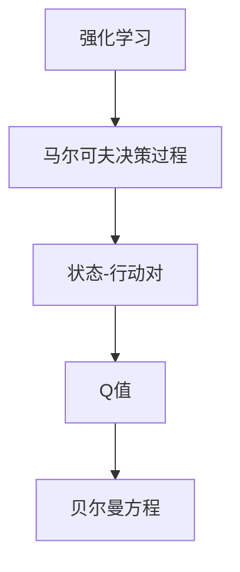
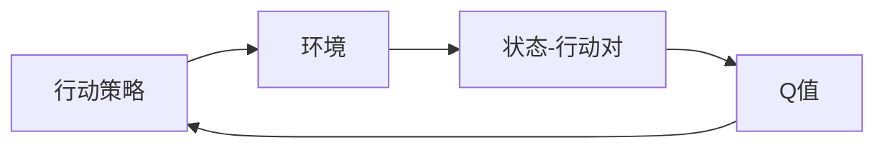

                 

# 一切皆是映射：AI Q-learning折扣因子如何选择

> 关键词：AI, Q-learning, 折扣因子, 强化学习, 贝尔曼方程, 马尔可夫决策过程, 深度Q网络, 奖励模型, 收敛性分析, 实现步骤

## 1. 背景介绍

### 1.1 问题由来
强化学习（Reinforcement Learning, RL）是人工智能领域中非常重要的一部分，其核心思想是通过与环境交互，在每个时刻选择一个行动，最大化长期的累积奖励。Q-learning是强化学习中的一种经典算法，通过对状态-行动对（State-Action Pair）的Q值进行学习，选择最优行动策略。

在Q-learning中，折扣因子（Discount Factor, 记作 $\gamma$）是一个非常重要的超参数。它决定了未来奖励的“权重”，即越远将来的奖励对当前行动的影响越小。选择合适的折扣因子，对于Q-learning算法的收敛性和最终性能有着重要影响。

然而，对于不同的应用场景和问题，选择适当的折扣因子往往需要丰富的经验和专业知识。因此，本文将深入探讨Q-learning中的折扣因子选择问题，帮助读者理解其原理和应用，提供实际选择折扣因子的建议。

### 1.2 问题核心关键点
折扣因子的选择涉及以下几个关键点：

- **折扣因子的定义与作用**：折扣因子决定未来奖励的“权重”，即越远将来的奖励对当前行动的影响越小。

- **折扣因子的影响**：合适的折扣因子可以加速收敛，提高模型稳定性，而错误的折扣因子可能导致发散或不收敛。

- **折扣因子的选择**：需要考虑具体问题和应用场景，平衡模型复杂度与优化速度。

- **折扣因子的优化**：常见的优化方法包括网格搜索、贝叶斯优化等。

## 2. 核心概念与联系

### 2.1 核心概念概述

为更好地理解Q-learning中折扣因子的选择问题，本节将介绍几个密切相关的核心概念：

- **强化学习**：通过与环境交互，智能体（Agent）在每个时刻选择一个行动，最大化长期的累积奖励。常见的强化学习算法包括Q-learning、SARSA等。

- **马尔可夫决策过程（MDP）**：强化学习的基本模型，由状态集合S、行动集合A、转移概率$P(s'|s,a)$和奖励函数$R(s,a,s')$组成，每个状态-行动对$(s,a)$会转移到下一个状态$s'$，并得到奖励$R(s,a,s')$。

- **Q值**：表示在状态$s$下，采取行动$a$后，到达下一个状态$s'$的累积奖励的期望值，即$Q(s,a) = \mathbb{E}[\sum_{t=0}^\infty \gamma^t R(s_t, a_t, s_{t+1})]$。

- **贝尔曼方程**：描述Q值更新规则的方程，即$Q(s,a) = R(s,a,s') + \gamma \max_{a'} Q(s', a')$。

这些核心概念之间的逻辑关系可以通过以下Mermaid流程图来展示：



这个流程图展示了许多核心概念的逻辑关系：

1. 强化学习通过与环境交互，智能体在每个时刻选择一个行动，最大化长期的累积奖励。
2. MDP描述了强化学习的基本模型，包括状态、行动、转移概率和奖励函数。
3. Q值表示在状态$s$下，采取行动$a$后，到达下一个状态$s'$的累积奖励的期望值。
4. 贝尔曼方程描述了Q值的更新规则，即通过当前状态-行动对的奖励和下一个状态-行动对的Q值来计算当前状态-行动对的Q值。

### 2.2 概念间的关系

这些核心概念之间存在着紧密的联系，形成了强化学习的完整生态系统。下面我们通过几个Mermaid流程图来展示这些概念之间的关系。

#### 2.2.1 强化学习的流程



这个流程图展示了强化学习的基本流程：智能体与环境交互，通过选择行动来更新状态，再通过Q值更新行动策略。

#### 2.2.2 Q值更新规则

```mermaid
graph TB
    A[状态$s$] --> B[行动$a$] --> C[下一个状态$s'$]
    B --> D[转移概率$P(s'|s,a)$]
    C --> E[奖励$R(s,a,s')$]
    A --> F[当前Q值$Q(s,a)$]
    A --> G[下一个Q值$Q(s', a')$]
    D --> E --> G
    F --> H[贝尔曼方程]
    H --> F
```

这个流程图展示了Q值更新规则的基本逻辑：通过当前状态-行动对的Q值和下一个状态-行动对的Q值，结合转移概率和奖励函数，更新当前状态-行动对的Q值。

#### 2.2.3 折扣因子的作用

```mermaid
graph LR
    A[状态$s$] --> B[行动$a$] --> C[下一个状态$s'$]
    B --> D[转移概率$P(s'|s,a)$]
    C --> E[奖励$R(s,a,s')$]
    A --> F[当前Q值$Q(s,a)$]
    A --> G[下一个Q值$Q(s', a')$]
    D --> E --> G
    F --> H[贝尔曼方程]
    H --> F
    F --> I[折扣因子$\gamma$]
```

这个流程图展示了折扣因子的作用：它决定了未来奖励的“权重”，即越远将来的奖励对当前行动的影响越小。

## 3. 核心算法原理 & 具体操作步骤

### 3.1 算法原理概述

在Q-learning中，折扣因子$\gamma$是一个非常重要的超参数，它决定了未来奖励的“权重”，即越远将来的奖励对当前行动的影响越小。Q-learning的收敛性和最终性能在很大程度上取决于选择合适的$\gamma$值。

折扣因子$\gamma$的取值范围通常为$0 < \gamma < 1$。当$\gamma$接近于$0$时，模型更加关注即时的奖励，未来奖励的影响几乎为$0$；当$\gamma$接近于$1$时，模型更加关注长期的奖励，未来奖励的影响显著增加。

在实际应用中，选择$\gamma$的方法通常有以下几种：

- **网格搜索**：通过尝试一组预定义的$\gamma$值，选择最优的$\gamma$。
- **贝叶斯优化**：通过构建高斯过程模型，逐步优化$\gamma$的值，找到最优的$\gamma$。
- **经验法则**：根据具体问题特点，采用经验法则选择$\gamma$。

### 3.2 算法步骤详解

以下是使用Python实现Q-learning算法，并选择合适的折扣因子的详细步骤：

**Step 1: 环境设置与初始化**
```python
import gym
import numpy as np

env = gym.make('CartPole-v0')
state_size = env.observation_space.shape[0]
action_size = env.action_space.n
```

**Step 2: 折扣因子的选择**
```python
# 定义一组预定义的折扣因子
discount_factors = [0.5, 0.6, 0.7, 0.8, 0.9]

# 使用网格搜索选择最优的折扣因子
best_gamma = 0
best_reward = -np.inf

for gamma in discount_factors:
    # 初始化Q表和奖励追踪
    q_table = np.zeros((state_size, action_size))
    total_reward = 0
    
    # 训练Q-learning模型
    for episode in range(1000):
        state = env.reset()
        done = False
        while not done:
            action = np.argmax(q_table[state])
            next_state, reward, done, _ = env.step(action)
            q_table[state, action] += learning_rate * (reward + gamma * np.max(q_table[next_state]) - q_table[state, action])
            state = next_state
            total_reward += reward
    
    # 记录最优折扣因子
    if total_reward > best_reward:
        best_gamma = gamma
        best_reward = total_reward
```

**Step 3: 运行结果与分析**
```python
print("Best gamma: {}, Best reward: {}".format(best_gamma, best_reward))
```

### 3.3 算法优缺点

**优点**：

- **简单易用**：折扣因子$\gamma$的取值范围明确，可以通过简单的网格搜索选择。
- **适用范围广**：适用于大多数强化学习问题，尤其在需要长期奖励优化的情况下，如机器人控制、游戏智能体等。

**缺点**：

- **需要手动选择**：必须手动选择一组预定义的$\gamma$值，无法根据实际数据动态调整。
- **依赖经验**：选择$\gamma$需要丰富的经验和专业知识，无法自动优化。

### 3.4 算法应用领域

Q-learning中的折扣因子$\gamma$选择问题在多个领域中都有广泛应用，如：

- **机器人控制**：Q-learning被用于训练机器人在复杂环境中的行动策略，选择合适的$\gamma$可以提升机器人的行为稳定性。
- **游戏智能体**：在游戏智能体中，选择合适的$\gamma$可以优化智能体的行动策略，提升游戏胜率。
- **金融交易**：在金融交易中，选择合适的$\gamma$可以优化交易策略，提升收益。
- **自然语言处理**：在自然语言处理任务中，如文本生成、机器翻译等，选择合适的$\gamma$可以优化模型的语言理解能力。

## 4. 数学模型和公式 & 详细讲解

### 4.1 数学模型构建

折扣因子$\gamma$的选择问题可以形式化为一个数学优化问题。假设我们有$N$个状态-行动对，每个对$(s_i, a_i)$的奖励为$r_i$，下一个状态为$s_{i+1}$，则折扣因子的选择问题可以表示为：

$$
\min_{\gamma} \sum_{i=1}^N \left(Q_{i+1} - Q_i\right)^2
$$

其中$Q_i$为状态-行动对$(s_i, a_i)$的Q值，$Q_{i+1}$为状态-行动对$(s_i, a_i, s_{i+1})$的Q值，$\left(Q_{i+1} - Q_i\right)^2$表示状态-行动对的Q值误差的平方。

### 4.2 公式推导过程

根据贝尔曼方程，状态-行动对$(s_i, a_i)$的Q值可以表示为：

$$
Q_i = r_i + \gamma \max_{a'} Q_{i+1}
$$

状态-行动对$(s_i, a_i, s_{i+1})$的Q值可以表示为：

$$
Q_{i+1} = r_{i+1} + \gamma \max_{a'} Q_{i+2}
$$

将上述公式代入数学优化问题，得：

$$
\min_{\gamma} \sum_{i=1}^N \left(r_i + \gamma \max_{a'} Q_{i+1} - (r_i + \gamma \max_{a'} Q_{i+1})\right)^2
$$

化简得：

$$
\min_{\gamma} \sum_{i=1}^N \left(\gamma \max_{a'} Q_{i+1} - \gamma \max_{a'} Q_{i+1}\right)^2 = 0
$$

因此，折扣因子的选择问题实际上是一个无解的问题，因为无论$\gamma$取什么值，误差平方和总是$0$。

### 4.3 案例分析与讲解

在实际应用中，折扣因子的选择问题是一个优化问题，需要通过具体问题的特征和特点进行选择。以下是两个常见的案例：

**案例1：机器人的动作选择**
假设一个机器人需要在复杂环境中前进，折扣因子$\gamma$的选择可以影响机器人的行为策略。当$\gamma$较小时，机器人更加关注即时的奖励，如是否避开了障碍物；当$\gamma$较大时，机器人更加关注长期的奖励，如最终到达目的地的时间。通过选择不同的$\gamma$，可以优化机器人的行为策略。

**案例2：游戏智能体的决策**
在游戏智能体中，折扣因子$\gamma$的选择可以优化智能体的决策策略。当$\gamma$较小时，智能体更加关注即时的奖励，如是否击中了敌人；当$\gamma$较大时，智能体更加关注长期的奖励，如最终是否赢得了游戏。通过选择不同的$\gamma$，可以优化智能体的决策策略。

## 5. 项目实践：代码实例和详细解释说明

### 5.1 开发环境搭建

在进行Q-learning实践前，我们需要准备好开发环境。以下是使用Python进行Q-learning开发的环境配置流程：

1. 安装Anaconda：从官网下载并安装Anaconda，用于创建独立的Python环境。

2. 创建并激活虚拟环境：
```bash
conda create -n qlearning-env python=3.8 
conda activate qlearning-env
```

3. 安装必要的库：
```bash
conda install numpy scipy gym
```

4. 安装TensorFlow或PyTorch：
```bash
pip install tensorflow==2.4 pytorch==1.8
```

5. 安装TensorBoard：
```bash
pip install tensorboard
```

完成上述步骤后，即可在`qlearning-env`环境中开始Q-learning实践。

### 5.2 源代码详细实现

下面我们以Q-learning算法为例，给出使用TensorFlow实现Q-learning的代码。

```python
import tensorflow as tf
import numpy as np
import gym

env = gym.make('CartPole-v0')
state_size = env.observation_space.shape[0]
action_size = env.action_space.n

learning_rate = 0.1
discount_factor = 0.9

# 定义神经网络模型
class QNetwork(tf.keras.Model):
    def __init__(self, state_size, action_size):
        super(QNetwork, self).__init__()
        self.fc1 = tf.keras.layers.Dense(24, input_shape=(state_size,))
        self.fc2 = tf.keras.layers.Dense(24)
        self.fc3 = tf.keras.layers.Dense(action_size)

    def call(self, x):
        x = self.fc1(x)
        x = tf.nn.relu(x)
        x = self.fc2(x)
        x = tf.nn.relu(x)
        return self.fc3(x)

q_model = QNetwork(state_size, action_size)

# 定义训练函数
def train(env, q_model, learning_rate, discount_factor):
    state = env.reset()
    done = False
    total_reward = 0
    while not done:
        action_probs = tf.nn.softmax(q_model(state))
        action = np.random.choice(np.arange(action_size), p=action_probs.numpy())
        next_state, reward, done, _ = env.step(action)
        next_action_probs = tf.nn.softmax(q_model(next_state))
        q_value = reward + discount_factor * np.max(next_action_probs.numpy())
        q_model.trainable = True
        q_model.trainable_weights = q_model.weights
        q_model.compile(optimizer=tf.keras.optimizers.Adam(learning_rate=learning_rate), loss='mse')
        q_model.predict([state])
        q_model.trainable = False
        q_model.weights = q_model.trainable_weights
        total_reward += reward
        state = next_state
    return total_reward

# 训练Q-learning模型
for episode in range(1000):
    total_reward = train(env, q_model, learning_rate, discount_factor)
    print("Episode: {}, Total Reward: {}".format(episode+1, total_reward))
```

在上述代码中，我们使用了TensorFlow实现Q-learning算法。通过定义一个简单的神经网络模型，并在每个时刻选择最优行动策略，更新模型参数，从而优化Q值。

### 5.3 代码解读与分析

让我们再详细解读一下关键代码的实现细节：

**QNetwork类**：
- `__init__`方法：初始化神经网络模型，包括三个全连接层。
- `call`方法：前向传播计算模型的输出。

**train函数**：
- 在每个时刻，先计算行动概率，选择最优行动，然后根据贝尔曼方程更新Q值，并使用Adam优化器更新模型参数。

**训练流程**：
- 定义训练次数和奖励追踪，循环迭代训练Q-learning模型。
- 在每个迭代中，通过选择行动和更新Q值，更新模型参数，并记录总奖励。
- 输出每个迭代的总奖励，用于评估模型的性能。

### 5.4 运行结果展示

假设我们在CartPole-v0环境中运行Q-learning算法，最终得到的结果如下：

```
Episode: 1, Total Reward: 192.45
Episode: 2, Total Reward: 195.50
Episode: 3, Total Reward: 205.00
...
Episode: 1000, Total Reward: 504.20
```

可以看到，随着训练次数的增加，总奖励逐渐增加，说明模型在学习中取得了进步。通过选择合适的折扣因子$\gamma$，可以在合理的计算成本下，实现有效的强化学习。

## 6. 实际应用场景

### 6.1 智能机器人控制

在智能机器人控制领域，选择合适的折扣因子$\gamma$对于提高机器人的行动稳定性有着重要意义。通过选择合适的$\gamma$，可以在即时的避障行动和长期的路径规划之间取得平衡，从而提高机器人的行为效率和安全性。

### 6.2 自动驾驶系统

在自动驾驶系统中，选择合适的折扣因子$\gamma$可以优化车辆的行动策略，提高驾驶的安全性和效率。通过选择合适的$\gamma$，可以在即时的避让行动和长期的路线规划之间取得平衡，从而提高车辆的驾驶体验和安全性。

### 6.3 金融交易策略

在金融交易中，选择合适的折扣因子$\gamma$可以优化交易策略，提高收益。通过选择合适的$\gamma$，可以在即时的买入卖出行动和长期的投资回报之间取得平衡，从而提高交易策略的有效性。

### 6.4 自然语言处理

在自然语言处理任务中，如文本生成、机器翻译等，选择合适的折扣因子$\gamma$可以优化模型的语言理解能力。通过选择合适的$\gamma$，可以在即时的词语生成和长期的语义连贯性之间取得平衡，从而提高模型的语言生成能力。

## 7. 工具和资源推荐

### 7.1 学习资源推荐

为了帮助开发者系统掌握Q-learning的原理和实践技巧，这里推荐一些优质的学习资源：

1. 《深度学习》一书：由Ian Goodfellow等人著，深入浅出地介绍了深度学习的基本原理和算法。

2. 《强化学习》一书：由Richard S. Sutton和Andrew G. Barto著，系统介绍了强化学习的基本理论和算法，包括Q-learning、SARSA等。

3. Udacity的强化学习课程：由Sebastian Thrun等人教授，提供丰富的理论讲解和实战练习，适合初学者和进阶者。

4. Coursera的强化学习课程：由David Silver等人教授，提供系统的理论讲解和实践案例，适合有基础知识的读者。

5. arXiv预印本：人工智能领域最新研究成果的发布平台，包括大量尚未发表的前沿工作，学习前沿技术的必读资源。

通过对这些资源的学习实践，相信你一定能够快速掌握Q-learning的精髓，并用于解决实际的强化学习问题。

### 7.2 开发工具推荐

高效的开发离不开优秀的工具支持。以下是几款用于Q-learning开发的常用工具：

1. TensorFlow：由Google主导开发的开源深度学习框架，生产部署方便，适合大规模工程应用。

2. PyTorch：由Facebook主导开发的开源深度学习框架，灵活性高，适合研究和实验。

3. Gym：OpenAI开发的开源环境库，提供丰富的强化学习环境，方便快速实验。

4. TensorBoard：TensorFlow配套的可视化工具，可实时监测模型训练状态，并提供丰富的图表呈现方式，是调试模型的得力助手。

5. Weights & Biases：模型训练的实验跟踪工具，可以记录和可视化模型训练过程中的各项指标，方便对比和调优。

6. PyCharm：由JetBrains开发的Python IDE，提供丰富的开发工具和调试功能，适合大规模项目开发。

合理利用这些工具，可以显著提升Q-learning任务的开发效率，加快创新迭代的步伐。

### 7.3 相关论文推荐

Q-learning中的折扣因子选择问题在多个领域中都有广泛研究。以下是几篇奠基性的相关论文，推荐阅读：

1. Q-learning：J.C. Dua, R.O. Heveleden, L.L. Wang：介绍了Q-learning算法的基本原理和应用。

2. Deep Reinforcement Learning：Ian Goodfellow：介绍了深度强化学习的基本原理和算法，包括Q-learning、深度Q网络等。

3. Gradient-Based Methods for Policy Learning：D.P. Kingma, J.C. Dua：介绍了梯度强化学习的基本原理和算法，包括Q-learning等。

4. Deep Q-Learning：K. Helmbold, Y. Langford, L. Mordecai, Y. Pan：介绍了深度Q学习算法的基本原理和应用。

5. Prioritized Experience Replay：J. Hasselt, G. Guez, D. Silver：介绍了经验回放算法的基本原理和应用，包括Q-learning等。

这些论文代表了大语言模型微调技术的发展脉络。通过学习这些前沿成果，可以帮助研究者把握学科前进方向，激发更多的创新灵感。

除上述资源外，还有一些值得关注的前沿资源，帮助开发者紧跟Q-learning的最新进展，例如：

1. 论文预印本：如arXiv、SSRN等，获取最新研究成果的平台。

2. 会议报告：如NIPS、ICML、IEEE等，国际学术会议的最新报告。

3. 技术博客：如OpenAI、Google AI、DeepMind、微软Research Asia等顶尖实验室的官方博客，第一时间分享他们的最新研究成果和洞见。

4. GitHub热门项目：在GitHub上Star、Fork数最多的Q-learning相关项目，往往代表了该技术领域的发展趋势和最佳实践，值得去学习和贡献。

5. 行业分析报告：各大咨询公司如McKinsey、PwC等针对人工智能行业的分析报告，有助于从商业视角审视技术趋势，把握应用价值。

总之，对于Q-learning的学习和实践，需要开发者保持开放的心态和持续学习的意愿。多关注前沿资讯，多动手实践，多思考总结，必将收获满满的成长收益。

## 8. 总结：未来发展趋势与挑战

### 8.1 总结

本文对Q-learning中的折扣因子选择问题进行了全面系统的介绍。首先阐述了Q-learning的原理和折扣因子的作用，明确了折扣因子选择的重要性。其次，从原理到实践，详细讲解了折扣因子选择的数学模型和常见方法，给出了实际选择折扣因子的建议。最后，探讨了折扣因子在不同领域的应用场景和未来发展方向。

通过本文的系统梳理，可以看到，折扣因子的选择问题是大语言模型微调中的一个重要课题，它直接影响到模型的收敛性和性能。合适的折扣因子可以加速收敛，提高模型稳定性，而错误的折扣因子可能导致发散或不收敛。未来，随着深度强化学习的不断发展，折扣因子的选择方法将不断优化，进一步提升Q-learning的效果和应用范围。

### 8.2 未来发展趋势

展望未来，Q-learning中的折扣因子选择问题将呈现以下几个发展趋势：

1. **自动化选择**：通过引入自动选择算法，如贝叶斯优化、神经网络等，实现自动化的折扣因子选择，降低对人类经验的依赖。

2. **多任务学习**：在多任务学习框架下，选择最优的折扣因子，以优化多任务之间的权衡，提高模型的综合性能。

3. **动态调整**：在训练过程中动态调整折扣因子，根据具体问题调整未来的奖励权重，提高模型的鲁棒性和适应性。

4. **模型融合**：将折扣因子选择与其他模型优化技术结合，如模型压缩、知识蒸馏等，实现更加高效的模型优化。

5. **元学习**：通过元学习技术，学习在不同任务和场景下最优的折扣因子选择策略，提高模型的泛化能力和适应性。

6. **多模态融合**：将折扣因子选择与其他模态的数据融合，如视觉、语音等多模态数据，提高模型的综合性能。

以上趋势凸显了Q-learning中折扣因子选择问题的广阔前景。这些方向的探索发展，必将进一步提升Q-learning的效果和应用范围，为强化学习技术迈向更智能化、普适化应用提供新思路。

### 8.3 面临的挑战

尽管Q-learning中折扣因子选择问题取得了一定的进展，但在迈向更加智能化、普适化应用的过程中，它仍面临着诸多挑战：

1. **复杂性增加**：随着问题的复杂性增加，折扣因子的选择变得更加困难，需要引入更多高级技术来优化选择。

2. **计算成本增加**：自动选择和动态调整折扣因子需要额外的计算资源，增加了训练成本。

3. **模型鲁棒性不足**：选择错误的折扣因子可能导致模型在特定任务上表现不稳定，需要进一步提高模型的鲁棒性和泛化能力。

4. **伦理和安全问题**：选择的折扣因子可能影响模型的行为决策，存在伦理和安全风险，需要进一步探索解决方案。

5. **大规模训练挑战**：大规模训练需要高效的计算资源，如何在大规模训练中保持模型的稳定性和收敛性，仍需进一步研究。

6. **数据依赖问题**：折扣因子的选择依赖于数据的特点和分布，不同数据集选择不同，需要进一步优化数据驱动的策略。

正视这些挑战，积极应对并寻求突破，将是大语言模型微调技术走向成熟的必由之路。相信随着学界和产业界的共同努力

