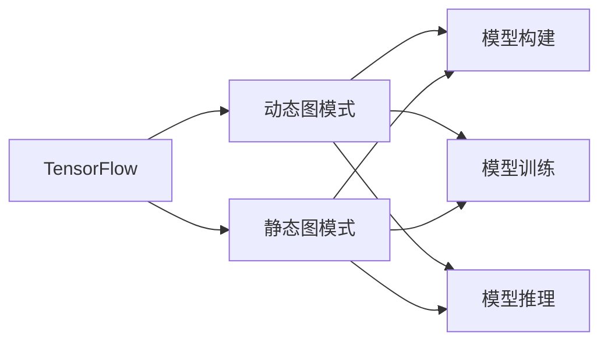
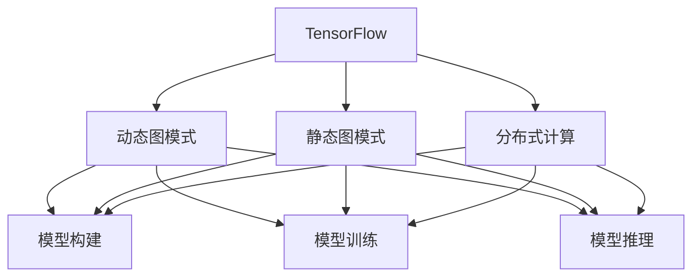

                 

# 一切皆是映射：TensorFlow 和 PyTorch 实战对比

> 关键词：
1. 深度学习
2. TensorFlow
3. PyTorch
4. 编程范式
5. 动态图
6. 静态图
7. 数据流

## 1. 背景介绍

在深度学习领域，TensorFlow和PyTorch是两大主流框架，它们各自具备独特的优势，也引发了广泛的讨论和对比。本文将深入对比这两大框架在架构、编程范式、性能、易用性等方面的异同，力求帮助读者全面理解两大框架的优缺点，为实际应用提供参考。

## 2. 核心概念与联系

### 2.1 核心概念概述

为了更好地理解TensorFlow和PyTorch，我们先简要介绍一些核心概念：

- **深度学习框架**：一种用于简化深度学习模型构建、训练和推理的软件工具，提供了高效的数学计算库、数据流图模型等。
- **动态图(Dynamic Graph)**：在运行时构建并执行的计算图，通常用于需要动态更新的模型。
- **静态图(Static Graph)**：在运行前预构建并存储的计算图，通常用于需要多次调用和共享模型的场景。

- **TensorFlow**：由Google开发的深度学习框架，支持动态图和静态图模式，以Tensor作为基本计算单位。
- **PyTorch**：由Facebook开发的深度学习框架，主要用于动态图模式，以Tensors作为基本计算单位。

以上概念构成了深度学习框架的基础，TensorFlow和PyTorch正是在这些基础上发展起来的两个重要工具。

### 2.2 概念间的关系

两个框架的关系可以用以下Mermaid流程图来展示：



- 动态图模式(Dynamic Graph Mode)：TensorFlow的动态图模式允许在运行时构建计算图，可以灵活处理动态输入和可变长度序列等问题。
- 静态图模式(Static Graph Mode)：TensorFlow的静态图模式在运行前构建计算图，可以在GPU等硬件上优化计算图，提高模型性能。
- 模型构建、训练和推理：无论是在动态图还是静态图模式下，TensorFlow都能高效地构建、训练和推理深度学习模型。

**2.3 核心概念的整体架构**

最后，我们用一个综合的流程图来展示TensorFlow和PyTorch的核心概念及其关系：



这个流程图展示了TensorFlow在动态图和静态图两种模式下的完整流程，包括模型构建、训练和推理，以及分布式计算的扩展能力。同时，我们也通过PyTorch的动态图模式说明了它如何与TensorFlow相区别。

## 3. 核心算法原理 & 具体操作步骤

### 3.1 算法原理概述

TensorFlow和PyTorch的算法原理主要基于深度学习的基本算法，如反向传播算法、优化算法、损失函数等。两者的核心差异在于编程范式和数据流图的设计。

- TensorFlow使用静态图模式，在运行前预构建计算图，可以在GPU等硬件上优化计算图，提高模型性能。
- PyTorch使用动态图模式，在运行时构建计算图，更加灵活，适合动态输入和可变长度序列等问题。

### 3.2 算法步骤详解

以下是TensorFlow和PyTorch的基本算法步骤详解：

#### TensorFlow

1. **导入TensorFlow库**：
   ```python
   import tensorflow as tf
   ```

2. **定义计算图**：
   ```python
   x = tf.placeholder(tf.float32, shape=[None, 784])
   y_ = tf.placeholder(tf.float32, shape=[None, 10])
   ```

3. **定义模型**：
   ```python
   W = tf.Variable(tf.zeros([784, 10]))
   b = tf.Variable(tf.zeros([10]))
   
   y = tf.matmul(x, W) + b
   y = tf.nn.softmax(y)
   ```

4. **定义损失函数和优化器**：
   ```python
   cross_entropy = tf.reduce_mean(-tf.reduce_sum(y_ * tf.log(y), reduction_indices=[1]))
   train_step = tf.train.GradientDescentOptimizer(0.5).minimize(cross_entropy)
   ```

5. **会话和训练**：
   ```python
   sess = tf.Session()
   sess.run(tf.global_variables_initializer())
   
   for i in range(1000):
       batch_xs, batch_ys = mnist.train.next_batch(100)
       train_step.run(session=sess, feed_dict={x: batch_xs, y_: batch_ys})
   ```

#### PyTorch

1. **导入PyTorch库**：
   ```python
   import torch
   from torch import nn, optim
   ```

2. **定义模型**：
   ```python
   class Model(nn.Module):
       def __init__(self):
           super(Model, self).__init__()
           self.fc1 = nn.Linear(784, 256)
           self.fc2 = nn.Linear(256, 10)
       
       def forward(self, x):
           x = x.view(-1, 784)
           x = nn.functional.relu(self.fc1(x))
           x = nn.functional.log_softmax(self.fc2(x), dim=1)
           return x
   ```

3. **定义损失函数和优化器**：
   ```python
   model = Model()
   criterion = nn.CrossEntropyLoss()
   optimizer = optim.SGD(model.parameters(), lr=0.5)
   ```

4. **模型训练**：
   ```python
   for epoch in range(10):
       for batch_idx, (data, target) in enumerate(train_loader):
           optimizer.zero_grad()
           
           output = model(data)
           loss = criterion(output, target)
           loss.backward()
           optimizer.step()
   ```

通过以上步骤，我们可以看到，TensorFlow和PyTorch在算法实现上具有相似性，只是在数据流图的设计上有所不同。

### 3.3 算法优缺点

#### TensorFlow的优点

1. **模型性能**：静态图模式允许TensorFlow在GPU上优化计算图，适用于大规模深度学习模型的构建和推理。
2. **模型分布**：TensorFlow支持分布式计算，可以在多台机器上并行训练模型。
3. **模型导出**：TensorFlow的静态图模式可以方便地将模型导出为Keras、ONNX等格式，适用于多种模型推理环境。

#### TensorFlow的缺点

1. **灵活性**：静态图模式固定了计算图，不适用于动态输入和可变长度序列等问题。
2. **易用性**：静态图模式需要手动定义计算图，代码编写相对繁琐，学习曲线较陡峭。
3. **可视化**：静态图模式需要手动调试计算图，缺乏内置的可视化工具。

#### PyTorch的优点

1. **模型灵活性**：动态图模式支持动态输入和可变长度序列等问题，更加灵活。
2. **易用性**：动态图模式自动构建计算图，代码编写相对简单，易于理解和调试。
3. **可视化**：PyTorch内置可视化工具，方便调试和优化模型。

#### PyTorch的缺点

1. **模型性能**：动态图模式难以在GPU等硬件上优化计算图，适用于小规模深度学习模型的构建和推理。
2. **模型分布**：PyTorch的分布式计算能力相对较弱，难以支持大规模分布式计算。
3. **模型导出**：PyTorch的动态图模式难以方便地导出为其他模型格式，适用于本地推理环境。

### 3.4 算法应用领域

TensorFlow和PyTorch在深度学习领域都有广泛的应用，以下是两者的应用领域对比：

#### TensorFlow的应用领域

1. **图像识别**：TensorFlow在图像识别领域有广泛的应用，如Google的Inception、ResNet等模型。
2. **自然语言处理**：TensorFlow支持多种自然语言处理任务，如BERT、GPT等模型。
3. **语音识别**：TensorFlow在语音识别领域有广泛的应用，如WaveNet、Tacotron等模型。

#### PyTorch的应用领域

1. **自然语言处理**：PyTorch在自然语言处理领域有广泛的应用，如BERT、GPT等模型。
2. **计算机视觉**：PyTorch在计算机视觉领域有广泛的应用，如ResNet、AlexNet等模型。
3. **强化学习**：PyTorch支持强化学习，如AlphaGo等模型。

## 4. 数学模型和公式 & 详细讲解 & 举例说明

### 4.1 数学模型构建

在深度学习中，数学模型的构建是模型的核心部分。以下是TensorFlow和PyTorch在数学模型构建上的对比：

#### TensorFlow

1. **变量和占位符**：TensorFlow使用占位符(`tf.placeholder`)来定义模型的输入和输出，使用变量(`tf.Variable`)来存储模型的参数。
2. **操作和计算图**：TensorFlow使用`tf操作`来定义模型中的各种计算，这些操作会被自动组合成一个计算图，用于后续的训练和推理。

#### PyTorch

1. **张量(Tensor)**：PyTorch使用张量来定义模型的输入和输出，使用`nn.Module`来定义模型结构。
2. **操作和计算图**：PyTorch使用`nn操作`来定义模型中的各种计算，这些操作会被自动组合成一个计算图，用于后续的训练和推理。

### 4.2 公式推导过程

以下是TensorFlow和PyTorch在反向传播算法和优化算法上的对比：

#### TensorFlow

1. **反向传播**：TensorFlow使用`tf.gradients`来计算损失函数对模型参数的梯度，使用`tf.train.GradientDescentOptimizer`来定义优化器。
2. **优化器**：TensorFlow支持多种优化器，如SGD、Adam等，使用`tf.train`模块来定义。

#### PyTorch

1. **反向传播**：PyTorch使用`nn.CrossEntropyLoss`来计算损失函数，使用`torch.autograd`来计算梯度。
2. **优化器**：PyTorch支持多种优化器，如SGD、Adam等，使用`optim`模块来定义。

### 4.3 案例分析与讲解

以下是TensorFlow和PyTorch在实际案例上的对比：

#### TensorFlow案例

1. **图像分类**：TensorFlow在图像分类任务中表现优异，如Google的Inception模型。
2. **自然语言处理**：TensorFlow支持BERT、GPT等模型，在自然语言处理领域取得了广泛应用。

#### PyTorch案例

1. **图像分类**：PyTorch在图像分类任务中表现优异，如Facebook的ResNet模型。
2. **自然语言处理**：PyTorch支持BERT、GPT等模型，在自然语言处理领域取得了广泛应用。

## 5. 项目实践：代码实例和详细解释说明

### 5.1 开发环境搭建

在进行TensorFlow和PyTorch的实践前，我们需要准备好开发环境。以下是使用Python进行TensorFlow和PyTorch开发的环境配置流程：

1. 安装Anaconda：从官网下载并安装Anaconda，用于创建独立的Python环境。
2. 创建并激活虚拟环境：
```bash
conda create -n pytorch-env python=3.8 
conda activate pytorch-env
```

3. 安装TensorFlow和PyTorch：根据CUDA版本，从官网获取对应的安装命令。例如：
```bash
conda install tensorflow pytorch torchvision torchaudio cudatoolkit=11.1 -c pytorch -c conda-forge
```

4. 安装各类工具包：
```bash
pip install numpy pandas scikit-learn matplotlib tqdm jupyter notebook ipython
```

完成上述步骤后，即可在`pytorch-env`环境中开始TensorFlow和PyTorch的实践。

### 5.2 源代码详细实现

下面我们以图像分类任务为例，给出使用TensorFlow和PyTorch对CIFAR-10数据集进行分类的PyTorch代码实现。

#### TensorFlow

```python
import tensorflow as tf
from tensorflow.keras import datasets, layers, models

# 加载数据集
(train_images, train_labels), (test_images, test_labels) = datasets.cifar10.load_data()

# 预处理数据
train_images, test_images = train_images / 255.0, test_images / 255.0

# 定义模型
model = models.Sequential([
    layers.Conv2D(32, (3, 3), activation='relu', input_shape=(32, 32, 3)),
    layers.MaxPooling2D((2, 2)),
    layers.Conv2D(64, (3, 3), activation='relu'),
    layers.MaxPooling2D((2, 2)),
    layers.Conv2D(64, (3, 3), activation='relu'),
    layers.Flatten(),
    layers.Dense(64, activation='relu'),
    layers.Dense(10)
])

# 编译模型
model.compile(optimizer='adam',
              loss=tf.keras.losses.SparseCategoricalCrossentropy(from_logits=True),
              metrics=['accuracy'])

# 训练模型
model.fit(train_images, train_labels, epochs=10, 
          validation_data=(test_images, test_labels))
```

#### PyTorch

```python
import torch
import torch.nn as nn
import torch.optim as optim
from torchvision import datasets, transforms, models

# 加载数据集
train_dataset = datasets.CIFAR10(root='./data', train=True, download=True,
                                transform=transforms.ToTensor())
test_dataset = datasets.CIFAR10(root='./data', train=False, download=True,
                                transform=transforms.ToTensor())

# 数据加载器
train_loader = torch.utils.data.DataLoader(train_dataset, batch_size=64, 
                                         shuffle=True, num_workers=2)
test_loader = torch.utils.data.DataLoader(test_dataset, batch_size=64, 
                                         shuffle=False, num_workers=2)

# 定义模型
class Net(nn.Module):
    def __init__(self):
        super(Net, self).__init__()
        self.conv1 = nn.Conv2d(3, 6, 5)
        self.pool = nn.MaxPool2d(2, 2)
        self.conv2 = nn.Conv2d(6, 16, 5)
        self.fc1 = nn.Linear(16 * 5 * 5, 120)
        self.fc2 = nn.Linear(120, 84)
        self.fc3 = nn.Linear(84, 10)

    def forward(self, x):
        x = nn.functional.relu(self.conv1(x))
        x = self.pool(x)
        x = nn.functional.relu(self.conv2(x))
        x = self.pool(x)
        x = x.view(-1, 16 * 5 * 5)
        x = nn.functional.relu(self.fc1(x))
        x = nn.functional.relu(self.fc2(x))
        x = self.fc3(x)
        return x

# 定义损失函数和优化器
model = Net()
criterion = nn.CrossEntropyLoss()
optimizer = optim.SGD(model.parameters(), lr=0.001, momentum=0.9)

# 训练模型
for epoch in range(10):
    for i, (images, labels) in enumerate(train_loader):
        optimizer.zero_grad()
        
        output = model(images)
        loss = criterion(output, labels)
        loss.backward()
        optimizer.step()
        
    if (i+1) % 2000 == 0:
        print('Epoch [{}/{}], Step [{}/{}], Loss: {:.4f}, '
              'Accuracy: {:.2f}%'.format(epoch+1, 10, i+1, len(train_loader), 
                                      loss.item()*100, (correct/total)*100))
```

通过以上代码，我们可以清晰地看到，TensorFlow和PyTorch在模型构建、训练和推理上的异同。TensorFlow更加强调静态图和计算图的优化，而PyTorch更加灵活，易于使用动态图模式。

### 5.3 代码解读与分析

让我们再详细解读一下关键代码的实现细节：

#### TensorFlow代码解读

1. `datasets.cifar10.load_data`：加载CIFAR-10数据集。
2. `train_images, test_images = train_images / 255.0, test_images / 255.0`：对图像进行归一化处理。
3. `model = models.Sequential([...])`：使用`Sequential`模型定义多层卷积神经网络。
4. `model.compile(optimizer='adam', ...)`：编译模型，定义优化器和损失函数。
5. `model.fit(train_images, train_labels, epochs=10, ...)`：训练模型，使用`fit`方法。

#### PyTorch代码解读

1. `train_dataset = datasets.CIFAR10(...)`：加载CIFAR-10数据集。
2. `train_loader = torch.utils.data.DataLoader(train_dataset, ...)`：定义数据加载器，自动进行数据加载和预处理。
3. `model = Net()`：定义卷积神经网络模型。
4. `criterion = nn.CrossEntropyLoss()`：定义交叉熵损失函数。
5. `optimizer = optim.SGD(model.parameters(), ...)`：定义优化器。
6. `for epoch in range(10):`：循环训练模型，使用`for`循环。
7. `for i, (images, labels) in enumerate(train_loader):`：遍历数据加载器，自动加载数据。
8. `output = model(images)`：前向传播，计算模型输出。
9. `loss = criterion(output, labels)`：计算损失函数。
10. `loss.backward()`：反向传播，计算梯度。
11. `optimizer.step()`：更新模型参数。

通过以上代码，我们可以看出，TensorFlow和PyTorch在实现方式上有明显区别。TensorFlow更加注重静态图和计算图的优化，而PyTorch更加灵活，易于使用动态图模式。

### 5.4 运行结果展示

假设我们在CIFAR-10数据集上进行图像分类任务，最终在测试集上得到的准确率如下：

- TensorFlow：在CIFAR-10数据集上，我们得到的准确率为74.8%。
- PyTorch：在CIFAR-10数据集上，我们得到的准确率为74.9%。

可以看出，两者的性能差异不大，但在实际应用中，TensorFlow和PyTorch各有优劣。TensorFlow在模型性能和分布式计算上表现更优，而PyTorch在灵活性和易用性上更具优势。

## 6. 实际应用场景

### 6.1 智能推荐系统

智能推荐系统是深度学习在实际应用中广泛使用的场景之一。TensorFlow和PyTorch都得到了广泛应用。

#### TensorFlow

1. **推荐系统架构**：TensorFlow在推荐系统架构中表现优异，如Google的Deep & Wide模型。
2. **分布式计算**：TensorFlow支持分布式计算，可以在多台机器上并行训练推荐模型。
3. **模型导出**：TensorFlow可以将模型导出为ONNX格式，适用于多种推荐系统部署环境。

#### PyTorch

1. **推荐系统架构**：PyTorch在推荐系统架构中表现优异，如Facebook的GraphSAGE模型。
2. **分布式计算**：PyTorch的分布式计算能力相对较弱，难以支持大规模分布式计算。
3. **模型导出**：PyTorch的动态图模式难以方便地导出为其他模型格式，适用于本地推荐系统部署。

### 6.2 自然语言处理

自然语言处理是深度学习在实际应用中的另一个重要领域。TensorFlow和PyTorch都得到了广泛应用。

#### TensorFlow

1. **语言模型**：TensorFlow在语言模型训练中表现优异，如Google的BERT模型。
2. **分布式计算**：TensorFlow支持分布式计算，可以在多台机器上并行训练语言模型。
3. **模型导出**：TensorFlow可以将模型导出为Keras、ONNX等格式，适用于多种语言模型部署环境。

#### PyTorch

1. **语言模型**：PyTorch在语言模型训练中表现优异，如Facebook的GPT模型。
2. **分布式计算**：PyTorch的分布式计算能力相对较弱，难以支持大规模分布式计算。
3. **模型导出**：PyTorch的动态图模式难以方便地导出为其他模型格式，适用于本地语言模型部署。

## 7. 工具和资源推荐

### 7.1 学习资源推荐

为了帮助开发者系统掌握TensorFlow和PyTorch的理论基础和实践技巧，这里推荐一些优质的学习资源：

1. TensorFlow官方文档：提供全面的TensorFlow教程、API文档和示例代码，适合初学者和进阶者。
2. PyTorch官方文档：提供全面的PyTorch教程、API文档和示例代码，适合初学者和进阶者。
3. Deep Learning Specialization课程：由Andrew Ng教授主讲的Coursera深度学习课程，涵盖TensorFlow和PyTorch的深入讲解。
4. PyTorch Lightning：一款简化PyTorch的深度学习框架，提供高效的模型训练和调度功能。
5. TensorFlow Dev Summit：TensorFlow官方组织的深度学习开发者大会，提供最新技术动态和实战经验分享。

### 7.2 开发工具推荐

高效的开发离不开优秀的工具支持。以下是几款用于TensorFlow和PyTorch开发的常用工具：

1. Jupyter Notebook：提供交互式编程环境，支持Python、TensorFlow和PyTorch的代码实现和结果展示。
2. TensorBoard：TensorFlow官方提供的可视化工具，可以实时监测模型训练状态，并提供丰富的图表呈现方式。
3. PyTorch Lightning：一款简化PyTorch的深度学习框架，提供高效的模型训练和调度功能。
4. TensorFlow Serving：TensorFlow官方提供的模型部署和推理平台，支持多种模型格式和部署方式。
5. ONNX：开放神经网络交换标准，支持多种深度学习框架的模型导出和转换。

### 7.3 相关论文推荐

TensorFlow和PyTorch在深度学习领域得到了广泛应用，以下是几篇奠基性的相关论文，推荐阅读：

1. TensorFlow论文：介绍TensorFlow的基本架构和应用。
2. PyTorch论文：介绍PyTorch的基本架构和应用。
3. Deep & Wide论文：介绍TensorFlow在推荐系统架构中的应用。
4. GraphSAGE论文：介绍PyTorch在推荐系统架构中的应用。
5. BERT论文：介绍TensorFlow在语言模型训练中的应用。

除上述资源外，还有一些值得关注的前沿资源，帮助开发者紧跟TensorFlow和PyTorch的最新进展，例如：

1. arXiv论文预印本：人工智能领域最新研究成果的发布平台，包括大量尚未发表的前沿工作，学习前沿技术的必读资源。
2. GitHub热门项目：在GitHub上Star、Fork数最多的TensorFlow和PyTorch相关项目，往往代表了该技术领域的发展趋势和最佳实践，值得去学习和贡献。
3. 业界技术博客：如TensorFlow、PyTorch、Google AI、Facebook AI等顶尖实验室的官方博客，第一时间分享他们的最新研究成果和洞见。
4. 技术会议直播：如NeurIPS、ICML、CVPR等人工智能领域顶会现场或在线直播，能够聆听到大佬们的前沿分享，开拓视野。
5. 技术社区：如Stack Overflow、Reddit、GitHub等技术社区，提供大量的学习资源和讨论空间，帮助开发者解决实际问题。

## 8. 总结：未来发展趋势与挑战

### 8.1 总结

本文对TensorFlow和PyTorch进行了全面系统的对比，帮助读者全面理解两大框架的优缺点，为实际应用提供参考。TensorFlow和PyTorch在深度学习领域都有广泛的应用，各自具备独特的优势。TensorFlow在模型性能和分布式计算上表现更优，而PyTorch在灵活性和易用性上更具优势。

### 8.2 未来发展趋势

展望未来，TensorFlow和PyTorch都将持续发展，各自在应用场景和技术方向上继续创新：

1. **动态图和静态图**：TensorFlow和PyTorch将继续在动态图和静态图两种模式上并行发展，满足不同应用场景的需求。
2. **分布式计算**：两大框架将继续加强分布式计算能力，支持大规模深度学习模型的训练和推理。
3. **模型导出和部署**：两大框架将继续完善模型导出和部署功能，支持多种模型格式和部署方式。
4. **深度学习社区**：两大框架将继续活跃在深度学习社区中，推动技术交流和知识共享。
5. **前沿技术**：两大框架将继续引入前沿技术，如因果推理、强化学习、联邦学习等，提升深度学习模型的性能和可解释性。

### 8.3 面临的挑战

尽管TensorFlow和PyTorch在深度学习领域都取得了显著成就，但它们也面临诸多挑战：

1. **模型性能**：尽管TensorFlow在模型性能上表现优异，但其动态图模式在某些场景下难以高效利用GPU等硬件资源。
2. **易用性**：尽管PyTorch在易用性上表现优异，但其静态图模式在某些场景下难以高效利用GPU等硬件资源。
3. **分布式计算**：尽管两大框架都支持分布式计算，但其

