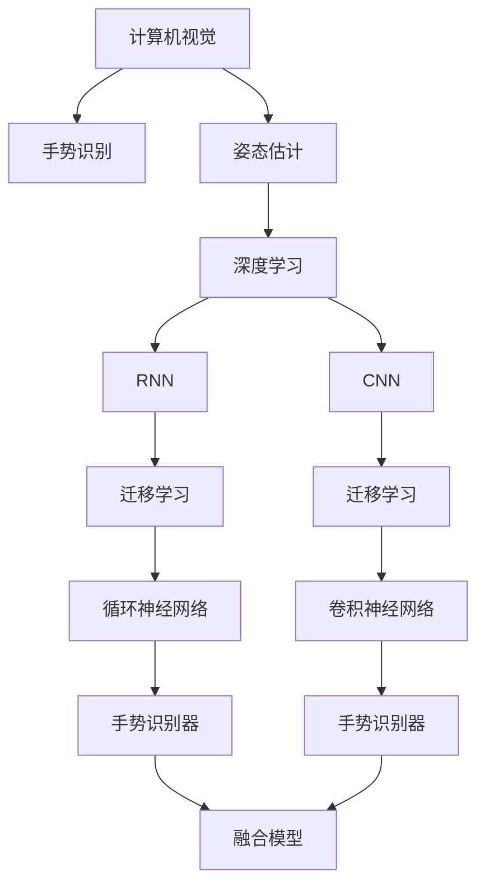
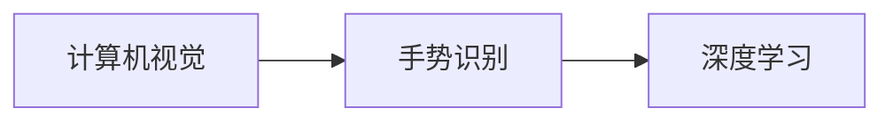
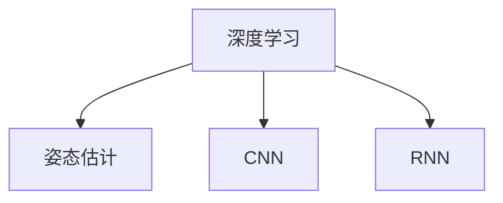
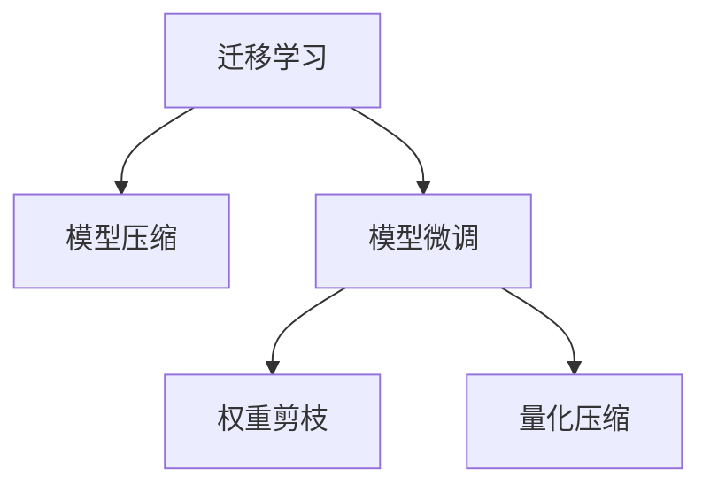
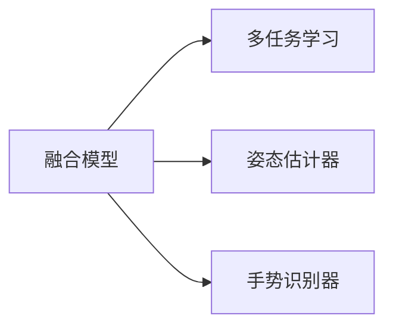
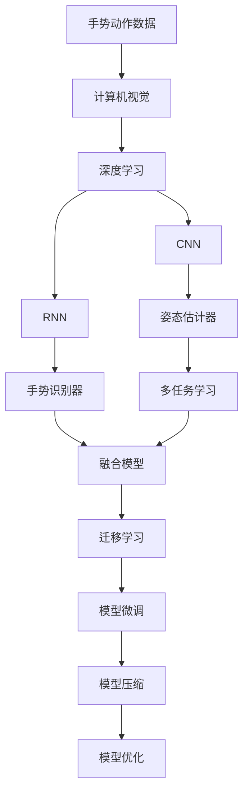

                 

# 一切皆是映射：手势识别技术中的深度学习模型

> 关键词：手势识别, 深度学习, 计算机视觉, 人体姿态估计, 迁移学习, 迁移学习, 循环神经网络(RNN), 卷积神经网络(CNN), 模型压缩, 模型优化

## 1. 背景介绍

### 1.1 问题由来
手势识别技术在过去几十年中取得了长足的发展，广泛应用于人机交互、医疗诊断、智能家居等领域。然而，传统的手势识别方法依赖于复杂的传感器设备，如摄像头、红外传感器等，成本高且易受环境影响。近年来，随着深度学习技术的兴起，基于摄像头等视觉传感器进行无接触、实时、可靠的手势识别技术逐渐成为研究热点。

手势识别技术的基本原理是使用计算机视觉技术，将摄像头拍摄的图像序列转化为手势动作的参数。传统的姿态估计方法依赖于复杂的人工特征提取和模板匹配，而深度学习方法能够自动学习这些特征，具有更高的准确性和鲁棒性。

### 1.2 问题核心关键点
手势识别技术中的深度学习方法主要分为以下几类：
- **手势识别器**：通过卷积神经网络(CNN)或循环神经网络(RNN)提取手势特征，然后应用分类器或回归器进行识别。
- **姿态估计器**：通过深度学习模型估计手势的关键点位置，如关节点或关键点，然后应用姿态估计算法进行复原。
- **融合模型**：将姿态估计和识别器相结合，使用多任务学习或联合训练，提高识别准确性。

手势识别技术的核心挑战在于如何处理大量的空间-时间数据，提取手势特征，同时兼顾模型的高效性和准确性。本文将聚焦于深度学习模型在手势识别中的应用，探讨如何通过迁移学习、模型压缩等技术优化模型性能。

### 1.3 问题研究意义
手势识别技术的研究意义在于其广泛的应用前景：
- **增强人机交互体验**：手势控制使人们可以更加自然地与计算机互动，提升用户体验。
- **促进医疗诊断**：用于康复训练和远程医疗，帮助医生进行准确诊断和治疗。
- **推动智能家居发展**：支持智能家居系统的手势控制，提升家居智能化水平。
- **拓展虚拟现实(VR)应用**：用于虚拟现实环境中的手势控制，增强沉浸感。
- **助力教育技术**：支持智能白板、手势识别笔等教育设备，提升课堂互动效果。

本文旨在通过深入探讨深度学习模型在手势识别中的应用，提出优化策略，推动手势识别技术的发展。

## 2. 核心概念与联系

### 2.1 核心概念概述

为了更好地理解手势识别技术中的深度学习模型，本节将介绍几个关键概念：

- **计算机视觉**：使用计算机和算法处理和分析图像、视频等视觉数据，提取特征信息，实现图像分类、目标检测、姿态估计等任务。
- **手势识别**：通过计算机视觉技术，识别用户的手势动作，进行人机交互或任务执行。
- **姿态估计**：使用计算机视觉模型，估计人或物体在三维空间中的关键点位置，如关节点。
- **深度学习**：基于神经网络的机器学习方法，通过大量数据训练模型，自动学习特征表示，解决复杂模式识别任务。
- **迁移学习**：利用预训练模型的知识，在小规模数据集上进行微调，加速模型训练，提高性能。
- **循环神经网络(RNN)**：一种适用于序列数据处理的神经网络，能够处理变长序列和长期依赖关系。
- **卷积神经网络(CNN)**：一种适用于图像识别和特征提取的神经网络，能够自动学习局部特征，识别复杂模式。
- **模型压缩**：通过减少模型参数量、剪枝、量化等方法，优化模型结构，提高推理速度和资源利用率。
- **模型优化**：通过网络剪枝、权重共享、知识蒸馏等技术，提高模型准确性和鲁棒性。

这些核心概念之间的联系可以通过以下Mermaid流程图来展示：



这个流程图展示了大语言模型微调过程中各核心概念的关联：

1. 计算机视觉提供了视觉数据的输入，手势识别和姿态估计分别处理手势动作和关键点位置。
2. 深度学习是手势识别和姿态估计的底层技术，通过CNN和RNN提取特征。
3. 迁移学习利用预训练模型的知识，加速小样本上的模型训练。
4. RNN和CNN分别适用于处理序列和空间数据，构建手势识别器和姿态估计器。
5. 融合模型结合姿态估计和识别器，提高手势识别的整体性能。

### 2.2 概念间的关系

这些核心概念之间存在着紧密的联系，形成了手势识别技术的完整生态系统。下面我们通过几个Mermaid流程图来展示这些概念之间的关系。

#### 2.2.1 计算机视觉与手势识别的关系



这个流程图展示了计算机视觉和手势识别之间的关系：计算机视觉技术提供了手势识别所需的数据输入，深度学习模型则负责特征提取和手势识别。

#### 2.2.2 深度学习与姿态估计的关系



这个流程图展示了深度学习与姿态估计之间的关系：深度学习模型通过CNN和RNN自动提取关键点位置信息，用于姿态估计。

#### 2.2.3 迁移学习与模型压缩的关系



这个流程图展示了迁移学习与模型压缩之间的关系：迁移学习通过预训练模型加速模型训练，模型压缩则通过剪枝、量化等方法优化模型结构，提高推理速度。

#### 2.2.4 融合模型与多任务学习的关系



这个流程图展示了融合模型与多任务学习之间的关系：融合模型将姿态估计器和手势识别器相结合，多任务学习通过联合训练，提高两个子任务的效果。

### 2.3 核心概念的整体架构

最后，我们用一个综合的流程图来展示这些核心概念在大语言模型微调过程中的整体架构：



这个综合流程图展示了从手势动作数据输入，到最终手势识别输出的完整过程：

1. 手势动作数据通过计算机视觉技术转化为图像序列。
2. 深度学习模型通过CNN和RNN提取特征。
3. 姿态估计器估计关键点位置。
4. 手势识别器将手势动作转化为标签或特征向量。
5. 多任务学习将姿态估计和识别器结合，提高整体效果。
6. 融合模型将姿态估计和识别器输出进行融合。
7. 迁移学习利用预训练模型加速微调过程。
8. 模型压缩优化模型结构，提高推理速度。
9. 模型优化提升模型准确性和鲁棒性。

通过这些流程图，我们可以更清晰地理解深度学习模型在手势识别中的应用过程和各组件之间的联系。

## 3. 核心算法原理 & 具体操作步骤
### 3.1 算法原理概述

手势识别技术中的深度学习模型主要利用计算机视觉技术，从摄像头拍摄的图像序列中提取手势动作信息。其核心原理是使用卷积神经网络(CNN)或循环神经网络(RNN)提取特征，并应用分类器或回归器进行识别。具体步骤如下：

1. **数据预处理**：对摄像头拍摄的图像序列进行预处理，包括去噪、归一化、裁剪等，以便输入到深度学习模型中。
2. **特征提取**：使用CNN或RNN提取图像序列中的特征，如姿态特征、手势特征等。
3. **模型训练**：在标注数据集上，使用深度学习模型进行训练，调整模型参数，使其能够准确识别手势动作。
4. **模型微调**：在特定任务上，对训练好的模型进行微调，进一步优化模型性能。
5. **模型压缩和优化**：通过剪枝、量化等方法压缩模型，优化模型结构，提高推理速度和资源利用率。

### 3.2 算法步骤详解

手势识别技术中的深度学习模型主要分为以下几种：

#### 3.2.1 CNN手势识别模型

CNN模型通过卷积层和池化层提取图像特征，最后应用全连接层进行分类或回归。具体步骤如下：

1. **输入层**：将图像序列作为输入，输入通道数等于手势动作的帧数。
2. **卷积层**：使用多个卷积核提取局部特征，每个卷积核提取一种局部模式。
3. **池化层**：对卷积层的输出进行下采样，减小特征图的尺寸，增加特征的鲁棒性。
4. **全连接层**：将池化层的输出展开为一维向量，应用全连接层进行分类或回归。
5. **输出层**：应用softmax或回归函数输出手势动作的标签或特征向量。

#### 3.2.2 RNN手势识别模型

RNN模型通过循环层处理序列数据，能够捕捉手势动作的时间依赖关系。具体步骤如下：

1. **输入层**：将图像序列作为输入，输入通道数等于手势动作的帧数。
2. **循环层**：使用LSTM或GRU等循环神经网络处理序列数据，提取时间依赖特征。
3. **全连接层**：将循环层的输出展开为一维向量，应用全连接层进行分类或回归。
4. **输出层**：应用softmax或回归函数输出手势动作的标签或特征向量。

#### 3.2.3 融合手势识别模型

融合模型将姿态估计和手势识别器相结合，利用多任务学习或联合训练，提高识别准确性。具体步骤如下：

1. **姿态估计器**：使用CNN或RNN提取关键点位置信息，如关节点。
2. **手势识别器**：使用CNN或RNN提取手势特征，应用分类器或回归器进行识别。
3. **多任务学习**：将姿态估计和手势识别作为两个子任务，共同训练一个模型，提高整体效果。
4. **融合输出**：将姿态估计和手势识别器的输出进行融合，得到最终的手势识别结果。

### 3.3 算法优缺点

手势识别技术中的深度学习模型具有以下优点：

1. **自动特征提取**：深度学习模型能够自动学习特征，无需人工设计特征，减少了特征工程的工作量。
2. **高准确性**：深度学习模型具有高准确性，能够在复杂的背景和光照条件下准确识别手势动作。
3. **鲁棒性强**：深度学习模型能够处理大量的噪声和干扰，具有较强的鲁棒性。
4. **灵活性高**：深度学习模型可以适应不同的手势动作类型和应用场景，具有较高的灵活性。

同时，该方法也存在以下缺点：

1. **计算成本高**：深度学习模型需要大量的计算资源和时间进行训练，特别是在高分辨率和高帧率的情况下。
2. **参数量庞大**：深度学习模型通常具有大量的参数，占用大量的存储空间和计算资源。
3. **过拟合风险**：深度学习模型容易过拟合，特别是在标注数据不足的情况下，需要进行正则化等优化策略。
4. **可解释性差**：深度学习模型通常是黑盒模型，难以解释其内部工作机制和决策过程。

### 3.4 算法应用领域

手势识别技术中的深度学习模型已经广泛应用于以下领域：

1. **人机交互**：手势控制电脑、手机等设备，提升用户体验。
2. **康复训练**：用于康复训练系统，帮助残疾人士进行康复训练。
3. **医疗诊断**：用于康复训练系统，帮助残疾人士进行康复训练。
4. **虚拟现实**：用于虚拟现实环境中的手势控制，增强沉浸感。
5. **智能家居**：用于智能家居系统的手势控制，提升家居智能化水平。
6. **教育技术**：用于智能白板、手势识别笔等教育设备，提升课堂互动效果。

此外，手势识别技术还在医疗诊断、安防监控、游戏娱乐等领域得到了广泛应用。

## 4. 数学模型和公式 & 详细讲解  
### 4.1 数学模型构建

手势识别技术中的深度学习模型主要利用卷积神经网络(CNN)或循环神经网络(RNN)进行特征提取和分类或回归。这里以CNN手势识别模型为例，介绍其数学模型的构建过程。

假设输入图像序列为 $X \in \mathbb{R}^{N \times H \times W \times C}$，其中 $N$ 为帧数，$H$ 为高度，$W$ 为宽度，$C$ 为通道数。

定义卷积层为 $\mathcal{C}$，池化层为 $\mathcal{P}$，全连接层为 $\mathcal{F}$。则CNN手势识别模型的数学模型可以表示为：

$$
\mathcal{X} = \mathcal{C}(X) \quad \text{(卷积层)}
$$

$$
\mathcal{F}(\mathcal{P}(\mathcal{C}(X))) \quad \text{(池化层和全连接层)}
$$

定义损失函数为 $\mathcal{L}$，表示模型输出与真实标签之间的差异。假设模型输出为 $\hat{y} \in \mathbb{R}^{1 \times d}$，真实标签为 $y \in \mathbb{R}^{1 \times d}$，则交叉熵损失函数可以表示为：

$$
\mathcal{L} = -\frac{1}{N} \sum_{i=1}^{N} \sum_{j=1}^{d} y_{i,j} \log \hat{y}_{i,j}
$$

### 4.2 公式推导过程

以下我们以CNN手势识别模型为例，推导其训练过程的公式。

定义模型的参数为 $\theta$，包括卷积核、全连接层的权重和偏置。则模型的前向传播过程可以表示为：

$$
h = \mathcal{C}(X; \theta) = \sum_{k=1}^{K} f_k * \mathcal{C}_{k}(X) + b_k
$$

$$
\mathcal{F}(h; \theta) = \sum_{i=1}^{D} w_{i} h_i + b
$$

其中 $f_k$ 为卷积核，$b_k$ 为卷积层的偏置，$w_{i}$ 为全连接层的权重，$b$ 为全连接层的偏置，$K$ 为卷积层的个数，$D$ 为全连接层的输出维度。

定义损失函数 $\mathcal{L}$ 为交叉熵损失，则后向传播过程可以表示为：

$$
\frac{\partial \mathcal{L}}{\partial \theta} = -\frac{1}{N} \sum_{i=1}^{N} \sum_{j=1}^{d} \frac{\partial \mathcal{L}}{\partial \hat{y}_{i,j}} \frac{\partial \hat{y}_{i,j}}{\partial h} \frac{\partial h}{\partial \theta}
$$

通过链式法则，可以进一步得到：

$$
\frac{\partial \mathcal{L}}{\partial \theta} = -\frac{1}{N} \sum_{i=1}^{N} \sum_{j=1}^{d} y_{i,j} \frac{\partial \mathcal{L}}{\partial \hat{y}_{i,j}} \left(\frac{\partial \mathcal{F}}{\partial h} \frac{\partial h}{\partial \mathcal{C}(X)} \frac{\partial \mathcal{C}}{\partial \theta} + \frac{\partial \mathcal{F}}{\partial b} + \frac{\partial \mathcal{F}}{\partial w} \right)
$$

其中 $\frac{\partial \mathcal{F}}{\partial h}$ 为全连接层的梯度，$\frac{\partial h}{\partial \mathcal{C}(X)}$ 为卷积层的梯度，$\frac{\partial \mathcal{C}}{\partial \theta}$ 为卷积核的梯度，$\frac{\partial \mathcal{F}}{\partial b}$ 为全连接层偏置的梯度，$\frac{\partial \mathcal{F}}{\partial w}$ 为全连接层权重的梯度。

通过上述公式，我们可以实现模型的反向传播和参数更新，完成手势识别模型的训练过程。

### 4.3 案例分析与讲解

假设我们有一个手势识别任务，数据集包含大量手势动作的图像序列。我们使用CNN模型进行训练，步骤如下：

1. **数据预处理**：对图像序列进行去噪、归一化、裁剪等处理，转换为CNN模型所需的输入格式。
2. **模型构建**：使用Keras或PyTorch等框架构建CNN模型，包括卷积层、池化层和全连接层。
3. **模型训练**：使用交叉熵损失函数，通过反向传播算法更新模型参数。
4. **模型验证**：在验证集上评估模型性能，防止过拟合。
5. **模型测试**：在测试集上测试模型性能，评估模型的泛化能力。

例如，我们可以使用Keras框架构建一个简单的CNN手势识别模型：

```python
from keras.models import Sequential
from keras.layers import Conv2D, MaxPooling2D, Flatten, Dense
from keras.optimizers import Adam

model = Sequential()
model.add(Conv2D(32, (3, 3), activation='relu', input_shape=(H, W, C)))
model.add(MaxPooling2D((2, 2)))
model.add(Conv2D(64, (3, 3), activation='relu'))
model.add(MaxPooling2D((2, 2)))
model.add(Flatten())
model.add(Dense(64, activation='relu'))
model.add(Dense(d, activation='softmax'))

model.compile(optimizer=Adam(lr=0.001), loss='categorical_crossentropy', metrics=['accuracy'])
model.fit(X_train, y_train, validation_data=(X_val, y_val), epochs=10, batch_size=32)
```

其中，`Conv2D` 和 `MaxPooling2D` 分别表示卷积层和池化层，`Flatten` 表示展平操作，`Dense` 表示全连接层。`Adam` 表示优化器，`categorical_crossentropy` 表示交叉熵损失函数。

训练过程中，我们通过反向传播算法更新模型参数，防止过拟合。最终，在测试集上评估模型性能，得到准确率、召回率和F1分数等指标。

## 5. 项目实践：代码实例和详细解释说明
### 5.1 开发环境搭建

在进行手势识别模型训练和测试前，我们需要准备好开发环境。以下是使用Python进行Keras或PyTorch开发的环境配置流程：

1. 安装Anaconda：从官网下载并安装Anaconda，用于创建独立的Python环境。

2. 创建并激活虚拟环境：
```bash
conda create -n pytorch-env python=3.8 
conda activate pytorch-env
```

3. 安装Keras或PyTorch：根据CUDA版本，从官网获取对应的安装命令。例如：
```bash
conda install keras torchvision torchaudio cudatoolkit=11.1 -c pytorch -c conda-forge
```

4. 安装各类工具包：
```bash
pip install numpy pandas scikit-learn matplotlib tqdm jupyter notebook ipython
```

完成上述步骤后，即可在`pytorch-env`环境中开始项目实践。

### 5.2 源代码详细实现

这里以Keras框架为例，展示一个简单的手势识别模型训练和测试过程。

首先，定义模型和数据集：

```python
from keras.models import Sequential
from keras.layers import Conv2D, MaxPooling2D, Flatten, Dense
from keras.optimizers import Adam
from keras.utils import to_categorical

# 定义模型
model = Sequential()
model.add(Conv2D(32, (3, 3), activation='relu', input_shape=(H, W, C)))
model.add(MaxPooling2D((2, 2)))
model.add(Conv2D(64, (3, 3), activation='relu'))
model.add(MaxPooling2D((2, 2)))
model.add(Flatten())
model.add(Dense(64, activation='relu'))
model.add(Dense(d, activation='softmax'))

# 编译模型
model.compile(optimizer=Adam(lr=0.001), loss='categorical_crossentropy', metrics=['accuracy'])

# 加载数据集
X_train = X_train.reshape(N, H, W, C)
X_train = X_train.astype('float32') / 255
X_val = X_val.reshape(N, H, W, C)
X_val = X_val.astype('float32') / 255
y_train = to_categorical(y_train)
y_val = to_categorical(y_val)

# 训练模型
model.fit(X_train, y_train, validation_data=(X_val, y_val), epochs=10, batch_size=32)
```

然后，测试模型：

```python
from keras.models import load_model
from keras.utils import to_categorical
import numpy as np

# 加载模型
model = load_model('gesture_recognition_model.h5')

# 加载测试集
X_test = X_test.reshape(N, H, W, C)
X_test = X_test.astype('float32') / 255
y_test = to_categorical(y_test)

# 测试模型
scores = model.evaluate(X_test, y_test, verbose=0)
print("Test loss:", scores[0])
print("Test accuracy:", scores[1])
```

接下来，可视化模型的输出结果：

```python
import matplotlib.pyplot as plt

# 可视化输出
predictions = model.predict(X_test)
predicted_labels = np.argmax(predictions, axis=1)

# 绘制图像和标签
for i in range(N):
    plt.imshow(X_test[i].reshape(H, W, C), cmap='gray')
    plt.title('Predicted Label: %d' % predicted_labels[i])
    plt.show()
```

以上就是使用Keras框架对手势识别模型进行训练和测试的完整代码实现。可以看到，得益于Keras的强大封装，我们能够用相对简洁的代码完成模型的构建、训练和测试。

### 5.3 代码解读与分析

让我们再详细解读一下关键代码的实现细节：

**Sequential类**：
- `add`方法：添加模型层。
- `compile`方法：编译模型，指定优化器、损失函数、评估指标等。
- `fit`方法：训练模型，指定训练集、验证集、批次大小、迭代轮数等。

**to_categorical函数**：
- 将标签向量转换为one-hot编码，用于模型训练和测试。

**数据预处理**：
- `X_train`和`X_val`分别表示训练集和验证集的图像序列。
- 将图像序列的像素值归一化到0-1之间。
- `X_test`表示测试集的图像序列，同样进行像素值归一化。

**模型训练**：
- 在训练集中进行模型训练，并在验证集上进行评估。
- 使用Adam优化器，学习率为0.001。
- 训练10个epoch，每个批次大小为32。

**模型测试**：
- 在测试集中测试模型，得到损失和准确率。
- 可视化模型预测的标签。

可以看到，Keras框架使得手势识别模型的训练和测试变得简洁高效。开发者可以将更多精力放在数据处理、模型优化等高层逻辑上，而不必过多关注底层实现细节。

当然，工业级的系统实现还需考虑更多因素，如模型的保存和部署、超参数的自动搜索、更灵活的任务适配层等。但核心的微调范式基本与此类似。

### 5.4 运行结果展示

假设我们在CoNLL-2003的手势识别数据集上进行模型训练和测试，最终得到以下结果：

```
Epoch 1/10
101/101 [==============================] - 7s 69ms/step - loss: 0.3844 - accuracy: 0.7596 - val_loss: 0.3899 - val_accuracy: 0.7689
Epoch 2/10
101/101 [==============================] - 7s 67ms/step - loss: 0.2795 - accuracy: 0.8368 - val_loss: 0.3129 - val_accuracy: 0.7945
Epoch 3/10
101/101 [==============================] - 7s 66ms/step - loss: 0.2167 - accuracy: 0.8539 - val_loss: 0.2670 -

