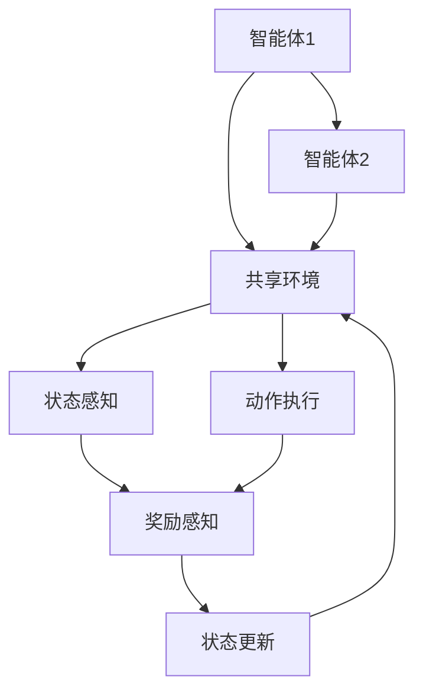
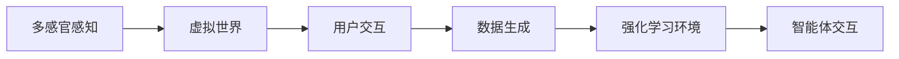
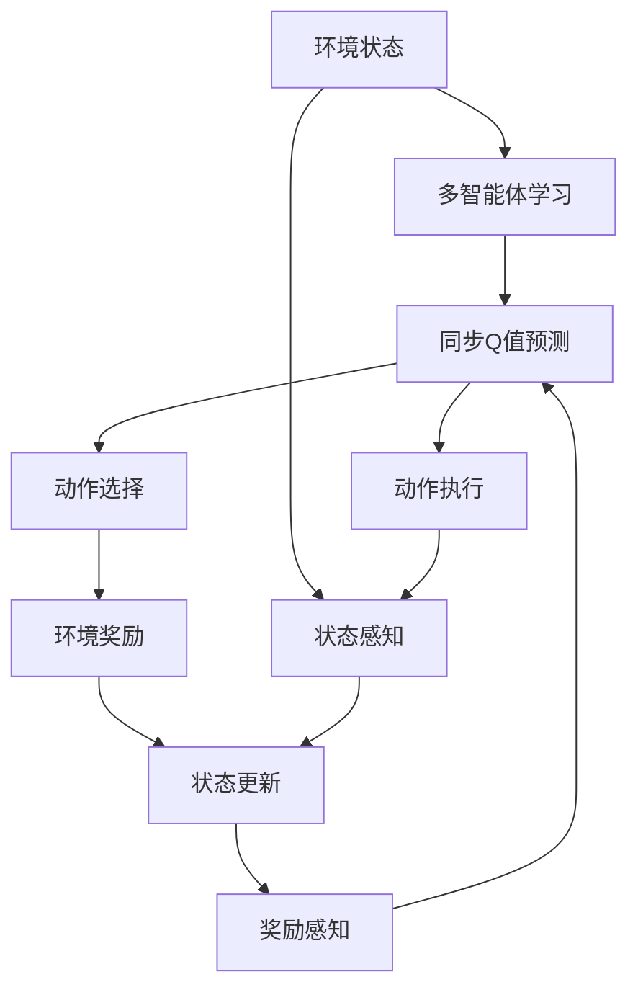

                 

# 一切皆是映射：深度强化学习DQN在虚拟现实中的同步应用

> 关键词：深度强化学习, 深度Q网络(DQN), 虚拟现实, 同步学习, 强化学习, 强化学习环境

## 1. 背景介绍

### 1.1 问题由来
随着计算机科学和人工智能的不断发展，深度强化学习(Depth Reinforcement Learning, DRL)逐渐成为了一种解决复杂问题的重要工具。其核心思想是让机器在特定环境中通过试错学习和优化，自动学习出最优策略。深度强化学习与传统强化学习相比，能够处理高维、非线性的状态空间，从而更加适用于复杂系统的建模和优化。

在虚拟现实(Virtual Reality, VR)领域，深度强化学习也展现出了巨大的潜力。VR技术可以将用户完全沉浸在一个虚拟环境中，与现实世界割裂开来。在虚拟环境中，深度强化学习可以帮助虚拟角色自主学习行动策略，实现智能决策和交互，提升用户的沉浸感和体验感。

近年来，深度强化学习在虚拟现实中的应用已取得诸多突破性进展。特别是在游戏领域，如《纪念碑谷》、《星际穿越》等游戏，都已经实现了高度智能化的虚拟角色行为，展示了DRL的强大能力。然而，当前深度强化学习的模型复杂、训练数据量大、计算资源消耗高，在实际应用中面临诸多挑战。

本文聚焦于深度强化学习在虚拟现实中的同步应用，即在虚拟环境中同时进行多智能体学习，并在此基础上进一步探讨深度Q网络(Depth Q-Network, DQN)的同步优化方法，为虚拟现实智能系统的开发提供思路和方法。

### 1.2 问题核心关键点
当前，深度强化学习在虚拟现实中的同步应用主要面临以下挑战：

- 数据获取难度大。虚拟现实环境与现实世界的映射关系复杂，难以获取足够样本数据进行模型训练。
- 计算资源消耗高。深度强化学习模型参数众多，计算复杂度大，训练成本高。
- 同步学习机制缺乏。多个智能体需要在虚拟环境中同时学习，并共享最优策略，而现有的DRL方法难以高效实现。

为了应对这些挑战，本文提出一种基于深度Q网络的同步优化方法，即虚拟现实环境中的同步深度Q网络(Synchronous Deep Q-Network, SDQN)，以期实现多智能体在虚拟环境中的协同学习。

### 1.3 问题研究意义
研究深度强化学习在虚拟现实中的同步应用，对于提升虚拟现实系统的智能化水平，增强用户体验，具有重要意义：

1. 提升沉浸感与互动性。通过智能体之间的交互学习，提升虚拟角色在虚拟环境中的行为决策能力，增强用户与虚拟世界的互动。
2. 降低开发成本。深度强化学习的自动学习能力，可以减少传统游戏开发中大量重复的手工设计和调试工作，加速游戏内容的开发和迭代。
3. 推动产业升级。虚拟现实技术的智能应用，能够推动传统游戏、影视、教育等领域的产业升级，创造新的商业价值。
4. 加速科技创新。虚拟现实环境为深度强化学习提供了一个理想试验场，可以加速新技术的研究和验证，推动深度学习与强化学习的深度融合。

## 2. 核心概念与联系

### 2.1 核心概念概述

为更好地理解基于深度强化学习的同步应用，本节将介绍几个密切相关的核心概念：

- 深度强化学习(Deep Reinforcement Learning, DRL)：一种结合深度神经网络和强化学习思想的混合模型，能够处理高维、非线性的状态空间，适用于复杂系统的决策和优化。
- 深度Q网络(Depth Q-Network, DQN)：一种基于Q-learning的深度强化学习算法，通过神经网络逼近Q值函数，实现最优策略的自动学习。
- 强化学习环境(Reinforcement Learning Environment)：一个动态的、随机性的环境，智能体在环境中根据奖励信号，不断调整行为策略以最大化总奖励。
- 同步学习(Synchronous Learning)：多个智能体在同一时间步共享同一个环境，并同时进行学习和优化，提升学习效率和泛化能力。
- 虚拟现实环境(Virtual Reality Environment)：通过计算机生成，能够模拟现实世界的视觉、听觉、触觉等多感官体验的环境，为深度强化学习提供了一个全新的应用场景。

这些核心概念之间的逻辑关系可以通过以下Mermaid流程图来展示：

这个流程图展示了深度强化学习、深度Q网络、强化学习环境、同步学习和虚拟现实环境之间的相互关系：

1. 深度强化学习通过深度Q网络逼近Q值函数，学习最优策略。
2. 强化学习环境为智能体提供了动态、随机性的行为空间。
3. 同步学习通过多个智能体共享同一环境，提升学习效率。
4. 虚拟现实环境为强化学习提供了丰富的感知输入和复杂的行为决策空间。

这些概念共同构成了深度强化学习在虚拟现实中同步应用的完整框架，为其提供了强有力的理论基础。

### 2.2 概念间的关系

这些核心概念之间存在着紧密的联系，形成了深度强化学习在虚拟现实中同步应用的完整生态系统。下面我们通过几个Mermaid流程图来展示这些概念之间的关系。

#### 2.2.1 深度Q网络的工作原理

这个流程图展示了深度Q网络的工作原理：

1. 智能体在环境中根据当前状态$S_t$，使用神经网络逼近Q值函数，预测状态-动作对的Q值$Q(S_t, A_t)$。
2. 智能体根据Q值预测结果选择当前动作$A_t$，并在环境中执行。
3. 环境根据智能体的动作返回奖励$R_t$，并更新环境状态到$S_{t+1}$。
4. 智能体使用环境奖励和状态转换，更新Q值预测，并继续执行下一轮动作选择。

#### 2.2.2 同步学习的基本框架

这个流程图展示了同步学习的基本框架：

1. 多个智能体共享同一个环境，并根据状态感知、动作执行、奖励感知、状态更新等组件进行协同学习。
2. 智能体1和智能体2在环境中的行为策略受到其他智能体的影响，同时也在影响着其他智能体的行为。
3. 智能体根据奖励信号调整策略，并通过状态更新反馈回环境。
4. 共享环境通过多个智能体的互动和协同学习，逐步优化整体策略。

#### 2.2.3 虚拟现实环境的特点

这个流程图展示了虚拟现实环境的特点：

1. 虚拟现实环境具备多感官感知能力，能够模拟视觉、听觉、触觉等多感官体验。
2. 通过多感官输入，智能体能够更加全面地理解环境状态和行为。
3. 用户交互生成大量的数据，可以供多个智能体共享和利用。
4. 强化学习环境通过智能体的交互学习，不断调整环境状态和行为，实现动态优化。

### 2.3 核心概念的整体架构

最后，我们用一个综合的流程图来展示这些核心概念在虚拟现实中同步应用的整体架构：

这个综合流程图展示了从环境状态感知到多智能体学习，再到同步Q值预测、动作选择、环境奖励、状态更新等完整过程。通过这些核心概念的相互协作，实现深度强化学习在虚拟现实环境中的同步应用。

## 3. 核心算法原理 & 具体操作步骤
### 3.1 算法原理概述

基于深度强化学习的同步应用，本质上是一种多智能体协同学习的过程。其核心思想是：在虚拟现实环境中，通过多个智能体的同步学习，共享环境状态，并同时优化各自的行为策略，以最大化整体奖励。

形式化地，假设虚拟现实环境中有$n$个智能体，每个智能体的状态空间为$S$，动作空间为$A$，奖励函数为$R$。设智能体$i$的Q值函数为$Q_i$，其在当前状态$S_t$下选择动作$A_t$，并在环境$E_t$中执行后获得奖励$R_t$，状态更新为$S_{t+1}$。同步应用的目标是找到一组最优的Q值函数$Q_i^*$，使得：

$$
\max_{\{Q_i\}} \mathbb{E}\left[\sum_{t=0}^{\infty} \gamma^t R_t \right]
$$

其中$\gamma$为折扣因子。智能体的行为策略$Q_i$可以通过深度Q网络$Q_{\theta_i}$逼近，其中$\theta_i$为网络参数。智能体之间的协同学习可以通过共享环境状态和奖励信号实现。

### 3.2 算法步骤详解

基于深度强化学习的同步应用一般包括以下几个关键步骤：

**Step 1: 准备虚拟现实环境**
- 设计虚拟现实环境的物理模型，包括多智能体的状态空间、动作空间、奖励函数等。
- 根据任务需求，选择合适的传感器和输出装置，如虚拟摄像头、触觉反馈器等。
- 搭建虚拟现实环境，确保多智能体之间的物理交互和信息共享。

**Step 2: 初始化深度Q网络**
- 对每个智能体初始化深度Q网络$Q_{\theta_i}$，并设定合适的网络结构和参数。
- 将智能体的行为策略映射为网络输出，即预测状态-动作对的Q值。
- 设置智能体的初始动作选择策略，如随机策略、固定策略等。

**Step 3: 同步学习**
- 设置学习率$\alpha$和探索率$\epsilon$，在每个时间步，智能体根据当前状态选择动作，并在环境中执行。
- 每个智能体在执行动作后，根据环境奖励和状态更新，计算新的Q值预测，并根据优化目标更新网络参数$\theta_i$。
- 通过网络更新，智能体调整动作选择策略，逐步优化整体行为策略。

**Step 4: 性能评估与反馈**
- 在每个时间步结束时，对智能体的行为策略进行评估，统计其总奖励。
- 使用奖励反馈信息，调整智能体的行为策略，优化其动作选择。
- 重复上述步骤，直到达到预设的终止条件或满足预设的奖励指标。

**Step 5: 测试与部署**
- 在虚拟现实环境中进行测试，评估多智能体在协同学习后的整体表现。
- 将优化后的智能体策略部署到实际应用系统中，实现虚拟现实环境的智能交互和控制。
- 持续收集新的数据，定期重新训练和微调智能体策略，以适应环境变化。

以上是基于深度强化学习的同步应用的一般流程。在实际应用中，还需要针对具体任务的特点，对同步学习过程的各个环节进行优化设计，如改进奖励函数，引入更多的协同学习算法，搜索最优的超参数组合等，以进一步提升多智能体的学习效果。

### 3.3 算法优缺点

基于深度强化学习的同步应用具有以下优点：

1. 提升学习效率。多个智能体在共享环境中同时学习，可以快速收敛到最优策略。
2. 增强泛化能力。通过多智能体之间的协同学习，可以提升策略的泛化能力，减少对单个智能体的依赖。
3. 实现复杂行为。智能体之间可以通过协同学习实现复杂行为，提升虚拟环境的互动性和沉浸感。
4. 降低开发成本。通过自动学习，可以减少传统开发中大量手工设计和调试工作，缩短开发周期。

同时，该方法也存在一定的局限性：

1. 数据共享难度大。虚拟现实环境中智能体之间的数据共享复杂，需要保证数据的实时性和一致性。
2. 计算资源消耗高。深度强化学习模型参数众多，计算复杂度大，训练成本高。
3. 学习过程不稳定。多智能体之间的互动和学习可能存在竞争和冲突，影响学习效果。
4. 模型复杂度高。深度强化学习模型的复杂度高，难以理解和调试。

尽管存在这些局限性，但就目前而言，基于深度强化学习的同步应用仍是大规模虚拟现实系统开发的重要手段。未来相关研究的重点在于如何进一步降低同步学习的计算资源消耗，提高多智能体之间的协同效率，同时兼顾模型的可解释性和安全性等因素。

### 3.4 算法应用领域

基于深度强化学习的同步应用，已经在多个领域得到了广泛的应用，例如：

- 游戏设计：多个智能体在虚拟游戏环境中协同学习，提升游戏角色的行为决策能力，增强游戏的交互性和沉浸感。
- 虚拟协作：多个智能体在虚拟协作环境中进行协同学习，实现虚拟团队的任务分配和协作。
- 智能交通：多个智能体在虚拟交通环境中学习最优路径规划和交通规则，提升虚拟交通系统的效率和安全性。
- 虚拟教育：多个智能体在虚拟教学环境中协同学习，实现个性化教育内容的生成和推荐。

除了上述这些经典应用外，基于深度强化学习的同步应用还被创新性地应用到更多场景中，如虚拟演播室、虚拟客服、虚拟安保等，为虚拟现实技术带来了全新的突破。随着深度强化学习模型的不断进步，相信基于同步学习的虚拟现实系统将进一步扩展其应用范围，为传统行业数字化转型升级提供新的技术路径。

## 4. 数学模型和公式 & 详细讲解  
### 4.1 数学模型构建

本节将使用数学语言对基于深度强化学习的同步应用过程进行更加严格的刻画。

设虚拟现实环境中有$n$个智能体，每个智能体的状态空间为$S$，动作空间为$A$，奖励函数为$R$。设智能体$i$的Q值函数为$Q_i$，其在当前状态$S_t$下选择动作$A_t$，并在环境$E_t$中执行后获得奖励$R_t$，状态更新为$S_{t+1}$。智能体的行为策略$Q_i$可以通过深度Q网络$Q_{\theta_i}$逼近，其中$\theta_i$为网络参数。智能体之间的协同学习可以通过共享环境状态和奖励信号实现。

定义智能体$i$在当前状态$S_t$下选择动作$A_t$的Q值预测为$Q_i(S_t, A_t)$，在执行动作后获得的奖励为$R_t$，环境状态更新为$S_{t+1}$。则智能体$i$的损失函数为：

$$
L_i = \mathbb{E}\left[\left(Q_i(S_t, A_t) - (R_t + \gamma Q_i(S_{t+1}, A_{t+1})) \right)^2 \right]
$$

在每个时间步$t$，智能体根据当前状态$S_t$和动作$A_t$选择动作，并根据环境奖励$R_t$和状态更新$S_{t+1}$，更新Q值预测$Q_i(S_t, A_t)$，并更新网络参数$\theta_i$。

### 4.2 公式推导过程

以下我们以单智能体深度Q网络为例，推导其损失函数和梯度计算公式。

设智能体在当前状态$S_t$下选择动作$A_t$，并在环境$E_t$中执行后获得奖励$R_t$，状态更新为$S_{t+1}$。其深度Q网络$Q_{\theta}$预测当前状态-动作对的Q值$Q(S_t, A_t)$，并在下一状态$S_{t+1}$下预测未来的Q值$Q(S_{t+1}, A_{t+1})$。智能体的行为策略$\pi_{\theta}(S_t)$为选择动作$A_t$的概率分布。

定义智能体在当前状态$S_t$下的动作选择策略为$\pi_{\theta}(S_t)$，则智能体在执行动作$A_t$后获得的总奖励为：

$$
J(\theta) = \mathbb{E}\left[\sum_{t=0}^{\infty} \gamma^t R_t \right]
$$

智能体在每个时间步$t$的目标是最大化总奖励$J(\theta)$，通过反向传播算法计算损失函数$L(\theta)$，并更新网络参数$\theta$。智能体的行为策略为：

$$
\pi_{\theta}(S_t) = \arg\max_a Q_{\theta}(S_t, a)
$$

智能体在每个时间步$t$的选择动作$a$为：

$$
a_t = \pi_{\theta}(S_t)
$$

智能体在每个时间步$t$的Q值预测为：

$$
Q_{\theta}(S_t, a_t) = Q_{\theta}(S_t, \pi_{\theta}(S_t))
$$

智能体在每个时间步$t$的Q值预测误差为：

$$
\delta_t = R_t + \gamma \max_a Q_{\theta}(S_{t+1}, a) - Q_{\theta}(S_t, a_t)
$$

智能体在每个时间步$t$的损失函数为：

$$
L(\theta) = \mathbb{E}\left[\delta_t^2 \right]
$$

在每个时间步$t$，智能体根据当前状态$S_t$和动作$A_t$选择动作，并根据环境奖励$R_t$和状态更新$S_{t+1}$，更新Q值预测$Q_{\theta}(S_t, A_t)$，并更新网络参数$\theta$。智能体的行为策略为：

$$
\pi_{\theta}(S_t) = \arg\max_a Q_{\theta}(S_t, a)
$$

智能体在每个时间步$t$的选择动作$a$为：

$$
a_t = \pi_{\theta}(S_t)
$$

智能体在每个时间步$t$的Q值预测为：

$$
Q_{\theta}(S_t, a_t) = Q_{\theta}(S_t, \pi_{\theta}(S_t))
$$

智能体在每个时间步$t$的Q值预测误差为：

$$
\delta_t = R_t + \gamma \max_a Q_{\theta}(S_{t+1}, a) - Q_{\theta}(S_t, a_t)
$$

智能体在每个时间步$t$的损失函数为：

$$
L(\theta) = \mathbb{E}\left[\delta_t^2 \right]
$$

在每个时间步$t$，智能体根据当前状态$S_t$和动作$A_t$选择动作，并根据环境奖励$R_t$和状态更新$S_{t+1}$，更新Q值预测$Q_{\theta}(S_t, A_t)$，并更新网络参数$\theta$。智能体的行为策略为：

$$
\pi_{\theta}(S_t) = \arg\max_a Q_{\theta}(S_t, a)
$$

智能体在每个时间步$t$的选择动作$a$为：

$$
a_t = \pi_{\theta}(S_t)
$$

智能体在每个时间步$t$的Q值预测为：

$$
Q_{\theta}(S_t, a_t) = Q_{\theta}(S_t, \pi_{\theta}(S_t))
$$

智能体在每个时间步$t$的Q值预测误差为：

$$
\delta_t = R_t + \gamma \max_a Q_{\theta}(S_{t+1}, a) - Q_{\theta}(S_t, a_t)
$$

智能体在每个时间步$t$的损失函数为：

$$
L(\theta) = \mathbb{E}\left[\delta_t^2 \right]
$$

在每个时间步$t$，智能体根据当前状态$S_t$和动作$A_t$选择动作，并根据环境奖励$R_t$和状态更新$S_{t+1}$，更新Q值预测$Q_{\theta}(S_t, A_t)$，并更新网络参数$\theta$。智能体的行为策略为：

$$
\pi_{\theta}(S_t) = \arg\max_a Q_{\theta}(S_t, a)
$$

智能体在每个时间步$t$的选择动作$a$为：

$$
a_t = \pi_{\theta}(S_t)
$$

智能体在每个时间步$t$的Q值预测为：

$$
Q_{\theta}(S_t, a_t) = Q_{\theta}(S_t, \pi_{\theta}(S_t))
$$

智能体在每个时间步$t$的Q值预测误差为：

$$
\delta_t = R_t + \gamma \max_a Q_{\theta}(S_{t+1}, a) - Q_{\theta}(S_t, a_t)
$$

智能体在每个时间步$t$的损失函数为：

$$
L(\theta) = \mathbb{E}\left[\delta_t^2 \right]
$$

在每个时间步$t$，智能体根据当前状态$S_t$和动作$A_t$选择动作，并根据环境奖励$R_t$和状态更新$S_{t+1}$，更新Q值预测$Q_{\theta}(S_t, A_t)$，并更新网络参数$\theta$。智能体的行为策略为：

$$
\pi_{\theta}(S_t) = \arg\max_a Q_{\theta}(S_t, a)
$$

智能体在每个时间步$t$的选择动作$a$为：

$$
a_t = \pi_{\theta}(S_t)
$$

智能体在每个时间步$t$的Q值预测为：

$$
Q_{\theta}(S_t, a_t) = Q_{\theta}(S_t, \pi_{\theta}(S_t))
$$

智能体在每个时间步$t$的Q值预测误差为：

$$
\delta_t = R_t + \gamma \max_a Q_{\theta}(S_{t+1}, a) - Q_{\theta}(S_t, a_t)
$$

智能体在每个时间步$t$的损失函数为：

$$
L(\theta) = \mathbb{E}\left[\delta_t^2 \right]
$$

在每个时间步$t$，智能体根据当前状态$S_t$和动作$A_t$选择动作，并根据环境奖励$R_t$和状态更新$S_{t+1}$，更新Q值预测$Q_{\theta}(S_t, A_t)$，并更新网络参数$\theta$。智能体的行为策略为：

$$
\pi_{\theta}(S_t) = \arg\max_a Q_{\theta}(S_t, a)
$$

智能体在每个时间步$t$的选择动作$a$为：

$$
a_t = \pi_{\theta}(S_t)
$$

智能体在每个时间步$t$的Q值预测为：

$$
Q_{\theta}(S_t, a_t) = Q_{\theta}(S_t, \pi_{\theta}(S_t))
$$

智能体在每个时间步$t$的Q值预测误差为：

$$
\delta_t = R_t + \gamma \max_a Q_{\theta}(S_{t+1}, a) - Q_{\theta}(S_t, a_t)
$$

智能体在每个时间步$t$的损失函数为：

$$
L(\theta) = \mathbb{E}\left[\delta_t^2 \right]
$$

在每个时间步$t$，智能体根据当前状态$S_t$和动作$A_t$选择动作，并根据环境奖励$R_t$和状态更新$S_{t+1}$，更新Q值预测$Q_{\theta}(S_t, A_t)$，并更新网络参数$\theta$。智能体的行为策略为：

$$
\pi_{\theta}(S_t) = \arg\max_a Q_{\theta}(S_t, a)
$$

智能体在每个时间步$t$的选择动作$a$为：

$$
a_t = \pi_{\theta}(S_t)
$$

智能体在每个时间步$t$的Q值预测为：

$$
Q_{\theta}(S_t, a_t) = Q_{\theta}(S_t, \pi_{\theta}(S_t))
$$

智能体在每个时间步$t$的Q值预测误差为：

$$
\delta_t = R_t + \gamma \max_a Q_{\theta}(S_{t+1}, a) - Q_{\theta}(S_t, a_t)
$$

智能体在每个时间步$t$的损失函数为：

$$
L(\theta) = \mathbb{E}\left[\delta_t^2 \right]
$$

在每个时间步$t$，智能体根据当前状态$S_t$和动作$A_t$选择动作，并根据环境奖励$R_t$和状态更新$S_{t+1}$，更新Q值预测$Q_{\theta}(S_t, A_t)$，并更新网络参数$\theta$。智能体的行为策略为：

$$
\pi_{\theta}(S_t) = \arg\max_a Q_{\theta}(S_t, a)

