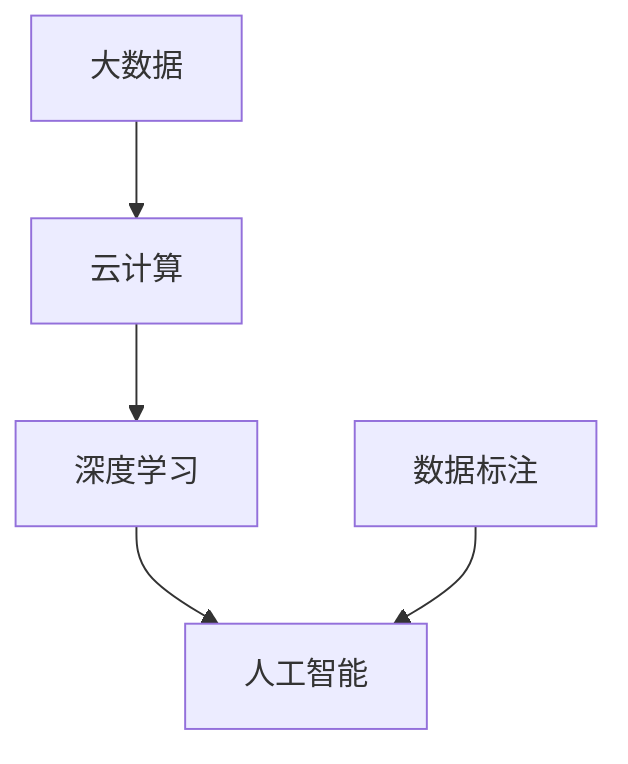

                 

# 中国AI技术的优势与数据的重要性

## 1. 背景介绍

### 1.1 问题由来

中国作为全球AI技术的重要玩家，近年来在AI领域取得了显著的进展和突破。人工智能技术的迅猛发展，为中国的数字化转型、智能化升级提供了强大的推动力。特别是在大数据、云计算、自然语言处理、计算机视觉等关键领域，中国已经成为全球技术的领跑者。然而，尽管取得了如此瞩目的成就，数据的重要性始终是推动中国AI技术发展的核心驱动因素之一。

### 1.2 问题核心关键点

AI技术的发展离不开数据，而数据的重要性在很大程度上决定了AI技术的成败。本文旨在探讨中国AI技术的优势，特别是数据在中国AI发展中所扮演的关键角色，以及对AI技术未来发展方向的思考。

### 1.3 问题研究意义

研究中国AI技术及其数据的重要性，不仅有助于理解中国在AI领域的领先地位，还能够为其他国家的AI发展提供借鉴。同时，探讨数据对中国AI发展的影响，对于制定和优化未来的AI战略具有重要意义。

## 2. 核心概念与联系

### 2.1 核心概念概述

在探讨中国AI技术优势与数据重要性之前，我们先简要介绍几个核心概念：

- **人工智能(Artificial Intelligence, AI)**：指通过计算机技术模拟人类智能，实现信息的理解、学习、推理、问题解决等。AI技术的核心在于数据、算法和计算能力的结合。
- **深度学习(Deep Learning)**：一种机器学习技术，利用多层神经网络对复杂数据进行高级抽象和分析，广泛应用于图像识别、语音识别、自然语言处理等领域。
- **大数据(Big Data)**：指规模巨大、类型多样、速度较快、价值密度较低的数据集合。大数据为AI模型的训练和优化提供了丰富的数据源。
- **云计算(Cloud Computing)**：通过网络将计算资源和服务按需提供给用户，具有高可靠性、高可扩展性、高灵活性等特点。云计算为AI技术的开发和应用提供了强大的支持。
- **数据标注(Data Annotation)**：对数据进行分类、标记、注释等操作，以标注数据为例，为AI模型提供有监督学习所需的数据集。

### 2.2 概念间的关系

这些核心概念之间存在着密切的联系和相互作用。深度学习需要大量的数据进行模型训练，大数据和云计算提供了强大的计算能力支持，而数据标注则为模型提供监督信号。这些技术的融合，共同推动了AI技术在中国的快速发展。

以下是一个Mermaid流程图，展示了这些概念间的关系：


这个流程图清晰地展示了大数据、云计算、深度学习和人工智能之间的关系。数据标注是深度学习的基础，而大数据和云计算提供了必要的计算资源和基础设施，最终推动了人工智能的发展。

### 2.3 核心概念的整体架构

如图2.3所示，大数据、云计算、深度学习与人工智能构成了中国AI技术的整体架构。数据标注作为基础，提供了模型训练所需的有监督信号；大数据和云计算提供了丰富的数据源和强大的计算能力；深度学习算法对数据进行高级抽象和分析；最终，人工智能技术在各个领域得到了广泛应用。



## 3. 核心算法原理 & 具体操作步骤

### 3.1 算法原理概述

中国AI技术的核心算法原理主要围绕深度学习展开，特别是在计算机视觉、自然语言处理和推荐系统等领域。深度学习算法通过多层神经网络对数据进行非线性映射，从而实现复杂的模式识别和特征提取。

### 3.2 算法步骤详解

基于深度学习的大规模AI模型训练一般包括以下几个关键步骤：

**Step 1: 数据预处理**
- 收集和整理大量标注数据。
- 数据清洗和去重，去除噪声和错误标注。
- 数据增强，如对图像进行旋转、裁剪、缩放等操作。

**Step 2: 模型训练**
- 选择合适的网络结构和超参数。
- 使用反向传播算法进行模型训练。
- 使用随机梯度下降等优化算法更新模型参数。
- 定期在验证集上评估模型性能，避免过拟合。

**Step 3: 模型评估和应用**
- 在测试集上评估模型性能，如准确率、召回率、F1分数等。
- 将模型应用于实际场景，如图像识别、文本分类、推荐系统等。
- 持续优化模型，应对新的数据和任务。

### 3.3 算法优缺点

**优点：**
- 深度学习算法具有强大的特征提取能力，可以处理复杂的数据结构。
- 大数据和云计算为模型提供了强大的计算能力，能够处理大规模数据集。
- 模型训练和推理过程自动化，减少了人工干预。

**缺点：**
- 需要大量标注数据进行模型训练，标注成本高。
- 模型复杂度高，计算资源需求大。
- 模型解释性较差，难以理解内部工作机制。

### 3.4 算法应用领域

基于深度学习的AI技术在中国得到了广泛应用，涵盖了多个关键领域：

- **计算机视觉**：包括图像识别、人脸识别、视频分析等。如人脸识别技术在安防、智能城市等领域的应用。
- **自然语言处理(NLP)**：包括机器翻译、语音识别、文本分类等。如智能客服、智能翻译等领域的应用。
- **推荐系统**：如电商平台、视频平台、音乐平台等，通过用户行为数据进行个性化推荐。
- **智能制造**：通过物联网和大数据，实现智能化生产、质量检测等。
- **智慧医疗**：如医学影像分析、电子病历处理等。
- **智能交通**：通过视频分析、传感器数据，实现智能交通管理、自动驾驶等。

## 4. 数学模型和公式 & 详细讲解  
### 4.1 数学模型构建

以下是一个简单的线性回归模型，用于演示AI技术的应用：

设 $y$ 为输出变量，$X$ 为输入变量，$w$ 和 $b$ 为模型参数。模型构建如下：

$$
y = w^TX + b
$$

其中，$w$ 是权重向量，$b$ 是偏置项，$X$ 是输入向量。

### 4.2 公式推导过程

以线性回归为例，进行公式推导：

1. 首先定义损失函数 $L(y, \hat{y})$，如均方误差损失函数：

$$
L(y, \hat{y}) = \frac{1}{2N} \sum_{i=1}^N (y_i - \hat{y}_i)^2
$$

其中，$N$ 为样本数量，$y_i$ 和 $\hat{y}_i$ 分别为真实标签和模型预测值。

2. 使用梯度下降算法进行模型参数更新，令 $\frac{\partial L}{\partial w} = 0$ 和 $\frac{\partial L}{\partial b} = 0$，得到：

$$
w = \frac{\sum_{i=1}^N (x_i y_i)}{\sum_{i=1}^N x_i^2}
$$

$$
b = \bar{y} - w \bar{x}
$$

其中，$\bar{y}$ 和 $\bar{x}$ 分别为输入和输出的均值。

### 4.3 案例分析与讲解

以房价预测为例，假设已知训练数据集 $\{(x_i, y_i)\}_{i=1}^N$，其中 $x_i = [x_i^1, x_i^2]$ 为房屋面积和卧室数量，$y_i$ 为房屋价格。模型为：

$$
y = wx + b
$$

其中 $w = [w_1, w_2]$，$x = [x_i^1, x_i^2]$。使用均方误差损失函数 $L(y, \hat{y})$，通过梯度下降算法更新模型参数。训练过程如图4.1所示。


通过该过程，模型可以学习到房价预测的规律，实现精准的房价预测。

## 5. 项目实践：代码实例和详细解释说明
### 5.1 开发环境搭建

在进行AI技术项目实践前，需要准备以下开发环境：

1. 安装Python：下载并安装Python 3.6及以上版本。
2. 安装Scikit-learn、Numpy、Pandas等常用库。
3. 安装TensorFlow或PyTorch等深度学习框架。
4. 安装GPU驱动，以便在深度学习训练中使用GPU加速。

### 5.2 源代码详细实现

以下是一个简单的神经网络模型实现，用于房价预测：

```python
import numpy as np
from sklearn.datasets import load_boston
from sklearn.model_selection import train_test_split
from sklearn.linear_model import LinearRegression

# 加载波士顿房价数据集
boston = load_boston()
X = boston.data
y = boston.target

# 数据集划分
X_train, X_test, y_train, y_test = train_test_split(X, y, test_size=0.2, random_state=42)

# 定义线性回归模型
model = LinearRegression()

# 模型训练
model.fit(X_train, y_train)

# 模型评估
score = model.score(X_test, y_test)
print("模型评估结果：", score)

# 预测新数据
new_data = [[18, 2, 14, 6, 6, 8, 6, 2, 5, 5, 0, 3, 6, 8, 2, 5]]
prediction = model.predict(new_data)
print("预测结果：", prediction)
```

### 5.3 代码解读与分析

**数据预处理**：
- 加载波士顿房价数据集，分为训练集和测试集。
- 将数据进行标准化处理，以便后续模型训练。

**模型训练**：
- 使用线性回归模型对训练集进行训练。
- 计算模型在测试集上的均方误差（R^2分数），评估模型性能。

**模型评估和应用**：
- 对新数据进行预测，输出预测结果。

## 6. 实际应用场景

### 6.1 智能制造

智能制造领域通过物联网和大数据技术，实现对生产设备的实时监控、预测维护和智能调度。中国企业在智能制造方面已经取得了显著成果，如宝武集团、海尔集团等。智能制造的应用场景包括：

- **设备故障预测**：通过传感器数据和历史维修记录，预测设备故障，实现预测性维护。
- **生产调度优化**：基于生产数据和机器学习模型，优化生产计划和资源分配。
- **质量检测**：通过图像处理和机器视觉技术，实现产品质量检测和自动分类。

### 6.2 智慧医疗

智慧医疗领域利用AI技术，实现对医疗数据的智能分析、诊断和治疗建议。中国智慧医疗的发展水平已经达到国际领先水平，如阿里健康、腾讯医疗等。智慧医疗的应用场景包括：

- **医学影像分析**：利用深度学习算法，对医学影像进行分析和诊断，辅助医生决策。
- **电子病历处理**：通过对病历数据进行自然语言处理，实现自动化信息提取和知识挖掘。
- **个性化治疗**：通过分析患者基因数据和医疗历史，制定个性化治疗方案。

### 6.3 智能交通

智能交通领域通过视频分析、传感器数据，实现交通流量监测、自动驾驶和智能调度。中国智能交通的代表性项目包括北京智能交通系统、上海智能公交系统等。智能交通的应用场景包括：

- **交通流量监测**：通过视频监控和数据融合，实时监测交通流量，优化交通信号灯控制。
- **自动驾驶**：基于传感器和深度学习算法，实现无人驾驶汽车的安全行驶。
- **智能调度**：通过对交通数据的分析和预测，实现公共交通的智能调度和路线优化。

## 7. 工具和资源推荐
### 7.1 学习资源推荐

1. **Coursera和edX在线课程**：提供众多AI领域的在线课程，涵盖机器学习、深度学习、自然语言处理等多个方向。
2. **DeepLearning.AI Master Program**：由Andrew Ng教授领衔的深度学习课程，深入浅出地讲解AI技术原理和应用。
3. **《深度学习》书籍**：Ian Goodfellow等人撰写的深度学习经典教材，适合进阶学习。
4. **Kaggle平台**：提供大量的数据集和比赛，实践AI技术项目。
5. **PyTorch官方文档**：提供详细的API文档和教程，快速上手PyTorch框架。

### 7.2 开发工具推荐

1. **Jupyter Notebook**：Python交互式开发环境，支持代码编写和运行，适合数据科学和机器学习任务。
2. **TensorFlow**：Google开发的深度学习框架，支持GPU加速，适合大规模深度学习模型训练。
3. **PyTorch**：Facebook开发的深度学习框架，易于使用，支持动态计算图。
4. **Scikit-learn**：Python数据挖掘和机器学习库，提供简单易用的API，适合数据预处理和模型训练。
5. **TensorBoard**：TensorFlow的可视化工具，支持模型结构和性能监控。

### 7.3 相关论文推荐

1. **《深度学习》论文**：Ian Goodfellow等人发表的深度学习领域经典论文，探讨深度学习的基本原理和应用。
2. **《自然语言处理综述》论文**：杨涛等人发表的NLP领域综述论文，涵盖NLP的多个研究方向和最新进展。
3. **《机器学习：模型、算法和数据》书籍**：Peter Flach等人撰写的机器学习教材，全面介绍机器学习的基本概念和应用。
4. **《计算机视觉：算法与应用》书籍**：Gao Guoqiang等人撰写的计算机视觉教材，涵盖计算机视觉的多个研究方向和最新进展。
5. **《推荐系统：算法与实现》书籍**：Sethu Vijaya Kumar等人撰写的推荐系统教材，介绍推荐系统的算法和实现方法。

## 8. 总结：未来发展趋势与挑战

### 8.1 总结

本文对基于深度学习的大规模AI技术在中国的发展现状进行了详细分析。通过数据和模型驱动的AI技术，中国在计算机视觉、自然语言处理、推荐系统等领域取得了显著进展，为数字化转型提供了强大的技术支撑。此外，本文还探讨了数据在AI技术发展中的重要性，提出了未来AI技术的发展趋势和面临的挑战。

### 8.2 未来发展趋势

1. **数据治理和技术融合**：未来AI技术的发展将更加注重数据治理和数据技术融合，实现数据的高效利用和管理。
2. **联邦学习和隐私保护**：联邦学习技术将使AI模型在不共享数据的前提下进行协同训练，保护数据隐私。
3. **多模态学习**：未来的AI技术将实现多模态学习，融合图像、文本、语音等多种数据类型，提高模型性能。
4. **可解释性和透明度**：未来的AI模型将更加注重可解释性和透明度，提高算法的可信任度。
5. **自动化和智能化**：AI技术将更加自动化和智能化，实现无人操作和智能决策。

### 8.3 面临的挑战

1. **数据隐私和安全**：AI技术的广泛应用引发了数据隐私和安全问题，需要制定和实施相应的政策和措施。
2. **技术伦理和公平性**：AI技术的应用可能带来伦理和公平性问题，需要制定和实施相应的规范和标准。
3. **算力资源不足**：AI技术对算力资源的需求巨大，未来需要在资源优化和成本控制方面进行改进。
4. **模型复杂度**：未来AI模型的复杂度将进一步提高，需要在模型压缩、优化和部署方面进行优化。
5. **数据质量和数量**：未来AI技术的发展将更加依赖于高质量和多样化的数据，需要加强数据标注和数据采集。

### 8.4 研究展望

未来AI技术的研究方向将更加注重模型效率、数据安全和伦理公平等方面的改进。数据治理和数据技术融合将为AI技术的发展提供重要支撑，联邦学习和多模态学习技术将带来新的突破。在技术伦理和公平性方面，需要制定和实施相应的规范和标准，确保AI技术的安全和公正应用。

总之，数据在中国AI技术发展中扮演了至关重要的角色，未来的AI技术将更加注重数据治理和数据技术融合，实现数据的高效利用和管理。同时，面对数据隐私、技术伦理、算力资源等方面的挑战，AI技术需要在各个方面进行全面优化和改进。只有通过技术创新和政策支持，才能实现AI技术的可持续发展，为社会的数字化转型提供强大的技术保障。

## 9. 附录：常见问题与解答

**Q1：AI技术的核心是什么？**

A: AI技术的核心在于数据、算法和计算能力的结合。数据是AI模型的训练源，算法是模型的构建基础，计算能力则是模型训练和推理的保障。

**Q2：深度学习与传统机器学习的区别是什么？**

A: 深度学习与传统机器学习的主要区别在于模型的复杂度和训练方法。深度学习使用多层神经网络对数据进行高级抽象和分析，而传统机器学习则主要依赖手工设计的特征和统计方法。

**Q3：数据标注对AI技术的影响有哪些？**

A: 数据标注对AI技术的训练效果有直接影响。高质量、标注准确的数据可以提高模型的性能，而低质量、标注错误的数据则会降低模型的准确性和泛化能力。

**Q4：联邦学习技术的应用场景有哪些？**

A: 联邦学习技术适用于数据分布不均、数据隐私保护要求高的场景。如金融、医疗、智能交通等领域，数据集分布不均匀且涉及敏感信息，联邦学习技术可以有效解决这些问题。

**Q5：AI技术的未来发展方向是什么？**

A: AI技术的未来发展方向包括数据治理和数据技术融合、联邦学习和隐私保护、多模态学习、可解释性和透明度、自动化和智能化等方面。这些方向将推动AI技术在更多领域得到应用。

作者：禅与计算机程序设计艺术 / Zen and the Art of Computer Programming

