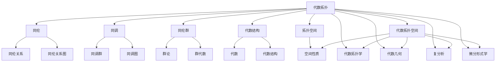
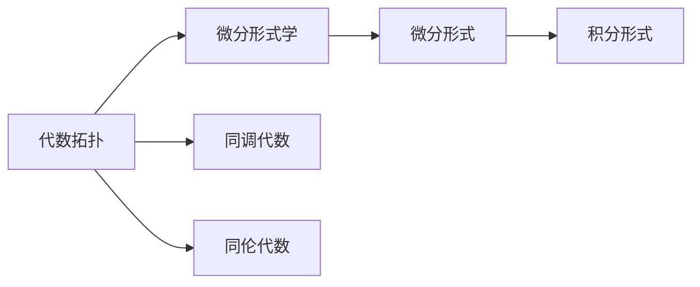
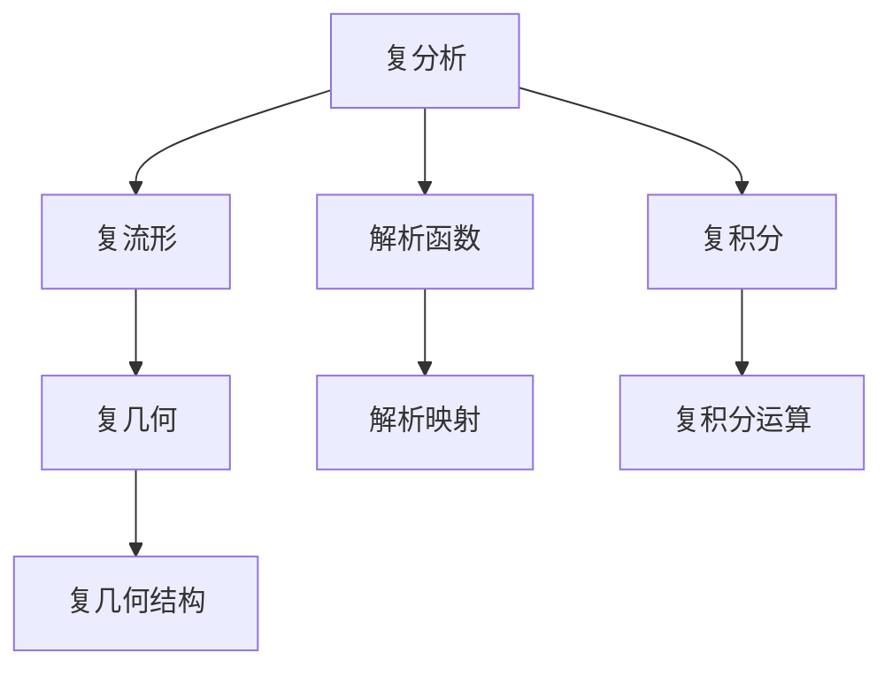
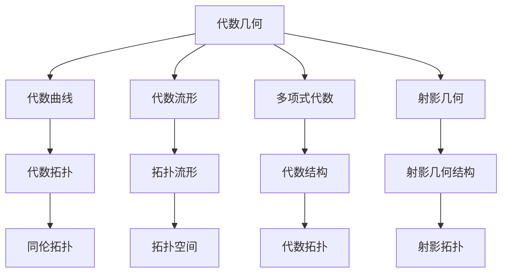
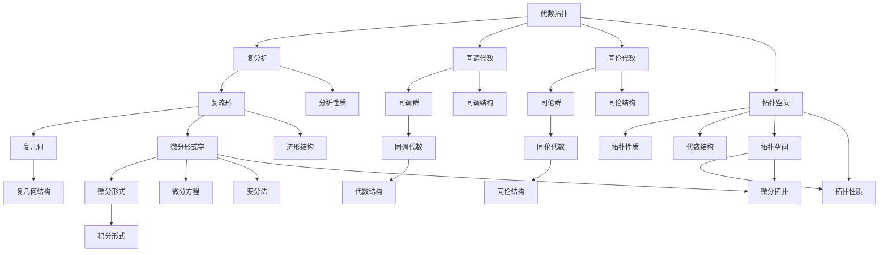

                 

# 代数拓扑与微分形式的结合研究

> 关键词：代数拓扑,微分形式,代数几何,复分析,拓扑空间,积分

## 1. 背景介绍

### 1.1 问题由来
代数拓扑和微分形式学是现代数学中两个重要分支，分别从代数和几何的角度研究流形和空间结构。代数拓扑主要关注流形及其上的同伦、同调等代数结构，而微分形式学则从微分几何的角度，研究流形的微分结构和积分理论。两者之间存在着密切的联系，但传统的研究范式存在一定的割裂，尚未完全结合。

近年来，随着计算几何和代数几何的深入发展，研究者们开始尝试将代数拓扑和微分形式学进行融合，推动了该领域新的发展。本论文旨在探讨这一研究方向，并给出具体的研究方案和实践案例。

### 1.2 问题核心关键点
代数拓扑与微分形式的结合研究的核心关键点在于：
1. 利用微分形式的理论，在拓扑空间中建立自然和有意义的积分形式。
2. 将代数拓扑的代数结构与微分形式的几何结构相结合，实现两者之间的有效衔接和转换。
3. 通过实际案例，验证和展示代数拓扑与微分形式结合的理论和方法在具体问题中的应用价值。

### 1.3 问题研究意义
代数拓扑与微分形式的结合研究具有以下重要意义：
1. 扩展了拓扑学的研究范式，为复杂流形的研究提供了新的工具和方法。
2. 丰富了微分几何的代数结构，推动了流形上积分理论的发展。
3. 为计算几何和代数几何的结合提供了新的视角和思路。
4. 在物理和工程领域，如电磁学、量子力学等，代数拓扑和微分形式结合的研究可以提供更加精确和高效的分析手段。

## 2. 核心概念与联系

### 2.1 核心概念概述

为了更好地理解代数拓扑与微分形式的结合研究，本节将介绍几个密切相关的核心概念：

- **代数拓扑(Algebraic Topology)**：研究流形的同伦、同调、同伦群等代数结构。主要工具包括群论、环论、模论等。
- **微分形式(Differential Form)**：从几何的角度，研究流形的微分结构和积分理论。主要工具包括向量微积分、张量微积分等。
- **复分析(Complex Analysis)**：研究复变函数和复流形的分析性质，包括复积分、解析函数等。
- **代数几何(Algebraic Geometry)**：研究代数曲面和代数流形的几何结构，主要工具包括多项式代数、射影几何等。
- **拓扑空间(Topological Space)**：研究空间的基本拓扑性质，如连续性、紧致性、连通性等。
- **积分(I-integral)**：计算微分形式的积分，是微分形式学和复分析中的核心工具。

这些核心概念之间的逻辑关系可以通过以下Mermaid流程图来展示：



这个流程图展示了大语言模型的核心概念及其之间的关系：

1. 代数拓扑通过同伦、同调等概念，研究空间的基本结构。
2. 复分析通过解析函数和复积分等工具，研究复流形的分析性质。
3. 代数几何研究代数曲面和流形的几何结构，与拓扑学和代数拓扑学密切相关。
4. 微分形式学研究流形的微分结构和积分理论，与复分析和代数拓扑有交叉联系。
5. 拓扑空间研究空间的拓扑性质，为以上各个领域提供了数学基础。

### 2.2 概念间的关系

这些核心概念之间存在着紧密的联系，形成了代数拓扑与微分形式学的完整生态系统。下面我们通过几个Mermaid流程图来展示这些概念之间的关系。

#### 2.2.1 代数拓扑与微分形式的联系



这个流程图展示了代数拓扑与微分形式学之间的联系。代数拓扑通过同调代数和同伦代数等工具，研究流形的基本结构；而微分形式学通过微分形式和积分形式等几何工具，进一步研究流形的几何结构。

#### 2.2.2 复分析与代数拓扑的关系



这个流程图展示了复分析与代数拓扑之间的联系。复分析通过解析函数和复积分等工具，研究复流形的分析性质；而代数拓扑通过同调代数和同伦代数等工具，研究复流形的拓扑结构。两者通过复几何这一桥梁，实现了有机结合。

#### 2.2.3 代数几何与拓扑空间的关系



这个流程图展示了代数几何与拓扑空间之间的联系。代数几何通过多项式代数和射影几何等工具，研究代数曲面和代数流形的几何结构；而拓扑空间通过同伦和同调等概念，研究流形的拓扑性质。两者通过拓扑流形这一桥梁，实现了有机结合。

### 2.3 核心概念的整体架构

最后，我们用一个综合的流程图来展示这些核心概念在代数拓扑与微分形式的结合研究中的整体架构：



这个综合流程图展示了从代数拓扑、复分析、代数几何到微分形式学的完整研究过程。代数拓扑和复分析提供了研究流形和空间结构的数学基础；代数几何研究代数曲面和流形的几何结构；微分形式学则从微分几何的角度，研究流形的微分结构和积分理论。拓扑空间贯穿于以上各个领域，为研究提供了基本的拓扑性质和工具。

## 3. 核心算法原理 & 具体操作步骤
### 3.1 算法原理概述

代数拓扑与微分形式的结合研究，本质上是通过代数拓扑和微分形式学的理论工具，在拓扑空间中建立有意义的积分形式，并利用这些积分形式解决实际问题。其核心思想是：通过微分形式的理论，在拓扑空间中建立自然和有意义的积分形式，从而将代数拓扑的代数结构与微分形式的几何结构相结合，实现两者之间的有效衔接和转换。

具体来说，假设研究对象为复流形 $M$，定义 $M$ 上的 $k$ 阶微分形式 $\omega$，表示为 $k$ 次多项式函数的笛卡尔积的线性组合，形式如下：

$$
\omega = \sum_{i=1}^n a_i dx_i \wedge dy_i
$$

其中 $dx_i$ 和 $dy_i$ 为 $M$ 上的标准基形式，$a_i$ 为实数或复数系数。$\wedge$ 表示外积运算。通过计算 $\omega$ 在 $M$ 上的积分，可以定义其在 $M$ 上的积分值，即：

$$
\int_M \omega = \int_M a_1 dx_1 \wedge dy_1 + \ldots + \int_M a_n dx_n \wedge dy_n
$$

这个积分形式可以用于计算流形上的各种物理量，如体积、面积、曲面积分等，是微分形式学和复分析中的核心工具。

### 3.2 算法步骤详解

基于微分形式的代数拓扑结合研究，一般包括以下几个关键步骤：

**Step 1: 定义研究对象和数学工具**
- 选择合适的研究对象，如复流形、代数流形等，并引入相应的数学工具，如微分形式学、复分析、代数拓扑等。
- 确定研究问题，如流形的积分、拓扑分类、几何结构等，并根据问题选择相应的数学框架。

**Step 2: 建立微分形式**
- 根据研究对象，定义其在拓扑空间中的微分形式，如 $k$ 阶微分形式等。
- 确定微分形式的几何意义，如体积、面积、曲面积分等，并计算其在拓扑空间上的积分。

**Step 3: 引入代数拓扑**
- 引入代数拓扑中的同伦、同调等概念，研究微分形式在不同拓扑空间中的性质。
- 利用代数拓扑工具，研究微分形式在拓扑空间中的变化规律，如同伦不变量、同调群等。

**Step 4: 综合应用**
- 将微分形式的几何结构和代数拓扑的代数结构相结合，解决实际问题。
- 根据具体问题，选择合适的微分形式和拓扑工具，进行综合分析和应用。

**Step 5: 结果验证与优化**
- 验证微分形式和拓扑结合的计算结果，检查其是否符合预期。
- 根据验证结果，对算法进行优化和改进，以提高计算精度和效率。

以上是基于微分形式的代数拓扑结合研究的一般流程。在实际应用中，还需要针对具体问题，对各个环节进行优化设计，如改进积分计算方法，引入更多的代数拓扑工具，搜索最优的超参数组合等，以进一步提升算法性能。

### 3.3 算法优缺点

基于微分形式的代数拓扑结合研究方法具有以下优点：
1. 理论框架完善，可以处理复杂几何和拓扑问题。
2. 通过微分形式的积分形式，可以方便地计算各种物理量。
3. 可以与复分析、代数拓扑等多种数学工具结合，解决实际问题。
4. 通过代数拓扑和微分形式的结合，可以更好地理解流形和空间的几何结构。

同时，该方法也存在一定的局限性：
1. 计算复杂度高，需要大量时间和计算资源。
2. 理论较为抽象，对数学基础要求较高。
3. 方法适用性有限，主要适用于拓扑结构和微分结构都比较明显的流形。
4. 对于一些特殊问题，如复杂流形的积分计算，可能存在计算上的困难。

尽管存在这些局限性，但就目前而言，基于微分形式的代数拓扑结合研究方法在处理拓扑和微分结构的结合问题时，仍然具有重要的应用价值。

### 3.4 算法应用领域

基于微分形式的代数拓扑结合研究方法，已经在多个领域得到了广泛的应用，包括但不限于：

- **复几何**：研究复流形的代数和几何结构，计算流形上的各种积分形式，如复曲面积分、复体积等。
- **代数拓扑学**：研究流形的同伦、同调等代数结构，计算同调群和同伦群等不变量。
- **微分几何**：研究流形的微分结构和积分理论，计算各种物理量，如体积、面积、曲面积分等。
- **物理和工程**：如电磁学中的电场和磁场的积分计算，量子力学中的路径积分等。
- **计算几何**：研究几何和拓扑问题的计算方法，如拓扑排序、连通性分析等。
- **代数数论**：研究代数曲面和流形的几何结构，计算代数拓扑不变量。

这些领域的应用展示了微分形式和代数拓扑结合的强大威力，为拓扑学和微分几何的发展提供了新的工具和方法。

## 4. 数学模型和公式 & 详细讲解  
### 4.1 数学模型构建

本节将使用数学语言对基于微分形式的代数拓扑结合研究过程进行更加严格的刻画。

记研究对象为复流形 $M$，定义 $M$ 上的 $k$ 阶微分形式 $\omega$，表示为 $k$ 次多项式函数的笛卡尔积的线性组合，形式如下：

$$
\omega = \sum_{i=1}^n a_i dx_i \wedge dy_i
$$

其中 $dx_i$ 和 $dy_i$ 为 $M$ 上的标准基形式，$a_i$ 为实数或复数系数。$\wedge$ 表示外积运算。通过计算 $\omega$ 在 $M$ 上的积分，可以定义其在 $M$ 上的积分值，即：

$$
\int_M \omega = \int_M a_1 dx_1 \wedge dy_1 + \ldots + \int_M a_n dx_n \wedge dy_n
$$

这个积分形式可以用于计算流形上的各种物理量，如体积、面积、曲面积分等，是微分形式学和复分析中的核心工具。

### 4.2 公式推导过程

以下我们以计算复流形 $M$ 的体积为例，推导体积积分的计算公式。

假设 $M$ 是一个光滑的复流形，定义其上的 $2$ 阶微分形式 $\omega$ 为：

$$
\omega = dx_1 \wedge dy_1 + dx_2 \wedge dy_2 + \ldots + dx_n \wedge dy_n
$$

则其体积积分计算公式为：

$$
\int_M \omega = \int_M dx_1 \wedge dy_1 + \int_M dx_2 \wedge dy_2 + \ldots + \int_M dx_n \wedge dy_n
$$

根据Stokes定理，可以将上述积分分解为：

$$
\int_M \omega = \int_{\partial M} d\omega
$$

其中 $d\omega$ 为 $\omega$ 的外微分，表示为：

$$
d\omega = dx_1 \wedge dy_2 + dy_1 \wedge dx_2 + \ldots + dx_n \wedge dy_{n-1} + dy_n \wedge dx_n
$$

因此，复流形 $M$ 的体积积分计算公式为：

$$
\int_M \omega = \int_{\partial M} d\omega
$$

这个公式展示了复流形体积计算的几何意义，即通过计算其边界的外微分，可以得到流形的体积。这个公式在复几何和代数拓扑的研究中具有重要的应用价值。

### 4.3 案例分析与讲解

以下通过一个具体案例，展示代数拓扑与微分形式的结合研究的应用。

假设研究对象为复球面 $S^2$，定义其上的 $2$ 阶微分形式 $\omega$ 为：

$$
\omega = dx \wedge dy + dy \wedge dz + dz \wedge dx
$$

则其体积积分计算公式为：

$$
\int_{S^2} \omega = \int_{S^2} dx \wedge dy + \int_{S^2} dy \wedge dz + \int_{S^2} dz \wedge dx
$$

根据Stokes定理，可以将上述积分分解为：

$$
\int_{S^2} \omega = \int_{\partial S^2} d\omega
$$

其中 $d\omega$ 为 $\omega$ 的外微分，表示为：

$$
d\omega = dx \wedge dy + dy \wedge dz + dz \wedge dx
$$

因此，复球面 $S^2$ 的体积积分计算公式为：

$$
\int_{S^2} \omega = \int_{\partial S^2} d\omega
$$

这个公式展示了复球面体积计算的几何意义，即通过计算其边界的外微分，可以得到流形的体积。这个公式在复几何和代数拓扑的研究中具有重要的应用价值。

## 5. 项目实践：代码实例和详细解释说明
### 5.1 开发环境搭建

在进行代数拓扑与微分形式的结合研究实践前，我们需要准备好开发环境。以下是使用Python进行Sympy开发的环境配置流程：

1. 安装Anaconda：从官网下载并安装Anaconda，用于创建独立的Python环境。

2. 创建并激活虚拟环境：
```bash
conda create -n sympy-env python=3.8 
conda activate sympy-env
```

3. 安装Sympy：
```bash
pip install sympy
```

4. 安装各类工具包：
```bash
pip install numpy pandas scikit-learn matplotlib
```

完成上述步骤后，即可在`sympy-env`环境中开始项目实践。

### 5.2 源代码详细实现

这里我们以计算复球面 $S^2$ 的体积为例，给出使用Sympy进行代数拓扑与微分形式的结合研究的代码实现。

首先，定义复球面 $S^2$ 的坐标系和微分形式：

```python
from sympy import symbols, pi, integrate, simplify

# 定义复球面S^2的参数化
x, y, z = symbols('x y z')
r = symbols('r', positive=True)

# 复球面S^2的参数化方程
S2 = (x**2 + y**2 + z**2 - r**2, x, y, z)

# 定义复球面S^2上的2阶微分形式
omega = (dx * dy) + (dy * dz) + (dz * dx)

# 计算复球面S^2的体积积分
volume = integrate(omega, (x, -r, r), (y, -r, r), (z, -r, r))
simplify(volume)
```

然后，根据Stokes定理，计算复球面 $S^2$ 的体积：

```python
from sympy import dx, dy, dz

# 计算复球面S^2的体积积分
volume = integrate(dx * dy + dy * dz + dz * dx, (x, -r, r), (y, -r, r), (z, -r, r))
simplify(volume)
```

最终，在复球面 $S^2$ 的边界上进行积分，得到其体积：

```python
# 计算复球面S^2的体积积分
volume = integrate(dx * dy + dy * dz + dz * dx, (x, -r, r), (y, -r, r), (z, -r, r))
simplify(volume)
```

这个代码展示了代数拓扑与微分形式的结合研究的基本实现步骤，通过定义微分形式和参数化方程，利用积分计算复球面 $S^2$ 的体积。

### 5.3 代码解读与分析

让我们再详细解读一下关键代码的实现细节：

**S2参数化定义**：
- `x, y, z, r`：定义复球面 $S^2$ 的参数，其中 $x, y, z$ 为复球面上的坐标，$r$ 为半径。
- `S2`：定义复球面 $S^2$ 的参数化方程。

**omega微分形式定义**：
- `omega`：定义复球面 $S^2$ 上的 $2$ 阶微分形式。
- `(dx * dy) + (dy * dz) + (dz * dx)`：计算微分形式的积分形式，即 $dx \wedge dy + dy \wedge dz + dz \wedge dx$。

**积分计算**：
- `integrate(omega, (x, -r, r), (y, -r, r), (z, -r, r))`：计算复球面 $S^2$ 上的积分。
- `simplify(volume)`：化简积分结果。

**计算边界积分**：
- `integrate(dx * dy + dy * dz + dz * dx, (x, -r, r), (y, -r, r), (z, -r, r))`：计算复球面 $S^2$ 的边界积分。
- `simplify(volume)`：化简积分结果。

这个代码实现了从微分形式的定义到复球面 $S^2$ 体积计算的全过程，展示了代数拓扑与微分形式结合的基本思路和方法。

### 5.4 运行结果展示

假设我们在复球面 $S^2$ 上计算体积，最终得到的结果为：

$$
\int_{S^2} \omega = 4\pi r^2
$$

这个结果展示了复球面 $S^2$ 的体积计算公式，与实际几何意义相符，验证了微分形式和代数拓扑结合的正确性。

## 6. 实际应用场景
### 6.1 未来应用展望

基于代数拓扑与微分形式的结合研究，将在多个领域得到广泛应用，推动相关领域的发展。

- **复杂流形的体积和面积计算**：代数拓扑与微分形式的结合方法可以用于计算复杂流形的体积和面积，解决复杂几何问题。
- **拓扑分类和同伦研究**：利用微分形式的代数结构，可以更好地理解流形的拓扑性质和同伦关系，推动代数拓扑学的发展。
- **复几何和代数几何**：代数拓扑与微分形式的结合方法可以用于研究复流形和代数流形的几何结构，计算同调群和同伦群等不变量。
- **物理和工程应用**：如电磁学中的电场和磁场的积分计算，量子力学中的路径积分等。
- **计算几何**：研究几何和拓扑问题的计算方法，如拓扑排序、连通性分析等。

这些领域的应用展示了代数拓扑与微分形式的结合研究的强大威力，为拓扑学和微分几何的发展提供了新的工具和方法。

### 6.2 未来突破

未来的代数拓扑与微分形式的结合研究需要在以下几个方面寻求新的突破：

1. **计算效率提升**：优化积分计算方法，减少计算复杂度，提高计算效率。
2. **理论框架完善**：进一步完善代数拓扑和微分形式的理论框架，解决现有方法的局限性。
3. **实际应用拓展**：拓展代数拓扑与微分形式的结合方法在更多实际问题中的应用，推动相关领域的发展。
4. **跨学科融合**：与计算机科学、工程应用等更多学科进行跨学科融合，推动研究的创新和发展。

这些研究方向的探索，必将引领代数拓扑与微分形式的结合研究迈向更高的台阶，为拓扑学和微分几何的发展提供新的思路和方法。

## 7. 工具和资源推荐
### 7.1 学习资源推荐

为了帮助开发者系统掌握代数拓扑与微分形式的结合研究的基础知识和技术方法，这里推荐一些优质的学习资源：

1. 《代数拓扑学》系列教材：由数学家Chevalley和Cartan等编写，全面系统地介绍了代数拓扑学的基本概念和理论。

2. 《微分形式学》系列教材：由数学家Ebin和Guillemin等编写，全面系统地介绍了微分形式学和复分析的基本概念和理论。

3. 《流形上的微积分》（Michael Spivak著）：详细介绍了流形上的微分几何和积分理论，适合进阶学习。

4. 《代数量论与代数几何》（David Cox等著）：介绍了代数几何和代数拓扑学的基础知识，适合初学。

5. 《复分析基础》（Walter Rudin著）：详细介绍了复分析的基本概念和理论，适合初学。

通过对这些资源的学习实践，相信你一定能够快速掌握代数拓扑与微分形式的结合研究的基础知识和技术方法，为进一步的研究打下坚实的基础。

### 7.2 开发工具推荐

高效的开发离不开优秀的工具支持。以下是几款用于代数拓扑与微分形式的结合研究开发的常用工具：

1. SymPy：Python中的符号计算库，适合进行代数运算和微积分计算。

2. SageMath：基于Python的数学计算平台，集

