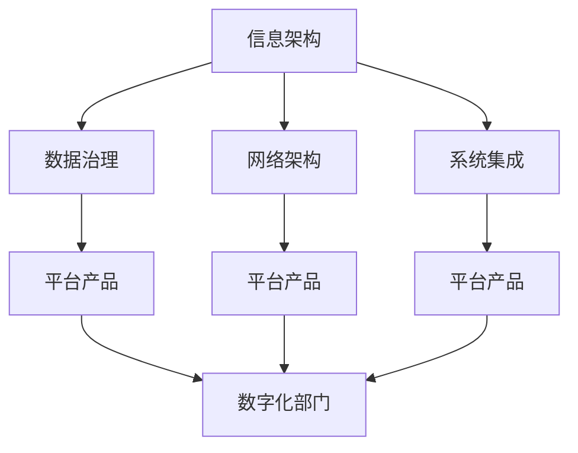
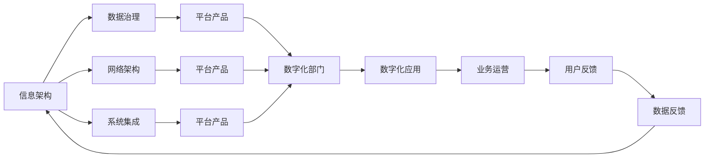
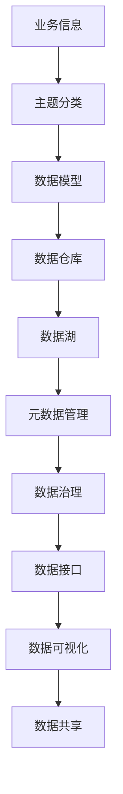

                 

# 信息、网络、平台产品和数字化部门规划

## 1. 背景介绍

### 1.1 问题由来
数字化转型已经成为了各行业企业的核心战略之一。通过数字化，企业可以实现更高效的运营、更高的客户满意度和更大的市场竞争力。然而，数字化转型并非易事，企业需要全面理解和规划数字化方向，才能在激烈的市场竞争中立于不败之地。本文将从信息、网络、平台产品和数字化部门规划的角度，探讨企业如何通过全面、系统的数字化规划，实现高质量的数字化转型。

### 1.2 问题核心关键点
信息、网络、平台产品和数字化部门规划的核心关键点包括：
- 明确数字化转型方向和目标
- 制定信息架构和数据治理策略
- 设计网络架构和系统集成方案
- 规划平台产品和功能模块
- 构建数字化部门和团队协作机制

这些关键点构成了数字化转型的基石，确保企业在数字化建设过程中能够全面、有序、高效地推进各项工作。

### 1.3 问题研究意义
研究信息、网络、平台产品和数字化部门规划，对于企业实现高质量的数字化转型具有重要意义：
- 提升运营效率。数字化建设能够优化业务流程，提高生产效率，降低成本。
- 增强客户体验。数字化应用能够提升客户交互方式，提供个性化服务，提高客户满意度。
- 拓展市场机会。数字化技术能够帮助企业发现新商机，开拓新市场，保持竞争优势。
- 促进创新发展。数字化建设能够推动企业研发新应用、新业务，实现持续创新。
- 增强数据驱动决策。数字化建设能够使企业数据驱动决策，提升决策科学性。

## 2. 核心概念与联系

### 2.1 核心概念概述

为更好地理解信息、网络、平台产品和数字化部门规划的各个方面，本节将介绍几个密切相关的核心概念：

- **信息架构**：指企业信息的组织、管理和呈现方式。包含信息模型、元数据、数据标准等关键要素。
- **数据治理**：指对企业数据的收集、存储、管理和使用进行规范和控制，以确保数据质量和完整性。
- **网络架构**：指企业网络的拓扑结构、协议、安全和策略设计。网络架构直接影响企业的数据流动和系统可靠性。
- **系统集成**：指不同系统和组件之间的数据、功能和服务集成，实现系统间无缝协同。
- **平台产品**：指提供企业数字化应用基础，实现业务功能支撑的通用平台。
- **数字化部门**：指负责数字化规划、建设和运营的企业内部专业部门，通常包括IT、数据、网络、产品等多个团队。

这些核心概念之间的逻辑关系可以通过以下Mermaid流程图来展示：



这个流程图展示了大语言模型微调过程中各个核心概念的关系和作用：

1. 信息架构通过元数据和数据标准，指导数据治理。
2. 网络架构保证数据流动的高效和安全性，支持系统集成。
3. 系统集成实现不同系统和组件之间的协同，提供平台产品的运行环境。
4. 平台产品为数字化应用提供基础支撑，辅助数字化部门的协作。
5. 数字化部门负责整体数字化规划和运营，协调各个环节的实施。

### 2.2 概念间的关系

这些核心概念之间存在着紧密的联系，形成了企业数字化转型的完整生态系统。下面我通过几个Mermaid流程图来展示这些概念之间的关系。

#### 2.2.1 数字化转型的整体架构



这个流程图展示了大语言模型微调的整体架构：

1. 信息架构通过数据治理，指导平台产品设计。
2. 网络架构和系统集成为平台产品的运行提供基础。
3. 平台产品支撑数字化应用，直接服务于业务运营。
4. 数字化部门负责规划和建设，通过用户反馈和数据反馈不断优化。

#### 2.2.2 信息架构的详细设计



这个流程图展示了大语言模型微调中的信息架构详细设计：

1. 业务信息通过主题分类，构建数据模型。
2. 数据模型被存储到数据仓库和数据湖中，支持数据接口和数据可视化。
3. 元数据管理和数据治理确保数据质量，支持数据共享。

#### 2.2.3 系统集成的关键步骤

```mermaid
graph LR
    A[系统1] --> B[数据接口]
    A --> C[API]
    B --> D[系统2]
    C --> E[API]
    D --> F[系统3]
    E --> G[API]
    F --> H[系统4]
    G --> I[API]
    H --> J[系统5]
    I --> K[API]
    J --> L[系统6]
    K --> M[API]
    L --> N[系统7]
    M --> O[API]
    N --> P[系统8]
    O --> Q[API]
    P --> R[系统9]
    Q --> S[API]
    R --> T[系统10]
    S --> U[API]
    T --> V[系统11]
    U --> W[API]
    V --> X[系统12]
    W --> Y[API]
    X --> Z[系统13]
    Y --> AA[API]
    Z --> AB[系统14]
    AA --> AC[API]
    AB --> AD[API]
    AC --> AE[API]
    AD --> AF[API]
    AE --> AG[API]
    AF --> AH[API]
    AG --> AI[API]
    AH --> AJ[API]
    AJ --> AK[API]
    AK --> AL[API]
    AL --> AM[API]
    AM --> AN[API]
    AN --> AO[API]
    AO --> AP[API]
    AP --> AQ[API]
    AQ --> AR[API]
    AR --> AS[API]
    AS --> AT[API]
    AT --> AU[API]
    AU --> AV[API]
    AV --> AW[API]
    AW --> AX[API]
    AX --> AY[API]
    AY --> AZ[API]
    AZ --> BA[API]
    BA --> BB[API]
    BB --> BC[API]
    BC --> BD[API]
    BD --> BE[API]
    BE --> BF[API]
    BF --> BG[API]
    BG --> BH[API]
    BH --> BI[API]
    BI --> BJ[API]
    BJ --> BK[API]
    BK --> BL[API]
    BL --> BM[API]
    BM --> BN[API]
    BN --> BO[API]
    BO --> BP[API]
    BP --> BQ[API]
    BQ --> BR[API]
    BR --> BS[API]
    BS --> BT[API]
    BT --> BU[API]
    BU --> BV[API]
    BV --> BW[API]
    BW --> BX[API]
    BX --> BY[API]
    BY --> BZ[API]
    BZ --> CA[API]
    CA --> CB[API]
    CB --> CC[API]
    CC --> CD[API]
    CD --> CE[API]
    CE --> CF[API]
    CF --> CG[API]
    CG --> CH[API]
    CH --> CI[API]
    CI --> CJ[API]
    CJ --> CK[API]
    CK --> CL[API]
    CL --> CM[API]
    CM --> CN[API]
    CN --> CO[API]
    CO --> CP[API]
    CP --> CQ[API]
    CQ --> CR[API]
    CR --> CS[API]
    CS --> CT[API]
    CT --> CU[API]
    CU --> CV[API]
    CV --> CW[API]
    CW --> CX[API]
    CX --> CY[API]
    CY --> CZ[API]
    CZ --> DA[API]
    DA --> DB[API]
    DB --> DC[API]
    DC --> DD[API]
    DD --> DE[API]
    DE --> DF[API]
    DF --> DG[API]
    DG --> DH[API]
    DH --> DI[API]
    DI --> DJ[API]
    DJ --> DK[API]
    DK --> DL[API]
    DL --> DM[API]
    DM --> DN[API]
    DN --> DO[API]
    DO --> DP[API]
    DP --> DQ[API]
    DQ --> DR[API]
    DR --> DS[API]
    DS --> DT[API]
    DT --> DU[API]
    DU --> DV[API]
    DV --> DW[API]
    DW --> DX[API]
    DX --> DY[API]
    DY --> DZ[API]
    DZ --> EA[API]
    EA --> EB[API]
    EB --> EC[API]
    EC --> ED[API]
    ED --> EE[API]
    EE --> EF[API]
    EF --> EG[API]
    EG --> EH[API]
    EH --> EI[API]
    EI --> EJ[API]
    EJ --> EK[API]
    EK --> EL[API]
    EL --> EM[API]
    EM --> EN[API]
    EN --> EO[API]
    EO --> EP[API]
    EP --> EQ[API]
    EQ --> ER[API]
    ER --> ES[API]
    ES --> ET[API]
    ET --> EU[API]
    EU --> EV[API]
    EV --> EW[API]
    EW --> EX[API]
    EX --> EY[API]
    EY --> EZ[API]
    EZ --> FA[API]
    FA --> FB[API]
    FB --> FC[API]
    FC --> FD[API]
    FD --> FE[API]
    FE --> FF[API]
    FF --> FG[API]
    FG --> FH[API]
    FH --> FI[API]
    FI --> FJ[API]
    FJ --> FK[API]
    FK --> FL[API]
    FL --> FM[API]
    FM --> FN[API]
    FN --> FO[API]
    FO --> FP[API]
    FP --> FQ[API]
    FQ --> FR[API]
    FR --> FS[API]
    FS --> FT[API]
    FT --> FU[API]
    FU --> FV[API]
    FV --> FW[API]
    FW --> FX[API]
    FX --> FY[API]
    FY --> FZ[API]
    FZ --> GA[API]
    GA --> GB[API]
    GB --> GC[API]
    GC --> GD[API]
    GD --> GE[API]
    GE --> GF[API]
    GF --> GG[API]
    GG --> GH[API]
    GH --> GI[API]
    GI --> GJ[API]
    GJ --> GK[API]
    GK --> GL[API]
    GL --> GM[API]
    GM --> GN[API]
    GN --> GO[API]
    GO --> GP[API]
    GP --> GQ[API]
    GQ --> GR[API]
    GR --> GS[API]
    GS --> GT[API]
    GT --> GU[API]
    GU -->GV[API]
    GV --> GW[API]
    GW --> GX[API]
    GX --> GY[API]
    GY --> GZ[API]
    GZ --> HA[API]
    HA --> HB[API]
    HB --> HC[API]
    HC --> HD[API]
    HD --> HE[API]
    HE --> HF[API]
    HF --> HG[API]
    HG --> HH[API]
    HH --> HI[API]
    HI --> HJ[API]
    HJ --> HK[API]
    HK --> HL[API]
    HL --> HM[API]
    HM --> HN[API]
    HN --> HO[API]
    HO --> HP[API]
    HP --> HQ[API]
    HQ --> HR[API]
    HR --> HS[API]
    HS --> HT[API]
    HT --> HU[API]
    HU --> HV[API]
    HV --> HW[API]
    HW --> HX[API]
    HX --> HY[API]
    HY --> HZ[API]
    HZ --> IA[API]
    IA --> IB[API]
    IB --> IC[API]
    IC --> ID[API]
    ID --> IE[API]
    IE --> IF[API]
    IF --> IG[API]
    IG --> IH[API]
    IH --> II[API]
    II --> IJ[API]
    IJ --> IK[API]
    IK --> IL[API]
    IL --> IM[API]
    IM --> IN[API]
    IN --> IO[API]
    IO --> IP[API]
    IP --> IQ[API]
    IQ --> IR[API]
    IR --> IS[API]
    IS --> IT[API]
    IT --> IU[API]
    IU --> IV[API]
    IV --> IW[API]
    IW --> IX[API]
    IX --> IY[API]
    IY --> IZ[API]
    IZ --> JA[API]
    JA --> JB[API]
    JB --> JC[API]
    JC --> JD[API]
    JD --> JE[API]
    JE --> JF[API]
    JF --> JG[API]
    JG --> JH[API]
    JH --> Ji[API]
    Ji --> JJ[API]
    JJ --> JK[API]
    JK --> JL[API]
    JL --> JM[API]
    JM --> JN[API]
    JN --> JO[API]
    JO --> JP[API]
    JP --> JQ[API]
    JQ --> JR[API]
    JR --> JS[API]
    JS --> JT[API]
    JT --> JU[API]
    JU --> JV[API]
    JV --> JW[API]
    JW --> JX[API]
    JX --> JY[API]
    JY --> JZ[API]
    JZ --> KA[API]
    KA --> KB[API]
    KB --> KC[API]
    KC --> KD[API]
    KD --> KE[API]
    KE --> KF[API]
    KF --> KG[API]
    KG --> KH[API]
    KH --> KI[API]
    KI --> KJ[API]
    KJ --> KK[API]
    KK --> KL[API]
    KL --> KM[API]
    KM --> KN[API]
    KN --> KO[API]
    KO --> KP[API]
    KP --> KQ[API]
    KQ --> KR[API]
    KR --> KS[API]
    KS --> KT[API]
    KT --> KU[API]
    KU --> KV[API]
    KV --> KW[API]
    KW --> KX[API]
    KX --> KY[API]
    KY --> KZ[API]
    KZ --> LA[API]
    LA --> LB[API]
    LB --> LC[API]
    LC --> LD[API]
    LD --> LE[API]
    LE --> LF[API]
    LF --> LG[API]
    LG --> LH[API]
    LH --> LI[API]
    LI --> LJ[API]
    LJ --> LK[API]
    LK --> LL[API]
    LL --> LM[API]
    LM --> LN[API]
    LN --> LO[API]
    LO --> LP[API]
    LP --> LQ[API]
    LQ --> LR[API]
    LR --> LS[API]
    LS --> LT[API]
    LT --> LU[API]
    LU --> LV[API]
    LV --> LW[API]
    LW --> LX[API]
    LX --> LY[API]
    LY --> LZ[API]
    LZ --> MA[API]
    MA --> MB[API]
    MB --> MC[API]
    MC --> MD[API]
    MD --> ME[API]
    ME --> MF[API]
    MF --> MG[API]
    MG --> MH[API]
    MH --> MI[API]
    MI --> MJ[API]
    MJ --> MK[API]
    MK --> ML[API]
    ML --> MM[API]
    MM --> MN[API]
    MN --> MO[API]
    MO --> MP[API]
    MP --> MQ[API]
    MQ --> MR[API]
    MR --> MS[API]
    MS --> MT[API]
    MT --> MU[API]
    MU --> MV[API]
    MV --> MW[API]
    MW --> MX[API]
    MX --> MY[API]
    MY --> MZ[API]
    MZ --> NA[API]
    NA --> NB[API]
    NB --> NC[API]
    NC --> ND[API]
    ND --> NE[API]
    NE --> NF[API]
    NF --> NG[API]
    NG --> NH[API]
    NH --> NI[API]
    NI --> NJ[API]
    NJ --> NK[API]
    NK --> NL[API]
    NL --> NM[API]
    NM --> NN[API]
    NN --> NO[API]
    NO --> NP[API]
    NP --> NQ[API]
    NQ --> NR[API]
    NR --> NS[API]
    NS --> NT[API]
    NT --> NU[API]
    NU --> NV[API]
    NV --> NW[API]
    NW --> NX[API]
    NX --> NY[API]
    NY --> NZ[API]
    NZ --> OA[API]
    OA --> OB[API]
    OB --> OC[API]
    OC --> OD[API]
    OD --> OE[API]
    OE --> OF[API]
    OF --> OG[API]
    OG --> OH[API]
    OH --> OI[API]
    OI --> OJ[API]
    OJ --> OK[API]
    OK --> OL[API]
    OL --> OM[API]
    OM --> ON[API]
    ON --> OO[API]
    OO --> OP[API]
    OP --> OQ[API]
    OQ --> OR[API]
    OR --> OS[API]
    OS --> OT[API]
    OT --> OU[API]
    OU --> OV[API]
    OV --> OW[API]
    OW --> OX[API]
    OX --> OY[API]
    OY --> OZ[API]
    OZ --> PA[API]
    PA --> PB[API]
    PB --> PC[API]
    PC --> PD[API]
    PD --> PE[API]
    PE --> PF[API]
    PF --> PG[API]
    PG --> PH[API]
    PH --> PI[API]
    PI --> PJ[API]
    PJ --> PK[API]
    PK --> PL[API]
    PL --> PM[API]
    PM --> PN[API]
    PN --> PO[API]
    PO --> PP[API]
    PP --> PQ[API]
    PQ --> PR[API]
    PR --> PS[API]
    PS --> PT[API]
    PT --> PU[API]
    PU --> PV[API]
    PV --> PW[API]
    PW --> PX[API]
    PX --> PY[API]
    PY --> PZ[API]
    PZ --> QA[API]
    QA --> QB[API]
    QB --> QC[API]
    QC --> QD[API]
    QD --> QE[API]
    QE --> QF[API]
    QF --> QG[API]
    QG --> QH[API]
    QH --> QI[API]
    QI --> QJ[API]
    QJ --> QK[API]
    QK --> QL[API]
    QL --> QM[API]
    QM --> QN[API]
    QN --> QO[API]
    QO --> QP[API]
    QP --> QQ[API]
    QQ --> QR[API]
    QR --> QS[API]
    QS --> QT[API]
    QT --> QU[API]
    QU --> QV[API]
    QV --> QW[API]
    QW --> QX[API]
    QX --> QY[API]
    QY --> QZ[API]
    QZ --> RA[API]
    RA --> RB[API]
    RB --> RC[API]
    RC --> RD[API]
    RD --> RE[API]
    RE --> RF[API]
    RF --> RG[API]
    RG --> RH[API]
    RH --> RI[API]
    RI --> RJ[API]
    RJ --> RK[API]
    RK --> RL[API]
    RL --> RM[API]
    RM --> RN[API]
    RN --> RO[API]
    RO --> RP[API]
    RP --> RQ[API]
    RQ --> RR[API]
    RR --> RS[API]
    RS --> RT[API]
    RT --> RU[API]
    RU --> RV[API]
    RV --> RW[API]
    RW --> RX[API]
    RX --> RY[API]
    RY --> RZ[API]
    RZ --> SA[API]
    SA --> SB[API]
    SB --> SC[API]
    SC --> SD[API]
    SD --> SE[API]
    SE --> SF[API]
    SF --> SG[API]
    SG --> SH[API]
    SH --> SI[API]
    SI --> SJ[API]
    SJ --> SK[API]
    SK --> SL[API]
    SL --> SM[API]
    SM --> SN[API]
    SN --> SO[API]
    SO --> SP[API]
    SP --> SQ[API]
    SQ --> SR[API]
    SR --> SS[API]
    SS --> ST[API]
    ST --> SU[API]
    SU --> SV[API]
    SV --> SW[API]
    SW --> SX[API]
    SX --> SY[API]
    SY --> SZ[API]
    SZ --> TA[API]
    TA --> TB[API]
    TB --> TC[API]
    TC --> TD[API]
    TD --> TE[API]
    TE --> TF[API]
    TF --> TG[API]
    TG --> TH[API]
    TH --> TI[API]
    TI --> TJ[API]
    TJ --> TK[API]
    TK --> TL[API]
    TL --> TM[API]
    TM --> TN[API]
    TN --> TO[API]
    TO --> TP[API]
    TP --> TQ[API]
    TQ --> TR[API]
    TR --> TS[API]
    TS --> TT[API]
    TT --> TU[API]
    TU --> TV[API]
    TV --> TW[API]
    TW --> TX[API]
    TX --> TY[API]
    TY --> TZ[API]
    TZ --> UA[API]
    UA --> UB[API]
    UB --> UC[API]
    UC --> UD[API]
    UD --> UE[API]
    UE --> UF[API]
    UF --> UG[API]
    UG --> UH[API]
    UH --> UI[API]
    UI --> UJ[API]
    UJ --> UK[API]
    UK --> UL[API]
    UL --> UM[API]
    UM --> UN[API]
    UN --> UO[API]
    UO --> UP[API]
    UP --> UQ[API]
    UQ --> UR[API]
    UR --> US[API]
    US --> UT[API]
    UT --> UU[API]
    UU --> UV[API]
    UV --> UW[API]
    UW --> UX[API]
    UX --> UY[API]
    UY --> UZ[API]
    UZ --> VA[API]
    VA --> VB[API]
    VB --> VC[API]
    VC --> VD[API]
    VD --> VE[API]
    VE --> VF[API]
    VF --> VG[API]
    VG --> VH[API]
    VH --> VI[API]
    VI --> VJ[API]
    VJ --> VK[API]
    VK --> VL[API]
    VL --> VM[API]
    VM --> VN[API]
    VN --> VO[API]
    VO --> VP[API]
    VP --> VQ[API]
    VQ --> VR[API]
    VR --> VS[API]
    VS --> VT[API]
    VT --> VU[API]
    VU --> VV[API]
    VV --> VW[API]
    VW --> VX[API]
    VX --> VY[API]
    VY --> VZ[API]
    VZ --> WA[API]
    WA --> WB[API]
    WB --> WC[API]
    WC --> WD[API]
    WD --> WE[API]
    WE --> WF[API]
    WF --> WG[API]
    WG --> WH[API]
    WH --> WI[API]
    WI --> WJ[API]
    WJ --> WK[API]
    WK --> WL[API]
    WL --> WM[API]
    WM --> WN[API]
    WN -->WO[API]
    WO --> WP[API]
    WP

