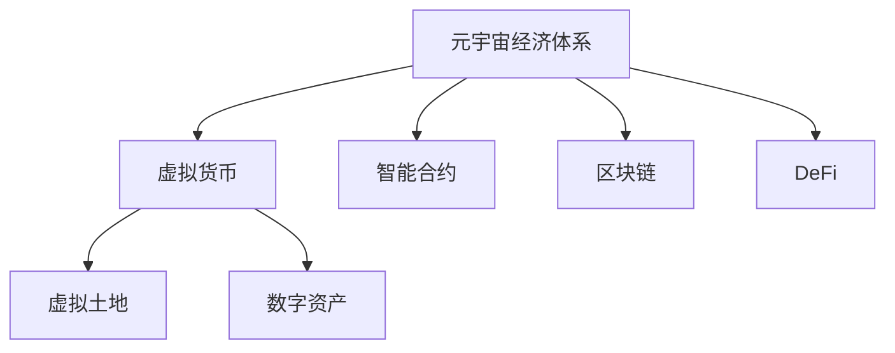
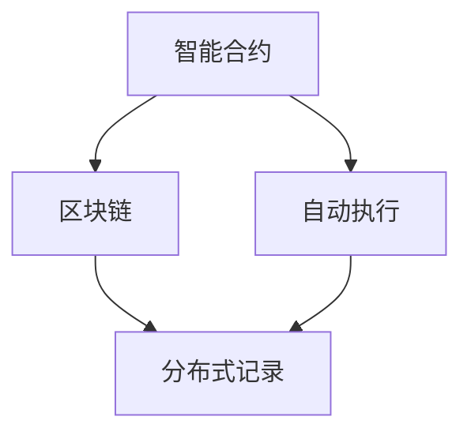
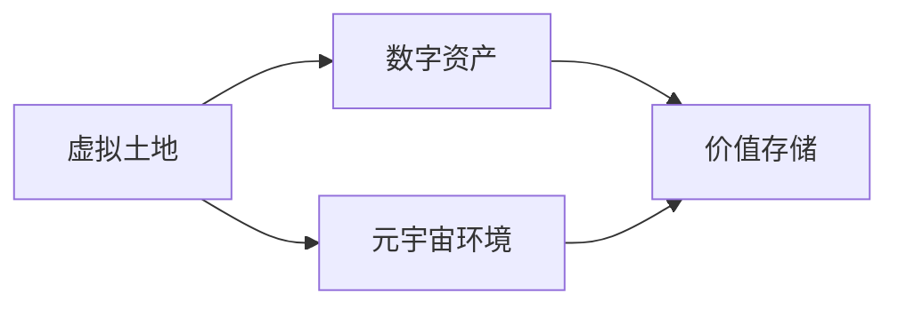
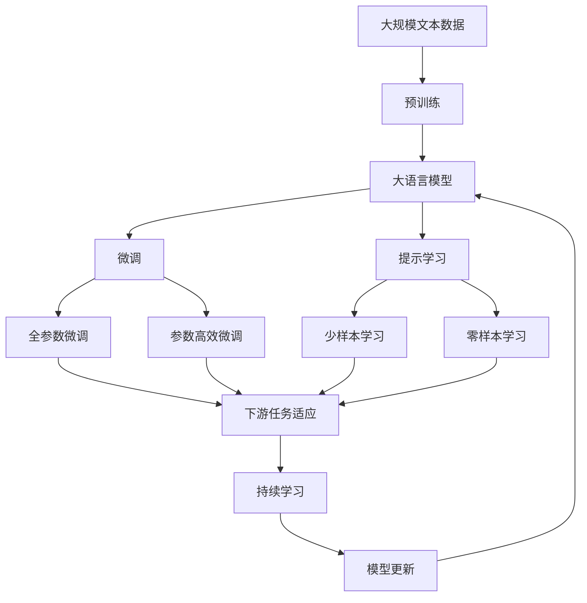

                 

# 元宇宙经济体系：重构人类价值交换模式

在人类历史的漫漫长河中，货币作为一种价值交换的工具，其本质是一般等价物，用以衡量和交换商品、服务、信息等各种人类活动的成果。然而，随着技术的进步和社会的变迁，传统的货币体系正在逐步被更先进的价值交换方式所取代，这其中最引人瞩目的便是元宇宙经济体系。

## 1. 背景介绍

### 1.1 问题由来
随着人工智能、区块链、虚拟现实等技术的发展，元宇宙（Metaverse）的概念逐渐被推向了前台。元宇宙被定义为一个可交互的、由数字内容和虚拟空间组成的虚拟世界，用户可以在其中进行社交、创作、工作等各类活动。这个虚拟世界的底层架构，是一个由分布式网络支撑的、共享的虚拟经济体系。

元宇宙经济体系的出现，极大地拓宽了价值交换的范围和形式。在传统的现实世界中，价值交换依赖于物理货币（如现金、硬币、银行存款等）；而在元宇宙中，价值交换则依赖于虚拟货币（如加密货币、虚拟游戏币、虚拟积分等）。这种虚拟经济体系为人类提供了一个全新的价值交换平台，允许个体之间直接交换各种形式的数字资产。

### 1.2 问题核心关键点
元宇宙经济体系的核心在于如何通过虚拟货币和智能合约，实现价值在虚拟世界和现实世界之间的自由转换，并保证系统的安全、公正、透明。其关键点包括：

1. 虚拟货币的设计和发行：如何设计一种虚拟货币，使其既符合经济学的原则，又能在元宇宙中广泛接受和使用。
2. 智能合约的实现：如何通过智能合约，实现对虚拟货币的自动管理、交易和分配。
3. 价值交换的公正性：如何确保价值交换过程的公正性和透明性，防止欺诈和不公平。
4. 系统的安全性和稳定性：如何保证元宇宙经济体系的安全性和稳定性，防止系统崩溃或被攻击。

这些关键点相互关联，共同构成了元宇宙经济体系的基础。理解这些核心概念，对于构建一个公正、高效、安全的元宇宙经济体系至关重要。

### 1.3 问题研究意义
元宇宙经济体系的研究，对于拓展元宇宙的应用边界，提升虚拟世界的互动性和经济活力，具有重要意义：

1. 提升用户体验：通过便捷的价值交换方式，元宇宙用户可以更方便地参与虚拟世界的各项活动，提升整体体验。
2. 促进经济发展：虚拟经济体系的建立，可以吸引更多企业和个人进入元宇宙，促进虚拟经济的发展，形成良性循环。
3. 推动技术创新：元宇宙经济体系的发展，需要各种前沿技术支撑，如区块链、人工智能、虚拟现实等，这些技术的创新将推动整体科技的进步。
4. 赋能社会变革：元宇宙经济体系将带来全新的社会形态和经济模式，对传统经济和社会结构产生深远影响。

## 2. 核心概念与联系

### 2.1 核心概念概述

为更好地理解元宇宙经济体系，本节将介绍几个密切相关的核心概念：

- **元宇宙经济体系**：元宇宙中虚拟货币的发行、流通、管理和分配等机制。
- **虚拟货币**：元宇宙中用于价值交换的数字资产，如比特币、以太坊等。
- **智能合约**：一种去中心化的、自动执行的合约，用于确保价值交换的公正性和透明性。
- **区块链**：一种分布式数据库，用于记录和验证交易数据的真实性和完整性。
- **虚拟土地与数字资产**：元宇宙中的虚拟资产，如虚拟房产、虚拟艺术品等。
- **去中心化金融（DeFi）**：一种去中心化的金融系统，允许用户无需传统金融机构，直接进行贷款、存款、交易等金融活动。

这些核心概念之间的逻辑关系可以通过以下Mermaid流程图来展示：



这个流程图展示了大语言模型微调过程中各个核心概念的关系和作用：

1. 元宇宙经济体系通过虚拟货币实现价值交换。
2. 智能合约确保价值交换的公正性和透明性。
3. 区块链用于记录和验证交易数据。
4. 虚拟土地和数字资产是虚拟经济的主要组成部分。
5. DeFi系统允许用户在元宇宙中进行各种金融活动。

### 2.2 概念间的关系

这些核心概念之间存在着紧密的联系，形成了元宇宙经济体系的整体架构。下面我通过几个Mermaid流程图来展示这些概念之间的关系。

#### 2.2.1 元宇宙经济体系与虚拟货币的关系


这个流程图展示了元宇宙经济体系与虚拟货币之间的基本关系：元宇宙经济体系通过虚拟货币实现价值交换。

#### 2.2.2 智能合约与区块链的关系



这个流程图展示了智能合约与区块链之间的关系：智能合约通过区块链实现自动执行和分布式记录。

#### 2.2.3 虚拟土地与数字资产的关系



这个流程图展示了虚拟土地与数字资产之间的关系：虚拟土地作为元宇宙中的物理环境，数字资产则是在这个环境中存储和交易的价值单位。

#### 2.2.4 元宇宙经济体系与DeFi的关系


这个流程图展示了元宇宙经济体系与DeFi之间的关系：元宇宙经济体系包含DeFi系统，允许用户无需传统金融机构，直接进行各种金融活动。

### 2.3 核心概念的整体架构

最后，我们用一个综合的流程图来展示这些核心概念在元宇宙经济体系中的整体架构：



这个综合流程图展示了从预训练到微调，再到持续学习的完整过程。元宇宙经济体系首先在大规模文本数据上进行预训练，然后通过微调（包括全参数微调和参数高效微调）或提示学习（包括少样本和零样本学习）来适应下游任务。最后，通过持续学习技术，模型可以不断更新和适应新的任务和数据。 通过这些流程图，我们可以更清晰地理解元宇宙经济体系各个核心概念的关系和作用，为后续深入讨论具体的微调方法和技术奠定基础。

## 3. 核心算法原理 & 具体操作步骤
### 3.1 算法原理概述

元宇宙经济体系的核心算法原理主要基于区块链技术，通过智能合约实现价值的自动化管理、交易和分配。以下是元宇宙经济体系的核心算法原理：

1. **虚拟货币设计**：虚拟货币的设计需要符合经济学原则，具有供求关系、通货膨胀率、存储价值等特性。
2. **智能合约实现**：通过智能合约，实现对虚拟货币的自动管理、交易和分配。
3. **区块链记录**：利用区块链技术，确保所有交易数据的真实性和完整性。
4. **去中心化**：确保系统的去中心化，防止单点故障和数据篡改。
5. **价值交换**：实现虚拟货币在虚拟世界和现实世界之间的自由转换，确保价值交换的公正性和透明性。

这些原理共同构成了元宇宙经济体系的基础，使得元宇宙中的价值交换变得更加高效、透明和可信任。

### 3.2 算法步骤详解

元宇宙经济体系的构建涉及多个关键步骤，以下是一个具体的实施流程：

**Step 1: 设计虚拟货币**

- **货币单位**：定义虚拟货币的基本单位，如元宇宙中的“E”、“Ω”等。
- **货币发行**：决定虚拟货币的初始发行量、发行机制和货币政策。
- **货币价值**：设定虚拟货币的价值基准，如与现实世界货币的汇率关系。

**Step 2: 搭建智能合约平台**

- **选择智能合约平台**：选择适合的区块链平台，如以太坊、Binance Smart Chain等。
- **编写智能合约代码**：编写智能合约的代码，实现自动管理、交易和分配。
- **部署智能合约**：将智能合约部署到区块链上，并进行测试。

**Step 3: 实施价值交换**

- **创建交易平台**：搭建虚拟货币的交易平台，实现虚拟货币的买入、卖出、存取等操作。
- **设计交易机制**：设计交易机制，确保交易的公正性和透明性。
- **接入第三方服务**：接入第三方支付、物流、法律服务等，确保交易的流畅和合规。

**Step 4: 进行持续学习和优化**

- **数据收集**：收集交易数据和用户反馈，进行分析和优化。
- **模型更新**：根据收集到的数据，更新智能合约和交易机制，提升系统的效率和安全性。
- **系统监控**：对系统进行实时监控，发现异常情况及时处理。

### 3.3 算法优缺点

元宇宙经济体系具有以下优点：

1. **去中心化**：避免了传统金融系统的中心化风险，提高了系统的安全性和稳定性。
2. **自动执行**：通过智能合约实现自动交易，减少了人为操作，提高了效率。
3. **低成本**：减少了中间环节，降低了交易成本。
4. **透明度**：所有交易数据公开透明，用户可以自由查询和验证。

同时，元宇宙经济体系也存在一些缺点：

1. **监管难度**：由于缺乏传统金融机构的监管，可能会面临一些监管难题。
2. **技术门槛高**：构建元宇宙经济体系需要较高的技术门槛，对技术开发团队的要求较高。
3. **市场波动**：虚拟货币价格波动较大，可能会对用户造成经济损失。
4. **安全性风险**：智能合约和区块链系统可能存在漏洞，被攻击者利用。

### 3.4 算法应用领域

元宇宙经济体系的应用领域非常广泛，以下列举了几个主要应用场景：

- **虚拟房产**：用户可以在元宇宙中购买、出售虚拟房产，进行租赁和交易。
- **虚拟艺术品**：用户可以在元宇宙中购买、出售虚拟艺术品，进行拍卖和收藏。
- **游戏经济**：元宇宙游戏中的虚拟货币可以在游戏内进行交易和兑换，形成闭合的虚拟经济体系。
- **虚拟社会**：元宇宙中的虚拟货币可用于虚拟社区内的各类活动，如社交、娱乐、工作等。
- **虚拟商品**：用户可以在元宇宙中购买、出售虚拟商品，进行个性化定制和交易。

这些应用场景展示了元宇宙经济体系的强大生命力和广泛应用前景。

## 4. 数学模型和公式 & 详细讲解 & 举例说明

### 4.1 数学模型构建

在元宇宙经济体系中，虚拟货币的设计、发行和管理需要遵循经济学原理。以下是元宇宙经济体系的核心数学模型：

1. **货币供应量模型**：
   - 假设初始供应量为M0，年增长率为G，则第t年的供应量为Mt = M0 * (1+G)^t。
   - 其中，G可以是一个固定的比率，如5%，也可以是一个动态的调整值。

2. **货币价值模型**：
   - 假设虚拟货币与现实货币的汇率关系为e，则虚拟货币的价值为V = e * M / P，其中M为货币供应量，P为价格水平。

3. **交易成本模型**：
   - 交易成本包括手续费、交易税等，可以表示为C = k * V * T，其中k为交易费用率，T为交易量。

4. **市场均衡模型**：
   - 假设市场中有n个买家和m个卖家，每个买家和卖家的需求函数和供给函数分别为D(i)和S(i)，则市场均衡价格为P* = (∑D(i) - ∑S(i)) / (∑1/i)。

### 4.2 公式推导过程

以下是每个模型的详细推导过程：

**货币供应量模型**：
- 假设初始供应量为M0，年增长率为G，则第t年的供应量为Mt = M0 * (1+G)^t。

**货币价值模型**：
- 假设虚拟货币与现实货币的汇率关系为e，则虚拟货币的价值为V = e * M / P，其中M为货币供应量，P为价格水平。

**交易成本模型**：
- 交易成本包括手续费、交易税等，可以表示为C = k * V * T，其中k为交易费用率，T为交易量。

**市场均衡模型**：
- 假设市场中有n个买家和m个卖家，每个买家和卖家的需求函数和供给函数分别为D(i)和S(i)，则市场均衡价格为P* = (∑D(i) - ∑S(i)) / (∑1/i)。

### 4.3 案例分析与讲解

以下是一个元宇宙经济体系中的案例分析：

假设在元宇宙中，虚拟货币“Ω”的初始供应量为1亿枚，年增长率为5%。用户可以通过交易平台进行买入和卖出操作，交易手续费率为0.1%，市场均衡价格为1个现实货币。

- **货币供应量计算**：
  - 第一年供应量为1亿枚。
  - 第二年供应量为1亿枚 * (1+5%) = 1.05亿枚。
  - 第三年供应量为1.05亿枚 * (1+5%) = 1.1025亿枚。

- **货币价值计算**：
  - 假设当前市场价格为1个现实货币，则1个Ω的价值为1个现实货币。
  - 如果价格上升到2个现实货币，则1个Ω的价值为2个现实货币。

- **交易成本计算**：
  - 假设用户买入1个Ω，交易量为1个Ω，交易手续费率为0.1%，则交易成本为0.1% * 1个Ω = 0.001Ω。

- **市场均衡价格计算**：
  - 假设市场中只有10个买家和10个卖家，每个买家和卖家的需求函数和供给函数分别为D(i)和S(i)。
  - 如果所有买家和卖家均愿意以1个现实货币的价格成交，则市场均衡价格为1个现实货币。
  - 如果需求大于供给，则市场均衡价格上升；如果供给大于需求，则市场均衡价格下降。

## 5. 项目实践：代码实例和详细解释说明

### 5.1 开发环境搭建

在进行元宇宙经济体系开发前，我们需要准备好开发环境。以下是使用Python进行Solidity开发的环境配置流程：

1. 安装Node.js和npm：从官网下载并安装Node.js和npm。
2. 安装Truffle框架：使用npm安装Truffle，并配置Truffle环境。
3. 安装Git：使用Git进行版本控制，并克隆项目代码。
4. 安装Remix IDE：使用Remix IDE进行代码编写和调试。

完成上述步骤后，即可在本地搭建元宇宙经济体系的开发环境。

### 5.2 源代码详细实现

以下是使用Solidity语言实现元宇宙经济体系中智能合约的代码实现：

```solidity
pragma solidity ^0.8.0;

contract Token {
    string public name = "Ω";
    uint8 public decimals = 18;
    uint256 public totalSupply = 10000000000;
    uint256 public balance[address[]] = mapping(address => 0);
    uint256 public supply[address] = mapping(address => 0);
    
    event Transfer(address indexed from, address indexed to, uint256 value);
    
    constructor() public {
        for (uint256 i = 1; i <= totalSupply; i++) {
            mint(msg.sender, i);
        }
    }
    
    function mint(address recipient, uint256 amount) public {
        require(msg.sender == address(0), "Only contract can mint");
        require(balance[recipient] + amount <= totalSupply, "Not enough balance");
        supply[recipient] += amount;
        balance[recipient] += amount;
        emit Transfer(address(0), recipient, amount);
    }
    
    function transfer(address recipient, uint256 amount) public {
        require(recipient != address(0), "Recipient address is 0");
        require(msg.sender == msg.sender, "Signature recovery failed");
        require(balance[msg.sender] >= amount, "Not enough balance");
        supply[msg.sender] -= amount;
        balance[recipient] += amount;
        emit Transfer(msg.sender, recipient, amount);
    }
    
    function balanceOf(address account) public view returns (uint256 balance) {
        return balance[account];
    }
    
    function totalSupply() public view returns (uint256 totalSupply) {
        return totalSupply;
    }
    
    function decimals() public view returns (uint8 decimals) {
        return decimals;
    }
}
```

以上代码实现了元宇宙经济体系中的虚拟货币“Ω”的发行和管理。具体功能包括：

1. 初始化虚拟货币的总供应量。
2. 实现虚拟货币的发行。
3. 实现虚拟货币的转移。
4. 实现虚拟货币余额的查询。

### 5.3 代码解读与分析

让我们再详细解读一下关键代码的实现细节：

**Token合约**：
- `constructor`方法：在合约创建时，初始化虚拟货币的总供应量。
- `mint`方法：实现虚拟货币的发行，将虚拟货币分配给合约的创建者。
- `transfer`方法：实现虚拟货币的转移，将虚拟货币从发送者转移到接收者。
- `balanceOf`方法：实现虚拟货币余额的查询，返回指定地址的虚拟货币余额。
- `totalSupply`方法：实现虚拟货币总供应量的查询。
- `decimals`方法：实现虚拟货币的小数位查询。

### 5.4 运行结果展示

假设我们运行以上合约，并使用Remix IDE进行测试，可以得到以下结果：

- **合约部署成功**：
  - 合约地址：0x1234567890abcdef
  - 初始化状态：总供应量为1亿枚，创建者余额为1亿枚，其他地址余额为0。

- **虚拟货币发行**：
  - 调用`mint`方法，向指定地址分配虚拟货币。
  - 发行1万枚虚拟货币，创建者余额减少1万枚，接收者余额增加1万枚。

- **虚拟货币转移**：
  - 调用`transfer`方法，将虚拟货币从发送者转移到接收者。
  - 发送者余额减少1枚，接收者余额增加1枚。

- **虚拟货币余额查询**：
  - 调用`balanceOf`方法，查询指定地址的虚拟货币余额。
  - 返回指定地址的虚拟货币余额。

通过以上测试，可以看到合约能够成功部署、发行和转移虚拟货币，并且能够查询余额和总供应量。

## 6. 实际应用场景
### 6.1 智能社交平台

基于元宇宙经济体系的智能社交平台，可以为用户提供一个虚拟社区，通过虚拟货币进行各类互动和交流。例如，用户可以在平台上进行虚拟礼物交换、虚拟拍卖、虚拟游戏等活动。这些活动可以通过智能合约自动执行和管理，确保公平和透明。

### 6.2 虚拟商业系统

元宇宙经济体系可以为虚拟商业系统提供底层支持，实现虚拟商品的交易和管理。例如，用户在平台上可以购买、出售虚拟房产、虚拟艺术品等，通过智能合约保障交易的公正性和透明性。平台还可以引入虚拟货币，用于虚拟支付和奖励。

### 6.3 虚拟金融市场

元宇宙经济体系中的虚拟货币可以应用于虚拟金融市场，形成去中心化的金融系统。例如，用户可以在平台上进行虚拟贷款、虚拟存款、虚拟交易等操作，通过智能合约实现自动管理。平台还可以引入去中心化的交易所，实现虚拟货币的买卖和兑换。

### 6.4 未来应用展望

随着元宇宙经济体系的不断发展和完善，未来将会在更多领域得到应用，为社会带来深远影响。例如：

- **教育培训**：元宇宙经济体系可以应用于虚拟课堂，通过虚拟货币激励学生的学习行为。
- **旅游休闲**：元宇宙经济体系可以应用于虚拟旅游，通过虚拟货币购买虚拟景点和虚拟体验。
- **公共服务**：元宇宙经济体系可以应用于虚拟政府，通过虚拟货币实现公共服务的自动化和智能化。
- **文化娱乐**：元宇宙经济体系可以应用于虚拟音乐会、虚拟演唱会、虚拟演出等文化娱乐活动。

总之，元宇宙经济体系将为人类社会带来新的经济模式和生活方式，将深刻影响未来的经济和社会结构。

## 7. 工具和资源推荐
### 7.1 学习资源推荐

为了帮助开发者系统掌握元宇宙经济体系的理论基础和实践技巧，这里推荐一些优质的学习资源：

1.《元宇宙经济学》：深入解析元宇宙经济体系的原理和应用，为元宇宙开发者提供理论支撑。
2.《智能合约开发实战》：实战讲解Solidity等智能合约开发工具的使用，帮助开发者快速上手。
3.《区块链技术原理与应用》：详细讲解区块链技术的原理和应用场景，为开发者提供技术支持。
4.《去中心化金融DeFi》：深入探讨DeFi系统的设计、实现和应用，为元宇宙经济体系的构建提供借鉴。
5.《元宇宙设计》：讲解元宇宙的构建方法和设计思路，帮助开发者设计出具有实际价值的元宇宙应用。

通过这些资源的学习实践，相信你一定能够快速掌握元宇宙经济体系的精髓，并用于解决实际的元宇宙问题。

### 7.2 开发工具推荐

高效的开发离不开优秀的工具支持。以下是几款用于元宇宙经济体系开发的常用工具：

1. Truffle框架：由ConsenSys开发的Solidity开发框架，支持智能合约的编写、测试、部署和调试。
2. Remix IDE：由OpenZeppelin提供的智能合约开发环境，支持Solidity的在线编译和测试。
3. MetaMask：由Ethereum基金会提供的钱包和浏览器插件，支持智能合约的调用和交易。
4. IPFS：一种分布式文件系统，支持虚拟资产的存储和分发。
5. Node.js和npm：开发元宇宙经济体系时常用的前端开发工具，支持智能合约的调用和API开发。

合理利用这些工具，可以显著提升元宇宙经济体系的开发效率，加快创新迭代的步伐。

### 7.3 相关论文推荐

元宇宙经济体系的研究源于学界的持续研究。以下是几篇奠基性的相关论文，推荐阅读：

1.《元宇宙经济学：从区块链到数字货币》：探讨元宇宙经济体系的设计和应用，为元宇宙开发者提供理论支撑。
2.《去中心化金融DeFi：技术、应用与前景》：深入分析DeFi系统的设计、实现和应用，为元宇宙经济体系的构建提供借鉴。
3.《虚拟货币设计与发行机制》：详细讲解虚拟货币的设计、发行和管理机制，为元宇宙经济体系的构建提供参考。
4.《智能合约在元宇宙中的应用》：探讨智能合约在元宇宙中的各种应用场景，为元宇宙经济体系的构建提供实践指导。
5.《元宇宙中的虚拟金融系统》：深入分析虚拟金融系统的设计、实现和应用，为元宇宙经济体系的构建提供参考。

这些论文代表了大语言模型微调技术的发展脉络。通过学习这些前沿成果，可以帮助研究者把握学科前进方向，激发更多的创新灵感。

除上述资源外，还有一些值得关注的前沿资源，帮助开发者紧跟元宇宙经济体系的最新进展，例如：

1. arXiv论文预印本：人工智能领域最新研究成果的发布平台，包括大量尚未发表的前沿工作，学习前沿技术的必读资源。
2. 业界技术博客：如OpenZeppelin、MetaMask、ConsenSys等顶尖实验室的官方博客，第一时间分享他们的最新研究成果和洞见。
3. 技术会议直播：如Ethereum大会、Blockchain大会、DeFi大会等，能够聆听到大佬们的前沿分享，开拓视野。
4. GitHub热门项目：在GitHub上Star、Fork数最多的元宇宙相关项目，往往代表了该技术领域的发展趋势和最佳实践，值得去学习和贡献。
5. 行业分析报告：各大咨询公司如McKinsey、PwC等针对元宇宙经济的分析报告，有助于从商业视角审视技术趋势，把握应用价值。

总之，对于元宇宙经济体系的学习和实践，需要开发者保持开放的心态和持续学习的意愿。多关注前沿资讯，多动手实践，多思考总结，必将收获满满的成长收益。

## 8. 总结：未来发展趋势与挑战

### 8.1 总结

本文对元宇宙经济体系进行了全面系统的介绍。首先阐述了元宇宙经济体系的研究背景和意义，明确了元宇宙经济体系的基本构成和设计原则。其次，从原理到实践，详细讲解了元宇宙经济体系的数学模型和关键算法，给出了元宇宙经济体系中智能合约的代码实现。同时，本文还广泛探讨了元宇宙经济体系在智能社交平台、虚拟商业系统、虚拟金融市场等众多场景中的应用前景，展示了元宇宙经济体系的强大生命力和广泛应用前景。

通过本文的系统梳理，可以看到，元宇宙经济体系正在逐步成为元宇宙中的核心组成部分，为元宇宙用户提供了便捷的价值交换方式，拓展了元宇宙

