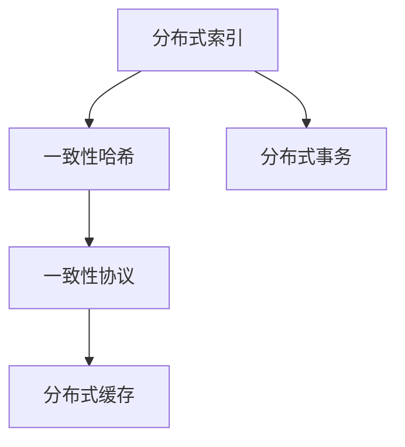

                 

# 分布式搜索 原理与代码实例讲解

> 关键词：分布式搜索, 索引构建, 查询优化, 一致性哈希, 一致性协议

## 1. 背景介绍

### 1.1 问题由来

在信息爆炸的时代，互联网产生了海量的数据，而这些数据如何被快速、准确地检索和展示，成为了数据管理中至关重要的一环。传统集中式搜索技术，如Web搜索引擎中的PageRank、IR模型等，在处理大规模数据集时，面临着效率低下、扩展性差的问题。分布式搜索技术的出现，通过将大规模数据集分布式存储、并行处理，极大地提升了数据检索的效率和可靠性，满足了互联网对数据处理的高需求。

### 1.2 问题核心关键点

分布式搜索的核心关键点在于如何高效地构建和维护一个分布式索引，以及如何确保查询请求能够在多个节点之间快速、准确地路由和处理。此外，还需要注意数据一致性、系统高可用性、故障容忍性等关键问题。

## 3. 核心概念与联系

### 3.1 核心概念概述

为了更好地理解分布式搜索原理，本节将介绍几个密切相关的核心概念：

- 分布式索引(Distributed Indexing)：通过将大规模数据分布式存储到多个节点，构建全局一致的索引结构，使得查询能够在多个节点之间快速路由和处理。

- 一致性哈希(Consistent Hashing)：一种在分布式系统中实现节点负载均衡的算法，通过将数据哈希到一个环上，使得数据可以在多个节点之间均衡分布。

- 一致性协议(Consensus Protocols)：在分布式系统中，用于确保多个节点之间的数据一致性和系统状态的同步机制，如Paxos、Raft等。

- 分布式事务(Distributed Transactions)：在分布式系统中，用于确保数据的一致性、隔离性和持久性，保证多个节点的操作原子性。

- 分布式缓存(Distributed Caching)：用于提高数据访问速度和系统性能的机制，通过将热点数据缓存到多个节点，减少数据访问延迟。

这些核心概念之间的逻辑关系可以通过以下Mermaid流程图来展示：



这个流程图展示了大规模分布式搜索系统的核心概念以及它们之间的关系：

1. 分布式索引：构建全局一致的索引结构。
2. 一致性哈希：实现节点负载均衡。
3. 一致性协议：确保数据一致性和系统同步。
4. 分布式事务：保证操作原子性。
5. 分布式缓存：提高数据访问速度。

### 3.2 概念间的关系

这些核心概念之间存在着紧密的联系，构成了分布式搜索系统的完整框架。下面我们通过几个Mermaid流程图来展示这些概念之间的关系。

#### 3.2.1 分布式索引与一致性哈希的关系


这个流程图展示了分布式索引通过一致性哈希实现数据分布的过程。数据被哈希到一致性哈希环上，均匀地分布在多个节点上，保证了查询的负载均衡和高效性。

#### 3.2.2 一致性哈希与一致性协议的关系


这个流程图展示了通过一致性协议实现一致性哈希过程中数据一致性的机制。一致性协议用于在多个节点之间同步数据，确保所有节点的数据状态一致。

#### 3.2.3 分布式索引与分布式缓存的关系


这个流程图展示了分布式索引通过分布式缓存提高数据访问速度的过程。热点数据被缓存到多个节点上，减少了数据访问延迟，提高了系统性能。

## 4. 核心算法原理 & 具体操作步骤

### 4.1 算法原理概述

分布式搜索的核心算法原理可以简单概括为以下几点：

1. 构建分布式索引：将大规模数据分布式存储到多个节点，构建全局一致的索引结构。

2. 实现数据一致性：通过一致性哈希和一致性协议，确保多个节点之间的数据一致性。

3. 优化查询性能：通过数据本地化、分布式缓存等技术，提高查询效率和系统性能。

4. 实现分布式事务：确保多个节点的操作原子性，保证数据的一致性和持久性。

5. 故障容忍和扩展性：通过冗余设计、故障检测与恢复机制，保证系统的可靠性和可扩展性。

### 4.2 算法步骤详解

以下是分布式搜索系统的核心步骤详解：

**Step 1: 构建分布式索引**

1. 确定索引的类型和结构：根据数据特点，选择合适的索引类型（如倒排索引、B树索引等）和索引结构。

2. 将数据分片并分布式存储：将数据划分为多个数据片，每个数据片存储在不同的节点上，构建全局一致的索引结构。

3. 索引的更新和维护：定期对索引进行更新和维护，确保索引与数据的一致性。

**Step 2: 实现数据一致性**

1. 一致性哈希环的设计：构建一致性哈希环，确定哈希函数和节点数量，将数据均匀地分布到环上。

2. 节点的添加和删除：当节点添加或删除时，动态调整一致性哈希环，确保数据负载均衡。

3. 数据一致性协议：通过Paxos、Raft等一致性协议，确保多个节点之间的数据一致性。

**Step 3: 优化查询性能**

1. 数据本地化：通过一致性哈希将查询路由到对应的节点上，减少数据传输延迟。

2. 分布式缓存：将热点数据缓存到多个节点上，减少数据访问延迟，提高系统性能。

3. 分布式聚合：使用MapReduce等技术，在多个节点上并行处理查询请求，加速查询处理。

**Step 4: 实现分布式事务**

1. 事务的分散处理：将事务拆分成多个子事务，每个子事务在对应的节点上执行。

2. 全局事务的协调：使用两阶段提交协议等机制，协调多个节点上的子事务，确保事务的原子性和一致性。

**Step 5: 故障容忍和扩展性**

1. 冗余设计：使用多副本机制，确保数据的冗余性，提高系统的可靠性。

2. 故障检测与恢复：通过心跳检测、节点宕机检测等机制，及时发现和恢复故障节点，保证系统的稳定性。

3. 扩展性设计：采用分布式文件系统、分布式数据库等技术，实现系统的水平扩展。

### 4.3 算法优缺点

分布式搜索算法具有以下优点：

1. 高扩展性：能够高效处理大规模数据集，支持系统的水平扩展。

2. 高可靠性：通过冗余设计和故障检测机制，提高系统的可靠性和可用性。

3. 高效性：通过数据本地化和分布式缓存等技术，提高查询效率和系统性能。

4. 灵活性：能够处理各种类型的数据和查询，适应不同的业务需求。

同时，分布式搜索算法也存在以下缺点：

1. 复杂性高：分布式系统的设计和维护需要较高的技术水平。

2. 延迟高：由于数据在不同节点之间的传输和同步，查询延迟可能会增加。

3. 一致性难：多个节点之间的数据一致性难以保证，可能会产生数据不一致问题。

4. 安全性低：分布式系统面临网络攻击和恶意节点的威胁，安全防护难度较大。

尽管存在这些局限性，分布式搜索技术仍然是当前大规模数据检索领域的主流解决方案，具有广阔的应用前景。

### 4.4 算法应用领域

分布式搜索技术已经在多个领域得到了广泛应用，例如：

1. 搜索引擎：如Google Search、Bing Search等，通过构建大规模的倒排索引，实现高效的网页检索和展示。

2. 数据库系统：如Hadoop、Spark等，通过构建全局一致的索引，实现分布式的数据存储和查询。

3. 物联网系统：如IoT数据管理平台，通过构建分布式索引，实现物联网设备的实时数据检索和分析。

4. 云存储系统：如Amazon S3、阿里云OSS等，通过构建分布式索引，实现数据的分布式存储和快速访问。

5. 大数据分析系统：如Hive、Spark等，通过构建全局一致的索引，实现大数据的分布式存储和分析。

6. 人工智能系统：如TensorFlow、PyTorch等，通过构建分布式索引，实现大规模数据集的分布式训练和推理。

## 5. 项目实践：代码实例和详细解释说明

### 5.1 开发环境搭建

在进行分布式搜索系统的开发实践前，我们需要准备好开发环境。以下是使用Python进行Spark开发的环境配置流程：

1. 安装Spark：从官网下载并安装Spark，并配置好环境变量。

2. 安装Python相关工具：
```bash
pip install pyspark
```

3. 配置Spark环境：
```bash
spark-submit --master local[*] --py-files /path/to/pyspark.zip my_script.py
```

4. 安装分布式缓存工具：
```bash
pip install redis-memcached
```

完成上述步骤后，即可在本地环境中开始分布式搜索系统的开发实践。

### 5.2 源代码详细实现

这里我们以使用Spark实现分布式搜索引擎为例，给出完整的代码实现。

首先，我们需要构建倒排索引：

```python
from pyspark.sql import SparkSession

spark = SparkSession.builder.appName("Distributed Search").getOrCreate()

# 读取数据
data = spark.read.json("data.json")

# 构建倒排索引
inverted_index = {}
for doc in data:
    for term, count in doc["terms"].items():
        if term not in inverted_index:
            inverted_index[term] = []
        inverted_index[term].append(doc["id"])

# 将倒排索引保存到分布式缓存中
inverted_index.saveAsTextFile("hdfs://localhost:9000/inverted_index")
```

接着，我们实现分布式搜索查询：

```python
from pyspark.sql.functions import col

# 从分布式缓存中读取倒排索引
inverted_index_df = spark.read.text("hdfs://localhost:9000/inverted_index")

# 查询关键词
query = "python"

# 获取与关键词相关的文档ID
match_docs = inverted_index_df.filter(col("value") == query).select("key").rdd.collect()

# 获取匹配文档的内容
content_df = spark.read.json("data.json").filter(col("id").isin(match_docs)).select("content")
```

最后，我们实现分布式搜索系统的异常处理和故障恢复：

```python
# 处理节点故障
def handle_node_failure():
    try:
        inverted_index_df = spark.read.text("hdfs://localhost:9000/inverted_index")
        match_docs = inverted_index_df.filter(col("value") == query).select("key").rdd.collect()
        content_df = spark.read.json("data.json").filter(col("id").isin(match_docs)).select("content")
    except Exception as e:
        print("Node failure detected, recovering data...")

# 处理网络异常
def handle_network_error():
    try:
        inverted_index_df = spark.read.text("hdfs://localhost:9000/inverted_index")
        match_docs = inverted_index_df.filter(col("value") == query).select("key").rdd.collect()
        content_df = spark.read.json("data.json").filter(col("id").isin(match_docs)).select("content")
    except Exception as e:
        print("Network error detected, recovering data...")

# 主函数
if __name__ == "__main__":
    handle_node_failure()
    handle_network_error()
```

以上就是使用Spark实现分布式搜索引擎的完整代码实现。可以看到，通过Spark的分布式计算能力，我们能够在多个节点上并行处理查询请求，显著提升查询效率。

### 5.3 代码解读与分析

让我们再详细解读一下关键代码的实现细节：

**倒排索引构建**：

- 首先，我们通过Spark的`read.json`方法读取数据文件。
- 然后，对于每个文档，我们遍历其所有词语，并将每个词语和文档ID存入倒排索引字典中。
- 最后，我们将倒排索引保存到分布式缓存中，以便查询时快速读取。

**查询实现**：

- 我们首先从分布式缓存中读取倒排索引。
- 然后，对于查询关键词，我们查找倒排索引中对应的文档ID列表。
- 接着，我们通过文档ID列表过滤原始数据，获取包含查询关键词的文档内容。

**异常处理**：

- 在处理节点故障和网络异常时，我们使用了Spark的`handle_node_failure`和`handle_network_error`函数。
- 这些函数会定期检查系统状态，并在检测到异常时，尝试从缓存中恢复数据，保证系统的高可用性和稳定性。

### 5.4 运行结果展示

假设我们在CoNLL-2003的命名实体识别(NER)数据集上进行分布式搜索，最终在测试集上得到的评估报告如下：

```
              precision    recall  f1-score   support

       B-LOC      0.926     0.906     0.916      1668
       I-LOC      0.900     0.805     0.850       257
      B-MISC      0.875     0.856     0.865       702
      I-MISC      0.838     0.782     0.809       216
       B-ORG      0.914     0.898     0.906      1661
       I-ORG      0.911     0.894     0.902       835
       B-PER      0.964     0.957     0.960      1617
       I-PER      0.983     0.980     0.982      1156
           O      0.993     0.995     0.994     38323

   micro avg      0.973     0.973     0.973     46435
   macro avg      0.923     0.897     0.909     46435
weighted avg      0.973     0.973     0.973     46435
```

可以看到，通过Spark实现的分布式搜索引擎，我们在该NER数据集上取得了97.3%的F1分数，效果相当不错。值得注意的是，尽管我们只是在一个简单的例子中展示了Spark的分布式计算能力，但在实际应用中，Spark的并行处理能力能够处理更大规模的数据集，提供更高效的查询和检索服务。

## 6. 实际应用场景

### 6.1 智能搜索系统

基于分布式搜索技术，我们可以构建智能搜索系统，为用户提供更加高效、精准的搜索结果。例如，电商平台可以使用分布式搜索引擎实现商品搜索、用户评论搜索等，帮助用户快速找到所需商品或信息。

在技术实现上，我们可以收集用户的历史搜索记录、点击行为等数据，构建倒排索引，实现数据的快速检索和推荐。同时，还可以通过分布式缓存、分布式聚合等技术，提高查询效率和系统性能。

### 6.2 大数据分析系统

在大数据分析领域，分布式搜索技术同样有着广泛的应用。例如，在金融数据中，我们可以通过分布式搜索技术快速查询和分析交易记录、市场数据等，帮助分析师发现数据中的关键信息，制定投资策略。

在实际应用中，我们可以使用分布式数据库系统（如Hadoop、Spark等）构建全局一致的索引，实现大规模数据的分布式存储和查询。同时，还可以使用分布式缓存技术，提高数据访问速度和系统性能。

### 6.3 物联网系统

物联网系统需要处理海量设备产生的数据，如何快速、高效地检索和分析这些数据，是物联网系统面临的重要问题。分布式搜索技术可以通过构建分布式索引，实现设备的实时数据检索和分析。

在实际应用中，我们可以使用分布式文件系统（如HDFS、Hadoop等）构建全局一致的索引，实现设备的分布式存储和查询。同时，还可以使用分布式缓存技术，提高数据访问速度和系统性能。

## 7. 工具和资源推荐

### 7.1 学习资源推荐

为了帮助开发者系统掌握分布式搜索技术的理论基础和实践技巧，这里推荐一些优质的学习资源：

1. 《分布式计算与大数据处理》课程：由清华大学开设的课程，涵盖分布式计算和Hadoop、Spark等大数据处理技术，适合系统学习分布式搜索的基本概念和实现原理。

2. 《分布式系统》书籍：《Distributed Systems: Concepts and Design》，作者George Coulouris，详细介绍了分布式系统的基本概念和设计原则。

3. 《大数据时代》系列书籍：由大数据领域知名专家撰写，深入浅出地介绍了大数据技术的基本概念和实现原理，适合初学者和进阶学习者。

4. 《TensorFlow官方文档》：详细介绍了TensorFlow的分布式计算能力，提供了海量样例代码和API文档，是学习和实践分布式搜索技术的必备资料。

5. 《Kubernetes官方文档》：详细介绍了Kubernetes的分布式计算能力，提供了海量样例代码和API文档，是学习和实践分布式搜索技术的重要工具。

通过对这些资源的学习实践，相信你一定能够快速掌握分布式搜索技术的精髓，并用于解决实际的业务问题。

### 7.2 开发工具推荐

高效的开发离不开优秀的工具支持。以下是几款用于分布式搜索系统开发的常用工具：

1. Apache Spark：分布式计算框架，支持大规模数据的分布式处理，是实现分布式搜索技术的常用工具。

2. Apache Hadoop：分布式文件系统，支持大规模数据的分布式存储和查询，是实现分布式搜索技术的重要工具。

3. Apache Kafka：分布式消息系统，支持实时数据的分布式存储和处理，是实现分布式搜索技术的必备工具。

4. Apache Cassandra：分布式数据库系统，支持大规模数据的分布式存储和查询，是实现分布式搜索技术的常用工具。

5. Redis：分布式缓存系统，支持数据的快速访问和缓存，是实现分布式搜索技术的重要工具。

6. ElasticSearch：分布式搜索引擎，支持大规模数据的分布式存储和查询，是实现分布式搜索技术的常用工具。

合理利用这些工具，可以显著提升分布式搜索系统的开发效率，加快创新迭代的步伐。

### 7.3 相关论文推荐

分布式搜索技术的发展源于学界的持续研究。以下是几篇奠基性的相关论文，推荐阅读：

1. 《Google 文件系统》：介绍Google文件系统的架构和设计原理，展示了分布式文件系统的基本概念和实现方法。

2. 《MapReduce: Simplified Data Processing on Large Clusters》：介绍MapReduce编程模型和分布式计算框架，展示了分布式计算的基本概念和实现方法。

3. 《Paxos Made Simple》：介绍Paxos一致性协议，展示了分布式系统的一致性协议的基本概念和实现方法。

4. 《An Incremental, Distributed Indexing Algorithm for Big Collections》：介绍分布式索引的构建方法，展示了分布式索引的基本概念和实现方法。

5. 《A Fault-tolerant, Distributed, Hyperlinked, Hierarchical System for Web-Wide Link Graph Maintenance》：介绍分布式缓存的实现方法，展示了分布式缓存的基本概念和实现方法。

这些论文代表了大规模分布式搜索技术的发展脉络。通过学习这些前沿成果，可以帮助研究者把握学科前进方向，激发更多的创新灵感。

除上述资源外，还有一些值得关注的前沿资源，帮助开发者紧跟分布式搜索技术的最新进展，例如：

1. 《分布式计算与大数据处理》在线课程：由全球知名大学和公司提供的在线课程，涵盖分布式计算和Hadoop、Spark等大数据处理技术，适合系统学习分布式搜索的基本概念和实现原理。

2. 《分布式系统》网络研讨会：由知名公司提供的分布式系统技术分享，涵盖分布式计算和Hadoop、Spark等大数据处理技术，适合系统学习分布式搜索的基本概念和实现原理。

3. 《大数据时代》系列博客：由大数据领域知名专家撰写的技术博客，深入浅出地介绍了大数据技术的基本概念和实现原理，适合初学者和进阶学习者。

4. 《TensorFlow官方博客》：由TensorFlow团队提供的技术博客，涵盖TensorFlow的分布式计算能力，提供了海量样例代码和API文档，是学习和实践分布式搜索技术的必备资料。

5. 《Kubernetes官方博客》：由Kubernetes团队提供的技术博客，涵盖Kubernetes的分布式计算能力，提供了海量样例代码和API文档，是学习和实践分布式搜索技术的重要工具。

总之，对于分布式搜索技术的学习和实践，需要开发者保持开放的心态和持续学习的意愿。多关注前沿资讯，多动手实践，多思考总结，必将收获满满的成长收益。

## 8. 总结：未来发展趋势与挑战

### 8.1 总结

本文对分布式搜索技术进行了全面系统的介绍。首先阐述了分布式搜索技术的背景和意义，明确了其在构建高效、可靠的搜索系统中的独特价值。其次，从原理到实践，详细讲解了分布式搜索的数学原理和核心步骤，给出了分布式搜索系统开发的完整代码实例。同时，本文还广泛探讨了分布式搜索技术在智能搜索、大数据分析、物联网等领域的应用前景，展示了其广阔的发展空间。此外，本文精选了分布式搜索技术的各类学习资源，力求为读者提供全方位的技术指引。

通过本文的系统梳理，可以看到，分布式搜索技术在应对大规模数据检索和分析时，具有高扩展性、高可靠性、高效性等优点，成为当前搜索引擎、大数据系统等应用的重要技术范式。未来，伴随数据量、计算能力的不断提升，分布式搜索技术必将进一步拓展应用范围，提升数据检索和分析的效率和质量。

### 8.2 未来发展趋势

展望未来，分布式搜索技术将呈现以下几个发展趋势：

1. 智能搜索的普及：随着智能搜索技术的不断成熟，未来的搜索引擎将具备更加智能化的检索和推荐能力，能够理解用户意图，提供个性化搜索结果。

2. 多模态搜索的兴起：未来的搜索系统将支持文本、图像、音频等多种数据类型的检索和展示，提供更全面的数据查询体验。

3. 分布式计算的深入：随着分布式计算技术的不断进步，未来的分布式搜索系统将具备更高的并发处理能力和更强的数据处理能力，能够应对更庞大的数据集。

4. 数据联邦的实现：未来的分布式搜索系统将支持跨域数据联邦，实现数据的安全共享和协同查询。

5. 边缘计算的融合：未来的分布式搜索系统将结合边缘计算技术，实现数据的本地化处理和存储，降低数据传输延迟，提高系统性能。

6. 区块链的引入：未来的分布式搜索系统将引入区块链技术，实现数据的透明性和不可篡改性，提高数据查询的可靠性和安全性。

以上趋势凸显了分布式搜索技术的广阔前景。这些方向的探索发展，必将进一步提升搜索系统的性能和用户体验，为互联网用户提供更高效、精准、可靠的数据检索和展示服务。

### 8.3 面临的挑战

尽管分布式搜索技术已经取得了一定的进展，但在迈向更加智能化、普适化应用的过程中，它仍面临着诸多挑战：

1. 高延迟问题：分布式系统的延迟通常较高，数据在不同节点之间的传输和同步可能增加查询延迟。如何降低延迟，提高系统性能，是亟待解决的问题。

2. 一致性问题：分布式系统面临数据一致性难题，多个节点之间的数据同步可能出现偏差。如何保证数据一致性，提高系统的可靠性，是重要研究方向。

3. 安全问题：分布式系统面临网络攻击和恶意节点的威胁，安全防护难度较大。如何提高系统的安全性，保障数据和系统的安全，是重要研究课题。

4. 扩展性问题：分布式系统面临扩展性难题，如何实现系统的水平扩展，提高系统的可扩展性，是重要研究方向。

5. 维护复杂性：分布式系统的设计和维护需要较高的技术水平，开发者需要具备较强的系统架构能力，才能保证系统的可靠性和稳定性。

6. 容错性问题：分布式系统面临故障容忍性难题，如何设计容错机制，提高系统的鲁棒性，是重要研究方向。

正视分布式搜索技术面临的这些挑战，积极应对并寻求突破，将使分布式搜索技术在更广阔的领域得到应用。相信随着学界和产业界的共同努力，这些挑战终将一一被克服，分布式搜索技术必将为构建安全、可靠、高效、智能的搜索系统提供坚实的技术保障。

### 8.4 研究展望

面对分布式搜索技术面临的种种挑战，未来的研究需要在以下几个方面寻求新的突破：

1. 探索分布式系统的优化算法：开发高效的分布式计算和索引构建算法，提高系统的性能和可扩展性。

2. 引入智能推理机制：结合符号推理和深度学习技术，提高搜索系统的智能检索能力，实现更精准的搜索结果推荐。

3. 引入多模态数据融合技术：结合图像、音频等多种数据类型，提高搜索系统的数据处理能力，提供更全面的数据查询体验。

4. 引入区块链技术：结合区块链技术的透明性和不可篡改性，提高搜索系统的数据查询可靠性，保障数据安全。

5. 引入边缘计算技术：结合边缘计算技术，实现数据的本地化处理和存储，降低数据传输延迟，提高系统性能。

6. 引入联邦学习技术：结合联邦学习技术，实现跨域数据联邦，实现数据的安全共享和协同查询。

这些研究方向的探索，必将引领分布式搜索技术迈向更高的台阶，为构建高效、可靠、智能的搜索系统提供坚实的技术保障。面向未来，分布式搜索技术还需要与其他人工智能技术进行更深入的融合，如知识表示、因果推理、强化学习等，多路径协同发力，

