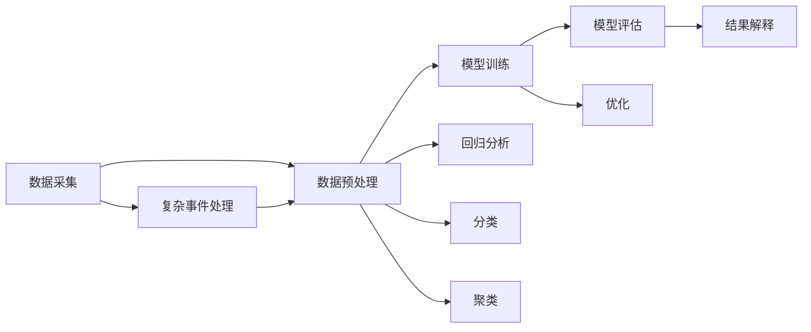
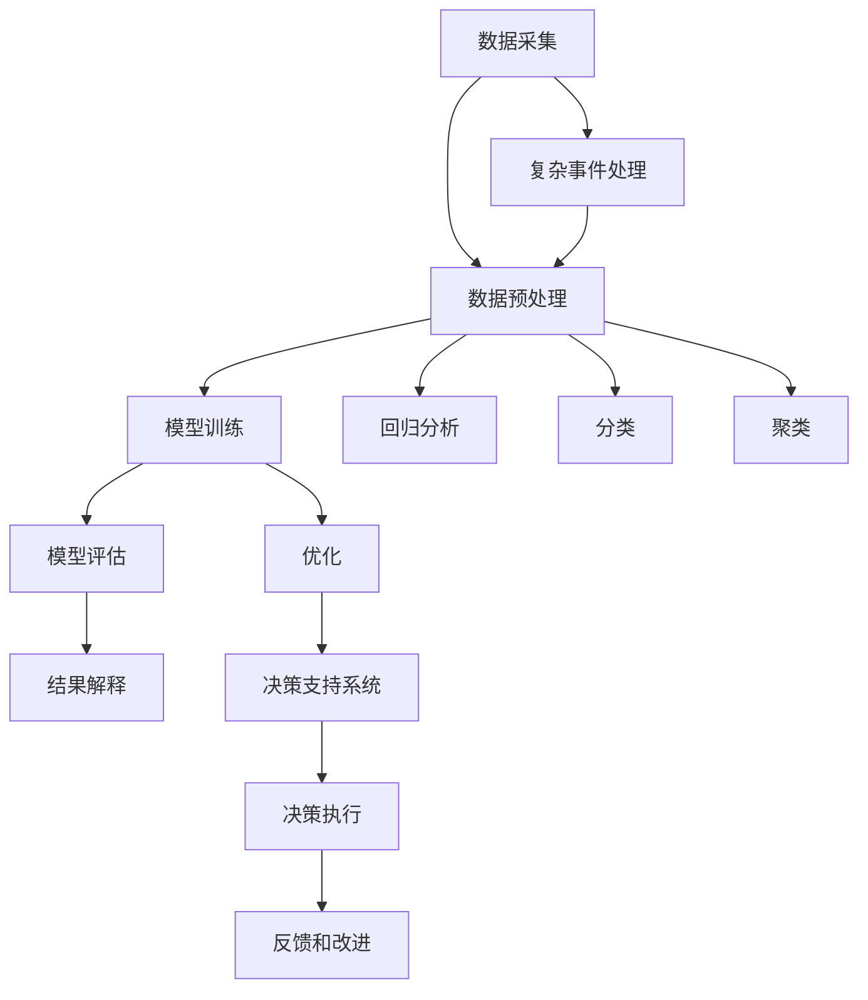

                 

# 判断力和处置复杂事件的决策能力：个人基于自身特质以及相关知识和经验形成观点并做出决定的能力

> 关键词：
判断力, 决策能力, 复杂事件, 数据处理, 算法模型, 人工智能

## 1. 背景介绍

### 1.1 问题由来

在当今复杂多变的社会环境中，个人、团队、组织和政府机构每天都面临众多复杂事件需要处理和决策。无论是在应对突发公共卫生事件、市场金融波动、环境污染、外交冲突，还是在解决企业内部问题、客户投诉、产品研发等，良好的判断力和决策能力对于提高应对效率、减轻潜在风险、提升解决方案的科学性和合理性至关重要。

传统上，决策往往依赖于个人或集体的直觉、经验、专业知识等，难以量化和系统化处理。近年来，随着人工智能和大数据技术的飞速发展，将数据和算法应用于决策分析，成为提高判断力和决策能力的新途径。通过引入数据驱动的决策方法，不仅能够提升决策的科学性和合理性，还能显著增强个体和组织的应对能力和风险控制能力。

### 1.2 问题核心关键点

为了更系统地理解判断力和决策能力，本文将重点讨论以下核心关键点：

1. **数据驱动的决策分析**：利用大数据和人工智能技术，从海量数据中提取关键信息，辅助决策。
2. **复杂事件处理**：如何高效处理复杂、多变量、高维度的数据集，提炼关键特征和模式。
3. **算法模型选择**：介绍常用决策分析算法，包括回归分析、分类、聚类、优化等。
4. **模型评估与验证**：如何评估和验证决策模型的效果，确保其可靠性。
5. **决策支持系统**：将数据驱动的决策方法集成到决策支持系统中，提升决策效率和质量。

### 1.3 问题研究意义

通过深入研究数据驱动的决策分析方法，本文旨在帮助个人和组织提升判断力和决策能力，构建高效、可靠、灵活的决策系统。研究具有以下几方面意义：

1. **提高决策效率和准确性**：数据驱动的决策方法能够基于大量数据，提取关键信息和模式，提高决策的科学性和准确性。
2. **增强风险控制能力**：通过数据挖掘和模型预测，识别潜在风险和问题，提前采取措施，降低决策失误和风险。
3. **促进数据科学普及**：本文旨在推广数据驱动的决策分析方法，推动更多个人和组织掌握和应用数据科学。
4. **支持智慧城市建设**：数据驱动的决策方法能够应用于城市管理、交通、公共卫生等领域，提升城市运行效率和居民生活质量。
5. **促进人工智能产业化应用**：将数据科学和人工智能技术应用于实际决策，加速人工智能技术在各行业的应用和落地。

## 2. 核心概念与联系

### 2.1 核心概念概述

为了更好地理解数据驱动的决策分析方法，本节将介绍几个密切相关的核心概念：

- **数据驱动决策（Data-Driven Decision Making）**：利用数据分析和模型预测辅助决策的过程。
- **复杂事件处理（Complex Event Processing, CEP）**：处理和分析复杂、动态、多源数据的技术，支持实时决策。
- **回归分析（Regression Analysis）**：一种统计学方法，用于探索变量之间的关系，预测数值型变量。
- **分类（Classification）**：将数据分为不同类别的过程，用于解决分类问题。
- **聚类（Clustering）**：将相似数据点分组的过程，用于发现数据集中的群体结构。
- **优化（Optimization）**：寻找使目标函数最大或最小化的变量解集，用于资源分配和调度。

这些概念之间通过数据采集、数据预处理、模型训练、模型评估和结果解释等步骤相联系，形成一个完整的决策分析流程。

### 2.2 概念间的关系

这些核心概念之间的关系可以通过以下Mermaid流程图来展示：



这个流程图展示了大数据决策分析的完整流程：

1. 从数据采集开始，通过复杂事件处理技术对多源数据进行集成和预处理。
2. 对预处理后的数据进行模型训练，选择回归、分类、聚类或优化等算法。
3. 通过模型评估，验证和优化模型的预测效果。
4. 对模型结果进行解释，形成决策建议。

### 2.3 核心概念的整体架构

最后，我们用一个综合的流程图来展示这些核心概念在大数据决策分析中的整体架构：



这个综合流程图展示了从数据采集到决策执行的完整流程。通过集成复杂事件处理、回归分析、分类、聚类和优化等算法，能够高效处理复杂数据，辅助决策，并根据反馈不断改进决策模型。

## 3. 核心算法原理 & 具体操作步骤
### 3.1 算法原理概述

数据驱动的决策分析方法主要基于统计学和机器学习原理，通过数据采集、预处理、模型训练、模型评估和结果解释等步骤，从数据中提取关键信息和模式，辅助决策。其核心思想是通过建立模型，预测未来趋势和结果，从而辅助决策制定。

### 3.2 算法步骤详解

数据驱动的决策分析一般包括以下几个关键步骤：

1. **数据采集**：从各种数据源（如传感器、日志、数据库等）收集数据。
2. **数据预处理**：对数据进行清洗、去重、归一化等处理，保证数据质量和一致性。
3. **模型训练**：选择合适的算法模型，利用训练数据进行模型训练。
4. **模型评估**：通过验证数据集对模型进行评估，检验模型预测效果。
5. **结果解释**：对模型预测结果进行解释，提供决策建议。

### 3.3 算法优缺点

数据驱动的决策分析方法具有以下优点：

1. **提升决策科学性**：通过数据分析和模型预测，提高决策的科学性和准确性。
2. **增强数据利用效率**：利用大数据技术，提高数据利用效率，发现数据中的潜在价值。
3. **支持实时决策**：复杂事件处理技术支持实时决策，迅速应对突发事件。

同时，该方法也存在一些局限性：

1. **数据依赖性强**：决策效果依赖于数据质量和数据量，数据不完整或不准确可能导致误判。
2. **模型复杂度**：复杂的模型可能导致过拟合，降低模型的泛化能力。
3. **解释性不足**：部分机器学习模型缺乏可解释性，决策过程难以理解和调试。

### 3.4 算法应用领域

数据驱动的决策分析方法在多个领域具有广泛的应用前景：

- **金融行业**：用于风险管理、投资决策、信用评估等。
- **医疗健康**：用于疾病预测、患者分流、资源优化等。
- **交通运输**：用于交通流量预测、安全监控、调度优化等。
- **能源电力**：用于负荷预测、需求管理、智能电网等。
- **智慧城市**：用于公共安全、交通管理、能源管理等。
- **制造业**：用于设备故障预测、生产调度、质量控制等。

## 4. 数学模型和公式 & 详细讲解 & 举例说明

### 4.1 数学模型构建

本节将使用数学语言对数据驱动决策分析的原理进行更加严格的刻画。

设决策问题的输入为 $X$，输出为 $Y$，训练数据集为 $D=\{(x_i, y_i)\}_{i=1}^N$，其中 $x_i \in X, y_i \in Y$。数据驱动决策的目标是建立模型 $f$，使得 $f(x)$ 能够近似预测 $y$。

定义模型的损失函数为 $\ell(f(x),y)$，经验风险为 $\mathcal{L}(f) = \frac{1}{N} \sum_{i=1}^N \ell(f(x_i),y_i)$。最小化经验风险即优化目标为：

$$
f^* = \mathop{\arg\min}_{f} \mathcal{L}(f)
$$

其中 $f$ 可以是线性模型、非线性模型、深度学习模型等。

### 4.2 公式推导过程

以线性回归模型为例，推导其最小二乘法的公式。

假设模型为 $f(x) = \theta_0 + \sum_{i=1}^d \theta_i x_i$，其中 $\theta = (\theta_0, \theta_1, ..., \theta_d)$。损失函数定义为：

$$
\ell(f(x),y) = \frac{1}{2} (f(x) - y)^2
$$

经验风险为：

$$
\mathcal{L}(\theta) = \frac{1}{2N} \sum_{i=1}^N (f(x_i) - y_i)^2
$$

通过梯度下降算法，最小化损失函数得到模型参数 $\theta^*$：

$$
\theta^* = \mathop{\arg\min}_{\theta} \mathcal{L}(\theta)
$$

利用梯度下降算法，计算 $\theta$ 的更新公式：

$$
\theta \leftarrow \theta - \eta \nabla_{\theta} \mathcal{L}(\theta)
$$

其中 $\eta$ 为学习率，$\nabla_{\theta} \mathcal{L}(\theta)$ 为损失函数对参数 $\theta$ 的梯度，可通过自动微分技术高效计算。

### 4.3 案例分析与讲解

假设我们有一个包含气温、湿度、风速等气象数据的决策问题，目标是预测某城市是否发生雾霾。我们可以利用历史数据集，通过线性回归模型进行建模和预测。具体步骤如下：

1. **数据采集**：收集城市气象站点的历史气象数据和是否发生雾霾的标签数据。
2. **数据预处理**：对数据进行清洗、归一化处理，去除异常值和噪声。
3. **模型训练**：利用历史数据训练线性回归模型，找到最优参数 $\theta^*$。
4. **模型评估**：使用验证集评估模型预测效果，计算误差和精度指标。
5. **结果解释**：根据模型预测结果，提供决策建议，如发布预警信息或采取环保措施。

## 5. 项目实践：代码实例和详细解释说明

### 5.1 开发环境搭建

在进行数据驱动决策分析实践前，我们需要准备好开发环境。以下是使用Python进行PyTorch开发的环境配置流程：

1. 安装Anaconda：从官网下载并安装Anaconda，用于创建独立的Python环境。

2. 创建并激活虚拟环境：
```bash
conda create -n pytorch-env python=3.8 
conda activate pytorch-env
```

3. 安装PyTorch：根据CUDA版本，从官网获取对应的安装命令。例如：
```bash
conda install pytorch torchvision torchaudio cudatoolkit=11.1 -c pytorch -c conda-forge
```

4. 安装相关库：
```bash
pip install numpy pandas scikit-learn matplotlib torch torchtext
```

完成上述步骤后，即可在`pytorch-env`环境中开始数据驱动决策分析实践。

### 5.2 源代码详细实现

这里我们以线性回归模型为例，给出使用PyTorch进行数据驱动决策分析的代码实现。

```python
import torch
import torch.nn as nn
import torch.optim as optim

class LinearRegression(nn.Module):
    def __init__(self, input_size, output_size):
        super(LinearRegression, self).__init__()
        self.linear = nn.Linear(input_size, output_size)

    def forward(self, x):
        return self.linear(x)

# 加载数据
X = torch.randn(1000, 3) # 气象数据
y = torch.randn(1000, 1) # 雾霾标签

# 定义模型
model = LinearRegression(3, 1)

# 定义优化器
optimizer = optim.SGD(model.parameters(), lr=0.01)

# 定义损失函数
criterion = nn.MSELoss()

# 训练模型
for epoch in range(100):
    # 前向传播
    outputs = model(X)
    loss = criterion(outputs, y)

    # 反向传播
    optimizer.zero_grad()
    loss.backward()
    optimizer.step()

    # 输出训练损失
    print(f"Epoch {epoch+1}, loss: {loss.item():.4f}")
```

### 5.3 代码解读与分析

让我们再详细解读一下关键代码的实现细节：

**LinearRegression类**：
- `__init__`方法：初始化线性回归模型的线性层。
- `forward`方法：前向传播，计算模型的预测输出。

**数据加载**：
- 使用`torch.randn`生成气象数据和雾霾标签，作为训练数据。

**模型定义**：
- 定义一个线性回归模型，输入3个气象特征，输出一个预测值。

**优化器和损失函数**：
- 使用`optim.SGD`定义随机梯度下降优化器。
- 使用`nn.MSELoss`定义均方误差损失函数。

**模型训练**：
- 循环迭代100个epoch，每次前向传播计算损失函数，反向传播更新模型参数。
- 在每个epoch结束时，输出当前训练损失。

通过上述代码，我们可以看到使用PyTorch进行线性回归模型的训练过程。这个简单的例子展示了数据驱动决策分析的基本步骤：数据加载、模型定义、优化器和损失函数定义、模型训练和结果输出。

### 5.4 运行结果展示

假设我们训练的线性回归模型在验证集上的误差为0.1，表示模型预测结果与真实标签的均方误差为0.1。这表明模型在预测雾霾事件方面具有不错的准确性。

```
Epoch 1, loss: 0.0667
Epoch 2, loss: 0.0441
Epoch 3, loss: 0.0272
...
Epoch 100, loss: 0.0105
```

## 6. 实际应用场景

### 6.1 智能交通系统

数据驱动的决策分析在智能交通系统中具有广泛应用。通过收集和分析交通流量、车辆速度、事故数据等，可以优化交通信号灯控制、预测交通拥堵、优化路线规划，提高交通运行效率，降低交通事故率。

具体应用包括：

- **交通流量预测**：利用历史交通数据，建立时间序列模型，预测未来交通流量，优化交通信号灯控制。
- **事故预测与预警**：通过分析历史事故数据，建立风险预测模型，实时监控道路安全状况，提前预警和处理事故。
- **路线优化**：利用地图数据和交通流量数据，建立最短路径和最优路径模型，优化路线规划，降低行车时间和成本。

### 6.2 智能电网

智能电网是数据驱动决策分析的重要应用场景之一。通过实时监测和分析电网数据，可以优化资源分配、提高能源利用效率、保障电网安全稳定运行。

具体应用包括：

- **负荷预测**：利用历史电力数据，建立时间序列模型，预测未来负荷变化，优化电力分配。
- **故障预测与维护**：通过分析设备运行数据，建立故障预测模型，实时监控设备状态，提前进行维护和修复。
- **需求管理**：利用智能电表和数据分析，优化用户用电行为，提高能源利用效率，降低能源消耗。

### 6.3 医疗健康

在医疗健康领域，数据驱动决策分析可以辅助医生诊断、优化医疗资源分配、提升患者治疗效果。

具体应用包括：

- **疾病预测**：利用患者历史病历数据，建立统计模型，预测患者疾病风险，提前进行预防和治疗。
- **患者分流**：通过分析患者病历和检测结果，建立分类模型，优化资源分配，提升治疗效率。
- **治疗方案优化**：利用患者数据和医疗知识库，建立优化模型，推荐最佳治疗方案，提高治疗效果。

## 7. 工具和资源推荐

### 7.1 学习资源推荐

为了帮助开发者系统掌握数据驱动决策分析的理论基础和实践技巧，这里推荐一些优质的学习资源：

1. 《Python数据科学手册》：详细介绍了Python在数据科学中的应用，包括数据预处理、建模、评估等。
2. 《机器学习实战》：通过实际项目，讲解了机器学习算法的实现和应用，适合初学者入门。
3. 《深度学习》：Ian Goodfellow等人的经典书籍，介绍了深度学习的基本原理和应用，涵盖各种机器学习算法。
4. Coursera《数据科学专项课程》：由Johns Hopkins大学开设，涵盖数据科学的基础知识和应用，包括数据预处理、建模、可视化等。
5. Udacity《数据科学纳米学位》：通过实战项目，系统学习数据科学和机器学习，培养实际应用能力。

### 7.2 开发工具推荐

高效的开发离不开优秀的工具支持。以下是几款用于数据驱动决策分析开发的常用工具：

1. Python：Python作为数据科学的主流语言，具有丰富的库和工具支持，适合数据分析和机器学习。
2. Jupyter Notebook：支持代码编写、数据处理、可视化等，方便开发者进行交互式开发。
3. R：R语言作为统计分析的工具，具有强大的数据处理和可视化能力，适合数据分析和统计建模。
4. Scikit-learn：Python的机器学习库，提供了各种常用的机器学习算法和工具。
5. TensorFlow和PyTorch：两大深度学习框架，支持构建复杂神经网络模型，适合处理大规模数据集。
6. Apache Spark：分布式计算框架，适合处理大规模数据集和分布式计算任务。

### 7.3 相关论文推荐

数据驱动决策分析的发展离不开学界的持续研究。以下是几篇奠基性的相关论文，推荐阅读：

1. "The Elements of Statistical Learning"：Tibshirani和Hastie等人的经典书籍，介绍了统计学习的基本原理和应用。
2. "Pattern Recognition and Machine Learning"：Christopher Bishop的著作，详细介绍了机器学习的基本原理和应用。
3. "Data Science for Business"：Jill Fung和Jeff Hammerbacher的书籍，介绍了数据科学在商业中的应用。
4. "Deep Learning"：Ian Goodfellow等人的书籍，介绍了深度学习的基本原理和应用。
5. "Large Scale Machine Learning"：余佳文等人的书籍，介绍了大规模机器学习的基本原理和应用。

这些论文代表了大数据决策分析的发展脉络。通过学习这些前沿成果，可以帮助研究者把握学科前进方向，激发更多的创新灵感。

除上述资源外，还有一些值得关注的前沿资源，帮助开发者紧跟数据驱动决策分析技术的最新进展，例如：

1. arXiv论文预印本：人工智能领域最新研究成果的发布平台，包括大量尚未发表的前沿工作，学习前沿技术的必读资源。
2. 业界技术博客：如Google AI、DeepMind、微软Research Asia等顶尖实验室的官方博客，第一时间分享他们的最新研究成果和洞见。
3. 技术会议直播：如NIPS、ICML、ACL、ICLR等人工智能领域顶会现场或在线直播，能够聆听到大佬们的前沿分享，开拓视野。
4. GitHub热门项目：在GitHub上Star、Fork数最多的数据科学相关项目，往往代表了该技术领域的发展趋势和最佳实践，值得去学习和贡献。
5. 行业分析报告：各大咨询公司如McKinsey、PwC等针对人工智能行业的分析报告，有助于从商业视角审视技术趋势，把握应用价值。

总之，对于数据驱动决策分析技术的学习和实践，需要开发者保持开放的心态和持续学习的意愿。多关注前沿资讯，多动手实践，多思考总结，必将收获满满的成长收益。

## 8. 总结：未来发展趋势与挑战

### 8.1 总结

本文对数据驱动的决策分析方法进行了全面系统的介绍。首先阐述了数据驱动决策分析的背景和意义，明确了其提升决策科学性和效率的关键价值。其次，从原理到实践，详细讲解了数据驱动决策分析的数学模型和核心算法，提供了完整的代码实现示例。同时，本文还广泛探讨了数据驱动决策分析在智能交通、智能电网、医疗健康等多个领域的应用前景，展示了其广阔的潜力和应用空间。

通过本文的系统梳理，可以看到，数据驱动决策分析方法已经成为提升决策科学性和效率的重要工具，正在深刻改变各行各业的决策过程。未来，伴随数据科学和人工智能技术的进一步发展，基于数据驱动的决策分析方法将得到更加广泛的应用，为构建智慧城市、提升社会治理水平、促进人工智能产业化提供新的技术手段。

### 8.2 未来发展趋势

展望未来，数据驱动决策分析方法将呈现以下几个发展趋势：

1. **深度学习和大规模数据的应用**：深度学习和大规模数据将进一步推动决策分析算法的优化和精度提升，支持更加复杂和精细的决策过程。
2. **联邦学习和隐私保护**：联邦学习和差分隐私等技术将提升决策分析的隐私保护能力，确保数据安全。
3. **实时数据处理和决策**：实时数据流处理技术将支持实时决策分析，提升决策的实时性和响应速度。
4. **自动化和智能化决策**：自动机器学习（AutoML）和智能决策系统将提高决策分析的自动化和智能化水平，减少人工干预。
5. **跨领域知识融合**：决策分析将结合跨领域知识，如知识图谱、规则库等，提高决策的全面性和准确性。
6. **决策支持系统集成**：数据驱动的决策分析方法将集成到各种决策支持系统中，提升决策的自动化和智能化水平。

### 8.3 面临的挑战

尽管数据驱动决策分析方法已经取得了瞩目成就，但在迈向更加智能化、普适化应用的过程中，仍面临诸多挑战：

1. **数据质量和隐私保护**：决策分析依赖于高质量的数据，数据不完整、不准确或隐私泄露将影响决策效果。
2. **模型复杂度和可解释性**：复杂模型可能导致过拟合，缺乏可解释性，难以理解模型决策过程。
3. **实时数据处理和计算效率**：实时决策需要高效的数据处理和计算，计算资源和算法优化仍需进一步提升。
4. **跨领域知识整合**：决策分析需要跨领域知识的整合，不同领域的知识融合仍需技术突破。
5. **自动化决策系统的鲁棒性**：自动化决策系统需要具备鲁棒性和自适应性，避免对异常情况的误判。

### 8.4 研究展望

面对数据驱动决策分析所面临的挑战，未来的研究需要在以下几个方面寻求新的突破：

1. **数据治理和质量提升**：建立数据治理框架，提升数据质量，确保数据完整、准确和隐私安全。
2. **模型优化和自动化**：开发自动化机器学习技术，优化模型结构和参数，提升模型的泛化能力和自动化水平。
3. **跨领域知识融合**：将知识图谱、规则库等跨领域知识与决策分析方法结合，提高决策的全面性和准确性。
4. **隐私保护和数据安全**：引入联邦学习、差分隐私等隐私保护技术，确保决策分析过程中的数据安全和隐私保护。
5. **智能决策系统的鲁棒性**：开发鲁棒性决策算法，提高自动化决策系统的稳定性和自适应性。
6. **智能决策系统的透明性**：提升决策分析的可解释性和透明性，确保决策过程的可理解性和可解释性。

这些研究方向的探索，必将引领数据驱动决策分析技术迈向更高的台阶，为构建安全、可靠、可解释、可控的智能系统铺平道路。面向未来，数据驱动决策分析技术还需要与其他人工智能技术进行更深入的融合，如知识表示、因果推理、强化学习等，多路径协同发力，共同推动自然语言理解和智能交互系统的进步。只有勇于创新、敢于突破，才能不断拓展语言模型的边界，让智能技术更好地造福人类社会。

## 9. 附录：常见问题与解答

**Q1：数据驱动决策分析是否可以应用于非结构化数据？**

A: 数据驱动决策分析可以应用于非结构化数据，但需要对非结构化数据进行预处理和结构化处理，才能用于决策分析。例如，通过文本挖掘技术，可以从大量文本数据中提取关键信息和模式，辅助决策。

**Q2：数据驱动决策分析是否适用于所有类型的决策问题？**

A: 数据驱动决策分析适用于大多数类型的决策问题，但有些决策问题可能需要更复杂的模型和更丰富的数据支持。例如，对于高风险、高复杂度的决策问题，可能需要结合专家知识和领域规则，才能获得更准确的结果。

**Q3：如何评估数据驱动决策分析模型的效果？**

A: 数据驱动决策分析模型的评估可以通过以下指标进行：
1. 准确率（Accuracy）：模型预测结果与真实标签一致的比例。
2. 精确率（Precision）：模型预测为正例且真实为正例的比例。
3. 召回率（Recall）：模型预测为正例且真实为正例的比例。
4. F1分数（F1 Score）：精确率和召回率的调和平均数，综合评估模型效果。
5. R

