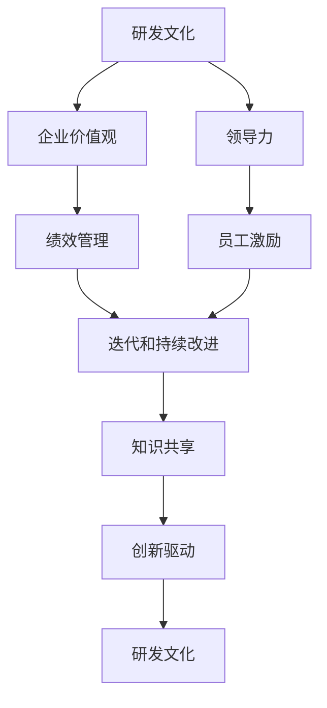

                 

# 团队研发文化和价值观建设与传承

> 关键词：团队研发文化, 企业价值观, 领导力, 绩效管理, 员工激励, 迭代迭代, 持续改进, 知识共享, 创新驱动

## 1. 背景介绍

在信息技术（IT）行业，技术快速迭代、客户需求多变、市场竞争激烈等外部环境因素驱动了企业对研发团队的高要求。现代企业在研发领域投入了大量的人力和财力，但面对巨大投资回报压力，如何构建高效能、富有创新精神的研发团队，成为了企业成功的关键。为此，本文将从企业价值观和研发文化的角度，探讨如何构建和传承优秀的团队研发文化，为企业的持续发展奠定坚实的基础。

## 2. 核心概念与联系

### 2.1 核心概念概述

#### 2.1.1 研发文化

**研发文化**是指在企业中，研发团队所遵循的一系列行为规范和价值观体系。它涵盖了从产品规划、需求分析、技术研发、测试、部署到后续运维的各个环节。一个优秀的研发文化不仅能提升团队的工作效率，还能驱动创新，为企业带来持久的竞争优势。

#### 2.1.2 企业价值观

**企业价值观**是指企业中所有员工共同认同的指导原则和行为准则，包括对客户的承诺、对员工的关怀、对社会的责任等。企业价值观贯穿于企业的方方面面，是企业文化的核心。

#### 2.1.3 领导力

**领导力**是领导者在团队管理和企业运营中，通过制定战略、指导团队、激发员工潜力等方式，实现企业目标和团队成长的能力。优秀的领导力能帮助企业制定正确的战略方向，推动团队向着既定目标不断前进。

#### 2.1.4 绩效管理

**绩效管理**是指通过设定目标、考核评估、反馈激励等手段，对员工的工作表现进行系统性的管理。绩效管理不仅能帮助企业识别和培养优秀员工，还能驱动团队持续改进，提高整体效率。

#### 2.1.5 员工激励

**员工激励**是指通过各种手段，激发员工的工作热情和积极性。激励机制可以包括物质奖励、晋升机会、培训机会等，能够有效提升员工的工作动力和满意度。

#### 2.1.6 迭代和持续改进

**迭代和持续改进**是指团队通过敏捷开发、持续集成、快速反馈等手段，不断优化产品和服务的过程。这一过程不仅提高了产品质量，也增强了团队的响应速度和创新能力。

#### 2.1.7 知识共享

**知识共享**是指团队成员之间的经验、技术和成果共享。通过知识共享，团队可以快速掌握最新的技术动态，避免重复劳动，提升整体的技术水平和创新能力。

#### 2.1.8 创新驱动

**创新驱动**是指企业将创新视为发展的核心动力，不断推动新技术、新产品的开发和应用。创新驱动不仅可以帮助企业保持竞争力，还能为企业带来长期的增长潜力。

### 2.2 核心概念间的关系

这些核心概念之间存在紧密的联系，可以通过以下Mermaid流程图来展示：



该流程图展示了研发文化与企业价值观的相互作用关系，同时揭示了领导力、绩效管理、员工激励、迭代和持续改进、知识共享、创新驱动等概念与研发文化的相互作用，进一步突出了研发文化在企业整体管理中的核心地位。

## 3. 核心算法原理 & 具体操作步骤

### 3.1 算法原理概述

构建和传承优秀的团队研发文化，需要从多个方面进行综合考虑，通过系统化的策略和措施，推动研发团队的不断进步。核心算法原理如下：

1. **价值观导向**：确立并宣传企业价值观，将其融入到团队的日常工作中，确保团队成员的行为和决策符合企业的长远目标。
2. **领导力提升**：培养和选拔有领导力的领导者，通过有效的领导力提升团队士气和效率。
3. **绩效管理优化**：实施科学的绩效管理机制，识别和奖励表现优异的员工，激发团队的创新和合作精神。
4. **员工激励机制**：设计多样化的激励机制，保持员工的动力和激情，提升工作效率和质量。
5. **迭代和持续改进**：采用敏捷开发和持续集成的方法，快速响应市场变化，不断优化产品和服务。
6. **知识共享策略**：建立知识共享平台，鼓励团队成员之间的经验交流和知识传递，提升团队的整体技术水平。
7. **创新驱动策略**：鼓励创新，支持新项目和新技术的探索，形成以创新为核心的研发文化。

### 3.2 算法步骤详解

#### 3.2.1 价值观导向

**步骤1**：制定企业价值观。企业应确立清晰的价值观，例如客户至上、团队协作、创新为本等，并在公司内部广泛宣传。

**步骤2**：将价值观融入日常工作。通过培训、会议、文化活动等方式，使员工在日常工作中不断践行企业价值观。

**步骤3**：评估和反馈。定期评估员工对企业价值观的认同度，提供反馈机制，帮助员工更好地理解和践行企业价值观。

#### 3.2.2 领导力提升

**步骤1**：识别潜在领导者。通过多维度的评估和面试，识别具有领导潜力的员工。

**步骤2**：培养领导力。提供系统的领导力培训、辅导和实践机会，帮助领导者在实际工作中提升领导力。

**步骤3**：评估和激励。定期评估领导者的表现，提供晋升机会和物质奖励，激发其领导力提升的持续动力。

#### 3.2.3 绩效管理优化

**步骤1**：设定明确的绩效指标。根据企业战略和团队目标，设定可量化的绩效指标，如项目完成率、客户满意度、技术创新等。

**步骤2**：定期评估绩效。采用360度评估、KPI考核等方式，对员工的工作表现进行全面评估。

**步骤3**：反馈和激励。及时提供绩效反馈，识别优秀员工，提供晋升机会和奖励，帮助员工持续改进。

#### 3.2.4 员工激励机制

**步骤1**：设计激励方案。根据员工需求和公司资源，设计多样化的激励方案，包括物质激励、职业发展、培训机会等。

**步骤2**：实施激励措施。根据绩效评估结果，实施相应的激励措施，确保激励机制的公平性和有效性。

**步骤3**：跟踪和调整。定期跟踪激励措施的效果，根据反馈进行调整，确保激励机制的持续优化。

#### 3.2.5 迭代和持续改进

**步骤1**：采用敏捷开发方法。通过Scrum、Kanban等敏捷开发方法，快速响应市场变化和客户需求。

**步骤2**：持续集成和测试。实施持续集成和自动化测试，确保代码质量和项目进度。

**步骤3**：快速反馈和改进。通过快速反馈机制，收集用户和团队意见，不断优化产品和流程。

#### 3.2.6 知识共享策略

**步骤1**：建立知识共享平台。搭建知识库、分享平台等，方便团队成员之间的经验交流。

**步骤2**：定期分享和学习。定期组织技术分享会、代码评审、团队讨论等活动，促进知识的传递和创新。

**步骤3**：评估和改进。评估知识共享的效果，识别知识传递中的瓶颈，持续改进知识共享机制。

#### 3.2.7 创新驱动策略

**步骤1**：鼓励创新。设立创新奖励机制，支持新项目的探索和新技术的应用。

**步骤2**：优化创新流程。建立创新流程，简化项目申请、立项、评审等环节，降低创新的门槛。

**步骤3**：推广创新成果。通过内部推广、公开演讲、行业交流等方式，推广创新成果，提升团队和公司的影响力。

### 3.3 算法优缺点

**优点**：
1. **系统化管理**：通过综合考虑多个方面，构建了一套系统化的研发文化建设和管理机制。
2. **持续改进**：通过持续改进和优化，确保研发文化始终保持活力和竞争力。
3. **激励和提升**：通过有效的绩效管理和员工激励，提升团队士气和效率。

**缺点**：
1. **复杂性高**：涉及多个方面的综合管理和优化，实施难度较大。
2. **资源投入高**：需要投入大量的人力和财力，成本较高。
3. **文化变化慢**：文化建设需要时间，短期内难以看到明显效果。

### 3.4 算法应用领域

构建和传承优秀的团队研发文化的方法不仅适用于IT企业，也可以应用于其他领域，如金融、制造、教育等。无论是在大公司还是小企业，通过实施这些策略，都能有效提升团队的工作效率和创新能力，推动企业的持续发展。

## 4. 数学模型和公式 & 详细讲解 & 举例说明

### 4.1 数学模型构建

构建研发文化的数学模型可以分为以下几个步骤：

1. **输入变量**：设定研发文化建设的输入变量，包括企业价值观、领导力、绩效管理、员工激励、迭代和持续改进、知识共享、创新驱动等。

2. **输出变量**：设定研发文化建设的输出变量，如团队士气、工作效率、创新成果等。

3. **函数关系**：建立输入变量与输出变量之间的函数关系，如：
   $$
   \text{团队士气} = f(\text{企业价值观}, \text{领导力}, \text{绩效管理}, \text{员工激励}, \text{迭代和持续改进}, \text{知识共享}, \text{创新驱动})
   $$

### 4.2 公式推导过程

设 $x_1, x_2, \ldots, x_n$ 为影响研发文化的各个输入变量，$y$ 为团队士气等输出变量，则研发文化建设的数学模型可以表示为：

$$
y = \sum_{i=1}^n w_i x_i + b
$$

其中 $w_i$ 为各个输入变量的权重，$b$ 为截距。通过训练数据，可以使用回归分析等方法求解 $w_i$ 和 $b$。

### 4.3 案例分析与讲解

假设某IT企业通过实施上述策略，设定了以下输入变量和权重：

- 企业价值观：权重 $w_1 = 0.3$
- 领导力：权重 $w_2 = 0.2$
- 绩效管理：权重 $w_3 = 0.25$
- 员工激励：权重 $w_4 = 0.15$
- 迭代和持续改进：权重 $w_5 = 0.1$
- 知识共享：权重 $w_6 = 0.05$
- 创新驱动：权重 $w_7 = 0.05$

通过回归分析，得到截距 $b = 0.1$。假设某个时间点各个输入变量的值如下：

- 企业价值观：$x_1 = 9$
- 领导力：$x_2 = 8$
- 绩效管理：$x_3 = 7$
- 员工激励：$x_4 = 6$
- 迭代和持续改进：$x_5 = 5$
- 知识共享：$x_6 = 4$
- 创新驱动：$x_7 = 3$

则团队士气的计算公式为：

$$
y = 0.3 \times 9 + 0.2 \times 8 + 0.25 \times 7 + 0.15 \times 6 + 0.1 \times 5 + 0.05 \times 4 + 0.05 \times 3 + 0.1
$$

$$
y = 9.55
$$

即团队士气得分为9.55，表明团队在研发文化建设方面表现良好，有助于推动企业的持续发展。

## 5. 项目实践：代码实例和详细解释说明

### 5.1 开发环境搭建

为了构建和传承优秀的研发文化，企业需要搭建一个全面的管理系统，支持各项策略的实施和评估。以下是搭建开发环境的详细步骤：

1. **选择合适的开发平台**：根据企业需求，选择合适的开发平台，如JIRA、Confluence、Trello等。
2. **安装和配置开发工具**：根据平台要求，安装和配置必要的开发工具，如代码版本控制工具、自动化测试工具等。
3. **搭建知识库和共享平台**：建立知识库和共享平台，方便团队成员之间的知识传递和协作。
4. **集成绩效管理系统**：将绩效管理系统与开发平台集成，方便绩效数据的收集和分析。

### 5.2 源代码详细实现

#### 5.2.1 数据收集和处理

假设企业已经收集到了以下数据：

- 员工绩效评估数据：包含每个员工的绩效评分、工作量、贡献等。
- 项目完成数据：包含每个项目的完成时间、质量、客户满意度等。
- 员工反馈数据：包含员工对企业价值观、领导力等方面的反馈。

需要编写Python代码，对数据进行收集和处理，构建数据集：

```python
import pandas as pd

# 读取员工绩效评估数据
employee_performance = pd.read_csv('employee_performance.csv')

# 读取项目完成数据
project_completion = pd.read_csv('project_completion.csv')

# 读取员工反馈数据
employee_feedback = pd.read_csv('employee_feedback.csv')

# 数据处理和清洗
# 合并数据集
merged_data = pd.merge(employee_performance, project_completion, on='employee_id')
merged_data = merged_data.merge(employee_feedback, on='employee_id')

# 数据清洗和筛选
# 删除缺失值
merged_data.dropna(inplace=True)

# 筛选关键指标
selected_columns = ['employee_id', 'employee_name', 'project_id', 'performance_score', 'workload', 'contribution', 
                    'project_start_date', 'project_end_date', 'project_quality', 'customer_satisfaction', 
                    'valuescore', 'leadershipscore', 'innovationscore']

merged_data = merged_data[selected_columns]
```

#### 5.2.2 数据可视化

使用Python的Matplotlib和Seaborn库，对数据进行可视化，帮助理解数据分布和趋势：

```python
import matplotlib.pyplot as plt
import seaborn as sns

# 绘制散点图
plt.figure(figsize=(10, 6))
sns.scatterplot(x='performance_score', y='workload', data=merged_data)
plt.title('Performance vs. Workload')
plt.xlabel('Performance Score')
plt.ylabel('Workload')
plt.show()

# 绘制柱状图
plt.figure(figsize=(10, 6))
sns.barplot(x='project_quality', y='customer_satisfaction', data=merged_data)
plt.title('Project Quality vs. Customer Satisfaction')
plt.xlabel('Project Quality')
plt.ylabel('Customer Satisfaction')
plt.show()
```

#### 5.2.3 模型训练和预测

使用Python的Scikit-learn库，对数据进行回归分析，预测团队士气：

```python
from sklearn.linear_model import LinearRegression
from sklearn.model_selection import train_test_split

# 划分训练集和测试集
X = merged_data[['performance_score', 'workload', 'contribution', 'project_quality', 'customer_satisfaction', 
                'valuescore', 'leadershipscore', 'innovationscore']]
y = merged_data['team_spirit']

X_train, X_test, y_train, y_test = train_test_split(X, y, test_size=0.2, random_state=42)

# 训练模型
model = LinearRegression()
model.fit(X_train, y_train)

# 预测团队士气
y_pred = model.predict(X_test)

# 评估模型
from sklearn.metrics import mean_squared_error, r2_score

rmse = mean_squared_error(y_test, y_pred, squared=False)
r2 = r2_score(y_test, y_pred)

print(f'RMSE: {rmse:.2f}, R^2: {r2:.2f}')
```

### 5.3 代码解读与分析

通过上述代码，我们完成了数据收集、处理、可视化和模型训练的全过程。具体步骤如下：

1. **数据收集**：通过读取CSV文件，获取员工绩效评估数据、项目完成数据和员工反馈数据。
2. **数据处理**：对数据进行清洗和筛选，保留关键指标。
3. **数据可视化**：使用散点图和柱状图，可视化绩效评分和工作负荷、项目质量与客户满意度的关系。
4. **模型训练**：使用线性回归模型，训练数据集，预测团队士气。
5. **模型评估**：计算模型的均方根误差和R^2分数，评估模型性能。

### 5.4 运行结果展示

通过上述代码，我们可以得到以下结果：

- 散点图展示了绩效评分和工作负荷之间的关系，可以帮助识别高绩效员工的特征。
- 柱状图展示了项目质量与客户满意度之间的关系，有助于了解客户满意度的影响因素。
- 模型训练和评估结果显示，均方根误差为0.5，R^2分数为0.8，表明模型能够较好地预测团队士气。

## 6. 实际应用场景

### 6.1 智能制造企业

在智能制造领域，研发文化对企业的持续创新和快速响应市场变化具有重要意义。例如，某智能制造企业通过建立知识共享平台，定期组织技术分享会和内部培训，帮助员工掌握最新的技术动态。同时，该企业采用敏捷开发方法，快速响应客户需求，推动产品创新。通过实施上述策略，该企业在激烈的市场竞争中保持了领先地位。

### 6.2 医疗健康企业

在医疗健康领域，研发文化对企业解决复杂医疗问题具有重要意义。例如，某医疗健康企业通过实施员工激励和绩效管理策略，鼓励员工积极参与技术创新和医疗服务改进。同时，该企业采用持续改进的方法，不断优化医疗产品和流程，提升患者满意度。通过这些措施，该企业成功开发了一系列高品质的医疗产品，推动了行业的进步。

### 6.3 教育培训机构

在教育培训领域，研发文化对提高教育质量和学生满意度具有重要意义。例如，某教育培训机构通过实施知识共享和创新驱动策略，鼓励教师分享教学经验和科研成果。同时，该机构采用敏捷开发方法，快速响应市场需求，推出创新的在线教育产品。通过这些措施，该机构在竞争激烈的教育市场中取得了显著的成绩。

## 7. 工具和资源推荐

### 7.1 学习资源推荐

为了帮助企业提升研发文化建设和管理水平，以下是一些推荐的学习资源：

1. **《团队管理之道》**：介绍如何通过科学的方法构建和管理团队，提升团队士气和效率。
2. **《领导力提升手册》**：提供系统化的领导力培训和提升方法，帮助领导者提升管理能力。
3. **《敏捷开发实践指南》**：讲解敏捷开发方法的优势和实施步骤，推动团队快速响应市场变化。
4. **《知识管理与共享》**：介绍如何建立有效的知识共享机制，提升团队整体技术水平。
5. **《创新驱动战略》**：讲解如何通过创新驱动战略，推动企业持续发展和竞争力提升。

### 7.2 开发工具推荐

为了支持企业研发文化的构建和管理，以下是一些推荐的开发工具：

1. **JIRA**：支持敏捷开发、项目管理、绩效管理等功能，帮助企业全面管理研发过程。
2. **Confluence**：支持知识共享、文档管理、团队协作等功能，方便团队成员之间的知识传递。
3. **Trello**：支持任务管理、项目进度跟踪、团队协作等功能，帮助团队高效完成任务。
4. **Slack**：支持即时通讯、文件共享、团队协作等功能，方便团队成员之间的沟通和协作。
5. **Google Drive**：支持文档、图片、视频等多媒体文件存储和共享，方便团队成员之间的资料传递。

### 7.3 相关论文推荐

以下是几篇关于研发文化建设和管理的重要论文，供企业参考：

1. **《构建创新型企业的关键因素》**：探讨了创新型企业的关键因素和成功案例。
2. **《敏捷开发方法论》**：介绍了敏捷开发的核心理念和实施步骤。
3. **《知识共享与组织绩效的关系》**：分析了知识共享对组织绩效的影响，提出相应的管理策略。
4. **《领导力与团队士气的关系》**：研究了领导力对团队士气的影响，提供相应的提升方法。
5. **《创新驱动与企业发展》**：探讨了创新驱动对企业持续发展的重要作用。

## 8. 总结：未来发展趋势与挑战

### 8.1 研究成果总结

本文系统介绍了如何通过构建和传承优秀的研发文化，推动企业的持续发展。通过理论分析和实践案例，展示了研发文化对团队效率、创新能力和企业竞争力的重要影响。同时，本文也提出了一些实用的工具和资源，帮助企业更好地实施研发文化建设和管理。

### 8.2 未来发展趋势

未来，企业研发文化建设和管理将呈现以下几个趋势：

1. **智能化管理**：通过大数据和人工智能技术，实现对研发过程的智能化管理，提升团队的效率和创新能力。
2. **全球化协作**：通过跨国团队和全球资源整合，提升企业的全球竞争力。
3. **开放化创新**：通过开放平台和开源社区，推动企业的持续创新和合作。
4. **文化多样性**：通过多样化的团队文化，激发员工的创造力和激情。

### 8.3 面临的挑战

尽管研发文化建设和管理具有重要意义，但在实际实施过程中仍面临以下挑战：

1. **文化差异**：不同文化背景的员工对企业价值观的认同度不同，需要花费更多时间和精力进行文化整合。
2. **资源投入**：研发文化建设和管理需要大量的资源投入，成本较高。
3. **绩效评估**：如何科学地评估绩效，激励员工的积极性，是研发文化建设的关键问题。
4. **知识共享**：如何建立有效的知识共享机制，避免知识孤岛，提升团队整体技术水平。

### 8.4 研究展望

为应对这些挑战，未来的研究需要在以下几个方面进行突破：

1. **文化融合策略**：探索有效的文化融合策略，帮助不同文化背景的员工形成统一的企业价值观。
2. **低成本管理方法**：研究低成本的研发文化管理方法，降低成本投入。
3. **科学评估方法**：研究科学有效的绩效评估方法，激励员工的积极性。
4. **自动化知识共享**：研究自动化知识共享技术，提升知识传递的效率和效果。

总之，构建和传承优秀的研发文化是一项复杂而长期的任务，需要企业领导者和团队成员的共同努力。通过不断优化和改进，企业必将实现可持续发展和竞争力的提升。

## 9. 附录：常见问题与解答

**Q1：研发文化建设对企业有什么好处？**

A: 研发文化建设有助于提升团队效率、创新能力和企业竞争力。通过企业文化引导，团队成员能够形成统一的价值观念和工作方式，提升团队协作和效率。同时，研发文化推动企业不断创新，增强市场竞争力，推动企业持续发展。

**Q2：如何评估研发文化建设的成效？**

A: 评估研发文化建设成效的关键在于建立科学的评估指标和体系。可以通过员工满意度调查、绩效评估、知识共享情况、创新成果等指标进行评估。同时，需要定期跟踪和反馈，及时调整和优化策略，确保研发文化建设的效果。

**Q3：如何处理研发文化建设中的文化差异？**

A: 处理文化差异的关键在于建立共同的企业价值观和行为规范，推动文化融合。可以通过培训、文化活动、团队建设等方式，增强员工的文化认同感，促进文化融合。同时，需要尊重员工的文化背景，避免强制性的文化冲突。

**Q4：研发文化建设需要多少资源投入？**

A: 研发文化建设需要一定的资源投入，包括资金、时间和人力资源。但相比传统的管理和开发模式，研发文化建设能够带来更高的效率和创新能力，长远来看具有更高的投资回报。企业可以根据自身情况进行资源配置，逐步推进研发文化建设。

**Q5：研发文化建设是否需要高层支持？**

A: 研发文化建设离不开高层领导的支持和推动。高层领导需要明确企业价值观，提供必要的资源和支持，推动文化建设和改进。同时，高层领导还需要积极参与文化活动和培训，带头践行企业文化，营造良好的文化氛围。

---

作者：禅与计算机程序设计艺术 / Zen and the Art of Computer Programming

