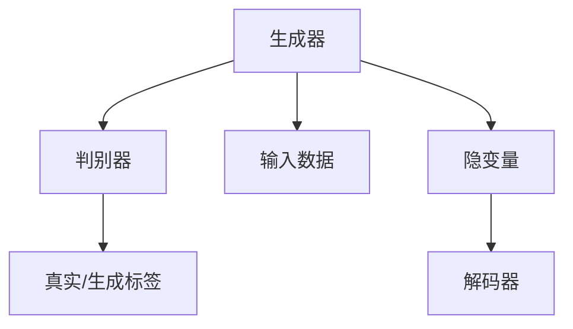

                 

# 图像生成(Image Generation) - 原理与代码实例讲解

> 关键词：图像生成,神经网络,卷积神经网络,深度学习,GAN,VAE,自编码器,编码器-解码器

## 1. 背景介绍

图像生成技术在计算机视觉领域中占有重要地位，是实现图像识别、图像编辑、艺术创作等应用的基础。近年来，深度学习技术的发展使得图像生成技术取得了长足的进步，其中最具代表性的方法是生成对抗网络（GAN）和变分自编码器（VAE）。本文将详细介绍GAN和VAE这两种生成模型的原理，并通过代码实例来讲解其实现过程。

## 2. 核心概念与联系

### 2.1 核心概念概述

#### 2.1.1 神经网络(Neural Network)

神经网络是一种模拟人脑神经元之间连接的计算模型，由输入层、隐藏层和输出层组成。每个神经元接收输入信号，经过激活函数处理后，传递给下一层。通过训练神经网络，可以学习输入和输出之间的映射关系。

#### 2.1.2 卷积神经网络(Convolutional Neural Network, CNN)

卷积神经网络是专门用于图像处理的神经网络，具有局部连接、权值共享等特点，能够有效提取图像特征。CNN由卷积层、池化层和全连接层组成，广泛应用于图像分类、物体检测、图像生成等任务。

#### 2.1.3 生成对抗网络(Generative Adversarial Network, GAN)

生成对抗网络由生成器和判别器两个网络组成，通过对抗训练的方式，使得生成器能够生成逼真的图像，判别器能够准确地识别真实和生成的图像。GAN在图像生成、图像修复、图像风格转换等任务中表现出色。

#### 2.1.4 变分自编码器(Variational Autoencoder, VAE)

变分自编码器是一种无监督学习的生成模型，由编码器和解码器两个网络组成。编码器将输入数据压缩成低维隐变量，解码器将隐变量解码回原始数据。VAE能够生成逼真的图像，并具有良好的数据降维和重构能力。

### 2.2 核心概念之间的关系

GAN和VAE虽然都用于图像生成，但它们的原理和实现方式有所不同。GAN通过对抗训练的方式生成图像，而VAE则通过编码器和解码器的映射关系生成图像。以下是GAN和VAE的核心概念之间的关系：



其中，A代表生成器，C代表输入数据，D代表真实/生成标签，E代表隐变量，F代表解码器。GAN和VAE的生成过程可以简化为生成器和解码器的映射关系，如上图所示。

## 3. 核心算法原理 & 具体操作步骤

### 3.1 算法原理概述

#### 3.1.1 GAN原理概述

GAN由生成器和判别器两个网络组成，生成器用于生成逼真的图像，判别器用于识别真实和生成的图像。GAN的目标是使生成器生成的图像尽可能逼真，使得判别器难以区分真实和生成的图像。

GAN的训练过程可以概括为以下步骤：

1. 生成器随机生成一组噪声向量，并将其输入生成器中。
2. 生成器将噪声向量映射成图像，输出给判别器。
3. 判别器接收真实图像和生成图像，输出真实/生成标签。
4. 计算生成器损失和判别器损失。
5. 使用梯度下降更新生成器和判别器的参数，使得生成器生成的图像逼真度增加，判别器区分真实和生成图像的能力增强。

#### 3.1.2 VAE原理概述

VAE是一种无监督学习的生成模型，通过编码器和解码器的映射关系生成图像。VAE的目标是使编码器能够将输入数据压缩成低维隐变量，解码器能够将隐变量解码回原始数据，使得重构误差最小化。

VAE的训练过程可以概括为以下步骤：

1. 将输入数据输入编码器，输出隐变量。
2. 将隐变量输入解码器，输出重构图像。
3. 计算重构误差和隐变量先验分布的KL散度。
4. 使用梯度下降更新编码器和解码器的参数，使得重构误差最小化，隐变量分布逼近先验分布。

### 3.2 算法步骤详解

#### 3.2.1 GAN算法步骤详解

GAN的实现步骤包括生成器和判别器的定义、训练循环、损失函数计算等。下面以MNIST数据集为例，介绍GAN的实现步骤。

1. 定义生成器和判别器。
```python
import torch.nn as nn
import torch.optim as optim

class Generator(nn.Module):
    def __init__(self, input_dim, output_dim):
        super(Generator, self).__init__()
        self.fc1 = nn.Linear(input_dim, 256)
        self.fc2 = nn.Linear(256, 256)
        self.fc3 = nn.Linear(256, output_dim)
        self.relu = nn.ReLU()

    def forward(self, x):
        x = self.relu(self.fc1(x))
        x = self.relu(self.fc2(x))
        x = self.fc3(x)
        return x

class Discriminator(nn.Module):
    def __init__(self, input_dim, output_dim):
        super(Discriminator, self).__init__()
        self.fc1 = nn.Linear(input_dim, 128)
        self.fc2 = nn.Linear(128, 64)
        self.fc3 = nn.Linear(64, output_dim)
        self.sigmoid = nn.Sigmoid()

    def forward(self, x):
        x = self.sigmoid(self.fc1(x))
        x = self.sigmoid(self.fc2(x))
        x = self.sigmoid(self.fc3(x))
        return x
```

2. 定义损失函数。
```python
def generator_loss(fake_images, real_images):
    gen_loss = criterion(fake_images, real_images)
    return gen_loss

def discriminator_loss(real_images, fake_images):
    real_loss = criterion(real_images, torch.ones_like(real_images))
    fake_loss = criterion(fake_images, torch.zeros_like(fake_images))
    discriminator_loss = real_loss + fake_loss
    return discriminator_loss
```

3. 定义训练循环。
```python
criterion = nn.BCELoss()

for epoch in range(num_epochs):
    for batch_idx, (real_images, _) in enumerate(train_loader):
        batch_size = real_images.size(0)

        # Adversarial ground truths
        real_labels = torch.ones(batch_size, 1).to(device)
        fake_labels = torch.zeros(batch_size, 1).to(device)

        # Training the generator
        optimizer_G.zero_grad()
        noise = torch.randn(batch_size, latent_dim).to(device)
        fake_images = generator(noise)
        gen_loss = generator_loss(fake_images, real_images)
        gen_loss.backward()
        optimizer_G.step()

        # Training the discriminator
        optimizer_D.zero_grad()
        real_loss = discriminator_loss(real_images, fake_images)
        real_loss.backward()
        optimizer_D.step()
```

4. 训练模型。
```python
num_epochs = 100
batch_size = 64
latent_dim = 100

# Initialize the generator and discriminator
G = Generator(latent_dim, output_dim)
D = Discriminator(input_dim, 1)

# Initialize the optimizers
optimizer_G = optim.Adam(G.parameters(), lr=lr_G)
optimizer_D = optim.Adam(D.parameters(), lr=lr_D)

# Train the GAN
for epoch in range(num_epochs):
    for batch_idx, (real_images, _) in enumerate(train_loader):
        batch_size = real_images.size(0)

        # Adversarial ground truths
        real_labels = torch.ones(batch_size, 1).to(device)
        fake_labels = torch.zeros(batch_size, 1).to(device)

        # Training the generator
        optimizer_G.zero_grad()
        noise = torch.randn(batch_size, latent_dim).to(device)
        fake_images = G(noise)
        gen_loss = generator_loss(fake_images, real_images)
        gen_loss.backward()
        optimizer_G.step()

        # Training the discriminator
        optimizer_D.zero_grad()
        real_loss = discriminator_loss(real_images, fake_images)
        real_loss.backward()
        optimizer_D.step()

        # Print loss and save images
        if batch_idx % 100 == 0:
            print(f'Epoch [{epoch+1}/{num_epochs}] Batch [{batch_idx+1}/{len(train_loader)}] '
                  f'Generator loss: {gen_loss.item():.4f}, Discriminator loss: {real_loss.item():.4f}')
```

#### 3.2.2 VAE算法步骤详解

VAE的实现步骤包括编码器和解码器的定义、训练循环、损失函数计算等。下面以MNIST数据集为例，介绍VAE的实现步骤。

1. 定义编码器和解码器。
```python
class Encoder(nn.Module):
    def __init__(self, input_dim, latent_dim):
        super(Encoder, self).__init__()
        self.fc1 = nn.Linear(input_dim, 256)
        self.fc2 = nn.Linear(256, latent_dim)
        self.relu = nn.ReLU()

    def forward(self, x):
        x = self.relu(self.fc1(x))
        x = self.fc2(x)
        return x

class Decoder(nn.Module):
    def __init__(self, latent_dim, output_dim):
        super(Decoder, self).__init__()
        self.fc1 = nn.Linear(latent_dim, 256)
        self.fc2 = nn.Linear(256, output_dim)
        self.sigmoid = nn.Sigmoid()

    def forward(self, x):
        x = self.relu(self.fc1(x))
        x = self.sigmoid(self.fc2(x))
        return x
```

2. 定义损失函数。
```python
def reconstruction_loss(x, x_hat):
    recon_loss = criterion(x_hat, x)
    return recon_loss

def kl_divergence_loss(mean, logvar):
    kl_divergence_loss = 0.5 * (1 + logvar - mean.pow(2) - logvar.exp())
    return kl_divergence_loss
```

3. 定义训练循环。
```python
criterion = nn.MSELoss()

for epoch in range(num_epochs):
    for batch_idx, (real_images, _) in enumerate(train_loader):
        batch_size = real_images.size(0)

        # Training the encoder
        optimizer_E.zero_grad()
        x = real_images.view(batch_size, -1)
        z_mean, z_logvar = encoder(x)
        recon_loss = reconstruction_loss(x, decoder(z_mean))
        kl_divergence_loss = kl_divergence_loss(z_mean, z_logvar)
        loss = recon_loss + kl_divergence_loss
        loss.backward()
        optimizer_E.step()

        # Print loss and save images
        if batch_idx % 100 == 0:
            print(f'Epoch [{epoch+1}/{num_epochs}] Batch [{batch_idx+1}/{len(train_loader)}] '
                  f'Reconstruction loss: {recon_loss.item():.4f}, KL divergence loss: {kl_divergence_loss.item():.4f}')
```

4. 训练模型。
```python
num_epochs = 100
batch_size = 64
latent_dim = 100

# Initialize the encoder and decoder
E = Encoder(input_dim, latent_dim)
D = Decoder(latent_dim, output_dim)

# Initialize the optimizers
optimizer_E = optim.Adam(E.parameters(), lr=lr_E)
optimizer_D = optim.Adam(D.parameters(), lr=lr_D)

# Train the VAE
for epoch in range(num_epochs):
    for batch_idx, (real_images, _) in enumerate(train_loader):
        batch_size = real_images.size(0)

        # Training the encoder
        optimizer_E.zero_grad()
        x = real_images.view(batch_size, -1)
        z_mean, z_logvar = E(x)
        recon_loss = reconstruction_loss(x, D(z_mean))
        kl_divergence_loss = kl_divergence_loss(z_mean, z_logvar)
        loss = recon_loss + kl_divergence_loss
        loss.backward()
        optimizer_E.step()

        # Print loss and save images
        if batch_idx % 100 == 0:
            print(f'Epoch [{epoch+1}/{num_epochs}] Batch [{batch_idx+1}/{len(train_loader)}] '
                  f'Reconstruction loss: {recon_loss.item():.4f}, KL divergence loss: {kl_divergence_loss.item():.4f}')
```

### 3.3 算法优缺点

#### 3.3.1 GAN的优缺点

GAN的优点包括：
- 生成逼真的图像，具有较强的表现力。
- 可以生成任意风格的图像，具有灵活性。

GAN的缺点包括：
- 训练不稳定，需要手动调整超参数。
- 存在模式崩溃等问题，需要额外的技巧来解决。
- 生成的图像存在一定的噪声和模糊。

#### 3.3.2 VAE的优缺点

VAE的优点包括：
- 可以生成高质量的图像，具有较好的重构能力。
- 模型结构简单，训练稳定。

VAE的缺点包括：
- 生成的图像存在一定的噪声和模糊。
- 重构误差和KL散度需要同时最小化，增加了训练难度。
- 模型的表示能力有限，生成的图像可能存在一定的失真。

### 3.4 算法应用领域

GAN和VAE广泛应用于图像生成、图像修复、图像风格转换、图像超分辨率等任务。以下是GAN和VAE的应用领域：

#### 3.4.1 GAN应用领域

1. 图像生成：生成逼真的图像，用于艺术创作、虚拟现实等领域。
2. 图像修复：修复损坏或模糊的图像，提升图像质量。
3. 图像风格转换：将一张图像转换成另一种风格，用于风格迁移等领域。
4. 图像超分辨率：将低分辨率图像转换成高分辨率图像，提升图像清晰度和细节。

#### 3.4.2 VAE应用领域

1. 图像生成：生成高质量的图像，用于艺术创作、虚拟现实等领域。
2. 数据降维：将高维数据压缩成低维隐变量，用于数据可视化和特征提取。
3. 图像重构：对损坏或模糊的图像进行重构，提升图像质量。
4. 图像去噪：对噪声图像进行去噪处理，提升图像清晰度。

## 4. 数学模型和公式 & 详细讲解 & 举例说明

### 4.1 数学模型构建

#### 4.1.1 GAN数学模型构建

GAN的生成器用于将随机噪声向量转换为逼真的图像，判别器用于判断图像的真实性。GAN的数学模型可以表示为：

$$
\begin{aligned}
& \text{minimize}_{G} \quad \mathbb{E}_{x \sim p_{\text{data}}(x)} [\log D(G(x))] + \mathbb{E}_{z \sim p_{\text{noise}}(z)} [\log(1-D(G(z)))] \\
& \text{minimize}_{D} \quad \mathbb{E}_{x \sim p_{\text{data}}(x)} [\log D(x)] + \mathbb{E}_{z \sim p_{\text{noise}}(z)} [\log(1-D(G(z)))]
\end{aligned}
$$

其中，$G$表示生成器，$D$表示判别器，$z$表示随机噪声向量，$x$表示输入数据，$p_{\text{data}}$表示数据分布，$p_{\text{noise}}$表示噪声分布。

#### 4.1.2 VAE数学模型构建

VAE的编码器将输入数据压缩成低维隐变量，解码器将隐变量解码回原始数据。VAE的数学模型可以表示为：

$$
\begin{aligned}
& \text{minimize}_{E, D} \quad \mathbb{E}_{x \sim p_{\text{data}}(x)} [\log D(E(x))] + \mathbb{E}_{z \sim p_{\text{noise}}(z)} [\log D(D(E(z)))] \\
& \text{minimize}_{E} \quad \mathbb{E}_{x \sim p_{\text{data}}(x)} [\log D(E(x))] + \mathbb{E}_{z \sim p_{\text{noise}}(z)} [\log D(D(E(z)))]
\end{aligned}
$$

其中，$E$表示编码器，$D$表示解码器，$z$表示随机噪声向量，$x$表示输入数据，$p_{\text{data}}$表示数据分布，$p_{\text{noise}}$表示噪声分布。

### 4.2 公式推导过程

#### 4.2.1 GAN公式推导过程

GAN的生成器用于将随机噪声向量转换为逼真的图像，判别器用于判断图像的真实性。GAN的训练过程可以表示为：

$$
\begin{aligned}
& \text{minimize}_{G} \quad \mathbb{E}_{x \sim p_{\text{data}}(x)} [\log D(G(x))] + \mathbb{E}_{z \sim p_{\text{noise}}(z)} [\log(1-D(G(z)))] \\
& \text{minimize}_{D} \quad \mathbb{E}_{x \sim p_{\text{data}}(x)} [\log D(x)] + \mathbb{E}_{z \sim p_{\text{noise}}(z)} [\log(1-D(G(z)))]
\end{aligned}
$$

其中，$G$表示生成器，$D$表示判别器，$z$表示随机噪声向量，$x$表示输入数据，$p_{\text{data}}$表示数据分布，$p_{\text{noise}}$表示噪声分布。

### 4.3 案例分析与讲解

#### 4.3.1 GAN案例分析与讲解

以MNIST数据集为例，使用GAN生成手写数字图像。首先，需要定义生成器和判别器。生成器将随机噪声向量转换为手写数字图像，判别器判断图像的真实性。

1. 定义生成器和判别器。
```python
import torch.nn as nn
import torch.optim as optim

class Generator(nn.Module):
    def __init__(self, input_dim, output_dim):
        super(Generator, self).__init__()
        self.fc1 = nn.Linear(input_dim, 256)
        self.fc2 = nn.Linear(256, 256)
        self.fc3 = nn.Linear(256, output_dim)
        self.relu = nn.ReLU()

    def forward(self, x):
        x = self.relu(self.fc1(x))
        x = self.relu(self.fc2(x))
        x = self.fc3(x)
        return x

class Discriminator(nn.Module):
    def __init__(self, input_dim, output_dim):
        super(Discriminator, self).__init__()
        self.fc1 = nn.Linear(input_dim, 128)
        self.fc2 = nn.Linear(128, 64)
        self.fc3 = nn.Linear(64, output_dim)
        self.sigmoid = nn.Sigmoid()

    def forward(self, x):
        x = self.sigmoid(self.fc1(x))
        x = self.sigmoid(self.fc2(x))
        x = self.sigmoid(self.fc3(x))
        return x
```

2. 定义损失函数。
```python
def generator_loss(fake_images, real_images):
    gen_loss = criterion(fake_images, real_images)
    return gen_loss

def discriminator_loss(real_images, fake_images):
    real_loss = criterion(real_images, torch.ones_like(real_images))
    fake_loss = criterion(fake_images, torch.zeros_like(fake_images))
    discriminator_loss = real_loss + fake_loss
    return discriminator_loss
```

3. 定义训练循环。
```python
criterion = nn.BCELoss()

for epoch in range(num_epochs):
    for batch_idx, (real_images, _) in enumerate(train_loader):
        batch_size = real_images.size(0)

        # Adversarial ground truths
        real_labels = torch.ones(batch_size, 1).to(device)
        fake_labels = torch.zeros(batch_size, 1).to(device)

        # Training the generator
        optimizer_G.zero_grad()
        noise = torch.randn(batch_size, latent_dim).to(device)
        fake_images = generator(noise)
        gen_loss = generator_loss(fake_images, real_images)
        gen_loss.backward()
        optimizer_G.step()

        # Training the discriminator
        optimizer_D.zero_grad()
        real_loss = discriminator_loss(real_images, fake_images)
        real_loss.backward()
        optimizer_D.step()
```

4. 训练模型。
```python
num_epochs = 100
batch_size = 64
latent_dim = 100

# Initialize the generator and discriminator
G = Generator(latent_dim, output_dim)
D = Discriminator(input_dim, 1)

# Initialize the optimizers
optimizer_G = optim.Adam(G.parameters(), lr=lr_G)
optimizer_D = optim.Adam(D.parameters(), lr=lr_D)

# Train the GAN
for epoch in range(num_epochs):
    for batch_idx, (real_images, _) in enumerate(train_loader):
        batch_size = real_images.size(0)

        # Adversarial ground truths
        real_labels = torch.ones(batch_size, 1).to(device)
        fake_labels = torch.zeros(batch_size, 1).to(device)

        # Training the generator
        optimizer_G.zero_grad()
        noise = torch.randn(batch_size, latent_dim).to(device)
        fake_images = G(noise)
        gen_loss = generator_loss(fake_images, real_images)
        gen_loss.backward()
        optimizer_G.step()

        # Training the discriminator
        optimizer_D.zero_grad()
        real_loss = discriminator_loss(real_images, fake_images)
        real_loss.backward()
        optimizer_D.step()

        # Print loss and save images
        if batch_idx % 100 == 0:
            print(f'Epoch [{epoch+1}/{num_epochs}] Batch [{batch_idx+1}/{len(train_loader)}] '
                  f'Generator loss: {gen_loss.item():.4f}, Discriminator loss: {real_loss.item():.4f}')
```

#### 4.3.2 VAE案例分析与讲解

以MNIST数据集为例，使用VAE生成手写数字图像。首先，需要定义编码器和解码器。编码器将输入数据压缩成低维隐变量，解码器将隐变量解码回原始数据。

1. 定义编码器和解码器。
```python
class Encoder(nn.Module):
    def __init__(self, input_dim, latent_dim):
        super(Encoder, self).__init__()
        self.fc1 = nn.Linear(input_dim, 256)
        self.fc2 = nn.Linear(256, latent_dim)
        self.relu = nn.ReLU()

    def forward(self, x):
        x = self.relu(self.fc1(x))
        x = self.fc2(x)
        return x

class Decoder(nn.Module):
    def __init__(self, latent_dim, output_dim):
        super(Decoder, self).__init__()
        self.fc1 = nn.Linear(latent_dim, 256)
        self.fc2 = nn.Linear(256, output_dim)
        self.sigmoid = nn.Sigmoid()

    def forward(self, x):
        x = self.relu(self.fc1(x))
        x = self.sigmoid(self.fc2(x))
        return x
```

2. 定义损失函数。
```python
def reconstruction_loss(x, x_hat):
    recon_loss = criterion(x_hat, x)
    return recon_loss

def kl_divergence_loss(mean, logvar):
    kl_divergence_loss = 0.5 * (1 + logvar - mean.pow(2) - logvar.exp())
    return kl_divergence_loss
```

3. 定义训练循环。
```python
criterion = nn.MSELoss()

for epoch in range(num_epochs):
    for batch_idx, (real_images, _) in enumerate(train_loader):
        batch_size = real_images.size(0)

        # Training the encoder
        optimizer_E.zero_grad()
        x = real_images.view(batch_size, -1)
        z_mean, z_logvar = encoder(x)
        recon_loss = reconstruction_loss(x, decoder(z_mean))
        kl_divergence_loss = kl_divergence_loss(z_mean, z_logvar)
        loss = recon_loss + kl_divergence_loss
        loss.backward()
        optimizer_E.step()

        # Print loss and save images
        if batch_idx % 100 == 0:
            print(f'Epoch [{epoch+1}/{num_epochs}] Batch [{batch_idx+1}/{len(train_loader)}] '
                  f'Reconstruction loss: {recon_loss.item():.4f}, KL divergence loss: {kl_divergence_loss.item():.4f}')
```

4. 训练模型。
```python
num_epochs = 100
batch_size = 64
latent_dim = 100

# Initialize the encoder and decoder
E = Encoder(input_dim, latent_dim)
D = Decoder(latent_dim, output_dim)

# Initialize the optimizers
optimizer_E = optim.Adam(E.parameters(), lr=lr_E)
optimizer_D = optim.Adam(D.parameters(), lr=lr_D)

# Train the VAE
for epoch in range(num_epochs):
    for batch_idx, (real_images, _) in enumerate(train_loader):
        batch_size = real_images.size(0)

        # Training the encoder
        optimizer_E.zero_grad()
        x = real_images.view(batch_size, -1)
        z_mean, z_logvar = E(x)
        recon_loss = reconstruction_loss(x, decoder(z_mean))
        kl_divergence_loss = kl_divergence_loss(z_mean, z_logvar)
        loss = recon_loss + kl_divergence_loss
        loss.backward()
        optimizer_E.step()

        # Print loss and save images
        if batch_idx % 100 == 0:
            print(f'Epoch [{epoch+1}/{num_epochs}] Batch [{batch_idx+1}/{len(train_loader)}] '
                  f'Reconstruction loss: {recon_loss.item():.4

