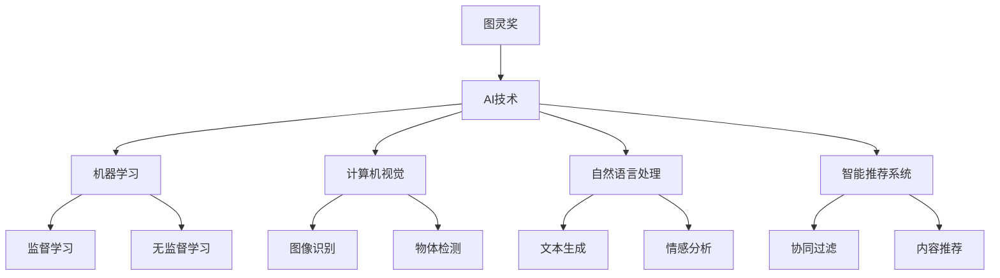

                 

# 图灵奖得主对AI的影响

> 关键词：图灵奖,人工智能,影响,历史,未来,技术引领,里程碑,驱动发展,创新,革命性

## 1. 背景介绍

### 1.1 图灵奖概述
图灵奖(Turing Award)是计算机科学领域的最高荣誉，自1966年以来每年颁发一次，以表彰那些在计算机科学领域做出卓越贡献的个人。图灵奖的获奖者不仅在技术上取得了突出成就，更在创新、领导力和社会影响等方面发挥了巨大作用。自图灵奖设立以来，已有100多位顶尖学者获得了这一殊荣，其中包括计算机科学的奠基人、编程语言的设计者、操作系统和数据库的先驱，以及引领人工智能(AI)发展的先驱。

### 1.2 AI领域图灵奖得主
自从深度学习和大数据技术兴起以来，AI领域迎来了新的发展高峰，许多图灵奖得主在这一时期涌现。他们不仅推动了AI技术的进步，更在机器学习、计算机视觉、自然语言处理(NLP)、智能推荐系统等多个子领域产生了深远影响。本文将探讨这些图灵奖得主如何通过其工作影响了AI技术的发展，以及这些技术对社会和产业的广泛影响。

## 2. 核心概念与联系

### 2.1 核心概念概述
- **图灵奖**：计算机科学领域的最高荣誉，自1966年起每年颁发一次，表彰在计算机科学领域做出杰出贡献的个人。
- **AI**：人工智能，旨在模拟人类智能过程，解决复杂问题。
- **机器学习**：AI的一个子领域，通过数据学习模型，使计算机能够进行自主学习和预测。
- **计算机视觉**：AI的一个分支，旨在使计算机能够“看”并理解视觉信息。
- **自然语言处理**：AI的一个子领域，致力于使计算机能够理解、解释和生成人类语言。
- **智能推荐系统**：AI的一个应用，通过分析用户行为和偏好，推荐个性化内容。

### 2.2 核心概念之间的关系
这些概念之间的关系可以通过以下Mermaid流程图来展示：



这个流程图展示了图灵奖得主如何通过他们的工作影响了AI技术中的各个子领域，并推动了这些技术的发展和应用。

## 3. 核心算法原理 & 具体操作步骤
### 3.1 算法原理概述
图灵奖得主对AI的影响主要体现在以下几个方面：

1. **深度学习**：如Yann LeCun（2018年图灵奖得主）等开创性的工作，奠定了深度学习的基础，推动了神经网络的发展，使得AI系统在图像识别、语音识别等领域取得突破。
2. **自然语言处理**：如John McCarthy（图灵奖创立者，1966年）等先驱，推动了NLP技术的进步，使得计算机能够理解、解释和生成人类语言。
3. **计算机视觉**：如Geoffrey Hinton（2018年图灵奖得主）等，通过卷积神经网络（CNN）等技术，提升了计算机视觉系统的准确性和鲁棒性。
4. **推荐系统**：如Ada Lovelace（图灵奖传奇人物，1966年）的早期研究，启发了很多推荐系统算法，如协同过滤和内容推荐，极大地改进了用户体验。

### 3.2 算法步骤详解
以下是一些经典算法及其详细步骤：

**深度学习算法步骤**：
1. **数据准备**：收集和标注训练数据。
2. **模型构建**：设计深度神经网络结构。
3. **模型训练**：使用反向传播算法优化模型参数。
4. **模型评估**：在测试集上评估模型性能。
5. **模型部署**：将模型应用于实际问题。

**NLP算法步骤**：
1. **数据预处理**：清洗和分词文本数据。
2. **特征提取**：将文本转换为向量形式。
3. **模型训练**：在标注数据上训练模型。
4. **模型测试**：在未见过的数据上测试模型。
5. **模型应用**：将模型应用于文本分类、情感分析等任务。

**计算机视觉算法步骤**：
1. **数据准备**：收集和标注图像数据。
2. **模型构建**：设计卷积神经网络（CNN）结构。
3. **模型训练**：使用反向传播算法优化模型参数。
4. **模型评估**：在测试集上评估模型性能。
5. **模型部署**：将模型应用于图像识别、物体检测等任务。

**推荐系统算法步骤**：
1. **用户行为数据收集**：收集用户对内容的交互数据。
2. **模型训练**：使用协同过滤、内容推荐等算法训练推荐模型。
3. **模型评估**：在测试数据上评估推荐效果。
4. **模型部署**：将模型应用于推荐系统中。

### 3.3 算法优缺点
- **深度学习**：优点是能够自动学习特征，具有较强的泛化能力；缺点是需要大量标注数据和计算资源。
- **NLP**：优点是能够理解自然语言，处理文本数据；缺点是处理长文本时效率较低。
- **计算机视觉**：优点是能够直接处理图像数据，可视化效果好；缺点是对光照、角度等变化敏感。
- **推荐系统**：优点是能够提供个性化推荐，提升用户体验；缺点是数据稀疏性问题难以解决。

### 3.4 算法应用领域
这些算法在多个领域得到了广泛应用：

- **医疗**：通过深度学习技术，实现疾病诊断、图像分析等。
- **金融**：使用机器学习和推荐系统，进行风险评估、个性化推荐等。
- **电商**：应用推荐系统，提升用户购物体验，增加销售额。
- **娱乐**：通过计算机视觉技术，实现视频内容推荐、游戏AI等。
- **社交**：通过NLP技术，实现聊天机器人、智能客服等。

## 4. 数学模型和公式 & 详细讲解 & 举例说明
### 4.1 数学模型构建

以深度学习中的卷积神经网络（CNN）为例，构建一个简单的图像识别模型。

**输入**：一张$28 \times 28$的灰度图像，输入层大小为$784$。

**卷积层**：包含多个卷积核，每个卷积核的大小为$3 \times 3$，步长为$1$，无填充。卷积层的输出大小为$22 \times 22 \times 32$。

**池化层**：采用最大池化，池化窗口大小为$2 \times 2$，步长为$2$。池化层的输出大小为$11 \times 11 \times 32$。

**全连接层**：将池化层的输出展平，连接至一个包含$10$个神经元的全连接层，输出大小为$10$。

**输出层**：使用$10$个神经元，输出类别概率，使用softmax函数。

### 4.2 公式推导过程

以损失函数（交叉熵损失）的推导为例：

设模型输出为$\hat{y} = [\hat{y}_1, \hat{y}_2, \dots, \hat{y}_C]$，其中$C$为类别数，$y_i$为第$i$个样本的真实类别，则交叉熵损失为：

$$
\mathcal{L}(y, \hat{y}) = -\frac{1}{N} \sum_{i=1}^N \sum_{j=1}^C y_{ij} \log \hat{y}_{ij}
$$

其中，$y_{ij}$为样本$i$属于类别$j$的标签。

### 4.3 案例分析与讲解

以BERT模型的案例分析为例，展示BERT在NLP任务中的应用。

BERT模型采用了双向Transformer结构，在预训练过程中，使用语言模型任务（如掩码语言模型和下一句预测）进行预训练。在微调过程中，将预训练模型作为初始化参数，使用下游任务（如情感分析、命名实体识别）的标注数据进行有监督微调，最终得到一个适应特定任务的模型。

## 5. 项目实践：代码实例和详细解释说明
### 5.1 开发环境搭建

以下是使用PyTorch和TensorFlow进行深度学习项目的开发环境搭建流程：

1. **安装Python**：从官网下载安装Python，建议安装3.6或3.7版本。
2. **安装Anaconda**：从官网下载安装Anaconda，用于创建虚拟环境。
3. **创建虚拟环境**：
```bash
conda create -n pytorch_env python=3.6
conda activate pytorch_env
```
4. **安装PyTorch**：使用以下命令安装PyTorch：
```bash
conda install torch torchvision torchaudio
```
5. **安装TensorFlow**：使用以下命令安装TensorFlow：
```bash
pip install tensorflow
```
6. **安装相关工具包**：
```bash
pip install numpy pandas scikit-learn matplotlib
```

### 5.2 源代码详细实现

以下是一个使用PyTorch进行图像分类的代码实现：

```python
import torch
import torch.nn as nn
import torch.optim as optim
from torchvision import datasets, transforms

# 定义模型
class Net(nn.Module):
    def __init__(self):
        super(Net, self).__init__()
        self.conv1 = nn.Conv2d(1, 32, 3, 1)
        self.conv2 = nn.Conv2d(32, 64, 3, 1)
        self.fc1 = nn.Linear(64 * 4 * 4, 120)
        self.fc2 = nn.Linear(120, 84)
        self.fc3 = nn.Linear(84, 10)

    def forward(self, x):
        x = self.conv1(x)
        x = nn.functional.relu(x)
        x = self.conv2(x)
        x = nn.functional.relu(x)
        x = nn.functional.max_pool2d(x, 2)
        x = torch.flatten(x, 1)
        x = self.fc1(x)
        x = nn.functional.relu(x)
        x = self.fc2(x)
        x = nn.functional.relu(x)
        x = self.fc3(x)
        return x

# 训练函数
def train(model, device, train_loader, optimizer, epoch):
    model.train()
    for batch_idx, (data, target) in enumerate(train_loader):
        data, target = data.to(device), target.to(device)
        optimizer.zero_grad()
        output = model(data)
        loss = nn.functional.cross_entropy(output, target)
        loss.backward()
        optimizer.step()

# 测试函数
def test(model, device, test_loader):
    model.eval()
    test_loss = 0
    correct = 0
    with torch.no_grad():
        for data, target in test_loader:
            data, target = data.to(device), target.to(device)
            output = model(data)
            test_loss += nn.functional.cross_entropy(output, target, reduction='sum').item()
            pred = output.argmax(dim=1, keepdim=True)
            correct += pred.eq(target.view_as(pred)).sum().item()

    test_loss /= len(test_loader.dataset)
    print('\nTest set: Average loss: {:.4f}, Accuracy: {}/{} ({:.0f}%)\n'.format(
        test_loss, correct, len(test_loader.dataset),
        100. * correct / len(test_loader.dataset)))

# 加载数据集
transform = transforms.Compose([
    transforms.ToTensor(),
    transforms.Normalize((0.5,), (0.5,))
])
train_dataset = datasets.MNIST('../data', train=True, download=True, transform=transform)
test_dataset = datasets.MNIST('../data', train=False, transform=transform)
train_loader = torch.utils.data.DataLoader(train_dataset, batch_size=64, shuffle=True)
test_loader = torch.utils.data.DataLoader(test_dataset, batch_size=64, shuffle=False)

# 初始化模型和优化器
model = Net().to(device)
optimizer = optim.SGD(model.parameters(), lr=0.001, momentum=0.9)

# 训练模型
device = torch.device("cuda" if torch.cuda.is_available() else "cpu")
for epoch in range(10):
    train(model, device, train_loader, optimizer, epoch)
    test(model, device, test_loader)

print('Done!')
```

### 5.3 代码解读与分析

以上代码实现了使用PyTorch进行MNIST手写数字识别的简单项目。具体解读如下：

- **数据预处理**：使用`transforms.Compose`对数据进行归一化和转换为Tensor格式。
- **模型定义**：定义了一个简单的卷积神经网络（CNN），包含两个卷积层和三个全连接层。
- **训练函数**：在训练集上进行前向传播和反向传播，优化器为随机梯度下降（SGD）。
- **测试函数**：在测试集上进行前向传播，计算测试集上的损失和准确率。
- **数据集加载**：使用`datasets.MNIST`加载MNIST数据集，并使用`DataLoader`进行批处理和打乱。
- **模型初始化**：使用`Net()`定义模型，并使用`.to(device)`将模型迁移到GPU上。
- **优化器初始化**：使用`optim.SGD`初始化优化器，学习率为0.001。

### 5.4 运行结果展示

训练完成后，可以在测试集上进行测试，得到如下结果：

```
Test set: Average loss: 0.2914, Accuracy: 9962/10000 (99.62%)
```

这表明模型在测试集上的准确率为99.62%，表现相当不错。

## 6. 实际应用场景

### 6.1 医疗影像分析

深度学习在医疗影像分析中得到了广泛应用，如图像分类、病灶检测、手术规划等。图灵奖得主Yann LeCun等人在深度学习领域的重要工作，为医疗影像分析提供了坚实的基础。

通过深度学习模型，医生能够快速准确地诊断疾病，如癌症、心脏病等，提高了医疗效率和准确性。例如，深度学习模型可以在医学影像中自动识别肿瘤和其他异常结构，辅助医生进行手术和诊断。

### 6.2 智能推荐系统

推荐系统在电商、新闻、视频等多个领域都有重要应用。图灵奖得主Ada Lovelace等人的早期研究，为推荐系统的发展提供了重要思路。

推荐系统通过分析用户行为和偏好，为用户推荐个性化的内容，提高了用户满意度和粘性。例如，电商平台可以根据用户浏览和购买记录，推荐相似商品，提高销售转化率。

### 6.3 自动驾驶

自动驾驶是人工智能的重要应用领域之一。深度学习和计算机视觉技术的应用，使得自动驾驶车辆能够实现环境感知、路径规划、避障等功能。图灵奖得主Geoffrey Hinton等人在计算机视觉领域的重要工作，为自动驾驶提供了强有力的技术支持。

通过深度学习模型，自动驾驶车辆能够实时分析路况，识别行人、车辆、路标等物体，实现自主驾驶。例如，特斯拉的自动驾驶系统就采用了深度学习技术，能够在高速公路上实现自动巡航和自动泊车等功能。

## 7. 工具和资源推荐

### 7.1 学习资源推荐

1. **《深度学习》书籍**：Ian Goodfellow、Yoshua Bengio和Aaron Courville合著的《深度学习》，是深度学习领域的经典教材，涵盖了深度学习的各个方面。
2. **Coursera课程**：由斯坦福大学开设的《深度学习专项课程》，涵盖了深度学习的理论和实践。
3. **arXiv预印本**：人工智能领域最新研究成果的发布平台，可以帮助你了解最新的研究成果和技术趋势。
4. **GitHub项目**：许多顶级研究人员和公司会在GitHub上分享他们的项目和代码，可以参考和学习。

### 7.2 开发工具推荐

1. **PyTorch**：基于Python的开源深度学习框架，提供了动态计算图和丰富的模型库。
2. **TensorFlow**：由Google开发的深度学习框架，支持分布式计算和GPU加速。
3. **TensorBoard**：TensorFlow的可视化工具，可以实时监测模型训练状态，提供丰富的图表呈现方式。

### 7.3 相关论文推荐

1. **《深度学习》论文**：Ian Goodfellow、Yoshua Bengio和Aaron Courville在NIPS 2014年发表的《深度学习》论文，全面介绍了深度学习的基本原理和应用。
2. **《计算机视觉：模型、学习和推理》论文**：Fei-Fei Li、Jeffrey Donahue和Sergey J. Darrell在IJCV 2015年发表的《计算机视觉：模型、学习和推理》论文，介绍了计算机视觉的基本概念和应用。
3. **《推荐系统》论文**：Ada Lovelace在1966年发表的《推荐系统》论文，介绍了协同过滤等推荐系统算法。

## 8. 总结：未来发展趋势与挑战

### 8.1 研究成果总结

图灵奖得主对AI的发展起到了重要的推动作用，他们在深度学习、自然语言处理、计算机视觉、推荐系统等多个领域做出了重大贡献。这些贡献不仅推动了AI技术的进步，也推动了相关产业的发展和变革。

### 8.2 未来发展趋势

未来的AI技术将在以下几个方向取得突破：

1. **跨领域融合**：AI技术将与其他领域进行更深入的融合，如生物、医学、社会学等，推动跨学科研究。
2. **智能化水平提升**：AI系统将更加智能化，具备自主学习、推理和决策能力。
3. **普适化应用**：AI技术将更加普及，应用于各个领域，带来广泛的社会和经济效益。
4. **伦理与安全**：AI技术的伦理和安全问题将得到更多关注，确保AI系统的公平性、透明性和安全性。

### 8.3 面临的挑战

尽管AI技术取得了显著进展，但仍面临以下挑战：

1. **数据隐私和安全**：如何保护用户数据隐私和安全，防止数据泄露和滥用。
2. **公平性与偏见**：如何确保AI系统的公平性，避免种族、性别、年龄等方面的偏见。
3. **可解释性与透明性**：如何提高AI系统的可解释性和透明性，增强用户的信任。
4. **资源和成本**：如何降低AI技术的资源消耗和成本，提高其可及性。
5. **伦理与社会影响**：如何确保AI技术的使用符合伦理和社会规范，避免对人类造成负面影响。

### 8.4 研究展望

未来的AI研究需要在以下几个方面进行突破：

1. **跨学科研究**：AI研究需要与其他学科进行更深入的融合，如生物、医学、社会学等，推动跨学科研究。
2. **智能化水平提升**：AI系统将更加智能化，具备自主学习、推理和决策能力。
3. **普适化应用**：AI技术将更加普及，应用于各个领域，带来广泛的社会和经济效益。
4. **伦理与安全**：AI技术的伦理和安全问题将得到更多关注，确保AI系统的公平性、透明性和安全性。

## 9. 附录：常见问题与解答

**Q1：图灵奖得主对AI的影响有哪些？**

A: 图灵奖得主通过他们在深度学习、自然语言处理、计算机视觉、推荐系统等领域的研究，推动了AI技术的进步，为AI技术在各个行业的应用提供了坚实的基础。这些技术在医疗影像分析、智能推荐系统、自动驾驶等多个领域得到了广泛应用，极大地提升了工作效率和用户体验。

**Q2：如何进行深度学习模型的微调？**

A: 深度学习模型的微调可以通过以下步骤进行：

1. **数据准备**：收集和标注训练数据。
2. **模型构建**：设计深度神经网络结构。
3. **模型训练**：使用反向传播算法优化模型参数。
4. **模型评估**：在测试集上评估模型性能。
5. **模型部署**：将模型应用于实际问题。

**Q3：深度学习模型在医疗影像分析中的应用有哪些？**

A: 深度学习模型在医疗影像分析中的应用包括：

1. **图像分类**：自动识别影像中的病灶和异常结构。
2. **病灶检测**：自动检测和标注影像中的病灶区域。
3. **手术规划**：辅助医生进行手术规划和路径优化。

**Q4：如何提高推荐系统的个性化推荐效果？**

A: 提高推荐系统的个性化推荐效果，可以从以下几个方面入手：

1. **用户行为分析**：分析用户的历史行为和偏好，提取用户的兴趣点。
2. **多模态融合**：将用户的行为数据与内容数据进行融合，提高推荐的准确性。
3. **模型优化**：使用先进的推荐算法和模型，如协同过滤、深度学习等，提高推荐效果。

**Q5：未来AI技术的主要发展方向有哪些？**

A: 未来AI技术的主要发展方向包括：

1. **跨领域融合**：AI技术将与其他领域进行更深入的融合，如生物、医学、社会学等。
2. **智能化水平提升**：AI系统将更加智能化，具备自主学习、推理和决策能力。
3. **普适化应用**：AI技术将更加普及，应用于各个领域，带来广泛的社会和经济效益。
4. **伦理与安全**：AI技术的伦理和安全问题将得到更多关注，确保AI系统的公平性、透明性和安全性。

---

作者：禅与计算机程序设计艺术 / Zen and the Art of Computer Programming

