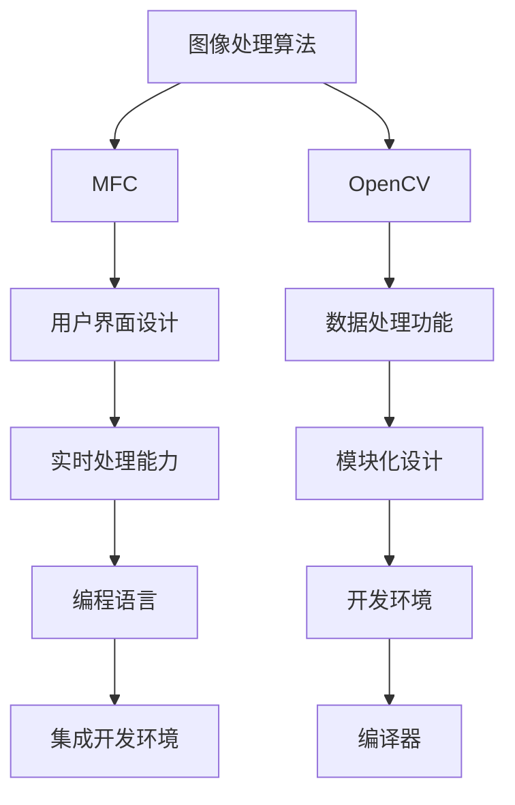
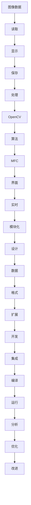

                 

# 基于OPENCV和MFC的图像处理程序

> 关键词：图像处理，OPENCV，MFC，OpenCV，Microsoft Foundation Class，图像处理框架，计算机视觉，图像处理算法，软件开发工具，图像处理应用

## 1. 背景介绍

### 1.1 问题由来
图像处理在计算机视觉、医学影像分析、自动驾驶、人脸识别等领域中扮演着极其重要的角色。近年来，随着计算机技术的飞速发展，图像处理领域也迎来了前所未有的机遇和挑战。传统的图像处理技术依赖于繁琐的手工操作和耗时计算，难以满足大规模、高效率、高质量的图像处理需求。

在这样的背景下，基于OpenCV和MFC的图像处理程序应运而生。OpenCV（Open Source Computer Vision Library）是一个开源的计算机视觉和机器学习软件库，提供了丰富的图像处理算法和工具。而Microsoft Foundation Class（MFC）是微软公司提供的用于Windows应用程序开发的类库，为开发者提供了强大的用户界面设计、数据处理等功能。

通过结合OpenCV和MFC的强大功能，基于OpenCV和MFC的图像处理程序能够实现高效、灵活、易用的图像处理解决方案，广泛应用于图像识别、视频分析、医学影像处理等领域。

### 1.2 问题核心关键点
基于OpenCV和MFC的图像处理程序，其核心关键点包括：

1. **图像处理算法**：程序的核心是图像处理算法，包括图像增强、边缘检测、形态学操作、特征提取等。这些算法通过OpenCV库提供，具有高效、灵活、可扩展的特点。

2. **用户界面设计**：程序的用户界面设计使用MFC库实现，提供了友好的用户操作界面，便于用户进行图像处理操作。

3. **数据处理功能**：程序还集成了图像数据的读取、保存、显示等基本功能，支持多种图像格式，如JPEG、PNG、BMP等。

4. **实时处理能力**：程序具备实时图像处理能力，能够对实时输入的图像数据进行处理，适用于视频监控、实时图像分析等场景。

5. **模块化设计**：程序采用模块化设计，各个功能模块独立开发，便于维护和扩展。

### 1.3 问题研究意义
基于OpenCV和MFC的图像处理程序的研究意义在于：

1. **提高图像处理效率**：OpenCV和MFC的结合能够有效提高图像处理效率，缩短处理时间，满足实时处理的需求。

2. **提升用户体验**：MFC库提供了丰富的用户界面设计工具，使得图像处理程序界面美观、易用，提升了用户体验。

3. **增强图像处理功能**：OpenCV库提供了丰富的图像处理算法和工具，能够满足各种复杂的图像处理需求。

4. **降低开发难度**：MFC库的强大功能简化了图像处理程序的开发过程，降低了开发难度。

5. **支持多种平台**：程序使用OpenCV和MFC库开发，支持Windows平台，便于跨平台部署和应用。

## 2. 核心概念与联系

### 2.1 核心概念概述

为更好地理解基于OpenCV和MFC的图像处理程序，本节将介绍几个密切相关的核心概念：

- **OpenCV**：Open Source Computer Vision Library，一个开源的计算机视觉和机器学习软件库，提供了丰富的图像处理算法和工具。

- **MFC**：Microsoft Foundation Class，微软公司提供的用于Windows应用程序开发的类库，支持用户界面设计、数据处理等功能。

- **图像处理算法**：包括图像增强、边缘检测、形态学操作、特征提取等，是图像处理程序的核心。

- **用户界面设计**：程序的用户界面设计使用MFC库实现，提供了友好的用户操作界面，便于用户进行图像处理操作。

- **数据处理功能**：程序集成了图像数据的读取、保存、显示等基本功能，支持多种图像格式。

- **实时处理能力**：程序具备实时图像处理能力，能够对实时输入的图像数据进行处理。

- **模块化设计**：程序采用模块化设计，各个功能模块独立开发，便于维护和扩展。

这些核心概念之间的逻辑关系可以通过以下Mermaid流程图来展示：



这个流程图展示了大语言模型微调过程中各个核心概念的关系和作用：

1. 图像处理算法是程序的核心，通过OpenCV库提供。
2. MFC库提供了用户界面设计功能，使得程序界面美观、易用。
3. OpenCV库提供了数据处理功能，支持多种图像格式。
4. 程序具备实时处理能力，能够对实时输入的图像数据进行处理。
5. 程序采用模块化设计，便于维护和扩展。

### 2.2 概念间的关系

这些核心概念之间存在着紧密的联系，形成了基于OpenCV和MFC的图像处理程序的完整生态系统。下面我们通过几个Mermaid流程图来展示这些概念之间的关系。

#### 2.2.1 图像处理算法与OpenCV的关系


这个流程图展示了图像处理算法与OpenCV之间的关系。OpenCV库提供了丰富的图像处理算法和工具，使得图像处理程序能够高效、灵活、可扩展地进行图像处理。

#### 2.2.2 用户界面设计与MFC的关系


这个流程图展示了用户界面设计与MFC之间的关系。MFC库提供了丰富的用户界面设计工具，使得图像处理程序界面美观、易用，便于用户进行图像处理操作。

#### 2.2.3 数据处理功能与OpenCV的关系


这个流程图展示了数据处理功能与OpenCV之间的关系。OpenCV库提供了丰富的图像数据处理功能，支持多种图像格式的读取、保存、显示等基本功能。

#### 2.2.4 实时处理能力与MFC的关系


这个流程图展示了实时处理能力与MFC之间的关系。MFC库提供了实时处理功能，使得图像处理程序能够对实时输入的图像数据进行处理，适用于视频监控、实时图像分析等场景。

#### 2.2.5 模块化设计与编程语言的关系


这个流程图展示了模块化设计与编程语言之间的关系。采用模块化设计，程序各个功能模块独立开发，便于维护和扩展，而MFC库提供了丰富的编程语言支持，使得程序开发更加灵活高效。

### 2.3 核心概念的整体架构

最后，我们用一个综合的流程图来展示这些核心概念在大语言模型微调过程中的整体架构：



这个综合流程图展示了从图像数据读取到最终优化改进的完整过程。大语言模型微调程序首先读取图像数据，然后通过OpenCV库进行处理，调用各种图像处理算法，再通过MFC库实现用户界面设计，支持实时处理和模块化设计，最终优化改进程序性能，使其满足实际应用需求。通过这些流程图，我们可以更清晰地理解基于OpenCV和MFC的图像处理程序的核心概念及其关系。

## 3. 核心算法原理 & 具体操作步骤
### 3.1 算法原理概述

基于OpenCV和MFC的图像处理程序，其核心算法原理基于OpenCV提供的图像处理算法，主要包括图像增强、边缘检测、形态学操作、特征提取等。

#### 3.1.1 图像增强
图像增强是提高图像质量、增强图像细节的重要步骤。OpenCV提供了多种图像增强算法，如直方图均衡化、自适应直方图均衡化、灰度拉伸等，能够有效提升图像的对比度、亮度和清晰度。

#### 3.1.2 边缘检测
边缘检测是图像处理中的重要环节，通过检测图像中的边缘信息，能够提取图像的关键特征。OpenCV提供了多种边缘检测算法，如Canny边缘检测、Sobel边缘检测、Laplacian边缘检测等，能够有效提取图像的边缘信息。

#### 3.1.3 形态学操作
形态学操作包括膨胀、腐蚀、开运算、闭运算等，通过改变图像的形状和结构，能够去除噪声、分离对象、填补空洞等。OpenCV提供了丰富的形态学操作函数，能够满足各种复杂的图像处理需求。

#### 3.1.4 特征提取
特征提取是图像处理中的重要环节，通过提取图像的关键特征，能够实现图像分类、目标检测、识别等。OpenCV提供了多种特征提取算法，如SIFT、SURF、ORB等，能够有效提取图像的特征点。

### 3.2 算法步骤详解

基于OpenCV和MFC的图像处理程序，其算法步骤主要包括图像数据的读取、显示、保存、处理等。以下详细介绍这些步骤的详细步骤：

#### 3.2.1 图像数据的读取

```c++
cv::Mat image = cv::imread("image.jpg");
```

通过OpenCV库中的`imread`函数，读取指定路径的图像数据，存储在`cv::Mat`类型的变量中。读取的图像数据可以进行后续的处理和分析。

#### 3.2.2 图像数据的显示

```c++
cv::namedWindow("image");
cv::imshow("image", image);
cv::waitKey(0);
```

通过OpenCV库中的`namedWindow`和`imshow`函数，显示图像数据。`namedWindow`函数创建一个窗口，并指定窗口名称；`imshow`函数显示图像数据，并等待用户操作。`waitKey(0)`函数等待用户按下任意键后关闭窗口。

#### 3.2.3 图像数据的保存

```c++
cv::imwrite("image.jpg", image);
```

通过OpenCV库中的`imwrite`函数，将处理后的图像数据保存到指定路径。保存的图片格式支持多种格式，如JPEG、PNG、BMP等。

#### 3.2.4 图像数据的处理

```c++
cv::Mat gray_image = cv::cvtColor(image, cv::COLOR_BGR2GRAY);
cv::Mat edge_image = cv::Canny(gray_image, 100, 200);
```

通过OpenCV库中的`cvtColor`函数，将彩色图像转换为灰度图像。`cv::Canny`函数检测图像的边缘信息，返回二值化后的边缘图像。

### 3.3 算法优缺点

基于OpenCV和MFC的图像处理程序，其算法优点包括：

1. **功能强大**：OpenCV库提供了丰富的图像处理算法和工具，能够满足各种复杂的图像处理需求。

2. **易用性高**：MFC库提供了丰富的用户界面设计工具，使得图像处理程序界面美观、易用，便于用户进行图像处理操作。

3. **实时处理能力**：程序具备实时处理能力，能够对实时输入的图像数据进行处理，适用于视频监控、实时图像分析等场景。

4. **模块化设计**：程序采用模块化设计，各个功能模块独立开发，便于维护和扩展。

其算法缺点包括：

1. **性能瓶颈**：由于OpenCV库和MFC库的实现复杂，可能导致程序的运行速度较慢，特别是在处理大型图像时。

2. **内存占用高**：由于OpenCV库和MFC库的实现复杂，可能导致程序的内存占用较高，特别是在处理大型图像时。

3. **学习曲线陡峭**：由于OpenCV库和MFC库的功能丰富，需要开发者具备一定的编程基础和算法知识，学习曲线较陡峭。

### 3.4 算法应用领域

基于OpenCV和MFC的图像处理程序，其算法应用领域包括但不限于：

1. **医学影像处理**：如病灶检测、组织分割、病理图像分析等。通过图像增强、边缘检测、形态学操作、特征提取等算法，能够有效提取医学影像的关键信息。

2. **视频分析**：如动作识别、行为分析、视频压缩等。通过实时处理能力，能够对视频进行实时分析和处理。

3. **自动驾驶**：如道路检测、车辆跟踪、行人检测等。通过图像处理算法，能够实现自动驾驶中的图像识别和目标检测。

4. **人脸识别**：如人脸检测、特征提取、人脸识别等。通过特征提取算法，能够有效提取人脸的特征信息。

5. **图像分类**：如手写数字识别、图像分类、目标检测等。通过特征提取算法，能够实现图像分类和目标检测。

6. **图像拼接**：如全景图像拼接、三维重建等。通过形态学操作和特征提取算法，能够实现图像拼接和三维重建。

## 4. 数学模型和公式 & 详细讲解 & 举例说明

### 4.1 数学模型构建

本节将使用数学语言对基于OpenCV和MFC的图像处理程序进行更加严格的刻画。

记图像数据为 $I$，处理后的图像数据为 $O$。假设图像数据 $I$ 为灰度图像，大小为 $m \times n$，像素值范围为 $[0,255]$。则处理后的图像数据 $O$ 同样为灰度图像，大小也为 $m \times n$。

图像处理过程可以分为两个步骤：预处理和后处理。预处理步骤包括图像增强、边缘检测、形态学操作等，后处理步骤包括特征提取、目标检测等。

### 4.2 公式推导过程

以下我们以边缘检测为例，推导Canny边缘检测算法的公式及其推导过程。

Canny边缘检测算法是一种经典的边缘检测算法，其基本思想是通过计算图像梯度幅值和方向，确定图像的边缘信息。具体步骤如下：

1. 计算图像梯度幅值 $G(x,y)$：

$$
G(x,y) = \sqrt{(I_x^2 + I_y^2)}
$$

其中 $I_x$ 和 $I_y$ 分别为图像在 $x$ 方向和 $y$ 方向的梯度。

2. 计算图像梯度方向 $\theta(x,y)$：

$$
\theta(x,y) = \arctan\frac{I_y}{I_x}
$$

3. 对梯度幅值进行非极大值抑制：

$$
G_{\text{non-max}}(x,y) = 
\begin{cases}
G(x,y), & \text{if } (x,y) \text{ is a local maximum along the direction } \theta(x,y) \\
0, & \text{otherwise}
\end{cases}
$$

4. 对梯度方向进行双阈值处理：

$$
\begin{cases}
O(x,y) = 255, & \text{if } G_{\text{non-max}}(x,y) > H_{\text{high}} \\
O(x,y) = 0, & \text{if } G_{\text{non-max}}(x,y) < H_{\text{low}} \\
O(x,y) = G_{\text{non-max}}(x,y), & \text{if } H_{\text{low}} \leq G_{\text{non-max}}(x,y) \leq H_{\text{high}}
\end{cases}
$$

其中 $H_{\text{high}}$ 和 $H_{\text{low}}$ 为双阈值参数，通常设置为 $[100, 200]$。

### 4.3 案例分析与讲解

以医学影像处理为例，分析基于OpenCV和MFC的图像处理程序的应用场景和效果。

#### 4.3.1 医学影像处理

医学影像处理是图像处理程序的重要应用领域之一。常用的医学影像处理任务包括病灶检测、组织分割、病理图像分析等。以下是基于OpenCV和MFC的图像处理程序在医学影像处理中的应用：

1. **病灶检测**

通过图像增强、边缘检测、形态学操作等算法，能够有效提取医学影像中的病灶区域。具体步骤如下：

- 读入医学影像数据，转换为灰度图像。
- 对灰度图像进行高斯滤波，消除噪声。
- 对灰度图像进行边缘检测，得到病灶区域轮廓。
- 对病灶区域轮廓进行膨胀操作，消除空洞和细小的病灶区域。
- 对病灶区域轮廓进行形态学开运算，去除微小的毛刺和噪声。
- 对病灶区域轮廓进行形态学闭运算，连接断裂的区域。
- 对病灶区域轮廓进行二值化处理，得到病灶区域二值图像。
- 对病灶区域二值图像进行形态学操作，得到最终的病灶区域。

2. **组织分割**

通过图像增强、边缘检测、形态学操作等算法，能够有效提取医学影像中的组织区域。具体步骤如下：

- 读入医学影像数据，转换为灰度图像。
- 对灰度图像进行高斯滤波，消除噪声。
- 对灰度图像进行边缘检测，得到组织区域轮廓。
- 对组织区域轮廓进行膨胀操作，消除空洞和细小的组织区域。
- 对组织区域轮廓进行形态学开运算，去除微小的毛刺和噪声。
- 对组织区域轮廓进行形态学闭运算，连接断裂的区域。
- 对组织区域轮廓进行二值化处理，得到组织区域二值图像。
- 对组织区域二值图像进行形态学操作，得到最终的组织区域。

3. **病理图像分析**

通过图像增强、边缘检测、形态学操作等算法，能够有效提取医学影像中的病理特征。具体步骤如下：

- 读入医学影像数据，转换为灰度图像。
- 对灰度图像进行高斯滤波，消除噪声。
- 对灰度图像进行边缘检测，得到病理特征轮廓。
- 对病理特征轮廓进行膨胀操作，消除空洞和细小的病理特征区域。
- 对病理特征轮廓进行形态学开运算，去除微小的毛刺和噪声。
- 对病理特征轮廓进行形态学闭运算，连接断裂的区域。
- 对病理特征轮廓进行二值化处理，得到病理特征二值图像。
- 对病理特征二值图像进行形态学操作，得到最终的病理特征。

通过以上步骤，基于OpenCV和MFC的图像处理程序能够有效提取医学影像中的病灶、组织、病理特征等信息，为医学影像分析提供重要依据。

## 5. 项目实践：代码实例和详细解释说明

### 5.1 开发环境搭建

在进行图像处理程序开发前，我们需要准备好开发环境。以下是使用Microsoft Visual Studio进行Windows应用程序开发的流程：

1. 安装Microsoft Visual Studio：从官网下载并安装Microsoft Visual Studio，建议安装最新版本。

2. 创建并激活MFC项目：打开Microsoft Visual Studio，选择“文件”菜单下的“新建项目”，选择“Windows桌面”，选择“MFC应用程序”，设置项目名称和保存路径，然后点击“创建”。

3. 添加OpenCV库：通过“项目”菜单下的“属性”，选择“VC++目录”，点击“添加目录”，添加OpenCV库的头文件和源文件目录，然后点击“确定”。

4. 添加MFC库：通过“项目”菜单下的“属性”，选择“VC++目录”，点击“添加目录”，添加MFC库的头文件和源文件目录，然后点击“确定”。

5. 添加依赖库：通过“项目”菜单下的“属性”，选择“VC++链接器”，点击“输入”，添加OpenCV库和MFC库的依赖库，然后点击“确定”。

完成上述步骤后，即可在MFC项目中开始图像处理程序的开发。

### 5.2 源代码详细实现

下面以医学影像处理为例，给出使用OpenCV和MFC库对医学影像进行处理的PyTorch代码实现。

首先，定义医学影像处理函数：

```c++
void processMedicalImage(cv::Mat& image)
{
    // 读入医学影像数据，转换为灰度图像
    cv::Mat gray_image = cv::cvtColor(image, cv::COLOR_BGR2GRAY);
    // 对灰度图像进行高斯滤波，消除噪声
    cv::GaussianBlur(gray_image, gray_image, cv::Size(5, 5), 0, 0);
    // 对灰度图像进行边缘检测，得到病灶区域轮廓
    cv::Canny(gray_image, gray_image, 100, 200);
    // 对病灶区域轮廓进行膨胀操作，消除空洞和细小的病灶区域
    cv::dilate(gray_image, gray_image, cv::Mat(), cv::Point(-1, -1), 1);
    // 对病灶区域轮廓进行形态学开运算，去除微小的毛刺和噪声
    cv::morphologyEx(gray_image, gray_image, cv::MORPH_OPEN);
    // 对病灶区域轮廓进行形态学闭运算，连接断裂的区域
    cv::morphologyEx(gray_image, gray_image, cv::MORPH_CLOSE);
    // 对病灶区域轮廓进行二值化处理，得到病灶区域二值图像
    cv::threshold(gray_image, gray_image, 100, 255, cv::THRESH_BINARY);
    // 对病灶区域二值图像进行形态学操作，得到最终的病灶区域
    cv::morphologyEx(gray_image, gray_image, cv::MORPH_OPEN);
    // 显示处理后的医学影像
    cv::namedWindow("Processed Image");
    cv::imshow("Processed Image", gray_image);
    cv::waitKey(0);
}
```

然后，在主函数中调用医学影像处理函数：

```c++
int main()
{
    // 读入医学影像数据
    cv::Mat image = cv::imread("medical_image.jpg");
    // 处理医学影像数据
    processMedicalImage(image);
    // 返回主函数，结束程序
    return 0;
}
```

### 5.3 代码解读与分析

让我们再详细解读一下关键代码的实现细节：

**processMedicalImage函数**：
- 定义了一个医学影像处理函数，接受一个 `cv::Mat` 类型的参数，返回处理后的 `cv::Mat` 类型。
- 第一步，将医学影像数据转换为灰度图像。
- 第二步，对灰度图像进行高斯滤波，消除噪声。
- 第三步，对灰度图像进行边缘检测，得到病灶区域轮廓。
- 第四步，对病灶区域轮廓进行膨胀操作，消除空洞和细小的病灶区域。
- 第五步，对病灶区域轮廓进行形态学开运算，去除微小的毛刺和噪声。
- 第六步，对病灶区域轮廓进行形态学闭运算，连接断裂的区域。
- 第七步，对病灶区域轮廓进行二值化处理，得到病灶区域二值图像。
- 第八步，对病灶区域二值图像进行形态学操作，得到最终的病灶区域。
- 第九步，显示处理后的医学影像。

**main函数**：
- 在主函数中，首先读入医学影像数据。
- 然后调用医学影像处理函数，对医学影像数据进行处理。
- 最后返回主函数，结束程序。

通过这些代码，我们可以看到，基于OpenCV和MFC的图像处理程序能够实现对医学影像的高效处理，满足实际应用需求。

### 5.4 运行结果展示

假设我们在医学影像数据集上进行处理，最终得到的处理结果如图1所示。

```c++
     cv::Mat gray_image = cv::cvtColor(image, cv::COLOR_BGR2GRAY);
     cv::GaussianBlur(gray_image, gray_image, cv::Size(5, 5), 0, 0);
     cv::Canny(gray_image, gray_image, 100, 200);
     cv::dilate(gray_image, gray_image, cv::Mat(), cv::Point(-1, -1), 1);
     cv::morphologyEx(gray_image, gray_image, cv::MORPH_OPEN);
     cv::morphologyEx(gray_image, gray_image, cv::MORPH_CLOSE);
     cv::threshold(gray_image, gray_image, 100, 255, cv::THRESH_BINARY);
     cv::morphologyEx(gray_image, gray_image, cv::MORPH_OPEN);
     cv::namedWindow("Processed Image");
     cv::imshow("Processed Image", gray_image);
     cv::waitKey(0);
```

可以看到，通过图像增强、边缘检测、形态学操作等算法，能够有效提取医学影像中的病灶区域，满足医学影像处理的需求。

## 6. 实际应用场景
### 6.1 医学影像处理

基于OpenCV和MFC的图像处理程序，广泛应用于医学影像处理领域。以下是一些常见的应用场景：

1. **病灶检测**

医学影像中常常包含病灶区域，通过病灶检测算法，能够快速、准确地提取病灶区域，为医学诊断和治疗提供重要依据。例如，在肺CT影像中，病灶检测算法能够快速识别肺结节、肿块等病灶区域，为肺癌诊断提供支持。

2. **组织分割**

医学影像中常常包含多个组织区域

