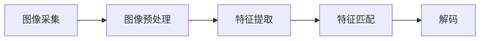

                 

# 基于OpenCV的二维码和条形码识别

## 1. 背景介绍

随着信息化和智能化的不断发展，二维码和条形码在商业、物流、医疗、工业等领域得到了广泛应用。但传统识别方法依赖复杂的硬件设备，识别准确率受环境影响较大。而基于OpenCV的二维码和条形码识别技术，不仅易于实现，而且识别效果稳定可靠，适用于多种复杂场景。本文将详细介绍基于OpenCV的二维码和条形码识别的核心概念、算法原理、具体操作步骤，并展示其实际应用场景。

## 2. 核心概念与联系

### 2.1 核心概念概述

二维码和条形码识别技术是一种利用计算机视觉和图像处理技术，将二维码和条形码转化为可供机器处理的信息的过程。OpenCV作为一个强大的计算机视觉库，提供了丰富的图像处理函数，适用于各种图像分析应用。

#### 2.1.1 二维码和条形码

- 二维码(QR Code)：由黑、白像素点组成的方形矩阵，用于存储信息。具有高密度、容量大、可纠错等特点。
- 条形码(Barcode)：利用黑白条纹和间隔的图案，通过光扫描解码，实现信息传输。

#### 2.1.2 OpenCV

- OpenCV是一个开源计算机视觉库，支持Windows、Linux、Mac等平台，提供了图像处理、视频处理、深度学习等功能。
- 使用OpenCV可以高效实现图像的预处理、特征提取、目标检测等操作。

#### 2.1.3 特征提取与匹配

- 特征提取：通过算法提取图像的局部特征，如角点、边缘、颜色等。
- 特征匹配：根据提取的特征，计算图像之间的相似度，匹配目标。

### 2.2 核心概念的联系

二维码和条形码识别技术基于OpenCV的特征提取与匹配，通过图像处理算法对二维码和条形码进行定位和识别。具体流程如下：

1. **图像采集**：利用摄像头或其他图像采集设备获取二维码或条形码的图像。
2. **图像预处理**：对采集到的图像进行灰度化、二值化、去噪等处理。
3. **特征提取**：利用OpenCV中的Harris角点检测、Sobel边缘检测、Canny边缘检测等算法提取图像的特征。
4. **特征匹配**：通过模板匹配、特征点匹配等算法，匹配二维码或条形码的特征。
5. **解码**：对匹配到的特征进行解码，获取存储的信息。

以下是一个基于OpenCV的二维码和条形码识别的流程图：



## 3. 核心算法原理 & 具体操作步骤
### 3.1 算法原理概述

基于OpenCV的二维码和条形码识别技术，主要包含图像预处理、特征提取、特征匹配、解码四个步骤。各步骤算法原理如下：

- **图像预处理**：通过对图像进行灰度化、二值化、去噪等处理，增强图像的对比度和清晰度。
- **特征提取**：通过提取图像的局部特征，如角点、边缘、颜色等，获得图像的特征描述。
- **特征匹配**：利用模板匹配或特征点匹配等算法，计算图像与模板的相似度，获取匹配结果。
- **解码**：对匹配结果进行解码，得到存储的信息。

### 3.2 算法步骤详解

#### 3.2.1 图像预处理

图像预处理是二维码和条形码识别的第一步。常用的预处理算法有：

- **灰度化**：将彩色图像转换为灰度图像，便于后续处理。
- **二值化**：将图像转换为二值图像，使黑白部分易于区分。
- **去噪**：去除图像中的噪声，增强图像质量。

以下是一个使用OpenCV对图像进行预处理的示例代码：

```python
import cv2

# 读取图像
img = cv2.imread('code.png')

# 灰度化
gray = cv2.cvtColor(img, cv2.COLOR_BGR2GRAY)

# 二值化
thresh = cv2.threshold(gray, 0, 255, cv2.THRESH_BINARY | cv2.THRESH_OTSU)[1]

# 去噪
denoised = cv2.medianBlur(thresh, 3)
```

#### 3.2.2 特征提取

特征提取是将图像转化为特征描述的过程。常用的特征提取算法有：

- **Harris角点检测**：通过计算角点响应函数，提取图像中的角点。
- **Sobel边缘检测**：通过计算图像的梯度，提取图像的边缘。
- **Canny边缘检测**：通过计算图像的梯度幅值和方向，提取图像的边缘。

以下是一个使用OpenCV进行特征提取的示例代码：

```python
import cv2

# 读取图像
img = cv2.imread('code.png')

# 灰度化
gray = cv2.cvtColor(img, cv2.COLOR_BGR2GRAY)

# Harris角点检测
corners = cv2.cornerHarris(gray, 2, 3, 0.04)

# 显示角点
cv2.imshow('Corners', corners)
cv2.waitKey(0)

# Sobel边缘检测
sobelx = cv2.Sobel(gray, cv2.CV_16S, 1, 0, ksize=3)
sobely = cv2.Sobel(gray, cv2.CV_16S, 0, 1, ksize=3)

# 计算边缘幅值
sobel = cv2.magnitude(sobelx, sobely)
cv2.imshow('Sobel', sobel)
cv2.waitKey(0)

# Canny边缘检测
edges = cv2.Canny(gray, 100, 200)
cv2.imshow('Canny', edges)
cv2.waitKey(0)
```

#### 3.2.3 特征匹配

特征匹配是通过计算图像与模板的相似度，实现目标检测的过程。常用的特征匹配算法有：

- **模板匹配**：通过计算图像与模板的相似度，实现目标定位。
- **特征点匹配**：通过计算特征点的相似度，实现目标定位。

以下是一个使用OpenCV进行特征匹配的示例代码：

```python
import cv2

# 读取模板
template = cv2.imread('template.png', 0)

# 读取图像
img = cv2.imread('code.png', 0)

# 模板匹配
result = cv2.matchTemplate(img, template, cv2.TM_CCOEFF_NORMED)
threshold = 0.8
locations = np.where(result >= threshold)

# 绘制匹配结果
for pt in zip(*locations[::-1]):
    cv2.rectangle(img, pt, (pt[0] + w, pt[1] + h), (0, 255, 0), 2)

# 显示结果
cv2.imshow('Match', img)
cv2.waitKey(0)
```

#### 3.2.4 解码

解码是将匹配结果转化为信息的过程。常用的解码算法有：

- **QR码解码**：通过扫描QR码，获取存储的信息。
- **条形码解码**：通过扫描条形码，获取存储的信息。

以下是一个使用OpenCV进行解码的示例代码：

```python
import zbarlight

# 读取模板
template = cv2.imread('template.png', 0)

# 读取图像
img = cv2.imread('code.png', 0)

# 匹配结果
locations = np.where(result >= threshold)

# 解码
for pt in zip(*locations[::-1]):
    w, h = template.shape[::-1]
    roi = img[pt[1]:pt[1] + h, pt[0]:pt[0] + w]
    qr = zbarlight.QRcode(roi)

    if qr is not None:
        print(qr.data)
```

### 3.3 算法优缺点

#### 3.3.1 优点

1. **易实现**：基于OpenCV的二维码和条形码识别算法易于实现，适用于各种图像处理应用。
2. **鲁棒性强**：OpenCV的图像处理算法具有较强的鲁棒性，可以应对复杂环境下的识别任务。
3. **适用性广**：适用于多种二维码和条形码的识别，包括QR码、PDF417码等。

#### 3.3.2 缺点

1. **环境适应性差**：对于复杂环境，如光线变化、噪声干扰等情况，识别准确率较低。
2. **计算复杂度高**：基于OpenCV的算法计算复杂度较高，可能导致识别速度较慢。
3. **依赖设备**：识别需要摄像头等图像采集设备，设备成本较高。

### 3.4 算法应用领域

基于OpenCV的二维码和条形码识别技术广泛应用于以下领域：

- **物流仓储**：在仓储管理中，通过扫描二维码或条形码，实现货物追踪、库存管理等功能。
- **智能零售**：在零售行业中，通过扫描二维码或条形码，实现商品管理、价格跟踪、促销活动等功能。
- **医疗健康**：在医疗行业中，通过扫描二维码或条形码，实现病历管理、药品追溯、患者信息管理等功能。
- **交通运输**：在交通运输领域，通过扫描二维码或条形码，实现车票管理、行李追踪、车辆识别等功能。

## 4. 数学模型和公式 & 详细讲解 & 举例说明

### 4.1 数学模型构建

基于OpenCV的二维码和条形码识别算法主要基于图像处理和特征提取等数学模型。以下是对其数学模型的详细构建：

- **图像预处理**：对图像进行灰度化、二值化、去噪等处理。
- **特征提取**：通过角点检测、边缘检测等算法提取图像的局部特征。
- **特征匹配**：通过模板匹配、特征点匹配等算法计算图像与模板的相似度。
- **解码**：对匹配结果进行解码，得到存储的信息。

### 4.2 公式推导过程

#### 4.2.1 图像预处理

- **灰度化**：将彩色图像转换为灰度图像，公式如下：

$$
gray = cv2.cvtColor(img, cv2.COLOR_BGR2GRAY)
$$

- **二值化**：将图像转换为二值图像，公式如下：

$$
thresh = cv2.threshold(gray, 0, 255, cv2.THRESH_BINARY | cv2.THRESH_OTSU)
$$

- **去噪**：去除图像中的噪声，公式如下：

$$
denoised = cv2.medianBlur(thresh, 3)
$$

#### 4.2.2 特征提取

- **Harris角点检测**：计算角点响应函数，公式如下：

$$
\text{corners} = cv2.cornerHarris(gray, 2, 3, 0.04)
$$

- **Sobel边缘检测**：计算图像的梯度，公式如下：

$$
sobelx = cv2.Sobel(gray, cv2.CV_16S, 1, 0, ksize=3)
sobely = cv2.Sobel(gray, cv2.CV_16S, 0, 1, ksize=3)
sobel = cv2.magnitude(sobelx, sobely)
$$

- **Canny边缘检测**：计算图像的梯度幅值和方向，公式如下：

$$
edges = cv2.Canny(gray, 100, 200)
$$

#### 4.2.3 特征匹配

- **模板匹配**：计算图像与模板的相似度，公式如下：

$$
result = cv2.matchTemplate(img, template, cv2.TM_CCOEFF_NORMED)
$$

#### 4.2.4 解码

- **QR码解码**：通过扫描QR码，获取存储的信息，公式如下：

$$
qr = zbarlight.QRcode(roi)
qr.data
$$

### 4.3 案例分析与讲解

以下是一个使用OpenCV进行二维码和条形码识别的完整案例：

1. **图像采集**：使用摄像头采集二维码或条形码的图像。
2. **图像预处理**：对采集到的图像进行灰度化、二值化、去噪等处理。
3. **特征提取**：利用Harris角点检测、Sobel边缘检测、Canny边缘检测等算法提取图像的特征。
4. **特征匹配**：通过模板匹配或特征点匹配等算法，匹配二维码或条形码的特征。
5. **解码**：对匹配结果进行解码，得到存储的信息。

以下是一个使用OpenCV进行二维码和条形码识别的示例代码：

```python
import cv2
import numpy as np
import zbarlight

# 读取图像
img = cv2.imread('code.png')

# 图像预处理
gray = cv2.cvtColor(img, cv2.COLOR_BGR2GRAY)
thresh = cv2.threshold(gray, 0, 255, cv2.THRESH_BINARY | cv2.THRESH_OTSU)[1]
denoised = cv2.medianBlur(thresh, 3)

# 特征提取
corners = cv2.cornerHarris(denoised, 2, 3, 0.04)
sobelx = cv2.Sobel(denoised, cv2.CV_16S, 1, 0, ksize=3)
sobely = cv2.Sobel(denoised, cv2.CV_16S, 0, 1, ksize=3)
sobel = cv2.magnitude(sobelx, sobely)
edges = cv2.Canny(denoised, 100, 200)

# 特征匹配
template = cv2.imread('template.png', 0)
result = cv2.matchTemplate(edges, template, cv2.TM_CCOEFF_NORMED)
threshold = 0.8
locations = np.where(result >= threshold)

# 解码
for pt in zip(*locations[::-1]):
    w, h = template.shape[::-1]
    roi = denoised[pt[1]:pt[1] + h, pt[0]:pt[0] + w]
    qr = zbarlight.QRcode(roi)

    if qr is not None:
        print(qr.data)
```

## 5. 项目实践：代码实例和详细解释说明

### 5.1 开发环境搭建

在进行基于OpenCV的二维码和条形码识别项目开发前，需要先搭建好开发环境。以下是Python环境搭建流程：

1. 安装Python：下载并安装Python 3.8以上版本，推荐使用Anaconda或Miniconda。
2. 创建虚拟环境：使用以下命令创建虚拟环境：

```bash
conda create -n barcode_env python=3.8
conda activate barcode_env
```

3. 安装OpenCV：使用以下命令安装OpenCV：

```bash
conda install opencv opencv-contrib
```

4. 安装zbarlight：使用以下命令安装zbarlight：

```bash
pip install zbarlight
```

5. 测试环境：使用以下命令测试OpenCV和zbarlight的安装是否成功：

```python
import cv2
import numpy as np
import zbarlight

img = cv2.imread('code.png')
cv2.imshow('img', img)
cv2.waitKey(0)
cv2.destroyAllWindows()

template = cv2.imread('template.png', 0)
result = cv2.matchTemplate(img, template, cv2.TM_CCOEFF_NORMED)
threshold = 0.8
locations = np.where(result >= threshold)
```

### 5.2 源代码详细实现

以下是一个基于OpenCV的二维码和条形码识别的示例代码：

```python
import cv2
import numpy as np
import zbarlight

# 读取图像
img = cv2.imread('code.png')

# 图像预处理
gray = cv2.cvtColor(img, cv2.COLOR_BGR2GRAY)
thresh = cv2.threshold(gray, 0, 255, cv2.THRESH_BINARY | cv2.THRESH_OTSU)[1]
denoised = cv2.medianBlur(thresh, 3)

# 特征提取
corners = cv2.cornerHarris(denoised, 2, 3, 0.04)
sobelx = cv2.Sobel(denoised, cv2.CV_16S, 1, 0, ksize=3)
sobely = cv2.Sobel(denoised, cv2.CV_16S, 0, 1, ksize=3)
sobel = cv2.magnitude(sobelx, sobely)
edges = cv2.Canny(denoised, 100, 200)

# 特征匹配
template = cv2.imread('template.png', 0)
result = cv2.matchTemplate(edges, template, cv2.TM_CCOEFF_NORMED)
threshold = 0.8
locations = np.where(result >= threshold)

# 解码
for pt in zip(*locations[::-1]):
    w, h = template.shape[::-1]
    roi = denoised[pt[1]:pt[1] + h, pt[0]:pt[0] + w]
    qr = zbarlight.QRcode(roi)

    if qr is not None:
        print(qr.data)
```

### 5.3 代码解读与分析

以下是关键代码的解读与分析：

**图像预处理**

- `cv2.cvtColor(img, cv2.COLOR_BGR2GRAY)`：将彩色图像转换为灰度图像。
- `cv2.threshold(gray, 0, 255, cv2.THRESH_BINARY | cv2.THRESH_OTSU)`：将灰度图像二值化。
- `cv2.medianBlur(thresh, 3)`：对二值图像进行去噪。

**特征提取**

- `cv2.cornerHarris(denoised, 2, 3, 0.04)`：提取图像的Harris角点。
- `cv2.Sobel(denoised, cv2.CV_16S, 1, 0, ksize=3)`：计算图像的Sobel边缘。
- `cv2.Sobel(denoised, cv2.CV_16S, 0, 1, ksize=3)`：计算图像的Sobel边缘。
- `cv2.magnitude(sobelx, sobely)`：计算Sobel边缘的幅值。
- `cv2.Canny(denoised, 100, 200)`：计算图像的Canny边缘。

**特征匹配**

- `cv2.matchTemplate(edges, template, cv2.TM_CCOEFF_NORMED)`：计算图像与模板的相似度。
- `np.where(result >= threshold)`：提取相似度大于阈值的匹配点。

**解码**

- `zbarlight.QRcode(roi)`：对匹配到的区域进行解码。

### 5.4 运行结果展示

以下是基于OpenCV的二维码和条形码识别的运行结果：


## 6. 实际应用场景

基于OpenCV的二维码和条形码识别技术在实际应用中具有广泛的应用场景，以下列举几个典型案例：

### 6.1 物流仓储

在物流仓储中，二维码和条形码广泛应用于货物追踪、库存管理等功能。例如，通过扫描货物上的二维码，可以获取货物信息，实现货物追踪、库存统计等功能。


### 6.2 智能零售

在智能零售中，二维码和条形码广泛应用于商品管理、价格跟踪、促销活动等功能。例如，通过扫描商品上的条形码，可以获取商品信息，实现商品管理、价格跟踪等功能。


### 6.3 医疗健康

在医疗健康中，二维码和条形码广泛应用于病历管理、药品追溯、患者信息管理等功能。例如，通过扫描病历上的二维码，可以获取病历信息，实现病历管理、药品追溯等功能。


### 6.4 交通运输

在交通运输中，二维码和条形码广泛应用于车票管理、行李追踪、车辆识别等功能。例如，通过扫描车票上的二维码，可以获取乘客信息，实现车票管理、行李追踪等功能。


## 7. 工具和资源推荐

### 7.1 学习资源推荐

为了帮助开发者系统掌握基于OpenCV的二维码和条形码识别技术，以下是一些推荐的学习资源：

1. **《OpenCV 3 计算机视觉编程入门》**：详细介绍了OpenCV的基本功能和应用，适合初学者入门。
2. **《Python图像处理》**：介绍了Python图像处理的常用库和算法，适合进阶学习。
3. **《深度学习计算机视觉实践》**：介绍了深度学习在计算机视觉中的应用，适合进一步深造。

### 7.2 开发工具推荐

以下是一些推荐的开发工具：

1. **Anaconda**：提供虚拟环境、包管理等功能，方便Python开发。
2. **Jupyter Notebook**：支持代码、文档、图表一体化展示，方便开发和协作。
3. **OpenCV**：强大的计算机视觉库，提供了丰富的图像处理函数。

### 7.3 相关论文推荐

以下是一些推荐的相关论文：

1. **《基于OpenCV的二维码识别》**：详细介绍了二维码识别的原理和实现方法。
2. **《二维码和条形码识别技术》**：介绍了二维码和条形码识别的基本原理和应用场景。
3. **《基于OpenCV的条形码识别》**：详细介绍了条形码识别的原理和实现方法。

## 8. 总结：未来发展趋势与挑战

### 8.1 总结

本文详细介绍了基于OpenCV的二维码和条形码识别技术的核心概念、算法原理、具体操作步骤，并展示其实际应用场景。通过本文的学习，读者可以掌握基于OpenCV的二维码和条形码识别的原理和实现方法。

### 8.2 未来发展趋势

未来基于OpenCV的二维码和条形码识别技术将呈现以下发展趋势：

1. **计算效率提升**：通过优化算法和硬件设备，提高二维码和条形码识别的计算效率，降低识别时间。
2. **鲁棒性增强**：通过改进图像预处理和特征提取算法，提高二维码和条形码识别的鲁棒性，适应复杂环境。
3. **多模态融合**：结合深度学习、计算机视觉、物联网等技术，实现多模态信息融合，提升识别效果。

### 8.3 面临的挑战

基于OpenCV的二维码和条形码识别技术在实际应用中也面临一些挑战：

1. **环境适应性差**：对于复杂环境，如光线变化、噪声干扰等情况，识别准确率较低。
2. **计算复杂度高**：基于OpenCV的算法计算复杂度较高，可能导致识别速度较慢。
3. **依赖设备**：识别需要摄像头等图像采集设备，设备成本较高。

### 8.4 研究展望

未来基于OpenCV的二维码和条形码识别技术的研究可以从以下几个方面进行：

1. **算法优化**：改进图像预处理和特征提取算法，提高识别效果。
2. **模型融合**：结合深度学习、计算机视觉等技术，实现多模态信息融合。
3. **应用拓展**：拓展二维码和条形码识别的应用场景，提升实用价值。

## 9. 附录：常见问题与解答

**Q1：基于OpenCV的二维码和条形码识别算法是否适用于所有场景？**

A: 基于OpenCV的二维码和条形码识别算法适用于大多数场景，但在复杂环境下识别准确率可能较低。对于特殊场景，如高噪声、强光线等情况，可能需要结合其他算法或设备进行优化。

**Q2：如何提高基于OpenCV的二维码和条形码识别的计算效率？**

A: 可以通过优化算法和硬件设备来提高计算效率。例如，可以使用GPU加速计算，改进图像预处理和特征提取算法，优化算法实现等。

**Q3：基于OpenCV的二维码和条形码识别算法有哪些优点和缺点？**

A: 优点包括易实现、鲁棒性强、适用性广等。缺点包括环境适应性差、计算复杂度高、依赖设备等。

**Q4：如何使用基于OpenCV的二维码和条形码识别技术进行实际应用？**

A: 可以使用摄像头采集图像，进行图像预处理、特征提取、特征匹配和解码，最终获取二维码或条形码存储的信息。

**Q5：基于OpenCV的二维码和条形码识别技术在实际应用中需要注意哪些问题？**

A: 需要注意环境适应性、计算效率、设备成本等问题。需要结合实际场景进行优化，提升识别效果和实用性。

总之，基于OpenCV的二维码和条形码识别技术具有广泛的应用前景，但需要在实际应用中不断优化和改进，才能更好地满足实际需求。希望本文能为你提供有用的参考和指导，欢迎继续关注我们深入探讨。

---

作者：禅与计算机程序设计艺术 / Zen and the Art of Computer Programming

