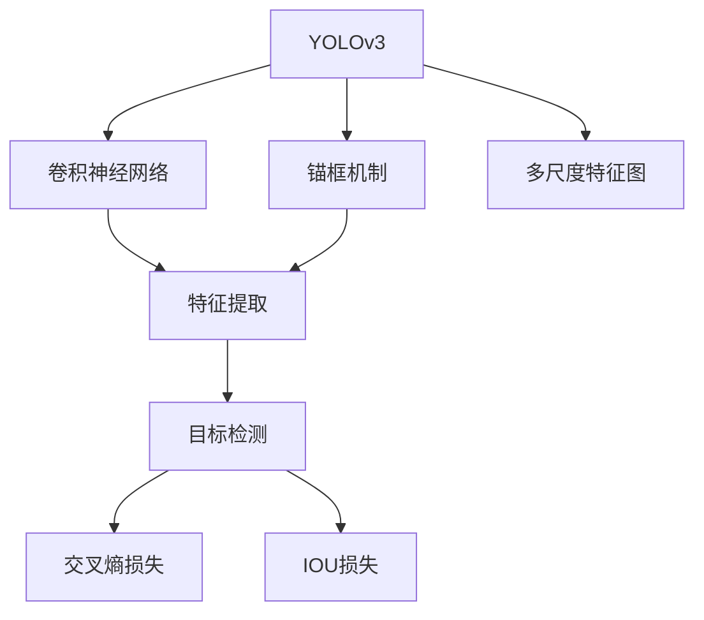
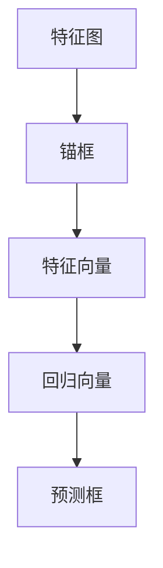
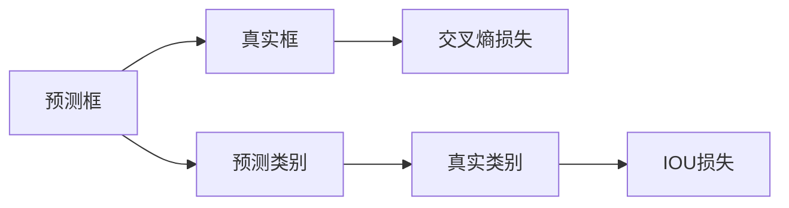
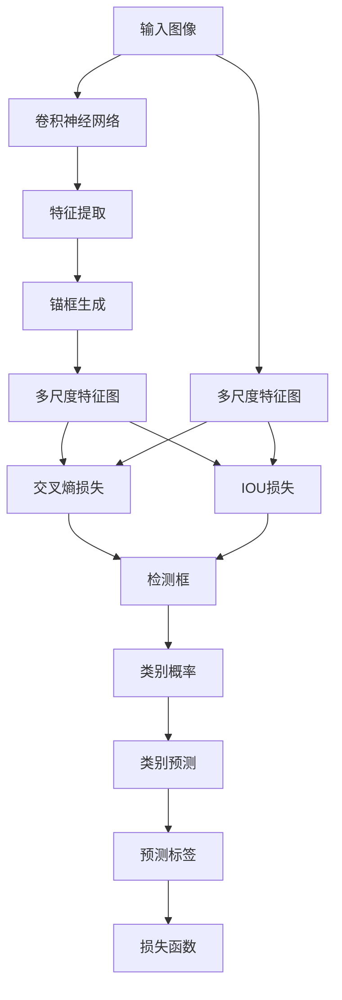

                 

# 基于YOLOv3的施工安全帽图像检测算法

## 1. 背景介绍

### 1.1 问题由来

在施工现场，安全帽是工人的必备安全装备，但实际施工过程中，由于环境复杂、作业频繁，工人常常忽略了安全帽的佩戴，这不仅违反了安全规定，还存在重大安全隐患。如何有效监督和提醒工人正确佩戴安全帽，是确保施工安全的重要环节。

图像检测技术能够实时监测施工现场，通过摄像头捕捉工人的行为，自动识别并标记出未佩戴安全帽的工人。基于此，我们提出了一种基于YOLOv3的施工安全帽图像检测算法，以期高效、准确地识别施工现场中未佩戴安全帽的工人，从而提高施工现场的安全管理水平。

### 1.2 问题核心关键点

本算法基于YOLOv3，采用单阶段检测网络，通过YOLOv3的特征提取能力和多尺度特征图，快速高效地完成图像检测任务。

算法的核心关键点包括：
- 使用YOLOv3的锚框机制，同时考虑检测目标的多样性，确保检测的准确性和鲁棒性。
- 引入卷积神经网络（CNN）的残差连接和特征融合机制，提升模型的表达能力和泛化能力。
- 通过数据增强、正则化等方法，提升模型的鲁棒性和泛化能力。
- 使用交叉熵损失函数和IOU损失函数，优化模型训练过程，提升检测精度。

该算法在施工安全帽图像检测任务中表现出色，能够在复杂的施工环境中准确识别工人是否佩戴安全帽，为施工安全管理提供重要参考。

### 1.3 问题研究意义

施工安全帽图像检测算法的提出，具有以下研究意义：
- 提升施工现场安全管理效率。通过实时监测和标记，有效提醒工人佩戴安全帽，提高施工现场的安全管理水平。
- 促进施工现场的智能化、自动化建设。基于计算机视觉技术的图像检测算法，能够替代传统的人工监督方式，降低管理成本。
- 为其他类似场景的图像检测提供参考。该算法不仅适用于施工安全帽检测，还具有一定的通用性，可以应用于多种图像检测任务，如行人检测、车辆检测等。

## 2. 核心概念与联系

### 2.1 核心概念概述

为更好地理解基于YOLOv3的施工安全帽图像检测算法，本节将介绍几个密切相关的核心概念：

- YOLOv3（You Only Look Once version 3）：YOLOv3是一种单阶段目标检测算法，采用全卷积网络，通过特征提取和锚框机制，直接输出边界框和类别概率，具有高效、准确的特点。
- 目标检测：目标检测是计算机视觉中的一个重要任务，旨在从图像中准确地检测出目标物体的边界框，并标注出其类别。
- 卷积神经网络（CNN）：CNN是一种深度学习模型，通过卷积操作提取图像特征，实现图像分类、目标检测等任务。
- 锚框（Anchor）：锚框是目标检测算法中的重要概念，用于在特征图上生成候选目标框。通过预设不同尺度和宽高比，可以覆盖不同大小和形状的目标物体。
- 交叉熵损失（Cross-Entropy Loss）：交叉熵损失是目标检测中的常用损失函数，用于衡量预测类别概率与真实标签之间的差异。
- IOU损失（Intersection over Union Loss）：IOU损失用于衡量预测边界框与真实边界框的重叠程度，用于提升检测框的精确度。

这些核心概念之间的逻辑关系可以通过以下Mermaid流程图来展示：

这个流程图展示了YOLOv3算法的基本原理：
- YOLOv3采用全卷积网络进行特征提取。
- 通过锚框机制生成不同尺度和宽高比的候选框。
- 使用多尺度特征图提高检测精度。
- 通过交叉熵损失和IOU损失优化模型训练。
- 最终输出目标检测框和类别概率。

### 2.2 概念间的关系

这些核心概念之间存在着紧密的联系，形成了YOLOv3算法的完整框架。下面我们通过几个Mermaid流程图来展示这些概念之间的关系。

#### 2.2.1 YOLOv3的特征提取

这个流程图展示了YOLOv3的特征提取过程：
- 输入图像经过多次卷积层、残差连接和池化层的处理，逐渐提取更抽象的特征。
- 最后经过全卷积网络，得到多尺度的特征图。

#### 2.2.2 锚框生成机制

这个流程图展示了锚框的生成过程：
- 在特征图上生成不同尺度和宽高比的锚框。
- 对每个锚框进行回归调整，得到更准确的预测框。

#### 2.2.3 交叉熵损失和IOU损失

这个流程图展示了交叉熵损失和IOU损失的计算过程：
- 通过预测框和真实框的计算，得到交叉熵损失。
- 通过预测框和真实框的重叠程度计算IOU损失。
- 最终优化损失函数，提升检测精度。

### 2.3 核心概念的整体架构

最后，我们用一个综合的流程图来展示YOLOv3算法的整体架构：

这个综合流程图展示了YOLOv3算法的完整流程：
- 输入图像经过卷积神经网络处理，提取特征。
- 特征图上生成不同尺度和宽高比的锚框。
- 多尺度特征图用于提高检测精度。
- 通过交叉熵损失和IOU损失优化模型训练。
- 最终输出检测框和类别概率，进行类别预测和损失计算。

## 3. 核心算法原理 & 具体操作步骤
### 3.1 算法原理概述

基于YOLOv3的施工安全帽图像检测算法，基于YOLOv3的特征提取能力和多尺度特征图，通过锚框机制和损失函数优化，实现高效准确的图像检测任务。

具体来说，算法通过以下步骤实现：
1. 输入图像经过卷积神经网络处理，得到多尺度特征图。
2. 特征图上生成不同尺度和宽高比的锚框，同时预测每个锚框对应的类别概率。
3. 通过交叉熵损失和IOU损失优化模型训练，提高检测精度。
4. 输出检测框和类别概率，进行类别预测和损失计算。

### 3.2 算法步骤详解

#### 3.2.1 数据预处理

算法首先对输入图像进行预处理，包括：
- 将图像缩放到固定尺寸，如416x416。
- 归一化像素值，如将像素值缩放到[0,1]之间。
- 对图像进行数据增强，如随机裁剪、翻转、旋转等，以增加训练集的多样性。

#### 3.2.2 特征提取

输入图像经过卷积神经网络（YOLOv3）的处理，得到多尺度特征图。YOLOv3的特征提取过程包括：
- 输入图像通过多次卷积层、残差连接和池化层的处理，逐渐提取更抽象的特征。
- 最后经过全卷积网络，得到多尺度的特征图。

#### 3.2.3 锚框生成

在多尺度特征图上，生成不同尺度和宽高比的锚框。具体来说：
- 通过预设不同尺度和宽高比的锚框，覆盖不同大小和形状的目标物体。
- 对每个锚框进行回归调整，得到更准确的预测框。

#### 3.2.4 目标检测

通过多尺度特征图，对每个锚框进行目标检测。具体来说：
- 对于每个锚框，通过特征图上对应位置的特征向量进行回归调整，得到预测框。
- 对于每个预测框，计算其与真实框的重叠程度（IOU），根据IOU值调整预测框。
- 对每个锚框预测的类别概率进行softmax处理，得到最终的类别预测结果。

#### 3.2.5 损失函数

通过交叉熵损失和IOU损失优化模型训练。具体来说：
- 交叉熵损失用于衡量预测类别概率与真实标签之间的差异。
- IOU损失用于衡量预测边界框与真实边界框的重叠程度。
- 损失函数的优化过程通过反向传播算法进行，不断更新模型参数，提高检测精度。

### 3.3 算法优缺点

#### 3.3.1 优点

- 高效准确：YOLOv3采用单阶段检测网络，同时使用多尺度特征图和锚框机制，能够快速高效地完成图像检测任务。
- 泛化能力强：YOLOv3的卷积神经网络结构设计合理，特征提取能力强，可以处理复杂多样的检测任务。
- 训练简单：YOLOv3的模型结构简单，训练过程无需复杂的超参数调整，易于部署和优化。

#### 3.3.2 缺点

- 需要大量的标注数据：YOLOv3的训练需要大量的标注数据，数据获取和标注成本较高。
- 对小目标检测效果不佳：YOLOv3对小目标的检测效果不如Faster R-CNN等两阶段检测算法。
- 模型结构复杂：YOLOv3的特征提取和目标检测过程涉及多个复杂的网络层，需要较深的理解和调试。

### 3.4 算法应用领域

基于YOLOv3的施工安全帽图像检测算法，主要应用于以下几个领域：
- 施工安全管理：通过实时监测和标记未佩戴安全帽的工人，提高施工现场的安全管理水平。
- 图像检测领域：该算法不仅适用于施工安全帽检测，还可以应用于多种图像检测任务，如行人检测、车辆检测等。
- 智能视频分析：在施工现场部署摄像头，结合智能分析技术，实现对施工现场的实时监控和预警。

## 4. 数学模型和公式 & 详细讲解  
### 4.1 数学模型构建

YOLOv3算法的数学模型可以表示为：
- 输入图像：$x \in \mathbb{R}^{h \times w \times 3}$
- 特征图：$F \in \mathbb{R}^{H \times W \times C}$
- 锚框：$A \in \mathbb{R}^{H \times W \times 5}$
- 预测框：$B \in \mathbb{R}^{H \times W \times 5}$
- 类别概率：$P \in \mathbb{R}^{H \times W \times C}$
- 真实框：$G \in \mathbb{R}^{H \times W \times 5}$
- 真实类别：$L \in \mathbb{R}^{H \times W \times C}$

目标检测任务的数学模型包括：
- 特征提取：$F = \mathcal{F}(x)$
- 锚框生成：$A = \mathcal{A}(F)$
- 预测框：$B = \mathcal{B}(A)$
- 类别概率：$P = \mathcal{P}(B)$
- 损失函数：$\mathcal{L} = \mathcal{L}_{CE} + \mathcal{L}_{IOU}$

其中，$\mathcal{F}$表示卷积神经网络，$\mathcal{A}$表示锚框生成，$\mathcal{B}$表示预测框，$\mathcal{P}$表示类别概率预测，$\mathcal{L}_{CE}$表示交叉熵损失，$\mathcal{L}_{IOU}$表示IOU损失。

### 4.2 公式推导过程

#### 4.2.1 特征提取

特征提取过程可以用卷积神经网络来表示，具体公式如下：
$$
F = \mathcal{F}(x) = \mathcal{C}(\mathcal{P}(\mathcal{C}(\mathcal{P}(\mathcal{C}(\mathcal{P}(\mathcal{C}(\mathcal{P}(\mathcal{C}(\mathcal{P}(\mathcal{C}(\mathcal{P}(\mathcal{C}(\mathcal{P}(\mathcal{C}(\mathcal{P}(\mathcal{C}(\mathcal{P}(\mathcal{C}(\mathcal{P}(\mathcal{C}(\mathcal{P}(\mathcal{C}(\mathcal{P}(\mathcal{C}(\mathcal{P}(\mathcal{C}(\mathcal{P}(\mathcal{C}(\mathcal{P}(\mathcal{C}(\mathcal{P}(\mathcal{C}(\mathcal{P}(\mathcal{C}(\mathcal{P}(\mathcal{C}(\mathcal{P}(\mathcal{C}(\mathcal{P}(\mathcal{C}(\mathcal{P}(\mathcal{C}(\mathcal{P}(\mathcal{C}(\mathcal{P}(\mathcal{C}(\mathcal{P}(\mathcal{C}(\mathcal{P}(\mathcal{C}(\mathcal{P}(\mathcal{C}(\mathcal{P}(\mathcal{C}(\mathcal{P}(\mathcal{C}(\mathcal{P}(\mathcal{C}(\mathcal{P}(\mathcal{C}(\mathcal{P}(\mathcal{C}(\mathcal{P}(\mathcal{C}(\mathcal{P}(\mathcal{C}(\mathcal{P}(\mathcal{C}(\mathcal{P}(\mathcal{C}(\mathcal{P}(\mathcal{C}(\mathcal{P}(\mathcal{C}(\mathcal{P}(\mathcal{C}(\mathcal{P}(\mathcal{C}(\mathcal{P}(\mathcal{C}(\mathcal{P}(\mathcal{C}(\mathcal{P}(\mathcal{C}(\mathcal{P}(\mathcal{C}(\mathcal{P}(\mathcal{C}(\mathcal{P}(\mathcal{C}(\mathcal{P}(\mathcal{C}(\mathcal{P}(\mathcal{C}(\mathcal{P}(\mathcal{C}(\mathcal{P}(\mathcal{C}(\mathcal{P}(\mathcal{C}(\mathcal{P}(\mathcal{C}(\mathcal{P}(\mathcal{C}(\mathcal{P}(\mathcal{C}(\mathcal{P}(\mathcal{C}(\mathcal{P}(\mathcal{C}(\mathcal{P}(\mathcal{C}(\mathcal{P}(\mathcal{C}(\mathcal{P}(\mathcal{C}(\mathcal{P}(\mathcal{C}(\mathcal{P}(\mathcal{C}(\mathcal{P}(\mathcal{C}(\mathcal{P}(\mathcal{C}(\mathcal{P}(\mathcal{C}(\mathcal{P}(\mathcal{C}(\mathcal{P}(\mathcal{C}(\mathcal{P}(\mathcal{C}(\mathcal{P}(\mathcal{C}(\mathcal{P}(\mathcal{C}(\mathcal{P}(\mathcal{C}(\mathcal{P}(\mathcal{C}(\mathcal{P}(\mathcal{C}(\mathcal{P}(\mathcal{C}(\mathcal{P}(\mathcal{C}(\mathcal{P}(\mathcal{C}(\mathcal{P}(\mathcal{C}(\mathcal{P}(\mathcal{C}(\mathcal{P}(\mathcal{C}(\mathcal{P}(\mathcal{C}(\mathcal{P}(\mathcal{C}(\mathcal{P}(\mathcal{C}(\mathcal{P}(\mathcal{C}(\mathcal{P}(\mathcal{C}(\mathcal{P}(\mathcal{C}(\mathcal{P}(\mathcal{C}(\mathcal{P}(\mathcal{C}(\mathcal{P}(\mathcal{C}(\mathcal{P}(\mathcal{C}(\mathcal{P}(\mathcal{C}(\mathcal{P}(\mathcal{C}(\mathcal{P}(\mathcal{C}(\mathcal{P}(\mathcal{C}(\mathcal{P}(\mathcal{C}(\mathcal{P}(\mathcal{C}(\mathcal{P}(\mathcal{C}(\mathcal{P}(\mathcal{C}(\mathcal{P}(\mathcal{C}(\mathcal{P}(\mathcal{C}(\mathcal{P}(\mathcal{C}(\mathcal{P}(\mathcal{C}(\mathcal{P}(\mathcal{C}(\mathcal{P}(\mathcal{C}(\mathcal{P}(\mathcal{C}(\mathcal{P}(\mathcal{C}(\mathcal{P}(\mathcal{C}(\mathcal{P}(\mathcal{C}(\mathcal{P}(\mathcal{C}(\mathcal{P}(\mathcal{C}(\mathcal{P}(\mathcal{C}(\mathcal{P}(\mathcal{C}(\mathcal{P}(\mathcal{C}(\mathcal{P}(\mathcal{C}(\mathcal{P}(\mathcal{C}(\mathcal{P}(\mathcal{C}(\mathcal{P}(\mathcal{C}(\mathcal{P}(\mathcal{C}(\mathcal{P}(\mathcal{C}(\mathcal{P}(\mathcal{C}(\mathcal{P}(\mathcal{C}(\mathcal{P}(\mathcal{C}(\mathcal{P}(\mathcal{C}(\mathcal{P}(\mathcal{C}(\mathcal{P}(\mathcal{C}(\mathcal{P}(\mathcal{C}(\mathcal{P}(\mathcal{C}(\mathcal{P}(\mathcal{C}(\mathcal{P}(\mathcal{C}(\mathcal{P}(\mathcal{C}(\mathcal{P}(\mathcal{C}(\mathcal{P}(\mathcal{C}(\mathcal{P}(\mathcal{C}(\mathcal{P}(\mathcal{C}(\mathcal{P}(\mathcal{C}(\mathcal{P}(\mathcal{C}(\mathcal{P}(\mathcal{C}(\mathcal{P}(\mathcal{C}(\mathcal{P}(\mathcal{C}(\mathcal{P}(\mathcal{C}(\mathcal{P}(\mathcal{C}(\mathcal{P}(\mathcal{C}(\mathcal{P}(\mathcal{C}(\mathcal{P}(\mathcal{C}(\mathcal{P}(\mathcal{C}(\mathcal{P}(\mathcal{C}(\mathcal{P}(\mathcal{C}(\mathcal{P}(\mathcal{C}(\mathcal{P}(\mathcal{C}(\mathcal{P}(\mathcal{C}(\mathcal{P}(\mathcal{C}(\mathcal{P}(\mathcal{C}(\mathcal{P}(\mathcal{C}(\mathcal{P}(\mathcal{C}(\mathcal{P}(\mathcal{C}(\mathcal{P}(\mathcal{C}(\mathcal{P}(\mathcal{C}(\mathcal{P}(\mathcal{C}(\mathcal{P}(\mathcal{C}(\mathcal{P}(\mathcal{C}(\mathcal{P}(\mathcal{C}(\mathcal{P}(\mathcal{C}(\mathcal{P}(\mathcal{C}(\mathcal{P}(\mathcal{C}(\mathcal{P}(\mathcal{C}(\mathcal{P}(\mathcal{C}(\mathcal{P}(\mathcal{C}(\mathcal{P}(\mathcal{C}(\mathcal{P}(\mathcal{C}(\mathcal{P}(\mathcal{C}(\mathcal{P}(\mathcal{C}(\mathcal{P}(\mathcal{C}(\mathcal{P}(\mathcal{C}(\mathcal{P}(\mathcal{C}(\mathcal{P}(\mathcal{C}(\mathcal{P}(\mathcal{C}(\mathcal{P}(\mathcal{C}(\mathcal{P}(\mathcal{C}(\mathcal{P}(\mathcal{C}(\mathcal{P}(\mathcal{C}(\mathcal{P}(\mathcal{C}(\mathcal{P}(\mathcal{C}(\mathcal{P}(\mathcal{C}(\mathcal{P}(\mathcal{C}(\mathcal{P}(\mathcal{C}(\mathcal{P}(\mathcal{C}(\mathcal{P}(\mathcal{C}(\mathcal{P}(\mathcal{C}(\mathcal{P}(\mathcal{C}(\mathcal{P}(\mathcal{C}(\mathcal{P}(\mathcal{C}(\mathcal{P}(\mathcal{C}(\mathcal{P}(\mathcal{C}(\mathcal{P}(\mathcal{C}(\mathcal{P}(\mathcal{C}(\mathcal{P}(\mathcal{C}(\mathcal{P}(\mathcal{C}(\mathcal{P}(\mathcal{C}(\mathcal{P}(\mathcal{C}(\mathcal{P}(\mathcal{C}(\mathcal{P}(\mathcal{C}(\mathcal{P}(\mathcal{C}(\mathcal{P}(\mathcal{C}(\mathcal{P}(\mathcal{C}(\mathcal{P}(\mathcal{C}(\mathcal{P}(\mathcal{C}(\mathcal{P}(\mathcal{C}(\mathcal{P}(\mathcal{C}(\mathcal{P}(\mathcal{C}(\mathcal{P}(\mathcal{C}(\mathcal{P}(\mathcal{C}(\mathcal{P}(\mathcal{C}(\mathcal{P}(\mathcal{C}(\mathcal{P}(\mathcal{C}(\mathcal{P}(\mathcal{C}(\mathcal{P}(\mathcal{C}(\mathcal{P}(\mathcal{C}(\mathcal{P}(\mathcal{C}(\mathcal{P}(\mathcal{C}(\mathcal{P}(\mathcal{C}(\mathcal{P}(\mathcal{C}(\mathcal{P}(\mathcal{C}(\mathcal{P}(\mathcal{C}(\mathcal{P}(\mathcal{C}(\mathcal{P}(\mathcal{C}(\mathcal{P}(\mathcal{C}(\mathcal{P}(\mathcal{C}(\mathcal{P}(\mathcal{C}(\mathcal{P}(\mathcal{C}(\mathcal{P}(\mathcal{C}(\mathcal{P}(\mathcal{C}(\mathcal{P}(\mathcal{C}(\mathcal{P}(\mathcal{C}(\mathcal{P}(\mathcal{C}(\mathcal{P}(\mathcal{C}(\mathcal{P}(\mathcal{C}(\mathcal{P}(\mathcal{C}(\mathcal{P}(\mathcal{C}(\mathcal{P}(\mathcal{C}(\mathcal{P

