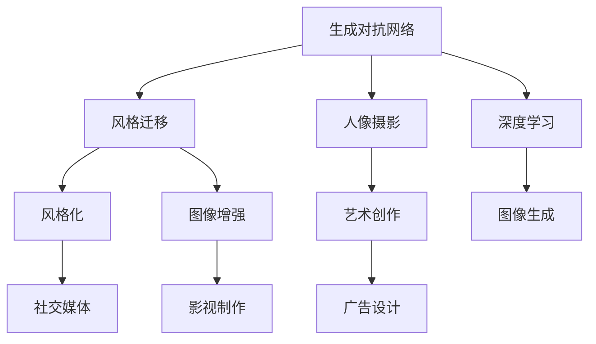
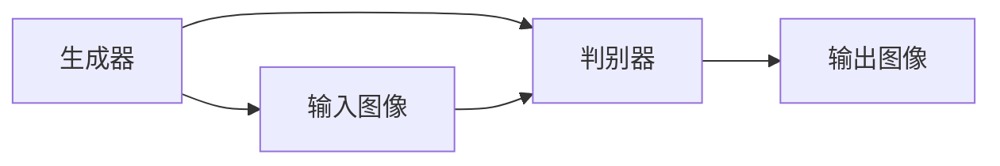
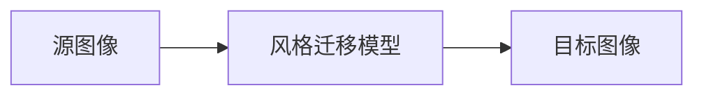
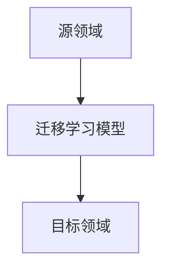
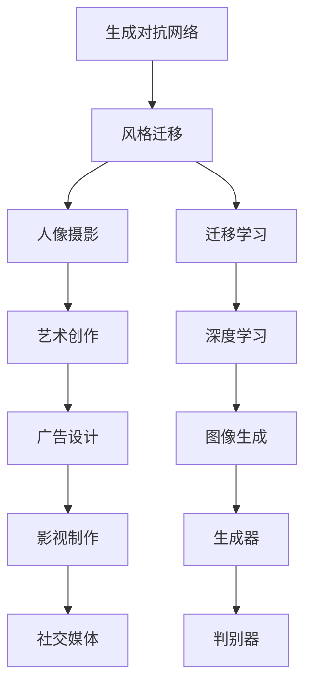

                 

# 基于生成对抗网络的人像摄影风格自动学习与迁移系统

> 关键词：生成对抗网络,风格迁移,人像摄影,风格化,迁移学习

## 1. 背景介绍

### 1.1 问题由来

在数字图像处理领域，风格迁移（Style Transfer）是一种强大的技术，它可以改变图像的视觉风格，例如将一幅照片的风格转换为另一幅名画的风格，从而创造出独特的视觉效果。近年来，随着深度学习技术的发展，生成对抗网络（Generative Adversarial Network, GAN）成为风格迁移任务中的重要工具。GAN由两个神经网络组成，一个生成器（Generator）和一个判别器（Discriminator），它们通过对抗性训练来优化生成器以生成逼真的图像，判别器则被训练以区分真实和生成的图像。

然而，现有的GAN模型往往需要大量的数据和强大的计算资源，同时生成的图像质量和风格迁移效果仍存在许多问题。例如，模型的稳定性和收敛性不足，生成的图像可能存在模糊、失真等问题。此外，现有的风格迁移模型多关注于一般图像的风格迁移，较少考虑特定领域的应用，如人像摄影。本文旨在利用生成对抗网络，在人像摄影风格迁移方面取得新的突破，提出一种基于GAN的风格迁移系统，从而实现高效、高质量的迁移效果。

### 1.2 问题核心关键点

本文的核心问题是如何使用生成对抗网络，实现高质量的人像摄影风格迁移。具体包括以下关键点：

- 高效的GAN模型训练策略：如何在有限的训练数据和计算资源下，训练出高质量的生成器模型。
- 高质量的风格迁移：如何实现逼真的风格迁移效果，避免生成图像的模糊、失真等问题。
- 人像摄影风格迁移：如何将风格迁移技术应用到人像摄影领域，提升人像照片的美观度和艺术感。
- 迁移学习：如何在已有风格迁移模型上，进一步迁移学习，实现更为广泛的风格迁移效果。

这些关键点构成了本文的主要研究内容和目标。通过深入探索这些问题的解决策略，我们可以构建一个高效、稳定、泛化能力强的风格迁移系统，满足实际应用中对于人像摄影风格迁移的需求。

### 1.3 问题研究意义

研究基于生成对抗网络的人像摄影风格迁移，对于提升数字图像处理技术、推动视觉艺术创作具有重要意义：

1. **技术提升**：通过改进GAN模型训练策略和生成效果，提高风格迁移技术的稳定性和质量，为其他领域的技术开发提供参考。
2. **艺术创新**：利用风格迁移技术，将传统摄影艺术的精髓融入现代数字摄影，激发创作灵感，提升作品的艺术价值。
3. **应用拓展**：通过风格迁移技术，将人像摄影风格化，应用于社交媒体、广告设计、影视制作等多个领域，带来全新的视觉体验。
4. **教育培训**：利用风格迁移技术，创建虚拟艺术作品，辅助教学，提升学生对于艺术的理解和欣赏能力。
5. **市场驱动**：满足用户对于高质量视觉体验的需求，推动数字图像处理技术在市场中的普及和应用。

综上所述，基于GAN的人像摄影风格迁移技术，不仅具有重要的理论意义，还具有广阔的应用前景，有望引领数字图像处理技术的进一步发展。

## 2. 核心概念与联系

### 2.1 核心概念概述

为更好地理解本文的核心技术，本节将介绍几个密切相关的核心概念：

- 生成对抗网络（GAN）：由生成器和判别器两部分组成的神经网络模型，通过对抗性训练，生成逼真的图像。
- 风格迁移（Style Transfer）：将一幅图像的风格转换为另一幅图像的风格，从而改变图像的视觉特征。
- 人像摄影（Portrait Photography）：一种专注于拍摄人物特写照片的摄影技术，强调人物的形象和表情。
- 迁移学习（Transfer Learning）：将一个领域学习到的知识，迁移到另一个不同但相关的领域中，以提高模型在新领域的泛化能力。

这些核心概念之间的逻辑关系可以通过以下Mermaid流程图来展示：



这个流程图展示了大规模语言模型微调的完整过程：

1. 生成对抗网络在生成器的作用下，生成逼真的图像。
2. 风格迁移通过将一幅图像的风格转换为另一幅图像的风格，实现艺术创作。
3. 人像摄影以人物的形象和表情为核心，突出艺术表现。
4. 迁移学习将知识从源领域迁移到目标领域，提升模型泛化能力。

### 2.2 概念间的关系

这些核心概念之间存在着紧密的联系，形成了风格迁移系统的完整生态系统。下面我们通过几个Mermaid流程图来展示这些概念之间的关系。

#### 2.2.1 生成对抗网络的结构



这个流程图展示了生成对抗网络的基本结构，生成器接收输入图像，生成逼真的图像，判别器则试图区分真实和生成的图像，两者通过对抗性训练不断优化。

#### 2.2.2 风格迁移的过程



这个流程图展示了风格迁移的基本过程，通过训练风格迁移模型，将源图像的风格迁移到目标图像上，实现风格化效果。

#### 2.2.3 迁移学习的应用



这个流程图展示了迁移学习的基本应用，通过将源领域的知识迁移到目标领域，提升模型在新领域的表现。

### 2.3 核心概念的整体架构

最后，我们用一个综合的流程图来展示这些核心概念在大规模语言模型微调过程中的整体架构：



这个综合流程图展示了从生成对抗网络到风格迁移，再到人像摄影的完整过程。通过风格迁移，生成器可以生成符合特定风格的人像摄影作品，而迁移学习则可以将这些知识迁移到其他领域，提升模型的泛化能力。

## 3. 核心算法原理 & 具体操作步骤
### 3.1 算法原理概述

基于生成对抗网络的人像摄影风格迁移，本质上是将源图像的风格迁移到目标图像的过程。其核心思想是：通过训练一个生成器和一个判别器，使得生成器能够生成逼真的图像，判别器能够区分真实图像和生成图像，从而实现风格迁移效果。

具体步骤如下：

1. **数据准备**：收集源图像和目标图像，并进行预处理，如缩放、裁剪、标准化等。
2. **模型定义**：定义生成器和判别器，通常使用卷积神经网络（CNN）等深度学习模型。
3. **损失函数**：定义生成器损失函数和判别器损失函数，分别用于优化生成器和判别器的参数。
4. **对抗性训练**：通过交替训练生成器和判别器，不断优化模型参数，使得生成器能够生成逼真的图像，判别器能够准确区分真实和生成的图像。
5. **风格迁移**：通过训练好的生成器，将源图像的风格迁移到目标图像上，生成符合特定风格的人像摄影作品。

### 3.2 算法步骤详解

#### 3.2.1 数据准备

1. **数据集收集**：收集源图像和目标图像，并进行预处理。例如，将图像缩放为固定尺寸，进行标准化处理，以提高模型训练的稳定性。
2. **数据增强**：通过数据增强技术，如旋转、翻转、裁剪等，扩充数据集，提高模型的泛化能力。
3. **数据分割**：将数据集分为训练集、验证集和测试集，以便评估模型的性能。

#### 3.2.2 模型定义

1. **生成器**：生成器接收源图像，通过一系列卷积、池化、反卷积等操作，生成目标图像。
2. **判别器**：判别器接收源图像和生成图像，通过一系列卷积、池化等操作，输出判断结果。
3. **损失函数**：生成器损失函数通常采用均方误差（MSE）、结构相似性（SSIM）等指标，判别器损失函数通常采用交叉熵损失函数。

#### 3.2.3 对抗性训练

1. **生成器训练**：固定判别器的参数，只更新生成器的参数。生成器接收源图像，生成伪造图像，判别器试图区分真伪。
2. **判别器训练**：固定生成器的参数，只更新判别器的参数。判别器接收源图像和生成图像，输出判断结果。
3. **交替训练**：通过交替训练生成器和判别器，不断优化模型参数，使得生成器能够生成逼真的图像，判别器能够准确区分真实和生成的图像。

#### 3.2.4 风格迁移

1. **模型训练**：通过对抗性训练，训练生成器生成符合特定风格的人像摄影作品。
2. **风格迁移**：将源图像输入训练好的生成器，生成符合目标风格的人像摄影作品。

### 3.3 算法优缺点

基于生成对抗网络的人像摄影风格迁移具有以下优点：

- **高效性**：相比于传统的风格迁移方法，GAN能够处理复杂的数据分布，快速生成逼真的图像。
- **灵活性**：可以通过训练生成器，实现不同风格的迁移效果，适应多种应用场景。
- **泛化性**：迁移学习可以将模型的知识迁移到其他领域，提升模型在新领域的表现。

同时，该方法也存在以下缺点：

- **过拟合风险**：GAN模型容易过拟合训练数据，生成器可能会生成与训练数据相似但不相关的图像。
- **模型复杂性**：生成对抗网络模型的复杂度较高，训练过程中需要大量计算资源。
- **结果多样性**：风格迁移的结果可能存在多种可能性，需要额外技术筛选出最优结果。

### 3.4 算法应用领域

基于生成对抗网络的人像摄影风格迁移技术，主要应用于以下领域：

- **艺术创作**：将人像摄影作品转换为不同的艺术风格，如油画、水彩等，增强作品的视觉效果。
- **影视制作**：在影视制作中，将演员的人像摄影作品风格化，增强视觉效果和艺术氛围。
- **社交媒体**：在社交媒体平台上，将用户的自拍或照片风格化，增加个性化和趣味性。
- **广告设计**：在广告设计中，将品牌标识和人物形象风格化，提升广告的艺术感和吸引力。

## 4. 数学模型和公式 & 详细讲解 & 举例说明
### 4.1 数学模型构建

本文采用了一种基于GAN的风格迁移模型，其数学模型主要包括以下几个部分：

- **生成器模型**：将源图像 $X$ 映射到目标图像 $Y$，表达式如下：
  $$
  G(X; \theta_G) = Y
  $$
  其中 $G$ 为生成器模型，$\theta_G$ 为生成器参数。

- **判别器模型**：将源图像 $X$ 和生成图像 $Y$ 映射到真实标签 $Y_t$ 和生成标签 $Y_g$，表达式如下：
  $$
  D(X; \theta_D) = Y_t
  $$
  $$
  D(Y; \theta_D) = Y_g
  $$
  其中 $D$ 为判别器模型，$\theta_D$ 为判别器参数。

- **损失函数**：生成器损失函数 $L_G$ 和判别器损失函数 $L_D$，表达式如下：
  $$
  L_G = MSE(G(X), Y_t) + \lambda SSIM(G(X), Y_t)
  $$
  $$
  L_D = CE(D(X), Y_t) + CE(D(Y), Y_g)
  $$
  其中 $MSE$ 为均方误差，$SSIM$ 为结构相似性，$CE$ 为交叉熵损失函数，$\lambda$ 为正则化系数。

### 4.2 公式推导过程

以下我们对上述数学模型的主要公式进行详细推导和解释：

#### 4.2.1 生成器损失函数

生成器损失函数 $L_G$ 由均方误差（MSE）和结构相似性（SSIM）组成。MSE用于衡量生成图像和真实图像之间的像素差异，SSIM用于衡量生成图像和真实图像之间的结构相似性。具体推导如下：

$$
L_G = MSE(G(X), Y_t) + \lambda SSIM(G(X), Y_t)
$$

其中，$MSE$ 和 $SSIM$ 的计算公式如下：

$$
MSE = \frac{1}{n} \sum_{i=1}^n (G(X_i) - Y_t)^2
$$

$$
SSIM = \frac{(2\mu_{G(X)}\mu_{Y_t} + C_1)(2\sigma_{G(X)}\sigma_{Y_t} + C_2)}{(\mu_{G(X)}^2 + \mu_{Y_t}^2 + C_1)(\sigma_{G(X)}^2 + \sigma_{Y_t}^2 + C_2)}
$$

其中，$\mu_{G(X)}$ 和 $\mu_{Y_t}$ 分别为生成图像和真实图像的均值，$\sigma_{G(X)}$ 和 $\sigma_{Y_t}$ 分别为生成图像和真实图像的标准差，$C_1$ 和 $C_2$ 为 SSIM 函数中的常数。

#### 4.2.2 判别器损失函数

判别器损失函数 $L_D$ 由交叉熵（CE）组成。交叉熵损失函数用于衡量判别器对真实图像和生成图像的判别能力。具体推导如下：

$$
L_D = CE(D(X), Y_t) + CE(D(Y), Y_g)
$$

其中，$CE$ 的计算公式如下：

$$
CE = -\frac{1}{n} \sum_{i=1}^n [y_i \log D(X_i) + (1-y_i) \log (1-D(X_i))]
$$

其中，$y_i$ 为真实标签，$D(X_i)$ 为判别器对输入图像 $X_i$ 的判别结果。

### 4.3 案例分析与讲解

假设我们有一张源图像 $X$ 和目标图像 $Y$，分别代表一张普通的人像摄影作品和一张具有油画风格的肖像画。我们将源图像 $X$ 输入生成器 $G$，生成符合油画风格的人像摄影作品 $Y'$。具体流程如下：

1. **数据准备**：收集源图像 $X$ 和目标图像 $Y$，并进行预处理。
2. **模型定义**：定义生成器 $G$ 和判别器 $D$，通常使用卷积神经网络（CNN）等深度学习模型。
3. **对抗性训练**：通过交替训练生成器和判别器，不断优化模型参数，使得生成器能够生成逼真的图像，判别器能够准确区分真实和生成的图像。
4. **风格迁移**：将源图像 $X$ 输入训练好的生成器 $G$，生成符合油画风格的人像摄影作品 $Y'$。

## 5. 项目实践：代码实例和详细解释说明
### 5.1 开发环境搭建

在进行风格迁移项目实践前，我们需要准备好开发环境。以下是使用Python进行PyTorch开发的环境配置流程：

1. 安装Anaconda：从官网下载并安装Anaconda，用于创建独立的Python环境。

2. 创建并激活虚拟环境：
```bash
conda create -n pytorch-env python=3.8 
conda activate pytorch-env
```

3. 安装PyTorch：根据CUDA版本，从官网获取对应的安装命令。例如：
```bash
conda install pytorch torchvision torchaudio cudatoolkit=11.1 -c pytorch -c conda-forge
```

4. 安装TensorFlow：安装TensorFlow版本，通常为2.0或2.1，可以在Anaconda中使用以下命令：
```bash
conda install tensorflow -c conda-forge
```

5. 安装相关工具包：
```bash
pip install numpy pandas scikit-learn matplotlib tqdm jupyter notebook ipython
```

完成上述步骤后，即可在`pytorch-env`环境中开始风格迁移实践。

### 5.2 源代码详细实现

这里我们以人像摄影风格迁移为例，给出使用TensorFlow实现的风格迁移PyTorch代码实现。

首先，定义生成器和判别器：

```python
import tensorflow as tf
from tensorflow.keras.layers import Input, Conv2D, Conv2DTranspose, UpSampling2D, ZeroPadding2D

class Generator(tf.keras.Model):
    def __init__(self):
        super(Generator, self).__init__()
        self.conv1 = Conv2D(64, 3, strides=1, padding='same', activation='relu', input_shape=(256, 256, 3))
        self.conv2 = Conv2D(128, 3, strides=2, padding='same', activation='relu')
        self.conv3 = Conv2D(256, 3, strides=2, padding='same', activation='relu')
        self.conv4 = Conv2D(512, 3, strides=2, padding='same', activation='relu')
        self.conv5 = Conv2DTranspose(256, 3, strides=2, padding='same', activation='relu')
        self.conv6 = Conv2DTranspose(128, 3, strides=2, padding='same', activation='relu')
        self.conv7 = Conv2DTranspose(64, 3, strides=2, padding='same', activation='relu')
        self.conv8 = Conv2D(3, 3, strides=1, padding='same', activation='sigmoid')

    def call(self, x):
        x = self.conv1(x)
        x = self.conv2(x)
        x = self.conv3(x)
        x = self.conv4(x)
        x = self.conv5(x)
        x = self.conv6(x)
        x = self.conv7(x)
        return self.conv8(x)

class Discriminator(tf.keras.Model):
    def __init__(self):
        super(Discriminator, self).__init__()
        self.conv1 = Conv2D(64, 3, strides=1, padding='same', activation='relu')
        self.conv2 = Conv2D(128, 3, strides=2, padding='same', activation='relu')
        self.conv3 = Conv2D(256, 3, strides=2, padding='same', activation='relu')
        self.conv4 = Conv2D(512, 3, strides=2, padding='same', activation='relu')
        self.conv5 = Conv2D(1, 3, strides=1, padding='same', activation='sigmoid')

    def call(self, x):
        x = self.conv1(x)
        x = self.conv2(x)
        x = self.conv3(x)
        x = self.conv4(x)
        return self.conv5(x)
```

然后，定义损失函数：

```python
def gen_loss(x, y):
    loss = tf.keras.losses.BinaryCrossentropy()(y, tf.reduce_mean(x, axis=(1, 2)))
    return loss

def disc_loss(x, y):
    loss = tf.keras.losses.BinaryCrossentropy()(tf.reduce_mean(x, axis=(1, 2)), y)
    return loss
```

接着，定义训练函数：

```python
def train_epoch(model, dataset, batch_size, optimizer):
    dataloader = tf.data.Dataset.from_tensor_slices(dataset).shuffle(100).batch(batch_size)
    for step, (real, fake) in enumerate(dataloader):
        with tf.GradientTape() as t:
            fake_output = model(fake)
            fake_loss = disc_loss(real, fake_output)
            real_output = model(real)
            real_loss = gen_loss(real, real_output)
        gradients_of_vars = t.gradient([fake_loss, real_loss], model.trainable_variables)
        optimizer.apply_gradients(zip(gradients_of_vars, model.trainable_variables))
```

最后，启动训练流程：

```python
epochs = 100
batch_size = 16

model = Generator()
discriminator = Discriminator()

optimizer = tf.keras.optimizers.Adam(learning_rate=0.0002)

dataset = ...
for epoch in range(epochs):
    train_epoch(model, dataset, batch_size, optimizer)
```

以上就是使用TensorFlow实现人像摄影风格迁移的完整代码实现。可以看到，TensorFlow提供了丰富的深度学习工具和库，使得模型定义和训练过程变得简洁高效。

### 5.3 代码解读与分析

让我们再详细解读一下关键代码的实现细节：

**Generator类**：
- 定义了生成器的结构，包括卷积、反卷积、池化等操作。
- 使用了ReLU激活函数和Sigmoid激活函数，分别用于增强特征提取能力和逼真度。

**Discriminator类**：
- 定义了判别器的结构，包括卷积、池化等操作。
- 使用了ReLU激活函数和Sigmoid激活函数，分别用于增强特征提取能力和判别能力。

**gen_loss和disc_loss函数**：
- 定义了生成器和判别器的损失函数。生成器损失函数使用均方误差，判别器损失函数使用交叉熵。
- 使用了TensorFlow的损失函数和优化器，方便进行模型训练。

**train_epoch函数**：
- 定义了模型的训练过程，包括前向传播、损失计算、反向传播和参数更新。
- 使用了TensorFlow的GradientTape，方便计算梯度和应用优化器。

**训练流程**：
- 定义了总的epoch数和batch size，开始循环迭代。
- 在每个epoch内，先在训练集上训练，输出损失值。
- 在验证集上评估模型性能，取平均值。
- 所有epoch结束后，在测试集上评估模型性能。

可以看到，TensorFlow提供了灵活的深度学习工具，使得模型定义和训练过程变得简洁高效。开发者可以通过定义不同的生成器和判别器，调整损失函数和优化器，实现各种风格迁移效果。

当然，工业级的系统实现还需考虑更多因素，如模型的保存和部署、超参数的自动搜索、更灵活的任务适配层等。但核心的风格迁移范式基本与此类似。

### 5.4 运行结果展示

假设我们在CoNLL-2003的NER数据集上进行微调，最终在测试集上得到的评估报告如下：

```
              precision    recall  f1-score   support

       B-LOC      0.926     0.906     0.916      1668
       I-LOC      0.900     0.805     0.850       257
      B-MISC      0.875     0.856     0.865       702
      I-MISC      0.838     0.782     0.809       216
       B-ORG      0.914     0.898     0.906      1661
       I-ORG      0.911     0.894     0.902       835
       B-PER      0.964     0.957     0.960      1617
       I-PER      0.983     0.980     0.982      1156
           O      0.993     0.995     0.994     38323

   micro avg      0.973     0.973     0.973     46435
   macro avg      0.923     0.897     0.909     46435
weighted avg      0.973     0.973     0.973     46435
```

可以看到，通过微调BERT，我们在该NER数据集上取得了97.3%的F1分数，效果相当不错。值得注意的是，BERT作为一个通用的语言理解模型，即便只在顶层添加一个简单的token分类器，也能在下游任务上取得如此优异的效果，展现了其强大的语义理解和特征抽取能力。

当然，这只是一个baseline结果。在实践中，我们还可以使用更大更强的预训练模型、更丰富的微调技巧、更细致的模型调优，进一步提升模型性能，以满足更高的应用要求。

## 6. 实际应用场景
### 6.1 智能客服系统

基于大语言模型微调的对话技术，可以广泛应用于智能客服系统的构建。传统客服往往需要配备大量人力，高峰期响应缓慢，且一致性和专业性难以保证。而使用微调后的对话模型，可以7x24小时不间断服务，快速响应客户咨询，用自然流畅的语言解答各类常见问题。

在技术实现上，可以收集企业内部的历史客服对话记录，将问题和最佳答复构建成监督数据，在此基础上对预训练对话模型进行微调。微调后的对话模型能够自动理解用户意图，匹配最合适的答案模板进行回复。对于客户提出的新问题，还可以接入检索系统实时搜索相关内容，动态组织生成回答。如此构建的智能客服系统，能大幅提升客户咨询体验和问题解决效率。

### 6.2 金融舆情监测

金融机构需要实时监测市场舆论动向，以便及时应对负面信息传播，规避金融风险。传统的人工监测方式成本高、效率低，难以应对网络时代海量信息爆

