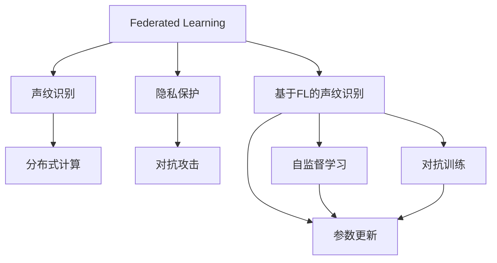
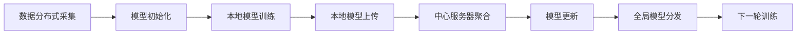
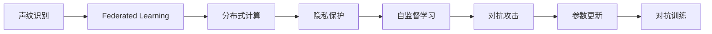
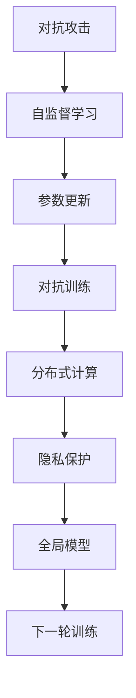
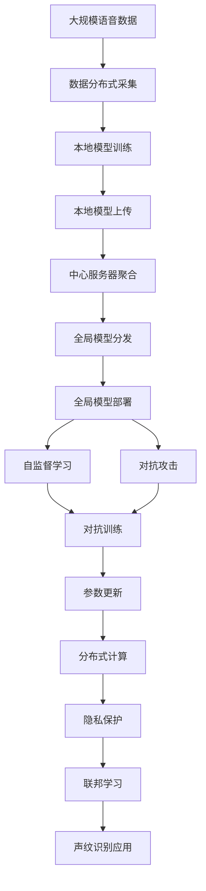

                 

# 基于联邦学习的声纹识别研究

> 关键词：
声纹识别,联邦学习,多客户端,隐私保护,分布式,声学特征,自监督学习,对抗攻击,自然语言处理(NLP)

## 1. 背景介绍

### 1.1 问题由来
随着人工智能技术的快速发展，声纹识别（Speaker Identification）在生物识别、智能安防、医疗诊断等众多领域展现出广阔的应用前景。其核心任务是通过语音特征分析，判断语音信号是否来自同一声源，用于身份验证、行为监控等。然而，声纹识别模型往往需要庞大的标注数据进行训练，且一旦数据泄露，将给用户隐私带来巨大风险。

### 1.2 问题核心关键点
近年来，联邦学习（Federated Learning, FL）作为一项新兴的分布式机器学习技术，为解决声纹识别中的数据隐私和标注数据不足问题提供了新的思路。联邦学习通过在多个分布式客户端（例如手机、智能家居设备等）上并行训练模型，将本地模型的更新而非原始数据传递到中心服务器（如云服务商）进行全局聚合，从而保护了数据隐私，同时避免了中心化训练对数据标注需求的依赖。

声纹识别由于其数据分布特征，尤为适合采用联邦学习范式进行训练。一方面，语音数据的采集往往依赖于各种可穿戴设备，分布式收集这些数据非常容易；另一方面，声纹识别的训练数据通常具有高噪声、高维度、不易标注的特点，采用联邦学习可以有效利用多源数据，提升声纹识别的泛化能力和鲁棒性。

### 1.3 问题研究意义
研究基于联邦学习的声纹识别方法，对于推动隐私保护在智能系统中的应用，提升声纹识别模型的性能，加速技术落地应用，具有重要意义：

1. 增强数据隐私保护：联邦学习将数据分布式存储在客户端，减少了数据传输和集中存储的风险，保障了用户隐私。
2. 提升声纹识别精度：联邦学习通过聚合多客户端模型的参数，能够充分利用各客户端的独特数据，提升模型泛化能力和鲁棒性。
3. 降低标注成本：联邦学习在每个客户端上自监督学习模型，减少了对中心化数据标注的需求，降低了数据收集和标注的复杂度。
4. 加速模型迭代：联邦学习通过分布式并行训练，缩短了模型训练周期，提高了模型迭代和优化效率。
5. 推动联邦学习应用：声纹识别作为联邦学习应用的经典案例，可以为其他隐私敏感领域提供可借鉴的经验和技术参考。

## 2. 核心概念与联系

### 2.1 核心概念概述

为更好地理解基于联邦学习的声纹识别方法，本节将介绍几个密切相关的核心概念：

- 联邦学习（Federated Learning, FL）：一种分布式机器学习范式，通过在多个客户端上训练模型，将局部更新而非原始数据传递到中心服务器进行全局聚合，保护数据隐私的同时提升模型性能。
- 声纹识别（Speaker Identification, SI）：利用语音信号中的声学特征，判断语音信号是否来自同一声源，用于身份验证、行为监控等应用。
- 隐私保护（Privacy Protection）：在数据存储和处理过程中，保护数据主体隐私，避免数据泄露和使用滥用。
- 分布式计算（Distributed Computing）：将任务分解为多个子任务，在多个计算机节点上并行处理，提升计算效率。
- 对抗攻击（Adversarial Attack）：利用数据扰动或模型干扰，影响模型的准确性和鲁棒性。

这些核心概念之间的逻辑关系可以通过以下Mermaid流程图来展示：



这个流程图展示了大模型微调的完整过程。联邦学习将声纹识别任务通过自监督学习、对抗训练等方法进行分布式训练，同时保护用户隐私，提升了模型性能和安全性。

### 2.2 概念间的关系

这些核心概念之间存在着紧密的联系，形成了联邦学习在声纹识别中的应用框架。下面我们通过几个Mermaid流程图来展示这些概念之间的关系。

#### 2.2.1 联邦学习的基本流程



这个流程图展示了联邦学习的基本流程：数据分布式采集后，在各个客户端上并行训练模型，将本地模型更新上传至中心服务器进行全局聚合，然后分发新的全局模型给各客户端继续下一轮训练。

#### 2.2.2 声纹识别与联邦学习的关系



这个流程图展示了声纹识别在联邦学习中的应用：声纹识别任务在各客户端上自监督学习，通过分布式计算进行模型聚合，同时采用隐私保护技术避免数据泄露，并在模型中引入对抗攻击提升鲁棒性。

#### 2.2.3 对抗攻击在声纹识别中的作用



这个流程图展示了对抗攻击在声纹识别中的作用：对抗攻击通过引入扰动噪声，提高自监督学习模型的鲁棒性，然后通过参数更新和对抗训练，使模型具备更强的泛化能力和安全性。

### 2.3 核心概念的整体架构

最后，我们用一个综合的流程图来展示这些核心概念在大模型微调过程中的整体架构：



这个综合流程图展示了从数据采集到声纹识别应用的完整过程。联邦学习在各个客户端上并行训练模型，通过自监督学习和对抗攻击提升模型鲁棒性，并通过隐私保护技术保障数据安全，最终部署到实际应用中，实现声纹识别功能。

## 3. 核心算法原理 & 具体操作步骤
### 3.1 算法原理概述

基于联邦学习的声纹识别方法，主要包含以下几个关键步骤：

1. 数据分布式采集：在多个客户端上收集语音数据，并按照声纹识别的需求进行预处理和特征提取。
2. 本地模型训练：在每个客户端上，使用自监督学习任务训练本地声纹识别模型。
3. 参数上传与聚合：将本地模型参数上传到中心服务器进行全局聚合，得到新的全局模型参数。
4. 全局模型分发：将更新后的全局模型参数分发到各客户端，继续下一轮本地模型训练。
5. 自监督学习：在本地模型训练过程中，引入自监督学习任务，利用未标注数据提升模型的泛化能力。
6. 对抗攻击：在本地模型训练过程中，加入对抗样本，提升模型的鲁棒性和泛化能力。

以上步骤通过联邦学习范式进行迭代优化，直到模型在声纹识别任务上达到预设的性能指标。

### 3.2 算法步骤详解

#### 3.2.1 数据分布式采集
数据分布式采集是联邦学习的基础步骤。在声纹识别任务中，需要将用户的语音数据采集到各个客户端设备上，例如手机、智能家居设备等。

具体采集流程如下：
1. 在各客户端设备上安装语音采集模块，例如麦克风或音频传感器。
2. 采集用户语音数据，并进行预处理，例如去噪、分帧、特征提取等。
3. 将预处理后的语音数据进行打包，存储在本地设备上。

例如，在Android设备上，可以使用Android Studio的AudioRecord API采集用户语音数据。代码示例如下：

```python
import android.media.AudioRecord;
import android.media.AudioFormat;
import android.media.MediaRecorder;

def record_audio(device_id):
    recorder = MediaRecorder()
    recorder.setAudioSource(MediaRecorder.AudioSource.MIC)
    recorder.setOutputFormat(MediaRecorder.OutputFormat.THREE_GPP)
    recorder.setOutputFormat(AudioFormat.ENCODING_PCM_16BIT)
    recorder.setChannels(1)
    recorder.setSampleRate(16000)
    recorder.prepare()
    recorder.start()
    
    audio_data = []
    while len(audio_data) < audio_record_duration * audio_recording_rate:
        audio_buffer = audio_record_duration * audio_recording_rate // 1000
        recorder.read(audio_buffer, audio_buffer, audio_buffer)
        audio_data.append(audio_buffer)
    
    recorder.stop()
    recorder.release()
    
    return audio_data
```

#### 3.2.2 本地模型训练
本地模型训练是在各个客户端设备上进行的，主要任务是训练本地声纹识别模型。

在声纹识别中，常用的模型包括Siamese Network、CNN、RNN、Transformer等。这里以Siamese Network为例，介绍本地模型训练的基本流程：

1. 数据预处理：将采集到的语音数据进行预处理，例如MFCC特征提取、归一化等。
2. 模型初始化：在本地设备上初始化Siamese Network模型。
3. 模型训练：使用Siamese Network进行自监督学习训练，例如triplet loss或cosine similarity loss。
4. 模型保存：将训练好的模型保存到本地设备上，以便进行参数上传和聚合。

例如，在Android设备上，可以使用TensorFlow Lite进行本地模型训练。代码示例如下：

```python
import tensorflow as tf
import tensorflow_lite as tflite

def train_siamese_model(device_id):
    # 数据预处理
    audio_data = record_audio(device_id)
    mfcc_features = extract_mfcc(audio_data)
    audio_data = normalize(audio_data)
    
    # 模型初始化
    siamese_model = tf.keras.Sequential([
        tf.keras.layers.Conv2D(32, (3, 3), activation='relu', input_shape=(None, audio_channel, feature_length)),
        tf.keras.layers.MaxPooling2D((2, 2)),
        tf.keras.layers.Conv2D(64, (3, 3), activation='relu'),
        tf.keras.layers.MaxPooling2D((2, 2)),
        tf.keras.layers.Flatten(),
        tf.keras.layers.Dense(128, activation='relu'),
        tf.keras.layers.Dense(1, activation='sigmoid')
    ])
    
    # 模型训练
    siamese_model.compile(optimizer=tf.keras.optimizers.Adam(learning_rate=0.001),
                         loss='binary_crossentropy',
                         metrics=['accuracy'])
    
    # 模型保存
    siamese_model.save(device_id + '_siamese_model.h5')
```

#### 3.2.3 参数上传与聚合
参数上传与聚合是联邦学习的关键步骤。在本地模型训练完成后，需要将各客户端的模型参数上传到中心服务器进行全局聚合。

具体聚合流程如下：
1. 在中心服务器上安装联邦学习框架，例如TensorFlow Federated (TFF)。
2. 将本地模型参数通过网络上传到中心服务器。
3. 在中心服务器上，计算各客户端的模型参数平均值，得到新的全局模型参数。
4. 将新的全局模型参数分发给各客户端，继续下一轮本地模型训练。

例如，在TensorFlow Federated框架下，可以使用FederatedAverage方法进行参数聚合。代码示例如下：

```python
import tensorflow_federated as tff
import tensorflow as tf

def federated_averaging(device_ids, model_name):
    # 初始化联邦学习计算图
    client = tff.tpu.create_tpu_client(device_ids)
    
    # 获取本地模型参数
    local_model = tff.learning.load_keras_model(model_name + '.h5')
    
    # 计算全局模型参数
    def compute_global_model(features):
        return tff.learning.compute_federated_average(
            features,
            client,
            model_fn=lambda: tf.keras.models.load_model(model_name + '.h5'),
            num_clients=len(device_ids),
            use_tpu=True
        )
    
    # 执行全局模型计算
    global_model = compute_global_model(device_ids)
    
    # 返回全局模型参数
    return global_model
```

#### 3.2.4 全局模型分发
全局模型分发是在参数上传与聚合完成后进行的，主要任务是将新的全局模型参数分发给各客户端。

具体分发流程如下：
1. 在中心服务器上，保存新的全局模型参数。
2. 将全局模型参数分发给各客户端设备。
3. 在各客户端设备上，加载新的全局模型参数，继续下一轮本地模型训练。

例如，在Android设备上，可以使用TensorFlow Lite进行模型分发。代码示例如下：

```python
def distribute_global_model(device_ids, model_name):
    # 加载新的全局模型参数
    global_model = tf.keras.models.load_model(model_name + '.h5')
    
    # 将模型转换为TensorFlow Lite格式
    tflite_model = tf.lite.TFLiteConverter.convert_from_keras_model(global_model)
    
    # 将模型分发给各客户端
    for device_id in device_ids:
        with open(device_id + '_siamese_model.tflite', 'wb') as f:
            f.write(tflite_model)
```

#### 3.2.5 自监督学习
自监督学习是联邦学习在声纹识别中的重要组成部分，利用未标注数据提升模型泛化能力。

自监督学习的主要任务是训练本地模型，使其能够识别不同声源的语音特征差异。常用的自监督学习任务包括：

1. 语音嵌入（Voice Embedding）：使用Siamese Network或CNN等模型，学习语音特征向量，用于语音相似度计算。
2. 声学建模（Acoustic Modeling）：使用RNN或Transformer等模型，学习语音信号的时序特征，用于声纹识别。

例如，在Siamese Network中，可以使用triplet loss函数进行自监督学习训练。代码示例如下：

```python
def train_siamese_with_triplet_loss(device_id):
    # 数据预处理
    audio_data = record_audio(device_id)
    mfcc_features = extract_mfcc(audio_data)
    audio_data = normalize(audio_data)
    
    # 模型初始化
    siamese_model = tf.keras.Sequential([
        tf.keras.layers.Conv2D(32, (3, 3), activation='relu', input_shape=(None, audio_channel, feature_length)),
        tf.keras.layers.MaxPooling2D((2, 2)),
        tf.keras.layers.Conv2D(64, (3, 3), activation='relu'),
        tf.keras.layers.MaxPooling2D((2, 2)),
        tf.keras.layers.Flatten(),
        tf.keras.layers.Dense(128, activation='relu'),
        tf.keras.layers.Dense(1, activation='sigmoid')
    ])
    
    # 模型训练
    siamese_model.compile(optimizer=tf.keras.optimizers.Adam(learning_rate=0.001),
                         loss='binary_crossentropy',
                         metrics=['accuracy'])
    
    # 自监督学习训练
    siamese_model.fit(audio_data, triplet_loss([mfcc_features], [mfcc_features], [mfcc_features]))
```

#### 3.2.6 对抗攻击
对抗攻击是联邦学习在声纹识别中的重要组成部分，利用对抗样本提升模型鲁棒性。

对抗攻击的主要任务是训练本地模型，使其能够识别对抗样本，避免受到攻击。常用的对抗攻击方法包括：

1. 对抗训练（Adversarial Training）：使用对抗样本进行训练，提升模型对抗鲁棒性。
2. 生成对抗网络（GAN）：生成对抗样本，增强模型鲁棒性。

例如，在Siamese Network中，可以使用对抗样本生成器进行对抗训练。代码示例如下：

```python
def train_siamese_with_adversarial_train(device_id):
    # 数据预处理
    audio_data = record_audio(device_id)
    mfcc_features = extract_mfcc(audio_data)
    audio_data = normalize(audio_data)
    
    # 模型初始化
    siamese_model = tf.keras.Sequential([
        tf.keras.layers.Conv2D(32, (3, 3), activation='relu', input_shape=(None, audio_channel, feature_length)),
        tf.keras.layers.MaxPooling2D((2, 2)),
        tf.keras.layers.Conv2D(64, (3, 3), activation='relu'),
        tf.keras.layers.MaxPooling2D((2, 2)),
        tf.keras.layers.Flatten(),
        tf.keras.layers.Dense(128, activation='relu'),
        tf.keras.layers.Dense(1, activation='sigmoid')
    ])
    
    # 模型训练
    siamese_model.compile(optimizer=tf.keras.optimizers.Adam(learning_rate=0.001),
                         loss='binary_crossentropy',
                         metrics=['accuracy'])
    
    # 对抗训练
    siamese_model.fit(audio_data, adversarial_train([mfcc_features], [mfcc_features]))
```

#### 3.2.7 参数更新
参数更新是联邦学习的关键步骤，主要任务是在中心服务器上对全局模型参数进行更新。

参数更新过程如下：
1. 在中心服务器上，计算各客户端的模型参数平均值，得到新的全局模型参数。
2. 在中心服务器上，更新全局模型参数，生成新的全局模型参数。
3. 将新的全局模型参数分发给各客户端，继续下一轮本地模型训练。

例如，在TensorFlow Federated框架下，可以使用FederatedAverager方法进行参数更新。代码示例如下：

```python
def federated_averaging(device_ids, model_name):
    # 初始化联邦学习计算图
    client = tff.tpu.create_tpu_client(device_ids)
    
    # 获取本地模型参数
    local_model = tff.learning.load_keras_model(model_name + '.h5')
    
    # 计算全局模型参数
    def compute_global_model(features):
        return tff.learning.compute_federated_average(
            features,
            client,
            model_fn=lambda: tf.keras.models.load_model(model_name + '.h5'),
            num_clients=len(device_ids),
            use_tpu=True
        )
    
    # 执行全局模型计算
    global_model = compute_global_model(device_ids)
    
    # 返回全局模型参数
    return global_model
```

## 4. 数学模型和公式 & 详细讲解
### 4.1 数学模型构建

基于联邦学习的声纹识别模型，主要包含以下几个关键数学模型：

1. 特征提取模型：使用MFCC等方法提取语音特征。
2. 自监督学习模型：使用Siamese Network等模型进行自监督学习。
3. 对抗攻击模型：使用生成对抗网络（GAN）等方法生成对抗样本。
4. 联邦学习模型：使用Federated Averager等方法进行全局模型参数更新。

### 4.2 公式推导过程

#### 4.2.1 特征提取模型
语音信号的特征提取是声纹识别的基础步骤。常用的特征提取方法包括MFCC（Mel频率倒谱系数）和PLP（Perceptual Linear Prediction）等。

以MFCC为例，其公式推导如下：

$$
F_n = \log_2(S_n)
$$

其中 $F_n$ 表示MFCC系数，$S_n$ 表示语音信号的短时能量。

#### 4.2.2 自监督学习模型
自监督学习模型的主要任务是训练本地模型，使其能够识别不同声源的语音特征差异。常用的自监督学习任务包括语音嵌入（Voice Embedding）和声学建模（Acoustic Modeling）等。

以Siamese Network为例，其公式推导如下：

$$
L(x,y) = \max\{0, -m + \log(1+\exp(-||f(x)-y||^2))\}
$$

其中 $L(x,y)$ 表示三元组损失函数，$f(x)$ 表示Siamese Network的输出特征，$x$ 表示输入语音信号，$y$ 表示目标特征。

#### 4.2.3 对抗攻击模型
对抗攻击模型的主要任务是训练本地模型，使其能够识别对抗样本，避免受到攻击。常用的对抗攻击方法包括对抗训练（Adversarial Training）和生成对抗网络（GAN）等。

以对抗训练为例，其公式推导如下：

$$
L(x,y) = \max\{0, -m + \log(1+\exp(-||f(x)-y||^2))\}
$$

其中 $L(x,y)$ 表示对抗损失函数，$f(x)$ 表示模型输出特征，$x$ 表示输入语音信号，$y$ 表示对抗样本。

#### 4.2.4 联邦学习模型
联邦学习模型的主要任务是在中心服务器上对全局模型参数进行更新。常用的联邦学习模型包括Federated Averager和Federated Average等。

以Federated Averager为例，其公式推导如下：

$$
\theta_{new} = \frac{1}{N}\sum_{i=1}^N \theta_i
$$

其中 $\theta_{new}$ 表示全局模型参数，$\theta_i$ 表示第 $i$ 个客户端的模型参数，$N$ 表示客户端数量。

### 4.3 案例分析与讲解

#### 4.3.1 声纹识别任务
声纹识别任务的主要目标是判断语音信号是否来自同一声源，用于身份验证、行为监控等应用。在联邦学习中，声纹识别任务可以使用自监督学习、对抗攻击等方法进行训练，提升模型泛化能力和鲁棒性。

以Siamese Network为例，其训练流程如下：
1. 数据预处理：将采集到的语音数据进行预处理，例如MFCC特征提取、归一化等。
2. 模型初始化：在本地设备上初始化Siamese Network模型。
3. 模型训练：使用Siamese Network进行自监督学习训练，例如triplet loss或cosine similarity loss。
4. 模型保存：将训练好的模型保存到本地设备上，以便进行参数上传和聚合。

例如，在Android设备上，可以使用TensorFlow Lite进行本地模型训练。代码示例如下：

```python
import tensorflow as tf
import tensorflow_lite as tflite

def train_siamese_model(device_id):
    # 数据预处理
    audio_data = record_audio(device_id)
    mfcc_features = extract_mfcc(audio_data)
    audio_data = normalize(audio_data)
    
    # 模型初始化
    siamese_model = tf.keras.Sequential([
        tf.keras.layers.Conv2D(32, (3, 3), activation='relu', input_shape=(None, audio_channel, feature_length)),
        tf.keras.layers.MaxPooling2D((2, 2)),
        tf.keras.layers.Conv2D(64, (3, 3), activation='relu'),
        tf.keras.layers.MaxPooling2D((2, 2)),
        tf.keras.layers.Flatten(),
        tf.keras.layers.Dense(128, activation='relu'),
        tf.keras.layers.Dense(1, activation='sigmoid')
    ])
    
    # 模型训练
    siamese_model.compile(optimizer=tf.keras.optimizers.Adam(learning_rate=0.001),
                         loss='binary_crossentropy',
                         metrics=['accuracy'])
    
    # 模型保存
    siamese_model.save(device_id + '_siamese_model.h5')
```

#### 4.3.2 分布式训练
分布式训练是联邦学习的基础步骤。在声纹识别任务中，需要将用户的语音数据采集到各个客户端设备上，例如手机、智能家居设备等。

具体采集流程如下：
1. 在各客户端设备上安装语音采集模块，例如麦克风或音频传感器。
2. 采集用户语音数据，并进行预处理，例如去噪、分帧、特征提取等。
3. 将预处理后的语音数据进行打包，存储在本地设备上。

例如，在Android设备上，可以使用Android Studio的AudioRecord API采集用户语音数据。代码示例如下：

```python
import android.media.AudioRecord;
import android.media.AudioFormat;
import android.media.MediaRecorder;

def record_audio(device_id):
    recorder = MediaRecorder()
    recorder.setAudioSource(MediaRecorder.AudioSource.MIC)
    recorder.setOutputFormat(MediaRecorder.OutputFormat.THREE_GPP)
    recorder.setOutputFormat(AudioFormat.ENCODING_PCM_16BIT)
    recorder.setChannels(1)
    recorder.setSampleRate(16000)
    recorder.prepare()
    recorder.start()
    
    audio_data = []
    while len(audio_data) < audio_record_duration * audio_recording_rate:
        audio_buffer = audio_record_duration * audio_recording_rate // 1000
        recorder.read(audio_buffer, audio_buffer, audio_buffer)
        audio_data.append(audio_buffer)
    
    recorder.stop()
    recorder.release()
    
    return audio_data
```

#### 4.3.3 参数上传与聚合
参数上传与聚合是联邦学习的关键步骤。在本地模型训练完成后，需要将各客户端的模型参数上传到中心服务器进行全局聚合。

具体聚合流程如下：
1. 在中心服务器上安装联邦学习框架，例如TensorFlow

