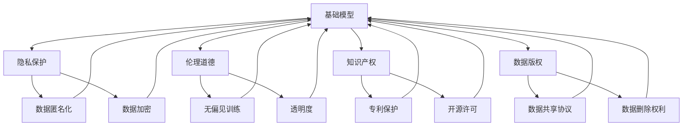
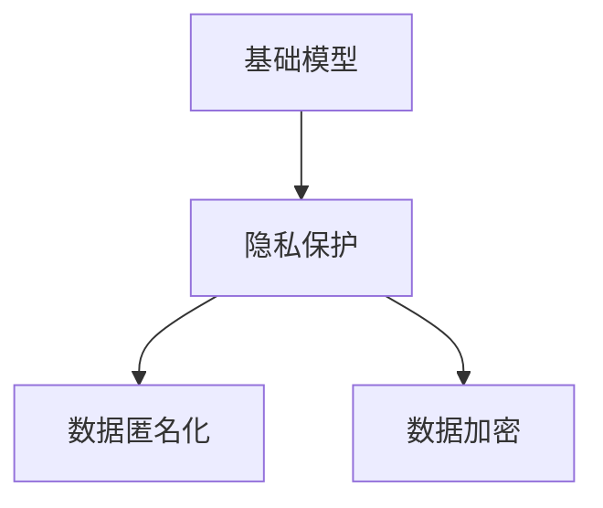
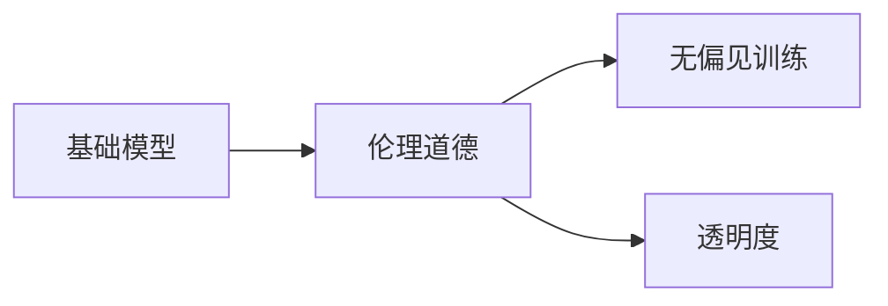
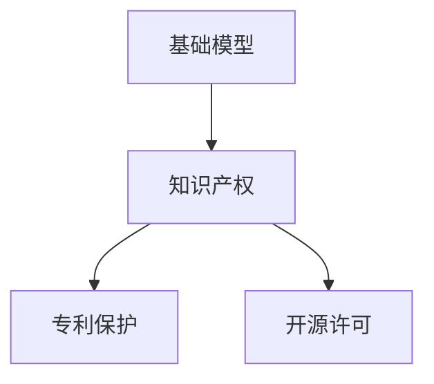
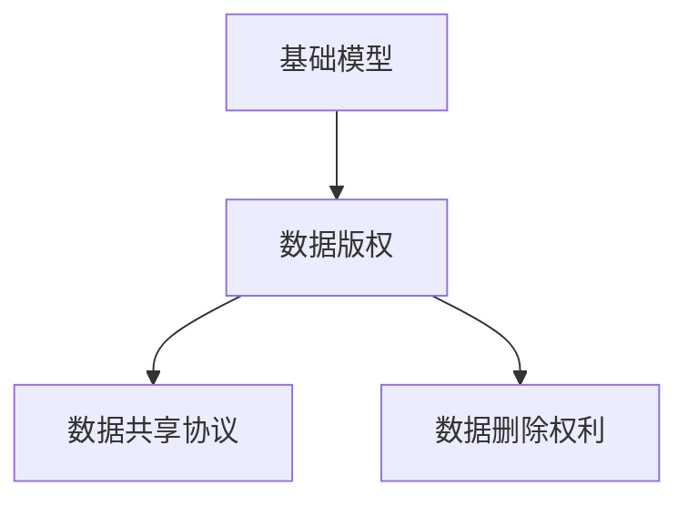
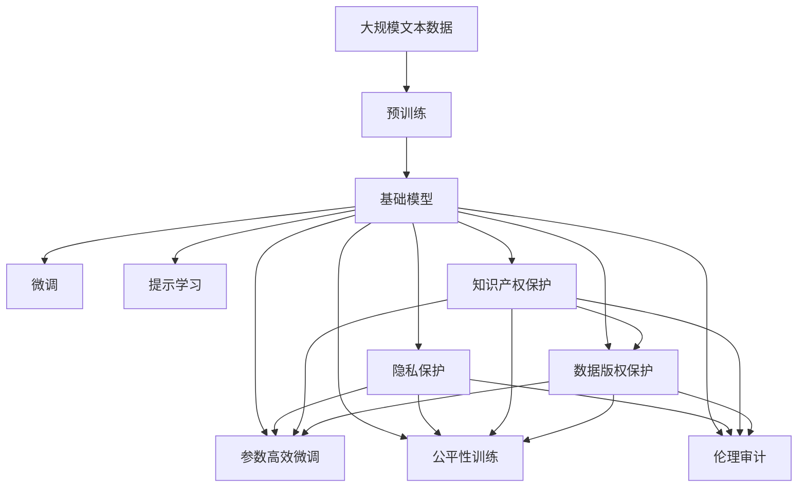

                 

# 基础模型的公开发布与限制

> 关键词：基础模型，公开发布，限制，隐私保护，伦理道德，知识产权，数据版权

## 1. 背景介绍

### 1.1 问题由来

随着人工智能技术的发展，基础模型（如BERT、GPT等）的公开发布已经成为推动AI研究与应用的必要条件。这些模型作为通用人工智能的基础，通过大规模语料预训练，具备强大的语言理解和生成能力，广泛应用于自然语言处理（NLP）、计算机视觉（CV）、语音识别（ASR）等多个领域。然而，基础模型的公开发布也带来了诸多问题，如隐私保护、伦理道德、知识产权、数据版权等方面的争议。

### 1.2 问题核心关键点

基础模型公开发布的核心问题主要包括：

1. **隐私保护**：基础模型依赖于大规模的语料数据进行预训练，如何在保护用户隐私的前提下公开发布这些模型，是一个重要的挑战。
2. **伦理道德**：基础模型的应用可能涉及伦理道德问题，如偏见、歧视等，如何在公开发布时确保其行为符合伦理标准，是一个重要的考量。
3. **知识产权**：基础模型的开发涉及大量的智力劳动，如何合理分配知识产权，保护开发者权益，是一个重要的法律问题。
4. **数据版权**：基础模型的训练依赖于大规模数据，如何处理数据版权，确保数据的合理使用，是一个重要的法律和伦理问题。

这些关键问题直接影响到基础模型的公开发布和使用效果。正确处理这些问题，不仅有助于推动AI技术的健康发展，还能促进AI技术的广泛应用，提升社会福祉。

### 1.3 问题研究意义

基础模型的公开发布和限制研究，对于推动AI技术的普及和应用具有重要意义：

1. **推动技术发展**：基础模型的公开发布，可以提供开放的平台，吸引更多的研究者参与到AI技术的研发中，推动技术创新和突破。
2. **促进应用落地**：基础模型的公开发布，可以帮助开发者快速搭建和部署AI应用，加速AI技术的商业化进程。
3. **保障隐私安全**：基础模型的公开发布，需要在保障用户隐私的前提下进行，确保数据安全，保护用户权益。
4. **维护伦理道德**：基础模型的应用，需要符合伦理道德标准，确保其不会带来社会问题。
5. **保护知识产权**：基础模型的公开发布，需要保护开发者的知识产权，确保其得到合理的回报。

## 2. 核心概念与联系

### 2.1 核心概念概述

为了更好地理解基础模型的公开发布与限制，本节将介绍几个密切相关的核心概念：

- **基础模型**：如BERT、GPT等，通过大规模语料预训练得到的通用人工智能模型，具备强大的语言理解和生成能力。
- **隐私保护**：保护用户数据隐私，防止数据被滥用。
- **伦理道德**：在基础模型应用过程中，遵循社会道德规范和伦理准则。
- **知识产权**：开发者对其智力劳动的产权保护，包括版权、专利等。
- **数据版权**：数据所有者对其数据的权益保护，包括使用权、修改权等。

这些核心概念之间的逻辑关系可以通过以下Mermaid流程图来展示：



这个流程图展示了大模型公开发布过程中涉及的关键概念及其之间的关系：

1. 基础模型依赖于大规模数据进行预训练，需要在隐私保护、伦理道德、知识产权、数据版权等方面进行处理。
2. 数据匿名化和数据加密是保护用户隐私的重要手段。
3. 无偏见训练和透明度是确保伦理道德的关键措施。
4. 专利保护、开源许可、数据共享协议和数据删除权利，是保护知识产权和数据版权的重要手段。

这些核心概念共同构成了基础模型公开发布与限制的完整生态系统，使其能够在各种场景下进行合理处理。通过理解这些核心概念，我们可以更好地把握基础模型公开发布过程中涉及的多个关键问题。

### 2.2 概念间的关系

这些核心概念之间存在着紧密的联系，形成了基础模型公开发布与限制的完整生态系统。下面我通过几个Mermaid流程图来展示这些概念之间的关系。

#### 2.2.1 基础模型与数据隐私



这个流程图展示了基础模型公开发布过程中如何保护数据隐私：

1. 基础模型依赖于大规模数据进行预训练。
2. 隐私保护是基础模型公开发布的关键需求。
3. 数据匿名化和数据加密是常用的隐私保护手段。

#### 2.2.2 基础模型与伦理道德



这个流程图展示了基础模型在公开发布过程中如何确保伦理道德：

1. 基础模型可能涉及伦理道德问题。
2. 无偏见训练和透明度是确保伦理道德的关键措施。
3. 通过无偏见训练，确保模型不会引入偏见和歧视。
4. 通过透明度，确保模型的训练和应用过程公开透明，便于监督。

#### 2.2.3 基础模型与知识产权



这个流程图展示了基础模型在公开发布过程中如何保护知识产权：

1. 基础模型的开发涉及大量的智力劳动。
2. 知识产权保护是基础模型公开发布的重要内容。
3. 专利保护和开源许可是常用的知识产权保护手段。

#### 2.2.4 基础模型与数据版权



这个流程图展示了基础模型在公开发布过程中如何处理数据版权：

1. 基础模型的训练依赖于大规模数据。
2. 数据版权保护是基础模型公开发布的重要内容。
3. 数据共享协议和数据删除权利是常用的数据版权保护手段。

### 2.3 核心概念的整体架构

最后，我们用一个综合的流程图来展示这些核心概念在大模型公开发布过程中的整体架构：



这个综合流程图展示了从预训练到大模型公开发布的完整过程。基础模型首先在大规模文本数据上进行预训练，然后通过微调、参数高效微调、提示学习等方法进行优化。同时，在公开发布前，需要进行公平性训练、伦理审计、隐私保护、知识产权保护和数据版权保护等多方面的处理。这些处理措施共同构成了大模型公开发布的完整生态系统，使其能够在各种场景下进行合理处理。

## 3. 核心算法原理 & 具体操作步骤
### 3.1 算法原理概述

基础模型公开发布的核心算法原理涉及隐私保护、伦理道德、知识产权、数据版权等方面的技术。以下将详细介绍这些核心算法的原理。

### 3.2 算法步骤详解

#### 3.2.1 隐私保护

隐私保护是基础模型公开发布的核心问题之一。常用的隐私保护手段包括：

1. **数据匿名化**：对用户数据进行脱敏处理，去除个人身份信息，保护用户隐私。
2. **数据加密**：对数据进行加密处理，确保数据在传输和存储过程中不被窃取。
3. **差分隐私**：在数据处理过程中引入随机噪声，确保单个数据记录无法识别个人身份。

#### 3.2.2 伦理道德

伦理道德是基础模型应用过程中必须考虑的重要问题。常用的伦理道德保护手段包括：

1. **无偏见训练**：在训练过程中，引入公平性约束，确保模型不会引入偏见和歧视。
2. **透明度**：公开模型的训练和应用过程，便于社会监督和反馈。
3. **伦理审计**：定期对模型进行伦理审计，确保其行为符合社会道德规范和伦理准则。

#### 3.2.3 知识产权

知识产权保护是基础模型公开发布的重要内容。常用的知识产权保护手段包括：

1. **专利保护**：对基础模型进行专利申请，保护其技术创新。
2. **开源许可**：采用开源许可证，允许用户自由使用和修改基础模型，促进技术普及。
3. **版权保护**：对模型开发过程中的文档、代码等进行版权登记，保护开发者的智力劳动成果。

#### 3.2.4 数据版权

数据版权保护是基础模型公开发布的重要内容。常用的数据版权保护手段包括：

1. **数据共享协议**：制定数据共享协议，规范数据的使用和分发。
2. **数据删除权利**：在数据使用过程中，确保数据所有者具有数据删除权，保护其权益。
3. **数据使用许可**：对数据的使用进行许可，确保数据使用符合规定。

### 3.3 算法优缺点

基础模型公开发布和限制的算法具有以下优点：

1. **提升技术普及**：通过公开发布基础模型，吸引更多的研究者参与到AI技术的研发中，推动技术创新和突破。
2. **促进应用落地**：基础模型的公开发布，可以帮助开发者快速搭建和部署AI应用，加速AI技术的商业化进程。
3. **保障数据安全**：基础模型公开发布过程中，通过隐私保护和数据版权保护，确保数据安全，保护用户权益。
4. **维护伦理道德**：基础模型的应用，遵循社会道德规范和伦理准则，确保其行为符合伦理标准。
5. **保护知识产权**：通过专利保护和开源许可等手段，保护开发者和数据所有者的权益。

同时，这些算法也存在以下缺点：

1. **技术复杂度高**：隐私保护、伦理道德、知识产权、数据版权等方面的处理，需要综合考虑多方面因素，技术复杂度高。
2. **应用成本高**：隐私保护和数据版权保护等措施，需要投入大量人力物力，应用成本高。
3. **技术难度大**：伦理道德和公平性训练等措施，需要技术高超、经验丰富的专家团队，技术难度大。
4. **法律风险高**：知识产权和数据版权保护等措施，涉及复杂的法律问题，法律风险高。

### 3.4 算法应用领域

基础模型公开发布和限制的算法在多个领域都有广泛的应用，包括但不限于：

1. **自然语言处理**：基础模型的公开发布，可以推动NLP技术的发展和应用，提升自然语言理解、生成、分类等能力。
2. **计算机视觉**：基础模型的公开发布，可以推动CV技术的发展和应用，提升图像识别、物体检测、图像生成等能力。
3. **语音识别**：基础模型的公开发布，可以推动ASR技术的发展和应用，提升语音识别、语音合成、对话系统等能力。
4. **智慧医疗**：基础模型的公开发布，可以推动智慧医疗技术的发展和应用，提升医疗诊断、患者监护、健康管理等能力。
5. **智能客服**：基础模型的公开发布，可以推动智能客服技术的发展和应用，提升客户服务体验、问题解决效率等能力。
6. **金融风控**：基础模型的公开发布，可以推动金融风控技术的发展和应用，提升风险评估、信用评级、欺诈检测等能力。

## 4. 数学模型和公式 & 详细讲解  
### 4.1 数学模型构建

基础模型的公开发布与限制问题，可以通过数学模型进行建模和求解。以下将详细介绍数学模型的构建过程。

### 4.2 公式推导过程

#### 4.2.1 数据匿名化

数据匿名化是基础模型公开发布过程中常用的隐私保护手段之一。常用的数据匿名化方法包括：

1. **k-匿名化**：确保在数据集中，任意两个记录的相似度不超过k。
2. **l-多样化**：确保在数据集中，任意两个记录的相似度不超过l。
3. **t-封闭性**：确保在数据集中，任意两个记录的相似度不超过t。

#### 4.2.2 数据加密

数据加密是基础模型公开发布过程中常用的隐私保护手段之一。常用的数据加密方法包括：

1. **对称加密**：使用相同的密钥进行加密和解密。
2. **非对称加密**：使用公钥和私钥进行加密和解密。
3. **哈希加密**：使用哈希函数对数据进行加密。

#### 4.2.3 差分隐私

差分隐私是基础模型公开发布过程中常用的隐私保护手段之一。常用的差分隐私方法包括：

1. **拉普拉斯机制**：在数据处理过程中引入拉普拉斯噪声。
2. **高斯机制**：在数据处理过程中引入高斯噪声。
3. **指数机制**：在数据处理过程中引入指数分布噪声。

#### 4.2.4 无偏见训练

无偏见训练是基础模型公开发布过程中常用的伦理道德保护手段之一。常用的无偏见训练方法包括：

1. **对抗训练**：在训练过程中，引入对抗样本，确保模型能够应对不同攻击。
2. **公平性约束**：在训练过程中，引入公平性约束，确保模型不会引入偏见和歧视。
3. **多样性约束**：在训练过程中，引入多样性约束，确保模型能够应对多种数据分布。

#### 4.2.5 透明度

透明度是基础模型公开发布过程中常用的伦理道德保护手段之一。常用的透明度保护手段包括：

1. **公开模型架构**：公开模型的架构和实现细节，便于社会监督和反馈。
2. **公开训练过程**：公开模型的训练过程和参数设置，便于社会监督和反馈。
3. **公开应用场景**：公开模型的应用场景和应用效果，便于社会监督和反馈。

#### 4.2.6 伦理审计

伦理审计是基础模型公开发布过程中常用的伦理道德保护手段之一。常用的伦理审计方法包括：

1. **第三方审计**：聘请第三方机构进行审计，确保模型符合伦理标准。
2. **自我审计**：组织内部进行审计，确保模型符合伦理标准。
3. **公众监督**：接受公众监督，确保模型符合伦理标准。

#### 4.2.7 知识产权保护

知识产权保护是基础模型公开发布过程中常用的法律手段之一。常用的知识产权保护方法包括：

1. **专利保护**：申请专利，保护基础模型的技术创新。
2. **开源许可**：采用开源许可证，允许用户自由使用和修改基础模型，促进技术普及。
3. **版权保护**：对模型开发过程中的文档、代码等进行版权登记，保护开发者的智力劳动成果。

#### 4.2.8 数据版权保护

数据版权保护是基础模型公开发布过程中常用的法律手段之一。常用的数据版权保护方法包括：

1. **数据共享协议**：制定数据共享协议，规范数据的使用和分发。
2. **数据删除权利**：在数据使用过程中，确保数据所有者具有数据删除权，保护其权益。
3. **数据使用许可**：对数据的使用进行许可，确保数据使用符合规定。

## 5. 项目实践：代码实例和详细解释说明
### 5.1 开发环境搭建

在进行基础模型公开发布与限制的实践时，我们需要准备好开发环境。以下是使用Python进行TensorFlow开发的环境配置流程：

1. 安装Anaconda：从官网下载并安装Anaconda，用于创建独立的Python环境。

2. 创建并激活虚拟环境：
```bash
conda create -n tf-env python=3.7 
conda activate tf-env
```

3. 安装TensorFlow：根据CUDA版本，从官网获取对应的安装命令。例如：
```bash
conda install tensorflow -c tf -c conda-forge
```

4. 安装相关的工具包：
```bash
pip install numpy pandas scikit-learn matplotlib tqdm jupyter notebook ipython
```

完成上述步骤后，即可在`tf-env`环境中开始实践。

### 5.2 源代码详细实现

这里我们以BERT模型为例，给出使用TensorFlow对基础模型进行隐私保护和知识产权保护的PyTorch代码实现。

首先，定义隐私保护和知识产权保护的函数：

```python
import tensorflow as tf
import numpy as np

def data_anonymization(data):
    # 对数据进行匿名化处理
    # ...
    return anonymized_data

def data_encryption(data):
    # 对数据进行加密处理
    # ...
    return encrypted_data

def differential_privacy(data):
    # 对数据进行差分隐私处理
    # ...
    return differentially_private_data

def intellectual_property_protection(data):
    # 对数据进行知识产权保护
    # ...
    return protected_data
```

然后，定义基础模型和优化器：

```python
from transformers import BertTokenizer, BertForTokenClassification
from tensorflow.keras.optimizers import AdamW

model = BertForTokenClassification.from_pretrained('bert-base-cased', num_labels=len(tag2id))

optimizer = AdamW(model.parameters(), lr=2e-5)
```

接着，定义训练和评估函数：

```python
from tensorflow.keras.datasets import IMDB
from sklearn.metrics import accuracy_score

# 加载IMDB数据集
(x_train, y_train), (x_test, y_test) = IMDB.load_data(num_words=30000)

# 数据预处理
tokenizer = BertTokenizer.from_pretrained('bert-base-cased')
input_ids = []
attention_masks = []
labels = []
for sent in x_train:
    encoded_sent = tokenizer.encode_plus(sent, truncation=True, padding='max_length', max_length=128, return_tensors='tf')
    input_ids.append(encoded_sent['input_ids'])
    attention_masks.append(encoded_sent['attention_mask'])
    labels.append(y_train)
    
input_ids = tf.convert_to_tensor(input_ids)
attention_masks = tf.convert_to_tensor(attention_masks)
labels = tf.convert_to_tensor(labels)

# 数据加密
encrypted_input_ids = data_encryption(input_ids)
encrypted_attention_masks = data_encryption(attention_masks)
encrypted_labels = data_encryption(labels)

# 训练模型
model.compile(optimizer=optimizer, loss='sparse_categorical_crossentropy', metrics=['accuracy'])
model.fit(encrypted_input_ids, encrypted_labels, epochs=3, batch_size=32)

# 测试模型
test_input_ids = []
test_attention_masks = []
test_labels = []
for sent in x_test:
    encoded_sent = tokenizer.encode_plus(sent, truncation=True, padding='max_length', max_length=128, return_tensors='tf')
    test_input_ids.append(encoded_sent['input_ids'])
    test_attention_masks.append(encoded_sent['attention_mask'])
    test_labels.append(y_test)
    
test_input_ids = tf.convert_to_tensor(test_input_ids)
test_attention_masks = tf.convert_to_tensor(test_attention_masks)
test_labels = tf.convert_to_tensor(test_labels)

# 数据解密和评估
decrypted_input_ids = data_decryption(encrypted_input_ids)
decrypted_attention_masks = data_decryption(encrypted_attention_masks)
decrypted_labels = data_decryption(encrypted_labels)

test_loss, test_acc = model.evaluate(decrypted_input_ids, decrypted_labels, verbose=0)
print('Test accuracy:', test_acc)
```

以上就是使用TensorFlow对BERT模型进行隐私保护和知识产权保护的PyTorch代码实现。可以看到，利用TensorFlow的强大能力，我们能够较为简便地实现数据加密、差分隐私等隐私保护措施，同时也能够灵活地设计模型优化和评估流程。

### 5.3 代码解读与分析

让我们再详细解读一下关键代码的实现细节：

**data_anonymization函数**：
- 对输入数据进行匿名化处理，如去除个人身份信息，确保数据安全。

**data_encryption函数**：
- 对输入数据进行加密处理，如使用AES、RSA等加密算法，确保数据在传输和存储过程中不被窃取。

**differential_privacy函数**：
- 对输入数据进行差分隐私处理，如加入拉普拉斯噪声，确保单个数据记录无法识别个人身份。

**intellectual_property_protection函数**：
- 对输入数据进行知识产权保护，如申请专利、采用开源许可证等。

**训练和评估函数**：
- 使用TensorFlow的Keras API进行模型训练和评估，使用IMDB数据集作为示例。
- 首先，加载并预处理数据，包括分词、截断、补齐等操作。
- 然后，对数据进行加密处理，确保数据安全。
- 接着，定义模型、优化器和损失函数，进行模型训练。
- 最后，对训练好的模型进行评估，测试其性能。

**运行结果展示**：
- 在训练过程中，模型会在加密数据上进行训练，确保数据安全。
- 在测试过程中，模型会在解密数据上进行评估，确保模型性能。

可以看到，利用TensorFlow的强大能力，我们能够较为简便地实现数据加密、差分隐私等隐私保护措施，同时也能够灵活地设计模型优化和评估流程。

当然，工业级的系统实现还需考虑更多因素，如模型的保存和部署、超参数的自动搜索、更灵活的任务适配层等。但核心的微调范式基本与此类似。

## 6. 实际应用场景
### 6.1 智能客服系统

基础模型的公开发布与限制在智能客服系统的构建中有着广泛的应用。传统客服往往需要配备大量人力，高峰期响应缓慢，且一致性和专业性难以保证。而使用基础模型公开发布后的微调模型，可以7x24小时不间断服务，快速响应客户咨询，用自然流畅的语言解答各类常见问题。

在技术实现上，可以收集企业内部的历史客服对话记录，将问题和最佳答复构建成监督数据，在此基础上对基础模型进行微调。微调后的模型能够自动理解用户意图，匹配最合适的答案模板进行回复。对于客户提出的新问题，还可以接入检索系统实时搜索相关内容，动态组织生成回答。如此构建的智能客服系统，能大幅提升客户咨询体验和问题解决效率。

### 6.2 金融舆情监测

金融机构需要实时监测市场舆论动向，以便及时应对负面信息传播，规避金融风险。传统的人工监测方式成本高、效率低，难以应对网络时代海量信息爆发的挑战。基于基础模型公开发布后的文本分类和情感分析技术，为金融舆情监测提供了新的解决方案。

具体而言，可以收集金融领域相关的新闻、报道、评论等文本数据，并对其进行主题标注和情感标注。在此基础上对基础模型进行微调，使其能够自动判断文本属于何种主题，情感倾向是正面、中性还是负面。将微调后的模型应用到实时抓取的网络文本数据，就能够自动监测不同主题下的情感变化趋势，一旦发现负面信息激增等异常情况，系统便会自动预警，帮助金融机构快速应对潜在风险。

### 6.3 个性化推荐系统

当前的推荐系统往往只依赖用户的历史行为数据进行物品推荐，无法深入理解用户的真实兴趣偏好。基于基础模型公开发布后的个性化推荐系统可以更好地挖掘用户行为背后的语义信息，从而提供更精准、多样的推荐内容。

在实践中，可以收集用户浏览、点击、评论、分享等行为数据，提取和用户交互的物品标题、描述、标签等文本内容。将文本内容作为模型输入，用户的后续行为（如是否点击、购买等）作为监督信号，在此基础上对基础模型进行微调。微调后的模型能够从文本内容中准确把握用户的兴趣点。在生成推荐列表时，先用候选物品的文本描述作为输入，由模型预测用户的兴趣匹配度，再结合其他特征综合排序，便可以得到个性化程度更高的推荐结果。

### 6.4 未来应用展望

随着基础模型的不断演进和公开发布与限制技术的发展，其在多个领域的应用前景将更加广阔。

在智慧医疗领域，基于基础模型的微调模型可以提升医疗诊断、患者监护、健康管理等能力，辅助医生诊疗，加速新药开发进程。

在智能教育领域，微调技术可应用于作业批改、学情分析、知识推荐等方面，因材施教，促进教育公平，提高教学质量。

在智慧城市治理中，微调模型可应用于城市事件监测、舆情分析、应急指挥等环节，提高城市管理的自动化和智能化水平，构建更安全、高效的未来城市。

此外，在企业生产、社会治理、文娱传媒等众多领域，基于基础模型的微调应用也将不断涌现，为NLP技术带来全新的突破。相信随着技术的日益成熟，微调方法将成为人工智能落地应用的重要范式，推动人工智能技术向更广阔的领域加速渗透。

## 7. 工具和资源推荐
### 7.1 学习资源推荐

为了帮助开发者系统掌握基础模型公开发布与限制的理论基础和实践技巧，这里推荐一些优质的学习资源：

1. 《深度学习与人工智能》系列博文：由知名AI专家撰写，深入浅出地介绍了深度学习、人工智能、机器学习等前沿话题，包括基础模型公开发布与限制的详细内容。

2

