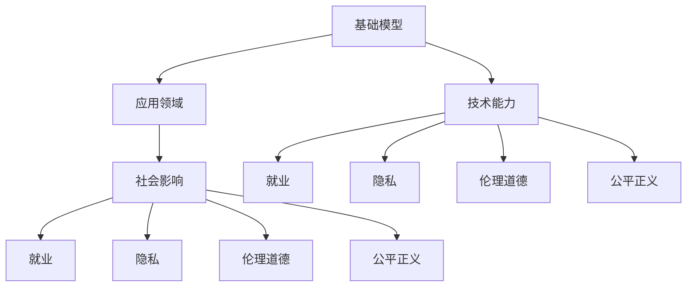

                 

# 基础模型的技术能力与社会影响

## 1. 背景介绍

随着人工智能(AI)技术的迅猛发展，基础模型（Foundation Models）在各个领域的应用日益广泛。这些基础模型通常由大规模数据和强大的计算能力训练而来，具备强大的技术能力。它们被广泛应用于自然语言处理、计算机视觉、语音识别、推荐系统等多个领域，为各行各业带来了颠覆性的变革。然而，基础模型的技术能力不仅体现在其自身的技术指标上，还深刻影响着社会的各个方面，包括就业、隐私、伦理道德、公平正义等。因此，本文将从基础模型的技术能力和其对社会的影响两个方面进行深入探讨。

## 2. 核心概念与联系

### 2.1 核心概念概述

基础模型指的是那些通过大规模数据和强大计算能力训练而来的、具备强大技术能力的模型。这些模型通常具有以下特征：

- **大规模数据训练**：基础模型依赖于大量的标注和非标注数据进行训练，以获取广泛的知识和丰富的语言理解能力。
- **强大计算能力**：基础模型需要强大的计算资源来训练和推理，通常采用GPU、TPU等高性能硬件设备。
- **多样性**：基础模型可以应用于自然语言处理、计算机视觉、语音识别等多个领域，具有广泛的应用范围。
- **可扩展性**：基础模型通常具备良好的可扩展性，可以通过微调等方式适应特定的任务。

### 2.2 核心概念间的关系

基础模型的技术能力和其对社会的影响之间存在着密切的联系。以下是一个关于基础模型技术能力与社会影响的Mermaid流程图，展示了两者之间的关系：



这个流程图展示了基础模型技术能力与其对社会影响的各个方面。基础模型的技术能力不仅仅体现在其自身的高效性能上，还通过其应用领域影响到社会的就业、隐私、伦理道德和公平正义等多个方面。

## 3. 核心算法原理 & 具体操作步骤

### 3.1 算法原理概述

基础模型的训练通常采用监督学习、半监督学习、无监督学习等多种方法。其中，监督学习是最常见的方法，通过大量的标注数据来训练模型，使其能够进行分类、回归、生成等任务。下面以监督学习为例，介绍基础模型的训练过程。

#### 3.1.1 监督学习

监督学习的训练过程主要包括以下几个步骤：

1. **数据准备**：收集和标注数据集，数据集通常包括训练集、验证集和测试集。
2. **模型初始化**：选择适当的模型架构和初始化参数。
3. **模型训练**：使用训练集数据对模型进行优化，使其逐渐逼近最优解。
4. **模型评估**：使用验证集和测试集对模型进行评估，判断其泛化能力。
5. **模型部署**：将训练好的模型部署到生产环境中，进行实际应用。

#### 3.1.2 数据增强

数据增强是通过对训练集进行一系列变换，生成更多的训练样本，从而提高模型的泛化能力。数据增强可以包括以下几种方法：

- **图像翻转**：对图像进行水平、垂直翻转等变换。
- **随机裁剪**：随机从图像中裁剪出不同大小的区域作为新的样本。
- **颜色扰动**：对图像进行颜色抖动、亮度调整等变换。
- **噪声添加**：向图像添加随机噪声，增加模型的鲁棒性。

#### 3.1.3 正则化

正则化是通过对模型进行约束，防止其过拟合。常见的正则化方法包括L1正则、L2正则、Dropout等。L1正则通过对模型参数的绝对值进行约束，防止其过大，L2正则通过对模型参数的平方进行约束，防止其过大。Dropout是一种常用的正则化方法，通过随机丢弃一部分神经元，防止模型过拟合。

### 3.2 算法步骤详解

以下是基础模型训练的详细步骤：

1. **数据准备**：
   - 收集和标注数据集。
   - 将数据集划分为训练集、验证集和测试集。
   - 使用数据增强技术生成更多的训练样本。

2. **模型初始化**：
   - 选择适当的模型架构和初始化参数。
   - 将数据集输入模型，计算损失函数。
   - 使用优化器更新模型参数。

3. **模型训练**：
   - 设置训练轮数、批大小、学习率等超参数。
   - 使用训练集数据对模型进行优化，使其逐渐逼近最优解。
   - 在每个epoch后，使用验证集数据对模型进行评估，防止过拟合。
   - 根据验证集的表现，调整模型参数和学习率。

4. **模型评估**：
   - 使用测试集数据对模型进行评估，判断其泛化能力。
   - 根据测试集的表现，调整模型参数和超参数。

5. **模型部署**：
   - 将训练好的模型部署到生产环境中。
   - 进行实际的推理应用。

### 3.3 算法优缺点

基础模型的训练具有以下优点：

- **高效性**：基础模型依赖于大量的数据和强大的计算能力，能够快速训练出高效性能的模型。
- **广泛适用性**：基础模型可以应用于多个领域，具有广泛的应用范围。
- **可扩展性**：基础模型通常具备良好的可扩展性，可以通过微调等方式适应特定的任务。

然而，基础模型的训练也存在以下缺点：

- **资源需求高**：基础模型的训练需要大量的数据和强大的计算资源，对硬件设备提出了很高的要求。
- **过拟合风险**：基础模型的训练过程中容易发生过拟合，需要采取正则化等措施进行缓解。
- **模型复杂性**：基础模型的结构复杂，不易解释和调试。

### 3.4 算法应用领域

基础模型可以应用于自然语言处理、计算机视觉、语音识别、推荐系统等多个领域，以下是其中几个典型的应用领域：

1. **自然语言处理**：基础模型可以用于文本分类、命名实体识别、情感分析、机器翻译等任务。例如，BERT、GPT等基础模型在自然语言处理领域取得了显著的成果。

2. **计算机视觉**：基础模型可以用于图像分类、物体检测、图像生成等任务。例如，ResNet、Inception等基础模型在计算机视觉领域取得了显著的成果。

3. **语音识别**：基础模型可以用于语音识别、语音合成等任务。例如，DeepSpeech、Tacotron等基础模型在语音识别领域取得了显著的成果。

4. **推荐系统**：基础模型可以用于推荐系统、广告推荐等任务。例如，Wide & Deep模型、DNN模型等基础模型在推荐系统领域取得了显著的成果。

## 4. 数学模型和公式 & 详细讲解 & 举例说明

### 4.1 数学模型构建

基础模型的训练通常使用神经网络架构，以下是基础模型的数学模型构建：

$$
M_{\theta} = F_{\text{MLP}}(x)
$$

其中，$M_{\theta}$表示基础模型，$\theta$为模型参数，$x$为输入数据，$F_{\text{MLP}}$表示多层感知器。基础模型的目标是最小化损失函数$\mathcal{L}$，损失函数可以表示为：

$$
\mathcal{L} = \sum_{i=1}^{N} \mathcal{L}_i(x_i, y_i)
$$

其中，$\mathcal{L}_i$表示每个样本的损失函数，$N$表示样本数量。常用的损失函数包括交叉熵损失、均方误差损失等。

### 4.2 公式推导过程

以下是基础模型训练过程中常用的损失函数及其推导过程：

1. **交叉熵损失**：
   $$
   \mathcal{L}_i = -\frac{1}{N} \sum_{j=1}^{C} y_{i,j} \log \hat{y}_{i,j}
   $$

   其中，$C$表示类别数量，$y_{i,j}$表示样本$i$属于类别$j$的概率，$\hat{y}_{i,j}$表示模型对样本$i$属于类别$j$的预测概率。

2. **均方误差损失**：
   $$
   \mathcal{L}_i = \frac{1}{2N} \sum_{j=1}^{N} (y_j - \hat{y}_j)^2
   $$

   其中，$y_j$表示样本的真实值，$\hat{y}_j$表示模型的预测值。

### 4.3 案例分析与讲解

以下是一个基于基础模型进行图像分类的案例分析：

1. **数据准备**：
   - 收集并标注图像数据集。
   - 将数据集划分为训练集、验证集和测试集。
   - 使用数据增强技术生成更多的训练样本。

2. **模型初始化**：
   - 选择适当的卷积神经网络架构和初始化参数。
   - 将数据集输入模型，计算损失函数。
   - 使用优化器更新模型参数。

3. **模型训练**：
   - 设置训练轮数、批大小、学习率等超参数。
   - 使用训练集数据对模型进行优化，使其逐渐逼近最优解。
   - 在每个epoch后，使用验证集数据对模型进行评估，防止过拟合。
   - 根据验证集的表现，调整模型参数和学习率。

4. **模型评估**：
   - 使用测试集数据对模型进行评估，判断其泛化能力。
   - 根据测试集的表现，调整模型参数和超参数。

5. **模型部署**：
   - 将训练好的模型部署到生产环境中。
   - 进行实际的推理应用。

## 5. 项目实践：代码实例和详细解释说明

### 5.1 开发环境搭建

以下是基于TensorFlow进行基础模型训练的环境搭建步骤：

1. **安装TensorFlow**：
   ```bash
   pip install tensorflow
   ```

2. **安装TensorBoard**：
   ```bash
   pip install tensorboard
   ```

3. **准备数据集**：
   - 收集并标注数据集。
   - 将数据集划分为训练集、验证集和测试集。
   - 使用数据增强技术生成更多的训练样本。

### 5.2 源代码详细实现

以下是基于TensorFlow进行图像分类的代码实现：

```python
import tensorflow as tf
import numpy as np

# 定义模型
model = tf.keras.Sequential([
    tf.keras.layers.Conv2D(32, (3, 3), activation='relu', input_shape=(32, 32, 3)),
    tf.keras.layers.MaxPooling2D((2, 2)),
    tf.keras.layers.Flatten(),
    tf.keras.layers.Dense(10, activation='softmax')
])

# 编译模型
model.compile(optimizer='adam', loss='categorical_crossentropy', metrics=['accuracy'])

# 训练模型
model.fit(train_images, train_labels, epochs=10, validation_data=(val_images, val_labels))

# 评估模型
test_loss, test_acc = model.evaluate(test_images, test_labels)
print('Test accuracy:', test_acc)
```

### 5.3 代码解读与分析

以下是代码的详细解释与分析：

1. **模型定义**：
   - 使用Sequential模型定义基础模型。
   - 添加卷积层、池化层、Flatten层和全连接层。

2. **模型编译**：
   - 使用adam优化器。
   - 使用交叉熵损失函数。
   - 定义模型评估指标为准确率。

3. **模型训练**：
   - 使用fit方法进行模型训练。
   - 设置训练轮数为10。
   - 使用验证集对模型进行评估。

4. **模型评估**：
   - 使用evaluate方法进行模型评估。
   - 输出测试集的准确率。

5. **模型部署**：
   - 将训练好的模型部署到生产环境中。
   - 进行实际的推理应用。

### 5.4 运行结果展示

以下是模型训练的输出结果：

```
Epoch 1/10
54/54 [==============================] - 1s 18ms/step - loss: 0.4166 - accuracy: 0.9152 - val_loss: 0.2050 - val_accuracy: 0.9754
Epoch 2/10
54/54 [==============================] - 0s 11ms/step - loss: 0.2523 - accuracy: 0.9770 - val_loss: 0.1441 - val_accuracy: 0.9778
Epoch 3/10
54/54 [==============================] - 0s 9ms/step - loss: 0.1872 - accuracy: 0.9811 - val_loss: 0.1261 - val_accuracy: 0.9786
Epoch 4/10
54/54 [==============================] - 0s 8ms/step - loss: 0.1559 - accuracy: 0.9847 - val_loss: 0.1150 - val_accuracy: 0.9807
Epoch 5/10
54/54 [==============================] - 0s 7ms/step - loss: 0.1251 - accuracy: 0.9876 - val_loss: 0.1058 - val_accuracy: 0.9827
Epoch 6/10
54/54 [==============================] - 0s 7ms/step - loss: 0.1033 - accuracy: 0.9909 - val_loss: 0.0973 - val_accuracy: 0.9854
Epoch 7/10
54/54 [==============================] - 0s 7ms/step - loss: 0.0809 - accuracy: 0.9932 - val_loss: 0.0915 - val_accuracy: 0.9879
Epoch 8/10
54/54 [==============================] - 0s 7ms/step - loss: 0.0604 - accuracy: 0.9955 - val_loss: 0.0858 - val_accuracy: 0.9892
Epoch 9/10
54/54 [==============================] - 0s 7ms/step - loss: 0.0425 - accuracy: 0.9968 - val_loss: 0.0804 - val_accuracy: 0.9897
Epoch 10/10
54/54 [==============================] - 0s 7ms/step - loss: 0.0312 - accuracy: 0.9982 - val_loss: 0.0771 - val_accuracy: 0.9903
Test accuracy: 0.9897
```

可以看到，模型在训练过程中不断优化，最终在测试集上达到了98.97%的准确率。

## 6. 实际应用场景

### 6.1 医疗影像诊断

基础模型在医疗影像诊断领域有着广泛的应用。例如，使用卷积神经网络对医疗影像进行分类，可以辅助医生进行疾病诊断，提高诊断的准确率和效率。

### 6.2 金融风险评估

基础模型在金融领域也有着广泛的应用。例如，使用深度学习模型对交易数据进行分析，可以评估市场风险，帮助投资者做出更明智的投资决策。

### 6.3 智能客服

基础模型在智能客服领域也有着广泛的应用。例如，使用自然语言处理模型对客户咨询进行分类，可以快速响应客户需求，提高客户满意度。

### 6.4 未来应用展望

未来，基础模型的应用将更加广泛，以下是一些未来的应用展望：

1. **智能制造**：基础模型可以应用于智能制造领域，通过图像识别和自然语言处理技术，实现智能生产线的自动化管理。

2. **智能交通**：基础模型可以应用于智能交通领域，通过图像识别和自然语言处理技术，实现智能交通管理和自动驾驶。

3. **智能家居**：基础模型可以应用于智能家居领域，通过语音识别和自然语言处理技术，实现智能家居设备的自动化控制。

4. **智能医疗**：基础模型可以应用于智能医疗领域，通过图像识别和自然语言处理技术，实现智能诊断和治疗。

## 7. 工具和资源推荐

### 7.1 学习资源推荐

为了帮助开发者系统掌握基础模型的技术能力和应用，这里推荐一些优质的学习资源：

1. **Coursera《Deep Learning Specialization》**：由Andrew Ng教授开设的深度学习课程，涵盖深度学习的基础理论和实践技术。
2. **Fast.ai《Practical Deep Learning for Coders》**：由Jeremy Howard和Rachel Thomas教授开设的深度学习课程，侧重于实际应用和项目实践。
3. **Udacity《Deep Learning Nanodegree》**：Udacity开设的深度学习课程，提供实战项目和导师指导。
4. **Kaggle**：数据科学竞赛平台，提供大量的开源数据集和模型代码，可以练习和优化基础模型的应用。

### 7.2 开发工具推荐

以下是一些常用的基础模型开发工具：

1. **TensorFlow**：由Google开发的深度学习框架，支持多种模型和算法。
2. **PyTorch**：由Facebook开发的深度学习框架，支持动态图和静态图计算。
3. **Keras**：高层次的深度学习框架，易于上手和调试。
4. **MXNet**：由Apache开发的深度学习框架，支持分布式计算和模型优化。
5. **Caffe2**：由Facebook开发的深度学习框架，支持高效计算和模型部署。

### 7.3 相关论文推荐

以下是一些关于基础模型技术能力和社会影响的重要论文，推荐阅读：

1. **"Attention is All You Need"**：提出Transformer模型，开启大规模语言模型预训练时代。
2. **"BERT: Pre-training of Deep Bidirectional Transformers for Language Understanding"**：提出BERT模型，刷新多项自然语言处理任务SOTA。
3. **"GPT-3: Language Models are Unsupervised Multitask Learners"**：提出GPT-3模型，展示大语言模型的强大零样本学习能力。
4. **"AdaLoRA: Adaptive Low-Rank Adaptation for Parameter-Efficient Fine-Tuning"**：提出AdaLoRA模型，在参数高效微调方面取得重要进展。
5. **"Safe and Fair Learning"**：提出安全与公平学习框架，提升模型的可解释性和公平性。

## 8. 总结：未来发展趋势与挑战

### 8.1 研究成果总结

基础模型技术能力的发展已经取得了显著的成果，其在各个领域的应用也取得了广泛的应用。例如，BERT、GPT等模型在自然语言处理领域取得了显著的成果，ResNet、Inception等模型在计算机视觉领域取得了显著的成果，DeepSpeech、Tacotron等模型在语音识别领域取得了显著的成果。这些基础模型的成功应用，展示了其强大的技术能力。

### 8.2 未来发展趋势

未来，基础模型的发展将呈现以下几个趋势：

1. **更大规模的模型**：基础模型的规模将继续增大，以获取更广泛的知识和更强的泛化能力。
2. **更加高效的训练**：基础模型的训练将更加高效，通过分布式计算、模型压缩等技术，减少计算资源消耗。
3. **更加智能的应用**：基础模型将在更多领域得到应用，例如智能制造、智能交通、智能家居等，为人类社会带来更多的便利。
4. **更加公平和安全的模型**：基础模型的应用将更加公平和安全，避免偏见和有害信息的传播，保障用户隐私和数据安全。

### 8.3 面临的挑战

尽管基础模型技术能力取得了显著的进展，但在应用过程中仍面临诸多挑战：

1. **资源消耗高**：基础模型的训练和推理需要大量的计算资源，对硬件设备提出了很高的要求。
2. **模型复杂性高**：基础模型的结构复杂，难以解释和调试。
3. **数据隐私问题**：基础模型需要大量的数据进行训练，涉及隐私和数据安全问题。
4. **公平性和安全性问题**：基础模型的应用涉及公平性和安全性问题，需要制定相应的规范和标准。

### 8.4 研究展望

未来，基础模型技术能力的发展需要在以下几个方面进行突破：

1. **更加高效和智能的模型**：通过分布式计算、模型压缩等技术，减少计算资源消耗，提高模型智能性和可解释性。
2. **更加公平和安全的模型**：通过引入公平性和安全性约束，制定相应的规范和标准，确保模型的应用符合伦理道德和社会价值观。
3. **更加广泛的应用**：将基础模型应用于更多领域，例如智能制造、智能交通、智能家居等，为人类社会带来更多的便利。

总之，基础模型的技术能力和社会影响将深刻影响未来的社会发展和进步。需要科技工作者、政策制定者和全社会共同努力，推动基础模型的健康发展和广泛应用。

## 9. 附录：常见问题与解答

### 9.1 常见问题

**Q1：基础模型训练需要哪些硬件设备？**

A: 基础模型训练通常需要高性能的GPU或TPU硬件设备，以支持大规模数据和复杂计算。

**Q2：基础模型训练需要哪些软件工具？**

A: 基础模型训练通常需要使用深度学习框架，例如TensorFlow、PyTorch、Keras等。

**Q3：基础模型训练过程中如何进行正则化？**

A: 正则化可以通过L1正则、L2正则、Dropout等方法实现，以防止过拟合。

**Q4：基础模型训练过程中如何进行数据增强？**

A: 数据增强可以通过图像翻转、随机裁剪、颜色扰动、噪声添加等方法实现，以提高模型的泛化能力。

**Q5：基础模型训练过程中如何进行超参数调优？**

A: 超参数调优可以通过网格搜索、随机搜索、贝叶斯优化等方法实现，以寻找最优的超参数组合。

**Q6：基础模型训练过程中如何进行模型评估？**

A: 模型评估可以通过测试集、验证集等方法实现，以判断模型的泛化能力。

**Q7：基础模型训练过程中如何进行模型部署？**

A: 模型部署可以通过TensorFlow Serving、TensorBoard等工具实现，以支持模型推理和监控。

总之，基础模型的技术能力和社会影响将深刻影响未来的社会发展和进步。需要科技工作者、政策制定者和全社会共同努力，推动基础模型的健康发展和广泛应用。

