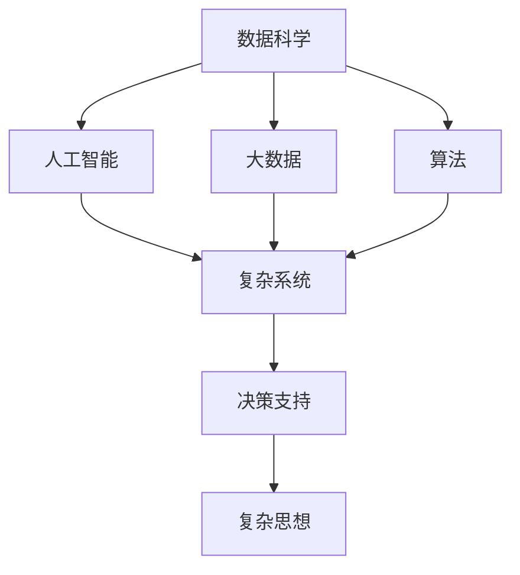
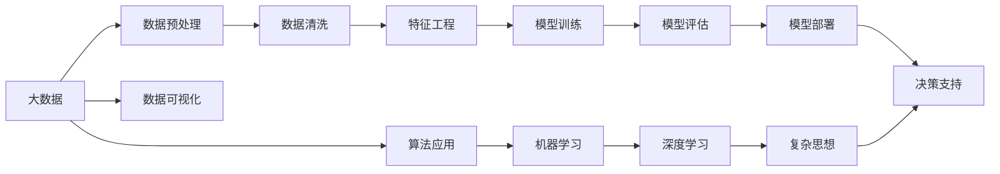

                 

# 复杂思想的形成：概念的基础

> 关键词：复杂思想,基础概念,逻辑推导,算法应用,技术实践

## 1. 背景介绍

### 1.1 问题由来
在当今信息化时代，面对复杂的信息环境和挑战，如何形成正确、有效的思想，成为个体、组织乃至社会的重要议题。复杂的思想往往源于复杂的现实问题，需要对问题的多个层面和维度进行深入分析，同时考虑多方面因素，才能得出合理、实用的解决方案。

### 1.2 问题核心关键点
形成复杂思想的过程，可以视为一个概念构建、抽象和应用的过程。在这个过程中，涉及一系列基础概念、逻辑推导和算法应用。本文旨在深入探讨这些核心要素，并展示其在大数据、人工智能等技术中的应用，为读者提供形成复杂思想的理论基础和实践指南。

### 1.3 问题研究意义
理解和掌握形成复杂思想的方法，对于提升个体决策能力、增强组织创新力、推动社会进步具有重要意义。通过对基础概念、逻辑推导和算法应用的系统学习，可以帮助读者构建更为全面、深刻的思想体系，在面对复杂问题时能够做出更加科学、合理的决策。

## 2. 核心概念与联系

### 2.1 核心概念概述

为了深入理解复杂思想的形成过程，本节将介绍几个关键的概念，这些概念在大数据、人工智能等技术的应用中扮演着重要角色。

- **数据科学(Data Science)**：一门涉及数据收集、处理、分析和可视化的学科。数据科学的核心在于利用数据生成知识和见解，帮助人们做出更好的决策。
- **人工智能(Artificial Intelligence, AI)**：一种模拟人类智能的技术，包括机器学习、深度学习等技术，旨在让计算机具备学习、推理和决策能力。
- **复杂系统(Complex Systems)**：由大量相互作用的简单元素构成的系统，其行为难以用简单的数学模型描述。大数据、人工智能等技术常用于分析复杂系统的行为。
- **大数据(Big Data)**：指那些太复杂、无法通过传统计算机进行处理的数据集。大数据分析有助于从海量数据中发现规律和趋势，为决策提供支持。
- **算法(Algorithms)**：一组按照特定顺序执行的指令集，用于解决特定问题或完成特定任务。

### 2.2 概念间的关系

这些核心概念之间的关系可以通过以下Mermaid流程图来展示：



这个流程图展示了大数据、人工智能、复杂系统、算法与复杂思想之间的联系：

1. 数据科学通过大数据技术获取海量数据，为人工智能模型训练提供数据支撑。
2. 人工智能利用算法，从数据中学习规律，生成模型，用于复杂系统的分析和决策。
3. 复杂系统分析需结合大数据和人工智能技术，处理复杂的实际问题，生成深入见解。
4. 复杂思想的形成依托于数据、算法和人工智能的共同支持，最终为决策提供科学依据。

### 2.3 核心概念的整体架构

最后，我们用一个综合的流程图来展示这些核心概念在大数据、人工智能等技术的应用中的整体架构：



这个综合流程图展示了从大数据到复杂思想的整体流程：

1. 从大数据中提取数据，并进行预处理和清洗。
2. 在清洗后的数据上进行特征工程，提取关键特征。
3. 利用机器学习和深度学习算法，训练模型。
4. 对训练好的模型进行评估和部署。
5. 通过可视化和决策支持工具，分析和应用复杂思想。

## 3. 核心算法原理 & 具体操作步骤
### 3.1 算法原理概述

复杂思想的形成过程，实际上是算法应用的逻辑推导过程。基于数据科学的理论和方法，通过对数据的分析、建模和预测，形成对问题的深入理解，并生成解决方案。

以机器学习为例，其核心算法原理是通过训练数据集中的样本，寻找输入与输出之间的映射关系，从而生成一个能够泛化到未见数据的模型。这一过程涉及以下关键步骤：

1. 数据准备：收集、清洗和整理数据。
2. 特征选择：从数据中提取最有价值的特征。
3. 模型选择：根据问题特点，选择合适的模型。
4. 模型训练：利用训练数据集训练模型。
5. 模型评估：使用测试数据集评估模型性能。
6. 模型优化：调整模型参数，优化模型性能。
7. 模型应用：将优化后的模型应用到实际问题中。

### 3.2 算法步骤详解

以下我们将以机器学习算法为例，详细解释其操作步骤：

**Step 1: 数据准备**
收集、清洗和整理数据。对于大数据分析任务，需要收集足够多的数据，并对数据进行去重、处理缺失值等操作，确保数据的准确性和完整性。

**Step 2: 特征选择**
从数据中提取最有价值的特征。特征选择直接影响模型的预测效果，需要根据问题特点选择合适的特征，避免噪声和冗余信息对模型产生负面影响。

**Step 3: 模型选择**
根据问题特点，选择合适的模型。机器学习模型包括线性回归、逻辑回归、决策树、支持向量机等，需根据数据类型和问题特点进行选择。

**Step 4: 模型训练**
利用训练数据集训练模型。通过最小化预测误差，生成一个能够泛化到未见数据的模型。常用的训练算法包括梯度下降、随机梯度下降等。

**Step 5: 模型评估**
使用测试数据集评估模型性能。常用的评估指标包括准确率、召回率、F1分数等，用于衡量模型预测的准确性和鲁棒性。

**Step 6: 模型优化**
调整模型参数，优化模型性能。通过交叉验证、网格搜索等方法，寻找最优的模型参数组合。

**Step 7: 模型应用**
将优化后的模型应用到实际问题中。通过模型输入数据，输出预测结果，形成对问题的解决方案。

### 3.3 算法优缺点

基于数据科学的机器学习算法具有以下优点：

- 自动化程度高：算法能够自动从数据中学习规律，生成模型。
- 适应性强：通过调整模型参数，能够适应多种类型的数据和问题。
- 准确性高：在大规模数据集上训练的模型，通常具有较高的预测准确性。

然而，机器学习算法也存在一些局限性：

- 对数据质量敏感：模型训练效果受数据质量、特征选择等影响，如果数据存在噪声或缺失值，模型的性能可能受到影响。
- 解释性差：许多机器学习模型，如深度神经网络，难以解释其内部工作机制和决策过程。
- 模型过拟合：在训练数据不足或模型复杂度过高的情况下，模型可能过拟合，泛化能力下降。

### 3.4 算法应用领域

基于数据科学的机器学习算法，广泛应用于以下领域：

- **金融风险管理**：通过分析历史交易数据，预测市场风险和客户信用风险。
- **医疗诊断**：利用患者病历和医疗影像数据，辅助诊断和治疗决策。
- **推荐系统**：根据用户行为数据，生成个性化推荐。
- **自然语言处理**：通过文本分析，生成文本分类、情感分析等模型。
- **智能制造**：通过数据分析，优化生产流程和产品质量控制。

## 4. 数学模型和公式 & 详细讲解  
### 4.1 数学模型构建

机器学习算法的核心是构建一个能够泛化到未见数据的数学模型。以线性回归为例，其数学模型为：

$$y = \theta_0 + \theta_1x_1 + \theta_2x_2 + \cdots + \theta_nx_n$$

其中，$y$ 为输出变量，$x_i$ 为输入特征，$\theta_i$ 为模型参数。通过最小化损失函数：

$$\min_{\theta} \frac{1}{2m}\sum_{i=1}^m (y_i - \theta_0 - \theta_1x_{i1} - \theta_2x_{i2} - \cdots - \theta_nx_{in})^2$$

训练模型，使模型能够拟合训练数据，并泛化到未见数据。

### 4.2 公式推导过程

线性回归的推导过程如下：

1. 假设模型为线性关系 $y = \theta_0 + \theta_1x_1 + \theta_2x_2 + \cdots + \theta_nx_n$。
2. 最小化损失函数：$\frac{1}{2m}\sum_{i=1}^m (y_i - \theta_0 - \theta_1x_{i1} - \theta_2x_{i2} - \cdots - \theta_nx_{in})^2$。
3. 对模型参数 $\theta_i$ 求偏导，得：

$$\frac{\partial}{\partial \theta_i} \frac{1}{2m}\sum_{i=1}^m (y_i - \theta_0 - \theta_1x_{i1} - \theta_2x_{i2} - \cdots - \theta_nx_{in})^2 = \frac{1}{m}\sum_{i=1}^m (y_i - \theta_0 - \theta_1x_{i1} - \theta_2x_{i2} - \cdots - \theta_nx_{in})x_{in} = 0$$

4. 解上述方程组，得：

$$\theta_i = \frac{\sum_{i=1}^m (y_i - \overline{y})(\overline{x_i} - \overline{x})}{\sum_{i=1}^m (\overline{x_i} - \overline{x})^2}$$

其中，$\overline{x}$ 和 $\overline{y}$ 分别为特征和输出的均值。

### 4.3 案例分析与讲解

以房价预测为例，假设有一个包含房屋面积、房间数量等特征的数据集，目标是预测房屋的价格。根据上述公式，可以通过线性回归模型进行房价预测。

**Step 1: 数据准备**
收集房屋面积、房间数量、地理位置等特征，并清洗数据，确保数据的准确性和完整性。

**Step 2: 特征选择**
选择房屋面积、房间数量等最有价值的特征，避免噪声和冗余信息对模型产生负面影响。

**Step 3: 模型选择**
选择线性回归模型，因为房价与房屋面积、房间数量等线性相关。

**Step 4: 模型训练**
利用训练数据集，训练线性回归模型。通过最小化预测误差，生成一个能够泛化到未见数据的模型。

**Step 5: 模型评估**
使用测试数据集评估模型性能，计算模型的准确率、召回率、F1分数等指标。

**Step 6: 模型优化**
调整模型参数，优化模型性能。通过交叉验证、网格搜索等方法，寻找最优的模型参数组合。

**Step 7: 模型应用**
将优化后的模型应用到实际问题中，输入房屋面积、房间数量等特征，输出房价预测结果。

## 5. 项目实践：代码实例和详细解释说明
### 5.1 开发环境搭建

在进行机器学习实践前，我们需要准备好开发环境。以下是使用Python进行Scikit-learn开发的环境配置流程：

1. 安装Anaconda：从官网下载并安装Anaconda，用于创建独立的Python环境。

2. 创建并激活虚拟环境：
```bash
conda create -n sklearn-env python=3.8 
conda activate sklearn-env
```

3. 安装Scikit-learn：
```bash
pip install -U scikit-learn
```

4. 安装必要的工具包：
```bash
pip install numpy pandas matplotlib scikit-image
```

完成上述步骤后，即可在`sklearn-env`环境中开始机器学习实践。

### 5.2 源代码详细实现

下面我们以房价预测为例，给出使用Scikit-learn进行线性回归的Python代码实现。

首先，定义数据预处理函数：

```python
import pandas as pd
from sklearn.preprocessing import StandardScaler

def preprocess_data(data):
    data = data.dropna()  # 删除缺失值
    X = data[['area', 'rooms']]  # 选择特征
    y = data['price']  # 选择目标变量
    scaler = StandardScaler()  # 特征标准化
    X = scaler.fit_transform(X)
    return X, y
```

然后，定义模型训练函数：

```python
from sklearn.linear_model import LinearRegression
from sklearn.model_selection import train_test_split

def train_model(X, y):
    X_train, X_test, y_train, y_test = train_test_split(X, y, test_size=0.2, random_state=42)  # 数据划分
    model = LinearRegression()  # 创建模型
    model.fit(X_train, y_train)  # 训练模型
    return model, X_test, y_test
```

接着，定义模型评估函数：

```python
from sklearn.metrics import mean_squared_error, r2_score

def evaluate_model(model, X_test, y_test):
    y_pred = model.predict(X_test)
    mse = mean_squared_error(y_test, y_pred)
    r2 = r2_score(y_test, y_pred)
    return mse, r2
```

最后，启动训练流程并在测试集上评估：

```python
X, y = preprocess_data(data)
model, X_test, y_test = train_model(X, y)
mse, r2 = evaluate_model(model, X_test, y_test)
print(f"Mean Squared Error: {mse:.2f}")
print(f"R-squared: {r2:.2f}")
```

以上就是使用Scikit-learn进行房价预测的完整代码实现。可以看到，得益于Scikit-learn的强大封装，我们可以用相对简洁的代码完成线性回归模型的训练和评估。

### 5.3 代码解读与分析

让我们再详细解读一下关键代码的实现细节：

**preprocess_data函数**：
- 删除缺失值，选择特征和目标变量，并对特征进行标准化，确保模型训练的稳定性和准确性。

**train_model函数**：
- 将数据集划分为训练集和测试集，创建线性回归模型，并使用训练集数据拟合模型。

**evaluate_model函数**：
- 在测试集上评估模型性能，计算均方误差和R方指标，用于衡量模型的预测效果。

**训练流程**：
- 准备数据，进行特征选择和标准化。
- 划分数据集，训练模型。
- 在测试集上评估模型，输出评估结果。

可以看到，Scikit-learn提供了高效、便捷的机器学习实现，开发者可以轻松地利用其封装好的函数，快速实现模型训练、评估和优化。当然，工业级的系统实现还需考虑更多因素，如模型保存和部署、超参数的自动搜索、更灵活的任务适配层等。但核心的机器学习范式基本与此类似。

## 6. 实际应用场景
### 6.1 金融风险管理

在金融领域，机器学习被广泛应用于风险管理，通过分析历史交易数据，预测市场风险和客户信用风险。例如，银行可以利用机器学习模型评估贷款申请人的信用风险，有效识别潜在的违约客户，降低坏账率。

具体而言，可以收集历史贷款数据，包括借款人的年龄、收入、还款记录等特征，并构建机器学习模型，预测新申请客户的违约概率。通过模型输出，银行可以更精准地评估客户的信用风险，制定更合理的贷款策略，保护金融安全。

### 6.2 医疗诊断

机器学习在医疗领域的应用也非常广泛，尤其是对于复杂疾病的诊断和治疗。例如，通过分析患者的病历和医疗影像数据，可以辅助医生进行疾病诊断，提高诊断的准确性和效率。

在实际应用中，可以利用机器学习模型，分析患者的症状、检查结果等数据，预测可能存在的疾病。例如，利用深度学习模型，可以分析肺部CT图像，检测肺癌等疾病。通过模型的预测结果，医生可以更早地发现病情，制定相应的治疗方案，提高治愈率。

### 6.3 推荐系统

推荐系统是机器学习在电商、社交媒体等领域的典型应用之一。通过分析用户的行为数据，推荐系统可以生成个性化的推荐结果，提升用户体验和满意度。

具体而言，推荐系统可以收集用户的浏览记录、购买记录、评价记录等数据，并利用机器学习模型，预测用户可能感兴趣的商品或内容。例如，在电商平台上，根据用户的浏览历史，推荐相关商品；在视频平台上，推荐用户可能喜欢的视频内容。通过个性化的推荐，提升用户粘性和消费转化率。

### 6.4 自然语言处理

自然语言处理(NLP)是大数据和人工智能领域的另一重要应用方向。通过分析文本数据，NLP技术可以生成文本分类、情感分析、机器翻译等模型，为信息处理和应用提供支持。

具体而言，可以利用机器学习模型，分析用户评论、新闻报道等文本数据，生成情感分析结果，帮助企业了解市场反馈，改进产品和服务。例如，利用情感分析模型，分析用户对产品的评价，发现用户满意度和存在的问题，指导企业改进产品设计和生产。

## 7. 工具和资源推荐
### 7.1 学习资源推荐

为了帮助开发者系统掌握机器学习和大数据的技术基础，这里推荐一些优质的学习资源：

1. 《机器学习实战》书籍：由Pete Warden和Lewis Dionnius编写，通过实践案例详细讲解了机器学习算法的原理和应用，适合入门学习。

2. Coursera《机器学习》课程：由Andrew Ng讲授，是NLP领域的经典课程，涵盖了机器学习的基本概念和算法。

3. Kaggle竞赛平台：Kaggle提供了大量数据分析和机器学习的竞赛项目，可以参与实战练习，积累经验。

4. Scikit-learn官方文档：Scikit-learn的官方文档提供了丰富的教程和示例，是学习机器学习算法的好帮手。

5. 《深度学习》书籍：由Ian Goodfellow、Yoshua Bengio和Aaron Courville编写，深入讲解了深度学习的基本原理和应用，适合进一步深入学习。

通过对这些资源的学习实践，相信你一定能够快速掌握机器学习和大数据的技术基础，并用于解决实际的NLP问题。

### 7.2 开发工具推荐

高效的开发离不开优秀的工具支持。以下是几款用于机器学习和大数据开发常用的工具：

1. Jupyter Notebook：用于编写和执行代码，支持多种编程语言和数据处理工具。

2. PyTorch：基于Python的开源深度学习框架，灵活的计算图，适合快速迭代研究。

3. TensorFlow：由Google主导开发的开源深度学习框架，生产部署方便，适合大规模工程应用。

4. Apache Spark：分布式计算框架，支持大规模数据处理和分析，适合大数据应用。

5. Hadoop：分布式文件系统，支持海量数据的存储和处理，适合大数据应用。

合理利用这些工具，可以显著提升机器学习和大数据开发的效率，加快创新迭代的步伐。

### 7.3 相关论文推荐

机器学习和大数据技术的发展源于学界的持续研究。以下是几篇奠基性的相关论文，推荐阅读：

1. C. M. Bishop的《Pattern Recognition and Machine Learning》：经典机器学习教材，介绍了机器学习的基本概念和算法。

2. Yann LeCun等人的《Deep Learning》：深度学习领域的经典书籍，讲解了深度学习的基本原理和应用。

3. A. Ng等人的《Machine Learning Yearning》：深度学习工程师指南，讲解了机器学习开发的最佳实践。

4. I. Guyon等人的《Advances in Neural Information Processing Systems (NIPS)》：NIPS会议论文集，涵盖最新的机器学习研究成果。

5. J. B. Tenenbaum等人的《Complexity and Computation》：讨论了复杂系统的理论基础，对于理解复杂思想的形成过程具有重要参考价值。

这些论文代表了大数据和机器学习领域的最新进展，阅读这些前沿论文，可以帮助你了解最新的研究方向和创新思路。

除上述资源外，还有一些值得关注的前沿资源，帮助开发者紧跟机器学习和大数据技术的发展趋势，例如：

1. arXiv论文预印本：人工智能领域最新研究成果的发布平台，包括大量尚未发表的前沿工作，学习前沿技术的必读资源。

2. Google AI博客：谷歌官方博客，定期发布机器学习和人工智能的最新进展和研究思路。

3. IEEE Transactions on Pattern Analysis and Machine Intelligence：机器学习领域的顶级期刊，发表最新的研究成果和创新思路。

4. Data Science Central：提供大量机器学习和数据科学的文章、教程和案例分析，适合初学者和进阶学习者。

5. 《人工智能新闻》网站：提供最新的人工智能和机器学习技术资讯，帮助开发者保持技术前沿。

总之，对于机器学习和大数据技术的系统学习，需要开发者保持开放的心态和持续学习的意愿。多关注前沿资讯，多动手实践，多思考总结，必将收获满满的成长收益。

## 8. 总结：未来发展趋势与挑战

### 8.1 总结

本文对基于数据科学的机器学习算法进行了全面系统的介绍。首先阐述了机器学习算法在大数据、人工智能等技术的应用中扮演的重要角色，然后通过数学模型的构建和推导，深入讲解了算法的原理和操作步骤。最后，通过实际应用场景的展示，展示了机器学习算法的广泛应用和实际价值。

通过本文的系统梳理，可以看到，机器学习算法在实际问题中的应用，为复杂思想的生成提供了坚实的数学基础和算法支持。这些技术的应用，有助于提升个体、组织乃至社会的决策能力，推动各行业的智能化转型和升级。

### 8.2 未来发展趋势

展望未来，机器学习算法的发展趋势如下：

1. 模型复杂度提升：随着算力成本的下降和数据规模的扩张，模型规模将进一步增大，深度和复杂度将不断提高，以应对更加复杂多变的数据和问题。

2. 实时化处理：随着计算能力的提升，实时化的数据处理和分析将成为可能，实时机器学习技术将得到广泛应用。

3. 自动化程度提升：自动化机器学习(AutoML)技术的发展，将进一步提升模型开发和应用的效率和准确性。

4. 模型可解释性增强：增强模型解释性，使决策过程透明化，帮助用户理解模型的内部工作机制和决策逻辑。

5. 跨领域融合：通过将机器学习与自然语言处理、计算机视觉等技术结合，实现跨领域的协同建模，提升模型的泛化能力和应用范围。

6. 多模态数据融合：通过将多模态数据进行融合，增强模型的信息利用能力，提升模型的决策精度。

这些趋势将进一步推动机器学习技术的发展，使其在更多领域得到应用，为复杂思想的生成和应用提供更坚实的技术基础。

### 8.3 面临的挑战

尽管机器学习算法已经取得了显著的进展，但在其发展过程中，仍然面临一些挑战：

1. 数据质量瓶颈：模型训练效果受数据质量、特征选择等影响，高质量数据获取难度大。

2. 模型过拟合：在训练数据不足或模型复杂度过高的情况下，模型可能过拟合，泛化能力下降。

3. 模型解释性差：许多机器学习模型，如深度神经网络，难以解释其内部工作机制和决策过程。

4. 算法鲁棒性不足：模型在面对噪声、缺失值等异常数据时，鲁棒性有待提高。

5. 算法公平性问题：模型可能存在偏见和歧视，需要进一步研究和改进。

6. 隐私和安全问题：大规模数据处理和模型训练涉及用户隐私和数据安全，需要制定相应的保护措施。

解决这些挑战，将是大数据和机器学习技术发展的关键。只有不断克服技术难题，才能让机器学习算法更好地服务于各行业的智能化转型。

### 8.4 研究展望

面向未来，机器学习和大数据技术的研究方向包括：

1. 无监督学习和半监督学习：探索从非结构化数据中学习规律，提高数据的利用效率。

2. 自适应学习算法：开发能够自动调整模型参数，适应数据和问题变化的学习算法。

3. 多模态融合技术：将文本、图像、声音等多模态数据进行融合，提升模型的信息利用能力。

4. 跨领域迁移学习：探索不同领域数据和知识之间的迁移学习，提升模型的跨领域迁移能力。

5. 公平性、透明性和可解释性：研究如何提高机器学习算法的公平性、透明性和可解释性，确保算法决策的公正性和透明性。

这些研究方向将推动机器学习技术向更加智能化、普适化和可靠化的方向发展，为复杂思想的生成和应用提供坚实的技术保障。

## 9. 附录：常见问题与解答

**Q1：机器学习算法是否适用于所有问题？**

A: 机器学习算法并非万能的，其适用范围有限。只有当问题满足以下条件时，才适合使用机器学习算法：

- 数据具有足够的数量和质量。
- 问题具有明确的输入输出关系。
- 模型的泛化能力较强，能适应未见数据。

因此，在实际应用中，需要根据具体问题的特点，选择合适的算法和技术。

**Q2：如何提高机器学习算法的准确性？**

A: 提高机器学习算法的准确性，可以从以下几个方面入手：

- 数据预处理：包括数据清洗、特征选择和数据增强等，提高数据质量和利用效率。
- 模型选择：根据问题特点，选择最合适的模型。
- 超参数调优：通过网格搜索、交叉验证等方法，寻找最优的超参数组合。
- 模型集成：通过将

