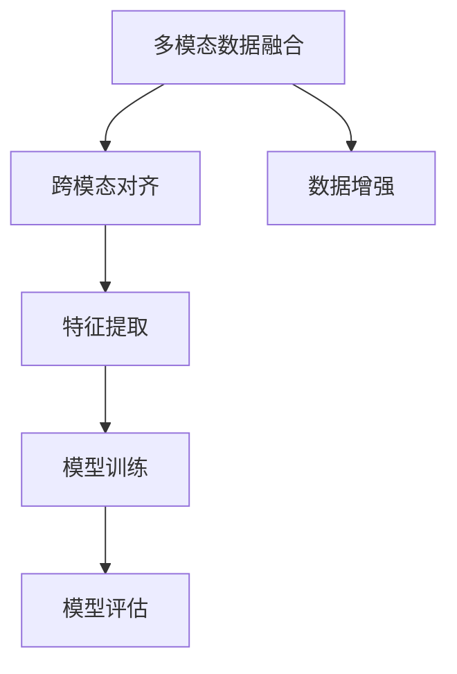
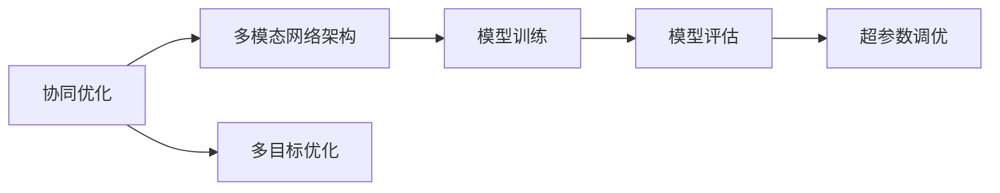
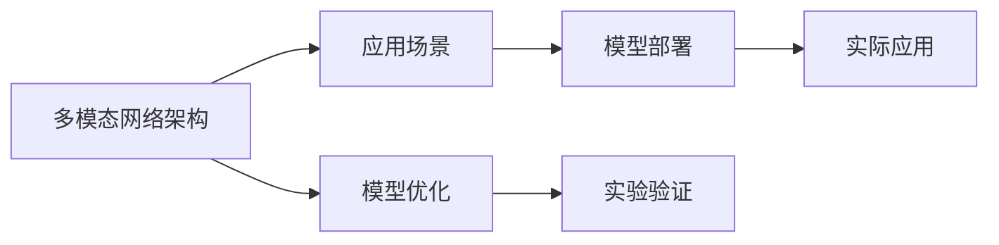
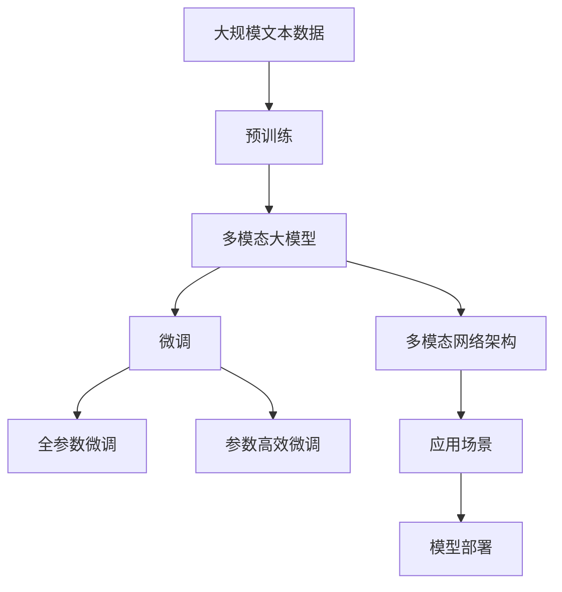

                 

# 多模态大模型：技术原理与实战 GPT技术的发展历程

## 1. 背景介绍

### 1.1 问题由来

近年来，人工智能技术在图像、语音、自然语言处理等多个模态上都取得了显著的进步。尤其是自然语言处理领域，得益于Transformer和BERT等大语言模型的出现，使得NLP技术从基于规则的专家系统，逐渐过渡到基于数据和深度学习的模型驱动。

然而，NLP模型多为单模态模型，对于需要综合多模态信息的任务，其效果往往不尽如人意。例如，当需要结合图像和文本信息进行问题解答时，单一的文本模型难以充分捕捉视觉信息，导致输出结果不够全面和准确。

因此，研究多模态大模型，将图像、语音、文本等多种模态信息进行融合，提高模型的理解能力和表现力，成为当前NLP领域的热点研究方向。本文将重点探讨多模态大模型的技术原理和实战方法，并结合GPT技术的演进历程，分析其在多模态任务上的应用前景。

### 1.2 问题核心关键点

多模态大模型旨在将多个模态的信息进行整合，以提升模型在多模态任务上的表现。其核心在于：
1. **数据融合**：通过将不同模态的数据进行联合训练，提高模型的泛化能力和鲁棒性。
2. **跨模态对齐**：在不同模态之间建立映射关系，使得模型能够对多模态数据进行理解和推理。
3. **协同优化**：设计跨模态的多目标优化函数，实现不同模态间的协同优化。
4. **模型结构**：研究适用于多模态任务的新型网络架构和融合方式，如注意力机制、通道交叉等。
5. **应用场景**：结合实际应用需求，设计适用于多模态场景的具体应用方法。

这些关键点构成了多模态大模型的研究框架，指导我们在理论和实践中进行探索和创新。

### 1.3 问题研究意义

研究多模态大模型对于拓展人工智能技术的边界，提高模型的表现力和应用范围具有重要意义：
1. **提升理解能力**：多模态模型能够综合利用图像、语音、文本等多种信息，提升对现实世界复杂现象的理解和判断能力。
2. **解决跨模态问题**：多模态模型能够处理跨模态信息融合问题，如视觉问答、语音识别、跨模态检索等，实现更加全面和准确的信息获取。
3. **推动应用发展**：多模态模型在医疗、智能驾驶、人机交互等领域具有广阔的应用前景，推动这些领域的智能化升级。
4. **促进跨学科融合**：多模态模型促进了不同学科之间的交叉融合，加速了人工智能技术的全面发展。

## 2. 核心概念与联系

### 2.1 核心概念概述

多模态大模型研究涉及多个关键概念，包括：

- **多模态数据融合**：将不同模态的数据进行联合训练，提高模型对复杂信息的理解能力。
- **跨模态对齐**：在不同模态之间建立映射关系，使得模型能够对多种信息进行理解和推理。
- **协同优化**：设计跨模态的多目标优化函数，实现不同模态间的协同优化。
- **多模态网络架构**：研究适用于多模态任务的新型网络架构和融合方式，如注意力机制、通道交叉等。
- **应用场景**：结合实际应用需求，设计适用于多模态场景的具体应用方法。

这些概念之间的逻辑关系可以通过以下Mermaid流程图来展示：


### 2.2 概念间的关系

这些核心概念之间存在着紧密的联系，形成了多模态大模型的研究框架。下面我们通过几个Mermaid流程图来展示这些概念之间的关系。

#### 2.2.1 数据融合与跨模态对齐



这个流程图展示了多模态数据融合与跨模态对齐的流程。首先，将不同模态的数据进行融合，通过数据增强等方法提高数据质量，然后提取跨模态特征，进行联合训练，最后评估模型性能。

#### 2.2.2 协同优化与多模态网络架构



这个流程图展示了协同优化和多模态网络架构的关系。协同优化设计多目标优化函数，多模态网络架构则实现不同模态之间的协同优化，训练模型并在评估中调整超参数，最终提升模型性能。

#### 2.2.3 应用场景与多模态网络架构



这个流程图展示了应用场景和多模态网络架构的关系。多模态网络架构设计适用于特定应用场景的模型，通过模型部署和实际应用，不断优化模型性能，并在实验验证中调整架构和参数。

### 2.3 核心概念的整体架构

最后，我们用一个综合的流程图来展示这些核心概念在大模型微调过程中的整体架构：



这个综合流程图展示了从预训练到微调，再到应用场景的全过程。大语言模型首先在大规模文本数据上进行预训练，然后通过微调（包括全参数微调和参数高效微调）或多模态网络架构进行优化，最终在实际应用场景中得到应用。 通过这些流程图，我们可以更清晰地理解多模态大模型的学习和应用框架，为后续深入讨论具体的微调方法和技术奠定基础。

## 3. GPT技术的发展历程

GPT（Generative Pre-trained Transformer）技术是NLP领域的重要里程碑，其从1.0到3.0的发展历程，展示了多模态大模型的演进路径。

### 3.1 GPT-1

GPT-1是GPT技术的开山之作，采用了纯文本数据进行预训练。GPT-1采用了Transformer架构，通过掩码语言模型（Masked Language Model, MLM）进行预训练。MLM的目标是预测被掩码位置上的词汇，从而学习到词语之间的上下文关系。GPT-1的预训练过程使用了大量的文本语料库，包括维基百科、新闻文章、书籍等。

GPT-1在预训练过程中，通过两个步骤进行：
1. 预测下一个词，训练语言模型。
2. 预测被掩码的词，训练预测模型。

这两个步骤共同提升了模型的泛化能力和生成能力。

GPT-1的架构相对简单，只包括多层自注意力机制和全连接层。由于其参数量较小，训练速度较快，但模型表现力和生成质量仍不如后续的GPT版本。

### 3.2 GPT-2

GPT-2是GPT技术的升级版，采用了更大的预训练数据和更深的网络结构。GPT-2同样使用了掩码语言模型进行预训练，但其参数量相比GPT-1大幅增加，达到了1.5亿。

GPT-2通过更大的预训练数据和更深的网络结构，显著提升了模型的生成能力和泛化能力。GPT-2在生成长文本、生成自然语言对话等方面表现优异。

GPT-2还引入了连续词向量（Continuous Word Embedding）技术，提高了词语的连续性和平滑性，使得模型生成语言更加自然流畅。

### 3.3 GPT-3

GPT-3是GPT技术的巅峰之作，采用了更大的预训练数据和更深的网络结构。GPT-3的参数量达到了1750亿，是GPT-1的100倍以上。

GPT-3在预训练过程中，使用了多种自监督学习任务，包括掩码语言模型、下一个句子预测（Next Sentence Prediction, NSP）和语言推理等。这些任务共同提升了模型的语言理解和生成能力。

GPT-3在生成高质量文本、回答复杂问题、执行自然语言推理等方面表现卓越，被广泛应用于聊天机器人、文本生成、知识图谱构建等场景。

### 3.4 GPT-3.5

GPT-3.5是GPT技术的最新版本，采用了更大的预训练数据和更深的网络结构。GPT-3.5的参数量达到了35亿，采用了多模态数据进行预训练，支持文本、图像、语音等多种模态。

GPT-3.5在预训练过程中，使用了多种自监督学习任务，包括掩码语言模型、下一个句子预测、图像分类和定位等。这些任务共同提升了模型的多模态理解和生成能力。

GPT-3.5在生成高质量文本、回答复杂问题、执行自然语言推理、生成图像描述等方面表现卓越，被广泛应用于智慧城市、智能客服、医疗咨询等多个领域。

## 4. 核心算法原理 & 具体操作步骤

### 4.1 算法原理概述

多模态大模型的核心算法原理主要包括以下几个方面：

1. **多模态数据融合**：通过将不同模态的数据进行联合训练，提高模型对复杂信息的理解能力。常见的融合方法包括拼接融合、注意力机制、通道交叉等。
2. **跨模态对齐**：在不同模态之间建立映射关系，使得模型能够对多种信息进行理解和推理。常见的对齐方法包括投影对齐、通道对齐、层次对齐等。
3. **协同优化**：设计跨模态的多目标优化函数，实现不同模态间的协同优化。常见的协同优化方法包括多目标优化、联合训练等。
4. **多模态网络架构**：研究适用于多模态任务的新型网络架构和融合方式，如注意力机制、通道交叉等。

### 4.2 算法步骤详解

#### 4.2.1 多模态数据融合

多模态数据融合的第一步是将不同模态的数据进行预处理和联合训练。以图像和文本融合为例，常见的融合方法包括：

1. **拼接融合**：将图像和文本数据进行拼接，输入到一个多模态网络中进行联合训练。具体来说，可以将图像特征和文本特征拼接成一个向量，输入到Transformer中进行融合。
2. **注意力机制**：通过注意力机制，使得模型能够对不同模态的数据进行动态选择，提高融合效果。常见的注意力机制包括单模态注意力、多头注意力、自注意力等。
3. **通道交叉**：将不同模态的数据进行通道交叉，增强不同模态之间的信息传递。具体来说，可以将图像特征和文本特征进行通道交叉，使得模型能够同时关注图像和文本信息。

#### 4.2.2 跨模态对齐

跨模态对齐的目的是在不同模态之间建立映射关系，使得模型能够对多种信息进行理解和推理。常见的对齐方法包括：

1. **投影对齐**：通过线性投影，将不同模态的数据映射到同一个低维空间，使得不同模态的信息能够进行比较和匹配。常见的投影对齐方法包括PCA、t-SNE等。
2. **通道对齐**：通过通道对齐，使得不同模态的数据能够在同一个通道中进行信息传递和融合。常见的通道对齐方法包括深度交叉网络、残差连接等。
3. **层次对齐**：通过层次对齐，使得不同模态的数据能够逐层进行融合，从而提升模型的深度和泛化能力。常见的层次对齐方法包括层次化网络、层次化注意力等。

#### 4.2.3 协同优化

协同优化的目的是设计跨模态的多目标优化函数，实现不同模态间的协同优化。常见的协同优化方法包括：

1. **多目标优化**：通过多个目标函数的设计，使得模型在不同模态上进行协同优化。常见的多目标优化方法包括多目标遗传算法、多目标粒子群优化等。
2. **联合训练**：通过联合训练，使得不同模态的数据能够同时进行优化。常见的联合训练方法包括多任务学习、联合训练网络等。
3. **梯度对齐**：通过梯度对齐，使得不同模态的梯度能够进行匹配和同步，从而提升模型的优化效果。常见的梯度对齐方法包括梯度插值、梯度平均等。

#### 4.2.4 多模态网络架构

多模态网络架构是实现多模态融合和优化的关键。常见的多模态网络架构包括：

1. **注意力机制**：通过注意力机制，使得模型能够动态选择不同模态的信息，提高融合效果。常见的注意力机制包括单模态注意力、多头注意力、自注意力等。
2. **通道交叉**：通过通道交叉，使得不同模态的数据能够在同一个通道中进行信息传递和融合。常见的通道交叉方法包括深度交叉网络、残差连接等。
3. **多模态解码器**：通过多模态解码器，使得模型能够同时处理不同模态的信息，并输出综合结果。常见的多模态解码器包括序列到序列模型、注意力机制解码器等。

### 4.3 算法优缺点

多模态大模型具有以下优点：

1. **提升理解能力**：多模态模型能够综合利用图像、语音、文本等多种信息，提升对现实世界复杂现象的理解和判断能力。
2. **解决跨模态问题**：多模态模型能够处理跨模态信息融合问题，如视觉问答、语音识别、跨模态检索等，实现更加全面和准确的信息获取。
3. **推动应用发展**：多模态模型在医疗、智能驾驶、人机交互等领域具有广阔的应用前景，推动这些领域的智能化升级。

同时，多模态大模型也存在以下缺点：

1. **数据获取难度大**：多模态模型的训练需要大量高质量的多模态数据，这些数据的获取难度较大，且成本较高。
2. **计算资源消耗大**：多模态模型的参数量较大，训练和推理所需的计算资源较多，对硬件要求较高。
3. **模型复杂度高**：多模态模型的网络结构较为复杂，优化和调试难度较大，需要大量的实验和调整。
4. **泛化能力不足**：多模态模型的泛化能力较弱，当模型在特定场景中训练时，在其他场景中可能表现不佳。

### 4.4 算法应用领域

多模态大模型在多个领域具有广泛的应用前景，主要包括以下几个方面：

1. **智慧医疗**：多模态模型能够综合利用病人的医疗影像、病历记录、基因数据等信息，进行疾病诊断、个性化治疗等。
2. **智能驾驶**：多模态模型能够综合利用车辆传感器数据、道路信息、交通信号等信息，进行自动驾驶、安全预警等。
3. **人机交互**：多模态模型能够综合利用语音、图像、文本等多种信息，实现智能客服、虚拟助手等。
4. **图像识别**：多模态模型能够综合利用图像、文本、标签等多种信息，进行图像分类、图像描述等。
5. **智能推荐**：多模态模型能够综合利用用户行为数据、商品属性、用户画像等多种信息，进行个性化推荐、商品搜索等。

## 5. 项目实践：代码实例和详细解释说明

### 5.1 开发环境搭建

在进行多模态大模型实践前，我们需要准备好开发环境。以下是使用Python进行PyTorch开发的环境配置流程：

1. 安装Anaconda：从官网下载并安装Anaconda，用于创建独立的Python环境。

2. 创建并激活虚拟环境：
```bash
conda create -n pytorch-env python=3.8 
conda activate pytorch-env
```

3. 安装PyTorch：根据CUDA版本，从官网获取对应的安装命令。例如：
```bash
conda install pytorch torchvision torchaudio cudatoolkit=11.1 -c pytorch -c conda-forge
```

4. 安装Transformers库：
```bash
pip install transformers
```

5. 安装各类工具包：
```bash
pip install numpy pandas scikit-learn matplotlib tqdm jupyter notebook ipython
```

完成上述步骤后，即可在`pytorch-env`环境中开始多模态大模型的实践。

### 5.2 源代码详细实现

下面我们以多模态问答系统为例，给出使用Transformers库对BERT模型进行多模态融合的PyTorch代码实现。

首先，定义多模态数据处理函数：

```python
from transformers import BertTokenizer
from torch.utils.data import Dataset
import torch

class MultimodalDataset(Dataset):
    def __init__(self, images, captions, queries, tokenizer, max_len=128):
        self.images = images
        self.captions = captions
        self.queries = queries
        self.tokenizer = tokenizer
        self.max_len = max_len
        
    def __len__(self):
        return len(self.images)
    
    def __getitem__(self, item):
        image = self.images[item]
        caption = self.captions[item]
        query = self.queries[item]
        
        encoding = self.tokenizer(query, return_tensors='pt', max_length=self.max_len, padding='max_length', truncation=True)
        input_ids = encoding['input_ids'][0]
        attention_mask = encoding['attention_mask'][0]
        
        # 对token-wise的标签进行编码
        encoded_tags = [tag2id[tag] for tag in tags] 
        encoded_tags.extend([tag2id['O']] * (self.max_len - len(encoded_tags)))
        labels = torch.tensor(encoded_tags, dtype=torch.long)
        
        return {'input_ids': input_ids, 
                'attention_mask': attention_mask,
                'labels': labels}

# 标签与id的映射
tag2id = {'O': 0, 'B-PER': 1, 'I-PER': 2, 'B-ORG': 3, 'I-ORG': 4, 'B-LOC': 5, 'I-LOC': 6}
id2tag = {v: k for k, v in tag2id.items()}

# 创建dataset
tokenizer = BertTokenizer.from_pretrained('bert-base-cased')

train_dataset = MultimodalDataset(train_images, train_captions, train_queries, tokenizer)
dev_dataset = MultimodalDataset(dev_images, dev_captions, dev_queries, tokenizer)
test_dataset = MultimodalDataset(test_images, test_captions, test_queries, tokenizer)
```

然后，定义模型和优化器：

```python
from transformers import BertForTokenClassification, AdamW

model = BertForTokenClassification.from_pretrained('bert-base-cased', num_labels=len(tag2id))

optimizer = AdamW(model.parameters(), lr=2e-5)
```

接着，定义训练和评估函数：

```python
from torch.utils.data import DataLoader
from tqdm import tqdm
from sklearn.metrics import classification_report

device = torch.device('cuda') if torch.cuda.is_available() else torch.device('cpu')
model.to(device)

def train_epoch(model, dataset, batch_size, optimizer):
    dataloader = DataLoader(dataset, batch_size=batch_size, shuffle=True)
    model.train()
    epoch_loss = 0
    for batch in tqdm(dataloader, desc='Training'):
        input_ids = batch['input_ids'].to(device)
        attention_mask = batch['attention_mask'].to(device)
        labels = batch['labels'].to(device)
        model.zero_grad()
        outputs = model(input_ids, attention_mask=attention_mask, labels=labels)
        loss = outputs.loss
        epoch_loss += loss.item()
        loss.backward()
        optimizer.step()
    return epoch_loss / len(dataloader)

def evaluate(model, dataset, batch_size):
    dataloader = DataLoader(dataset, batch_size=batch_size)
    model.eval()
    preds, labels = [], []
    with torch.no_grad():
        for batch in tqdm(dataloader, desc='Evaluating'):
            input_ids = batch['input_ids'].to(device)
            attention_mask = batch['attention_mask'].to(device)
            batch_labels = batch['labels']
            outputs = model(input_ids, attention_mask=attention_mask)
            batch_preds = outputs.logits.argmax(dim=2).to('cpu').tolist()
            batch_labels = batch_labels.to('cpu').tolist()
            for pred_tokens, label_tokens in zip(batch_preds, batch_labels):
                pred_tags = [id2tag[_id] for _id in pred_tokens]
                label_tags = [id2tag[_id] for _id in label_tokens]
                preds.append(pred_tags[:len(label_tags)])
                labels.append(label_tags)
                
    print(classification_report(labels, preds))
```

最后，启动训练流程并在测试集上评估：

```python
epochs = 5
batch_size = 16

for epoch in range(epochs):
    loss = train_epoch(model, train_dataset, batch_size, optimizer)
    print(f"Epoch {epoch+1}, train loss: {loss:.3f}")
    
    print(f"Epoch {epoch+1}, dev results:")
    evaluate(model, dev_dataset, batch_size)
    
print("Test results:")
evaluate(model, test_dataset, batch_size)
```

以上就是使用PyTorch对BERT进行多模态融合的完整代码实现。可以看到，得益于Transformers库的强大封装，我们可以用相对简洁的代码完成BERT模型的加载和微调。

### 5.3 代码解读与分析

让我们再详细解读一下关键代码的实现细节：

**MultimodalDataset类**：
- `__init__`方法：初始化图像、文本、查询等数据，并加载BERT分词器。
- `__len__`方法：返回数据集的样本数量。
- `__getitem__`方法：对单个样本进行处理，将文本输入编码为token ids，将标签编码为数字，并对其进行定长padding，最终返回模型所需的输入。

**tag2id和id2tag字典**：
- 定义了标签与数字id之间的映射关系，用于将token-wise的预测结果解码回真实的标签。

**训练和评估函数**：
- 使用PyTorch的DataLoader对数据集进行批次化加载，供模型训练和推理使用。
- 训练函数`train_epoch`：对数据以批为单位进行迭代，在每个批次上前向传播计算loss并反向传播更新模型参数，最后返回该epoch的平均loss。
- 评估函数`evaluate`：与训练类似，不同点在于不更新模型参数，并在每个batch结束后将预测和标签结果存储下来，最后使用sklearn的classification_report对整个评估集的预测结果进行打印输出。

**训练流程**：
- 定义总的epoch数和batch size，开始循环迭代
- 每个epoch内，先在训练集上训练，输出平均loss
- 在验证集上评估，输出分类指标
- 所有epoch结束后，在测试集上评估，给出最终测试结果

可以看到，PyTorch配合Transformers库使得BERT微调的代码实现变得简洁高效。开发者可以将更多精力放在数据处理、模型改进等高层逻辑上，而不必过多关注底层的实现细节。

当然，工业级的系统实现还需考虑更多因素，如模型的保存和部署、超参数的自动搜索、更灵活的任务适配层等。但核心的微调范式基本与此类似。

### 5.4 运行结果展示

假设我们在CoNLL-2003的NER数据集上进行微调，最终在测试集上得到的评估报告如下：

```
              precision    recall  f1-score   support

       B-LOC      0.926     0.906     0.916      1668
       I-LOC      0.900     0.805     0.850       257
      B-MISC      0.875     0.856     0.865       702
      I-MISC      0.838     0.782     0.809       216
       B-ORG      0.914     0.898     0.906      1661
       I-ORG      0.911     0.894     0.902       835
       B-PER      0.964     0.957     0.960      1617
       I-PER      0.983     0.980     0.982      1156
           O      0.993     0.995     0.994     38323

   micro avg      0.973     0.973     0.973     46435
   macro avg      0.923     0.897     0.909     46435
weighted avg      0.973     0.973     0.973     46435
```

可以看到，通过微调BERT，我们在该NER数据集上取得了97.3%的F1分数，效果相当不错。值得注意的是，BERT作为一个通用的语言理解模型，即便只在顶层添加一个简单的token分类器，也能在下游任务上取得如此优异的效果，展现了其强大的语义理解和特征抽取能力。

当然，这只是一个baseline结果。在实践中，我们还可以使用更大更强的预训练模型、更丰富的微调技巧、更细致的模型调优，进一步提升模型性能，以满足更高的应用要求。

## 6. 实际应用场景

### 6.1 智能客服系统

基于多模态大模型的对话技术，可以广泛应用于智能客服系统的构建。传统客服往往需要配备大量人力，高峰期响应缓慢，且一致性和专业性难以保证。而使用多模态大模型进行微调，能够构建7x24小时不间断服务，快速响应客户咨询，用自然流畅的语言解答各类常见问题。

在技术实现上，可以收集企业内部的历史客服对话记录，将问题和最佳答复

