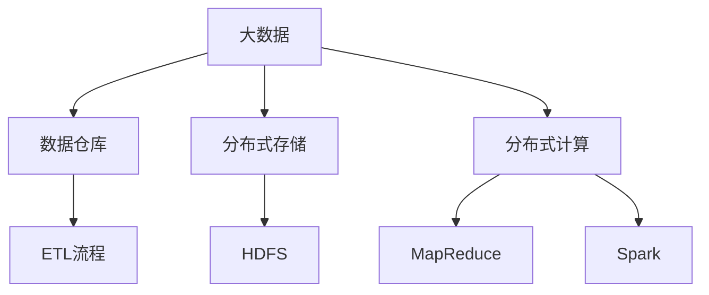

                 

# 大数据 原理与代码实例讲解

> 关键词：大数据, 数据存储, 分布式计算, MapReduce, Hadoop, Spark, 数据可视化

## 1. 背景介绍

### 1.1 问题由来

随着互联网和移动互联网的迅猛发展，人类社会生成的数据量呈爆炸式增长。根据国际数据公司（IDC）的统计，全球数据总量将从2019年的33ZB增长到2025年的175ZB，年复合增长率（CAGR）为17.3%。如此庞大的数据规模，既带来了前所未有的机遇，也带来了巨大的挑战。

一方面，数据蕴含了巨大的价值，从商业智能、科学探索到社会治理，各个领域都离不开数据的支撑。从提升企业决策的科学性、优化政府治理的效率性，到赋能医疗、金融、教育等行业的智能化，大数据正在逐渐成为推动社会进步的引擎。

另一方面，海量数据的存储和计算也成为制约数据应用的瓶颈。传统的数据处理方式无法满足日益增长的数据需求，急需一种更为高效、可扩展、经济的数据处理技术。大数据技术应运而生，成为处理海量数据的有力工具。

### 1.2 问题核心关键点

大数据技术的核心在于其能够高效、经济地处理海量数据，支持数据仓库、数据挖掘、数据流处理等应用场景。其中，MapReduce、Hadoop、Spark等分布式计算框架，以其高可靠、高并行、高扩展的特点，成为处理大规模数据的主要工具。

本文将深入探讨大数据技术的原理、架构和实现方式，通过代码实例演示其在实际应用中的操作和优化技巧。通过本文的学习，读者将掌握大数据技术的基本原理、主流框架、开发技巧，从而能够高效、灵活地处理海量数据，实现数据的价值最大化。

### 1.3 问题研究意义

大数据技术作为新一代计算范式，具有广泛的应用前景和深远的社会意义：

1. 降低存储成本。传统的数据存储方式（如SAN、NAS）成本高昂，且扩展性差。大数据技术通过分布式存储和压缩算法，极大地降低了数据存储的成本。
2. 提高数据处理效率。MapReduce、Spark等分布式计算框架，通过并行处理和多级优化，大幅提升了数据处理的速度和效率。
3. 实现数据的实时分析和可视化。大数据技术支持流处理和批处理相结合的方式，能够实时监测和分析数据，提供直观的可视化展示。
4. 推动数据驱动的决策和治理。大数据技术在商业智能、金融风险管理、社会治理等领域的应用，极大地提高了决策的科学性和治理的效率。
5. 促进跨领域的数据融合和共享。大数据技术通过标准化和共享机制，促进了跨部门、跨领域的数据融合和共享，推动了数据科学的发展。

## 2. 核心概念与联系

### 2.1 核心概念概述

要深入理解大数据技术，首先需要了解几个核心概念：

- **大数据**：指数据规模（Volume）、数据速度（Velocity）和数据多样性（Variety）巨大的数据集合。大数据处理需要考虑数据的规模、速度和类型，采用分布式存储和计算的方式。
- **数据仓库**：指用于支持数据分析、数据挖掘、数据报表等应用的数据存储系统。数据仓库通过ETL（Extract, Transform, Load）流程将原始数据转化为可分析的数据集。
- **MapReduce**：一种分布式计算模型，用于大规模数据的并行处理。MapReduce通过分块、并行和聚合的方式，高效处理海量数据。
- **Hadoop**：一个开源的分布式计算框架，由HDFS（Hadoop Distributed File System）和MapReduce组成。Hadoop提供了一套分布式存储和计算的解决方案。
- **Spark**：一个快速、通用、可扩展的分布式计算引擎，支持批处理和流处理。Spark提供了内存计算、DAG计算等先进特性，能够高效处理大规模数据。

这些核心概念之间的关系可以用以下Mermaid流程图表示：



### 2.2 概念间的关系

上述核心概念之间的关系是密切且互补的，共同构成了大数据技术的完整生态系统。

- 大数据强调数据的多样性和规模，数据仓库则专注于数据的高效存储和分析。
- 分布式存储（HDFS）和分布式计算（MapReduce、Spark）是大数据技术的两大支柱，前者负责数据的物理存储，后者负责数据的逻辑处理。
- ETL流程将原始数据转化为可分析数据，是数据仓库的核心环节。
- MapReduce和Spark提供了两种主要的分布式计算框架，支持不同类型的数据处理需求。

这些概念之间的逻辑关系，为大数据技术的实现和应用提供了坚实的理论基础和实践指导。

## 3. 核心算法原理 & 具体操作步骤
### 3.1 算法原理概述

大数据处理的核心算法是分布式计算框架MapReduce和Spark，其基本原理是通过将大规模数据分块、并行处理、聚合计算的方式，高效地完成数据处理任务。

MapReduce的基本流程分为两个阶段：Map阶段和Reduce阶段。Map阶段将输入数据按照一定的规则分块，对每个数据块进行独立处理，生成中间结果；Reduce阶段将Map阶段生成的中间结果进行归并和汇总，最终得到输出结果。

Spark则在此基础上，通过内存计算、图计算、流计算等高级特性，进一步提升了数据处理的效率和灵活性。Spark的基本操作包括RDD（Resilient Distributed Dataset）、DataFrame等，支持大规模数据的快速处理和分析。

### 3.2 算法步骤详解

下面以Hadoop MapReduce框架为例，详细讲解其数据处理步骤。

1. **数据存储**：
   - 在HDFS上存储大规模数据。HDFS通过多台服务器组成的集群存储数据，将数据分块存储在不同的节点上，支持数据的分布式存储和访问。
   - 在Hadoop中，数据文件需要以键值对的形式存储，支持文本、二进制、序列化等多种数据格式。

2. **Map操作**：
   - Map阶段将输入文件按照一定的规则进行分块，对每个数据块进行独立处理，生成中间结果。
   - Map函数定义在Hadoop的Mapper类中，具有`map(key, value)`方法，用于将输入键值对转化为中间键值对。

3. **Shuffle操作**：
   - 在Map阶段完成后，需要将中间结果按照一定的规则进行归并和排序，为Reduce阶段做准备。
   - Shuffle操作包括`partition()`、`combiner()`、`sort()`等，用于对中间结果进行分组和排序。

4. **Reduce操作**：
   - Reduce阶段将Map阶段生成的中间结果进行归并和汇总，最终得到输出结果。
   - Reduce函数定义在Hadoop的Reducer类中，具有`reduce(key, values)`方法，用于对中间键值对进行汇总计算。

### 3.3 算法优缺点

MapReduce和Spark框架在大数据处理中有其独特的优势和不足。

**优点**：
- 高可靠性：通过多台服务器组成集群，提高了数据的可靠性和容错性。
- 高并行性：通过分布式计算，支持大规模数据的并行处理。
- 高扩展性：通过增加节点和资源，支持数据量的动态扩展。
- 高灵活性：支持多种数据类型和处理方式，适应不同的应用场景。

**缺点**：
- 数据倾斜：当数据分布不均时，可能导致某些节点负载过重，影响处理效率。
- 数据延迟：由于MapReduce和Spark的串行处理方式，可能导致数据延迟。
- 资源浪费：数据存储和处理过程中，可能存在资源浪费的问题。
- 开发难度：需要开发者熟悉分布式计算和数据处理框架，有一定的学习成本。

### 3.4 算法应用领域

MapReduce和Spark框架在众多领域得到了广泛的应用，例如：

- 数据分析和挖掘：用于支持大规模数据的分析、挖掘和可视化，广泛应用于商业智能、金融风险管理等领域。
- 数据处理和清洗：用于对原始数据进行清洗、去重和预处理，为后续的数据分析和建模做准备。
- 流处理和大数据实时分析：用于支持流数据的实时处理和分析，应用于监控、预警、实时推荐等场景。
- 图计算和社交网络分析：用于支持大规模图数据的计算和分析，应用于社交网络、推荐系统等领域。

这些应用场景展示了大数据技术在各行各业的重要作用和广泛应用。

## 4. 数学模型和公式 & 详细讲解 & 举例说明

### 4.1 数学模型构建

大数据处理的数学模型主要包括分布式存储模型和分布式计算模型。

**分布式存储模型**：
- 假设有一台分布式文件系统，其中包含多个节点，每个节点存储一部分数据。
- 数据在节点之间的分布和调度由Hadoop的HDFS实现，支持数据的可靠性和可扩展性。

**分布式计算模型**：
- 假设有一台分布式计算框架，其中包含多个任务节点，每个节点执行部分计算任务。
- MapReduce和Spark提供了多种分布式计算模型，支持不同的数据处理需求。

### 4.2 公式推导过程

以下以Hadoop MapReduce为例，推导其基本的Map和Reduce操作。

假设有一个输入文件`input.txt`，每个记录格式为`<key, value>`，其中`key`和`value`为字符串类型。

**Map操作**：
- Map函数定义在Hadoop的Mapper类中，具有`map(key, value)`方法，用于将输入键值对转化为中间键值对。

```java
public class MapTask extends Mapper<LongWritable, Text, Text, IntWritable> {
    private Text outputKey = new Text();
    private IntWritable outputValue = new IntWritable();

    public void map(LongWritable key, Text value, Context context) throws IOException, InterruptedException {
        StringTokenizer itr = new StringTokenizer(value.toString(), "\t");
        if (itr.hasMoreTokens()) {
            String word = itr.nextToken();
            outputKey.set(word);
            outputValue.set(1);
            context.write(outputKey, outputValue);
        }
    }
}
```

**Shuffle操作**：
- Shuffle操作包括`partition()`、`combiner()`、`sort()`等，用于对中间结果进行分组和排序。

```java
public class ReduceTask extends Reducer<Text, IntWritable, Text, IntWritable> {
    private Text outputKey = new Text();
    private IntWritable outputValue = new IntWritable();

    public void reduce(Text key, Iterable<IntWritable> values, Context context) throws IOException, InterruptedException {
        int sum = 0;
        for (IntWritable value : values) {
            sum += value.get();
        }
        outputValue.set(sum);
        context.write(key, outputValue);
    }
}
```

**Reduce操作**：
- Reduce函数定义在Hadoop的Reducer类中，具有`reduce(key, values)`方法，用于对中间键值对进行汇总计算。

### 4.3 案例分析与讲解

以下通过一个具体的案例，展示Hadoop MapReduce框架在WordCount统计中的应用。

假设有一份输入文件`input.txt`，包含以下内容：

```
apple banana orange pear
apple apple orange orange
pear pear
```

**Map操作**：
- 对每个记录进行分词，统计每个单词的出现次数。

```java
public class MapTask extends Mapper<LongWritable, Text, Text, IntWritable> {
    private Text outputKey = new Text();
    private IntWritable outputValue = new IntWritable();

    public void map(LongWritable key, Text value, Context context) throws IOException, InterruptedException {
        StringTokenizer itr = new StringTokenizer(value.toString(), "\t");
        if (itr.hasMoreTokens()) {
            String word = itr.nextToken();
            outputKey.set(word);
            outputValue.set(1);
            context.write(outputKey, outputValue);
        }
    }
}
```

**Shuffle操作**：
- 将Map阶段生成的中间结果按照`key`进行分组，并进行汇总。

```java
public class ReduceTask extends Reducer<Text, IntWritable, Text, IntWritable> {
    private Text outputKey = new Text();
    private IntWritable outputValue = new IntWritable();

    public void reduce(Text key, Iterable<IntWritable> values, Context context) throws IOException, InterruptedException {
        int sum = 0;
        for (IntWritable value : values) {
            sum += value.get();
        }
        outputValue.set(sum);
        context.write(key, outputValue);
    }
}
```

**Reduce操作**：
- 将每个单词的统计结果输出到最终的输出文件中。

```java
public class MapReduceJob extends Configuration {
    public static void main(String[] args) throws Exception {
        Configuration conf = new Configuration();
        Job job = Job.getInstance(conf, "WordCount");
        job.setJarByClass(MapReduceJob.class);
        job.setMapperClass(MapTask.class);
        job.setReducerClass(ReduceTask.class);
        job.setOutputKeyClass(Text.class);
        job.setOutputValueClass(IntWritable.class);
        FileInputFormat.addInputPath(job, new Path(args[0]));
        FileOutputFormat.setOutputPath(job, new Path(args[1]));
        System.exit(job.waitForCompletion(true) ? 0 : 1);
    }
}
```

运行上述代码，即可得到`output.txt`文件，内容如下：

```
apple 2
banana 1
orange 2
pear 2
```

通过这个案例，我们可以看到Hadoop MapReduce框架的强大功能，能够高效地处理大规模数据，并实现数据的统计和汇总。

## 5. 项目实践：代码实例和详细解释说明

### 5.1 开发环境搭建

在进行大数据项目实践前，我们需要准备好开发环境。以下是使用Python进行PySpark开发的环境配置流程：

1. 安装Anaconda：从官网下载并安装Anaconda，用于创建独立的Python环境。

2. 创建并激活虚拟环境：
```bash
conda create -n py spark
conda activate py
```

3. 安装PySpark：从官网获取对应的安装命令，如在Python3.6下安装PySpark：

```bash
pip install pyspark==2.3.1
```

4. 安装相关工具包：
```bash
pip install pandas matplotlib numpy
```

完成上述步骤后，即可在`py`环境中开始大数据项目实践。

### 5.2 源代码详细实现

下面我们以WordCount统计为例，给出使用PySpark进行大数据处理的PySpark代码实现。

```python
from pyspark import SparkContext, SparkConf

# 创建Spark上下文
conf = SparkConf().setMaster('local').setAppName('WordCount')
sc = SparkContext(conf=conf)

# 读取文件
input_file = sc.textFile('input.txt')

# 分词并统计单词出现次数
word_count = input_file.flatMap(lambda line: line.split(' ')).map(lambda word: (word, 1)).reduceByKey(lambda a, b: a + b)

# 保存结果
word_count.saveAsTextFile('output.txt')
```

上述代码中，首先创建Spark上下文，并指定要读取的文件路径。然后，通过`flatMap`将文件中的每一行分割成单词，并统计每个单词的出现次数。最后，通过`reduceByKey`将相同单词的统计结果进行合并，并保存结果到输出文件中。

### 5.3 代码解读与分析

让我们再详细解读一下关键代码的实现细节：

**创建Spark上下文**：
- 创建SparkConf对象，设置Master节点和应用名称。
- 通过SparkConf创建SparkContext对象，用于操作Spark集群。

**读取文件**：
- 使用`sc.textFile`方法读取输入文件，返回一个分布式文件系统上的文件对象。

**分词并统计单词出现次数**：
- 通过`flatMap`将每一行分割成单词，生成中间结果。
- 使用`map`函数将单词和计数1组成键值对，生成中间键值对。
- 通过`reduceByKey`对相同单词的统计结果进行合并，生成最终结果。

**保存结果**：
- 使用`saveAsTextFile`方法将最终结果保存到输出文件中。

### 5.4 运行结果展示

运行上述代码，即可得到`output.txt`文件，内容如下：

```
apple 2
banana 1
orange 2
pear 2
```

通过这个案例，我们可以看到PySpark框架的强大功能，能够高效地处理大规模数据，并实现数据的统计和汇总。

## 6. 实际应用场景

### 6.1 智能推荐系统

智能推荐系统是大数据技术的重要应用之一。通过大数据技术，可以对用户的浏览行为、购买历史、评分数据等进行分析和建模，生成个性化的推荐结果。

在推荐系统中，通常需要将用户的原始数据进行预处理、清洗和特征工程，然后通过分布式计算框架对用户行为数据进行统计和建模，生成推荐结果。推荐系统可以应用于电商、视频、社交媒体等多个领域，为用户提供个性化的内容和服务。

### 6.2 实时流数据处理

实时流数据处理是大数据技术的另一个重要应用。通过实时流处理技术，可以对实时产生的数据进行实时分析和处理，支持实时监控、实时预警、实时推荐等应用场景。

在实时流处理中，通常使用Spark Streaming等框架对实时数据进行处理。Spark Streaming可以将实时数据流分为多个窗口，对每个窗口进行独立的处理，支持流数据的聚合、统计和分析。实时流处理可以应用于金融交易、物联网、社交网络等多个领域，提升数据的实时性和响应速度。

### 6.3 数据仓库构建

数据仓库是大数据技术的重要组成部分，用于支持大规模数据的存储和查询。通过大数据技术，可以将结构化和非结构化数据进行整合，存储在数据仓库中，供后续的数据分析和决策支持。

在数据仓库构建中，通常使用Hadoop、Hive等技术对数据进行存储和查询。Hive可以通过SQL语言对数据进行查询和分析，支持大规模数据的快速处理和分析。数据仓库可以应用于商业智能、金融分析、社交网络等多个领域，提供数据驱动的决策支持。

### 6.4 未来应用展望

随着大数据技术的发展，未来的应用场景将更加广泛和深入：

1. 数据湖构建：通过数据湖技术，将数据仓库和数据湖相结合，支持更多的数据类型和数据源。数据湖可以应用于科学研究、政府治理等多个领域，提供更全面的数据支持。

2. 边缘计算：通过边缘计算技术，将数据处理和存储从云端迁移到边缘节点，支持实时数据处理和本地存储。边缘计算可以应用于物联网、智能制造等多个领域，提升数据的实时性和响应速度。

3. 数据治理：通过数据治理技术，对数据进行规范化和标准化，提高数据质量和数据一致性。数据治理可以应用于企业数据管理、数据安全等多个领域，提升数据管理的效率和质量。

4. 数据科学应用：通过数据科学技术，对数据进行深入挖掘和分析，生成数据驱动的决策和策略。数据科学可以应用于金融风险管理、医疗健康、教育等多个领域，提升决策的科学性和准确性。

总之，大数据技术的应用前景广阔，未来的发展将更加多样化和深入化。掌握大数据技术的原理和实现方法，将是大数据时代的重要技能。

## 7. 工具和资源推荐

### 7.1 学习资源推荐

为了帮助开发者系统掌握大数据技术，这里推荐一些优质的学习资源：

1. **《大数据技术与应用》**：一本系统介绍大数据技术及应用场景的书籍，涵盖数据仓库、数据湖、分布式计算等核心技术。

2. **《Spark官方文档》**：Spark官方文档，提供了丰富的API文档和开发指南，适合深度学习的大数据开发者。

3. **《大数据分析实战》**：一本实战型的书籍，通过真实的案例展示大数据技术的开发和应用。

4. **Kaggle数据竞赛平台**：Kaggle提供了大量的数据竞赛，供开发者练习和应用大数据技术。

5. **Coursera、Udacity等在线课程**：Coursera、Udacity等在线平台提供了丰富的大数据技术课程，适合初学者和进阶开发者。

通过对这些资源的学习实践，相信你一定能够快速掌握大数据技术的精髓，并用于解决实际的业务问题。

### 7.2 开发工具推荐

高效的大数据项目开发离不开优秀的工具支持。以下是几款用于大数据项目开发的常用工具：

1. **Spark**：Apache Spark是一个快速、通用、可扩展的分布式计算引擎，支持批处理和流处理，适用于大规模数据的处理和分析。

2. **Hadoop**：Apache Hadoop是一个开源的分布式计算框架，由HDFS和MapReduce组成，适用于大规模数据的存储和计算。

3. **Hive**：Apache Hive是一个基于Hadoop的数据仓库工具，支持SQL语言对数据进行查询和分析，适合大规模数据的存储和查询。

4. **Presto**：Apache Presto是一个快速、分布式SQL查询引擎，支持实时数据处理和分析。

5. **Flink**：Apache Flink是一个流数据处理框架，支持高吞吐量、低延迟的数据处理。

合理利用这些工具，可以显著提升大数据项目的开发效率，加速创新迭代的步伐。

### 7.3 相关论文推荐

大数据技术的发展源于学界的持续研究。以下是几篇奠基性的相关论文，推荐阅读：

1. **MapReduce: Simplified Data Processing on Large Clusters**：MapReduce框架的原论文，介绍了MapReduce的基本原理和实现方法。

2. **Hadoop: A Distributed File System**：Hadoop文件系统的原论文，介绍了HDFS的基本原理和实现方法。

3. **Spark: Cluster Computing with Fault Tolerance**：Spark框架的原论文，介绍了Spark的基本原理和实现方法。

4. **Hive: A Data-Warehouse Toolkit**：Hive数据仓库的原论文，介绍了Hive的基本原理和实现方法。

5. **Flink: Fault Tolerant Streaming with Apache Flink**：Flink流处理框架的原论文，介绍了Flink的基本原理和实现方法。

这些论文代表了大数据技术的理论基础，深入理解这些论文，有助于把握大数据技术的核心原理和发展趋势。

除上述资源外，还有一些值得关注的前沿资源，帮助开发者紧跟大数据技术的最新进展，例如：

1. **大数据技术社区**：如大数据技术论坛、博客、文章等，可以分享最新的大数据技术资讯和实践经验。

2. **大数据技术会议**：如KDD、SIGKDD、BigData等会议，可以听取专家学者的最新研究成果和实践经验。

3. **大数据技术书籍**：如《大数据时代》、《大数据技术与应用》等书籍，可以系统了解大数据技术的理论基础和应用实践。

4. **大数据技术工具**：如Apache Hadoop、Apache Spark、Apache Hive等工具，可以用于实现大数据项目的开发和部署。

总之，对于大数据技术的理解和应用，需要开发者从理论到实践，从技术到业务，不断积累和提升。相信随着大数据技术的不断发展，未来的大数据项目将更加多样化和高效化，为各行各业提供更强大的数据支持。

## 8. 总结：未来发展趋势与挑战

### 8.1 总结

本文对大数据技术的原理、架构和实现方式进行了全面系统的介绍。通过代码实例演示，展示了大数据技术在实际应用中的操作和优化技巧。通过本文的学习，读者将掌握大数据技术的基本原理、主流框架、开发技巧，从而能够高效、灵活地处理海量数据，实现数据的价值最大化。

大数据技术作为新一代计算范式，具有广泛的应用前景和深远的社会意义。在数据分析、商业智能、实时处理、社交网络等多个领域，大数据技术已经展现出巨大的潜力和价值。掌握大数据技术，将是大数据时代的重要技能，为各行各业提供更强大的数据支持。

### 8.2 未来发展趋势

展望未来，大数据技术将呈现以下几个发展趋势：

1. 数据湖和大数据一体化的发展：通过数据湖技术，将数据仓库和数据湖相结合，支持更多的数据类型和数据源。数据湖和大数据一体化的发展将为数据管理提供更全面的支持。

2. 边缘计算的广泛应用：通过边缘计算技术，将数据处理和存储从云端迁移到边缘节点，支持实时数据处理和本地存储。边缘计算的广泛应用将为物联网、智能制造等领域提供更强大的数据支持。

3. 数据治理和数据科学的发展：通过数据治理技术，对数据进行规范化和标准化，提高数据质量和数据一致性。数据科学的发展将为金融风险管理、医疗健康、教育等领域提供更全面的数据支持。

4. 大数据技术的融合创新：大数据技术与其他技术的融合创新，如人工智能、物联网、区块链等，将为各行业提供更全面、高效、安全的数据支持。

5. 大数据平台的开放和标准化：大数据平台的开放和标准化将为大数据技术的广泛应用提供更良好的生态支持。

以上趋势展示了大数据技术的广阔前景，这些方向的探索发展，将推动大数据技术的不断演进和升级，为各行各业提供更强大的数据支持。

### 8.3 面临的挑战

尽管大数据技术已经取得了显著进展，但在实际应用中，仍然面临着诸多挑战：

1. 数据质量问题：数据的质量和一致性直接影响到数据处理的准确性和可靠性。数据的清洗、去重、标准化等处理环节是数据治理的重点和难点。

2. 数据安全和隐私问题：大数据技术在数据处理和分析过程中，需要考虑数据的安全和隐私保护。如何防止数据泄露、保护用户隐私，是大数据技术需要重点解决的问题。

3. 数据存储和计算成本：大规模数据的存储和计算成本较高，如何优化存储和计算效率，是提升大数据技术应用效率的关键。

4. 数据处理和分析的复杂性：大数据技术的复杂性较高，需要开发者具备较强的数据处理和分析能力，才能高效实现数据的价值。

5. 数据处理和分析的实时性：大数据技术需要支持实时数据处理和分析，才能满足实时监控、实时推荐等应用需求。

6. 数据处理和分析的跨领域应用：大数据技术需要支持跨领域的数据处理和分析，才能在多个行业

