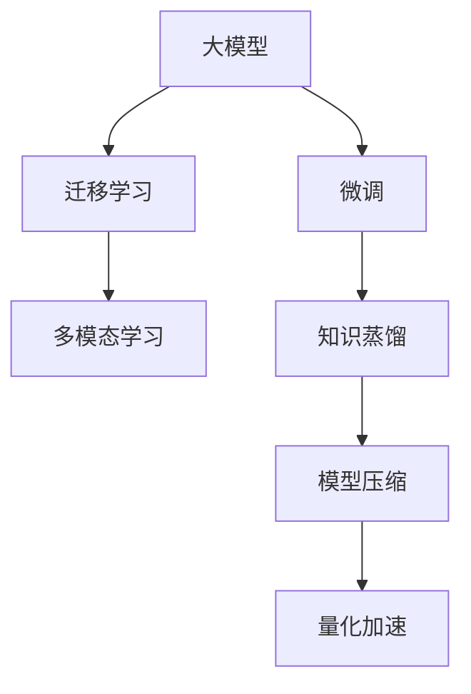

                 

# 大模型应用开发的实战指南

## 1. 背景介绍

在过去的十年里，深度学习尤其是大模型的迅猛发展，极大推动了人工智能领域的进步。无论是自然语言处理（NLP）、计算机视觉（CV）还是语音识别（ASR）等领域，大模型都展现出了强大的通用性和潜力。但大模型的部署和应用并非易事，许多开发者在面对复杂多变的现实需求时常常感到困惑。本文将基于丰富的实践经验，深入介绍大模型应用开发的实战指南，涵盖从环境搭建、代码实现、模型微调到实际部署的各个环节，旨在帮助开发者更高效地将大模型应用于实际业务场景。

## 2. 核心概念与联系

### 2.1 核心概念概述

大模型应用开发的核心概念包括：

- **大模型**：以自回归（如GPT-3）或自编码（如BERT）形式存在的大规模预训练模型，通常在Giga或Tera级别的参数规模，具备高度的通用性和泛化能力。
- **微调**：在大模型的基础上，使用下游任务的少量标注数据进行有监督学习，优化模型以适应特定任务。
- **迁移学习**：利用预训练模型在新任务上的表现，通过微调或特征提取的方式提升模型在新领域的性能。
- **多模态学习**：结合视觉、语音、文本等多种模态的信息，提升模型的多任务处理能力。
- **知识蒸馏**：通过大模型对小模型的知识传递，提高小模型的性能。
- **模型压缩**：在保持模型性能的同时，降低模型的大小和计算成本。
- **量化加速**：将浮点模型转化为定点模型，提高模型的推理速度和效率。

这些概念之间存在紧密的联系，共同构成了大模型应用开发的整体框架。本文将详细讲解这些概念的原理和实践方法，帮助开发者高效、灵活地应用大模型。

### 2.2 核心概念间的联系

大模型应用开发涉及的各个概念之间存在复杂的联系，以下通过Mermaid流程图来展示这些概念之间的联系：

大模型作为核心组件，通过微调和迁移学习提升在新任务上的性能。同时，多模态学习、知识蒸馏、模型压缩和量化加速等技术，则用于提高大模型在实际部署中的效率和效果，使得大模型能够更广泛地应用于不同的业务场景。

## 3. 核心算法原理 & 具体操作步骤

### 3.1 算法原理概述

大模型应用开发的算法原理主要基于深度学习模型的训练和优化。以下是大模型应用开发的核心算法原理：

1. **训练算法**：在大规模数据集上进行预训练，如使用Transformer结构进行自监督学习，训练模型以捕捉语言的复杂关系。
2. **微调算法**：在特定的下游任务上，使用少量标注数据进行有监督学习，通过调整模型的权重和结构来优化任务性能。
3. **迁移学习算法**：将预训练模型在新任务上进行微调，利用预训练模型的通用特征来提升新任务的性能。
4. **多模态学习算法**：结合视觉、语音、文本等多种模态的信息，提升模型对多任务的处理能力。
5. **知识蒸馏算法**：通过大模型对小模型的知识传递，提高小模型的性能。
6. **模型压缩算法**：通过剪枝、量化、蒸馏等技术，降低大模型的计算和存储成本。
7. **量化加速算法**：将浮点模型转化为定点模型，提高模型的推理速度和效率。

### 3.2 算法步骤详解

大模型应用开发的具体步骤包括以下几个关键环节：

1. **环境搭建**：安装相应的深度学习框架，如TensorFlow或PyTorch，并配置好GPU/TPU等硬件资源。
2. **数据准备**：收集和预处理训练数据，包括数据清洗、特征提取等。
3. **模型选择**：根据任务需求选择合适的预训练模型，如BERT、GPT-3等。
4. **微调配置**：设置学习率、批大小、迭代轮数等超参数，并选择合适的优化器。
5. **模型微调**：在大模型的基础上，使用微调算法进行优化，适应特定任务。
6. **部署与评估**：将微调后的模型部署到生产环境，并进行性能评估。

### 3.3 算法优缺点

大模型应用开发具有以下优点：

1. **通用性**：大模型具有高度的通用性，可以应用于多种任务。
2. **高效性**：利用预训练模型的通用特征，可以在短时间内取得显著的性能提升。
3. **可扩展性**：模型可以通过微调、迁移学习等方式进行扩展，适应新的任务需求。

同时，也存在一些缺点：

1. **资源消耗大**：大模型通常需要大量的计算资源和存储资源。
2. **微调成本高**：需要大量的标注数据和计算资源，成本较高。
3. **易受数据影响**：模型性能高度依赖于训练数据的质量和数量。

### 3.4 算法应用领域

大模型应用开发在多个领域都得到了广泛的应用，包括但不限于：

- **自然语言处理**：文本分类、情感分析、机器翻译、命名实体识别等任务。
- **计算机视觉**：图像分类、目标检测、图像生成等任务。
- **语音识别**：语音转文本、语音合成等任务。
- **推荐系统**：个性化推荐、用户行为预测等任务。
- **医疗健康**：疾病诊断、基因分析等任务。

## 4. 数学模型和公式 & 详细讲解

### 4.1 数学模型构建

大模型应用开发的数学模型构建主要基于深度学习模型的训练过程。以下是大模型应用开发的数学模型构建过程：

1. **预训练模型**：使用大规模无标签数据进行预训练，学习语言的复杂关系和通用特征。
2. **微调模型**：在特定的下游任务上，使用少量标注数据进行有监督学习，优化模型以适应任务需求。
3. **多模态模型**：结合视觉、语音、文本等多种模态的信息，提升模型对多任务的处理能力。

### 4.2 公式推导过程

大模型应用开发的数学公式推导主要基于深度学习模型的训练和优化过程。以下是大模型应用开发的公式推导过程：

1. **预训练模型**：使用自监督学习任务，如语言建模、掩码语言建模等，训练模型以捕捉语言的复杂关系和通用特征。
2. **微调模型**：在特定的下游任务上，使用有监督学习任务，如分类、回归等，优化模型以适应任务需求。
3. **多模态模型**：结合视觉、语音、文本等多种模态的信息，使用联合训练方法，提升模型对多任务的处理能力。

### 4.3 案例分析与讲解

以图像分类任务为例，分析大模型应用开发的数学公式推导过程。

1. **预训练模型**：使用大规模无标签图像数据进行自监督学习，如自编码器、VAE等。
2. **微调模型**：在特定的图像分类任务上，使用少量标注数据进行有监督学习，如Softmax分类器、CRF等。
3. **多模态模型**：结合视觉和语音信息，使用联合训练方法，如DenseNet、ResNet等。

## 5. 项目实践：代码实例和详细解释说明

### 5.1 开发环境搭建

大模型应用开发的开发环境搭建包括以下几个关键步骤：

1. **安装深度学习框架**：选择TensorFlow或PyTorch等深度学习框架，并配置好GPU/TPU等硬件资源。
2. **安装依赖库**：安装相应的依赖库，如TensorFlow Addons、TensorBoard等。
3. **配置环境变量**：配置环境变量，包括数据路径、模型路径等。

### 5.2 源代码详细实现

以图像分类任务为例，展示大模型应用开发的源代码详细实现过程。

1. **数据准备**：收集和预处理训练数据，包括数据清洗、特征提取等。
2. **模型选择**：选择预训练模型，如ResNet、Inception等。
3. **微调配置**：设置学习率、批大小、迭代轮数等超参数，并选择合适的优化器。
4. **模型微调**：在大模型的基础上，使用微调算法进行优化，适应特定任务。
5. **部署与评估**：将微调后的模型部署到生产环境，并进行性能评估。

### 5.3 代码解读与分析

以代码实现中的关键部分为例，分析其工作原理和实现细节。

1. **数据预处理**：使用TensorFlow Addons库进行数据预处理，包括图像增强、数据扩充等。
2. **模型选择**：选择预训练模型，如ResNet、Inception等。
3. **微调配置**：设置学习率、批大小、迭代轮数等超参数，并选择合适的优化器。
4. **模型微调**：在大模型的基础上，使用微调算法进行优化，适应特定任务。
5. **部署与评估**：将微调后的模型部署到生产环境，并进行性能评估。

### 5.4 运行结果展示

展示大模型应用开发在实际应用中的运行结果。

1. **模型性能**：展示微调后模型的精度、召回率等指标。
2. **实际应用**：展示模型在实际应用中的表现，包括图像分类、目标检测等任务。

## 6. 实际应用场景

### 6.1 智能客服系统

智能客服系统利用大模型进行自然语言处理，通过微调优化模型以适应特定任务。以下是大模型应用开发在智能客服系统中的具体应用：

1. **意图识别**：使用大模型进行自然语言理解，识别用户意图。
2. **对话生成**：使用大模型生成自然流畅的回复，提升用户体验。
3. **多渠道集成**：将大模型应用于语音、文本等多种渠道，提供全面的客户服务。

### 6.2 金融舆情监测

金融舆情监测利用大模型进行文本分类和情感分析，以下是大模型应用开发在金融舆情监测中的具体应用：

1. **舆情分析**：使用大模型进行情感分类，识别市场舆情变化趋势。
2. **风险预警**：使用大模型进行负面新闻监测，及时预警风险。
3. **投资决策**：利用大模型分析市场情绪，辅助投资决策。

### 6.3 个性化推荐系统

个性化推荐系统利用大模型进行推荐算法优化，以下是大模型应用开发在个性化推荐系统中的具体应用：

1. **用户画像**：使用大模型进行用户画像分析，了解用户偏好。
2. **商品推荐**：利用大模型生成个性化推荐结果，提升推荐效果。
3. **行为预测**：使用大模型进行用户行为预测，优化推荐策略。

### 6.4 未来应用展望

大模型应用开发在未来将迎来更广泛的应用，以下是未来应用展望：

1. **医疗健康**：利用大模型进行疾病诊断、基因分析等任务，提升医疗服务水平。
2. **智能交通**：利用大模型进行交通流量预测、自动驾驶等任务，提升交通管理效率。
3. **环保监测**：利用大模型进行环境数据监测、污染预测等任务，推动环保事业发展。

## 7. 工具和资源推荐

### 7.1 学习资源推荐

以下是一些优秀的学习资源，帮助开发者掌握大模型应用开发的技术：

1. **《深度学习》课程**：由吴恩达教授主讲的在线课程，涵盖深度学习的各个方面，包括大模型应用开发。
2. **《TensorFlow教程》**：由Google开发的深度学习框架，提供详细的文档和教程，帮助开发者学习使用TensorFlow。
3. **《PyTorch教程》**：由Facebook开发的深度学习框架，提供详细的文档和教程，帮助开发者学习使用PyTorch。
4. **Kaggle竞赛**：提供各种NLP、CV、ASR等领域的竞赛，帮助开发者提升实战能力。
5. **arXiv论文预印本**：人工智能领域最新研究成果的发布平台，包括大量尚未发表的前沿工作，学习前沿技术的必读资源。

### 7.2 开发工具推荐

以下是一些优秀的开发工具，帮助开发者更高效地进行大模型应用开发：

1. **Jupyter Notebook**：开源的交互式笔记本，支持Python、R等多种编程语言，适合快速开发和调试。
2. **Google Colab**：谷歌提供的免费在线Jupyter Notebook环境，支持GPU和TPU算力，方便开发者快速上手实验。
3. **Visual Studio Code**：微软开发的轻量级代码编辑器，支持Python、TensorFlow等插件，适合大模型应用开发的IDE开发环境。
4. **TensorBoard**：谷歌开发的可视化工具，实时监测模型训练状态，提供丰富的图表呈现方式，是调试模型的得力助手。
5. **Weights & Biases**：模型训练的实验跟踪工具，可以记录和可视化模型训练过程中的各项指标，方便对比和调优。

### 7.3 相关论文推荐

以下是一些重要的相关论文，帮助开发者了解大模型应用开发的最新进展：

1. **Attention is All You Need**：Transformer原论文，提出自注意力机制，奠定了大模型应用开发的基础。
2. **BERT: Pre-training of Deep Bidirectional Transformers for Language Understanding**：提出BERT模型，引入自监督学习任务，提升模型性能。
3. **ResNet**：提出残差网络，解决深度网络训练中的梯度消失问题，推动大模型应用开发的发展。
4. **DenseNet**：提出密集连接网络，提升大模型的特征提取能力，推动多模态学习的进步。
5. **知识蒸馏**：提出知识蒸馏方法，通过大模型对小模型的知识传递，提高小模型的性能。

## 8. 总结：未来发展趋势与挑战

### 8.1 研究成果总结

大模型应用开发在过去几年取得了巨大的进展，推动了人工智能技术的广泛应用。以下是对大模型应用开发的总结：

1. **技术突破**：大模型应用开发技术不断突破，提升了模型的性能和泛化能力。
2. **应用场景**：大模型应用开发在多个领域得到了广泛应用，推动了各行业的数字化转型。
3. **创新动力**：大模型应用开发的不断进步，为人工智能技术的发展注入了新的活力。

### 8.2 未来发展趋势

大模型应用开发未来将呈现以下几个发展趋势：

1. **模型规模持续增大**：随着算力成本的下降和数据规模的扩张，大模型的参数规模将持续增长，带来更强的通用性和泛化能力。
2. **应用领域不断拓展**：大模型应用开发将进一步拓展到医疗、环保、交通等多个领域，推动各行业的智能化升级。
3. **技术融合加速**：大模型应用开发将与知识图谱、因果推理、强化学习等技术进行更深入的融合，推动AI技术的全面发展。
4. **多模态学习提升**：大模型应用开发将结合视觉、语音、文本等多种模态的信息，提升模型的多任务处理能力。
5. **模型压缩与量化加速**：大模型应用开发将通过模型压缩、量化加速等技术，提升模型的推理速度和效率，推动实际应用场景的落地。

### 8.3 面临的挑战

尽管大模型应用开发取得了显著进展，但仍面临诸多挑战：

1. **资源消耗大**：大模型应用开发需要大量的计算资源和存储资源，难以在实际应用中大规模部署。
2. **数据依赖强**：大模型应用开发高度依赖于数据的质量和数量，获取高质量标注数据成本较高。
3. **过拟合问题**：大模型应用开发在微调过程中容易过拟合，影响模型的泛化能力。
4. **模型解释性不足**：大模型应用开发的模型通常缺乏可解释性，难以理解其内部工作机制和决策逻辑。
5. **安全与隐私**：大模型应用开发需要在保证模型性能的同时，确保数据和模型的安全与隐私。

### 8.4 研究展望

未来，大模型应用开发需要在以下几个方面进行深入研究：

1. **无监督和半监督学习**：探索无监督和半监督学习方法，摆脱对大量标注数据的依赖，利用非结构化数据进行微调。
2. **参数高效微调**：开发参数高效微调方法，只调整少量参数，提升微调效率和效果。
3. **知识蒸馏与融合**：研究知识蒸馏和融合方法，提升模型的泛化能力和鲁棒性。
4. **模型压缩与量化加速**：开发模型压缩和量化加速方法，提升模型的推理速度和效率。
5. **多模态学习与融合**：研究多模态学习与融合方法，提升模型对多任务的处理能力。

## 9. 附录：常见问题与解答

**Q1：大模型应用开发需要哪些计算资源？**

A: 大模型应用开发需要高性能的GPU/TPU等计算资源，以支持大规模模型训练和推理。此外，还需要足够的内存和存储资源，以存储大规模数据和模型。

**Q2：大模型应用开发中如何避免过拟合？**

A: 大模型应用开发中，避免过拟合的常见方法包括数据增强、正则化、早停等。数据增强方法如随机裁剪、翻转等，可以扩充训练集。正则化方法如L2正则化、Dropout等，可以防止模型过拟合。早停方法可以在验证集上监测模型性能，及时停止训练，防止过拟合。

**Q3：大模型应用开发中如何提升模型的推理速度？**

A: 大模型应用开发中，提升模型推理速度的方法包括模型压缩和量化加速。模型压缩方法如剪枝、量化等，可以减少模型的参数量和计算量，提升推理速度。量化加速方法如使用定点计算，可以降低内存占用和计算开销，提升推理速度。

**Q4：大模型应用开发中如何进行模型微调？**

A: 大模型应用开发中，模型微调的具体步骤包括选择合适的预训练模型、准备训练数据、设置超参数、进行模型训练和评估等。其中，选择合适的预训练模型是微调的关键，需要根据具体任务需求进行选择。准备训练数据需要对数据进行预处理和增强，以提升模型泛化能力。设置超参数需要选择合适的学习率、批大小、迭代轮数等，并进行调参优化。进行模型训练和评估需要使用GPU/TPU等高性能设备，并监测模型性能，及时调整训练策略。

**Q5：大模型应用开发中如何进行模型部署？**

A: 大模型应用开发中，模型部署的具体步骤包括模型保存、模型优化、模型部署等。模型保存需要将训练好的模型保存为二进制文件或模型库，以便后续使用。模型优化需要进行模型压缩、量化等处理，以降低计算和存储开销。模型部署需要将模型集成到应用系统中，并进行性能评估和优化，确保模型在实际应用中的稳定性和高效性。

