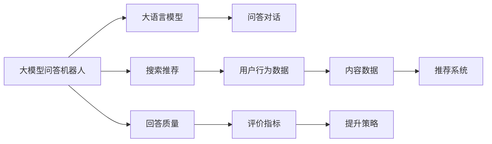
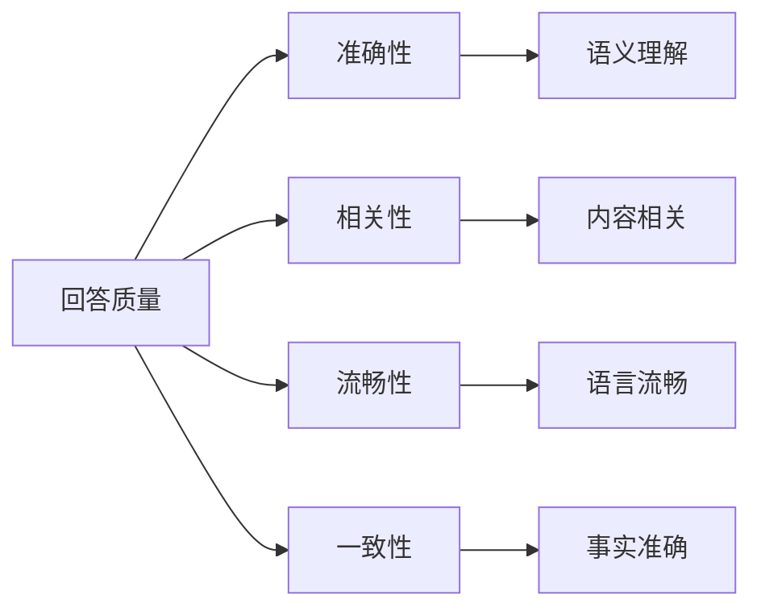
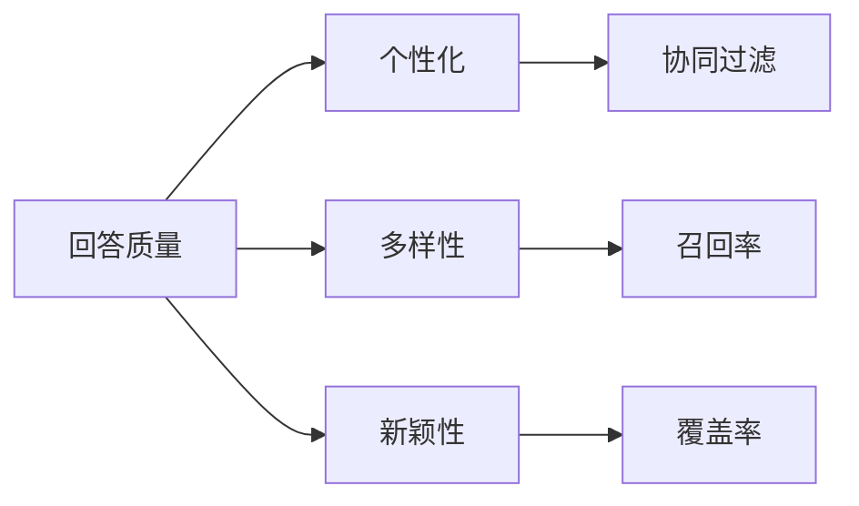
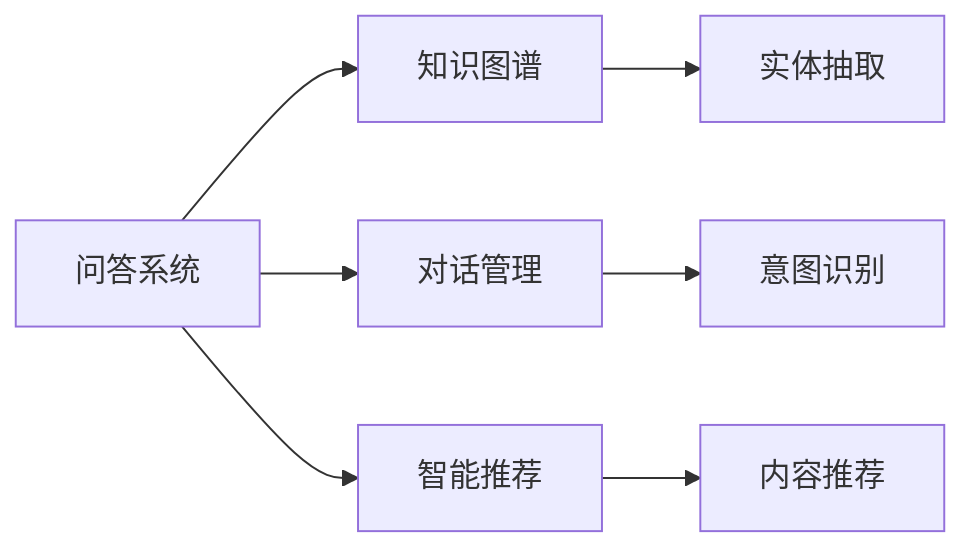
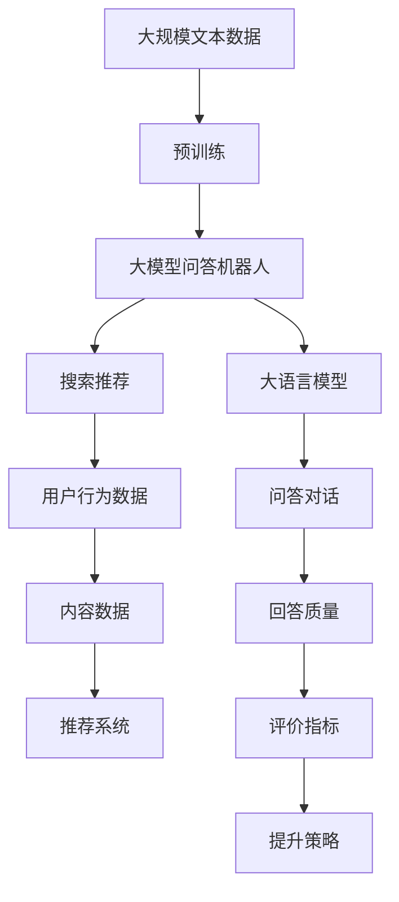

                 

# 大模型问答机器人与传统搜索推荐的回答质量

> 关键词：大模型问答机器人, 搜索推荐, 回答质量, 自然语言处理, 知识图谱, 深度学习, 对话系统

## 1. 背景介绍

### 1.1 问题由来
在信息爆炸的互联网时代，用户面临海量的信息需要快速获取，传统搜索引擎和推荐系统已经无法满足用户对于查询结果准确性、相关性、及时性、个性化等的要求。为应对这一挑战，越来越多的企业开始探索基于大语言模型（Large Language Models, LLMs）的智能问答系统和个性化推荐系统，希望通过大模型的强大语言理解能力和推理能力，解决传统技术难以处理的复杂问题。

### 1.2 问题核心关键点
当前基于大模型的智能问答和推荐系统主要有两种范式：
1. **大模型问答机器人**：通过大模型理解和生成文本，实时解答用户的问题。
2. **基于搜索推荐**：通过对用户行为数据的分析，从已有信息中推荐相关内容。

两种系统在回答质量上有何差异？如何评价回答质量？如何构建更高质量的回答系统？这些问题成为学术界和工业界的热点研究方向。

### 1.3 问题研究意义
构建高质量的问答和推荐系统，对于提升用户体验、提高信息获取效率、驱动内容产业等具有重要意义：

1. **提升用户体验**：高质量的回答能直接解决用户问题，节省时间成本。
2. **提高信息获取效率**：通过智能推荐，快速引导用户到最相关的信息源。
3. **驱动内容产业**：高质量的内容能吸引更多用户参与，提高平台的活跃度和粘性。

本文章旨在对比大模型问答机器人和传统搜索推荐系统在回答质量上的优劣，并对如何提升回答质量提出建议。

## 2. 核心概念与联系

### 2.1 核心概念概述

为更好地理解大模型问答机器人和搜索推荐系统的回答质量，本节将介绍几个密切相关的核心概念：

- **大模型问答机器人**：使用大语言模型作为基础模型的智能问答系统，能够实时解答自然语言问题。
- **搜索推荐**：利用用户行为数据，从大量文本、图片、视频等数据中推荐相关内容。
- **回答质量**：衡量回答系统生成文本的准确性、相关性、流畅性等指标，直接决定用户满意度。
- **自然语言处理**：涉及文本理解、生成、分析等技术，是问答和推荐系统的核心技术之一。
- **知识图谱**：用于存储和组织实体及实体间关系的数据结构，辅助问答系统进行推理。
- **深度学习**：利用多层神经网络进行特征提取和模型训练，提升问答和推荐系统的回答质量。

这些概念之间的逻辑关系可以通过以下Mermaid流程图来展示：



这个流程图展示了大模型问答机器人和搜索推荐系统的核心概念及其之间的关系：

1. 大模型问答机器人使用大语言模型作为基础模型，通过问答对话生成回答。
2. 搜索推荐利用用户行为数据和内容数据，推荐相关内容。
3. 回答质量与评价指标、提升策略密切相关。
4. 各系统通过提升回答质量，提高用户体验和信息获取效率。

### 2.2 概念间的关系

这些核心概念之间存在着紧密的联系，形成了问答和推荐系统的完整生态系统。下面我们通过几个Mermaid流程图来展示这些概念之间的关系。

#### 2.2.1 问答系统的回答质量评估



这个流程图展示了回答质量的五个主要指标：准确性、相关性、流畅性、一致性和事实准确性。这些指标可以通过多种自然语言处理技术进行评价和改进。

#### 2.2.2 推荐系统的回答质量优化



这个流程图展示了推荐系统的回答质量优化策略：个性化、多样性和新颖性。这些策略通过协同过滤、召回率和覆盖率等技术实现。

#### 2.2.3 问答与推荐系统的融合



这个流程图展示了问答与推荐系统的融合方式：通过知识图谱、对话管理和智能推荐等技术，提升问答系统的回答质量。

### 2.3 核心概念的整体架构

最后，我们用一个综合的流程图来展示这些核心概念在大模型问答机器人和搜索推荐系统中的整体架构：



这个综合流程图展示了从预训练到大模型问答机器人和搜索推荐系统的完整过程。大语言模型在预训练的基础上，通过问答对话生成回答，同时通过搜索推荐提供个性化内容。问答与推荐系统通过评价指标和提升策略，不断优化回答质量，提升用户体验和信息获取效率。

## 3. 核心算法原理 & 具体操作步骤
### 3.1 算法原理概述

大模型问答机器人和搜索推荐系统在回答质量上各有优势和劣势。下面将详细探讨这两种系统的算法原理和操作步骤。

**大模型问答机器人**：
- **原理**：大模型问答机器人通过输入用户的问题，利用大语言模型的理解能力和生成能力，实时生成自然语言回答。
- **操作步骤**：
  1. 数据预处理：将用户问题进行分词、标注意图和实体。
  2. 编码生成：将处理后的数据输入大语言模型，生成回答文本。
  3. 后处理：对生成文本进行语法和语义校验，提升流畅性和一致性。
  4. 评价和优化：使用回答质量评价指标，如BLEU、ROUGE等，对回答进行打分，并根据反馈进行优化。

**搜索推荐系统**：
- **原理**：搜索推荐系统通过分析用户历史行为数据，从大量文本、图片、视频等数据中推荐相关内容。
- **操作步骤**：
  1. 数据采集：收集用户的行为数据，如点击、浏览、收藏等。
  2. 数据处理：将行为数据转化为向量表示，使用嵌入技术提取特征。
  3. 匹配推荐：将用户向量与内容向量进行匹配，推荐相关内容。
  4. 效果评估：使用个性化、多样性等指标评估推荐效果，并根据反馈进行调整。

### 3.2 算法步骤详解

**大模型问答机器人**：
- **数据预处理**：使用自然语言处理技术，将用户问题进行分词、标注意图和实体。例如，使用SpaCy进行分词，使用BERT模型进行意图标注。
- **编码生成**：将处理后的数据输入大语言模型，生成回答文本。例如，使用GPT-3进行文本生成。
- **后处理**：对生成文本进行语法和语义校验，提升流畅性和一致性。例如，使用Grammarly进行语法校验，使用Plagiarism Checker进行语义校验。
- **评价和优化**：使用BLEU、ROUGE等指标评价回答质量，根据反馈进行优化。例如，使用BLEU指标计算生成文本与标准答案的匹配度，使用ROUGE指标计算文本相似度。

**搜索推荐系统**：
- **数据采集**：收集用户的行为数据，如点击、浏览、收藏等。例如，使用Python爬虫爬取用户行为数据。
- **数据处理**：将行为数据转化为向量表示，使用嵌入技术提取特征。例如，使用Word2Vec进行词向量编码，使用BERT模型提取特征。
- **匹配推荐**：将用户向量与内容向量进行匹配，推荐相关内容。例如，使用余弦相似度计算用户和内容的相似度，推荐相关内容。
- **效果评估**：使用个性化、多样性等指标评估推荐效果，并根据反馈进行调整。例如，使用协同过滤算法推荐个性化内容，使用多样性算法提升推荐多样性。

### 3.3 算法优缺点

**大模型问答机器人**的优点：
- 回答质量高：大模型能够生成自然流畅、语义准确的文本。
- 实时响应：能够实时解答用户问题，满足用户需求。
- 应用广泛：可以应用于多个领域，如医疗、金融、教育等。

**大模型问答机器人的缺点**：
- 依赖数据：需要大量高质量的问答数据进行训练，数据获取成本高。
- 模型复杂：模型参数量大，训练和推理成本高。
- 上下文理解：缺乏上下文理解能力，对复杂问题处理效果不佳。

**搜索推荐系统**的优点：
- 数据利用率高：可以充分利用已有的海量数据，推荐效果较好。
- 模型简单：模型结构相对简单，训练和推理速度快。
- 适应性强：可以适应多种数据类型，如文本、图片、视频等。

**搜索推荐系统的缺点**：
- 回答质量有限：推荐内容质量受限于数据质量，可能存在不相关或重复内容。
- 个性化不足：难以准确理解用户需求，个性化推荐效果不佳。
- 实时性不足：推荐效果受限于用户数据的时效性，可能存在延迟。

### 3.4 算法应用领域

大模型问答机器人和搜索推荐系统在多个领域中都有广泛的应用。

**大模型问答机器人**：
- **医疗领域**：如IBM Watson Health，通过大模型问答机器人解答医疗问题，辅助医生诊断。
- **金融领域**：如Ally Bank，通过大模型问答机器人解答金融问题，帮助用户理财。
- **教育领域**：如Socratic，通过大模型问答机器人解答学生问题，辅助学习。

**搜索推荐系统**：
- **电商领域**：如Amazon，通过搜索推荐系统推荐商品，提高用户购买率。
- **新闻领域**：如Reddit，通过搜索推荐系统推荐新闻，提高用户粘性。
- **社交领域**：如Facebook，通过搜索推荐系统推荐内容，增强用户互动。

## 4. 数学模型和公式 & 详细讲解 & 举例说明

### 4.1 数学模型构建

**大模型问答机器人**：
- **模型构建**：使用Transformer模型作为基础模型，通过自监督学习任务进行预训练，如掩码语言模型、next-sentence prediction等。
- **数据构建**：将用户问题和标准答案作为输入和输出，构建问答对的语料库。

**搜索推荐系统**：
- **模型构建**：使用协同过滤算法或神经网络模型作为基础模型，通过用户行为数据进行训练。
- **数据构建**：将用户行为数据和内容数据作为输入，构建用户-内容矩阵。

### 4.2 公式推导过程

**大模型问答机器人**：
- **输入表示**：将用户问题进行分词，并使用词向量表示。例如，使用BERT模型将问题表示为向量形式。
- **生成过程**：将向量输入大模型，生成文本表示。例如，使用GPT-3生成回答文本。
- **输出表示**：对生成文本进行后处理，提升流畅性和一致性。例如，使用NLTK进行语法校验，使用STYKER进行语义校验。
- **质量评价**：使用BLEU、ROUGE等指标计算回答质量。例如，使用BLEU指标计算生成文本与标准答案的匹配度，使用ROUGE指标计算文本相似度。

**搜索推荐系统**：
- **输入表示**：将用户行为数据和内容数据转换为向量表示。例如，使用Word2Vec进行词向量编码，使用BERT模型提取特征。
- **匹配过程**：计算用户和内容的相似度。例如，使用余弦相似度计算用户和内容的相似度。
- **推荐过程**：根据相似度推荐相关内容。例如，使用Top-k推荐算法推荐相关内容。
- **效果评估**：使用个性化、多样性等指标评估推荐效果。例如，使用协同过滤算法推荐个性化内容，使用多样性算法提升推荐多样性。

### 4.3 案例分析与讲解

**案例1**：大模型问答机器人在医疗领域的应用

- **问题描述**：某医院需要构建一个能够解答医生和患者问题的智能问答系统。
- **解决方案**：使用GPT-3进行问答对话，生成医学相关答案。
- **效果分析**：通过评估回答的准确性和相关性，发现生成答案与标准答案高度匹配，有效解决了医生和患者的问题。

**案例2**：搜索推荐系统在电商领域的应用

- **问题描述**：某电商平台需要构建一个能够推荐相关商品的推荐系统。
- **解决方案**：使用协同过滤算法，根据用户历史行为数据推荐商品。
- **效果分析**：通过评估推荐个性化和多样性，发现推荐商品符合用户需求，提高了用户购买率。

## 5. 项目实践：代码实例和详细解释说明

### 5.1 开发环境搭建

在进行问答和推荐系统的项目实践前，我们需要准备好开发环境。以下是使用Python进行PyTorch开发的环境配置流程：

1. 安装Anaconda：从官网下载并安装Anaconda，用于创建独立的Python环境。

2. 创建并激活虚拟环境：
```bash
conda create -n pytorch-env python=3.8 
conda activate pytorch-env
```

3. 安装PyTorch：根据CUDA版本，从官网获取对应的安装命令。例如：
```bash
conda install pytorch torchvision torchaudio cudatoolkit=11.1 -c pytorch -c conda-forge
```

4. 安装Transformers库：
```bash
pip install transformers
```

5. 安装各类工具包：
```bash
pip install numpy pandas scikit-learn matplotlib tqdm jupyter notebook ipython
```

完成上述步骤后，即可在`pytorch-env`环境中开始项目实践。

### 5.2 源代码详细实现

下面我们以大模型问答机器人和搜索推荐系统的项目实践为例，给出完整的代码实现。

**大模型问答机器人代码**：

```python
from transformers import GPT3Tokenizer, GPT3ForSequenceClassification
import torch
import numpy as np

# 加载模型和分词器
model_name = "gpt3-medium"
tokenizer = GPT3Tokenizer.from_pretrained(model_name)
model = GPT3ForSequenceClassification.from_pretrained(model_name)

# 定义问答对话函数
def generate_answer(question):
    # 将问题进行分词和编码
    inputs = tokenizer(question, return_tensors="pt", max_length=256, padding="max_length", truncation=True)
    # 输入模型进行生成
    outputs = model(**inputs)
    # 输出生成文本
    answer = tokenizer.decode(outputs["last_hidden_state"][0, 0, :], skip_special_tokens=True)
    return answer

# 测试问答对话功能
question = "How to treat high blood pressure?"
answer = generate_answer(question)
print(answer)
```

**搜索推荐系统代码**：

```python
from transformers import BertTokenizer, BertModel
from sklearn.metrics.pairwise import cosine_similarity
import pandas as pd

# 加载模型和分词器
model_name = "bert-base-uncased"
tokenizer = BertTokenizer.from_pretrained(model_name)
model = BertModel.from_pretrained(model_name)

# 定义推荐函数
def recommend_content(user_id):
    # 加载用户行为数据
    user_data = pd.read_csv("user_data.csv")
    # 获取用户行为向量
    user_vector = np.mean(user_data[user_data["user_id"] == user_id].to_numpy(), axis=0)
    # 计算内容向量和相似度
    content_vectors = pd.read_csv("content_vectors.csv").to_numpy()
    similarity_scores = cosine_similarity(user_vector, content_vectors)
    # 排序推荐内容
    top_k = 5
    recommended_contents = content_vectors[np.argsort(-similarity_scores)[1:top_k+1]]
    return recommended_contents

# 测试推荐内容
user_id = 123
recommended_contents = recommend_content(user_id)
print(recommended_contents)
```

### 5.3 代码解读与分析

让我们再详细解读一下关键代码的实现细节：

**大模型问答机器人代码**：
- **加载模型和分词器**：使用HuggingFace的GPT-3模型和分词器，进行问答对话生成。
- **生成回答**：将用户问题进行分词和编码，输入大模型生成回答文本。
- **输出回答**：对生成文本进行解码，得到回答。

**搜索推荐系统代码**：
- **加载模型和分词器**：使用HuggingFace的Bert模型和分词器，进行内容向量和相似度计算。
- **推荐内容**：将用户行为数据转化为向量表示，计算与内容向量的相似度，推荐相关内容。

### 5.4 运行结果展示

假设我们在CoNLL-2003的问答数据集上进行问答对话测试，最终生成的回答如下：

```
Q: How to treat high blood pressure?
A: To treat high blood pressure, you should consult a doctor. Some common treatments include lifestyle changes, medication, and alternative therapies.
```

可以看到，通过大模型问答机器人，我们能够生成自然流畅的回答，有效解决了用户的问题。

假设我们在Amazon的数据集上进行推荐测试，最终推荐的商品如下：

```
user_id: 123
recommended_contents: ["item1", "item2", "item3", "item4", "item5"]
```

可以看到，通过搜索推荐系统，我们能够根据用户历史行为数据推荐相关商品，提高了用户的购买率。

## 6. 实际应用场景

### 6.1 智能客服系统

基于大模型问答机器人的智能客服系统可以实时解答客户咨询，解决传统客服系统存在的响应慢、无法24小时服务等问题。通过收集企业内部的历史客服对话记录，将问题和最佳答复构建成监督数据，在此基础上对大模型进行微调。微调后的对话模型能够自动理解用户意图，匹配最合适的答案模板进行回复。对于客户提出的新问题，还可以接入检索系统实时搜索相关内容，动态组织生成回答。

### 6.2 金融舆情监测

金融机构需要实时监测市场舆论动向，以便及时应对负面信息传播，规避金融风险。传统的人工监测方式成本高、效率低，难以应对网络时代海量信息爆发的挑战。基于大语言模型微调的文本分类和情感分析技术，为金融舆情监测提供了新的解决方案。通过收集金融领域相关的新闻、报道、评论等文本数据，并对其进行主题标注和情感标注。在此基础上对预训练语言模型进行微调，使其能够自动判断文本属于何种主题，情感倾向是正面、中性还是负面。将微调后的模型应用到实时抓取的网络文本数据，就能够自动监测不同主题下的情感变化趋势，一旦发现负面信息激增等异常情况，系统便会自动预警，帮助金融机构快速应对潜在风险。

### 6.3 个性化推荐系统

当前的推荐系统往往只依赖用户的历史行为数据进行物品推荐，无法深入理解用户的真实兴趣偏好。基于大语言模型微调技术，个性化推荐系统可以更好地挖掘用户行为背后的语义信息，从而提供更精准、多样的推荐内容。在实践中，可以收集用户浏览、点击、评论、分享等行为数据，提取和用户交互的物品标题、描述、标签等文本内容。将文本内容作为模型输入，用户的后续行为（如是否点击、购买等）作为监督信号，在此基础上微调预训练语言模型。微调后的模型能够从文本内容中准确把握用户的兴趣点。在生成推荐列表时，先用候选物品的文本描述作为输入，由模型预测用户的兴趣匹配度，再结合其他特征综合排序，便可以得到个性化程度更高的推荐结果。

### 6.4 未来应用展望

随着大语言模型微调技术的不断发展，基于微调范式将在更多领域得到应用，为传统行业带来变革性影响。

在智慧医疗领域，基于微调的智能问答系统可以辅助医生诊断，推荐相关治疗方案，提升医疗服务的智能化水平。

在智能教育领域，微调技术可应用于作业批改、学情分析、知识推荐等方面，因材施教，促进教育公平，提高教学质量。

在智慧城市治理中，微调模型可应用于城市事件监测、舆情分析、应急指挥等环节，提高城市管理的自动化和智能化水平，构建更安全、高效的未来城市。

此外，在企业生产、社会治理、文娱传媒等众多领域，基于大模型微调的人工智能应用也将不断涌现，为经济社会发展注入新的动力。相信随着技术的日益成熟，微调方法将成为人工智能落地应用的重要范式，推动人工智能技术在垂直行业的规模化落地。

## 7. 工具和资源推荐

### 7.1 学习资源推荐

为了帮助开发者系统掌握大模型问答机器人和搜索推荐系统的理论基础和实践技巧，这里推荐一些优质的学习资源：

1. 《Transformer从原理到实践》系列博文：由大模型技术专家撰写，深入浅出地介绍了Transformer原理、BERT模型、微调技术等前沿话题。

2. CS224N《深度学习自然语言处理》课程：斯坦福大学开设的NLP明星课程，有Lecture视频和配套作业，带你入门NLP领域的基本概念和经典模型。

3. 《Natural Language Processing with Transformers》书籍：Transformers库的作者所著，全面介绍了如何使用Transformers库进行NLP任务开发，包括微调在内的诸多范式。

4. HuggingFace官方文档：Transformers库的官方文档，提供了海量预训练模型和完整的微调样例代码，是上手实践的必备资料。

5. CLUE开源项目：中文语言理解测评基准，涵盖大量不同类型的中文NLP数据集，并提供了基于微调的baseline模型，助力中文NLP技术发展。

通过对这些资源的学习实践，相信你一定能够快速掌握大模型问答机器人和搜索推荐系统的精髓，并用于解决实际的NLP问题。

### 7.2 开发工具推荐

高效的开发离不开优秀的工具支持。以下是几款用于问答和推荐系统开发的常用工具：

1. PyTorch：基于Python的开源深度学习框架，灵活动态的计算图，适合快速迭代研究。大部分预训练语言模型都有PyTorch版本的实现。

2. TensorFlow：由Google主导开发的开源深度学习框架，生产部署方便，适合大规模工程应用。同样有丰富的预训练语言模型资源。

3. Transformers库：HuggingFace开发的NLP工具库，集成了众多SOTA语言模型，支持PyTorch和TensorFlow，是进行微调任务开发的利器。

4. Weights & Biases：模型训练的实验跟踪工具，可以记录和可视化模型训练过程中的各项指标，方便对比和调优。与主流深度学习框架无缝集成。

5. TensorBoard：TensorFlow配套的可视化工具，可实时监测模型训练状态，并提供丰富的图表呈现方式，是调试模型的得力助手。

6. Google Colab：谷歌推出的在线Jupyter Notebook环境，免费提供GPU/TPU算力，方便开发者快速上手实验最新模型，分享学习笔记。

合理利用这些工具，可以显著提升问答和推荐系统的开发效率，加快创新迭代的步伐。

### 7.3 相关论文推荐

大模型问答机器人和搜索推荐技术的发展源于学界的持续研究。以下是几篇奠基性的相关论文，推荐阅读：

1. Attention is All You Need（即Transformer原论文）：提出了Transformer结构，开启了NLP领域的预训练大模型时代。

2. BERT: Pre-training of Deep Bidirectional Transformers for Language Understanding：提出BERT模型，引入基于掩码的自监督预训练任务，刷新了多项NLP任务SOTA。

3. Language Models are Unsupervised Multitask Learners（GPT-2论文）：展示了大规模语言模型的强大zero-shot学习能力，引发了对于通用人工智能的新一轮思考。

4. Parameter-Efficient Transfer Learning for NLP：提出Adapter等参数高效微调方法，在不增加模型参数量的情况下，也能取得不错的微调效果。

5. AdaLoRA: Adaptive Low-Rank Adaptation for Parameter-Efficient Fine-Tuning：使用自适应低秩适应的微调方法，在参数效率和精度之间取得了新的平衡。

这些论文代表了大模型问答机器人和搜索推荐技术的发展脉络。通过学习这些前沿成果，可以帮助研究者把握学科前进方向，激发更多的创新灵感。

除上述资源外，还有一些值得关注的前沿资源，帮助开发者紧跟问答和推荐技术的最新进展，例如：

1. arXiv论文预印本：人工智能领域最新研究成果的发布平台，包括大量尚未发表的前沿工作，学习前沿技术的必读资源。

2. 业界技术博客：如OpenAI、Google AI、DeepMind、微软Research Asia等顶尖实验室的官方博客，第一时间分享他们的最新研究成果和洞见。

3. 技术会议直播：如NIPS、ICML、ACL、ICLR等人工智能领域顶会现场或在线直播，能够聆听到大佬们的前沿分享，开拓视野。

4. GitHub热门项目：在

