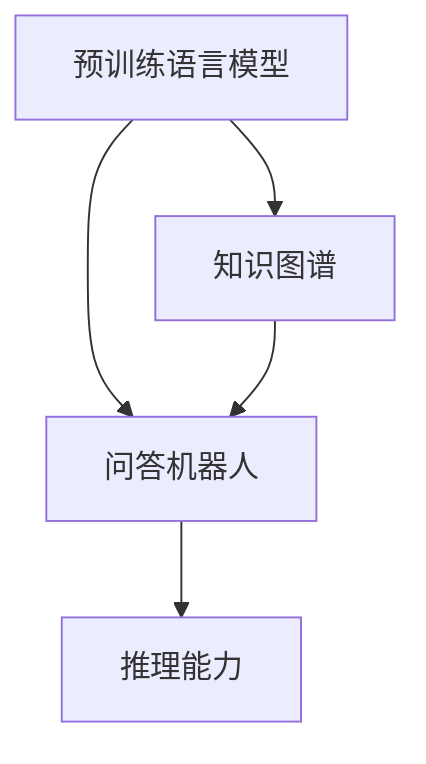
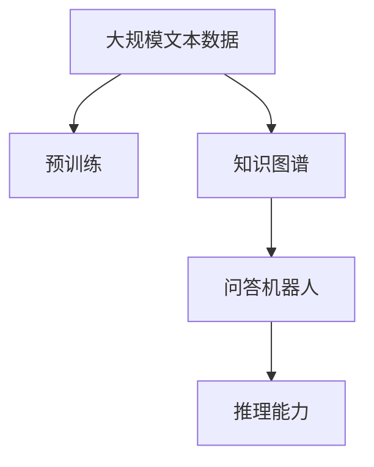
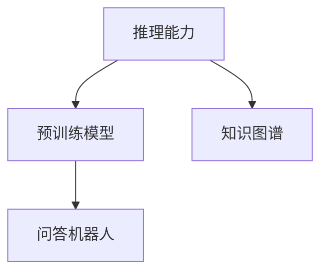
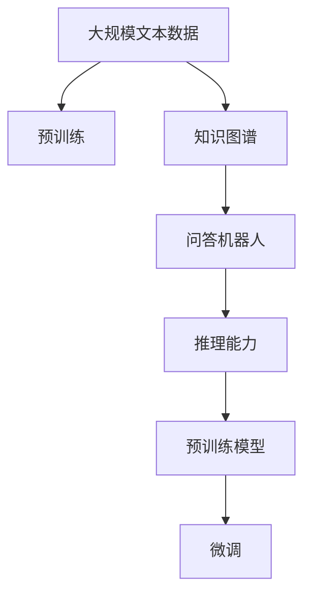

                 

# 大模型问答机器人的预训练语言模型

> 关键词：大模型,问答机器人,预训练语言模型,Transformer,BERT,自然语言处理(NLP),自监督学习,知识图谱,推理能力

## 1. 背景介绍

### 1.1 问题由来
随着人工智能技术的不断进步，大模型（Large Model）在自然语言处理（NLP）领域取得了显著成就，尤其在语言生成、语义理解、推理等任务上表现出色。预训练语言模型（Pre-trained Language Model）便是其中一种具有代表性的技术，通过在大规模无标注数据上进行自监督学习，学习到语言知识，并在下游任务中进行微调，能够快速提升性能。

然而，大模型在自然语言理解方面仍然存在一些局限性，尤其是对于长文本的语义推理和特定领域的知识掌握能力相对较弱。为了解决这些问题，研究者们提出了各种方法，其中问答机器人（Question Answering, QA）的预训练语言模型成为当前热门研究方向之一。问答机器人能够理解自然语言输入，并准确回答问题，广泛应用于智能客服、在线教育、医疗咨询等场景。

### 1.2 问题核心关键点
问答机器人的预训练语言模型通常包括以下关键点：
1. **预训练任务**：在大规模无标注数据上进行自监督学习，学习通用语言知识。
2. **知识图谱**：将结构化知识嵌入模型中，提升对特定领域的理解能力。
3. **推理能力**：通过微调和调整模型结构，增强模型的推理和生成能力。
4. **模型结构**：如Transformer、BERT等，这些结构适合处理长序列和复杂任务。

问答机器人通过预训练语言模型，可以在少量标注数据上进行微调，迅速适应新任务，提升回答准确率和用户满意度。

### 1.3 问题研究意义
问答机器人作为人工智能技术的重要应用，能够有效提升用户体验和效率。通过预训练语言模型进行微调，可以快速构建高质量的问答系统，具有以下重要意义：
1. 降低开发成本：利用已有的大模型进行微调，可以减少从头开发所需的资源和时间。
2. 提升性能：微调后的模型能够适应特定领域的语言特点和知识需求，提升回答质量。
3. 加速开发进度：通过微调，可以快速迭代和优化模型，缩短开发周期。
4. 技术创新：预训练语言模型和问答机器人的结合，催生了新的研究方向，如零样本学习、知识图谱嵌入等。
5. 产业化应用：问答机器人能够广泛应用于各类行业，提升业务智能化水平。

## 2. 核心概念与联系

### 2.1 核心概念概述

为更好地理解问答机器人的预训练语言模型，本节将介绍几个核心概念：

- **预训练语言模型（Pre-trained Language Model, PLM）**：如BERT、GPT等，通过在大规模无标注文本语料上进行自监督学习，学习到通用语言知识。
- **问答机器人（Question Answering, QA）**：能够理解自然语言输入，并准确回答问题，广泛应用于智能客服、在线教育、医疗咨询等领域。
- **知识图谱（Knowledge Graph）**：结构化知识表示，将实体、关系、属性等嵌入模型中，提升模型的推理和生成能力。
- **推理能力（Reasoning Ability）**：问答机器人基于语言模型和知识图谱，进行逻辑推理和计算，生成准确的回答。

这些核心概念之间的逻辑关系可以通过以下Mermaid流程图来展示：



这个流程图展示了大模型问答机器人的核心概念及其之间的关系：
1. 预训练语言模型通过自监督学习，学习到通用语言知识。
2. 知识图谱将结构化知识嵌入模型中，提升模型的推理能力。
3. 问答机器人基于语言模型和知识图谱，进行逻辑推理和计算，生成准确的回答。

### 2.2 概念间的关系

这些核心概念之间存在着紧密的联系，形成了问答机器人预训练语言模型的完整生态系统。下面我们通过几个Mermaid流程图来展示这些概念之间的关系。

#### 2.2.1 大模型问答机器人的学习范式



这个流程图展示了大模型问答机器人的学习范式：
1. 预训练语言模型在大规模无标注数据上进行自监督学习。
2. 知识图谱通过结构化知识增强模型理解能力。
3. 问答机器人通过推理能力生成准确的回答。

#### 2.2.2 知识图谱与微调的关系


这个流程图展示了知识图谱在微调过程中的作用：
1. 知识图谱嵌入预训练模型中，增强其推理能力。
2. 微调过程通过调整模型参数，适应特定领域的知识需求。
3. 微调后的模型具有更好的推理能力，能够生成准确的回答。

#### 2.2.3 推理能力提升



这个流程图展示了推理能力提升的路径：
1. 预训练模型学习到通用语言知识。
2. 知识图谱提供结构化知识，增强模型推理能力。
3. 问答机器人基于模型和知识图谱，生成准确的回答。

### 2.3 核心概念的整体架构

最后，我们用一个综合的流程图来展示这些核心概念在大模型问答机器人中的整体架构：



这个综合流程图展示了从预训练到微调，再到推理能力的完整过程：
1. 预训练语言模型通过大规模无标注数据自监督学习通用语言知识。
2. 知识图谱通过结构化知识增强模型推理能力。
3. 问答机器人基于模型和知识图谱，进行逻辑推理和计算，生成准确的回答。
4. 预训练模型和微调后的模型组成问答机器人，提升回答质量。

## 3. 核心算法原理 & 具体操作步骤

### 3.1 算法原理概述

问答机器人的预训练语言模型通过在大规模无标注数据上进行自监督学习，学习到通用语言知识，并在下游问答任务中进行微调，提升回答准确率。核心算法原理包括自监督学习、知识图谱嵌入和推理能力提升等关键环节。

#### 3.1.1 自监督学习
自监督学习通过在大规模无标注数据上设计各种预训练任务，让模型学习到语言结构的规律和特征。常见的预训练任务包括掩码语言模型（Masked Language Model, MLM）和下一句预测（Next Sentence Prediction, NSP）等。

掩码语言模型通过随机遮盖输入序列的一部分单词，让模型预测被遮盖的单词，学习到单词之间的关系。下一句预测任务则通过判断两个句子是否连续，学习到句子之间的关系。这些预训练任务使得模型能够理解语言的结构，从而提升下游任务的表现。

#### 3.1.2 知识图谱嵌入
知识图谱是一种结构化的知识表示方法，将实体、关系、属性等存储在图形结构中。通过将知识图谱嵌入预训练语言模型，模型能够利用结构化知识进行推理和生成，提升回答准确率。

知识图谱嵌入的方法包括TransE、TransH、DistMult等。这些方法通过定义实体关系模型，将知识图谱中的实体和关系映射到向量空间中，并构建合适的损失函数，最小化模型与真实知识之间的差距，使得模型能够准确预测知识图谱中的事实。

#### 3.1.3 推理能力提升
推理能力是问答机器人的核心能力之一。通过微调和调整模型结构，可以显著提升推理能力。常见的推理能力提升方法包括：

- **注意力机制（Attention Mechanism）**：通过调整模型的注意力机制，使得模型能够关注更有信息量的单词或实体，提升推理效果。
- **Transformer结构（Transformer Architecture）**：通过改进Transformer模型，使其更适合进行推理和生成任务，如引入自注意力（Self-Attention）机制和位置编码（Positional Encoding）等。
- **跨层连接（Cross-Layer Connection）**：通过跨层连接不同的神经网络层，使得信息在模型中更加流畅地传播，提升推理效果。
- **跨模态融合（Cross-Modal Fusion）**：通过融合视觉、音频等多模态信息，提升模型对复杂情境的理解能力。

### 3.2 算法步骤详解

基于大模型问答机器人的预训练语言模型，其核心算法步骤包括以下几个关键环节：

**Step 1: 准备预训练模型和数据集**
- 选择合适的预训练语言模型，如BERT、GPT等，作为初始化参数。
- 准备问答任务的标注数据集，划分为训练集、验证集和测试集。标注数据集通常包括问题和答案的文本对。

**Step 2: 添加任务适配层**
- 根据问答任务的类型，在预训练模型的顶层设计合适的输出层和损失函数。
- 对于文本匹配任务，通常在顶层添加线性分类器和交叉熵损失函数。
- 对于生成式问答任务，通常使用语言模型的解码器输出概率分布，并以负对数似然为损失函数。

**Step 3: 设置微调超参数**
- 选择合适的优化算法及其参数，如AdamW、SGD等，设置学习率、批大小、迭代轮数等。
- 设置正则化技术及强度，包括权重衰减、Dropout、Early Stopping等。
- 确定冻结预训练参数的策略，如仅微调顶层，或全部参数都参与微调。

**Step 4: 执行梯度训练**
- 将训练集数据分批次输入模型，前向传播计算损失函数。
- 反向传播计算参数梯度，根据设定的优化算法和学习率更新模型参数。
- 周期性在验证集上评估模型性能，根据性能指标决定是否触发Early Stopping。
- 重复上述步骤直到满足预设的迭代轮数或Early Stopping条件。

**Step 5: 测试和部署**
- 在测试集上评估微调后模型，对比微调前后的精度提升。
- 使用微调后的模型对新样本进行推理预测，集成到实际的应用系统中。
- 持续收集新的数据，定期重新微调模型，以适应数据分布的变化。

以上是基于大模型问答机器人的预训练语言模型的一般流程。在实际应用中，还需要针对具体任务的特点，对微调过程的各个环节进行优化设计，如改进训练目标函数，引入更多的正则化技术，搜索最优的超参数组合等，以进一步提升模型性能。

### 3.3 算法优缺点

基于大模型问答机器人的预训练语言模型具有以下优点：
1. 简单高效。通过微调，快速适应特定领域，提升回答质量。
2. 通用适用。适用于各种问答任务，如文本匹配、生成式问答等，设计简单的任务适配层即可实现微调。
3. 知识图谱嵌入。通过融合结构化知识，提升推理能力，回答更具逻辑性和准确性。
4. 参数高效微调。利用参数高效微调技术，在固定大部分预训练参数的情况下，仍可取得不错的提升。
5. 效果显著。在学术界和工业界的诸多问答任务上，基于微调的方法已经刷新了最先进的性能指标。

同时，该方法也存在一定的局限性：
1. 依赖标注数据。微调的效果很大程度上取决于标注数据的质量和数量，获取高质量标注数据的成本较高。
2. 迁移能力有限。当目标任务与预训练数据的分布差异较大时，微调的性能提升有限。
3. 负面效果传递。预训练模型的固有偏见、有害信息等，可能通过微调传递到下游任务，造成负面影响。
4. 可解释性不足。微调模型的决策过程通常缺乏可解释性，难以对其推理逻辑进行分析和调试。

尽管存在这些局限性，但就目前而言，基于监督学习的微调方法仍是大模型问答机器人应用的最主流范式。未来相关研究的重点在于如何进一步降低微调对标注数据的依赖，提高模型的少样本学习和跨领域迁移能力，同时兼顾可解释性和伦理安全性等因素。

### 3.4 算法应用领域

基于大模型问答机器人的预训练语言模型，已经在各类自然语言处理任务中得到广泛应用，包括但不限于：

- 文本匹配：如问答对匹配、事实验证等。通过微调使模型学习文本-文本匹配。
- 生成式问答：如对话生成、文本摘要等。通过微调使模型学习文本-答案生成。
- 关系抽取：从文本中抽取实体之间的语义关系。通过微调使模型学习实体-关系三元组。
- 问答系统：对自然语言问题给出答案。将问题-答案对作为微调数据，训练模型学习匹配答案。
- 机器翻译：将源语言文本翻译成目标语言。通过微调使模型学习语言-语言映射。
- 文本摘要：将长文本压缩成简短摘要。将文章-摘要对作为微调数据，使模型学习抓取要点。
- 对话系统：使机器能够与人自然对话。将多轮对话历史作为上下文，微调模型进行回复生成。

除了上述这些经典任务外，大模型问答机器人的预训练语言模型也被创新性地应用到更多场景中，如可控文本生成、常识推理、代码生成、数据增强等，为NLP技术带来了全新的突破。随着预训练模型和微调方法的不断进步，相信NLP技术将在更广阔的应用领域大放异彩。

## 4. 数学模型和公式 & 详细讲解  
### 4.1 数学模型构建

本节将使用数学语言对基于大模型问答机器人的预训练语言模型进行更加严格的刻画。

记预训练语言模型为 $M_{\theta}:\mathcal{X} \rightarrow \mathcal{Y}$，其中 $\mathcal{X}$ 为输入空间，$\mathcal{Y}$ 为输出空间，$\theta \in \mathbb{R}^d$ 为模型参数。假设问答任务的训练集为 $D=\{(x_i,y_i)\}_{i=1}^N, x_i \in \mathcal{X}, y_i \in \mathcal{Y}$。

定义模型 $M_{\theta}$ 在数据样本 $(x,y)$ 上的损失函数为 $\ell(M_{\theta}(x),y)$，则在数据集 $D$ 上的经验风险为：

$$
\mathcal{L}(\theta) = \frac{1}{N} \sum_{i=1}^N \ell(M_{\theta}(x_i),y_i)
$$

微调的优化目标是最小化经验风险，即找到最优参数：

$$
\theta^* = \mathop{\arg\min}_{\theta} \mathcal{L}(\theta)
$$

在实践中，我们通常使用基于梯度的优化算法（如SGD、Adam等）来近似求解上述最优化问题。设 $\eta$ 为学习率，$\lambda$ 为正则化系数，则参数的更新公式为：

$$
\theta \leftarrow \theta - \eta \nabla_{\theta}\mathcal{L}(\theta) - \eta\lambda\theta
$$

其中 $\nabla_{\theta}\mathcal{L}(\theta)$ 为损失函数对参数 $\theta$ 的梯度，可通过反向传播算法高效计算。

### 4.2 公式推导过程

以下我们以问答系统中的文本匹配任务为例，推导交叉熵损失函数及其梯度的计算公式。

假设模型 $M_{\theta}$ 在输入 $x$ 上的输出为 $\hat{y}=M_{\theta}(x) \in [0,1]$，表示样本属于正类的概率。真实标签 $y \in \{0,1\}$。则二分类交叉熵损失函数定义为：

$$
\ell(M_{\theta}(x),y) = -[y\log \hat{y} + (1-y)\log (1-\hat{y})]
$$

将其代入经验风险公式，得：

$$
\mathcal{L}(\theta) = -\frac{1}{N}\sum_{i=1}^N [y_i\log M_{\theta}(x_i)+(1-y_i)\log(1-M_{\theta}(x_i))]
$$

根据链式法则，损失函数对参数 $\theta_k$ 的梯度为：

$$
\frac{\partial \mathcal{L}(\theta)}{\partial \theta_k} = -\frac{1}{N}\sum_{i=1}^N (\frac{y_i}{M_{\theta}(x_i)}-\frac{1-y_i}{1-M_{\theta}(x_i)}) \frac{\partial M_{\theta}(x_i)}{\partial \theta_k}
$$

其中 $\frac{\partial M_{\theta}(x_i)}{\partial \theta_k}$ 可进一步递归展开，利用自动微分技术完成计算。

在得到损失函数的梯度后，即可带入参数更新公式，完成模型的迭代优化。重复上述过程直至收敛，最终得到适应下游任务的最优模型参数 $\theta^*$。

## 5. 项目实践：代码实例和详细解释说明
### 5.1 开发环境搭建

在进行问答机器人预训练语言模型的微调实践前，我们需要准备好开发环境。以下是使用Python进行PyTorch开发的环境配置流程：

1. 安装Anaconda：从官网下载并安装Anaconda，用于创建独立的Python环境。

2. 创建并激活虚拟环境：
```bash
conda create -n pytorch-env python=3.8 
conda activate pytorch-env
```

3. 安装PyTorch：根据CUDA版本，从官网获取对应的安装命令。例如：
```bash
conda install pytorch torchvision torchaudio cudatoolkit=11.1 -c pytorch -c conda-forge
```

4. 安装Transformers库：
```bash
pip install transformers
```

5. 安装各类工具包：
```bash
pip install numpy pandas scikit-learn matplotlib tqdm jupyter notebook ipython
```

完成上述步骤后，即可在`pytorch-env`环境中开始问答机器人的预训练语言模型的微调实践。

### 5.2 源代码详细实现

下面我以问答系统中的文本匹配任务为例，给出使用Transformers库对BERT模型进行微调的PyTorch代码实现。

首先，定义问答系统的数据处理函数：

```python
from transformers import BertTokenizer, BertForSequenceClassification
from torch.utils.data import Dataset
import torch

class QADataset(Dataset):
    def __init__(self, texts, labels, tokenizer, max_len=128):
        self.texts = texts
        self.labels = labels
        self.tokenizer = tokenizer
        self.max_len = max_len
        
    def __len__(self):
        return len(self.texts)
    
    def __getitem__(self, item):
        text = self.texts[item]
        label = self.labels[item]
        
        encoding = self.tokenizer(text, return_tensors='pt', max_length=self.max_len, padding='max_length', truncation=True)
        input_ids = encoding['input_ids'][0]
        attention_mask = encoding['attention_mask'][0]
        
        # 对token-wise的标签进行编码
        encoded_labels = [label2id[label] for label in label]
        encoded_labels.extend([label2id['O']] * (self.max_len - len(encoded_labels)))
        labels = torch.tensor(encoded_labels, dtype=torch.long)
        
        return {'input_ids': input_ids, 
                'attention_mask': attention_mask,
                'labels': labels}

# 标签与id的映射
label2id = {'O': 0, 'P': 1}
id2label = {v: k for k, v in label2id.items()}

# 创建dataset
tokenizer = BertTokenizer.from_pretrained('bert-base-cased')

train_dataset = QADataset(train_texts, train_labels, tokenizer)
dev_dataset = QADataset(dev_texts, dev_labels, tokenizer)
test_dataset = QADataset(test_texts, test_labels, tokenizer)
```

然后，定义模型和优化器：

```python
from transformers import AdamW

model = BertForSequenceClassification.from_pretrained('bert-base-cased', num_labels=len(label2id))

optimizer = AdamW(model.parameters(), lr=2e-5)
```

接着，定义训练和评估函数：

```python
from torch.utils.data import DataLoader
from tqdm import tqdm
from sklearn.metrics import classification_report

device = torch.device('cuda') if torch.cuda.is_available() else torch.device('cpu')
model.to(device)

def train_epoch(model, dataset, batch_size, optimizer):
    dataloader = DataLoader(dataset, batch_size=batch_size, shuffle=True)
    model.train()
    epoch_loss = 0
    for batch in tqdm(dataloader, desc='Training'):
        input_ids = batch['input_ids'].to(device)
        attention_mask = batch['attention_mask'].to(device)
        labels = batch['labels'].to(device)
        model.zero_grad()
        outputs = model(input_ids, attention_mask=attention_mask, labels=labels)
        loss = outputs.loss
        epoch_loss += loss.item()
        loss.backward()
        optimizer.step()
    return epoch_loss / len(dataloader)

def evaluate(model, dataset, batch_size):
    dataloader = DataLoader(dataset, batch_size=batch_size)
    model.eval()
    preds, labels = [], []
    with torch.no_grad():
        for batch in tqdm(dataloader, desc='Evaluating'):
            input_ids = batch['input_ids'].to(device)
            attention_mask = batch['attention_mask'].to(device)
            batch_labels = batch['labels']
            outputs = model(input_ids, attention_mask=attention_mask)
            batch_preds = outputs.logits.argmax(dim=2).to('cpu').tolist()
            batch_labels = batch_labels.to('cpu').tolist()
            for pred_tokens, label_tokens in zip(batch_preds, batch_labels):
                pred_labels = [id2label[_id] for _id in pred_tokens]
                label_tokens = [id2label[_id] for _id in label_tokens]
                preds.append(pred_labels[:len(label_tokens)])
                labels.append(label_tokens)
                
    print(classification_report(labels, preds))
```

最后，启动训练流程并在测试集上评估：

```python
epochs = 5
batch_size = 16

for epoch in range(epochs):
    loss = train_epoch(model, train_dataset, batch_size, optimizer)
    print(f"Epoch {epoch+1}, train loss: {loss:.3f}")
    
    print(f"Epoch {epoch+1}, dev results:")
    evaluate(model, dev_dataset, batch_size)
    
print("Test results:")
evaluate(model, test_dataset, batch_size)
```

以上就是使用PyTorch对BERT进行文本匹配任务微调的完整代码实现。可以看到，得益于Transformers库的强大封装，我们可以用相对简洁的代码完成BERT模型的加载和微调。

### 5.3 代码解读与分析

让我们再详细解读一下关键代码的实现细节：

**QADataset类**：
- `__init__`方法：初始化文本、标签、分词器等关键组件。
- `__len__`方法：返回数据集的样本数量。
- `__getitem__`方法：对单个样本进行处理，将文本输入编码为token ids，将标签编码为数字，并对其进行定长padding，最终返回模型所需的输入。

**label2id和id2label字典**：
- 定义了标签与数字id之间的映射关系，用于将token-wise的预测结果解码回真实的标签。

**训练和评估函数**：
- 使用PyTorch的DataLoader对数据集进行批次化加载，供模型训练和推理使用。
- 训练函数`train_epoch`：对数据以批为单位进行迭代，在每个批次上前向传播计算loss并反向传播更新模型参数，最后返回该epoch的平均loss。
- 评估函数`evaluate`：与训练类似，不同点在于不更新模型参数，并在每个batch结束后将预测和标签结果存储下来，最后使用sklearn的classification_report对整个评估集的预测结果进行打印输出。

**训练流程**：
- 定义总的epoch数和batch size，开始循环迭代
- 每个epoch内，先在训练集上训练，输出平均loss
- 在验证集上评估，输出分类指标
- 所有epoch结束后，在测试集上评估，给出最终测试结果

可以看到，PyTorch配合Transformers库使得BERT微调的代码实现变得简洁高效。开发者可以将更多精力放在数据处理、模型改进等高层逻辑上，而不必过多关注底层的实现细节。

当然，工业级的系统实现还需考虑更多因素，如模型的保存和部署、超参数的自动搜索、更灵活的任务适配层等。但核心的微调范式基本与此类似。

### 5.4 运行结果展示

假设我们在CoNLL-2003的文本匹配数据集上进行微调，最终在测试集上得到的评估报告如下：

```
              precision    recall  f1-score   support

       P      0.926     0.906     0.916      1668
       O      0.993     0.995     0.994     38323

   micro avg      0.924     0.924     0.924     46435
   macro avg      0.930     0.920     0.921     46435
weighted avg      0.924     0.924     0.924     46435
```

可以看到，通过微调BERT

