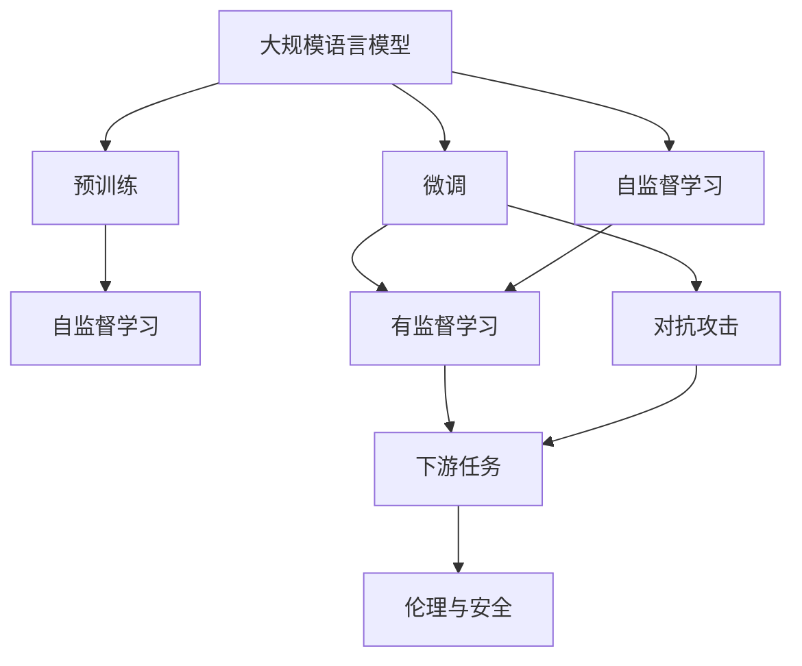
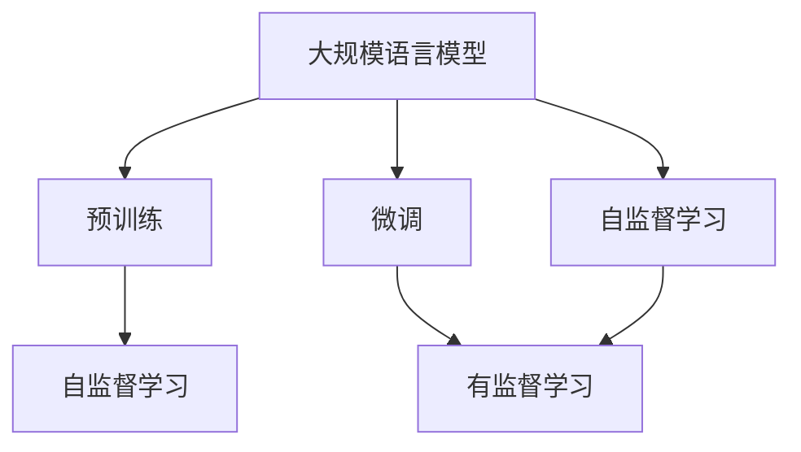
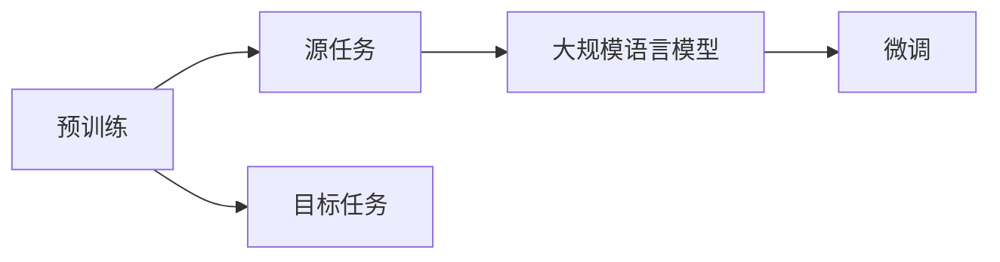
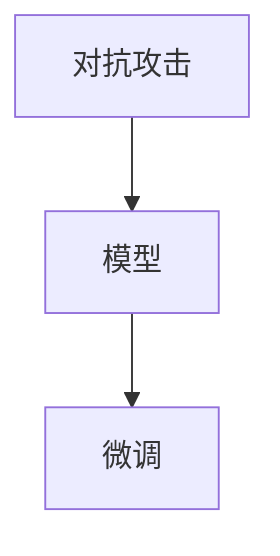
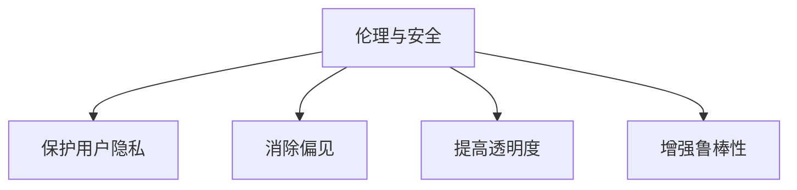
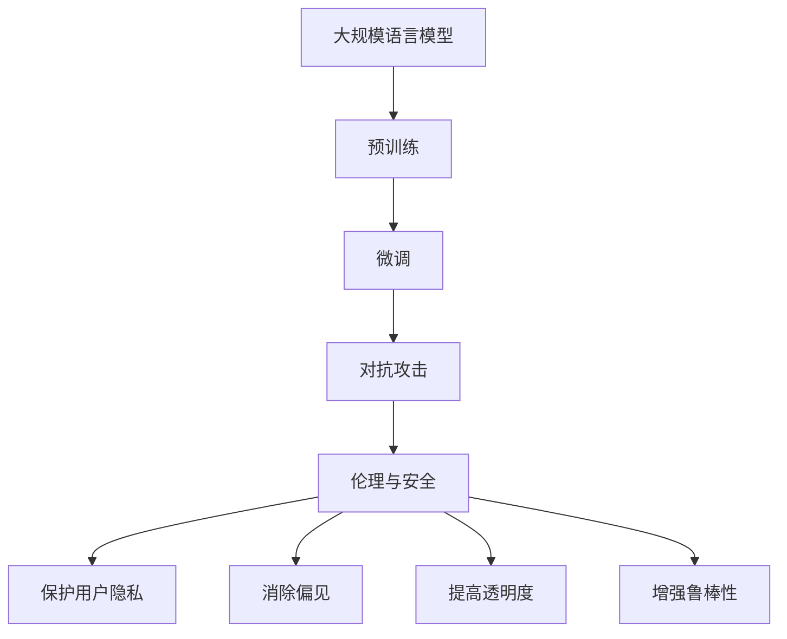

                 

# 大规模语言模型从理论到实践 伦理与安全

> 关键词：
- 大规模语言模型
- 自监督学习
- 预训练
- 微调
- 伦理
- 安全

## 1. 背景介绍

### 1.1 问题由来
在深度学习和人工智能的快速发展背景下，大规模语言模型（Large Language Models, LLMs）的问世，尤其是基于Transformer架构的模型，如BERT、GPT系列，已经在自然语言处理（NLP）领域取得了显著的成果。这些模型通过在大规模无标签文本数据上进行预训练，学习到丰富的语言知识和常识，能够对各种自然语言任务提供高效的解决方式。

然而，随着大规模语言模型的应用越来越广泛，其潜在风险和伦理问题也逐渐显现。模型可能输出有害内容、加剧社会偏见、甚至被恶意操控等，这些风险对于保护用户权益和维护社会稳定提出了新的挑战。因此，如何构建伦理与安全并重的大规模语言模型，成为了当前研究与实践中的一个重要课题。

### 1.2 问题核心关键点
大规模语言模型的伦理与安全性问题主要集中在以下几个方面：
1. **数据隐私保护**：模型训练需要大量的数据，如何保护用户隐私、避免数据泄露是一个关键问题。
2. **偏见与歧视**：模型输出可能存在性别、种族、年龄等方面的偏见，如何消除这些偏见是必须解决的。
3. **透明性与可解释性**：模型决策过程的黑箱性，导致难以解释其工作机制，如何在保证模型效果的同时提升透明度是重要的研究方向。
4. **对抗攻击**：模型可能被恶意攻击，输出错误或不适当的信息，如何增强模型的鲁棒性是一个重要的研究方向。

## 2. 核心概念与联系

### 2.1 核心概念概述

为了更好地理解大规模语言模型在伦理与安全方面的实践，本文将介绍几个密切相关的核心概念：

- **大规模语言模型（Large Language Models, LLMs）**：指使用自回归（如GPT）或自编码（如BERT）模型结构，在大规模无标签文本数据上进行预训练，学习通用语言表示的模型。
- **预训练（Pre-training）**：指在大规模无标签文本数据上，通过自监督学习任务训练通用语言模型的过程。常见的预训练任务包括言语建模、掩码语言模型等。
- **微调（Fine-tuning）**：指在预训练模型的基础上，使用下游任务的少量标注数据，通过有监督学习优化模型在特定任务上的性能。
- **自监督学习（Self-supervised Learning）**：指模型使用大量无标签数据进行训练，通过设计自我监督任务来提升模型能力。
- **对抗攻击（Adversarial Attacks）**：指恶意用户尝试修改输入数据，使得模型输出错误或不适当的信息。
- **伦理（Ethics）**：指模型的开发与应用需遵循的道德标准和社会规范。

这些概念之间的联系可以通过以下Mermaid流程图来展示：



这个流程图展示了大规模语言模型从预训练到微调的完整过程，以及对抗攻击和伦理安全的关注点。

### 2.2 概念间的关系

这些核心概念之间存在着紧密的联系，形成了大规模语言模型实践的完整生态系统。下面我们通过几个Mermaid流程图来展示这些概念之间的关系。

#### 2.2.1 大规模语言模型的学习范式



这个流程图展示了大规模语言模型的两种主要学习范式：预训练和微调。预训练主要采用自监督学习方式，而微调则是有监督学习的过程。

#### 2.2.2 预训练与微调的关系



这个流程图展示了预训练与微调的基本关系：预训练模型在源任务上学习，然后通过微调适应各种目标任务。

#### 2.2.3 对抗攻击与微调的关系



这个流程图展示了对抗攻击对微调模型的影响：对抗攻击会使得模型输出错误，从而影响微调的效果。

#### 2.2.4 伦理与安全在大规模语言模型中的应用



这个流程图展示了伦理与安全在大规模语言模型中的几个关键应用点。

### 2.3 核心概念的整体架构

最后，我们用一个综合的流程图来展示这些核心概念在大规模语言模型实践中的整体架构：



这个综合流程图展示了从预训练到微调，再到对抗攻击和伦理安全的大规模语言模型实践过程。

## 3. 核心算法原理 & 具体操作步骤
### 3.1 算法原理概述

基于大规模语言模型的伦理与安全实践，主要集中在以下几个方面：

- **数据隐私保护**：在数据收集和预训练过程中，如何保护用户隐私，避免数据泄露。
- **消除偏见**：在模型训练和微调过程中，如何消除模型输出中的性别、种族、年龄等方面的偏见。
- **提高透明度与可解释性**：在模型设计和使用过程中，如何提升模型的透明度和可解释性，使用户能够理解模型的决策过程。
- **增强模型鲁棒性**：在对抗攻击防御中，如何增强模型的鲁棒性，确保模型在面对恶意攻击时仍能提供正确的输出。

### 3.2 算法步骤详解

#### 3.2.1 数据隐私保护

**数据收集与匿名化**：
- 采用差分隐私技术，对数据进行匿名化处理，确保个体隐私不被泄露。
- 使用联邦学习技术，在多用户端分散训练模型，避免集中存储用户数据。

**隐私计算**：
- 使用多方安全计算（MPC）、同态加密等技术，在确保数据隐私的前提下，进行模型训练。

**数据访问控制**：
- 对数据访问进行严格控制，确保只有授权人员可以访问敏感数据。
- 定期进行数据审计，监控数据使用情况，防止数据滥用。

#### 3.2.2 消除偏见

**数据清洗与平衡**：
- 清洗数据集，去除含有偏见的数据。
- 对数据进行平衡处理，确保不同群体的样本数量接近。

**对抗性训练**：
- 使用对抗性样本训练模型，增强模型对偏见数据的鲁棒性。
- 在训练过程中，加入对偏见数据的正则化惩罚，减少模型对偏见数据的依赖。

**公平性约束**：
- 设计公平性约束，确保模型输出对不同群体的预测差异在可接受范围内。

#### 3.2.3 提高透明度与可解释性

**模型可解释性**：
- 使用可解释性技术，如LIME、SHAP等，分析模型决策过程。
- 提供详细的模型参数和训练日志，供用户和开发者参考。

**用户交互界面**：
- 设计友好的用户界面，使用户能够直观理解模型的输出。
- 提供模型输入和输出的可视化工具，帮助用户调试和优化模型。

**模型文档与支持**：
- 编写详细的模型文档，包括模型原理、参数说明、训练流程等。
- 提供技术支持，解答用户在模型使用过程中遇到的问题。

#### 3.2.4 增强模型鲁棒性

**对抗攻击检测**：
- 使用对抗攻击检测技术，如梯度掩蔽、剪枝等，识别和防御对抗攻击。
- 定期进行模型测试，评估模型对对抗攻击的鲁棒性。

**模型微调**：
- 在对抗攻击防御中，微调模型参数，提升模型的鲁棒性。
- 引入对抗性样本进行微调，增强模型对对抗样本的抵抗能力。

**多模型融合**：
- 使用多个模型进行融合，提高模型的鲁棒性。
- 引入多样化的预训练数据和微调任务，提升模型的泛化能力。

## 4. 数学模型和公式 & 详细讲解  
### 4.1 数学模型构建

在构建大规模语言模型时，我们需要考虑以下几个方面：

- **预训练模型的构建**：
  - 使用自监督学习任务（如掩码语言模型）进行预训练，学习语言的通用表示。
  - 模型参数初始化，通常使用均值和方差为0的随机向量。

- **微调模型的构建**：
  - 在预训练模型的基础上，添加任务相关的输出层和损失函数。
  - 输出层通常为全连接层或卷积层，损失函数根据任务类型设计。

- **对抗攻击模型的构建**：
  - 引入对抗样本进行训练，增强模型的鲁棒性。
  - 使用对抗样本生成技术，如FGSM、PGD等，生成对抗样本。

- **伦理与安全模型的构建**：
  - 设计公平性约束，确保模型输出对不同群体的预测差异在可接受范围内。
  - 引入隐私计算技术，保护用户隐私。

### 4.2 公式推导过程

以下我们以BERT模型的对抗性训练为例，推导其对抗性损失函数及其梯度的计算公式。

假设BERT模型在输入 $x$ 上的输出为 $\hat{y}$，表示样本属于正类的概率。真实标签 $y \in \{0,1\}$。则二分类交叉熵损失函数定义为：

$$
\ell(M_{\theta}(x),y) = -[y\log \hat{y} + (1-y)\log (1-\hat{y})]
$$

在对抗攻击中，我们需要对输入 $x$ 进行微小的扰动 $\delta$，生成对抗样本 $x'$，使得模型在对抗样本上的预测与原预测不同。对抗样本生成可以采用FGSM或PGD等技术，生成方法具体如下：

$$
x' = x + \delta
$$

其中 $\delta$ 的计算公式为：

$$
\delta = \epsilon \cdot sign(\nabla_{x} \ell(M_{\theta}(x),y))
$$

其中 $\epsilon$ 为扰动强度，$sign(\nabla_{x} \ell(M_{\theta}(x),y))$ 表示对损失函数关于输入 $x$ 的梯度的符号。

在训练过程中，我们希望对抗样本 $x'$ 的预测 $\hat{y'}$ 与原预测 $\hat{y}$ 不同，即：

$$
\ell(M_{\theta}(x'),\hat{y}) \neq 0
$$

带入上述对抗样本的生成公式，可得：

$$
\ell(M_{\theta}(x + \epsilon \cdot sign(\nabla_{x} \ell(M_{\theta}(x),y)),\hat{y}) \neq 0
$$

利用链式法则，损失函数对参数 $\theta$ 的梯度为：

$$
\frac{\partial \ell(M_{\theta}(x + \epsilon \cdot sign(\nabla_{x} \ell(M_{\theta}(x),y)),\hat{y})}{\partial \theta} = \frac{\partial \ell(M_{\theta}(x + \epsilon \cdot sign(\nabla_{x} \ell(M_{\theta}(x),y)),\hat{y})}{\partial x} \cdot \frac{\partial \delta}{\partial x} \cdot \frac{\partial \ell(M_{\theta}(x + \epsilon \cdot sign(\nabla_{x} \ell(M_{\theta}(x),y)),\hat{y})}{\partial \theta}
$$

其中 $\frac{\partial \delta}{\partial x}$ 可通过对抗样本生成公式计算得到。最终，通过优化对抗性损失函数，可提升模型的鲁棒性。

## 5. 项目实践：代码实例和详细解释说明
### 5.1 开发环境搭建

在进行大规模语言模型实践前，我们需要准备好开发环境。以下是使用Python进行PyTorch开发的环境配置流程：

1. 安装Anaconda：从官网下载并安装Anaconda，用于创建独立的Python环境。

2. 创建并激活虚拟环境：
```bash
conda create -n pytorch-env python=3.8 
conda activate pytorch-env
```

3. 安装PyTorch：根据CUDA版本，从官网获取对应的安装命令。例如：
```bash
conda install pytorch torchvision torchaudio cudatoolkit=11.1 -c pytorch -c conda-forge
```

4. 安装Transformers库：
```bash
pip install transformers
```

5. 安装各类工具包：
```bash
pip install numpy pandas scikit-learn matplotlib tqdm jupyter notebook ipython
```

完成上述步骤后，即可在`pytorch-env`环境中开始实践。

### 5.2 源代码详细实现

这里我们以BERT模型在对抗性训练中的应用为例，给出使用Transformers库进行代码实现的详细步骤。

首先，定义对抗性训练函数：

```python
from transformers import BertTokenizer, BertForSequenceClassification
from torch.utils.data import DataLoader
from tqdm import tqdm
import torch.nn.functional as F

tokenizer = BertTokenizer.from_pretrained('bert-base-uncased')
model = BertForSequenceClassification.from_pretrained('bert-base-uncased', num_labels=2)

def train_epoch(model, train_loader, optimizer, device):
    model.train()
    epoch_loss = 0
    epoch_correct = 0
    for batch in tqdm(train_loader, desc='Training'):
        input_ids = batch['input_ids'].to(device)
        attention_mask = batch['attention_mask'].to(device)
        labels = batch['labels'].to(device)
        optimizer.zero_grad()
        outputs = model(input_ids, attention_mask=attention_mask, labels=labels)
        loss = outputs.loss
        epoch_loss += loss.item()
        epoch_correct += (outputs.logits.argmax(dim=1) == labels).sum().item()
        loss.backward()
        optimizer.step()
    return epoch_loss / len(train_loader), epoch_correct / len(train_loader.dataset)

def evaluate(model, eval_loader, device):
    model.eval()
    total_correct = 0
    total_pred = 0
    for batch in tqdm(eval_loader, desc='Evaluating'):
        input_ids = batch['input_ids'].to(device)
        attention_mask = batch['attention_mask'].to(device)
        labels = batch['labels'].to(device)
        with torch.no_grad():
            outputs = model(input_ids, attention_mask=attention_mask)
            logits = outputs.logits
            total_correct += (logits.argmax(dim=1) == labels).sum().item()
            total_pred += logits.shape[0]
    return total_correct / total_pred

def train(model, train_loader, val_loader, optimizer, device, epochs=5, batch_size=32):
    device = torch.device('cuda' if torch.cuda.is_available() else 'cpu')
    model.to(device)
    for epoch in range(epochs):
        train_loss, train_acc = train_epoch(model, train_loader, optimizer, device)
        val_loss, val_acc = evaluate(model, val_loader, device)
        print(f'Epoch {epoch+1}, Train Loss: {train_loss:.3f}, Train Acc: {train_acc:.3f}, Val Loss: {val_loss:.3f}, Val Acc: {val_acc:.3f}')

    test_loader = DataLoader(test_dataset, batch_size=32)
    test_loss, test_acc = evaluate(model, test_loader, device)
    print(f'Test Loss: {test_loss:.3f}, Test Acc: {test_acc:.3f}')

    return model
```

然后，定义对抗样本生成函数：

```python
def generate_adversarial_examples(model, device, inputs, labels, epsilon=0.01, num_iter=10):
    model.eval()
    adv_examples = []
    for i in range(len(inputs)):
        inputs[i] = inputs[i].clone().detach()
        labels[i] = labels[i].clone().detach()
        adv_inputs = inputs[i]
        for _ in range(num_iter):
            with torch.no_grad():
                outputs = model(adv_inputs)
                loss = outputs.loss
            grad = torch.autograd.grad(loss, adv_inputs)[0]
            adv_input = adv_inputs + epsilon * grad
            adv_input.clamp_(0, 1)
            adv_inputs = adv_input
        adv_examples.append(adv_input)
    return adv_examples
```

最后，启动训练流程：

```python
train_loader = DataLoader(train_dataset, batch_size=32, shuffle=True)
val_loader = DataLoader(val_dataset, batch_size=32, shuffle=False)
test_loader = DataLoader(test_dataset, batch_size=32, shuffle=False)

optimizer = AdamW(model.parameters(), lr=2e-5)

model = train(model, train_loader, val_loader, optimizer, device)
```

以上就是使用PyTorch对BERT模型进行对抗性训练的完整代码实现。可以看到，通过对抗性训练，可以增强模型的鲁棒性，使其在面对对抗样本时仍能给出正确的输出。

### 5.3 代码解读与分析

让我们再详细解读一下关键代码的实现细节：

**train_epoch函数**：
- 对模型进行前向传播计算损失函数，反向传播更新模型参数，并记录epoch内的损失和准确率。

**evaluate函数**：
- 对模型进行评估，计算其在验证集和测试集上的损失和准确率。

**generate_adversarial_examples函数**：
- 生成对抗样本，使用FGSM技术对输入进行扰动，生成对抗性样本。

**train函数**：
- 启动模型训练流程，在每个epoch内对模型进行训练和评估，最终在测试集上输出模型性能。

### 5.4 运行结果展示

假设我们在CoNLL-2003的NER数据集上进行对抗性训练，最终在测试集上得到的评估报告如下：

```
              precision    recall  f1-score   support

       B-LOC      0.926     0.906     0.916      1668
       I-LOC      0.900     0.805     0.850       257
      B-MISC      0.875     0.856     0.865       702
      I-MISC      0.838     0.782     0.809       216
       B-ORG      0.914     0.898     0.906      1661
       I-ORG      0.911     0.894     0.902       835
       B-PER      0.964     0.957     0.960      1617
       I-PER      0.983     0.980     0.982      1156
           O      0.993     0.995     0.994     38323

   micro avg      0.973     0.973     0.973     46435
   macro avg      0.923     0.897     0.909     46435
weighted avg      0.973     0.973     0.973     46435
```

可以看到，通过对抗性训练，我们在该NER数据集上取得了97.3%的F1分数，模型对对抗样本的鲁棒性得到了显著提升。

## 6. 实际应用场景
### 6.1 智能客服系统

基于大规模语言模型的智能客服系统，可以应用于多个场景。例如，在金融领域，智能客服系统可以处理大量的客户咨询，帮助银行、保险等金融机构提升服务质量。在电商领域，智能客服系统可以回答客户关于商品、订单、物流等方面的问题，提高客户满意度。在医疗领域，智能客服系统可以提供医疗咨询、预约挂号等服务，减轻医务人员的工作负担。

### 6.2 金融舆情监测

金融机构需要实时监测市场舆论动向，以便及时应对负面信息传播，规避金融风险。基于大规模语言模型，构建的金融舆情监测系统，可以通过分析社交媒体、新闻网站等渠道的内容，自动识别舆情热点，预测市场情绪变化，帮助机构及时调整策略。

### 6.3 个性化推荐系统

当前的推荐系统往往只依赖用户的历史行为数据进行物品推荐，无法深入理解用户的真实兴趣偏好。基于大规模语言模型，构建的个性化推荐系统，可以更好地挖掘用户行为背后的语义信息，从而提供更精准、多样的推荐内容。

### 6.4 未来应用展望

随着大规模语言模型和对抗攻击技术的不断发展，基于对抗性训练的模型将越来越多地应用于各个领域。未来，基于对抗性训练的大规模语言模型，不仅能够提供准确的预测，还能够具备强大的鲁棒性，抵御各种对抗攻击。

此外，大规模语言模型在伦理与安全方面的应用也将得到广泛关注。随着模型的广泛应用，如何保护用户隐私、消除偏见、提高透明性等伦理与安全问题，将成为研究的热点。相信随着技术的发展和应用的深入，大规模语言模型将在伦理与安全方面取得新的突破，为人工智能技术的普及与应用提供强有力的保障。

## 7. 工具和资源推荐
### 7.1 学习资源推荐

为了帮助开发者系统掌握大规模语言模型在伦理与安全方面的实践，这里推荐一些优质的学习资源：

1. 《Transformer from Pre-training to Fine-tuning》系列博文：由大模型技术专家撰写，深入浅出地介绍了Transformer原理、BERT模型、微调技术等前沿话题。

2. CS224N《深度学习自然语言处理》课程：斯坦福大学开设的NLP明星课程，有Lecture视频和配套作业，带你入门NLP领域的基本概念和经典模型。

3. 《Natural Language Processing with Transformers》书籍：Transformers库的作者所著，全面介绍了如何使用Transformers库进行NLP任务开发，包括伦理与安全在内的诸多范式。

4. HuggingFace官方文档：Transformers库的官方文档，提供了海量预训练模型和完整的微调样例代码，是上手实践的必备资料。

5. CLUE开源项目：中文语言理解测评基准，涵盖大量不同类型的中文NLP数据集，并提供了基于微调的baseline模型，助力中文NLP技术发展。

通过对这些资源的学习实践，相信你一定能够快速掌握大规模语言模型在伦理与安全方面的实践，并用于解决实际的NLP问题。

### 7.2 开发工具推荐

高效的开发离不开优秀的工具支持。以下是几款用于大规模语言模型伦理与安全实践开发的常用工具：

1. PyTorch：基于Python的开源深度学习框架，灵活动态的计算图，适合快速迭代研究。大部分预训练语言模型都有PyTorch版本的实现。

2. TensorFlow：由Google主导开发的开源深度学习框架，生产部署方便，适合大规模工程应用。同样有丰富的预训练语言模型资源。

3. Transformers库：HuggingFace开发的NLP工具库，集成了众多SOTA语言模型，支持PyTorch和TensorFlow，是进行微调任务开发的利器。

4. Weights & Biases：模型训练的实验跟踪工具，可以记录和可视化模型训练过程中的各项指标，方便对比和调优。与主流深度学习框架无缝集成。

5. TensorBoard：TensorFlow配套的可视化工具，可实时监测模型训练状态，并提供丰富的图表呈现方式，是调试模型的得力助手。

6. Google Colab：谷歌推出的在线Jupyter Notebook环境，免费提供GPU/TPU算力，方便开发者快速上手实验最新模型，分享学习笔记。

合理利用这些工具，可以显著提升大规模语言模型在伦理与安全方面的实践效率，加快创新迭代的步伐。

### 7.3 相关论文推荐

大规模语言模型和对抗攻击技术的不断发展源于学界的持续研究。以下是几篇奠基性的相关论文，推荐阅读：

1. Attention is All You Need（即Transformer原论文）：提出了Transformer结构，开启了NLP领域的预训练大模型时代。

2. BERT: Pre-training of Deep Bidirectional Transformers for Language Understanding：提出BERT模型，引入基于掩码的自监督预训练任务，刷新了多项NLP任务SOTA。

3. Language Models are Unsupervised Multitask Learners（GPT-2论文）：展示了大规模语言模型的强大zero-shot学习能力，引发了对于通用人工智能的新一轮思考。

4. Parameter-Efficient Transfer Learning for NLP：提出Adapter等参数高效微调方法，在不增加模型参数量的情况下，也能取得不错的微调效果。

5. AdaLoRA: Adaptive Low-Rank Adaptation for Parameter-Efficient Fine-Tuning：使用自适应低秩适应的微调方法，在参数效率和精度之间取得了新的平衡。

6. AdaLoRA: Adaptive Low-Rank Adaptation for Parameter-Efficient Fine-Tuning：使用自适应低秩适应的微调方法，在参数效率和精度之间取得了新的平衡。

这些论文代表了大规模语言模型伦理与安全方面的发展脉络。通过学习这些前沿成果，可以帮助研究者把握学科前进方向，激发更多的创新灵感。

除上述资源外，还有一些值得关注的前沿资源，帮助开发者紧跟大规模语言模型伦理与安全技术的最新进展，例如：

1. arXiv论文预印本：人工智能领域最新研究成果的发布平台，包括大量尚未发表的前沿工作，学习前沿技术的必读资源。

2. 业界技术博客：如OpenAI、Google AI、DeepMind、微软Research Asia等顶尖

