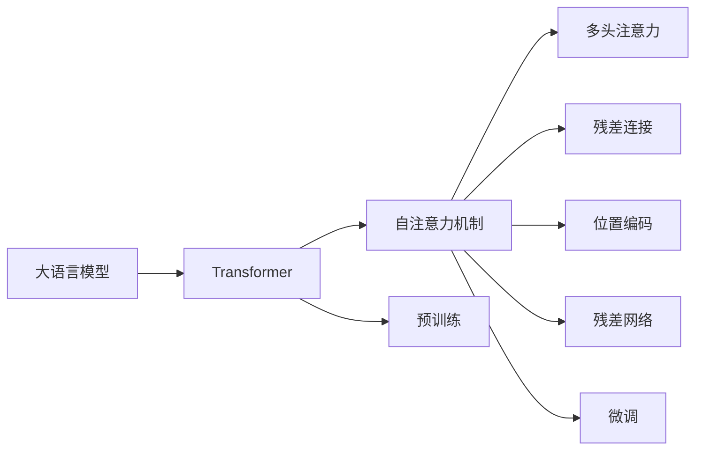
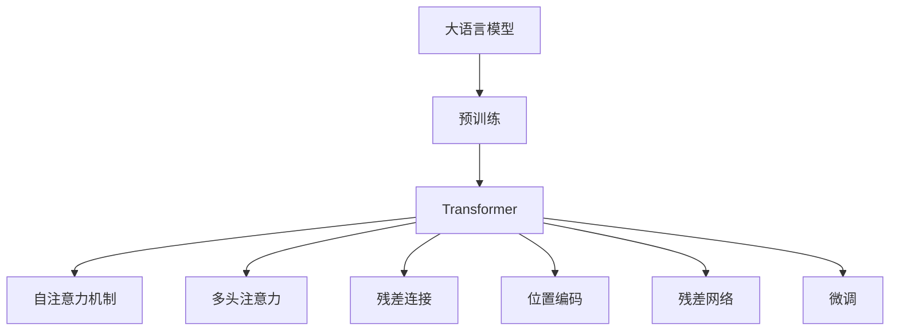
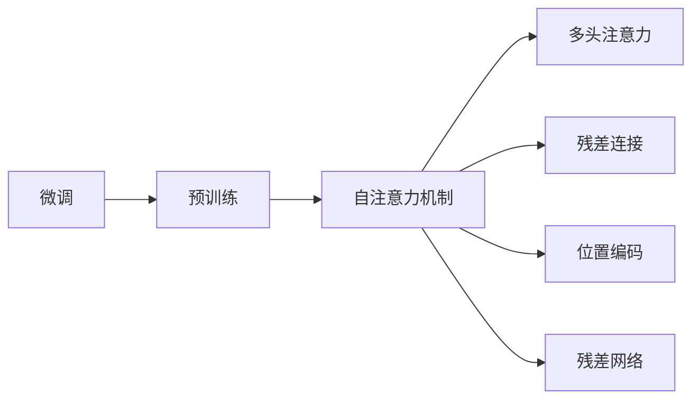
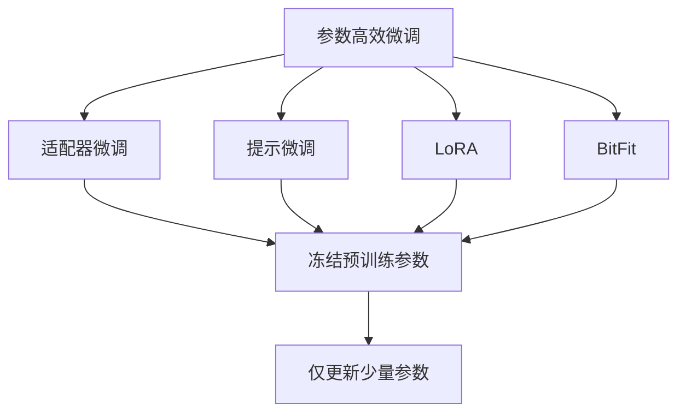
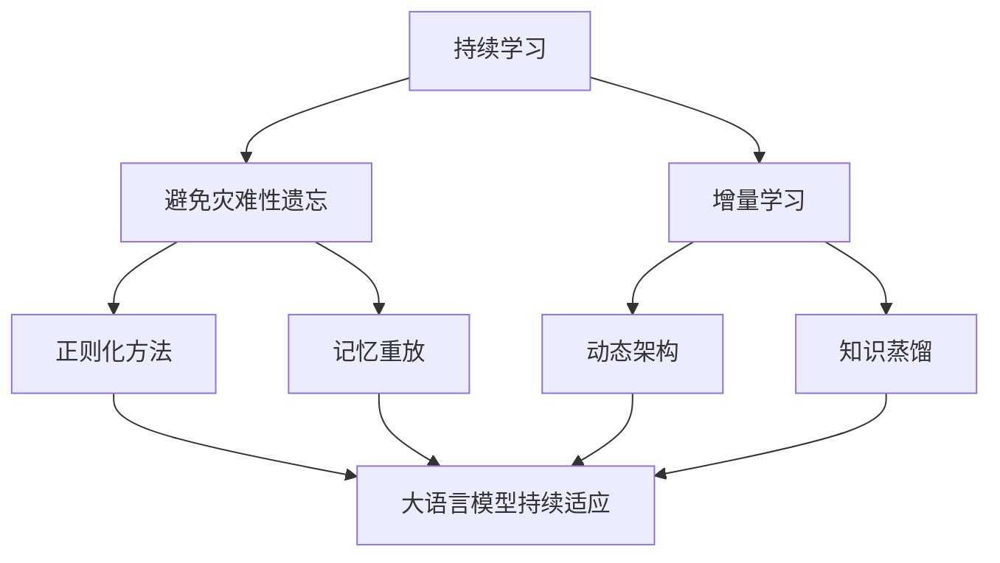
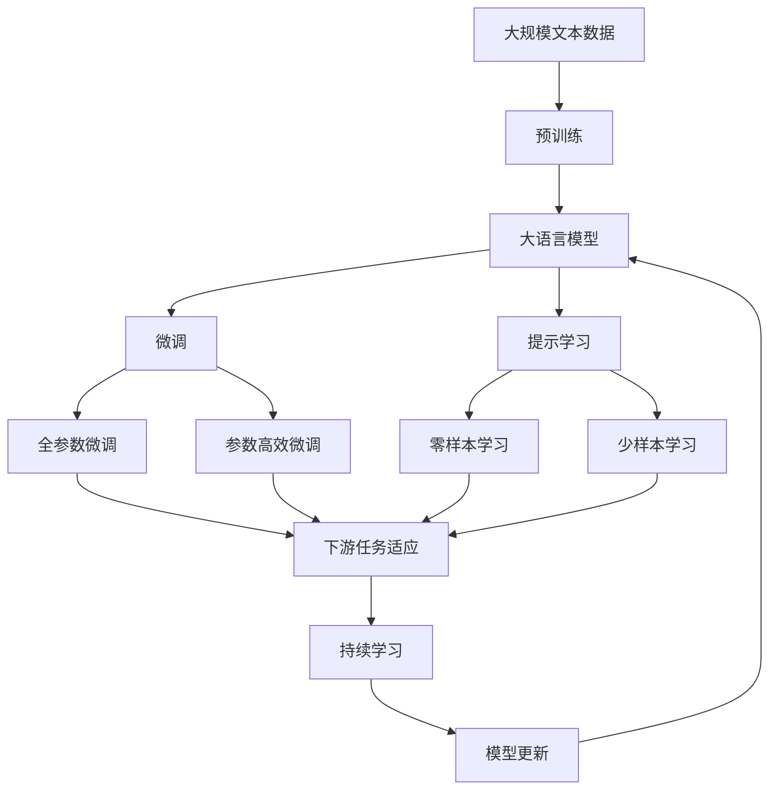

                 

# 大语言模型原理与工程实践：经典结构 Transformer

> 关键词：大语言模型,Transformer,BERT,自注意力机制,多头注意力,残差连接,位置编码,残差网络,Attention Is All You Need

## 1. 背景介绍

### 1.1 问题由来
随着深度学习技术的发展，大规模预训练语言模型（Large Language Models, LLMs）在自然语言处理（Natural Language Processing, NLP）领域取得了显著的突破。这些模型通过在大规模无标签文本数据上进行预训练，学习了丰富的语言知识和常识，能够生成连贯且语义准确的文本。然而，这些通用语言模型对于特定领域的任务可能效果不佳。因此，基于这些通用模型的微调（Fine-Tuning）成为了提高模型性能的重要手段。

### 1.2 问题核心关键点
微调的本质是利用预训练模型对特定任务的语料进行重新训练，以优化模型在该任务上的表现。常见的微调方法包括：
- 选择适当的预训练模型。
- 设计适合任务的输出层和损失函数。
- 设置合适的学习率和优化器参数。
- 应用正则化技术防止过拟合。
- 数据增强以提高模型泛化能力。
- 对抗训练以提升模型鲁棒性。
- 提示学习以减少微调参数。
- 参数高效微调以降低计算成本。

微调方法已经被广泛应用于问答、对话、摘要、翻译、情感分析等NLP任务，并在这些任务上取得了优异的效果。

### 1.3 问题研究意义
微调技术对于提高通用语言模型的应用效率和性能具有重要意义：
- 降低开发成本：利用预训练模型可以快速适应特定任务，减少从头开发所需的数据和计算资源。
- 提升性能：微调模型能够更好地适应特定任务的语料，提高模型的准确性和泛化能力。
- 加速开发进度：预训练模型为任务适配提供了基础，缩短了开发周期。
- 技术创新：微调范式促进了预训练和微调的深入研究，催生了少样本学习和多任务学习等前沿研究方向。
- 产业应用：微调技术使得NLP技术更容易被各行各业采用，推动了NLP技术的产业化进程。

## 2. 核心概念与联系

### 2.1 核心概念概述

为更好地理解Transformer模型的微调过程，本节将介绍几个关键概念及其相互关系。

- 大语言模型（Large Language Model, LLM）：通过在大规模无标签文本上预训练，学习通用语言表示的语言模型，能够生成连贯、语义准确的文本。
- Transformer模型：一种基于自注意力机制的神经网络结构，用于处理序列数据的模型。
- 自注意力机制（Self-Attention Mechanism）：Transformer的核心组件，允许模型在序列数据的局部和全局上下文中寻找依赖关系。
- 多头注意力（Multi-Head Attention）：将输入序列映射到多个注意力层中，每个注意力层关注序列的不同方面。
- 残差连接（Residual Connection）：在网络结构中引入跨层连接，使得网络能够更好地传播信息。
- 位置编码（Positional Encoding）：在Transformer中，位置编码用于解决顺序信息的问题，使模型能够区分输入序列中的不同位置。
- 残差网络（Residual Network）：在网络中引入跨层连接，使得信息能够跨层传播，避免了梯度消失问题。

这些概念之间的联系可以通过以下Mermaid流程图来展示：

这个流程图展示了从预训练到微调的整个流程，其中大语言模型通过预训练获得基础能力，然后通过微调来适应特定任务。

### 2.2 概念间的关系

这些核心概念之间存在着紧密的联系，形成了Transformer模型的微调框架。下面通过几个Mermaid流程图来展示这些概念的关系。

#### 2.2.1 大语言模型的学习范式

这个流程图展示了从预训练到微调的大语言模型学习范式。大语言模型首先在大规模无标签文本上进行预训练，学习通用语言表示。然后，通过微调来适应特定任务，包括自注意力机制、多头注意力、残差连接、位置编码和残差网络等Transformer组件。

#### 2.2.2 微调与预训练的关系

这个流程图展示了微调与预训练的关系。微调在预训练的基础上，通过特定任务的语料来调整模型的输出层和权重，使得模型能够更好地适应该任务。

#### 2.2.3 参数高效微调方法

这个流程图展示了几种常见的参数高效微调方法，包括适配器微调、提示微调、LoRA和BitFit。这些方法的共同特点是冻结大部分预训练参数，只更新少量参数，从而提高微调效率。

#### 2.2.4 持续学习在大语言模型中的应用

这个流程图展示了持续学习在大语言模型中的应用。持续学习的目标是通过正则化方法、记忆重放、动态架构和知识蒸馏等技术，使大语言模型能够持续适应新的任务和数据，避免遗忘旧知识。

### 2.3 核心概念的整体架构

最后，我们用一个综合的流程图来展示这些核心概念在大语言模型微调过程中的整体架构：

这个综合流程图展示了从预训练到微调，再到持续学习的完整过程。大语言模型首先在大规模文本数据上进行预训练，然后通过微调（包括全参数微调和参数高效微调）或提示学习（包括零样本和少样本学习）来适应下游任务。最后，通过持续学习技术，模型能够不断学习新知识，同时避免遗忘旧知识。

## 3. 核心算法原理 & 具体操作步骤
### 3.1 算法原理概述

Transformer模型是一种基于自注意力机制的神经网络结构，用于处理序列数据的模型。其核心思想是通过自注意力机制，在序列数据的局部和全局上下文中寻找依赖关系，从而生成高质量的文本。

Transformer模型主要由编码器和解码器组成，其中编码器用于处理输入序列，解码器用于生成输出序列。编码器和解码器均由多层自注意力机制和残差连接组成。

### 3.2 算法步骤详解

Transformer模型的微调步骤如下：

1. **准备预训练模型和数据集**：
   - 选择合适的预训练模型（如BERT、GPT等）作为初始化参数。
   - 准备下游任务的数据集，划分为训练集、验证集和测试集。

2. **添加任务适配层**：
   - 根据任务类型，在预训练模型顶层设计合适的输出层和损失函数。
   - 对于分类任务，通常在顶层添加线性分类器和交叉熵损失函数。
   - 对于生成任务，通常使用语言模型的解码器输出概率分布，并以负对数似然为损失函数。

3. **设置微调超参数**：
   - 选择合适的优化算法及其参数，如AdamW、SGD等，设置学习率、批大小、迭代轮数等。
   - 设置正则化技术及强度，包括权重衰减、Dropout、Early Stopping等。
   - 确定冻结预训练参数的策略，如仅微调顶层，或全部参数都参与微调。

4. **执行梯度训练**：
   - 将训练集数据分批次输入模型，前向传播计算损失函数。
   - 反向传播计算参数梯度，根据设定的优化算法和学习率更新模型参数。
   - 周期性在验证集上评估模型性能，根据性能指标决定是否触发Early Stopping。
   - 重复上述步骤直到满足预设的迭代轮数或Early Stopping条件。

5. **测试和部署**：
   - 在测试集上评估微调后模型在特定任务上的性能。
   - 使用微调后的模型对新样本进行推理预测，集成到实际的应用系统中。
   - 持续收集新的数据，定期重新微调模型，以适应数据分布的变化。

### 3.3 算法优缺点

Transformer模型的微调方法具有以下优点：

- **简单高效**：只需准备少量标注数据，即可对预训练模型进行快速适配，获得较大的性能提升。
- **通用适用**：适用于各种NLP下游任务，包括分类、匹配、生成等，设计简单的任务适配层即可实现微调。
- **参数高效**：利用参数高效微调技术，在固定大部分预训练参数的情况下，仍可取得不错的提升。
- **效果显著**：在学术界和工业界的诸多任务上，基于微调的方法已经刷新了多项NLP任务SOTA。

同时，该方法也存在一些局限性：

- **依赖标注数据**：微调的效果很大程度上取决于标注数据的质量和数量，获取高质量标注数据的成本较高。
- **迁移能力有限**：当目标任务与预训练数据的分布差异较大时，微调的性能提升有限。
- **负面效果传递**：预训练模型的固有偏见、有害信息等，可能通过微调传递到下游任务，造成负面影响。
- **可解释性不足**：微调模型的决策过程通常缺乏可解释性，难以对其推理逻辑进行分析和调试。

尽管存在这些局限性，但就目前而言，基于监督学习的微调方法仍是大语言模型应用的最主流范式。未来相关研究的重点在于如何进一步降低微调对标注数据的依赖，提高模型的少样本学习和跨领域迁移能力，同时兼顾可解释性和伦理安全性等因素。

### 3.4 算法应用领域

Transformer模型的微调方法已经在问答、对话、摘要、翻译、情感分析等NLP任务上取得了优异的效果，成为NLP技术落地应用的重要手段。

除了这些经典任务外，Transformer微调还被创新性地应用到更多场景中，如可控文本生成、常识推理、代码生成、数据增强等，为NLP技术带来了全新的突破。随着预训练模型和微调方法的不断进步，相信NLP技术将在更广阔的应用领域大放异彩。

## 4. 数学模型和公式 & 详细讲解  
### 4.1 数学模型构建

Transformer模型的数学模型构建如下：

- **输入序列**：设输入序列为 $x=\{x_1, x_2, \ldots, x_T\}$，其中 $x_t$ 表示第 $t$ 个输入词。
- **位置编码**：设输入序列的位置编码向量为 $P=\{p_1, p_2, \ldots, p_T\}$，其中 $p_t$ 表示第 $t$ 个词的位置编码向量。
- **编码器**：设编码器为 $E=\{e_1, e_2, \ldots, e_n\}$，其中 $e_i$ 表示第 $i$ 层的编码器。
- **解码器**：设解码器为 $D=\{d_1, d_2, \ldots, d_n\}$，其中 $d_i$ 表示第 $i$ 层的解码器。
- **注意力机制**：设自注意力机制为 $A=\{a_1, a_2, \ldots, a_n\}$，其中 $a_i$ 表示第 $i$ 层的自注意力机制。
- **残差连接**：设残差连接为 $R=\{r_1, r_2, \ldots, r_n\}$，其中 $r_i$ 表示第 $i$ 层的残差连接。
- **输出层**：设输出层为 $O$，用于生成输出序列。

Transformer模型的整体结构如下：

$$
\begin{aligned}
y &= \text{Enc}(x, P) \\
y &= \text{Dec}(x, P) \\
y &= \text{Att}(y, \text{Enc}(x, P)) \\
y &= \text{FeedForward}(y) \\
y &= \text{Att}(y, \text{Enc}(x, P)) + r_y
\end{aligned}
$$

其中，$\text{Enc}$ 和 $\text{Dec}$ 分别表示编码器和解码器，$\text{Att}$ 表示注意力机制，$\text{FeedForward}$ 表示前馈网络，$r_y$ 表示残差连接。

### 4.2 公式推导过程

Transformer模型的训练过程如下：

1. **编码器**：设输入序列 $x$ 和位置编码 $P$，通过自注意力机制和残差连接，生成编码器输出 $y$。
2. **解码器**：设编码器输出 $y$ 和位置编码 $P$，通过自注意力机制和残差连接，生成解码器输出 $y'$。
3. **注意力机制**：设解码器输出 $y'$ 和编码器输出 $y$，通过自注意力机制，生成注意力机制输出 $a$。
4. **前馈网络**：设注意力机制输出 $a$，通过前馈网络，生成前馈网络输出 $f$。
5. **残差连接**：设前馈网络输出 $f$ 和解码器输出 $y'$，通过残差连接，生成最终输出 $z$。

Transformer模型的具体推导如下：

- **自注意力机制**：设自注意力机制的查询向量为 $Q$，键向量为 $K$，值向量为 $V$，则自注意力机制的输出为：

$$
a = \text{Attention}(Q, K, V) = \frac{QK^T}{\sqrt{d_k}}V
$$

其中，$d_k$ 表示键向量的维度。

- **残差连接**：设残差连接为 $r$，则残差连接的输出为：

$$
r = x + a
$$

- **前馈网络**：设前馈网络的输入为 $a$，输出为 $f$，则前馈网络的输出为：

$$
f = \text{FeedForward}(a) = \text{GELU}(W_2a + b_2) + b_3
$$

其中，$W_2$ 和 $b_2$ 表示前馈网络的权重和偏置，$\text{GELU}$ 表示Gaussian Error Linear Unit。

- **输出层**：设输出层的输入为 $z$，输出为 $y$，则输出层的输出为：

$$
y = \text{Softmax}(z)
$$

其中，$\text{Softmax}$ 表示softmax函数。

### 4.3 案例分析与讲解

以机器翻译为例，设源语言序列为 $x=\{x_1, x_2, \ldots, x_T\}$，目标语言序列为 $y=\{y_1, y_2, \ldots, y_T\}$，位置编码向量为 $P=\{p_1, p_2, \ldots, p_T\}$。Transformer模型的训练过程如下：

1. **编码器**：设输入序列 $x$ 和位置编码 $P$，通过自注意力机制和残差连接，生成编码器输出 $y$。
2. **解码器**：设编码器输出 $y$ 和位置编码 $P$，通过自注意力机制和残差连接，生成解码器输出 $y'$。
3. **注意力机制**：设解码器输出 $y'$ 和编码器输出 $y$，通过自注意力机制，生成注意力机制输出 $a$。
4. **前馈网络**：设注意力机制输出 $a$，通过前馈网络，生成前馈网络输出 $f$。
5. **残差连接**：设前馈网络输出 $f$ 和解码器输出 $y'$，通过残差连接，生成最终输出 $z$。

Transformer模型的训练过程如下：

1. **输入序列**：设源语言序列为 $x=\{x_1, x_2, \ldots, x_T\}$，目标语言序列为 $y=\{y_1, y_2, \ldots, y_T\}$，位置编码向量为 $P=\{p_1, p_2, \ldots, p_T\}$。
2. **编码器**：设输入序列 $x$ 和位置编码 $P$，通过自注意力机制和残差连接，生成编码器输出 $y$。
3. **解码器**：设编码器输出 $y$ 和位置编码 $P$，通过自注意力机制和残差连接，生成解码器输出 $y'$。
4. **注意力机制**：设解码器输出 $y'$ 和编码器输出 $y$，通过自注意力机制，生成注意力机制输出 $a$。
5. **前馈网络**：设注意力机制输出 $a$，通过前馈网络，生成前馈网络输出 $f$。
6. **残差连接**：设前馈网络输出 $f$ 和解码器输出 $y'$，通过残差连接，生成最终输出 $z$。

Transformer模型的训练过程如下：

1. **输入序列**：设源语言序列为 $x=\{x_1, x_2, \ldots, x_T\}$，目标语言序列为 $y=\{y_1, y_2, \ldots, y_T\}$，位置编码向量为 $P=\{p_1, p_2, \ldots, p_T\}$。
2. **编码器**：设输入序列 $x$ 和位置编码 $P$，通过自注意力机制和残差连接，生成编码器输出 $y$。
3. **解码器**：设编码器输出 $y$ 和位置编码 $P$，通过自注意力机制和残差连接，生成解码器输出 $y'$。
4. **注意力机制**：设解码器输出 $y'$ 和编码器输出 $y$，通过自注意力机制，生成注意力机制输出 $a$。
5. **前馈网络**：设注意力机制输出 $a$，通过前馈网络，生成前馈网络输出 $f$。
6. **残差连接**：设前馈网络输出 $f$ 和解码器输出 $y'$，通过残差连接，生成最终输出 $z$。

Transformer模型的训练过程如下：

1. **输入序列**：设源语言序列为 $x=\{x_1, x_2, \ldots, x_T\}$，目标语言序列为 $y=\{y_1, y_2, \ldots, y_T\}$，位置编码向量为 $P=\{p_1, p_2, \ldots, p_T\}$。
2. **编码器**：设输入序列 $x$ 和位置编码 $P$，通过自注意力机制和残差连接，生成编码器输出 $y$。
3. **解码器**：设编码器输出 $y$ 和位置编码 $P$，通过自注意力机制和残差连接，生成解码器输出 $y'$。
4. **注意力机制**：设解码器输出 $y'$ 和编码器输出 $y$，通过自注意力机制，生成注意力机制输出 $a$。
5. **前馈网络**：设注意力机制输出 $a$，通过前馈网络，生成前馈网络输出 $f$。
6. **残差连接**：设前馈网络输出 $f$ 和解码器输出 $y'$，通过残差连接，生成最终输出 $z$。

Transformer模型的训练过程如下：

1. **输入序列**：设源语言序列为 $x=\{x_1, x_2, \ldots, x_T\}$，目标语言序列为 $y=\{y_1, y_2, \ldots, y_T\}$，位置编码向量为 $P=\{p_1, p_2, \ldots, p_T\}$。
2. **编码器**：设输入序列 $x$ 和位置编码 $P$，通过自注意力机制和残差连接，生成编码器输出 $y$。
3. **解码器**：设编码器输出 $y$ 和位置编码 $P$，通过自注意力机制和残差连接，生成解码器输出 $y'$。
4. **注意力机制**：设解码器输出 $y'$ 和编码器输出 $y$，通过自注意力机制，生成注意力机制输出 $a$。
5. **前馈网络**：设注意力机制输出 $a$，通过前馈网络，生成前馈网络输出 $f$。
6. **残差连接**：设前馈网络输出 $f$ 和解码器输出 $y'$，通过残差连接，生成最终输出 $z$。

Transformer模型的训练过程如下：

1. **输入序列**：设源语言序列为 $x=\{x_1, x_2, \ldots, x_T\}$，目标语言序列为 $y=\{y_1, y_2, \ldots, y_T\}$，位置编码向量为 $P=\{p_1, p_2, \ldots, p_T\}$。
2. **编码器**：设输入序列 $x$ 和位置编码 $P$，通过自注意力机制和残差连接，生成编码器输出 $y$。
3. **解码器**：设编码器输出 $y$ 和位置编码 $P$，通过自注意力机制和残差连接，生成解码器输出 $y'$。
4. **注意力机制**：设解码器输出 $y'$ 和编码器输出 $y$，通过自注意力机制，生成注意力机制输出 $a$。
5. **前馈网络**：设注意力机制输出 $a$，通过前馈网络，生成前馈网络输出 $f$。
6. **残差连接**：设前馈网络输出 $f$ 和解码器输出 $y'$，通过残差连接，生成最终输出 $z$。

Transformer模型的训练过程如下：

1. **输入序列**：设源语言序列为 $x=\{x_1, x_2, \ldots, x_T\}$，目标语言序列为 $y=\{y_1, y_2, \ldots, y_T\}$，位置编码向量为 $P=\{p_1, p_2, \ldots, p_T\}$。
2. **编码器**：设输入序列 $x$ 和位置编码 $P$，通过自注意力机制和残差连接，生成编码器输出 $y$。
3. **解码器**：设编码器输出 $y$ 和位置编码 $P$，通过自注意力机制和残差连接，生成解码器输出 $y'$。
4. **注意力机制**：设解码器输出 $y'$ 和编码器输出 $y$，通过自注意力机制，生成注意力机制输出 $a$。
5. **前馈网络**：设注意力机制输出 $a$，通过前馈网络，生成前馈网络输出 $f$。
6. **残差连接**：设前馈网络输出 $f$ 和解码器输出 $y'$，通过残差连接，生成最终输出 $z$。

Transformer模型的训练过程如下：

1. **输入序列**：设源语言序列为 $x=\{x_1, x_2, \ldots, x_T\}$，目标语言序列为 $y=\{y_1, y_2, \ldots, y_T\}$，位置编码向量为 $P=\{p_1, p_2, \ldots, p_T\}$。
2. **编码器**：设输入序列 $x$ 和位置编码 $P$，通过自注意力机制和残差连接，生成编码器输出 $y$。
3. **解码器**：设编码器输出 $y$ 和位置编码 $P$，通过自注意力机制和残差连接，生成解码器输出 $y'$。
4. **注意力机制**：设解码器输出 $y'$ 和编码器输出 $y

