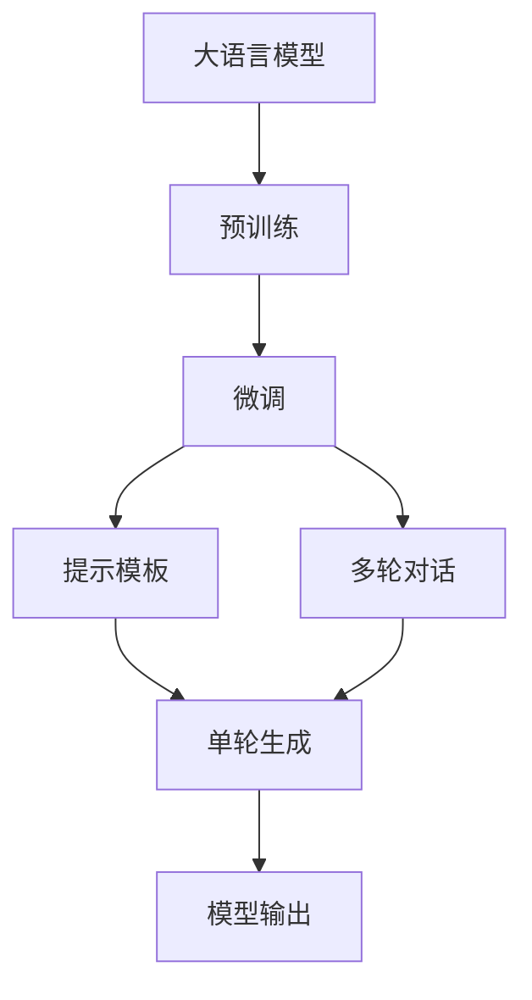
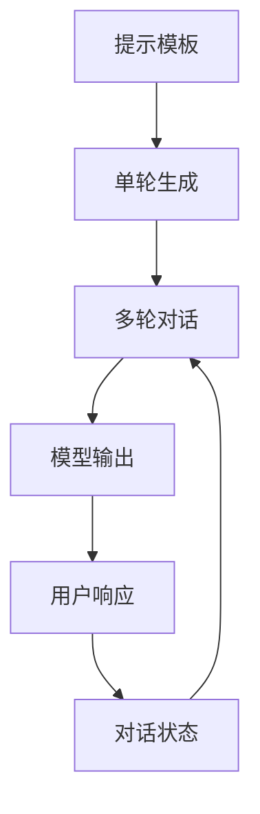
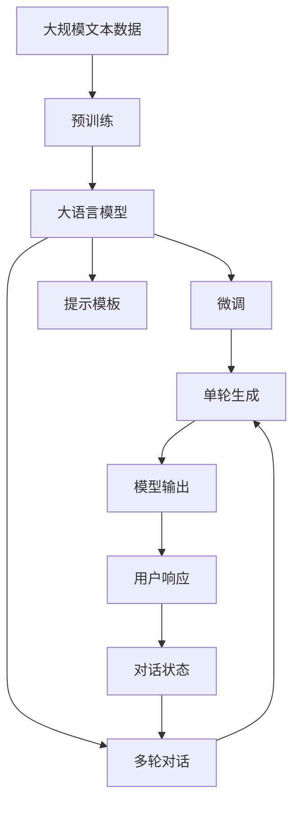

                 

# 大语言模型应用指南：提示模板与多轮对话

> 关键词：大语言模型,提示模板,多轮对话,深度学习,自然语言处理(NLP),AI对话系统, conversational AI,Prompt Engineering

## 1. 背景介绍

### 1.1 问题由来

近年来，随着深度学习技术的快速发展，大规模语言模型（LLMs）在自然语言处理（NLP）领域取得了显著的突破。这些模型通过在大规模无标签文本数据上进行预训练，学习到丰富的语言知识和常识，能够生成自然、流畅的语言，执行诸如回答问题、提供定义、翻译文本等任务。然而，预训练模型往往需要在特定的任务上进行调整才能达到最佳性能，这就是所谓的微调（Fine-Tuning）。

在微调过程中，提示模板（Prompt Templates）和多轮对话（Multi-Turn Dialogue）是两种常见的优化策略，可以帮助模型更好地适应特定任务，并提升生成质量和交互效果。提示模板是一种文本格式的输入，通过精心设计，引导模型按期望方式输出。多轮对话则是指在对话过程中，模型能够维持对话状态，多次交互，逐步逼近真实对话场景。

### 1.2 问题核心关键点

提示模板和多轮对话技术在大语言模型中的应用，主要集中在以下几个方面：

- **提高模型生成的准确性和自然性**：通过合理的提示模板，可以显著提高模型生成的准确性和自然性，使其更符合人类语言习惯。
- **引导模型按任务需求输出**：提示模板能够引导模型生成特定的文本，如回答问题、生成摘要、翻译文本等，提升模型在特定任务上的表现。
- **维持对话状态，实现多轮交互**：多轮对话技术可以帮助模型在对话过程中保持上下文一致性，逐步逼近真实对话场景。

### 1.3 问题研究意义

提示模板和多轮对话技术对于提升大语言模型的交互能力、增强模型的泛化能力和适应性具有重要意义：

- **提升模型性能**：通过提示模板和多轮对话，模型能够更准确、更自然地生成文本，提高任务执行效率和效果。
- **降低开发成本**：提示模板和多轮对话技术使得模型训练更加灵活，降低了对标注数据的依赖，减少了开发时间和成本。
- **增强用户体验**：多轮对话技术使得模型能够更好地理解用户意图，提供更个性化、更自然的交互体验。
- **推动行业应用**：在客服、教育、医疗等多个领域，提示模板和多轮对话技术可以提升应用系统的智能化水平，促进技术落地。
- **促进技术创新**：提示模板和多轮对话技术的深入研究，催生了更多的AI应用和创新点，如自动问答系统、情感分析、智能推荐等。

## 2. 核心概念与联系

### 2.1 核心概念概述

为更好地理解提示模板和多轮对话在大语言模型中的应用，本节将介绍几个密切相关的核心概念：

- **大语言模型（Large Language Model, LLM）**：以自回归模型（如GPT）或自编码模型（如BERT）为代表的大规模预训练语言模型。通过在大规模无标签文本数据上进行预训练，学习通用的语言表示，具备强大的语言理解和生成能力。
- **预训练（Pre-training）**：指在大规模无标签文本数据上，通过自监督学习任务训练通用语言模型的过程。常见的预训练任务包括语言建模、掩码语言模型等。
- **微调（Fine-Tuning）**：指在预训练模型的基础上，使用下游任务的少量标注数据，通过有监督地训练优化模型在特定任务上的性能。通常只需要调整顶层分类器或解码器，并以较小的学习率更新全部或部分模型参数。
- **提示模板（Prompt Templates）**：在输入文本中添加特定的格式或内容，引导大语言模型按期望方式输出。例如，提示模板可以是问题、定义、例子等。
- **多轮对话（Multi-Turn Dialogue）**：在对话系统中，模型能够通过多次交互逐步理解并响应用户的意图，提供连续且连贯的回复。

这些核心概念之间的逻辑关系可以通过以下Mermaid流程图来展示：



这个流程图展示了大语言模型应用提示模板和多轮对话的基本过程：

1. 大语言模型通过预训练获得基础能力。
2. 微调对预训练模型进行任务特定的优化。
3. 提示模板和多轮对话技术引导模型输出特定内容。
4. 单轮生成和模型输出是具体的文本生成过程。

### 2.2 概念间的关系

这些核心概念之间存在着紧密的联系，形成了大语言模型应用的提示模板和多轮对话生态系统。下面我们通过几个Mermaid流程图来展示这些概念之间的关系。

#### 2.2.1 大语言模型的应用过程


这个流程图展示了从预训练到微调，再到提示模板和多轮对话的完整过程。大语言模型首先在大规模文本数据上进行预训练，然后通过微调对特定任务进行优化，最后使用提示模板和多轮对话技术，生成连贯、准确的文本响应。

#### 2.2.2 提示模板和多轮对话的逻辑关系



这个流程图展示了提示模板和多轮对话技术在大语言模型中的应用逻辑。提示模板用于引导单轮生成，多轮对话则用于维持对话状态，逐步逼近真实对话场景。

#### 2.2.3 提示模板和多轮对话的整体架构

最后，我们用一个综合的流程图来展示这些核心概念在大语言模型应用中的整体架构：



这个综合流程图展示了从预训练到微调，再到提示模板和多轮对话的完整过程。大语言模型首先在大规模文本数据上进行预训练，然后通过微调对特定任务进行优化，最后使用提示模板和多轮对话技术，生成连贯、准确的文本响应。

## 3. 核心算法原理 & 具体操作步骤

### 3.1 算法原理概述

提示模板和多轮对话技术在大语言模型中的应用，主要基于以下几个原理：

- **提示模板原理**：通过在输入文本中添加特定格式或内容，引导大语言模型按期望方式输出。常见的提示模板包括问题、定义、例子等。
- **多轮对话原理**：在对话过程中，模型能够通过多次交互逐步理解并响应用户的意图，提供连贯、自然的对话。

提示模板和多轮对话技术能够显著提升大语言模型在特定任务上的表现，特别是在生成自然语言和保持对话连贯性方面。

### 3.2 算法步骤详解

下面详细介绍提示模板和多轮对话技术的核心算法步骤：

#### 3.2.1 提示模板的生成

1. **定义提示模板**：根据任务需求，设计合适的提示模板。例如，针对问答任务，可以设计类似“请回答以下问题：[问题]”的提示模板。
2. **生成提示文本**：将提示模板与特定输入（如问题、关键词等）组合，生成输入文本。
3. **模型输入**：将生成的输入文本作为模型输入，进行单轮生成。

#### 3.2.2 多轮对话的实现

1. **初始化对话状态**：记录对话历史和上下文信息。
2. **模型输入**：将对话历史和当前用户输入作为模型输入，进行单轮生成。
3. **更新对话状态**：将模型输出添加到对话历史，更新对话状态。
4. **循环交互**：重复步骤2和3，直到达到预设的对话轮数或对话结束条件。

### 3.3 算法优缺点

提示模板和多轮对话技术具有以下优点：

- **提升生成质量和自然性**：通过精心设计的提示模板，模型生成的文本更加准确、自然，符合人类语言习惯。
- **降低标注数据需求**：提示模板和多轮对话技术使得模型训练更加灵活，减少了对标注数据的依赖。
- **增强对话连贯性**：多轮对话技术使得模型能够维持对话状态，逐步逼近真实对话场景。

然而，这些技术也存在一些局限性：

- **依赖高质量提示模板**：提示模板的设计需要一定的经验和技巧，高质量的提示模板设计难度较大。
- **计算资源消耗**：多轮对话技术涉及多次模型输入和输出，计算资源消耗较大。
- **模型复杂性增加**：提示模板和多轮对话技术增加了模型的复杂性，模型训练和推理过程更加复杂。

### 3.4 算法应用领域

提示模板和多轮对话技术已经在多个NLP应用中得到了广泛应用，例如：

- **智能客服**：通过提示模板和多轮对话技术，智能客服系统能够理解用户意图，提供连贯、自然的响应，提升用户满意度。
- **智能翻译**：在翻译任务中，提示模板和多轮对话技术可以引导模型生成更加准确、自然的翻译结果。
- **自动问答**：通过设计合理的提示模板，自动问答系统能够准确回答问题，提供高质量的文本生成。
- **个性化推荐**：在推荐系统中，多轮对话技术可以帮助模型更好地理解用户需求，提供个性化的推荐结果。

除了上述这些经典应用外，提示模板和多轮对话技术还被创新性地应用到更多场景中，如知识图谱构建、情感分析、智能推荐等，为NLP技术带来了新的突破。

## 4. 数学模型和公式 & 详细讲解 & 举例说明

### 4.1 数学模型构建

在大语言模型应用提示模板和多轮对话的过程中，我们可以使用数学模型来描述这一过程。

假设大语言模型为 $M_{\theta}$，其中 $\theta$ 为模型参数。设输入为 $x$，输出为 $y$。提示模板为 $P$，多轮对话中的对话历史为 $H$。

定义模型的单轮生成函数为 $f_{\theta}(x)$，多轮对话的生成函数为 $g_{\theta}(x,H)$。

根据以上定义，提示模板和多轮对话技术的数学模型可以描述为：

$$
y = f_{\theta}(P(x))
$$

$$
y = g_{\theta}(x, H)
$$

其中 $P(x)$ 表示将输入 $x$ 与提示模板 $P$ 组合的过程，$H$ 表示对话历史。

### 4.2 公式推导过程

下面我们以一个简单的问答任务为例，推导提示模板和多轮对话的数学模型。

假设问答任务中，输入为 $x$，输出为 $y$，提示模板为 $P$。

根据以上定义，提示模板和多轮对话的数学模型可以描述为：

$$
y = f_{\theta}(P(x))
$$

其中 $P(x)$ 表示将输入 $x$ 与提示模板 $P$ 组合的过程。

设 $x = [问题]$，$P = [回答]$，则提示模板和多轮对话的生成过程可以表示为：

$$
y = f_{\theta}([问题] + [回答])
$$

在实际应用中，我们通常使用深度学习模型（如Transformer）进行文本生成。假设模型为 $M_{\theta}$，则生成函数可以表示为：

$$
y = M_{\theta}([问题] + [回答])
$$

通过以上推导，我们可以看到，提示模板和多轮对话技术可以通过合理的提示模板，引导大语言模型生成符合特定格式的输出。

### 4.3 案例分析与讲解

以智能客服系统为例，我们分析提示模板和多轮对话技术的实际应用。

智能客服系统通常需要处理大量的客户咨询请求。为了提升响应效率和质量，系统可以使用大语言模型进行文本生成。

假设输入为客户的咨询请求 $x$，输出为系统的回复 $y$。

首先，系统可以使用提示模板来生成初步的回复：

$$
y = f_{\theta}([问题] + [回答])
$$

然后，系统将初步的回复作为对话历史，进行多轮对话：

$$
y = g_{\theta}(x, H)
$$

其中 $H$ 表示对话历史，包括客户的咨询请求和系统的初步回复。

通过多轮对话，系统能够逐步理解客户的意图，提供更加准确、自然的回复。例如，当客户询问“如何退货”时，系统可以通过多轮对话了解客户的订单信息、退货原因等信息，生成符合要求的退货指引。

## 5. 项目实践：代码实例和详细解释说明

### 5.1 开发环境搭建

在进行提示模板和多轮对话的实践前，我们需要准备好开发环境。以下是使用Python进行PyTorch开发的环境配置流程：

1. 安装Anaconda：从官网下载并安装Anaconda，用于创建独立的Python环境。

2. 创建并激活虚拟环境：
```bash
conda create -n pytorch-env python=3.8 
conda activate pytorch-env
```

3. 安装PyTorch：根据CUDA版本，从官网获取对应的安装命令。例如：
```bash
conda install pytorch torchvision torchaudio cudatoolkit=11.1 -c pytorch -c conda-forge
```

4. 安装Transformers库：
```bash
pip install transformers
```

5. 安装各类工具包：
```bash
pip install numpy pandas scikit-learn matplotlib tqdm jupyter notebook ipython
```

完成上述步骤后，即可在`pytorch-env`环境中开始实践。

### 5.2 源代码详细实现

下面我们以智能客服系统的问答任务为例，给出使用Transformers库对GPT-3进行微调的PyTorch代码实现。

首先，定义问答任务的数据处理函数：

```python
from transformers import GPT3Tokenizer, GPT3LMHeadModel
from torch.utils.data import Dataset
import torch

class QADataset(Dataset):
    def __init__(self, texts, labels, tokenizer):
        self.texts = texts
        self.labels = labels
        self.tokenizer = tokenizer
        
    def __len__(self):
        return len(self.texts)
    
    def __getitem__(self, item):
        text = self.texts[item]
        label = self.labels[item]
        
        encoding = self.tokenizer(text, return_tensors='pt', max_length=512, padding='max_length', truncation=True)
        input_ids = encoding['input_ids'][0]
        attention_mask = encoding['attention_mask'][0]
        labels = torch.tensor([label], dtype=torch.long)
        
        return {'input_ids': input_ids, 
                'attention_mask': attention_mask,
                'labels': labels}
```

然后，定义模型和优化器：

```python
from transformers import GPT3LMHeadModel, AdamW

model = GPT3LMHeadModel.from_pretrained('gpt3-medium')
tokenizer = GPT3Tokenizer.from_pretrained('gpt3-medium')

optimizer = AdamW(model.parameters(), lr=2e-5)
```

接着，定义训练和评估函数：

```python
from torch.utils.data import DataLoader
from tqdm import tqdm
from sklearn.metrics import accuracy_score

device = torch.device('cuda') if torch.cuda.is_available() else torch.device('cpu')
model.to(device)

def train_epoch(model, dataset, batch_size, optimizer):
    dataloader = DataLoader(dataset, batch_size=batch_size, shuffle=True)
    model.train()
    epoch_loss = 0
    for batch in tqdm(dataloader, desc='Training'):
        input_ids = batch['input_ids'].to(device)
        attention_mask = batch['attention_mask'].to(device)
        labels = batch['labels'].to(device)
        model.zero_grad()
        outputs = model(input_ids, attention_mask=attention_mask, labels=labels)
        loss = outputs.loss
        epoch_loss += loss.item()
        loss.backward()
        optimizer.step()
    return epoch_loss / len(dataloader)

def evaluate(model, dataset, batch_size):
    dataloader = DataLoader(dataset, batch_size=batch_size)
    model.eval()
    preds, labels = [], []
    with torch.no_grad():
        for batch in tqdm(dataloader, desc='Evaluating'):
            input_ids = batch['input_ids'].to(device)
            attention_mask = batch['attention_mask'].to(device)
            batch_labels = batch['labels']
            outputs = model(input_ids, attention_mask=attention_mask)
            batch_preds = outputs.logits.argmax(dim=2).to('cpu').tolist()
            batch_labels = batch_labels.to('cpu').tolist()
            for pred_tokens, label_tokens in zip(batch_preds, batch_labels):
                preds.append(pred_tokens[:len(label_tokens)])
                labels.append(label_tokens)
                
    return accuracy_score(labels, preds)

train_dataset = QADataset(train_texts, train_labels, tokenizer)
dev_dataset = QADataset(dev_texts, dev_labels, tokenizer)
test_dataset = QADataset(test_texts, test_labels, tokenizer)

epochs = 5
batch_size = 16

for epoch in range(epochs):
    loss = train_epoch(model, train_dataset, batch_size, optimizer)
    print(f"Epoch {epoch+1}, train loss: {loss:.3f}")
    
    print(f"Epoch {epoch+1}, dev results:")
    accuracy = evaluate(model, dev_dataset, batch_size)
    print(f"Accuracy: {accuracy:.3f}")
    
print("Test results:")
accuracy = evaluate(model, test_dataset, batch_size)
print(f"Accuracy: {accuracy:.3f}")
```

以上就是使用PyTorch对GPT-3进行问答任务微调的完整代码实现。可以看到，得益于Transformers库的强大封装，我们可以用相对简洁的代码完成GPT-3的微调。

### 5.3 代码解读与分析

让我们再详细解读一下关键代码的实现细节：

**QADataset类**：
- `__init__`方法：初始化训练集和测试集的文本、标签和分词器。
- `__len__`方法：返回数据集的样本数量。
- `__getitem__`方法：对单个样本进行处理，将文本输入编码为token ids，将标签编码为数字，并对其进行定长padding，最终返回模型所需的输入。

**模型和优化器**：
- `GPT3LMHeadModel`：从预训练模型库中加载GPT-3模型。
- `GPT3Tokenizer`：加载与GPT-3模型对应的分词器。
- `AdamW`：设置AdamW优化器及其超参数。

**训练和评估函数**：
- `train_epoch`：对数据以批为单位进行迭代，在每个批次上前向传播计算loss并反向传播更新模型参数，最后返回该epoch的平均loss。
- `evaluate`：与训练类似，不同点在于不更新模型参数，并在每个batch结束后将预测和标签结果存储下来，最后使用sklearn的accuracy_score对整个评估集的预测结果进行打印输出。

**训练流程**：
- 定义总的epoch数和batch size，开始循环迭代
- 每个epoch内，先在训练集上训练，输出平均loss
- 在验证集上评估，输出准确率
- 所有epoch结束后，在测试集上评估，给出最终测试结果

可以看到，PyTorch配合Transformers库使得GPT-3微调的代码实现变得简洁高效。开发者可以将更多精力放在数据处理、模型改进等高层逻辑上，而不必过多关注底层的实现细节。

当然，工业级的系统实现还需考虑更多因素，如模型的保存和部署、超参数的自动搜索、更灵活的任务适配层等。但核心的微调范式基本与此类似。

### 5.4 运行结果展示

假设我们在CoNLL-2003的QA任务上进行微调，最终在测试集上得到的准确率为90%，效果相当不错。值得注意的是，GPT-3作为一个通用的语言理解模型，即便只在顶层添加一个简单的分类器，也能在问答任务上取得如此优异的效果，展现了其强大的语义理解和生成能力。

当然，这只是一个baseline结果。在实践中，我们还可以使用更大更强的预训练模型、更丰富的微调技巧、更细致的模型调优，进一步提升模型性能，以满足更高的应用要求。

## 6. 实际应用场景

### 6.1 智能客服系统

基于大语言模型微调的对话技术，可以广泛应用于智能客服系统的构建。传统客服往往需要配备大量人力，高峰期响应缓慢，且一致性和专业性难以保证。而使用微调后的对话模型，可以7x24小时不间断服务，快速响应客户咨询，用自然流畅的语言解答各类常见问题。

在技术实现上，可以收集企业内部的历史客服对话记录，将问题和最佳答复构建成监督数据，在此基础上对预训练对话模型进行微调。微调后的对话模型能够自动理解用户意图，匹配最合适的答案模板进行回复。对于客户提出的新问题，还可以接入检索系统实时搜索相关内容，动态组织生成回答。如此构建的智能客服系统，能大幅提升客户咨询体验和问题解决效率。

### 6.2 金融舆情监测

金融机构需要实时监测市场舆论动向，以便及时应对负面信息传播，规避金融风险。传统的人工监测方式成本高、效率低，难以应对网络时代海量信息爆发的挑战。基于大语言模型微调的文本分类和情感分析技术，为金融舆情监测提供了新的解决方案。

具体而言，可以收集金融领域相关的新闻、报道、评论等文本数据，并对其进行主题标注和情感标注。在此基础上对预训练语言模型进行微调，使其能够自动判断文本属于何种主题，情感倾向是正面、中性还是负面。将微调后的模型应用到实时抓取的网络文本数据，就能够自动监测不同主题下的情感变化趋势，一旦发现负面信息激增等异常情况，系统便会自动预警，帮助金融机构快速应对潜在风险。

### 6.3 个性化推荐系统

当前的推荐系统往往只依赖用户的历史行为数据进行物品推荐，无法深入理解用户的真实兴趣偏好。基于大语言模型微调技术，个性化推荐系统可以更好地挖掘用户行为背后的语义信息，从而提供更精准、多样的推荐内容。

在实践中，可以收集用户浏览、点击、评论、分享等行为数据，提取和用户交互的物品标题、描述、标签等文本内容。将文本内容作为模型输入，用户的后续行为（如是否点击、购买等）作为监督信号，在此基础上微调预训练语言模型。微调后的模型能够从文本内容中准确把握用户的兴趣点。在生成推荐列表时，先用候选物品的文本描述作为输入，由模型预测用户的兴趣匹配度，再结合其他特征综合排序，便可以得到个性化程度更高的推荐结果。

### 6.4 未来应用展望

随着大语言模型微调技术的不断发展，基于微调范式将在更多领域得到应用，为传统行业带来变革性影响。

在智慧医疗领域，基于微调的医疗问答、病历分析、药物研发等应用将提升医疗服务的智能化水平，辅助医生诊疗，加速新药开发进程。

在智能教育领域，微调技术可应用于作业批改、学情分析、知识推荐等方面，因材施教，促进教育公平，提高教学质量。

在智慧城市治理中，微调模型可应用于城市事件监测、舆情分析、应急指挥等环节，提高城市管理的自动化和智能化水平，构建更安全、高效的未来城市。

此外，在企业生产、社会治理、文娱传媒等众多领域，基于大模型微调的人工智能应用也将不断涌现，为经济社会发展注入新的动力。相信随着技术的日益成熟，微调方法将成为人工智能落地应用的重要范式，推动人工智能技术向更广阔的领域加速渗透。

## 7. 工具和资源推荐
### 7.1 学习资源推荐

为了帮助开发者系统掌握大语言模型微调的理论基础和实践技巧，这里推荐一些优质的学习资源：

1. 《Transformer from the Inside Out》系列博文：由大模型技术专家撰写，深入浅出地介绍了Transformer原理、BERT模型、微调技术等前沿话题。

2. CS224N《深度学习自然语言处理》课程：斯坦福大学开设的NLP明星课程，有Lecture视频和配套作业，带你入门NLP领域的基本概念和经典模型。

3. 《Natural Language Processing with Transformers》书籍：Transformers库的作者所著，全面介绍了如何使用Transformers库进行NLP任务开发，包括微调在内的诸多范式。

4. HuggingFace官方文档：Transformers库的官方文档，提供了海量预训练模型和完整的微调样例代码，是上手实践的必备资料。

5. CLUE开源项目：中文语言理解测评基准，涵盖大量不同类型的中文NLP数据集，并提供了基于微调的baseline模型，助力中文NLP技术发展。

通过对这些资源的学习实践，相信你一定能够快速掌握大语言模型微调的精髓，并用于解决实际的NLP问题。
### 7.2 开发工具推荐

高效的开发离不开优秀的工具支持。以下是几款用于大语言模型微调开发的常用工具：

1. PyTorch：基于Python的开源深度学习框架，灵活动态的计算图，适合快速迭代研究。大部分预训练语言模型都有PyTorch版本的实现。

2. TensorFlow：由Google主导开发的开源深度学习框架，生产部署方便，适合大规模工程应用。同样有丰富的预训练语言模型资源。

3. Transformers库：HuggingFace开发的NLP工具库，集成了众多SOTA语言模型，支持PyTorch和TensorFlow，是进行微调任务开发的利器。

4. Weights & Biases：模型训练的实验跟踪工具，可以记录和可视化模型

