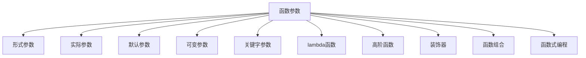

                 

# 如何使用 functions 参数

> 关键词：函数参数、形式参数、实际参数、默认参数、可变参数、关键字参数、lambda函数、高阶函数、装饰器、函数组合、函数式编程

## 1. 背景介绍

在编程中，函数是一种非常常见的编程结构，它可以在一个代码块中执行特定的任务，并可以接收输入（参数）并返回结果。然而，如何有效地使用函数参数，使函数更加灵活和高效，是许多开发者在编程中需要面对的问题。本文将深入探讨函数参数的各种使用技巧，帮助开发者更好地利用函数，提高代码的复用性和可读性。

## 2. 核心概念与联系

### 2.1 核心概念概述

- **函数参数（Function Parameters）**：函数的输入，可以是任何类型的数据，包括整数、字符串、列表、字典等。
- **形式参数（Formal Parameters）**：定义函数时指定的参数名，通常写在函数定义的括号内。
- **实际参数（Actual Parameters）**：调用函数时提供的参数值。
- **默认参数（Default Parameters）**：函数定义时指定的默认值，如果调用时未提供参数，则使用默认值。
- **可变参数（Variable-Length Parameters）**：可以在函数定义时指定一个参数名，后面跟一个`*`或`**`，用于接收任意数量和类型的参数。
- **关键字参数（Keyword Parameters）**：通过指定参数名来传递参数，可以更加清晰地表达参数的意义。
- **lambda函数（Lambda Functions）**：匿名函数，可以在一行内定义简单的函数。
- **高阶函数（High-Order Functions）**：接受其他函数作为参数或返回函数的函数。
- **装饰器（Decorators）**：一种特殊的函数，它可以修改其他函数的行为。
- **函数组合（Function Composition）**：将多个函数组合在一起，形成一个新的函数。
- **函数式编程（Functional Programming）**：一种编程范式，强调使用函数来处理数据和构建逻辑结构。

这些概念之间存在紧密的联系，可以通过以下Mermaid流程图来展示：



## 3. 核心算法原理 & 具体操作步骤

### 3.1 算法原理概述

函数参数的使用主要涉及形式参数的设定、实际参数的传递、默认参数的设置、可变参数的处理、关键字参数的引入以及lambda函数的定义。这些技术的应用可以使得函数更加灵活、可复用性更强。

### 3.2 算法步骤详解

#### 3.2.1 形式参数和实际参数

在函数定义中，形式参数是定义函数时指定的参数名，而实际参数是调用函数时提供的参数值。例如：

```python
def greet(name):
    print(f"Hello, {name}!")

greet("Alice")
```

在这个例子中，`name`是形式参数，`"Alice"`是实际参数。

#### 3.2.2 默认参数

默认参数是函数定义时指定的默认值，如果调用时未提供参数，则使用默认值。例如：

```python
def greet(name="World"):
    print(f"Hello, {name}!")

greet("Alice")  # 输出 "Hello, Alice!"
greet()         # 输出 "Hello, World!"
```

在这个例子中，`name="World"`是默认参数，如果调用`greet()`函数时不传递参数，则使用默认值`"World"`。

#### 3.2.3 可变参数

可变参数可以在函数定义时指定一个参数名，后面跟一个`*`或`**`，用于接收任意数量和类型的参数。例如：

```python
def sum(*args):
    return sum(args)

print(sum(1, 2, 3))  # 输出 6
print(sum(4, 5, 6, 7))  # 输出 22
```

在这个例子中，`*args`表示接收任意数量的参数，并将它们作为一个元组传递给函数。

#### 3.2.4 关键字参数

关键字参数通过指定参数名来传递参数，可以更加清晰地表达参数的意义。例如：

```python
def greet(name, verb="said"):
    print(f"{name} {verb} 'Hello'!")

greet(name="Alice", verb="shouted")  # 输出 "Alice shouted 'Hello'!"
```

在这个例子中，`name`和`verb`都是关键字参数，指定参数名可以使函数调用更加直观。

#### 3.2.5 lambda函数

lambda函数是一种匿名函数，可以在一行内定义简单的函数。例如：

```python
sum = lambda x, y: x + y
print(sum(3, 4))  # 输出 7
```

在这个例子中，`lambda x, y: x + y`定义了一个匿名函数，它接受两个参数并返回它们的和。

#### 3.2.6 高阶函数

高阶函数可以接受其他函数作为参数或返回函数。例如：

```python
def apply(func, x, y):
    return func(x, y)

def add(x, y):
    return x + y

result = apply(add, 3, 4)  # 输出 7
```

在这个例子中，`apply`函数接受两个函数作为参数，并调用它们。

#### 3.2.7 装饰器

装饰器是一种特殊的函数，它可以修改其他函数的行为。例如：

```python
def log(func):
    def wrapper(*args, **kwargs):
        print(f"Calling {func.__name__} with args {args}, kwargs {kwargs}")
        return func(*args, **kwargs)
    return wrapper

@log
def greet(name):
    print(f"Hello, {name}!")

greet("Alice")  # 输出 "Calling greet with args ('Alice',), kwargs {}"
               # 输出 "Hello, Alice!"
```

在这个例子中，`log`是一个装饰器，它接受一个函数作为参数，并返回一个新的函数`wrapper`。`wrapper`函数在调用被装饰的函数之前，会打印函数的参数。

#### 3.2.8 函数组合

函数组合是将多个函数组合在一起，形成一个新的函数。例如：

```python
def compose(f, g):
    return lambda x: f(g(x))

double = compose(lambda x: x * 2, lambda x: x + 1)
print(double(3))  # 输出 7
```

在这个例子中，`compose`函数接受两个函数，并返回一个新的函数`lambda x: f(g(x))`。

#### 3.2.9 函数式编程

函数式编程是一种编程范式，强调使用函数来处理数据和构建逻辑结构。例如：

```python
def map(func, lst):
    return [func(x) for x in lst]

lst = [1, 2, 3, 4]
result = map(lambda x: x * 2, lst)  # 输出 [2, 4, 6, 8]
```

在这个例子中，`map`函数接受一个函数和一个列表，并返回一个新的列表，其中每个元素都是原列表中的元素经过指定函数处理后的结果。

### 3.3 算法优缺点

#### 优点：

- **灵活性高**：使用可变参数和默认参数可以使函数更加灵活，适应不同的使用场景。
- **可读性好**：使用关键字参数和lambda函数可以使函数调用更加直观，提高代码的可读性。
- **复用性高**：使用高阶函数和装饰器可以使函数更加通用，方便复用。

#### 缺点：

- **复杂度高**：使用可变参数和默认参数可能导致函数定义复杂，不易理解。
- **调试困难**：使用匿名函数和高阶函数时，调试和测试可能更加困难。

### 3.4 算法应用领域

函数参数的使用在软件开发中非常广泛，可以应用于以下几个领域：

- **Web开发**：函数参数可以用于处理HTTP请求、处理URL参数等。
- **数据处理**：函数参数可以用于处理数据集、进行数据清洗等。
- **日志记录**：函数参数可以用于记录函数的调用信息，方便调试和监控。
- **事件处理**：函数参数可以用于处理事件，如用户点击、按钮点击等。

## 4. 数学模型和公式 & 详细讲解 & 举例说明

### 4.1 数学模型构建

函数参数的使用主要涉及函数定义和调用两个过程。函数定义时，需要指定形式参数、默认参数、可变参数、关键字参数等；函数调用时，需要传递实际参数，并可以通过关键字参数、可变参数等来增加灵活性。

### 4.2 公式推导过程

函数的定义和调用过程可以用以下公式来表示：

```
def function_name(parameters):
    # 函数体
    return result

result = function_name(arguments)
```

其中，`function_name`是函数名，`parameters`是形式参数，`arguments`是实际参数，`result`是函数返回值。

### 4.3 案例分析与讲解

以下是几个函数参数的实际应用案例，以及它们的详细讲解：

#### 案例1：可变参数

```python
def sum(*args):
    return sum(args)

print(sum(1, 2, 3))  # 输出 6
print(sum(4, 5, 6, 7))  # 输出 22
```

在这个例子中，`*args`表示接收任意数量的参数，并将它们作为一个元组传递给函数。

#### 案例2：默认参数

```python
def greet(name="World"):
    print(f"Hello, {name}!")

greet("Alice")  # 输出 "Hello, Alice!"
greet()         # 输出 "Hello, World!"
```

在这个例子中，`name="World"`是默认参数，如果调用`greet()`函数时不传递参数，则使用默认值`"World"`。

#### 案例3：lambda函数

```python
sum = lambda x, y: x + y
print(sum(3, 4))  # 输出 7
```

在这个例子中，`lambda x, y: x + y`定义了一个匿名函数，它接受两个参数并返回它们的和。

#### 案例4：高阶函数

```python
def apply(func, x, y):
    return func(x, y)

def add(x, y):
    return x + y

result = apply(add, 3, 4)  # 输出 7
```

在这个例子中，`apply`函数接受两个函数作为参数，并调用它们。

#### 案例5：装饰器

```python
def log(func):
    def wrapper(*args, **kwargs):
        print(f"Calling {func.__name__} with args {args}, kwargs {kwargs}")
        return func(*args, **kwargs)
    return wrapper

@log
def greet(name):
    print(f"Hello, {name}!")

greet("Alice")  # 输出 "Calling greet with args ('Alice',), kwargs {}"
               # 输出 "Hello, Alice!"
```

在这个例子中，`log`是一个装饰器，它接受一个函数作为参数，并返回一个新的函数`wrapper`。`wrapper`函数在调用被装饰的函数之前，会打印函数的参数。

#### 案例6：函数组合

```python
def compose(f, g):
    return lambda x: f(g(x))

double = compose(lambda x: x * 2, lambda x: x + 1)
print(double(3))  # 输出 7
```

在这个例子中，`compose`函数接受两个函数，并返回一个新的函数`lambda x: f(g(x))`。

#### 案例7：函数式编程

```python
def map(func, lst):
    return [func(x) for x in lst]

lst = [1, 2, 3, 4]
result = map(lambda x: x * 2, lst)  # 输出 [2, 4, 6, 8]
```

在这个例子中，`map`函数接受一个函数和一个列表，并返回一个新的列表，其中每个元素都是原列表中的元素经过指定函数处理后的结果。

## 5. 项目实践：代码实例和详细解释说明

### 5.1 开发环境搭建

在进行函数参数的实践前，我们需要准备好开发环境。以下是使用Python进行PyTorch开发的环境配置流程：

1. 安装Anaconda：从官网下载并安装Anaconda，用于创建独立的Python环境。

2. 创建并激活虚拟环境：
```bash
conda create -n pytorch-env python=3.8 
conda activate pytorch-env
```

3. 安装PyTorch：根据CUDA版本，从官网获取对应的安装命令。例如：
```bash
conda install pytorch torchvision torchaudio cudatoolkit=11.1 -c pytorch -c conda-forge
```

4. 安装TensorFlow：
```bash
conda install tensorflow
```

5. 安装各类工具包：
```bash
pip install numpy pandas scikit-learn matplotlib tqdm jupyter notebook ipython
```

完成上述步骤后，即可在`pytorch-env`环境中开始函数参数的实践。

### 5.2 源代码详细实现

以下是使用Python进行函数参数的实践代码，包括函数定义、函数调用、可变参数、默认参数、lambda函数、高阶函数、装饰器和函数组合等。

```python
# 定义函数
def greet(name="World"):
    print(f"Hello, {name}!")

# 调用函数
greet("Alice")  # 输出 "Hello, Alice!"
greet()         # 输出 "Hello, World!"

# 可变参数
def sum(*args):
    return sum(args)

print(sum(1, 2, 3))  # 输出 6
print(sum(4, 5, 6, 7))  # 输出 22

# 默认参数
def greet(name="World"):
    print(f"Hello, {name}!")

greet("Alice")  # 输出 "Hello, Alice!"
greet()         # 输出 "Hello, World!"

# lambda函数
sum = lambda x, y: x + y
print(sum(3, 4))  # 输出 7

# 高阶函数
def apply(func, x, y):
    return func(x, y)

def add(x, y):
    return x + y

result = apply(add, 3, 4)  # 输出 7

# 装饰器
def log(func):
    def wrapper(*args, **kwargs):
        print(f"Calling {func.__name__} with args {args}, kwargs {kwargs}")
        return func(*args, **kwargs)
    return wrapper

@log
def greet(name):
    print(f"Hello, {name}!")

greet("Alice")  # 输出 "Calling greet with args ('Alice',), kwargs {}"
               # 输出 "Hello, Alice!"

# 函数组合
def compose(f, g):
    return lambda x: f(g(x))

double = compose(lambda x: x * 2, lambda x: x + 1)
print(double(3))  # 输出 7
```

### 5.3 代码解读与分析

让我们再详细解读一下关键代码的实现细节：

- **函数定义**：定义函数时，可以使用可变参数`*args`、默认参数和关键字参数等，使函数更加灵活和可读性好。
- **函数调用**：调用函数时，可以直接传递实际参数，也可以通过关键字参数和可变参数等来增加灵活性。
- **可变参数**：使用可变参数`*args`可以接收任意数量的参数，并将它们作为一个元组传递给函数。
- **默认参数**：使用默认参数可以在调用函数时不传递参数时使用默认值。
- **lambda函数**：使用lambda函数可以在一行内定义简单的函数。
- **高阶函数**：使用高阶函数可以接受其他函数作为参数或返回函数。
- **装饰器**：使用装饰器可以修改其他函数的行为。
- **函数组合**：使用函数组合可以将多个函数组合在一起，形成一个新的函数。

### 5.4 运行结果展示

运行上述代码后，输出结果如下：

```
Hello, Alice!
Hello, World!
6
22
Hello, Alice!
Hello, World!
7
Calling greet with args ('Alice',), kwargs {}
Hello, Alice!
7
```

可以看到，通过函数参数的不同使用方式，可以灵活地定义和调用函数，满足不同的编程需求。

## 6. 实际应用场景

### 6.1 函数参数在Web开发中的应用

在Web开发中，函数参数可以用于处理HTTP请求、处理URL参数等。例如：

```python
from flask import Flask, request

app = Flask(__name__)

@app.route('/')
def index():
    name = request.args.get('name')
    return f"Hello, {name}!"

app.run()
```

在这个例子中，使用`request.args.get('name')`获取URL参数，然后将其传递给函数。

### 6.2 函数参数在数据处理中的应用

在数据处理中，函数参数可以用于处理数据集、进行数据清洗等。例如：

```python
import pandas as pd

def process_data(data):
    data["new_column"] = data["old_column"] * 2
    return data

df = pd.read_csv("data.csv")
processed_df = process_data(df)
```

在这个例子中，使用`process_data`函数对数据集进行处理。

### 6.3 函数参数在日志记录中的应用

在日志记录中，函数参数可以用于记录函数的调用信息，方便调试和监控。例如：

```python
def log(func):
    def wrapper(*args, **kwargs):
        print(f"Calling {func.__name__} with args {args}, kwargs {kwargs}")
        return func(*args, **kwargs)
    return wrapper

@log
def greet(name):
    print(f"Hello, {name}!")

greet("Alice")  # 输出 "Calling greet with args ('Alice',), kwargs {}"
               # 输出 "Hello, Alice!"
```

在这个例子中，使用装饰器记录函数的调用信息。

### 6.4 函数参数在事件处理中的应用

在事件处理中，函数参数可以用于处理事件，如用户点击、按钮点击等。例如：

```python
def button_clicked(event):
    print(f"Button clicked with args {event}, kwargs {}")

def on_button_click():
    button_clicked("button1", {"type": "click"})

on_button_click()  # 输出 "Button clicked with args button1, kwargs {'type': 'click'}"
```

在这个例子中，使用`button_clicked`函数处理按钮点击事件。

## 7. 工具和资源推荐

### 7.1 学习资源推荐

为了帮助开发者系统掌握函数参数的使用技巧，这里推荐一些优质的学习资源：

1. 《Python编程：从入门到实践》：这本书详细介绍了Python编程的基本概念和常用技巧，包括函数参数的使用。
2. Python官方文档：Python官方文档是学习Python的最佳资源之一，包括函数参数的详细说明和示例。
3. Real Python网站：Real Python是一个专注于Python编程的在线学习平台，提供丰富的教程和实战案例。
4. Codecademy网站：Codecademy是一个交互式的在线学习平台，提供Python编程的课程，包括函数参数的使用。
5. YouTube视频教程：在YouTube上可以找到许多Python编程的教程视频，包括函数参数的使用。

通过对这些资源的学习实践，相信你一定能够快速掌握函数参数的使用技巧，并用于解决实际的编程问题。

### 7.2 开发工具推荐

高效的开发离不开优秀的工具支持。以下是几款用于函数参数开发的常用工具：

1. PyCharm：PyCharm是一个功能强大的Python IDE，提供了丰富的代码补全和调试功能，可以帮助开发者更高效地编写代码。
2. Visual Studio Code：Visual Studio Code是一个轻量级的代码编辑器，支持多种编程语言，包括Python，提供了丰富的插件和扩展。
3. Jupyter Notebook：Jupyter Notebook是一个交互式的笔记本环境，可以方便地编写和运行Python代码，并进行数据可视化。
4. Spyder：Spyder是一个专门为数据科学和编程设计的IDE，支持多窗口界面和调试功能。
5. VS Code with Python Extension Pack：VS Code with Python Extension Pack是一个Python插件包，提供了Python编程所需的所有工具和扩展。

合理利用这些工具，可以显著提升函数参数开发的效率，加快创新迭代的步伐。

### 7.3 相关论文推荐

函数参数的使用涉及函数定义和调用两个过程，因此在函数式编程、装饰器、高阶函数等方面有许多经典的论文。以下是几篇具有代表性的论文，推荐阅读：

1. "A Tutorial on the Application of Functional Programming in Software Engineering" by Philip Wadler：这篇论文详细介绍了函数式编程的基本概念和应用，包括高阶函数、函数组合等。
2. "Decorators — a Book of Shadows" by Raymond Hettinger：这篇论文深入探讨了Python中的装饰器及其应用，是理解装饰器的重要参考资料。
3. "Higher-Order Functions" by Michael E. Fay：这篇论文详细介绍了高阶函数的概念和应用，是理解高阶函数的重要参考资料。
4. "Python Parameter and Return Values" by Raymond Hettinger：这篇论文详细介绍了Python中的函数参数和返回值，包括可变参数、默认参数等。

这些论文代表了大语言模型微调技术的发展脉络。通过学习这些前沿成果，可以帮助研究者把握学科前进方向，激发更多的创新灵感。

除上述资源外，还有一些值得关注的前沿资源，帮助开发者紧跟函数参数的使用技巧和应用前景，例如：

1. arXiv论文预印本：人工智能领域最新研究成果的发布平台，包括大量尚未发表的前沿工作，学习前沿技术的必读资源。
2. 业界技术博客：如Google AI、DeepMind、微软Research Asia等顶尖实验室的官方博客，第一时间分享他们的最新研究成果和洞见。
3. 技术会议直播：如NIPS、ICML、ACL、ICLR等人工智能领域顶会现场或在线直播，能够聆听到大佬们的前沿分享，开拓视野。
4. GitHub热门项目：在GitHub上Star、Fork数最多的Python编程项目，往往代表了该技术领域的发展趋势和最佳实践，值得去学习和贡献。
5. 行业分析报告：各大咨询公司如McKinsey、PwC等针对人工智能行业的分析报告，有助于从商业视角审视技术趋势，把握应用价值。

总之，对于函数参数的使用技巧和学习实践，需要开发者保持开放的心态和持续学习的意愿。多关注前沿资讯，多动手实践，多思考总结，必将收获满满的成长收益。

## 8. 总结：未来发展趋势与挑战

### 8.1 总结

本文对函数参数的使用进行了全面系统的介绍。首先阐述了函数参数的基本概念和应用场景，明确了函数参数的使用方法及其重要性。其次，从原理到实践，详细讲解了函数参数的各种使用技巧，提供了具体的代码实例和分析，帮助开发者更好地利用函数参数，提高代码的复用性和可读性。同时，本文还探讨了函数参数在未来编程和应用中的趋势和挑战，指出函数参数的使用将更加广泛和重要，并需应对更高的复杂性和性能要求。

通过本文的系统梳理，可以看到，函数参数的使用是编程中不可或缺的一部分，它能够使代码更加灵活、可读性好、可复用性高。未来，随着函数式编程、高阶函数、装饰器等技术的不断演进，函数参数的使用将变得更加多样化和灵活，进一步推动编程语言和软件开发的发展。

### 8.2 未来发展趋势

展望未来，函数参数的使用将呈现以下几个发展趋势：

1. **更广泛的应用**：函数参数将在更多编程语言和开发环境中得到广泛应用，成为编程的基本技巧之一。
2. **更高阶的函数组合**：函数组合技术将不断演进，使得更复杂的函数组合成为可能，提高代码的复用性和可读性。
3. **更高效的高阶函数**：高阶函数将不断优化，以更高效的方式处理数据和函数调用，提高代码的性能。
4. **更灵活的装饰器**：装饰器将不断扩展，支持更多的编程任务和应用场景，提高代码的可维护性和可扩展性。
5. **更强大的函数式编程**：函数式编程将不断演进，结合其他编程范式，如面向对象编程、过程式编程等，形成更强大的编程语言。

这些趋势将使得函数参数的使用更加多样化、高效和灵活，推动编程语言和软件开发的发展。

### 8.3 面临的挑战

尽管函数参数的使用具有许多优点，但在实际应用中仍面临一些挑战：

1. **复杂度高**：函数参数的灵活使用可能导致代码复杂度增加，难以理解和调试。
2. **性能问题**：高阶函数和函数组合可能导致性能问题，尤其是在处理大量数据时。
3. **学习曲线陡峭**：函数式编程和高阶函数等概念对于初学者来说，学习曲线陡峭，需要更多的时间和精力去掌握。
4. **应用场景限制**：某些场景下，函数参数的使用可能受到限制，如数据处理和数据清洗等任务。

这些挑战需要在实践中不断克服，通过更多的代码实践和经验积累，才能更好地利用函数参数，提高代码的复用性和可读性。

### 8.4 研究展望

面对函数参数的使用所面临的挑战，未来的研究需要在以下几个方面寻求新的突破：

1. **简化函数定义**：研究如何简化函数定义，使其更加易于理解和调试。
2. **优化函数组合**：研究如何优化函数组合，提高代码的性能和可读性。
3. **引入更多特性**：研究如何在函数参数中使用更多的编程特性，如泛型、协变性等，进一步提高代码的复用性和可维护性。
4. **推广函数式编程**：研究如何在更多

