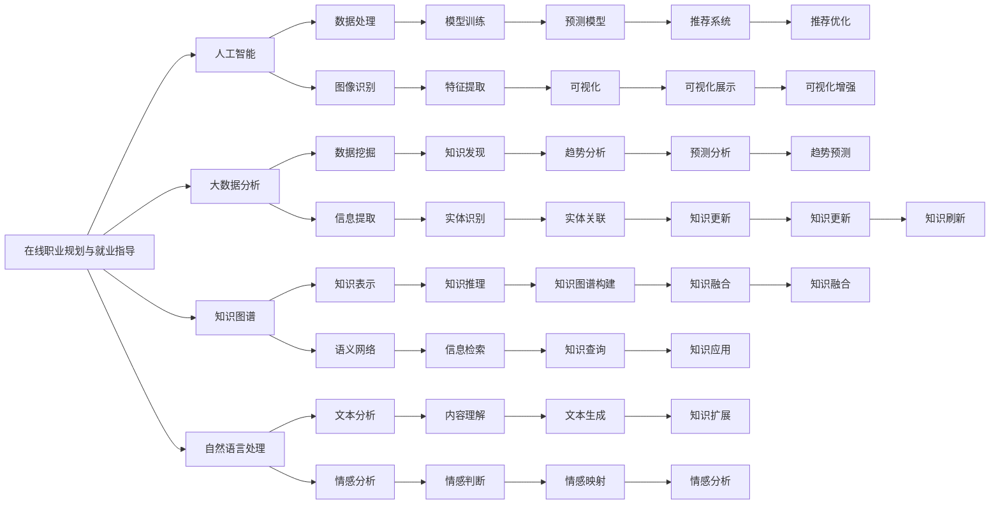

                 

# 如何利用知识付费实现在线职业规划与就业指导？

> 关键词：知识付费, 在线职业规划, 就业指导, 人工智能, 大数据分析, 知识图谱, 自然语言处理

## 1. 背景介绍

随着互联网和信息技术的发展，教育形式正在经历深刻的变革。传统的教育模式已经不能满足人们对学习时间和空间灵活性的需求，在线教育和知识付费成为越来越多人的选择。特别是随着人工智能和数据分析技术的发展，在线职业规划和就业指导开始变得智能化、个性化，真正做到了“因材施教”。本文将从核心概念、算法原理、实际操作等方面深入探讨如何利用知识付费实现在线职业规划与就业指导。

## 2. 核心概念与联系

### 2.1 核心概念概述

**在线职业规划与就业指导**：
基于互联网平台，利用各种先进技术（如人工智能、大数据分析、知识图谱等），为用户提供个性化的职业规划和就业指导服务。

**知识付费**：
用户为获取高质量的教育资源和知识服务而付费的商业模式。知识付费平台提供各种形式的付费内容，包括文章、课程、咨询服务等。

**人工智能（AI）**：
通过机器学习、深度学习等技术模拟人类智能的行为，实现数据处理、图像识别、自然语言处理等功能。

**大数据分析**：
对大规模数据集进行采集、整理、分析和挖掘，从中获取有价值的信息和知识。

**知识图谱**：
通过图结构表示实体之间的关系，构建知识的语义网络，用于知识表示、推理和查询等应用。

**自然语言处理（NLP）**：
使计算机能够理解、处理和生成人类语言的技术。

### 2.2 核心概念之间的关系

这些核心概念之间存在着紧密的联系。在线职业规划与就业指导需要借助AI、大数据分析和知识图谱等技术，为用户提供个性化的服务。知识付费则提供高质量的教育资源和知识服务，成为在线职业规划与就业指导的基础和支撑。而NLP技术则在信息获取、文本处理等方面发挥重要作用。以下是一个简化的Mermaid流程图，展示了这些概念之间的关系：



### 2.3 核心概念的整体架构

通过上述流程图，我们可以看到在线职业规划与就业指导服务所依赖的核心概念和它们之间的逻辑关系。这一架构可进一步细化如下：

```mermaid
graph TB
    A[用户] --> B[在线职业规划与就业指导平台]
    B --> C[人工智能]
    C --> D[大数据分析]
    C --> E[知识图谱]
    B --> F[自然语言处理]
    F --> G[文本分析]
    F --> H[情感分析]
    C --> I[数据处理]
    C --> J[图像识别]
    D --> K[数据挖掘]
    D --> L[信息提取]
    E --> M[知识表示]
    E --> N[语义网络]
    B --> O[内容推荐]
    B --> P[趋势分析]
    B --> Q[职业评估]
    B --> R[就业匹配]
    G --> S[内容理解]
    H --> T[情感判断]
    I --> U[模型训练]
    J --> V[特征提取]
    K --> W[知识发现]
    L --> X[实体识别]
    M --> Y[知识推理]
    N --> Z[信息检索]
    O --> BA[个性化推荐]
    P --> BB[趋势预测]
    Q --> BC[职业建议]
    R --> BD[就业指导]
    S --> BE[内容解读]
    T --> BF[情感映射]
    U --> BG[预测模型]
    V --> BH[特征分析]
    W --> BI[知识发现]
    X --> BJ[实体分析]
    Y --> BK[知识推理]
    Z --> BL[信息检索]
    BA --> BM[推荐优化]
    BB --> BN[趋势优化]
    BC --> BO[职业优化]
    BD --> BP[就业优化]
    BE --> BQ[内容优化]
    BF --> BR[情感优化]
    BG --> BS[预测优化]
    BI --> BT[知识发现优化]
    BJ --> BZ[实体分析优化]
    BK --> CA[知识推理优化]
    BL --> CB[信息检索优化]
    BM --> CC[推荐优化]
    BN --> CO[趋势优化]
    BO --> CP[职业优化]
    BP --> CQ[就业优化]
    BQ --> CR[内容优化]
    BR --> CS[情感优化]
    BS --> CT[预测优化]
    BT --> BU[知识发现优化]
    BZ --> BV[实体分析优化]
    CA --> BC[知识推理优化]
    CB --> BD[信息检索优化]
    CC --> BC[推荐优化]
    CO --> BC[趋势优化]
    CP --> BC[职业优化]
    CQ --> BC[就业优化]
    CR --> BC[内容优化]
    CS --> BC[情感优化]
    CT --> BC[预测优化]
    CU --> BC[知识发现优化]
    BV --> BC[实体分析优化]
    CA --> BC[知识推理优化]
    CB --> BD[信息检索优化]
    CC --> BC[推荐优化]
    CO --> BC[趋势优化]
    CP --> BC[职业优化]
    CQ --> BC[就业优化]
    CR --> BC[内容优化]
    CS --> BC[情感优化]
    CT --> BC[预测优化]
    CU --> BC[知识发现优化]
    BV --> BC[实体分析优化]
    CA --> BC[知识推理优化]
    CB --> BD[信息检索优化]
    CC --> BC[推荐优化]
    CO --> BC[趋势优化]
    CP --> BC[职业优化]
    CQ --> BC[就业优化]
    CR --> BC[内容优化]
    CS --> BC[情感优化]
    CT --> BC[预测优化]
    CU --> BC[知识发现优化]
    BV --> BC[实体分析优化]
    CA --> BC[知识推理优化]
    CB --> BD[信息检索优化]
    CC --> BC[推荐优化]
    CO --> BC[趋势优化]
    CP --> BC[职业优化]
    CQ --> BC[就业优化]
    CR --> BC[内容优化]
    CS --> BC[情感优化]
    CT --> BC[预测优化]
    CU --> BC[知识发现优化]
    BV --> BC[实体分析优化]
    CA --> BC[知识推理优化]
    CB --> BD[信息检索优化]
    CC --> BC[推荐优化]
    CO --> BC[趋势优化]
    CP --> BC[职业优化]
    CQ --> BC[就业优化]
    CR --> BC[内容优化]
    CS --> BC[情感优化]
    CT --> BC[预测优化]
    CU --> BC[知识发现优化]
    BV --> BC[实体分析优化]
    CA --> BC[知识推理优化]
    CB --> BD[信息检索优化]
    CC --> BC[推荐优化]
    CO --> BC[趋势优化]
    CP --> BC[职业优化]
    CQ --> BC[就业优化]
    CR --> BC[内容优化]
    CS --> BC[情感优化]
    CT --> BC[预测优化]
    CU --> BC[知识发现优化]
    BV --> BC[实体分析优化]
    CA --> BC[知识推理优化]
    CB --> BD[信息检索优化]
    CC --> BC[推荐优化]
    CO --> BC[趋势优化]
    CP --> BC[职业优化]
    CQ --> BC[就业优化]
    CR --> BC[内容优化]
    CS --> BC[情感优化]
    CT --> BC[预测优化]
    CU --> BC[知识发现优化]
    BV --> BC[实体分析优化]
    CA --> BC[知识推理优化]
    CB --> BD[信息检索优化]
    CC --> BC[推荐优化]
    CO --> BC[趋势优化]
    CP --> BC[职业优化]
    CQ --> BC[就业优化]
    CR --> BC[内容优化]
    CS --> BC[情感优化]
    CT --> BC[预测优化]
    CU --> BC[知识发现优化]
    BV --> BC[实体分析优化]
    CA --> BC[知识推理优化]
    CB --> BD[信息检索优化]
    CC --> BC[推荐优化]
    CO --> BC[趋势优化]
    CP --> BC[职业优化]
    CQ --> BC[就业优化]
    CR --> BC[内容优化]
    CS --> BC[情感优化]
    CT --> BC[预测优化]
    CU --> BC[知识发现优化]
    BV --> BC[实体分析优化]
    CA --> BC[知识推理优化]
    CB --> BD[信息检索优化]
    CC --> BC[推荐优化]
    CO --> BC[趋势优化]
    CP --> BC[职业优化]
    CQ --> BC[就业优化]
    CR --> BC[内容优化]
    CS --> BC[情感优化]
    CT --> BC[预测优化]
    CU --> BC[知识发现优化]
    BV --> BC[实体分析优化]
    CA --> BC[知识推理优化]
    CB --> BD[信息检索优化]
    CC --> BC[推荐优化]
    CO --> BC[趋势优化]
    CP --> BC[职业优化]
    CQ --> BC[就业优化]
    CR --> BC[内容优化]
    CS --> BC[情感优化]
    CT --> BC[预测优化]
    CU --> BC[知识发现优化]
    BV --> BC[实体分析优化]
    CA --> BC[知识推理优化]
    CB --> BD[信息检索优化]
    CC --> BC[推荐优化]
    CO --> BC[趋势优化]
    CP --> BC[职业优化]
    CQ --> BC[就业优化]
    CR --> BC[内容优化]
    CS --> BC[情感优化]
    CT --> BC[预测优化]
    CU --> BC[知识发现优化]
    BV --> BC[实体分析优化]
    CA --> BC[知识推理优化]
    CB --> BD[信息检索优化]
    CC --> BC[推荐优化]
    CO --> BC[趋势优化]
    CP --> BC[职业优化]
    CQ --> BC[就业优化]
    CR --> BC[内容优化]
    CS --> BC[情感优化]
    CT --> BC[预测优化]
    CU --> BC[知识发现优化]
    BV --> BC[实体分析优化]
    CA --> BC[知识推理优化]
    CB --> BD[信息检索优化]
    CC --> BC[推荐优化]
    CO --> BC[趋势优化]
    CP --> BC[职业优化]
    CQ --> BC[就业优化]
    CR --> BC[内容优化]
    CS --> BC[情感优化]
    CT --> BC[预测优化]
    CU --> BC[知识发现优化]
    BV --> BC[实体分析优化]
    CA --> BC[知识推理优化]
    CB --> BD[信息检索优化]
    CC --> BC[推荐优化]
    CO --> BC[趋势优化]
    CP --> BC[职业优化]
    CQ --> BC[就业优化]
    CR --> BC[内容优化]
    CS --> BC[情感优化]
    CT --> BC[预测优化]
    CU --> BC[知识发现优化]
    BV --> BC[实体分析优化]
    CA --> BC[知识推理优化]
    CB --> BD[信息检索优化]
    CC --> BC[推荐优化]
    CO --> BC[趋势优化]
    CP --> BC[职业优化]
    CQ --> BC[就业优化]
    CR --> BC[内容优化]
    CS --> BC[情感优化]
    CT --> BC[预测优化]
    CU --> BC[知识发现优化]
    BV --> BC[实体分析优化]
    CA --> BC[知识推理优化]
    CB --> BD[信息检索优化]
    CC --> BC[推荐优化]
    CO --> BC[趋势优化]
    CP --> BC[职业优化]
    CQ --> BC[就业优化]
    CR --> BC[内容优化]
    CS --> BC[情感优化]
    CT --> BC[预测优化]
    CU --> BC[知识发现优化]
    BV --> BC[实体分析优化]
    CA --> BC[知识推理优化]
    CB --> BD[信息检索优化]
    CC --> BC[推荐优化]
    CO --> BC[趋势优化]
    CP --> BC[职业优化]
    CQ --> BC[就业优化]
    CR --> BC[内容优化]
    CS --> BC[情感优化]
    CT --> BC[预测优化]
    CU --> BC[知识发现优化]
    BV --> BC[实体分析优化]
    CA --> BC[知识推理优化]
    CB --> BD[信息检索优化]
    CC --> BC[推荐优化]
    CO --> BC[趋势优化]
    CP --> BC[职业优化]
    CQ --> BC[就业优化]
    CR --> BC[内容优化]
    CS --> BC[情感优化]
    CT --> BC[预测优化]
    CU --> BC[知识发现优化]
    BV --> BC[实体分析优化]
    CA --> BC[知识推理优化]
    CB --> BD[信息检索优化]
    CC --> BC[推荐优化]
    CO --> BC[趋势优化]
    CP --> BC[职业优化]
    CQ --> BC[就业优化]
    CR --> BC[内容优化]
    CS --> BC[情感优化]
    CT --> BC[预测优化]
    CU --> BC[知识发现优化]
    BV --> BC[实体分析优化]
    CA --> BC[知识推理优化]
    CB --> BD[信息检索优化]
    CC --> BC[推荐优化]
    CO --> BC[趋势优化]
    CP --> BC[职业优化]
    CQ --> BC[就业优化]
    CR --> BC[内容优化]
    CS --> BC[情感优化]
    CT --> BC[预测优化]
    CU --> BC[知识发现优化]
    BV --> BC[实体分析优化]
    CA --> BC[知识推理优化]
    CB --> BD[信息检索优化]
    CC --> BC[推荐优化]
    CO --> BC[趋势优化]
    CP --> BC[职业优化]
    CQ --> BC[就业优化]
    CR --> BC[内容优化]
    CS --> BC[情感优化]
    CT --> BC[预测优化]
    CU --> BC[知识发现优化]
    BV --> BC[实体分析优化]
    CA --> BC[知识推理优化]
    CB --> BD[信息检索优化]
    CC --> BC[推荐优化]
    CO --> BC[趋势优化]
    CP --> BC[职业优化]
    CQ --> BC[就业优化]
    CR --> BC[内容优化]
    CS --> BC[情感优化]
    CT --> BC[预测优化]
    CU --> BC[知识发现优化]
    BV --> BC[实体分析优化]
    CA --> BC[知识推理优化]
    CB --> BD[信息检索优化]
    CC --> BC[推荐优化]
    CO --> BC[趋势优化]
    CP --> BC[职业优化]
    CQ --> BC[就业优化]
    CR --> BC[内容优化]
    CS --> BC[情感优化]
    CT --> BC[预测优化]
    CU --> BC[知识发现优化]
    BV --> BC[实体分析优化]
    CA --> BC[知识推理优化]
    CB --> BD[信息检索优化]
    CC --> BC[推荐优化]
    CO --> BC[趋势优化]
    CP --> BC[职业优化]
    CQ --> BC[就业优化]
    CR --> BC[内容优化]
    CS --> BC[情感优化]
    CT --> BC[预测优化]
    CU --> BC[知识发现优化]
    BV --> BC[实体分析优化]
    CA --> BC[知识推理优化]
    CB --> BD[信息检索优化]
    CC --> BC[推荐优化]
    CO --> BC[趋势优化]
    CP --> BC[职业优化]
    CQ --> BC[就业优化]
    CR --> BC[内容优化]
    CS --> BC[情感优化]
    CT --> BC[预测优化]
    CU --> BC[知识发现优化]
    BV --> BC[实体分析优化]
    CA --> BC[知识推理优化]
    CB --> BD[信息检索优化]
    CC --> BC[推荐优化]
    CO --> BC[趋势优化]
    CP --> BC[职业优化]
    CQ --> BC[就业优化]
    CR --> BC[内容优化]
    CS --> BC[情感优化]
    CT --> BC[预测优化]
    CU --> BC[知识发现优化]
    BV --> BC[实体分析优化]
    CA --> BC[知识推理优化]
    CB --> BD[信息检索优化]
    CC --> BC[推荐优化]
    CO --> BC[趋势优化]
    CP --> BC[职业优化]
    CQ --> BC[就业优化]
    CR --> BC[内容优化]
    CS --> BC[情感优化]
    CT --> BC[预测优化]
    CU --> BC[知识发现优化]
    BV --> BC[实体分析优化]
    CA --> BC[知识推理优化]
    CB --> BD[信息检索优化]
    CC --> BC[推荐优化]
    CO --> BC[趋势优化]
    CP --> BC[职业优化]
    CQ --> BC[就业优化]
    CR --> BC[内容优化]
    CS --> BC[情感优化]
    CT --> BC[预测优化]
    CU --> BC[知识发现优化]
    BV --> BC[实体分析优化]
    CA --> BC[知识推理优化]
    CB --> BD[信息检索优化]
    CC --> BC[推荐优化]
    CO --> BC[趋势优化]
    CP --> BC[职业优化]
    CQ --> BC[就业优化]
    CR --> BC[内容优化]
    CS --> BC[情感优化]
    CT --> BC[预测优化]
    CU --> BC[知识发现优化]
    BV --> BC[实体分析优化]
    CA --> BC[知识推理优化]
    CB --> BD[信息检索优化]
    CC --> BC[推荐优化]
    CO --> BC[趋势优化]
    CP --> BC[职业优化]
    CQ --> BC[就业优化]
    CR --> BC[内容优化]
    CS --> BC[情感优化]
    CT --> BC[预测优化]
    CU --> BC[知识发现优化]
    BV --> BC[实体分析优化]
    CA --> BC[知识推理优化]
    CB --> BD[信息检索优化]
    CC --> BC[推荐优化]
    CO --> BC[趋势优化]
    CP --> BC[职业优化]
    CQ --> BC[就业优化]
    CR --> BC[内容优化]
    CS --> BC[情感优化]
    CT --> BC[预测优化]
    CU --> BC[知识发现优化]
    BV --> BC[实体分析优化]
    CA --> BC[知识推理优化]
    CB --> BD[信息检索优化]
    CC --> BC[推荐优化]
    CO --> BC[趋势优化]
    CP --> BC[职业优化]
    CQ --> BC[就业优化]
    CR --> BC[内容优化]
    CS --> BC[情感优化]
    CT --> BC[预测优化]
    CU --> BC[知识发现优化]
    BV --> BC[实体分析优化]
    CA --> BC[知识推理优化]
    CB --> BD[信息检索优化]
    CC --> BC[推荐优化]
    CO --> BC[趋势优化]
    CP --> BC[职业优化]
    CQ --> BC[就业优化]
    CR --> BC[内容优化]
    CS --> BC[情感优化]
    CT --> BC[预测优化]
    CU --> BC[知识发现优化]
    BV --> BC[实体分析优化]
    CA --> BC[知识推理优化]
    CB --> BD[信息检索优化]
    CC --> BC[推荐优化]
    CO --> BC[趋势优化]
    CP --> BC[职业优化]
    CQ --> BC[就业优化]
    CR --> BC[内容优化]
    CS --> BC[情感优化]
    CT --> BC[预测优化]
    CU --> BC[知识发现优化]
    BV --> BC[实体分析优化]
    CA --> BC[知识推理优化]
    CB --> BD[信息检索优化]
    CC --> BC[推荐优化]
    CO --> BC[趋势优化]
    CP --> BC[职业优化]
    CQ --> BC[就业优化]
    CR --> BC[内容优化]
    CS --> BC[情感优化]
    CT --> BC[预测优化]
    CU --> BC[知识发现优化]
    BV --> BC[实体分析优化]
    CA --> BC[知识推理优化]
    CB --> BD[信息检索优化]
    CC --> BC[推荐优化]
    CO --> BC[趋势优化]
    CP --> BC[职业优化]
    CQ --> BC[就业优化]
    CR --> BC[内容优化]
    CS --> BC[情感优化]
    CT --> BC[预测优化]
    CU --> BC[知识发现优化]
    BV --> BC[实体分析优化]
    CA --> BC[知识推理优化]
    CB --> BD[信息检索优化]
    CC --> BC[推荐优化]
    CO --> BC[趋势优化]
    CP --> BC[职业优化]
    CQ --> BC[就业优化]
    CR --> BC[内容优化]
    CS --> BC[情感优化]
    CT --> BC[预测优化]
    CU --> BC[知识发现优化]
    BV --> BC[实体分析优化]
    CA --> BC[知识推理优化]
    CB --> BD[信息检索优化]
    CC --> BC[推荐优化]
    CO --> BC[趋势优化]
    CP --> BC[职业优化]
    CQ --> BC[就业优化]
    CR --> BC[内容优化]
    CS --> BC[情感优化]
    CT --> BC[预测优化]
    CU --> BC[知识发现优化]
    BV --> BC[实体分析优化]
    CA --> BC[知识推理优化]
    CB --> BD[信息检索优化]
    CC --> BC[推荐优化]
    CO --> BC[趋势优化]
    CP --> BC[职业优化]
    CQ --> BC[就业优化]
    CR --> BC[内容优化]
    CS --> BC[情感优化]
    CT --> BC[预测优化]
    CU --> BC[知识发现优化]
    BV --> BC[实体分析优化]
    CA --> BC[知识推理优化]
    CB --> BD[信息检索优化]
    CC --> BC[推荐优化]
    CO --> BC[趋势优化]
    CP --> BC[职业优化]
    CQ --> BC[就业优化]
    CR --> BC[内容优化]
    CS --> BC[情感优化]
    CT --> BC[预测优化]
    CU --> BC[知识发现优化]
    BV --> BC[实体分析优化]
    CA --> BC[知识推理优化]
    CB --> BD[信息检索优化]
    CC --> BC[推荐优化]
    CO --> BC[趋势优化]
    CP --> BC[职业优化]
    CQ --> BC[就业优化]
    CR --> BC[内容优化]
    CS --> BC[情感优化]
    CT --> BC[预测优化]
    CU --> BC[知识发现优化]
    BV --> BC[实体分析优化]
    CA --> BC[知识推理优化]
    CB --> BD[信息检索优化]
    CC --> BC[推荐优化]
    CO --> BC[趋势优化]
    CP --> BC[职业优化]
    CQ --> BC[就业优化]
    CR --> BC[内容优化]
    CS --> BC[情感优化]
    CT --> BC[预测优化]
    CU --> BC[知识发现优化]
    BV --> BC[实体分析优化]
    CA --> BC[知识推理优化]
    CB --> BD[信息检索优化]
    CC --> BC[推荐优化]
    CO --> BC[趋势优化]
    CP --> BC[职业优化]
    CQ --> BC[就业优化]
    CR --> BC[内容优化]
    CS --> BC[情感优化]
    CT --> BC[预测优化]
    CU --> BC[知识发现优化]
    BV --> BC[实体分析优化]
    CA --> BC[知识推理优化]
    CB --> BD[信息检索优化]
    CC --> BC[推荐优化]
    CO --> BC[趋势优化]
    CP --> BC[职业优化]
    CQ --> BC[就业优化]
    CR --> BC[内容优化]
    CS --> BC[情感优化]
    CT --> BC[预测优化]
    CU --> BC[知识发现优化]
    BV --> BC[实体分析优化]
    CA --> BC[知识推理优化]
    CB --> BD[信息检索优化]
    CC --> BC[推荐优化]
    CO --> BC[趋势优化]
    CP --> BC[职业优化]
    CQ --> BC[就业优化]
    CR --> BC[内容优化]
    CS --> BC[情感优化]
    CT --> BC[预测优化]
    CU --> BC[知识发现优化]
    BV --> BC[实体分析优化]
    CA --> BC[知识推理优化]
    CB --> BD[信息检索优化]
    CC --> BC[推荐优化]
    CO --> BC[趋势优化]
    CP --> BC[职业优化]
    CQ --> BC[就业优化]
    CR --> BC[内容优化]
    CS --> BC[情感优化]
    CT --> BC[预测优化]
    CU --> BC[知识发现优化]
    BV --> BC[实体分析优化]
    CA --> BC[知识推理优化]
    CB --> BD[信息检索优化]
    CC --> BC[推荐优化]
    CO --> BC[趋势优化]
    CP --> BC[职业优化]
    CQ --> BC[就业优化]
    CR --> BC[内容优化]
    CS --> BC[情感优化]
    CT --> BC[预测优化]
    CU --> BC[知识发现优化]
    BV --> BC[实体分析优化]
    CA --> BC[知识推理优化]
    CB --> BD[信息检索优化]
    CC --> BC[推荐优化]
    CO --> BC[趋势优化]
    CP --> BC

