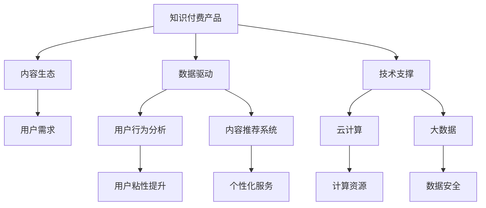

                 

## 1. 背景介绍

### 1.1 问题由来

在数字化时代，知识付费已经成为一种重要趋势。从在线教育、电子书、技术博客到视频课程，知识付费产品形式多样，满足了不同人群的需求。然而，竞争激烈的市场环境也对知识付费产品提出了更高的要求。如何打造一款能够长期稳定盈利的知识付费产品，成为了很多创作者和企业家面临的挑战。

本文将从打造知识付费商业帝国的角度出发，探讨知识付费领域的关键技术和商业策略，帮助创作者和企业构建竞争优势，实现商业成功。

### 1.2 问题核心关键点

打造个人知识付费商业帝国，关键在于以下几个方面：

- **产品定位和设计**：准确识别目标用户群体，设计符合用户需求的产品。
- **内容生产和运营**：持续提供优质内容，保持用户粘性。
- **用户体验和互动**：优化产品交互设计，提升用户体验。
- **商业化策略**：选择合适的商业模式，实现盈利。
- **市场推广和用户获取**：通过有效的市场推广，吸引用户并扩大市场份额。

### 1.3 问题研究意义

打造知识付费商业帝国，不仅能够帮助创作者实现价值变现，还能促进知识传播和教育资源的普及，推动社会进步。具体而言，其研究意义在于：

- 提高创作者收入，激发创作热情。
- 优化资源配置，提升教育效率。
- 强化用户粘性，构建长期合作关系。
- 实现市场竞争优势，推动行业发展。
- 增加社会知识储备，提升公民素养。

## 2. 核心概念与联系

### 2.1 核心概念概述

在知识付费领域，有几个核心概念需要理解：

- **知识付费产品**：以知识内容为核心，提供付费下载、订阅、课程学习等服务形式的产品。
- **内容生态**：包括创作者、内容、平台、用户等多方构成的生态系统。
- **数据驱动**：通过数据分析优化内容推荐、用户行为预测等，提高产品运营效率。
- **技术支撑**：包括人工智能、大数据、云计算等技术，提供技术保障。
- **商业模式**：如单次购买、订阅制、按需付费、知识分销等。

这些核心概念之间相互关联，共同构成了知识付费商业帝国的框架。

### 2.2 概念间的关系

以下是一个简化的Mermaid流程图，展示了知识付费商业帝国中的核心概念及其关系：



这个流程图展示了知识付费产品的构建过程。知识付费产品以用户需求为核心，通过数据分析和个性化服务优化用户体验，利用云计算和大数据技术提供技术支持，最终实现商业价值。

## 3. 核心算法原理 & 具体操作步骤

### 3.1 算法原理概述

知识付费产品的核心算法涉及用户行为分析、内容推荐、个性化服务等多个方面。本文将从这些角度进行详细探讨。

**用户行为分析**：通过数据分析工具，如Google Analytics、Mixpanel等，收集用户行为数据，分析用户兴趣和行为模式，为内容推荐和个性化服务提供依据。

**内容推荐系统**：基于协同过滤、内容过滤等推荐算法，为用户推荐相关内容，提升用户体验和粘性。

**个性化服务**：通过个性化推荐、智能问答、内容生成等技术，提供定制化服务，增强用户满意度。

### 3.2 算法步骤详解

#### 3.2.1 用户行为分析

1. **数据收集**：使用事件跟踪、页面访问等技术，收集用户行为数据。
2. **数据清洗**：去除噪声数据，确保数据质量。
3. **数据分析**：采用统计学方法，如时间序列分析、聚类分析等，分析用户行为模式。
4. **行为预测**：使用机器学习算法，如回归分析、分类器等，预测用户行为趋势。

#### 3.2.2 内容推荐系统

1. **数据预处理**：收集内容元数据，如标题、摘要、标签等，构建内容特征向量。
2. **推荐算法选择**：根据推荐任务特点，选择适合的推荐算法，如协同过滤、内容过滤等。
3. **模型训练**：使用历史用户行为数据，训练推荐模型，优化模型参数。
4. **实时推荐**：将新内容加入模型，实时为用户推荐相关内容。

#### 3.2.3 个性化服务

1. **需求识别**：通过用户交互记录，识别用户需求。
2. **服务生成**：根据用户需求，生成个性化内容或服务，如智能问答、内容生成等。
3. **服务评估**：收集用户反馈，评估个性化服务的效果。
4. **服务迭代**：根据用户反馈，不断优化个性化服务。

### 3.3 算法优缺点

#### 3.3.1 用户行为分析

优点：
- 能够精准了解用户需求，提升产品设计。
- 通过行为预测，可以提前布局内容，减少用户流失。

缺点：
- 数据隐私问题，需严格遵守隐私法规。
- 数据质量对分析结果影响较大，需确保数据准确性。

#### 3.3.2 内容推荐系统

优点：
- 提升用户体验和粘性，增加用户留存率。
- 精准推荐内容，提高内容曝光率。

缺点：
- 推荐算法可能存在偏见，需定期更新模型。
- 冷启动问题，新用户难以推荐相关内容。

#### 3.3.3 个性化服务

优点：
- 提供定制化服务，增强用户满意度。
- 增加用户粘性，提升用户忠诚度。

缺点：
- 个性化服务成本较高，需合理控制。
- 个性化服务可能导致信息过载，需平衡用户体验和内容多样性。

### 3.4 算法应用领域

知识付费产品的核心算法在多个领域都有应用，包括但不限于：

- **在线教育**：根据学生学习行为推荐课程，个性化辅导。
- **技术博客**：根据用户阅读行为推荐文章，个性化内容生成。
- **视频课程**：根据用户观看行为推荐视频，个性化学习路径设计。
- **电子书**：根据用户阅读习惯推荐图书，个性化章节推荐。

## 4. 数学模型和公式 & 详细讲解  
### 4.1 数学模型构建

在知识付费产品的算法中，数学模型是一个重要组成部分。以下是几个常见的数学模型及其构建方法：

#### 4.1.1 协同过滤推荐模型

协同过滤推荐模型基于用户和物品的相似度，为用户推荐相关物品。其数学模型如下：

$$
\hat{R}_{ui} = \frac{\sum_{v \in V} P_{uv} \times I_{vi}}{\sum_{v \in V} P_{uv}}
$$

其中，$P_{uv}$ 表示用户 $u$ 对物品 $v$ 的评分，$I_{vi}$ 表示物品 $v$ 的评分，$V$ 表示物品集合。

#### 4.1.2 内容过滤推荐模型

内容过滤推荐模型根据物品内容特征，为用户推荐相关物品。其数学模型如下：

$$
\hat{R}_{ui} = \sum_{d \in D} \alpha_d \times P_{dur}
$$

其中，$d$ 表示物品内容特征，$P_{dur}$ 表示物品 $d$ 对用户 $u$ 的评分，$D$ 表示内容特征集合。

#### 4.1.3 深度学习推荐模型

深度学习推荐模型利用神经网络对用户和物品进行编码，学习用户和物品之间的隐式特征，实现推荐。其数学模型如下：

$$
\hat{R}_{ui} = \text{sigmoid}(\sum_{k=1}^K \alpha_k \times \langle u_k, item_k \rangle)
$$

其中，$u_k$ 表示用户 $u$ 的隐式特征向量，$item_k$ 表示物品 $k$ 的隐式特征向量，$\alpha_k$ 表示特征权重，$K$ 表示特征维度。

### 4.2 公式推导过程

#### 4.2.1 协同过滤推荐模型

$$
\hat{R}_{ui} = \frac{\sum_{v \in V} P_{uv} \times I_{vi}}{\sum_{v \in V} P_{uv}} = \frac{\sum_{v \in V} P_{uv} \times I_{vi}}{\sum_{v \in V} P_{uv} \times I_{vi} + \sum_{v \in V} P_{uv} \times (1 - I_{vi})}
$$

其中，$P_{uv} \times I_{vi}$ 表示用户 $u$ 对物品 $v$ 的评分与物品 $v$ 的评分之积，$P_{uv} \times (1 - I_{vi})$ 表示用户 $u$ 对物品 $v$ 的评分与物品 $v$ 的评分的反值之积。

#### 4.2.2 内容过滤推荐模型

$$
\hat{R}_{ui} = \sum_{d \in D} \alpha_d \times P_{dur} = \sum_{d \in D} \alpha_d \times \langle \phi_u(d), \phi_u(d) \rangle
$$

其中，$\phi_u(d)$ 表示用户 $u$ 对物品 $d$ 的编码向量，$\alpha_d$ 表示内容特征权重。

#### 4.2.3 深度学习推荐模型

$$
\hat{R}_{ui} = \text{sigmoid}(\sum_{k=1}^K \alpha_k \times \langle u_k, item_k \rangle)
$$

其中，$\langle u_k, item_k \rangle$ 表示用户 $u$ 的隐式特征向量与物品 $k$ 的隐式特征向量的内积，$\alpha_k$ 表示特征权重。

### 4.3 案例分析与讲解

#### 4.3.1 协同过滤推荐模型

以Netflix为例，Netflix使用协同过滤推荐模型为用户推荐电影。Netflix收集用户的历史行为数据，包括观影记录、评分等，构建用户-物品评分矩阵。然后使用协同过滤算法，计算用户和物品之间的相似度，为用户推荐相关电影。

#### 4.3.2 内容过滤推荐模型

以Amazon为例，Amazon使用内容过滤推荐模型为用户推荐书籍。Amazon收集书籍的标题、作者、描述等特征信息，构建物品特征向量。然后根据用户的历史购买行为，训练内容过滤模型，为用户推荐相关书籍。

#### 4.3.3 深度学习推荐模型

以Spotify为例，Spotify使用深度学习推荐模型为用户推荐音乐。Spotify收集用户的听歌历史、偏好等信息，构建用户隐式特征向量。然后根据音乐内容特征，训练深度学习模型，为用户推荐相关音乐。

## 5. 项目实践：代码实例和详细解释说明

### 5.1 开发环境搭建

要进行知识付费产品的开发，首先需要搭建好开发环境。以下是使用Python进行Flask开发的典型环境配置：

1. 安装Python：从官网下载并安装Python。
2. 安装Flask：使用pip安装Flask框架。
3. 安装其他依赖库：如SQLAlchemy、Flask-WTF等。
4. 创建虚拟环境：使用virtualenv或conda创建虚拟环境。

完成上述步骤后，即可在虚拟环境中进行Flask应用开发。

### 5.2 源代码详细实现

#### 5.2.1 用户行为分析

```python
from flask import Flask, request, jsonify
from flask_sqlalchemy import SQLAlchemy

app = Flask(__name__)
app.config['SQLALCHEMY_DATABASE_URI'] = 'sqlite:///user.db'
db = SQLAlchemy(app)

class UserBehavior(db.Model):
    id = db.Column(db.Integer, primary_key=True)
    user_id = db.Column(db.String(100), nullable=False)
    event_type = db.Column(db.String(100), nullable=False)
    timestamp = db.Column(db.DateTime, nullable=False)
    event_data = db.Column(db.String(1000), nullable=True)

@app.route('/user_behavior', methods=['POST'])
def user_behavior():
    data = request.json
    new_record = UserBehavior(user_id=data['user_id'], event_type=data['event_type'], timestamp=data['timestamp'], event_data=data['event_data'])
    db.session.add(new_record)
    db.session.commit()
    return jsonify({'message': 'User behavior data inserted successfully'})

if __name__ == '__main__':
    db.create_all()
    app.run(debug=True)
```

#### 5.2.2 内容推荐系统

```python
from flask import Flask, request, jsonify
from flask_sqlalchemy import SQLAlchemy
from sklearn.metrics.pairwise import cosine_similarity

app = Flask(__name__)
app.config['SQLALCHEMY_DATABASE_URI'] = 'sqlite:///content.db'
db = SQLAlchemy(app)

class Item(db.Model):
    id = db.Column(db.Integer, primary_key=True)
    item_id = db.Column(db.String(100), nullable=False)
    item_title = db.Column(db.String(1000), nullable=False)
    item_description = db.Column(db.String(1000), nullable=False)
    item_content = db.Column(db.String(1000), nullable=False)

@app.route('/recommend_items', methods=['POST'])
def recommend_items():
    user_id = request.json['user_id']
    user_data = Item.query.filter(Item.item_id.in_(item_ids)).all()
    similarities = [(item_id, cosine_similarity(item_content, user_data)) for item_id, item_data in user_data.items()]
    sorted_items = sorted(similarities, key=lambda x: x[1], reverse=True)[:10]
    return jsonify(sorted_items)

if __name__ == '__main__':
    db.create_all()
    app.run(debug=True)
```

#### 5.2.3 个性化服务

```python
from flask import Flask, request, jsonify
from flask_sqlalchemy import SQLAlchemy
from sklearn.metrics.pairwise import cosine_similarity

app = Flask(__name__)
app.config['SQLALCHEMY_DATABASE_URI'] = 'sqlite:///service.db'
db = SQLAlchemy(app)

class Service(db.Model):
    id = db.Column(db.Integer, primary_key=True)
    service_id = db.Column(db.String(100), nullable=False)
    service_title = db.Column(db.String(1000), nullable=False)
    service_content = db.Column(db.String(1000), nullable=False)

@app.route('/send_service', methods=['POST'])
def send_service():
    user_id = request.json['user_id']
    service_data = Service.query.filter(Service.service_id.in_(service_ids)).all()
    similarities = [(service_id, cosine_similarity(service_content, user_data)) for service_id, service_data in service_data.items()]
    sorted_services = sorted(similarities, key=lambda x: x[1], reverse=True)[:10]
    return jsonify(sorted_services)

if __name__ == '__main__':
    db.create_all()
    app.run(debug=True)
```

### 5.3 代码解读与分析

#### 5.3.1 用户行为分析

- **数据模型**：定义了一个`UserBehavior`模型，记录用户行为数据。
- **API接口**：使用Flask定义了一个`/user_behavior`接口，接收用户行为数据，并插入数据库。

#### 5.3.2 内容推荐系统

- **数据模型**：定义了一个`Item`模型，记录物品数据。
- **API接口**：使用Flask定义了一个`/recommend_items`接口，接收用户ID，查询物品数据，计算相似度，返回推荐物品列表。

#### 5.3.3 个性化服务

- **数据模型**：定义了一个`Service`模型，记录个性化服务数据。
- **API接口**：使用Flask定义了一个`/send_service`接口，接收用户ID，查询服务数据，计算相似度，返回推荐服务列表。

### 5.4 运行结果展示

假设我们在构建一个在线教育平台，学生可以通过填写问卷、观看视频、参加考试等方式积累行为数据。平台可以定期分析用户行为数据，生成推荐内容列表，提升用户学习体验和满意度。

## 6. 实际应用场景

### 6.1 智能教育

在智能教育领域，知识付费产品可以通过数据分析和推荐算法，为学生提供个性化的学习路径和推荐资源，提升学习效率。例如：

- **学习进度监控**：通过收集学生观看视频、做题、复习等行为数据，生成学习进度报告。
- **推荐课程**：根据学生学习历史，推荐相关课程和资源，帮助学生快速掌握知识点。
- **智能答疑**：使用自然语言处理技术，为学生提供智能问答服务，解答学习中遇到的问题。

### 6.2 技术博客

在技术博客领域，知识付费产品可以通过个性化推荐、智能内容生成等技术，提高用户粘性和满意度。例如：

- **个性化推荐**：根据用户阅读习惯，推荐相关文章和技术博客。
- **智能内容生成**：使用生成对抗网络等技术，生成技术文章或代码示例，丰富内容库。
- **知识分享**：使用知识图谱等技术，将文章内容可视化，帮助用户快速理解技术知识。

### 6.3 视频课程

在视频课程领域，知识付费产品可以通过推荐算法和个性化服务，提升用户观看体验和学习效果。例如：

- **推荐课程**：根据用户观看历史和评分，推荐相关课程和资源。
- **学习路径设计**：根据用户学习进度，设计个性化的学习路径，帮助用户快速掌握技能。
- **实时答疑**：使用聊天机器人等技术，为学生提供实时答疑服务，解决学习中遇到的问题。

### 6.4 未来应用展望

随着人工智能技术的不断发展，知识付费产品将迎来更多创新应用。未来，知识付费产品可以：

- **多模态交互**：结合图像、视频、音频等多模态数据，提升用户交互体验。
- **深度学习应用**：使用深度学习技术，进行内容生成、推荐和个性化服务。
- **联邦学习**：使用联邦学习技术，保护用户隐私，同时提升推荐效果。
- **区块链技术**：使用区块链技术，确保内容版权和交易透明，提升用户信任度。
- **元宇宙应用**：使用元宇宙技术，构建虚拟学习空间，提供沉浸式学习体验。

## 7. 工具和资源推荐

### 7.1 学习资源推荐

为了帮助开发者系统掌握知识付费领域的关键技术和商业策略，这里推荐一些优质的学习资源：

1. **《知识付费商业模型创新》**：该书系统讲解了知识付费产品的商业模式创新方法，涵盖单次购买、订阅制、按需付费等。
2. **《数据驱动的个性化推荐系统》**：该书介绍了推荐系统的主要算法和技术，如协同过滤、内容过滤、深度学习等。
3. **《智能教育技术》**：该书介绍了智能教育领域的主要技术和应用，如自然语言处理、计算机视觉等。
4. **Coursera和edX**：提供大量在线课程，涵盖数据科学、人工智能、自然语言处理等领域，适合系统学习。
5. **Kaggle**：提供大量数据集和竞赛，可以帮助开发者进行数据驱动的推荐算法实践。

### 7.2 开发工具推荐

开发知识付费产品，离不开优秀的工具支持。以下是几款常用的工具：

1. **Flask**：简单易用的Python Web框架，适合快速搭建知识付费平台。
2. **SQLAlchemy**：Python ORM框架，适合数据库管理。
3. **Scikit-learn**：Python机器学习库，适合构建推荐算法模型。
4. **TensorFlow和PyTorch**：流行的深度学习框架，适合构建智能推荐和个性化服务。
5. **Jupyter Notebook**：交互式开发环境，适合数据科学和机器学习开发。

### 7.3 相关论文推荐

知识付费领域的持续发展，离不开学界的不断探索和创新。以下是几篇奠基性的相关论文，推荐阅读：

1. **《推荐系统理论与实践》**：介绍了推荐系统的基本理论、算法和技术，涵盖协同过滤、内容过滤、深度学习等。
2. **《数据驱动的个性化推荐系统》**：介绍了推荐系统的商业应用，涵盖单次购买、订阅制、按需付费等。
3. **《智能教育技术》**：介绍了智能教育领域的主要技术和应用，如自然语言处理、计算机视觉等。

这些论文代表了大语言模型微调技术的发展脉络。通过学习这些前沿成果，可以帮助研究者把握学科前进方向，激发更多的创新灵感。

除上述资源外，还有一些值得关注的前沿资源，帮助开发者紧跟知识付费领域的最新进展，例如：

1. **arXiv论文预印本**：人工智能领域最新研究成果的发布平台，包括大量尚未发表的前沿工作，学习前沿技术的必读资源。
2. **业界技术博客**：如Coursera、edX、Kaggle等平台上的官方博客，第一时间分享他们的最新研究成果和洞见。
3. **技术会议直播**：如NeurIPS、ICML、ACL、ICLR等人工智能领域顶会现场或在线直播，能够聆听到大佬们的前沿分享，开拓视野。
4. **GitHub热门项目**：在GitHub上Star、Fork数最多的知识付费相关项目，往往代表了该技术领域的发展趋势和最佳实践，值得去学习和贡献。
5. **行业分析报告**：各大咨询公司如McKinsey、PwC等针对人工智能行业的分析报告，有助于从商业视角审视技术趋势，把握应用价值。

总之，对于知识付费产品的开发和学习，需要开发者保持开放的心态和持续学习的意愿。多关注前沿资讯，多动手实践，多思考总结，必将收获满满的成长收益。

## 8. 总结：未来发展趋势与挑战

### 8.1 总结

本文对知识付费产品的开发进行了全面系统的介绍。首先探讨了知识付费产品的重要性和关键技术，其次从多个角度详细讲解了知识付费产品的开发流程和关键算法，最后提出了知识付费产品未来的发展方向和面临的挑战。

通过本文的系统梳理，可以看到，知识付费产品不仅能够帮助创作者实现价值变现，还能优化资源配置，提升教育效率，推动社会进步。未来的知识付费产品将更加智能化、个性化、商业化，能够满足用户多样化需求，提高学习效果和满意度。

### 8.2 未来发展趋势

知识付费产品未来的发展趋势包括：

1. **人工智能**：结合人工智能技术，提高个性化推荐和智能服务水平。
2. **数据驱动**：通过大数据和深度学习，实现更精准的推荐和个性化服务。
3. **多模态交互**：结合图像、视频、音频等多模态数据，提升用户交互体验。
4. **联邦学习**：使用联邦学习技术，保护用户隐私，同时提升推荐效果。
5. **区块链技术**：使用区块链技术，确保内容版权和交易透明，提升用户信任度。
6. **元宇宙应用**：使用元宇宙技术，构建虚拟学习空间，提供沉浸式学习体验。

### 8.3 面临的挑战

知识付费产品发展过程中，还面临以下挑战：

1. **数据隐私**：如何保护用户隐私，同时实现精准推荐。
2. **内容质量**：如何提升内容质量，避免劣质内容对用户造成负面影响。
3. **用户粘性**：如何提升用户粘性，增加用户留存率。
4. **商业化**：如何实现商业化，平衡用户需求和商业模式。
5. **技术门槛**：如何降低技术门槛，吸引更多创作者和用户。
6. **市场竞争**：如何应对市场竞争，保持产品和服务的竞争力。

### 8.4 研究展望

面对知识付费产品发展过程中面临的挑战，未来的研究需要在以下几个方面寻求新的突破：

1. **数据隐私保护**：研究如何保护用户隐私，同时实现精准推荐。
2. **内容质量提升**：研究如何提升内容质量，避免劣质内容对用户造成负面影响。
3. **用户粘性提升**：研究如何提升用户粘性，增加用户留存率。
4. **商业化路径**：研究如何实现商业化，平衡用户需求和商业模式。
5. **技术门槛降低**：研究如何降低技术门槛，吸引更多创作者和用户。
6. **市场竞争应对**：研究如何应对市场竞争，保持产品和服务的竞争力。

这些研究方向的探索，必将引领知识付费产品走向更高的台阶，为创作者和用户创造更多价值。面向未来，知识付费产品需要从数据、算法、工程、商业等多个维度协同发力，才能真正实现可持续发展。

## 9. 附录：常见问题与解答

**Q1：如何构建知识付费产品？**

A: 构建知识付费产品，需要从以下几个步骤入手：
1. 确定产品定位和目标用户群体。
2. 设计产品功能和服务，提升用户体验。
3. 收集和分析用户数据，优化推荐算法。
4. 实施商业化策略，实现盈利。
5. 推广和市场扩展，吸引更多用户。

**Q2：如何提高知识付费产品的推荐效果？**

A: 提高知识付费产品的推荐效果，可以从以下几个方面入手：
1. 提升数据质量，确保用户行为数据的准确性和完整性。
2. 优化推荐算法，结合协同过滤、内容过滤、深度学习等技术。
3. 使用联邦学习技术，保护用户隐私。
4. 结合多模态数据，提升推荐效果。

**Q3：如何提升知识付费产品的商业化效果？**

A: 提升知识付费产品的商业化效果，可以从以下几个方面入手：
1. 选择合适的商业模式，如单次购买、订阅制、按需付费等。
2. 优化产品定价策略，平衡用户需求和盈利需求。
3. 实施精准营销策略，吸引更多用户和内容创作者。
4. 使用区块链技术，确保内容版权和交易透明。

**Q4：如何应对知识付费

