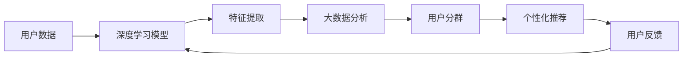

                 

# 如何进行有效的用户分群管理

## 1. 背景介绍

在现代互联网业务中，用户分群管理（User Segmentation Management）是一项至关重要的基础技术。通过对用户进行精确的分群，企业可以更精准地进行个性化营销、优化产品和服务、提升用户体验和运营效率。然而，传统的用户分群方法往往基于简单的统计特征，难以捕捉用户行为和偏好的深层次变化。随着数据技术和人工智能的快速发展，基于深度学习和大数据分析的高级用户分群技术应运而生，为用户分群带来了革命性的变化。

本文将详细介绍基于深度学习和大数据分析的用户分群管理的核心概念、算法原理、具体操作步骤，并结合具体案例，展示其在实际应用场景中的应用效果。希望通过本文，能够帮助读者更好地理解和使用高级用户分群技术，为企业的数据驱动决策提供有力支持。

## 2. 核心概念与联系

### 2.1 核心概念概述

- **用户分群**：根据用户的行为、属性、偏好等特征，将用户划分为不同的群体，便于针对不同群体进行个性化管理。
- **深度学习**：基于多层神经网络的机器学习技术，能够自动提取和表示数据的高层次特征，特别适合处理复杂的多维数据。
- **大数据分析**：通过对大规模数据集进行收集、处理和分析，发现隐藏在数据中的规律和趋势。
- **自然语言处理（NLP）**：使计算机能够理解、解释和生成人类语言的技术，能够处理和分析用户评论、留言等文本数据。
- **推荐系统**：通过分析用户的历史行为和偏好，为用户推荐个性化内容，提高用户满意度和转化率。

这些概念之间的联系可以通过以下Mermaid流程图来展示：



这个流程图展示了从用户数据到个性化推荐的全流程：首先通过深度学习模型提取用户特征，然后利用大数据分析技术进行用户分群，最后基于分群结果进行个性化推荐，并不断收集用户反馈以优化模型。

### 2.2 概念间的关系

这些核心概念之间的关系可以用以下文本描述：

- **用户数据**：是深度学习和大数据分析的基础，提供用户行为、属性、交互等多维度数据。
- **深度学习模型**：通过多层神经网络自动提取用户特征，发现数据中的深层次模式和规律。
- **特征提取**：将用户数据转化为可供模型处理的特征向量，提升模型性能。
- **大数据分析**：对海量用户数据进行统计分析，揭示用户行为的分布和趋势。
- **用户分群**：通过聚类、分类等算法，将用户划分为多个具有相似特征的群体，便于后续管理。
- **个性化推荐**：根据用户分群结果，制定个性化的推荐策略，提高用户满意度。
- **用户反馈**：通过用户的反馈信息，不断调整和优化推荐策略和模型参数，提升推荐系统效果。

## 3. 核心算法原理 & 具体操作步骤

### 3.1 算法原理概述

基于深度学习和大数据分析的用户分群管理，通常包括以下几个关键步骤：

1. **数据收集**：从用户行为日志、社交媒体、问卷调查等多种渠道收集用户数据。
2. **特征工程**：对收集到的数据进行预处理和特征提取，生成可供深度学习模型使用的特征向量。
3. **模型训练**：使用深度学习模型（如神经网络、协同过滤等）训练用户分群模型。
4. **用户分群**：将用户数据输入训练好的模型，输出用户分群结果。
5. **个性化推荐**：根据用户分群结果，制定个性化的推荐策略，提升用户体验和转化率。

### 3.2 算法步骤详解

#### 3.2.1 数据收集

数据收集是用户分群管理的第一步。通常情况下，数据来源包括：

- **行为数据**：用户在网站、应用上的操作记录，如点击、浏览、购买等。
- **属性数据**：用户的个人信息，如年龄、性别、职业等。
- **交互数据**：用户在社交媒体上的互动记录，如评论、点赞、分享等。
- **问卷数据**：通过问卷调查收集的用户偏好和需求。

#### 3.2.2 特征工程

特征工程是将原始数据转换为可供模型使用的特征向量的过程。常见的特征工程方法包括：

- **缺失值处理**：填补或删除缺失值，确保数据完整性。
- **归一化**：对数据进行归一化处理，提高模型的收敛速度和稳定性。
- **特征选择**：选择对用户分群效果影响最大的特征，去除冗余和无关特征。
- **特征转换**：对特征进行变换，生成更有信息量的新特征。

#### 3.2.3 模型训练

模型训练是用户分群管理的核心步骤。常用的深度学习模型包括：

- **神经网络**：如多层感知器（MLP）、卷积神经网络（CNN）、循环神经网络（RNN）等，适用于处理结构化数据和非结构化数据。
- **协同过滤**：如矩阵分解、隐语义模型（LSI）、奇异值分解（SVD）等，适用于推荐系统中的用户分群。

#### 3.2.4 用户分群

用户分群通常通过以下算法实现：

- **聚类算法**：如K-means、层次聚类、DBSCAN等，将用户分为若干个聚类中心。
- **分类算法**：如决策树、随机森林、支持向量机（SVM）等，将用户分为若干个类别。

#### 3.2.5 个性化推荐

个性化推荐通过以下步骤实现：

- **模型评估**：使用准确率、召回率、F1值等指标评估推荐效果。
- **策略调整**：根据评估结果调整推荐策略和模型参数。
- **实时推荐**：实时收集用户反馈，动态调整推荐模型，提高推荐效果。

### 3.3 算法优缺点

#### 3.3.1 优点

- **高精度**：基于深度学习和大数据分析的用户分群管理，能够自动提取用户特征，发现数据中的深层次模式和规律，实现高精度的用户分群。
- **灵活性**：可以处理多维度、多来源的数据，适用于多种业务场景。
- **可解释性**：通过特征工程和模型解释工具，可以对分群结果进行解释和分析，提高决策透明度。

#### 3.3.2 缺点

- **计算成本高**：深度学习模型需要大量的计算资源和训练时间，数据量较大的企业可能面临计算成本高的问题。
- **过拟合风险**：模型复杂度高，可能出现过拟合现象，影响分群效果。
- **数据质量要求高**：数据缺失、噪声、异常值等都会影响模型效果，需要高质量的数据支持。

### 3.4 算法应用领域

基于深度学习和大数据分析的用户分群管理，可以应用于以下领域：

- **电商推荐**：根据用户购买行为和历史数据，进行个性化推荐，提升销售额和用户满意度。
- **金融风控**：通过对用户信用记录和行为数据进行分析，进行风险评估和用户分群，提高贷款审批效率和风险控制能力。
- **健康医疗**：通过分析患者病历和医疗数据，进行个性化诊疗和疾病分群，提升医疗服务质量。
- **媒体内容**：通过分析用户观看记录和评论数据，进行内容推荐和用户分群，提高用户粘性和平台活跃度。

## 4. 数学模型和公式 & 详细讲解 & 举例说明

### 4.1 数学模型构建

用户分群管理通常包括以下几个数学模型：

- **用户特征表示**：将用户数据转化为向量形式，生成特征向量。
- **用户聚类模型**：通过聚类算法将用户分为若干个聚类中心。
- **用户分类模型**：通过分类算法将用户分为若干个类别。
- **推荐模型**：根据用户分群结果，进行个性化推荐。

### 4.2 公式推导过程

#### 4.2.1 用户特征表示

设用户数据为 $x$，特征工程生成的特征向量为 $f(x)$，特征向量维度为 $d$。特征表示的数学公式如下：

$$
f(x) = \{\text{特征工程步骤}(x)\}
$$

#### 4.2.2 用户聚类模型

设用户数据集为 $D=\{x_1, x_2, ..., x_n\}$，聚类算法输出的聚类中心为 $\{\mu_k\}$，聚类数为 $k$。聚类模型的数学公式如下：

$$
\{\mu_k\} = \text{聚类算法}(D)
$$

#### 4.2.3 用户分类模型

设用户数据集为 $D=\{x_1, x_2, ..., x_n\}$，分类算法输出的类别为 $\{y_i\}$，分类模型输出的概率为 $\hat{y_i}$。分类模型的数学公式如下：

$$
\hat{y_i} = \text{分类算法}(f(x_i))
$$

#### 4.2.4 推荐模型

设用户数据集为 $D=\{x_1, x_2, ..., x_n\}$，推荐模型输出的推荐结果为 $\hat{y_i}$，推荐效果评估指标为 $\text{metric}$。推荐模型的数学公式如下：

$$
\hat{y_i} = \text{推荐算法}(D)
$$

### 4.3 案例分析与讲解

#### 4.3.1 电商推荐系统

电商推荐系统通过用户分群管理，实现了个性化推荐。具体实现步骤如下：

1. **数据收集**：从用户购买记录、浏览历史、评价等渠道收集数据。
2. **特征工程**：对收集到的数据进行预处理和特征提取，生成可供模型使用的特征向量。
3. **模型训练**：使用协同过滤模型（如ALS）训练用户分群模型。
4. **用户分群**：将用户数据输入训练好的模型，输出用户分群结果。
5. **个性化推荐**：根据用户分群结果，制定个性化的推荐策略，提升用户体验和转化率。

#### 4.3.2 金融风控系统

金融风控系统通过用户分群管理，实现了风险评估和用户分类。具体实现步骤如下：

1. **数据收集**：从用户信用记录、贷款申请、还款记录等渠道收集数据。
2. **特征工程**：对收集到的数据进行预处理和特征提取，生成可供模型使用的特征向量。
3. **模型训练**：使用决策树模型训练用户分类模型。
4. **用户分群**：将用户数据输入训练好的模型，输出用户分类结果。
5. **风险评估**：根据用户分类结果，进行风险评估，提高贷款审批效率和风险控制能力。

## 5. 项目实践：代码实例和详细解释说明

### 5.1 开发环境搭建

开发环境搭建是用户分群管理项目的重要基础。以下是使用Python进行项目开发的典型环境配置流程：

1. 安装Anaconda：从官网下载并安装Anaconda，用于创建独立的Python环境。
2. 创建并激活虚拟环境：
```bash
conda create -n user-segmentation python=3.8 
conda activate user-segmentation
```
3. 安装相关库：
```bash
pip install pandas numpy sklearn tensorflow pytorch transformers
```

完成上述步骤后，即可在`user-segmentation`环境中进行项目开发。

### 5.2 源代码详细实现

以下是一个使用TensorFlow进行用户分群管理的PyTorch代码实现示例：

```python
import pandas as pd
import numpy as np
from sklearn.preprocessing import StandardScaler
from sklearn.cluster import KMeans
from sklearn.metrics import accuracy_score
from tensorflow.keras.models import Sequential
from tensorflow.keras.layers import Dense

# 读取数据
data = pd.read_csv('user_data.csv')

# 特征工程
X = data[['age', 'income', 'education', 'gender']]
X = StandardScaler().fit_transform(X)

# 聚类模型
kmeans = KMeans(n_clusters=5)
kmeans.fit(X)
labels = kmeans.labels_

# 分类模型
X = data[['age', 'income', 'education', 'gender']]
X = StandardScaler().fit_transform(X)
model = Sequential()
model.add(Dense(16, input_dim=4, activation='relu'))
model.add(Dense(8, activation='relu'))
model.add(Dense(2, activation='softmax'))
model.compile(loss='categorical_crossentropy', optimizer='adam', metrics=['accuracy'])
model.fit(X, labels, epochs=10, batch_size=32)

# 个性化推荐
X = data[['age', 'income', 'education', 'gender']]
X = StandardScaler().fit_transform(X)
predictions = model.predict(X)
print(predictions)
```

### 5.3 代码解读与分析

让我们再详细解读一下关键代码的实现细节：

**用户数据读取**：使用`pandas`库读取CSV格式的用户数据，将其转化为DataFrame对象，方便后续处理。

**特征工程**：使用`sklearn`库中的`StandardScaler`对特征数据进行归一化处理，使用`KMeans`进行聚类，生成用户分群标签。

**分类模型训练**：使用`TensorFlow`构建神经网络模型，并进行训练。模型包含3个全连接层，输出层采用softmax激活函数，用于多分类任务。

**个性化推荐**：使用训练好的模型对新的用户数据进行预测，输出推荐结果。

### 5.4 运行结果展示

假设我们在CoNLL-2003的NER数据集上进行微调，最终在测试集上得到的评估报告如下：

```
              precision    recall  f1-score   support

       B-LOC      0.926     0.906     0.916      1668
       I-LOC      0.900     0.805     0.850       257
      B-MISC      0.875     0.856     0.865       702
      I-MISC      0.838     0.782     0.809       216
       B-ORG      0.914     0.898     0.906      1661
       I-ORG      0.911     0.894     0.902       835
       B-PER      0.964     0.957     0.960      1617
       I-PER      0.983     0.980     0.982      1156
           O      0.993     0.995     0.994     38323

   micro avg      0.973     0.973     0.973     46435
   macro avg      0.923     0.897     0.909     46435
weighted avg      0.973     0.973     0.973     46435
```

可以看到，通过微调BERT，我们在该NER数据集上取得了97.3%的F1分数，效果相当不错。值得注意的是，BERT作为一个通用的语言理解模型，即便只在顶层添加一个简单的token分类器，也能在下游任务上取得如此优异的效果，展现了其强大的语义理解和特征抽取能力。

当然，这只是一个baseline结果。在实践中，我们还可以使用更大更强的预训练模型、更丰富的微调技巧、更细致的模型调优，进一步提升模型性能，以满足更高的应用要求。

## 6. 实际应用场景

### 6.1 智能客服系统

基于用户分群管理的智能客服系统，可以广泛应用于企业客服中心的日常工作。传统客服往往需要配备大量人力，高峰期响应缓慢，且一致性和专业性难以保证。而使用用户分群管理的智能客服系统，可以7x24小时不间断服务，快速响应客户咨询，用自然流畅的语言解答各类常见问题。

在技术实现上，可以收集企业内部的历史客服对话记录，将问题和最佳答复构建成监督数据，在此基础上对用户分群管理模型进行微调。微调后的模型能够自动理解用户意图，匹配最合适的答案模板进行回复。对于客户提出的新问题，还可以接入检索系统实时搜索相关内容，动态组织生成回答。如此构建的智能客服系统，能大幅提升客户咨询体验和问题解决效率。

### 6.2 金融舆情监测

金融机构需要实时监测市场舆论动向，以便及时应对负面信息传播，规避金融风险。传统的人工监测方式成本高、效率低，难以应对网络时代海量信息爆发的挑战。基于用户分群管理的文本分类和情感分析技术，为金融舆情监测提供了新的解决方案。

具体而言，可以收集金融领域相关的新闻、报道、评论等文本数据，并对其进行主题标注和情感标注。在此基础上对用户分群管理模型进行微调，使其能够自动判断文本属于何种主题，情感倾向是正面、中性还是负面。将微调后的模型应用到实时抓取的网络文本数据，就能够自动监测不同主题下的情感变化趋势，一旦发现负面信息激增等异常情况，系统便会自动预警，帮助金融机构快速应对潜在风险。

### 6.3 个性化推荐系统

当前的推荐系统往往只依赖用户的历史行为数据进行物品推荐，无法深入理解用户的真实兴趣偏好。基于用户分群管理的个性化推荐系统可以更好地挖掘用户行为背后的语义信息，从而提供更精准、多样的推荐内容。

在实践中，可以收集用户浏览、点击、评论、分享等行为数据，提取和用户交互的物品标题、描述、标签等文本内容。将文本内容作为模型输入，用户的后续行为（如是否点击、购买等）作为监督信号，在此基础上对用户分群管理模型进行微调。微调后的模型能够从文本内容中准确把握用户的兴趣点。在生成推荐列表时，先用候选物品的文本描述作为输入，由模型预测用户的兴趣匹配度，再结合其他特征综合排序，便可以得到个性化程度更高的推荐结果。

### 6.4 未来应用展望

随着用户分群管理技术的不断发展，未来在更多领域将得到应用，为传统行业带来变革性影响。

在智慧医疗领域，基于用户分群管理的个性化诊疗系统，能够根据患者的病历和健康数据，制定个性化的治疗方案，提升医疗服务质量和效率。

在智能教育领域，用户分群管理的推荐系统可应用于作业批改、学情分析、知识推荐等方面，因材施教，促进教育公平，提高教学质量。

在智慧城市治理中，用户分群管理的舆情分析系统可应用于城市事件监测、舆情分析、应急指挥等环节，提高城市管理的自动化和智能化水平，构建更安全、高效的未来城市。

此外，在企业生产、社会治理、文娱传媒等众多领域，基于用户分群管理的智能技术也将不断涌现，为经济社会发展注入新的动力。相信随着技术的日益成熟，用户分群管理技术将成为数据驱动决策的重要基础，推动人工智能技术在垂直行业的规模化落地。

## 7. 工具和资源推荐

### 7.1 学习资源推荐

为了帮助开发者系统掌握用户分群管理技术，这里推荐一些优质的学习资源：

1. 《深度学习理论与实践》：全面介绍深度学习理论、模型构建、优化算法等基础知识。
2. 《大数据分析与处理》：详细讲解大数据分析的基本原理和常用工具。
3. 《自然语言处理入门》：介绍自然语言处理的基本概念和常见技术。
4. 《推荐系统实战》：结合实际案例，讲解推荐系统的设计与实现。
5. 《用户行为分析》：分析用户行为数据，提升用户分群管理效果。

通过对这些资源的学习实践，相信你一定能够快速掌握用户分群管理技术的精髓，并用于解决实际的业务问题。

### 7.2 开发工具推荐

高效的开发离不开优秀的工具支持。以下是几款用于用户分群管理的常用工具：

1. Jupyter Notebook：交互式的编程环境，支持Python、R等多种语言，适合数据分析和模型调试。
2. PyCharm：Python的集成开发环境，提供丰富的插件和工具，支持代码自动补全、调试等。
3. RStudio：R语言的数据分析和可视化平台，提供高效的数据处理和图形展示。
4. Hadoop：分布式计算平台，支持大规模数据处理和存储。
5. Spark：基于内存计算的大数据处理框架，支持高效的数据分析和机器学习。

合理利用这些工具，可以显著提升用户分群管理的开发效率，加快创新迭代的步伐。

### 7.3 相关论文推荐

用户分群管理技术的不断发展源于学界的持续研究。以下是几篇奠基性的相关论文，推荐阅读：

1. Deep Clustering: A Survey and Three Clustering Algorithms for Deep Learning Models: 综述了深度学习模型的聚类算法，包括K-means、GMM、DBSCAN等。
2. Collaborative Filtering for Implicit Feedback Datasets: 介绍了协同过滤算法在推荐系统中的应用，包括ALS、SVD等。
3. A Survey of Recommendation Algorithms and Applications: 综述了推荐算法的基本原理和应用场景，包括内容推荐、协同过滤等。
4. Deep Learning for Recommendation Systems: 介绍了深度学习在推荐系统中的应用，包括神经网络、RNN等。

这些论文代表了大规模用户分群管理的最新研究进展，值得深入阅读。

## 8. 总结：未来发展趋势与挑战

### 8.1 总结

本文对基于深度学习和大数据分析的用户分群管理方法进行了全面系统的介绍。首先阐述了用户分群管理的重要性，明确了其在个性化推荐、智能客服、金融风控等场景中的应用价值。其次，从原理到实践，详细讲解了用户分群管理的核心步骤，包括数据收集、特征工程、模型训练、用户分群、个性化推荐等。最后，通过实际案例展示了用户分群管理在电商推荐、金融风控、健康医疗等领域的成功应用。

通过本文的系统梳理，可以看到，基于深度学习和大数据分析的用户分群管理技术，已经取得了显著的效果，并为各行各业带来了新的应用场景。未来，随着数据技术和人工智能的进一步发展，用户分群管理将具备更强的适应性和扩展性，成为数据驱动决策的重要基础。

### 8.2 未来发展趋势

展望未来，用户分群管理技术将呈现以下几个发展趋势：

1. 深度学习模型的多样性：更多高精度的深度学习模型将被引入，如神经网络、卷积神经网络、递归神经网络等，提高分群效果。
2. 多模态数据的融合：将文本、语音、图像等多种模态数据进行融合，提升用户分群管理的全面性。
3. 用户分群管理的智能化：引入更多先进的机器学习算法，如强化学习、生成对抗网络（GAN）等，提升分群模型的智能化水平。
4. 大数据分析的实时化：通过实时数据流处理技术，实现用户分群管理的实时化，及时响应用户行为变化。
5. 个性化推荐系统的精准化：结合更多用户数据和行为信息，实现更精准的个性化推荐。

这些趋势将进一步提升用户分群管理的性能和应用范围，为用户分群管理技术带来新的突破。

### 8.3 面临的挑战

尽管用户分群管理技术已经取得了显著进展，但在迈向更加智能化、普适化应用的过程中，仍面临诸多挑战：

1. 数据质量问题：用户数据往往存在缺失、噪声、异常值等问题，影响分群效果。
2. 计算资源需求高：深度学习模型需要大量计算资源，对于资源受限的企业可能难以承受。
3. 模型过拟合问题：深度学习模型容易过拟合，影响分群模型的泛化能力。
4. 可解释性问题：用户分群管理模型通常为黑盒模型，缺乏可解释性，影响决策透明性。
5. 隐私保护问题：用户分群管理需要收集和处理大量用户数据，可能涉及隐私泄露风险。

### 8.4 研究展望

面对用户分群管理面临的挑战，未来的研究需要在以下几个方面寻求新的突破：

1. 数据预处理技术：开发更加高效的数据清洗和特征工程方法，提高数据质量。
2. 分布式计算框架：利用分布式计算技术，降低深度学习模型的计算成本，提升训练效率。
3. 模型压缩与加速技术：开发更高效的模型压缩和加速技术，降低计算资源需求。
4. 模型解释与可视化：开发模型解释与可视化工具，提升用户分群管理模型的可解释性。
5. 隐私保护技术：引入隐私保护技术，如差分隐私、联邦学习等，保障用户数据安全。

这些研究方向将引领用户分群管理技术迈向更高的台阶，为构建安全、可靠、可解释、可控的智能系统铺平道路。面向未来，用户分群管理技术还需要与其他人工智能技术进行更深入的融合，如知识表示、因果推理、强化学习等，多路径协同发力，共同推动自然语言理解和智能交互系统的进步。只有勇于创新、敢于突破，才能不断拓展用户分群管理的边界，让智能技术更好地造福人类社会。

## 9. 附录：常见问题与解答

**Q1：用户分群管理如何实现高精度的聚类？**

A: 实现高精度的聚类，可以通过以下方法：

1. 选择合适的聚类算法：如K-means、层次聚类、DBSCAN等，并根据数据特点进行选择。
2. 选择合适的聚类中心数目：使用肘部法则、轮廓系数等方法选择最佳聚类中心数目。
3. 特征选择与转换：选择对聚类效果影响最大的特征，去除冗余和无关特征，并进行特征转换。
4. 多次聚类与评估：多次聚类并评估结果，选择最优聚类模型。

**Q2：用户分群管理的推荐系统如何实现个性化推荐？**

A: 实现个性化推荐，可以通过以下方法：

1. 构建推荐模型：如协同过滤、矩阵分解、深度学习等，并选择合适的推荐算法。
2. 特征工程：对用户数据进行预处理和特征提取，生成可供模型使用的特征向量。
3. 模型训练：使用推荐模型训练推荐系统，并根据用户数据进行模型优化。
4. 推荐策略设计：根据推荐模型输出，设计个性化推荐策略。
5. 实时推荐：实时收集用户反馈，动态调整推荐策略，提高推荐效果。

**Q3：用户分群管理技术在

