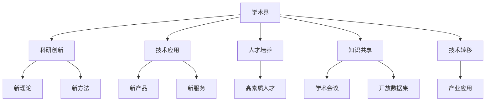
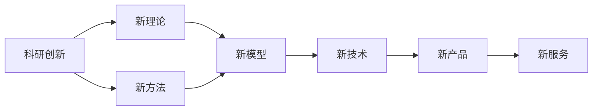
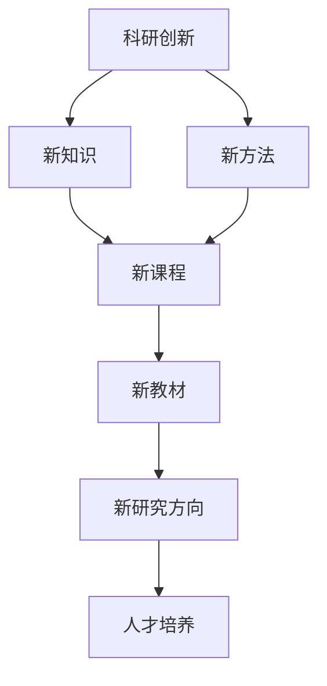
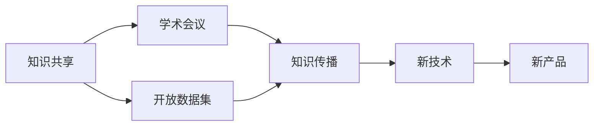
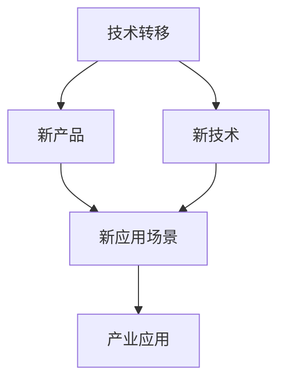

                 

# 学术界在基础模型中的作用

> 关键词：学术界, 基础模型, 科研创新, 行业应用, 人才培养, 技术转移

## 1. 背景介绍

### 1.1 问题由来
随着人工智能技术的迅速发展，基础模型在诸多领域的应用日益广泛，对社会发展产生了深远影响。基础模型，如深度学习模型、语言模型、推荐系统等，在计算机视觉、自然语言处理、推荐系统等领域取得了显著进展，并在实际应用中取得了巨大成功。尽管如此，基础模型的研发、优化、应用等仍面临诸多挑战，需要不断创新和优化。学术界在基础模型的研究和应用中发挥着至关重要的作用，为技术的持续进步提供了源源不断的动力。

### 1.2 问题核心关键点
学术界在基础模型中的作用体现在以下几个方面：

1. 推动技术创新。学术界通过持续的科研创新，推动基础模型的不断进步，提出新的理论和方法，解决现有模型面临的难题。
2. 加速技术应用。学术界的研究成果通常被工业界迅速转化为实际应用，提升产品和服务的质量，满足用户需求。
3. 培养高素质人才。学术界通过教育和培训，培养了大量优秀的研究人员和工程师，为产业界输送了源源不断的高素质人才。
4. 促进知识共享。学术界通过发表论文、开放数据集、组织会议等形式，推动知识的共享和传播，促进了全球科研协作。
5. 推动产业升级。学术界的研究成果往往在核心技术上取得突破，推动了相关产业的技术升级和转型。

### 1.3 问题研究意义
学术界在基础模型中的作用对于推动技术进步、促进产业升级、培养人才和推动知识共享具有重要意义：

1. 推动技术进步。学术界的不断探索和创新，为技术的发展提供了新的动力，推动了基础模型的性能和应用范围的提升。
2. 促进产业升级。学术界的科研成果转化为实际应用，推动了相关产业的技术水平和业务模式的变革，为产业升级提供了支持。
3. 培养高素质人才。学术界的教育和研究环境为人才的培养提供了良好的平台，为行业输送了大量高素质人才，推动了行业的发展。
4. 推动知识共享。学术界的知识和研究成果的共享和传播，促进了全球科研协作，提升了全球科研的整体水平。
5. 推动技术转移。学术界与产业界的紧密合作，加速了科研成果的产业化，推动了技术的商业应用。

## 2. 核心概念与联系

### 2.1 核心概念概述

为更好地理解学术界在基础模型中的作用，本节将介绍几个密切相关的核心概念：

- 学术界(Academia)：包括大学、研究机构、学术会议等，是科学研究和知识传播的主要场所。
- 基础模型(Fundamental Model)：如深度学习模型、语言模型、推荐系统等，是计算机科学和人工智能技术的重要组成部分。
- 科研创新(Research Innovation)：指通过科学研究和实验，提出新的理论、方法、技术，推动基础模型的改进和发展。
- 技术应用(Technical Application)：指将科研成果转化为实际应用，提升产品、服务的质量和效率。
- 人才培养(Talent Cultivation)：指通过教育、培训、实践，培养高素质研究人员和工程师，为产业发展提供人才支持。
- 知识共享(Knowledge Sharing)：指通过发表论文、开放数据集、组织会议等形式，促进知识的传播和共享，推动全球科研协作。
- 技术转移(Technology Transfer)：指将科研成果从学术界向产业界转移，加速技术的商业化应用。

这些核心概念之间的逻辑关系可以通过以下Mermaid流程图来展示：

这个流程图展示学术界在基础模型中的核心概念及其之间的关系：

1. 学术界通过科研创新提出新理论和新方法，推动基础模型的改进和发展。
2. 技术应用将学术界的科研成果转化为实际产品和服务，提升效率和质量。
3. 人才培养通过教育和培训，培养高素质研究人员和工程师，为产业发展提供人才支持。
4. 知识共享通过发表论文、开放数据集和组织会议，促进知识的传播和共享，推动全球科研协作。
5. 技术转移将科研成果从学术界向产业界转移，加速技术的商业化应用。

这些概念共同构成了学术界在基础模型中的作用框架，为技术创新、应用、人才培养和知识共享提供了基础。

### 2.2 概念间的关系

这些核心概念之间存在着紧密的联系，形成了学术界在基础模型中的完整生态系统。下面我通过几个Mermaid流程图来展示这些概念之间的关系。

#### 2.2.1 科研创新与技术应用的关系

这个流程图展示了科研创新如何通过新理论和新技术推动技术应用，生成新的产品和服务。

#### 2.2.2 科研创新与人才培养的关系

这个流程图展示了科研创新如何通过新知识和新技术推动人才培养，培养出高素质研究人员和工程师。

#### 2.2.3 技术应用与人才培养的关系

这个流程图展示了技术应用如何通过新产品和新技术推动人才培养，提升人才的实践能力和创新能力。

#### 2.2.4 知识共享与技术应用的关系

这个流程图展示了知识共享如何通过学术会议和开放数据集推动知识传播，生成新技术和新产品。

#### 2.2.5 技术转移与产业应用的关系

这个流程图展示了技术转移如何通过新产品和新技术推动产业应用，提升产业的技术水平和业务模式。

### 2.3 核心概念的整体架构

最后，我们用一个综合的流程图来展示这些核心概念在基础模型中的整体架构：

这个综合流程图展示了从科研创新到技术应用、人才培养、知识共享和技术转移的完整过程。学术界通过科研创新提出新理论和新技术，推动基础模型的改进和发展。技术应用将科研成果转化为实际产品和服务，提升效率和质量。人才培养通过教育和培训，培养高素质研究人员和工程师，为产业发展提供人才支持。知识共享通过发表论文、开放数据集和组织会议，促进知识的传播和共享，推动全球科研协作。技术转移将科研成果从学术界向产业界转移，加速技术的商业化应用。这些概念共同构成了学术界在基础模型中的作用框架，为技术创新、应用、人才培养和知识共享提供了基础。

## 3. 核心算法原理 & 具体操作步骤
### 3.1 算法原理概述

学术界在基础模型中的作用体现在多个方面，包括科研创新、技术应用、人才培养、知识共享和技术转移。这些作用的实现依赖于一系列的科研工作和实际操作。

科研创新是基础模型的核心推动力，学术界通过持续的科研创新，推动基础模型的不断进步，提出新的理论和方法，解决现有模型面临的难题。技术应用是将科研成果转化为实际应用的过程，提升产品、服务的质量和效率。人才培养是通过教育和培训，培养高素质研究人员和工程师，为产业发展提供人才支持。知识共享是学术界通过发表论文、开放数据集、组织会议等形式，促进知识的传播和共享，推动全球科研协作。技术转移是将科研成果从学术界向产业界转移，加速技术的商业化应用。

### 3.2 算法步骤详解

#### 3.2.1 科研创新

科研创新是基础模型改进和发展的重要推动力，其过程通常包括以下几个步骤：

1. 选题和立项。根据现有技术水平和应用需求，选定研究方向，申请科研基金或资金支持。
2. 实验设计和实施。设计实验方案，选择实验工具和方法，进行数据收集和实验操作。
3. 数据分析和处理。对实验数据进行统计分析和处理，发现规律和特征。
4. 理论总结和验证。总结实验结果，提出新理论和新方法，验证其有效性和可靠性。
5. 成果发表和共享。撰写学术论文，发布开源代码和数据集，参加学术会议，推动知识共享和传播。

#### 3.2.2 技术应用

技术应用是将科研成果转化为实际应用的过程，其过程通常包括以下几个步骤：

1. 项目设计和规划。根据应用需求和市场反馈，设计项目目标和规划方案。
2. 原型开发和测试。开发原型产品，进行功能和性能测试，发现和解决问题。
3. 产品迭代和优化。根据用户反馈和市场反馈，进行产品迭代和优化，提升产品质量和用户体验。
4. 产品部署和推广。将产品部署到实际应用场景，进行市场推广和用户培训，提升产品市场接受度。
5. 用户体验和反馈。收集用户反馈和市场数据，优化产品功能和服务体验，提升用户满意度和忠诚度。

#### 3.2.3 人才培养

人才培养是通过教育和培训，培养高素质研究人员和工程师，其过程通常包括以下几个步骤：

1. 课程设计。设计课程大纲和教学内容，选择合适的教学方法和工具。
2. 实践训练。组织实验、实习、竞赛等实践活动，提升学生的操作能力和创新能力。
3. 论文和项目。指导学生撰写学术论文和完成科研项目，培养其科研能力和学术素养。
4. 职业发展。提供职业规划和就业指导，推荐实习和就业机会，促进学生职业发展。
5. 持续教育。提供在职培训、继续教育等机会，提升在职人员的职业素养和技能水平。

#### 3.2.4 知识共享

知识共享是学术界通过发表论文、开放数据集、组织会议等形式，促进知识的传播和共享，其过程通常包括以下几个步骤：

1. 论文发表。撰写和发表学术论文，推动学术交流和知识传播。
2. 数据集开放。发布开源数据集，促进数据共享和再利用，推动科研协作。
3. 学术会议。组织和参加学术会议，交流最新研究成果，推动知识共享和传播。
4. 技术博客。撰写技术博客和科普文章，普及技术知识和应用场景，促进技术传播。
5. 开源社区。参与开源社区和项目，分享代码和经验，推动技术共享和创新。

#### 3.2.5 技术转移

技术转移是将科研成果从学术界向产业界转移，加速技术的商业化应用，其过程通常包括以下几个步骤：

1. 技术评估。评估技术的市场潜力和商业价值，确定技术转移的方向和方式。
2. 商业化规划。制定商业化计划和营销策略，推动技术产品的市场推广和应用。
3. 合作开发。与产业界合作，进行技术研发和产品开发，提升技术产品的市场竞争力。
4. 知识产权保护。申请专利和技术授权，保护技术知识产权，防止技术侵权和滥用。
5. 持续创新。持续进行技术创新和产品优化，提升技术产品的市场适应性和竞争力。

### 3.3 算法优缺点

学术界在基础模型中的作用具有以下几个优点：

1. 推动技术创新。学术界通过科研创新推动基础模型的不断进步，提出新的理论和方法，解决现有模型面临的难题。
2. 加速技术应用。学术界的研究成果通常被工业界迅速转化为实际应用，提升产品、服务的质量和效率。
3. 培养高素质人才。学术界通过教育和培训，培养高素质研究人员和工程师，为产业发展提供人才支持。
4. 促进知识共享。学术界通过发表论文、开放数据集、组织会议等形式，促进知识的传播和共享，推动全球科研协作。
5. 推动产业升级。学术界的科研成果往往在核心技术上取得突破，推动了相关产业的技术升级和转型。

同时，这些作用也存在一些缺点：

1. 研究与应用脱节。学术界的研究往往关注基础理论和前沿技术，而产业界关注实际应用和商业价值，两者之间存在一定脱节。
2. 研究周期较长。基础模型的研究和开发周期较长，难以快速响应市场需求和变化。
3. 资金和资源不足。学术界的资金和资源相对有限，难以支持大规模和长期的研究项目。
4. 应用效果难以评估。学术界的研究成果往往缺乏实际应用效果的评估，难以验证其商业价值。
5. 技术转移难度较大。学术界与产业界的合作难度较大，技术转移效果难以保证。

尽管存在这些缺点，但就目前而言，学术界在基础模型中的作用仍然是不可替代的。未来相关研究的重点在于如何进一步降低研究与应用之间的脱节，提高研究与应用的双向互动，促进知识共享和技术的快速转移。

### 3.4 算法应用领域

学术界在基础模型中的作用广泛应用于多个领域，以下是几个典型的应用场景：

1. 计算机视觉。学术界在计算机视觉领域的研究成果，如深度学习模型、图像识别技术等，被广泛应用于自动驾驶、安防监控、医疗影像等领域。
2. 自然语言处理。学术界在自然语言处理领域的研究成果，如语言模型、文本分类技术等，被广泛应用于智能客服、智能翻译、舆情分析等领域。
3. 推荐系统。学术界在推荐系统领域的研究成果，如协同过滤、深度推荐技术等，被广泛应用于电商、社交、娱乐等领域。
4. 机器人技术。学术界在机器人技术领域的研究成果，如机器人控制算法、视觉感知技术等，被广泛应用于工业自动化、家庭服务、医疗护理等领域。
5. 量子计算。学术界在量子计算领域的研究成果，如量子算法、量子模拟技术等，被广泛应用于高精度计算、密码学、生物医药等领域。

这些领域的应用展示了学术界在基础模型中的重要作用，推动了相关技术的进步和产业的发展。

## 4. 数学模型和公式 & 详细讲解  
### 4.1 数学模型构建

学术界在基础模型中的作用可以通过数学模型来刻画，这里主要介绍科研创新和技术应用中的数学模型构建。

#### 4.1.1 科研创新中的数学模型

科研创新中的数学模型通常用于描述和分析实验数据，推导和验证理论方法。以下是几个典型的数学模型：

1. 线性回归模型：用于描述和分析实验数据，拟合线性关系，发现规律和特征。
2. 多元回归模型：用于描述和分析实验数据，拟合多元关系，发现复杂规律和特征。
3. 时间序列模型：用于描述和分析时间序列数据，预测未来趋势和变化。
4. 优化模型：用于优化实验参数和算法，提升实验效率和效果。
5. 机器学习模型：用于处理和分析大量数据，发现和提取模式和规律。

#### 4.1.2 技术应用中的数学模型

技术应用中的数学模型通常用于描述和分析产品和服务，优化设计和测试，提升用户体验和效率。以下是几个典型的数学模型：

1. 最优化模型：用于描述和分析产品设计，优化参数和配置，提升性能和可靠性。
2. 概率模型：用于描述和分析服务质量，预测用户行为和需求，提升用户体验和满意度。
3. 仿真模型：用于描述和分析产品和服务，模拟和测试，发现和解决问题。
4. 统计模型：用于描述和分析市场数据，预测市场趋势和变化，提升市场竞争力和决策能力。
5. 决策模型：用于描述和分析用户决策，预测用户行为和需求，提升用户满意度和忠诚度。

### 4.2 公式推导过程

#### 4.2.1 线性回归模型

线性回归模型用于描述和分析实验数据，拟合线性关系，发现规律和特征。其公式推导过程如下：

设 $y$ 为实验结果，$x_1, x_2, ..., x_n$ 为实验变量，线性回归模型为：

$$
y = \beta_0 + \beta_1x_1 + \beta_2x_2 + ... + \beta_nx_n + \epsilon
$$

其中 $\beta_0, \beta_1, ..., \beta_n$ 为模型参数，$\epsilon$ 为误差项。根据最小二乘法，线性回归模型的参数估计公式为：

$$
\beta_i = \frac{\sum_{j=1}^n(x_{ij}\epsilon_j)}{\sum_{i=1}^n\sum_{j=1}^n(x_{ij}x_{ik})}
$$

#### 4.2.2 多元回归模型

多元回归模型用于描述和分析实验数据，拟合多元关系，发现复杂规律和特征。其公式推导过程如下：

设 $y$ 为实验结果，$x_1, x_2, ..., x_n$ 为实验变量，多元回归模型为：

$$
y = \beta_0 + \beta_1x_1 + \beta_2x_2 + ... + \beta_nx_n + \epsilon
$$

其中 $\beta_0, \beta_1, ..., \beta_n$ 为模型参数，$\epsilon$ 为误差项。根据最小二乘法，多元回归模型的参数估计公式为：

$$
\beta_i = \frac{\sum_{j=1}^n(x_{ij}\epsilon_j)}{\sum_{i=1}^n\sum_{j=1}^n(x_{ij}x_{ik})}
$$

#### 4.2.3 时间序列模型

时间序列模型用于描述和分析时间序列数据，预测未来趋势和变化。其公式推导过程如下：

设 $y_t$ 为时间序列数据，时间序列模型为：

$$
y_t = \beta_0 + \beta_1t + \epsilon_t
$$

其中 $\beta_0, \beta_1$ 为模型参数，$\epsilon_t$ 为误差项。根据最小二乘法，时间序列模型的参数估计公式为：

$$
\beta_0 = \frac{\sum_{t=1}^n(y_t - \beta_1t)}{n}
$$

$$
\beta_1 = \frac{\sum_{t=1}^n(ty_t - \frac{1}{2}n(n+1))}{n\sum_{t=1}^nt^2}
$$

#### 4.2.4 优化模型

优化模型用于优化实验参数和算法，提升实验效率和效果。其公式推导过程如下：

设 $f(x)$ 为优化目标函数，$x$ 为优化变量，$g(x)$ 为优化约束条件。优化模型的求解过程为：

$$
\min_{x} f(x) \text{ subject to } g(x)
$$

常见的优化算法包括梯度下降法、牛顿法、遗传算法等。梯度下降法的公式为：

$$
x_{k+1} = x_k - \alpha\nabla f(x_k)
$$

其中 $\alpha$ 为学习率，$\nabla f(x_k)$ 为函数 $f(x)$ 在点 $x_k$ 的梯度。

#### 4.2.5 机器学习模型

机器学习模型用于处理和分析大量数据，发现和提取模式和规律。其公式推导过程如下：

设 $x$ 为输入数据，$y$ 为输出结果，机器学习模型的训练过程为：

$$
\min_{\theta} L(\theta) = \frac{1}{N}\sum_{i=1}^N(l(y_i, x_i) + \lambda R(\theta))
$$

其中 $l$ 为损失函数，$R$ 为正则化项，$\theta$ 为模型参数，$\lambda$ 为正则化系数。常见的机器学习模型包括线性回归、逻辑回归、支持向量机、决策树、神经网络等。

### 4.3 案例分析与讲解

#### 4.3.1 线性回归模型案例

线性回归模型用于描述和分析实验数据，拟合线性关系，发现规律和特征。以下是线性回归模型的案例分析：

设有一组数据 $(x_i, y_i)$，其中 $x_i$ 为实验变量，$y_i$ 为实验结果，线性回归模型为：

$$
y_i = \beta_0 + \beta_1x_i + \epsilon_i
$$

其中 $\beta_0, \beta_1$ 为模型参数，$\epsilon_i$ 为误差项。通过最小二乘法，求解 $\beta_0$ 和 $\beta_1$ 的估计值，得到线性回归模型的参数估计公式：

$$
\hat{\beta}_1 = \frac{\sum_{i=1}^n(x_i - \bar{x})(y_i - \bar{y})}{\sum_{i=1}^n(x_i - \bar{x})^2}
$$

$$
\hat{\beta}_0 = \bar{y} - \hat{\beta}_1\bar{x}
$$

其中 $\bar{x}$ 和 $\bar{y}$ 为样本均值。

#### 4.3.2 多元回归模型案例

多元回归模型用于描述和分析实验数据，拟合多元关系，发现复杂规律和特征。以下是多元回归模型的案例分析：

设有一组数据 $(x_i, y_i)$，其中 $x_i$ 为实验变量，$y_i$ 为实验结果，多元回归模型为：

$$
y_i = \beta_0 + \beta_1x_{i1} + \beta_2x_{i2} + ... + \beta_nx_{in} + \epsilon_i
$$

其中 $\beta_0, \beta_1, ..., \beta_n$ 为模型参数，$\epsilon_i$ 为误差项。通过最小二乘法，求解 $\beta_0, \beta_1, ..., \beta_n$ 的估计值，得到多元回归模型的参数估计公式：

$$
\hat{\beta}_i = \frac{\sum_{j=1}^n(x_{ij}\epsilon_j)}{\sum_{i=1}^n\sum_{j=1}^n(x_{ij}x_{ik})}
$$

#### 4.3.3 时间序列模型案例

时间序列模型用于描述和分析时间序列数据，预测未来趋势和变化。以下是时间序列模型的案例分析：

设有一组时间序列数据 $y_t$，时间序列模型为：

$$
y_t = \beta_0 + \beta_1t + \epsilon_t
$$

其中 $\beta_0, \beta_1$ 为模型参数，$\epsilon_t$ 为误差项。通过最小二乘法，求解 $\beta_0$ 和 $\beta_1$ 的估计值，得到时间序列模型的参数估计公式：

$$
\hat{\beta}_0 = \frac{\sum_{t=1}^n(y_t - \beta_1t)}{n}
$$

$$
\hat{\beta}_1 = \frac{\sum_{t=1}^n(ty_t - \frac{1}{2}n(n+1))}{n\sum_{t=1}^nt^2}
$$

#### 4.3.4 优化模型案例

优化模型用于优化实验参数和算法，提升实验效率和效果。以下是优化模型的案例分析：

设有一组优化问题 $f(x)$，其中 $x$ 为优化变量，$g(x)$ 为优化约束条件。梯度下降法的公式为：

$$
x_{k+1} = x_k - \alpha\nabla f(x_k)
$$

其中 $\alpha$ 为学习率，$\nabla f(x_k)$ 为函数 $f(x)$ 在点 $x_k$ 的梯度。通过迭代计算，求解优化问题的最优解。

#### 4.3.5 机器学习模型案例

机器学习模型用于处理和分析大量数据，发现和提取模式和规律。以下是机器学习模型的案例分析：

设有一组数据 $(x_i, y_i)$，其中 $x_i$ 为输入数据，$y_i$ 为输出结果，机器学习模型的训练过程为：

$$
\min_{\theta} L(\theta) = \frac{1}{N}\sum_{i=1}^N(l(y_i, x_i) + \lambda R(\theta))
$$

其中 $l$ 为损失函数，$R$ 为正则化项，$\theta$ 为模型参数，$\lambda$ 为正则化系数。常见的机器学习模型包括线性回归、逻辑回归、支持向量机、决策树、神经网络等。通过迭代训练，求解模型参数，得到机器学习模型的最优解。

## 5. 项目实践：代码实例和

