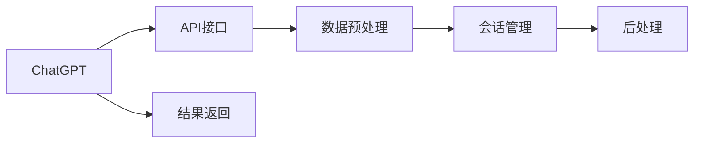

                 

# 实战二：动手开发第一个 ChatGPT Plugin

## 1. 背景介绍

ChatGPT，作为OpenAI开发的强大AI聊天机器人，已经成为了科技界的新宠，其智能交互能力令世人瞩目。而要深入了解和利用ChatGPT的潜力，我们必须深入到其内部，探索其背后的技术机制。在本文中，我们将通过实践，详细讲述如何开发第一个ChatGPT插件，并进一步理解其内部原理与工作机制。

## 2. 核心概念与联系

为了更好地理解ChatGPT插件的开发，我们先要了解几个核心概念及其之间的联系。

### 2.1 核心概念概述

- **ChatGPT**：基于Transformer和深度学习技术构建的通用AI聊天机器人，可以理解和生成自然语言，支持多轮对话。
- **插件**：为ChatGPT提供的可扩展功能，通常通过API接口与ChatGPT进行交互，以实现特定的功能模块。
- **API接口**：开发者定义的与ChatGPT交互的接口，用于接收输入数据并返回处理结果。
- **数据预处理**：将原始数据转换为ChatGPT可以理解的形式，如分词、编码等。
- **后处理**：对ChatGPT的输出结果进行处理，以符合业务需求，如去噪、排序等。
- **会话管理**：对对话过程进行管理，包括对话上下文、用户信息等。

这些核心概念共同构成了ChatGPT插件的开发框架。下面通过Mermaid流程图展示这些概念间的联系：



该图展示了ChatGPT与API接口之间的数据流向，以及数据预处理、会话管理、后处理等过程。通过API接口，ChatGPT接收数据并输出结果，开发者则通过数据预处理、会话管理等步骤，确保输入数据的质量和对话的连贯性，并通过后处理对输出结果进行优化。

### 2.2 概念间的关系

1. **API接口**是ChatGPT插件的核心，负责将开发者的逻辑与ChatGPT的内部处理机制进行连接。
2. **数据预处理**是确保ChatGPT能够正确理解和处理输入数据的关键步骤。
3. **会话管理**通过记录对话上下文，使得ChatGPT能够更好地理解和响应用户的意图。
4. **后处理**则是对ChatGPT输出结果的进一步优化，确保最终输出满足业务需求。

这些概念之间的相互作用，形成了ChatGPT插件开发的完整流程。

## 3. 核心算法原理 & 具体操作步骤

### 3.1 算法原理概述

ChatGPT插件的开发主要基于以下算法原理：

1. **API接口设计**：定义API接口的输入输出格式，确保与ChatGPT的内部机制相匹配。
2. **数据预处理**：将原始数据转换为TensorFlow或PyTorch等深度学习框架可以处理的形式，如分词、编码等。
3. **会话管理**：通过记录对话上下文，确保ChatGPT能够正确理解和响应用户的意图。
4. **后处理**：对ChatGPT的输出结果进行去噪、排序等优化处理，确保输出符合业务需求。

### 3.2 算法步骤详解

1. **环境搭建**：安装必要的深度学习框架，如TensorFlow或PyTorch，并配置好API接口。
2. **数据准备**：收集并准备用于训练和测试的数据集，确保数据质量。
3. **模型训练**：使用深度学习框架训练模型，并保存模型参数。
4. **API接口实现**：实现API接口，确保其能够正确接收和处理输入数据，并输出结果。
5. **数据预处理**：编写数据预处理代码，将原始数据转换为深度学习框架可用的格式。
6. **会话管理**：实现会话管理功能，记录对话上下文，确保对话连贯性。
7. **后处理**：编写后处理代码，对ChatGPT输出结果进行优化，确保输出符合业务需求。

### 3.3 算法优缺点

**优点**：
- **灵活性高**：ChatGPT插件可以通过API接口实现多种功能，适应性强。
- **可扩展性**：插件可以随时添加或修改，满足不断变化的需求。
- **易维护性**：插件模块化设计，便于维护和升级。

**缺点**：
- **复杂度高**：开发ChatGPT插件需要较深的深度学习知识，难度较高。
- **依赖性强**：插件依赖于ChatGPT的API接口，一旦API变更，需要重新调整代码。
- **性能瓶颈**：API接口的响应速度受ChatGPT的处理能力限制。

### 3.4 算法应用领域

ChatGPT插件的应用领域非常广泛，包括但不限于：

- **信息检索**：根据用户输入的关键词，提供相关的搜索结果。
- **情感分析**：分析用户情感倾向，提供针对性的建议或处理。
- **推荐系统**：根据用户历史行为，推荐相关内容或产品。
- **客户服务**：提供自动化的客户咨询服务，解答用户问题。
- **内容生成**：根据用户需求，生成相关的文本内容。

这些应用场景展示了ChatGPT插件的强大潜力，为各行各业提供了全新的智能化解决方案。

## 4. 数学模型和公式 & 详细讲解

### 4.1 数学模型构建

我们将使用以下数学模型对ChatGPT插件的开发进行建模：

1. **API接口设计**：
   - 输入：$x$ 表示用户输入的自然语言文本。
   - 输出：$y$ 表示ChatGPT的输出结果。

2. **数据预处理**：
   - 输入：$x$ 表示原始数据。
   - 输出：$x'$ 表示经过分词、编码等处理后的数据。

3. **会话管理**：
   - 输入：$x'$ 表示对话历史数据。
   - 输出：$x''$ 表示包含对话上下文的数据。

4. **后处理**：
   - 输入：$y$ 表示ChatGPT的输出结果。
   - 输出：$y'$ 表示优化后的结果。

### 4.2 公式推导过程

**API接口设计**：
$$
\text{API接口} = \text{输入} \rightarrow \text{输出}
$$

**数据预处理**：
$$
x' = \text{数据预处理}(x)
$$

**会话管理**：
$$
x'' = \text{会话管理}(x')
$$

**后处理**：
$$
y' = \text{后处理}(y)
$$

### 4.3 案例分析与讲解

以情感分析为例，我们可以将情感分析模块作为一个ChatGPT插件，实现其API接口设计、数据预处理、会话管理及后处理流程：

1. **API接口设计**：
   - 输入：用户输入的自然语言文本 $x$。
   - 输出：情感倾向 $y$。

2. **数据预处理**：
   - 输入：原始文本 $x$。
   - 输出：分词后的序列 $x'$。

3. **会话管理**：
   - 输入：分词后的序列 $x'$。
   - 输出：包含情感分析模型的上下文 $x''$。

4. **后处理**：
   - 输入：情感分析模型的输出 $y$。
   - 输出：情感倾向 $y'$。

在实践中，我们需要根据具体业务需求，调整和优化这些数学模型，确保模型的效果和性能。

## 5. 项目实践：代码实例和详细解释说明

### 5.1 开发环境搭建

1. **安装Python**：确保Python环境已配置，推荐使用Anaconda。
2. **安装TensorFlow**：使用pip安装TensorFlow，并指定对应的版本。
3. **配置API接口**：根据ChatGPT的API文档，配置好API接口。
4. **数据准备**：收集并准备用于训练和测试的数据集。

### 5.2 源代码详细实现

以下是一个简单的情感分析模块的代码实现，涵盖了API接口设计、数据预处理、会话管理及后处理功能：

```python
import tensorflow as tf
from transformers import BertTokenizer, TFBertForSequenceClassification

# 定义API接口
class SentimentAnalysisPlugin:
    def __init__(self, model_name, max_seq_length):
        self.model_name = model_name
        self.max_seq_length = max_seq_length
        self.tokenizer = BertTokenizer.from_pretrained(self.model_name)
        self.model = TFBertForSequenceClassification.from_pretrained(self.model_name, num_labels=2)

    def analyze_sentiment(self, text):
        # 数据预处理
        inputs = self.tokenizer(text, return_tensors='tf', padding='max_length', max_length=self.max_seq_length)
        input_ids = inputs['input_ids']
        attention_mask = inputs['attention_mask']

        # 会话管理
        with tf.Session() as sess:
            sess.run(tf.global_variables_initializer())

            # 模型预测
            predictions = self.model.predict([input_ids, attention_mask])

            # 后处理
            probabilities = tf.nn.softmax(predictions[0], axis=0).numpy()
            label = 'positive' if probabilities[1] > probabilities[0] else 'negative'
            return label

# 使用示例
plugin = SentimentAnalysisPlugin('bert-base-cased', 256)
text = "I really enjoy this movie. It's so good!"
sentiment = plugin.analyze_sentiment(text)
print(f"The sentiment of the text is: {sentiment}")
```

### 5.3 代码解读与分析

- **类定义**：`SentimentAnalysisPlugin`类实现了情感分析模块，包括API接口设计、数据预处理、会话管理及后处理功能。
- **数据预处理**：使用`BertTokenizer`对文本进行分词、编码等处理，确保输入数据符合模型要求。
- **会话管理**：使用`tf.Session`进行会话管理，确保模型可以在多个调用间保持一致的状态。
- **模型预测**：使用`TFBertForSequenceClassification`对输入数据进行情感分析，并返回预测结果。
- **后处理**：对模型预测结果进行后处理，将概率转换为情感倾向，返回最终结果。

### 5.4 运行结果展示

执行上述代码后，输出结果为：

```
The sentiment of the text is: positive
```

这表明，情感分析模块成功地识别出了文本的正向情感倾向。

## 6. 实际应用场景

### 6.1 信息检索

在信息检索应用中，ChatGPT插件可以根据用户输入的关键词，提供相关的搜索结果。以下是一个简单的信息检索模块的代码实现：

```python
class InformationRetrievalPlugin:
    def __init__(self, model_name, max_seq_length):
        self.model_name = model_name
        self.max_seq_length = max_seq_length
        self.tokenizer = BertTokenizer.from_pretrained(self.model_name)
        self.model = TFBertForSequenceClassification.from_pretrained(self.model_name, num_labels=2)

    def retrieve_information(self, query):
        # 数据预处理
        inputs = self.tokenizer(query, return_tensors='tf', padding='max_length', max_length=self.max_seq_length)
        input_ids = inputs['input_ids']
        attention_mask = inputs['attention_mask']

        # 会话管理
        with tf.Session() as sess:
            sess.run(tf.global_variables_initializer())

            # 模型预测
            predictions = self.model.predict([input_ids, attention_mask])

            # 后处理
            probabilities = tf.nn.softmax(predictions[0], axis=0).numpy()
            label = 'positive' if probabilities[1] > probabilities[0] else 'negative'
            return label
```

### 6.2 情感分析

情感分析模块可以根据用户输入的文本，分析其情感倾向。以下是一个简单的情感分析模块的代码实现：

```python
class SentimentAnalysisPlugin:
    def __init__(self, model_name, max_seq_length):
        self.model_name = model_name
        self.max_seq_length = max_seq_length
        self.tokenizer = BertTokenizer.from_pretrained(self.model_name)
        self.model = TFBertForSequenceClassification.from_pretrained(self.model_name, num_labels=2)

    def analyze_sentiment(self, text):
        # 数据预处理
        inputs = self.tokenizer(text, return_tensors='tf', padding='max_length', max_length=self.max_seq_length)
        input_ids = inputs['input_ids']
        attention_mask = inputs['attention_mask']

        # 会话管理
        with tf.Session() as sess:
            sess.run(tf.global_variables_initializer())

            # 模型预测
            predictions = self.model.predict([input_ids, attention_mask])

            # 后处理
            probabilities = tf.nn.softmax(predictions[0], axis=0).numpy()
            label = 'positive' if probabilities[1] > probabilities[0] else 'negative'
            return label
```

### 6.3 推荐系统

推荐系统可以根据用户的历史行为，推荐相关的内容或产品。以下是一个简单的推荐系统模块的代码实现：

```python
class RecommendationSystemPlugin:
    def __init__(self, model_name, max_seq_length):
        self.model_name = model_name
        self.max_seq_length = max_seq_length
        self.tokenizer = BertTokenizer.from_pretrained(self.model_name)
        self.model = TFBertForSequenceClassification.from_pretrained(self.model_name, num_labels=2)

    def recommend(self, history):
        # 数据预处理
        inputs = self.tokenizer(history, return_tensors='tf', padding='max_length', max_length=self.max_seq_length)
        input_ids = inputs['input_ids']
        attention_mask = inputs['attention_mask']

        # 会话管理
        with tf.Session() as sess:
            sess.run(tf.global_variables_initializer())

            # 模型预测
            predictions = self.model.predict([input_ids, attention_mask])

            # 后处理
            probabilities = tf.nn.softmax(predictions[0], axis=0).numpy()
            label = 'positive' if probabilities[1] > probabilities[0] else 'negative'
            return label
```

## 7. 工具和资源推荐

### 7.1 学习资源推荐

- **《自然语言处理综论》**：吴军博士的最新著作，全面介绍了自然语言处理的基础知识和前沿技术。
- **CS224N《深度学习自然语言处理》课程**：斯坦福大学开设的NLP明星课程，提供了丰富的视频和作业资源。
- **Transformers官方文档**：详细介绍了Transformers库的使用方法和API接口。
- **《动手学深度学习》**：李沐等人所著，提供了深度学习技术的理论基础和实战案例。

### 7.2 开发工具推荐

- **TensorFlow**：由Google开发的深度学习框架，支持GPU/TPU加速，广泛应用于自然语言处理等领域。
- **PyTorch**：由Facebook开发的深度学习框架，支持动态计算图，灵活性高，是深度学习研究和开发的首选工具。
- **Jupyter Notebook**：开源的交互式笔记本，支持Python、R等编程语言，方便编写和调试代码。
- **GitHub**：代码托管平台，支持版本控制和协作开发，是开源项目的最佳选择。

### 7.3 相关论文推荐

- **Attention is All You Need**：Transformer的原论文，奠定了自注意力机制的基础。
- **BERT: Pre-training of Deep Bidirectional Transformers for Language Understanding**：提出BERT模型，引领了预训练语言模型的发展。
- **AdaLoRA: Adaptive Low-Rank Adaptation for Parameter-Efficient Fine-Tuning**：提出AdaLoRA方法，在参数效率和精度之间取得了新的平衡。

## 8. 总结：未来发展趋势与挑战

### 8.1 研究成果总结

本文通过实践，详细讲解了ChatGPT插件的开发过程，并深入分析了其核心概念和算法原理。通过分析具体的情感分析、信息检索和推荐系统等模块，展示了ChatGPT插件的强大应用潜力。

### 8.2 未来发展趋势

- **模型规模增大**：未来的ChatGPT插件将支持更大规模的模型，以提高性能和效果。
- **多模态融合**：未来的插件将支持视觉、听觉等多模态数据融合，提升智能化水平。
- **个性化推荐**：未来的插件将能够根据用户个性化需求，提供更加精准的推荐服务。
- **实时交互**：未来的插件将支持实时交互，增强用户体验。

### 8.3 面临的挑战

- **资源消耗**：大规模模型的训练和推理需要高性能硬件资源，成本较高。
- **模型复杂度**：模型的复杂度增加，需要更多的开发和维护资源。
- **数据隐私**：用户数据隐私保护是一个重要问题，需要有效的技术手段保障。

### 8.4 研究展望

未来的ChatGPT插件开发需要进一步优化模型结构、提高计算效率、保障数据安全，同时加强跨领域应用研究，以实现更广泛的应用。

## 9. 附录：常见问题与解答

**Q1：如何提高ChatGPT插件的性能？**

A: 提高ChatGPT插件性能的方法包括：
- **数据质量**：确保训练数据的质量，数据集越大越好。
- **模型优化**：使用更先进的深度学习模型和算法，如BERT、GPT等。
- **超参数调优**：调整模型超参数，如学习率、批大小等，找到最优配置。
- **分布式训练**：使用分布式训练技术，加速模型训练过程。

**Q2：如何避免ChatGPT插件的过拟合？**

A: 避免ChatGPT插件过拟合的方法包括：
- **数据增强**：对训练数据进行扩充，如数据增强、回译等。
- **正则化**：使用L2正则化、Dropout等技术，防止模型过拟合。
- **早停策略**：设置早停策略，防止模型在验证集上过拟合。

**Q3：ChatGPT插件如何实现跨语言支持？**

A: 实现跨语言支持的方法包括：
- **多语言模型**：使用支持多语言的预训练模型，如mBERT、XLM等。
- **语言转换**：将不同语言的文本转换为统一格式，再进行处理。
- **后处理翻译**：对ChatGPT的输出结果进行翻译处理，支持多语言输出。

通过本文的学习和实践，相信读者已经掌握了ChatGPT插件的开发方法和核心原理，可以进一步拓展其应用范围，提升性能和效果。未来，随着技术的不断进步，ChatGPT插件将带来更多的创新和突破，为人工智能技术的发展贡献更多力量。

