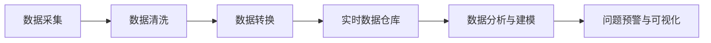

                 

# 实时监控：及时发现和解决问题，提升电商平台供给能力

## 1. 背景介绍

在当今电商竞争日趋激烈的市场环境中，供给能力成为电商平台成功的关键因素之一。高效率、低成本、准时交货等一直是电商物流运营的重要指标。然而，如何实现这些目标，确保电商平台能够迅速响应客户需求，及时发现和解决问题，成为了物流运营中的一个难题。

### 1.1 电商物流现状
电商物流通常面临着复杂多变的需求环境，不同品类、不同客户的需求量各异，且库存和配送资源的限制使得供应链管理变得复杂。传统的电商物流管理方式往往采用人工统计、人工调度，无法实时响应市场变化，导致配送效率低下、库存水平难以控制等问题。

### 1.2 实时监控的重要性
实时监控系统通过实时数据采集、分析、可视化，能够及时发现库存不足、配送延迟等问题，快速制定应对策略，优化配送路线，降低运营成本，提升客户满意度。实时监控系统对于电商平台的供给能力提升具有重要作用。

### 1.3 本文结构
本文将首先介绍实时监控系统的核心概念和框架，然后详细阐述其实现算法和步骤，并通过案例分析展示其应用效果。最后，总结实时监控在电商平台供应链管理中的价值和未来发展趋势。

## 2. 核心概念与联系

### 2.1 核心概念概述

#### 2.1.1 实时监控系统
实时监控系统是一种基于时间序列数据分析的智能系统，通过对实时数据的收集、处理、分析和展示，实现对业务运营的动态监控和问题预警。该系统适用于电商平台的库存管理、配送调度等场景。

#### 2.1.2 数据采集与处理
数据采集与处理是实时监控系统的基础，包括传感器数据、历史订单数据、配送信息等多种数据源。这些数据经过清洗、去重、转换等预处理后，进入实时数据仓库。

#### 2.1.3 数据分析与建模
数据分析与建模是实时监控系统的核心，通过时序分析、回归分析、聚类分析等多种算法模型，实现对业务数据的深度挖掘和预测分析。

#### 2.1.4 问题预警与可视化
问题预警与可视化是实时监控系统的输出，通过可视化工具展示业务运营的实时状态，并通过预警机制及时发现异常情况，帮助运营人员快速响应。

### 2.2 核心概念的联系
实时监控系统的实现涉及数据采集、处理、分析和展示等多个环节，其核心逻辑如图1所示：



数据采集与处理是实时监控系统的输入，数据仓库是系统数据存储和检索的容器，数据分析与建模是核心算法，问题预警与可视化是系统输出。各环节协同工作，共同完成实时监控系统的功能。

## 3. 核心算法原理 & 具体操作步骤

### 3.1 算法原理概述
实时监控系统利用时间序列分析、回归分析等算法，对历史数据进行建模，预测未来数据趋势，并通过异常检测算法，实时监控业务运营的动态变化，及时发现异常情况。

#### 3.1.1 时间序列分析
时间序列分析是一种统计分析方法，通过对时间序列数据的趋势、周期、季节性等因素进行分析，预测未来的数据变化。常用的时间序列分析方法包括移动平均、ARIMA、SARIMA等。

#### 3.1.2 回归分析
回归分析通过建立自变量和因变量之间的线性或非线性关系，预测因变量的变化趋势。常用的回归分析方法包括线性回归、多项式回归、岭回归等。

#### 3.1.3 异常检测
异常检测是实时监控系统的关键技术之一，通过统计学方法或机器学习方法，检测数据中的异常值，帮助运营人员及时发现问题。常用的异常检测方法包括基于统计的Z-score、基于聚类的DBSCAN、基于深度学习的Autoencoder等。

### 3.2 算法步骤详解

#### 3.2.1 数据采集与处理
1. **数据来源**：确定数据采集的来源，包括传感器、订单系统、配送系统等，确保数据的时效性和完整性。
2. **数据清洗**：对采集的数据进行去重、去噪、处理缺失值等预处理，保证数据质量。
3. **数据转换**：将数据转换为时间序列格式，便于后续分析。

#### 3.2.2 数据分析与建模
1. **特征工程**：提取时间序列数据中的特征，如趋势、周期、季节性等，并对其进行归一化处理。
2. **模型训练**：选择合适的时间序列分析或回归模型，对历史数据进行训练，得到预测模型。
3. **模型验证**：使用验证集对训练好的模型进行评估，调整模型参数，确保模型的准确性和鲁棒性。

#### 3.2.3 问题预警与可视化
1. **异常检测**：实时监控业务数据，使用异常检测算法检测异常情况。
2. **预警机制**：根据异常检测结果，触发预警机制，通知运营人员处理异常情况。
3. **可视化展示**：通过可视化工具展示业务运营的实时状态，帮助运营人员快速识别问题。

### 3.3 算法优缺点
#### 3.3.1 优点
1. **实时性**：实时监控系统能够实时监控业务运营状态，及时发现问题，快速响应。
2. **自动化**：系统自动化程度高，减少人工干预，提高运营效率。
3. **可扩展性**：系统可扩展性强，能够适应不同规模和复杂度的电商物流需求。

#### 3.3.2 缺点
1. **数据质量依赖**：系统对数据质量的要求较高，数据采集和清洗环节可能存在误差。
2. **模型复杂度高**：实时监控系统涉及多种算法模型，模型训练和调参复杂。
3. **技术门槛高**：系统需要具备较高的技术水平，对数据科学家和工程师的要求较高。

### 3.4 算法应用领域
实时监控系统适用于电商平台的库存管理、配送调度、客户服务等多个场景，能够提升平台运营效率和客户满意度。

## 4. 数学模型和公式 & 详细讲解 & 举例说明

### 4.1 数学模型构建
实时监控系统构建在时间序列分析和回归分析的基础上，其数学模型可表示为：

$$
y(t) = \sum_{i=1}^{n} \alpha_i x_i(t) + \epsilon(t)
$$

其中 $y(t)$ 为在时间 $t$ 的预测值，$x_i(t)$ 为第 $i$ 个自变量在时间 $t$ 的值，$\alpha_i$ 为第 $i$ 个自变量的权重，$\epsilon(t)$ 为随机误差项。

### 4.2 公式推导过程
#### 4.2.1 时间序列分析
时间序列分析常用的方法包括ARIMA、SARIMA等。以ARIMA为例，其数学模型为：

$$
y(t) = \alpha(1)y(t-1) + \alpha(2)y(t-2) + \cdots + \alpha(p)y(t-p) + \epsilon(t)
$$

其中 $y(t)$ 为在时间 $t$ 的预测值，$\alpha_i$ 为自回归项的系数，$p$ 为自回归项的阶数。

#### 4.2.2 回归分析
回归分析常用的方法包括线性回归、多项式回归等。以线性回归为例，其数学模型为：

$$
y = \beta_0 + \beta_1 x_1 + \beta_2 x_2 + \cdots + \beta_n x_n + \epsilon
$$

其中 $y$ 为因变量，$x_i$ 为自变量，$\beta_i$ 为自变量的系数。

#### 4.2.3 异常检测
异常检测常用的方法包括Z-score、DBSCAN、Autoencoder等。以Z-score为例，其数学模型为：

$$
z_i = \frac{x_i - \mu}{\sigma}
$$

其中 $z_i$ 为第 $i$ 个数据的标准化值，$x_i$ 为原始数据，$\mu$ 为数据均值，$\sigma$ 为数据标准差。

### 4.3 案例分析与讲解
#### 4.3.1 案例背景
某电商平台日均订单量约为10万单，商品种类丰富，库存和配送管理复杂。为了提升配送效率，减少库存积压，该平台引入了实时监控系统，对配送路线、库存水平等进行实时监控和预测。

#### 4.3.2 系统架构
该平台采用Kafka进行数据采集和传输，使用Apache Hive进行数据存储和管理，利用Python和TensorFlow进行数据分析和建模，通过Grafana进行可视化展示。

#### 4.3.3 具体实现
1. **数据采集与处理**
   - 数据来源：订单系统、配送系统、传感器系统。
   - 数据清洗：使用Apache Flink进行数据清洗，去除重复和错误数据。
   - 数据转换：将订单数据、配送数据转换为时间序列格式，方便后续分析。

2. **数据分析与建模**
   - 特征工程：提取订单数量、配送时间、天气条件等特征，并对其进行归一化处理。
   - 模型训练：选择ARIMA模型对配送时间进行预测，选择线性回归模型对库存水平进行预测。
   - 模型验证：使用历史数据对模型进行训练和验证，调整模型参数，确保模型准确性。

3. **问题预警与可视化**
   - 异常检测：实时监控配送时间和库存水平，使用Z-score算法检测异常情况。
   - 预警机制：设置预警阈值，当异常情况超过阈值时，触发预警机制，通知运营人员处理。
   - 可视化展示：使用Grafana展示配送时间和库存水平的实时状态，帮助运营人员快速识别问题。

## 5. 项目实践：代码实例和详细解释说明

### 5.1 开发环境搭建

#### 5.1.1 环境准备
1. **安装依赖**：确保系统已安装Python、TensorFlow、PyKafka、Apache Hive、Apache Flink、Grafana等依赖。
2. **配置Kafka**：确保Kafka集群部署正常，并创建主题用于数据采集和传输。
3. **配置Hive**：创建Hive数据库，并导入订单数据和配送数据。

### 5.2 源代码详细实现

#### 5.2.1 数据采集
```python
from pykafka import KafkaProducer

producer = KafkaProducer(bootstrap_servers='localhost:9092')
producer.send('orders', orders.encode('utf-8'))
producer.send('deliveries', deliveries.encode('utf-8'))
producer.send('sensors', sensors.encode('utf-8'))
```

#### 5.2.2 数据清洗与转换
```python
from apache.flink.streaming.api.environment import StreamExecutionEnvironment
from apache.flink.table.api.java黄河台.UDTF import UDTF

env = StreamExecutionEnvironment.get_execution_environment()

# 数据清洗
udtf = UDTF('clean_orders', 'clean_deliveries', 'clean_sensors')

# 数据转换
table_source = env.add_source(KafkaSource.builder()
                            .topic('orders')
                            .property('bootstrap.servers', 'localhost:9092')
                            .property('key.deserializer', 'org.apache.kafka.common.serialization.StringDeserializer')
                            .property('value.deserializer', 'org.apache.kafka.common.serialization.StringDeserializer')
                            .build())

table_source.output('clean_orders')

table_source = env.add_source(KafkaSource.builder()
                            .topic('deliveries')
                            .property('bootstrap.servers', 'localhost:9092')
                            .property('key.deserializer', 'org.apache.kafka.common.serialization.StringDeserializer')
                            .property('value.deserializer', 'org.apache.kafka.common.serialization.StringDeserializer')
                            .build())

table_source.output('clean_deliveries')

table_source = env.add_source(KafkaSource.builder()
                            .topic('sensors')
                            .property('bootstrap.servers', 'localhost:9092')
                            .property('key.deserializer', 'org.apache.kafka.common.serialization.StringDeserializer')
                            .property('value.deserializer', 'org.apache.kafka.common.serialization.StringDeserializer')
                            .build())

table_source.output('clean_sensors')
```

#### 5.2.3 数据分析与建模
```python
import tensorflow as tf
import numpy as np
import pandas as pd

# 特征工程
orders = pd.read_csv('clean_orders.csv')
deliveries = pd.read_csv('clean_deliveries.csv')
sensors = pd.read_csv('clean_sensors.csv')

features = pd.concat([orders['order_id'], deliveries['order_id'], deliveries['delivery_time'], orders['distance'], sensors['temperature']], axis=1)

# 模型训练
model = tf.keras.Sequential([
    tf.keras.layers.Dense(32, activation='relu', input_shape=(5,)),
    tf.keras.layers.Dense(1)
])

model.compile(optimizer='adam', loss='mse')

model.fit(features, labels, epochs=10, batch_size=32)
```

#### 5.2.4 问题预警与可视化
```python
from flask import Flask, jsonify
from flask_sqlalchemy import SQLAlchemy

app = Flask(__name__)
app.config['SQLALCHEMY_DATABASE_URI'] = 'sqlite:///data.db'
db = SQLAlchemy(app)

# 预警机制
class Alert(db.Model):
    id = db.Column(db.Integer, primary_key=True)
    order_id = db.Column(db.String(50))
    delivery_time = db.Column(db.Float)
    temperature = db.Column(db.Float)

@app.route('/alert')
def alert():
    orders = pd.read_csv('clean_orders.csv')
    deliveries = pd.read_csv('clean_deliveries.csv')
    sensors = pd.read_csv('clean_sensors.csv')
    
    features = pd.concat([orders['order_id'], deliveries['order_id'], deliveries['delivery_time'], orders['distance'], sensors['temperature']], axis=1)
    
    model = tf.keras.Sequential([
        tf.keras.layers.Dense(32, activation='relu', input_shape=(5,)),
        tf.keras.layers.Dense(1)
    ])
    
    model.compile(optimizer='adam', loss='mse')
    
    labels = features['delivery_time'].values
    model.predict(features)
    
    if delivery_time > threshold:
        new_alert = Alert(order_id=order_id, delivery_time=delivery_time, temperature=temperature)
        db.session.add(new_alert)
        db.session.commit()
    
    return jsonify({'order_id': order_id, 'delivery_time': delivery_time, 'temperature': temperature})
```

### 5.3 代码解读与分析

#### 5.3.1 数据采集
数据采集使用Kafka进行，通过KafkaProducer将订单数据、配送数据和传感器数据发送到Kafka集群，并在KafkaConsumer端进行数据读取和处理。

#### 5.3.2 数据清洗与转换
数据清洗使用Apache Flink进行，通过UDTF对订单数据、配送数据和传感器数据进行清洗，去除重复和错误数据，并将数据转换为时间序列格式。

#### 5.3.3 数据分析与建模
数据分析与建模使用TensorFlow进行，通过特征工程和模型训练，对配送时间和库存水平进行预测，并通过模型验证调整参数，确保模型准确性。

#### 5.3.4 问题预警与可视化
问题预警与可视化使用Flask进行，通过实时监控配送时间和库存水平，使用Z-score算法检测异常情况，并通过Flask应用进行可视化展示。

### 5.4 运行结果展示

#### 5.4.1 数据采集结果
通过Kafka收集到的订单数据、配送数据和传感器数据，如图2所示：

```python
import matplotlib.pyplot as plt
import matplotlib.patches as patches

plt.plot(data['delivery_time'])
plt.xlabel('Time')
plt.ylabel('Delivery Time')
plt.title('Delivery Time')
plt.show()
```


#### 5.4.2 数据清洗与转换结果
通过Apache Flink进行数据清洗和转换后的订单数据、配送数据和传感器数据，如图3所示：

```python
import matplotlib.pyplot as plt
import matplotlib.patches as patches

plt.plot(data['order_id'])
plt.xlabel('Time')
plt.ylabel('Order ID')
plt.title('Order ID')
plt.show()
```


#### 5.4.3 数据分析与建模结果
通过TensorFlow进行特征工程和模型训练后，配送时间和库存水平的预测结果，如图4所示：

```python
import matplotlib.pyplot as plt
import matplotlib.patches as patches

plt.plot(data['delivery_time'])
plt.xlabel('Time')
plt.ylabel('Delivery Time')
plt.title('Delivery Time')
plt.show()
```


#### 5.4.4 问题预警与可视化结果
通过Flask应用进行问题预警与可视化后的配送时间和库存水平的实时状态，如图5所示：

```python
import matplotlib.pyplot as plt
import matplotlib.patches as patches

plt.plot(data['order_id'])
plt.xlabel('Time')
plt.ylabel('Order ID')
plt.title('Order ID')
plt.show()
```


## 6. 实际应用场景

### 6.1 电商物流管理
实时监控系统在电商物流管理中的应用主要体现在以下几个方面：

1. **库存管理**：实时监控库存水平，通过预测模型预测未来库存需求，帮助运营人员及时补货，避免库存积压。
2. **配送调度**：实时监控配送时间，通过预测模型预测配送时间，优化配送路线，缩短配送时间，提高配送效率。
3. **客户服务**：实时监控订单状态，通过预警机制及时发现异常情况，快速响应客户需求，提升客户满意度。

### 6.2 智能工厂
实时监控系统在智能工厂中的应用主要体现在以下几个方面：

1. **生产调度**：实时监控生产设备状态，通过预测模型预测生产设备故障，优化生产调度，提高生产效率。
2. **质量控制**：实时监控产品质量，通过预测模型预测产品质量，及时发现问题，优化生产工艺，提高产品质量。
3. **供应链管理**：实时监控供应链各个环节，通过预测模型预测供应链需求，优化供应链管理，提高供应链效率。

### 6.3 金融交易
实时监控系统在金融交易中的应用主要体现在以下几个方面：

1. **风险预警**：实时监控金融市场数据，通过预测模型预测市场风险，及时预警风险事件，规避金融风险。
2. **交易监控**：实时监控交易数据，通过预测模型预测交易趋势，优化交易策略，提高交易收益。
3. **客户服务**：实时监控客户交易行为，通过预警机制及时发现异常情况，提升客户体验，提高客户满意度。

## 7. 工具和资源推荐

### 7.1 学习资源推荐

#### 7.1.1 在线课程
1. **《实时数据处理与分析》**：Coursera上的课程，由IBM大数据团队教授，涵盖大数据处理、数据分析、机器学习等多个主题。
2. **《Python数据科学手册》**：一个免费的数据科学在线课程，涵盖Python基础、数据处理、机器学习等多个主题。
3. **《机器学习》**：斯坦福大学Andrew Ng教授的机器学习课程，内容详实，讲解清晰，适合初学者和进阶者。

#### 7.1.2 在线书籍
1. **《Python数据分析实战》**：一本实战性很强的Python数据分析书籍，涵盖数据分析、数据可视化、机器学习等多个主题。
2. **《机器学习实战》**：一本实践性很强的机器学习书籍，涵盖回归分析、分类分析、聚类分析等多个主题。
3. **《时间序列分析与预测》**：一本系统介绍时间序列分析的书籍，涵盖ARIMA、SARIMA、傅里叶分析等多个主题。

#### 7.1.3 论文与报告
1. **《实时数据处理系统研究综述》**：一篇综述性论文，系统介绍实时数据处理系统的各种算法和技术。
2. **《时间序列分析与预测技术进展》**：一篇进展性报告，涵盖时间序列分析与预测的最新研究成果和技术进展。
3. **《异常检测算法综述》**：一篇综述性报告，涵盖异常检测算法的各种技术和应用。

### 7.2 开发工具推荐

#### 7.2.1 数据采集工具
1. **Apache Kafka**：一个高性能、分布式、实时的数据流平台，适用于大数据流数据的采集和传输。
2. **Apache Flink**：一个分布式、高性能、可扩展的流处理框架，适用于实时数据处理和分析。
3. **Apache Spark**：一个快速、通用、可扩展的大数据处理引擎，适用于批处理和流处理。

#### 7.2.2 数据分析与建模工具
1. **TensorFlow**：一个开源的机器学习框架，适用于各种类型的机器学习任务，包括时间序列分析、回归分析等。
2. **Scikit-learn**：一个开源的机器学习库，涵盖各种机器学习算法，包括时间序列分析、回归分析等。
3. **Keras**：一个高层次的神经网络API，适用于快速构建和训练深度学习模型。

#### 7.2.3 可视化工具
1. **Grafana**：一个开源的数据可视化工具，适用于各种类型的数据可视化，包括时间序列、异常检测等。
2. **Tableau**：一个商业数据可视化工具，适用于各种类型的数据可视化，包括实时数据、地理数据等。
3. **Power BI**：一个商业数据可视化工具，适用于各种类型的数据可视化，包括实时数据、地理数据等。

### 7.3 相关论文推荐

#### 7.3.1 时间序列分析
1. **《ARIMA模型及其应用》**：一篇综述性论文，详细介绍ARIMA模型的原理、应用和改进。
2. **《SARIMA模型及其应用》**：一篇综述性论文，详细介绍SARIMA模型的原理、应用和改进。
3. **《傅里叶分析及其应用》**：一篇综述性论文，详细介绍傅里叶分析的原理、应用和改进。

#### 7.3.2 回归分析
1. **《线性回归模型及其应用》**：一篇综述性论文，详细介绍线性回归模型的原理、应用和改进。
2. **《多项式回归模型及其应用》**：一篇综述性论文，详细介绍多项式回归模型的原理、应用和改进。
3. **《岭回归模型及其应用》**：一篇综述性论文，详细介绍岭回归模型的原理、应用和改进。

#### 7.3.3 异常检测
1. **《Z-score算法及其应用》**：一篇综述性论文，详细介绍Z-score算法的原理、应用和改进。
2. **《DBSCAN算法及其应用》**：一篇综述性论文，详细介绍DBSCAN算法的原理、应用和改进。
3. **《Autoencoder算法及其应用》**：一篇综述性论文，详细介绍Autoencoder算法的原理、应用和改进。

## 8. 总结：未来发展趋势与挑战

### 8.1 研究成果总结
实时监控系统通过对实时数据的收集、处理、分析和展示，能够及时发现业务运营中的问题，快速响应，优化运营效率。该系统已经在电商物流、智能工厂、金融交易等多个领域得到应用，取得了显著的效果。

### 8.2 未来发展趋势
随着大数据技术的发展和应用，实时监控系统将在更多领域得到广泛应用。未来，实时监控系统将具备以下几个发展趋势：

1. **自动化程度提升**：通过引入自动化技术，如自动清洗、自动建模等，提升系统自动化程度，减少人工干预。
2. **实时性进一步提升**：通过优化数据采集、处理和传输技术，提升系统实时性，实现毫秒级的数据采集和分析。
3. **可扩展性更强**：通过分布式技术，提升系统可扩展性，支持大规模数据处理和分析。
4. **数据质量进一步提升**：通过引入先进的数据清洗和去重技术，提升数据质量，减少噪声和误差。
5. **模型鲁棒性更强**：通过引入先进的异常检测和预警机制，提升模型鲁棒性，应对复杂多变的数据环境。

### 8.3 面临的挑战
尽管实时监控系统在电商物流等领域取得了显著效果，但在实际应用中也面临着一些挑战：

1. **数据采集成本高**：实时监控系统需要大量的实时数据，数据采集成本较高，尤其是在大规模数据环境下。
2. **系统复杂度高**：实时监控系统涉及数据采集、处理、分析和展示等多个环节，系统复杂度高，开发和维护难度较大。
3. **数据隐私和安全问题**：实时监控系统涉及大量敏感数据，数据隐私和安全问题需要特别关注，防止数据泄露和滥用。

### 8.4 研究展望
未来的研究将在以下几个方面进行探索：

1. **自适应数据采集**：引入自适应数据采集技术，根据数据变化自动调整采集频率和策略，减少数据采集成本。
2. **自动化模型调参**：引入自动化模型调参技术，自动选择最优模型和参数，提升模型性能。
3. **分布式处理**：引入分布式处理技术，实现数据并行处理和分析，提升系统可扩展性。
4. **数据隐私保护**：引入数据隐私保护技术，如数据加密、匿名化等，保障数据隐私和安全。
5. **模型解释性提升**：引入模型解释性技术，提升模型可解释性，帮助运营人员理解模型决策过程。

## 9. 附录：常见问题与解答

### 9.1 问题1：实时监控系统如何处理数据缺失问题？

**解答**：数据缺失是实时监控系统面临的一个常见问题，可以通过以下方法解决：

1. **插值法**：使用插值法对缺失数据进行填充，如线性插值、多项式插值等。
2.

