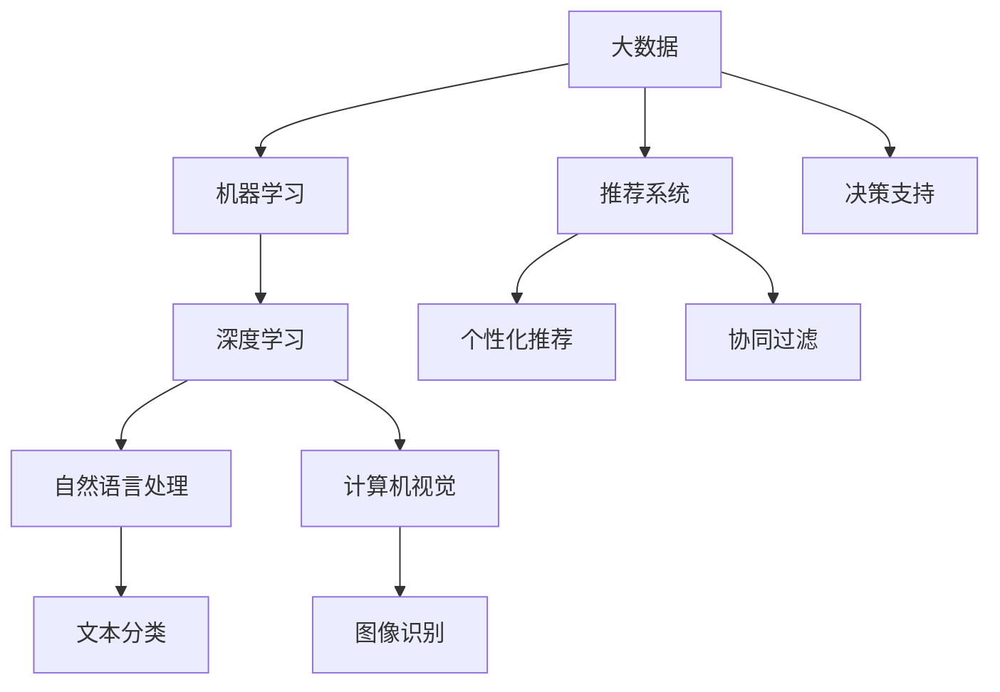
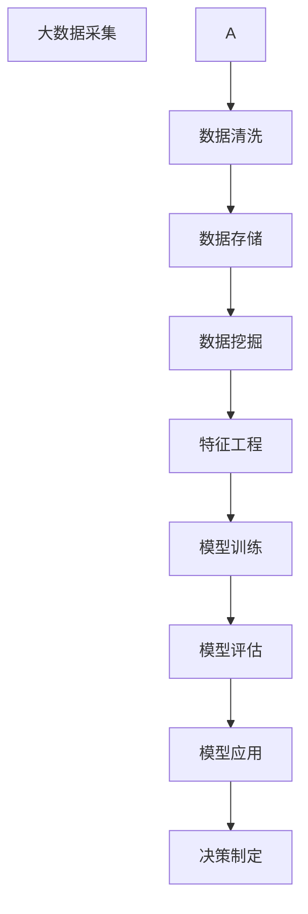

                 

## 1. 背景介绍

### 1.1 问题由来

自工业革命以来，全球经济经历了多次重要的转型和爆发期。从蒸汽机的发明到电气化的普及，再到信息时代的到来，每一次技术的突破都极大地推动了生产力的提升和经济的发展。今天，我们正处在人工智能和大数据时代的开端，技术的不断进步有望引领新一轮经济爆发期。

### 1.2 问题核心关键点

人工智能和大数据技术的主要特点包括：
- 大规模数据处理能力：通过高效的数据采集和处理，大幅降低决策成本，提高决策质量。
- 自适应学习和优化：通过机器学习和优化算法，能够快速适应变化的环境和需求。
- 广泛应用场景：从医疗、金融、教育到制造业，几乎所有行业都能找到人工智能和大数据的应用空间。
- 创新驱动增长：通过自动化和智能化，提升效率，降低成本，驱动经济增长。

当前，人工智能和大数据技术已经成为推动经济增长的重要引擎。然而，其背后的原理和应用场景尚未完全被大众所理解。本文旨在深入浅出地介绍这一领域的核心概念和应用，为读者提供全面的技术解析和实践指导。

### 1.3 问题研究意义

人工智能和大数据技术的发展对经济和社会产生了深远的影响，其重要性不言而喻：
- 提升生产效率：通过自动化和智能决策，大幅提升生产效率，降低成本。
- 创新驱动经济：引入新技术和新模式，推动产业升级，创造新的经济增长点。
- 改善社会治理：通过数据分析和预测，提升公共管理和服务水平，改善民生。
- 促进就业：虽然机器替代了部分工作，但也创造了新的职业机会，扩大了就业空间。
- 增强国家竞争力：掌握先进技术和数据，增强国家经济实力和国际影响力。

本文的研究有助于更好地理解人工智能和大数据技术如何影响经济和社会，同时为相关领域的研究人员和企业提供技术指导和应用思路。

## 2. 核心概念与联系

### 2.1 核心概念概述

在探讨人工智能和大数据技术时，我们首先需了解一些核心概念及其相互关系：
- **大数据**：指具有体量大、类型多、速度快、价值密度低等特点的数据集合。通过大数据技术，可以从海量数据中提取有价值的信息和知识。
- **人工智能**：利用机器学习、深度学习等技术，使机器具备人类智能的一部分能力，如感知、理解、学习、决策等。
- **机器学习**：指通过数据训练模型，使模型能够自动学习特征，进行预测和决策。
- **深度学习**：一种特殊的机器学习方法，通过多层次的神经网络，从数据中学习高层次的抽象表示。
- **自然语言处理**：研究如何让机器理解、处理和生成人类语言的技术。
- **计算机视觉**：研究如何让机器“看”懂图像和视频的技术。
- **推荐系统**：通过数据分析，为个性化推荐提供决策支持的技术。

这些概念之间相互联系，共同构成了人工智能和大数据技术的生态系统。

### 2.2 概念间的关系

我们通过一个简化的Mermaid流程图来展示这些核心概念之间的关系：



此流程图展示了核心概念之间的关系，其中：
- 大数据是基础，为机器学习提供数据支撑。
- 机器学习和深度学习是核心算法，帮助从数据中提取知识。
- 自然语言处理和计算机视觉分别处理文本和图像数据。
- 推荐系统基于机器学习算法，提供个性化推荐。
- 文本分类和图像识别是具体应用，属于自然语言处理和计算机视觉的范畴。
- 决策支持则是大数据和推荐系统的最终应用目标。

### 2.3 核心概念的整体架构

我们还通过一个更完整的Mermaid流程图来展示这些核心概念在大数据技术应用中的整体架构：



此流程图展示了从数据采集到最终决策制定的全流程，其中：
- 大数据采集是起点，获取数据源。
- 数据清洗是对原始数据进行处理，保证数据质量。
- 数据存储是将处理后的数据保存到数据库中。
- 数据挖掘是从数据中提取有用信息。
- 特征工程是对数据进行特征提取和处理，准备用于模型训练。
- 模型训练是通过机器学习算法训练模型，学习数据规律。
- 模型评估是评估模型的性能和稳定性。
- 模型应用是将训练好的模型用于实际决策中。
- 决策制定则是根据模型输出，进行最终决策。

## 3. 核心算法原理 & 具体操作步骤

### 3.1 算法原理概述

人工智能和大数据技术的核心算法主要包括：
- 监督学习：通过有标注数据训练模型，使其能够进行分类和预测。
- 无监督学习：通过无标注数据训练模型，使其能够发现数据的内在结构。
- 强化学习：通过奖励机制训练模型，使其能够做出最优决策。
- 深度学习：利用多层神经网络，从数据中学习高层次的抽象表示。
- 迁移学习：将预训练模型迁移到新任务上，提升模型性能。

这些算法通过不同的机制，从数据中提取有价值的信息，用于指导决策和优化过程。

### 3.2 算法步骤详解

以监督学习为例，其具体步骤如下：
1. **数据准备**：收集有标注数据集，将数据分为训练集、验证集和测试集。
2. **模型选择**：选择适合的机器学习算法，如线性回归、支持向量机、决策树等。
3. **模型训练**：在训练集上，使用优化算法（如梯度下降法）最小化损失函数，优化模型参数。
4. **模型评估**：在验证集上，使用性能指标（如准确率、召回率、F1值）评估模型效果。
5. **模型应用**：在测试集上，评估模型泛化能力，用于实际决策。

### 3.3 算法优缺点

监督学习的优点包括：
- 精度高：有标注数据提供了明确的指导，模型更容易学习到正确的规律。
- 可解释性强：有标注数据中的标签信息，使得模型决策过程更加透明。

监督学习的缺点包括：
- 数据标注成本高：标注数据需要大量人工参与，成本较高。
- 模型泛化能力有限：模型仅能在训练数据上表现良好，可能无法很好地泛化到新数据上。

### 3.4 算法应用领域

监督学习广泛应用在各个领域，包括：
- **金融风控**：通过分析历史交易数据，预测交易风险。
- **医疗诊断**：通过分析患者病历数据，预测疾病风险。
- **推荐系统**：通过分析用户行为数据，推荐商品和服务。
- **自然语言处理**：通过分析文本数据，进行文本分类、情感分析、机器翻译等任务。
- **图像识别**：通过分析图像数据，进行图像分类、物体检测等任务。

## 4. 数学模型和公式 & 详细讲解 & 举例说明

### 4.1 数学模型构建

监督学习的数学模型可以表示为：
$$
\theta = \arg\min_\theta \frac{1}{N}\sum_{i=1}^N l(y_i, f_\theta(x_i))
$$
其中，$y$ 表示标签，$x$ 表示输入数据，$f_\theta$ 表示模型参数为 $\theta$ 的函数，$l$ 表示损失函数。

### 4.2 公式推导过程

以线性回归为例，其基本公式为：
$$
y = \theta^T x + b
$$
其中，$y$ 表示预测结果，$\theta$ 表示模型参数，$x$ 表示输入特征，$b$ 表示截距。

### 4.3 案例分析与讲解

以房价预测为例，数据集包含多维特征，如面积、位置、年份等。通过监督学习模型，可以训练出预测房价的模型。

## 5. 项目实践：代码实例和详细解释说明

### 5.1 开发环境搭建

在实践项目时，首先需要搭建开发环境，可以使用Python和TensorFlow等工具。

```python
# 安装TensorFlow
!pip install tensorflow
```

### 5.2 源代码详细实现

以下是使用TensorFlow进行线性回归的示例代码：

```python
import tensorflow as tf
import numpy as np

# 定义数据集
x_train = np.array([[1.0], [2.0], [3.0], [4.0]])
y_train = np.array([2.0, 4.0, 6.0, 8.0])

# 定义模型
model = tf.keras.Sequential([
    tf.keras.layers.Dense(1, input_shape=[1])
])

# 编译模型
model.compile(optimizer=tf.keras.optimizers.SGD(learning_rate=0.01),
              loss='mse')

# 训练模型
model.fit(x_train, y_train, epochs=100, verbose=0)

# 预测
x_test = np.array([[5.0]])
y_pred = model.predict(x_test)
print(y_pred)
```

### 5.3 代码解读与分析

在上述代码中，我们首先定义了训练集和测试集。然后定义了一个简单的线性回归模型，编译并训练模型。最后使用模型进行预测。

## 6. 实际应用场景

### 6.1 金融风控

金融行业利用监督学习模型，分析交易数据，预测交易风险。通过早期识别风险交易，降低损失。

### 6.2 医疗诊断

医疗机构利用监督学习模型，分析患者病历，预测疾病风险。通过早期诊断，提高治疗效果，降低医疗成本。

### 6.3 推荐系统

电商网站利用监督学习模型，分析用户行为数据，推荐商品。通过个性化推荐，提高用户满意度，增加销售额。

### 6.4 未来应用展望

未来，人工智能和大数据技术将在更多领域得到应用，为经济社会发展带来新的机遇和挑战。以下是我们对未来应用的展望：
- **智能制造**：通过智能化改造，提升生产效率和产品质量。
- **智慧城市**：通过数据分析，优化城市管理，提升公共服务水平。
- **自动驾驶**：通过计算机视觉和自然语言处理技术，实现安全、高效的自动驾驶。
- **健康管理**：通过数据分析，进行个性化健康管理，提高生活质量。
- **环境保护**：通过数据分析，监测环境变化，制定环保措施。

## 7. 工具和资源推荐

### 7.1 学习资源推荐

以下是一些推荐的资源，供学习者参考：
- 《机器学习实战》：入门级机器学习书籍，通过实战案例讲解机器学习基础。
- 《深度学习》（Ian Goodfellow著）：深度学习领域的经典教材，系统讲解深度学习原理和应用。
- Coursera《机器学习》课程：由Andrew Ng讲授，深入浅出地讲解机器学习基础。
- Kaggle竞赛平台：提供大量数据集和挑战，通过实战提升技能。

### 7.2 开发工具推荐

以下是一些推荐的开发工具，供开发者使用：
- Jupyter Notebook：互动式编程环境，方便代码调试和可视化。
- GitHub：版本控制系统，方便代码协作和版本管理。
- PyCharm：Python IDE，提供强大的代码编辑器和调试工具。

### 7.3 相关论文推荐

以下是一些推荐的论文，供研究者参考：
- Hinton, G. E., Osindero, S., & Teh, Y. W. (2006). Reducing the Dimensionality of Data with Neural Networks. Science, 313(5786), 504-507.
- Bengio, Y., Ducharme, R., & Vincent, P. (2003). A Neural Probabilistic Language Model. Journal of Machine Learning Research, 3, 1137-1155.
- LeCun, Y., Bottou, L., Bengio, Y., & Haffner, P. (1998). Gradient-Based Learning Applied to Document Recognition. Proceedings of the IEEE, 86(11), 2278-2324.

## 8. 总结：未来发展趋势与挑战

### 8.1 研究成果总结

人工智能和大数据技术在过去几十年里取得了显著的进展，主要研究内容包括：
- 机器学习算法的发展和优化。
- 深度学习模型的设计和应用。
- 大数据处理技术的进步和优化。
- 自然语言处理和计算机视觉技术的发展。

这些研究不仅在学术界得到了广泛关注，也在工业界得到了广泛应用。

### 8.2 未来发展趋势

未来，人工智能和大数据技术的发展趋势包括：
- **自动化和智能化**：通过机器学习和优化算法，实现自动化决策。
- **多模态融合**：将不同模态的数据进行融合，提升决策的全面性和准确性。
- **联邦学习**：在分布式环境中，进行模型训练和优化，保护数据隐私。
- **强化学习**：通过奖励机制训练模型，实现最优决策。
- **自适应学习**：通过在线学习，实时更新模型，适应环境变化。

### 8.3 面临的挑战

人工智能和大数据技术在快速发展的同时，也面临着一些挑战：
- **数据隐私和安全**：大规模数据处理可能涉及隐私和数据安全问题，需要采取有效措施。
- **计算资源限制**：模型训练和推理需要大量的计算资源，需要优化算法和硬件。
- **模型解释性**：机器学习模型往往是“黑盒”系统，难以解释其决策过程，需要提高模型的可解释性。
- **伦理和社会影响**：人工智能和大数据技术的应用可能带来伦理和社会问题，需要制定相应的规范和标准。

### 8.4 研究展望

未来，需要在以下方面进行深入研究：
- **隐私保护技术**：研发隐私保护算法，保护用户数据隐私。
- **高效计算技术**：优化计算算法和硬件，提高计算效率。
- **模型解释性**：研发可解释的机器学习模型，提高决策透明度。
- **伦理和社会影响**：制定伦理和社会影响评估标准，确保技术应用的正向影响。

总之，人工智能和大数据技术将为经济社会发展带来新的机遇和挑战。通过不断创新和优化，这些技术将为人类带来更多福祉。

## 9. 附录：常见问题与解答

**Q1：什么是人工智能？**

A: 人工智能是研究如何让机器具备人类智能能力，包括感知、理解、学习、决策等。

**Q2：人工智能和大数据技术如何影响经济和社会？**

A: 通过自动化和智能化，提升生产效率和决策质量，降低成本，推动经济增长。同时，提高公共管理和服务水平，改善民生。

**Q3：人工智能和大数据技术面临哪些挑战？**

A: 数据隐私和安全、计算资源限制、模型解释性、伦理和社会影响等。

**Q4：人工智能和大数据技术的未来发展趋势是什么？**

A: 自动化和智能化、多模态融合、联邦学习、强化学习、自适应学习等。

**Q5：如何使用TensorFlow进行线性回归？**

A: 定义数据集，定义模型，编译模型，训练模型，预测。具体实现请参考本文代码示例。

---

作者：禅与计算机程序设计艺术 / Zen and the Art of Computer Programming

