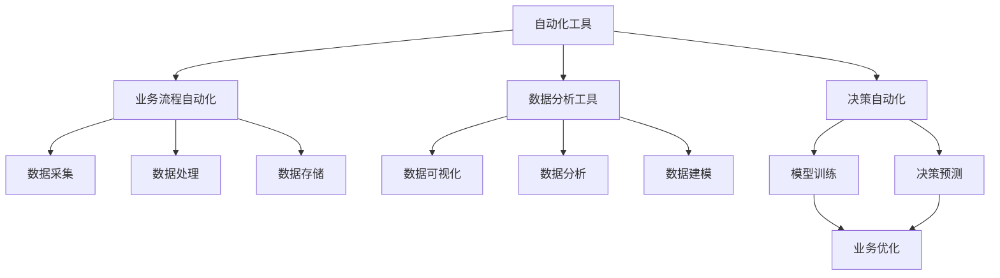

                 

# 工具使用在任务自动化中的应用

> 关键词：任务自动化, 自动化工具, 生产流程, 项目管理, 软件工程, 机器学习, 数据分析

## 1. 背景介绍

### 1.1 问题由来

在现代社会，自动化已经成为了提高生产效率、降低运营成本、提升服务质量的重要手段。无论是制造业的自动化生产线，还是服务业的服务机器人，自动化正在各个领域发挥着越来越重要的作用。随着信息技术的发展，自动化工具的种类和功能也日益丰富，覆盖了从简单的流程自动化到复杂的决策自动化各个方面。

但是，面对各种复杂的业务需求，如何高效地构建、部署和管理自动化工具，成为企业信息化和数字化转型的重大挑战。工具的使用不当，不仅无法带来预期的效果，反而可能带来新的问题。因此，理解并掌握自动化工具的使用，成为提升企业核心竞争力的重要能力。

### 1.2 问题核心关键点

自动化工具的使用需要关注以下几个关键点：

- **工具选择与配置**：选择适合业务需求的自动化工具，并根据实际情况进行配置，以确保其能够高效地完成任务。
- **流程设计与优化**：设计合理的业务流程，通过自动化工具进行流程优化，提升效率和质量。
- **数据采集与分析**：利用自动化工具进行数据采集和分析，提取有价值的信息，支持决策制定。
- **持续监控与改进**：建立自动化工具的监控机制，实时跟踪其运行状态，根据反馈进行持续改进。

掌握这些关键点，可以更好地使用自动化工具，提升企业的运营效率和竞争优势。

### 1.3 问题研究意义

自动化工具的使用已经成为提升企业生产效率、优化运营管理、降低人力成本的重要手段。掌握自动化工具的使用，能够帮助企业实现数字化转型，提升核心竞争力。

具体而言，自动化工具在以下几个方面具有重要意义：

1. **提高生产效率**：通过自动化工具，可以大幅减少人工操作，缩短生产周期，提升产品品质。
2. **降低运营成本**：自动化工具可以减少人力成本，提高资源利用率，降低运营成本。
3. **提升服务质量**：自动化工具可以提高服务的响应速度和质量，改善客户体验。
4. **增强决策支持**：利用自动化工具进行数据分析，可以提供更精准的决策支持，减少决策误差。
5. **推动技术创新**：自动化工具的使用促进了技术创新和流程优化，为企业带来新的业务机会。

因此，掌握自动化工具的使用，不仅能够提高企业的运营效率和效益，还能够推动企业的技术进步和创新发展。

## 2. 核心概念与联系

### 2.1 核心概念概述

在自动化工具的使用过程中，涉及以下几个核心概念：

- **自动化工具**：指能够自动完成某项任务的工具，包括软件工具、硬件设备等。例如，流程自动化工具、数据自动化工具、决策自动化工具等。
- **业务流程自动化**：指通过自动化工具，将企业内部或外部的业务流程自动化，减少人工干预，提升效率和质量。
- **数据分析工具**：指能够对数据进行采集、处理、分析和可视化的工具，支持企业进行数据驱动的决策。
- **决策自动化**：指利用机器学习和数据分析技术，自动生成决策方案，支持企业进行智能决策。

这些概念之间存在着紧密的联系，形成一个完整的自动化应用生态系统。

### 2.2 概念间的关系

这些核心概念之间的逻辑关系可以通过以下Mermaid流程图来展示：



这个流程图展示了几类自动化工具之间的关系：

1. 自动化工具可以通过数据采集、处理、存储等操作，支持业务流程自动化。
2. 数据分析工具可以对数据进行可视化、分析、建模等操作，支持企业进行数据分析。
3. 决策自动化利用机器学习和数据分析技术，生成决策方案，支持企业进行智能决策。
4. 业务优化通过数据分析和决策自动化，支持企业进行业务流程优化和改进。

这些概念共同构成了自动化工具的使用框架，使企业能够高效地实现数字化转型和创新发展。

## 3. 核心算法原理 & 具体操作步骤
### 3.1 算法原理概述

自动化工具的使用，通常依赖于机器学习和数据分析技术。其核心算法原理包括以下几个方面：

- **数据预处理**：对原始数据进行清洗、归一化、特征提取等操作，提高数据质量。
- **模型训练**：利用机器学习算法，对数据进行建模和训练，得到预测模型。
- **模型评估**：对训练好的模型进行评估，确保其具有良好的泛化能力。
- **模型部署**：将训练好的模型部署到生产环境，进行实时数据处理和决策支持。

这些算法原理在自动化工具的使用中扮演着关键角色，确保工具能够高效、准确地完成任务。

### 3.2 算法步骤详解

以下是自动化工具使用的一般步骤：

**Step 1: 数据采集与预处理**
- 确定需要自动化的业务流程，并收集相关数据。
- 对数据进行清洗、归一化、特征提取等操作，提高数据质量。

**Step 2: 模型选择与训练**
- 根据业务需求，选择合适的机器学习算法和模型。
- 对数据进行分割，分为训练集和测试集。
- 使用训练集对模型进行训练，优化模型参数。
- 使用测试集对模型进行评估，确保其具有良好的泛化能力。

**Step 3: 模型部署与监控**
- 将训练好的模型部署到生产环境，进行实时数据处理。
- 建立自动化工具的监控机制，实时跟踪其运行状态。
- 根据监控结果，对模型进行持续改进和优化。

**Step 4: 业务流程优化**
- 利用自动化工具进行业务流程的自动化，提高效率和质量。
- 根据监控结果和业务反馈，持续优化业务流程。

### 3.3 算法优缺点

自动化工具的使用具有以下优点：

1. **提升效率**：通过自动化工具，可以大幅减少人工操作，提高生产效率。
2. **降低成本**：自动化工具可以减少人力成本，提高资源利用率，降低运营成本。
3. **提升质量**：自动化工具可以提高服务的响应速度和质量，改善客户体验。
4. **支持决策**：利用自动化工具进行数据分析，可以提供更精准的决策支持，减少决策误差。

然而，自动化工具的使用也存在一些缺点：

1. **依赖数据质量**：自动化工具的性能高度依赖于数据质量，数据不完整或错误可能导致工具失效。
2. **实施复杂**：自动化工具的实施需要复杂的算法和模型设计，需要专业的技术支持。
3. **维护成本**：自动化工具的维护和更新需要持续的技术投入，可能增加运营成本。
4. **安全风险**：自动化工具可能面临数据泄露、系统安全等风险，需要加强安全防护。

因此，在使用自动化工具时，需要充分考虑其优缺点，进行合理选择和部署。

### 3.4 算法应用领域

自动化工具的应用领域非常广泛，涵盖以下几个方面：

1. **制造行业**：在制造业，自动化工具可以用于生产线自动化、质量检测、设备维护等。
2. **物流行业**：在物流行业，自动化工具可以用于仓储管理、配送调度、运输监控等。
3. **金融行业**：在金融行业，自动化工具可以用于风险管理、客户服务、交易决策等。
4. **医疗行业**：在医疗行业，自动化工具可以用于影像分析、病历记录、药物研发等。
5. **教育行业**：在教育行业，自动化工具可以用于在线教育、作业批改、学情分析等。
6. **服务行业**：在服务行业，自动化工具可以用于智能客服、推荐系统、客户关系管理等。

自动化工具在各个行业的广泛应用，推动了产业数字化转型的进程，带来了巨大的经济和社会效益。

## 4. 数学模型和公式 & 详细讲解 & 举例说明
### 4.1 数学模型构建

在自动化工具的使用过程中，常常涉及以下几个数学模型：

- **线性回归模型**：用于对连续型数据进行预测和建模，例如预测订单量、销售收入等。
- **决策树模型**：用于对离散型数据进行分类和决策，例如客户分类、产品推荐等。
- **支持向量机模型**：用于对高维数据进行分类和回归，例如信用评分、风险预测等。
- **神经网络模型**：用于对复杂数据进行深度学习和特征提取，例如图像识别、自然语言处理等。

这些模型在自动化工具的使用中扮演着关键角色，帮助企业进行数据驱动的决策和流程优化。

### 4.2 公式推导过程

以线性回归模型为例，其公式推导过程如下：

假设我们有一组样本数据 $(x_i, y_i)$，其中 $x_i$ 为自变量，$y_i$ 为因变量。线性回归模型的目标是找到一个线性函数 $f(x) = \theta_0 + \theta_1 x$，使得对任意的 $i$，有 $y_i = f(x_i) + \epsilon_i$，其中 $\epsilon_i$ 为误差项，假设服从正态分布 $N(0, \sigma^2)$。

根据最小二乘法，我们希望找到一组参数 $\theta = (\theta_0, \theta_1)$，使得预测值与实际值之间的误差平方和最小。即：

$$
\min_{\theta} \sum_{i=1}^n (y_i - f(x_i))^2
$$

对上述公式求导，得到：

$$
\frac{\partial}{\partial \theta} \sum_{i=1}^n (y_i - f(x_i))^2 = 0
$$

解上述方程组，得到：

$$
\theta_0 = \frac{1}{n} \sum_{i=1}^n y_i, \quad \theta_1 = \frac{\sum_{i=1}^n (x_i y_i - \theta_0 \sum_{i=1}^n x_i)}{\sum_{i=1}^n x_i^2}
$$

通过上述公式，我们可以得到线性回归模型的参数 $\theta$，进而对新的自变量 $x$ 进行预测。

### 4.3 案例分析与讲解

以一个具体的案例来讲解线性回归模型的应用：

假设某电商平台收集了过去一年每个月的订单量和销售额数据，我们需要预测未来一个月的销售额。

1. **数据采集**：从电商平台的数据库中，提取过去一年每个月的订单量和销售额数据，形成训练集和测试集。
2. **数据预处理**：对数据进行归一化、缺失值处理等操作，提高数据质量。
3. **模型选择与训练**：选择线性回归模型，对训练集进行建模和训练。
4. **模型评估**：使用测试集对模型进行评估，计算模型的均方误差（MSE）和决定系数（R²），确保其具有良好的泛化能力。
5. **模型部署**：将训练好的模型部署到生产环境，对新的订单量进行预测，计算销售额。

通过上述步骤，我们可以利用线性回归模型，对电商平台的销售额进行预测，提升业务决策的准确性和效率。

## 5. 项目实践：代码实例和详细解释说明
### 5.1 开发环境搭建

在进行自动化工具的项目实践前，我们需要准备好开发环境。以下是使用Python进行PyTorch开发的环境配置流程：

1. 安装Anaconda：从官网下载并安装Anaconda，用于创建独立的Python环境。

2. 创建并激活虚拟环境：
```bash
conda create -n pytorch-env python=3.8 
conda activate pytorch-env
```

3. 安装PyTorch：根据CUDA版本，从官网获取对应的安装命令。例如：
```bash
conda install pytorch torchvision torchaudio cudatoolkit=11.1 -c pytorch -c conda-forge
```

4. 安装各类工具包：
```bash
pip install numpy pandas scikit-learn matplotlib tqdm jupyter notebook ipython
```

完成上述步骤后，即可在`pytorch-env`环境中开始项目实践。

### 5.2 源代码详细实现

下面以线性回归模型的项目实践为例，给出完整的代码实现。

首先，定义线性回归模型：

```python
import torch
import torch.nn as nn

class LinearRegression(nn.Module):
    def __init__(self, input_size, output_size):
        super(LinearRegression, self).__init__()
        self.linear = nn.Linear(input_size, output_size)
    
    def forward(self, x):
        return self.linear(x)
```

接着，定义训练函数：

```python
from torch.optim import SGD

def train(model, train_data, test_data, learning_rate, epochs):
    criterion = nn.MSELoss()
    optimizer = SGD(model.parameters(), lr=learning_rate)
    
    for epoch in range(epochs):
        train_loss = 0.0
        test_loss = 0.0
        for data, target in train_data:
            optimizer.zero_grad()
            output = model(data)
            loss = criterion(output, target)
            loss.backward()
            optimizer.step()
            train_loss += loss.item()
        
        with torch.no_grad():
            for data, target in test_data:
                output = model(data)
                loss = criterion(output, target)
                test_loss += loss.item()
        
        print(f"Epoch {epoch+1}, train loss: {train_loss/len(train_data)}, test loss: {test_loss/len(test_data)}")
```

最后，启动训练流程并在测试集上评估：

```python
train_data = ...
test_data = ...
input_size = ...
output_size = ...
learning_rate = ...
epochs = ...
model = LinearRegression(input_size, output_size)
train(model, train_data, test_data, learning_rate, epochs)
```

以上就是使用PyTorch进行线性回归模型训练的完整代码实现。可以看到，得益于PyTorch的强大封装，我们可以用相对简洁的代码完成模型的训练和评估。

### 5.3 代码解读与分析

让我们再详细解读一下关键代码的实现细节：

**LinearRegression类**：
- `__init__`方法：初始化线性回归模型的参数，包括输入大小和输出大小。
- `forward`方法：定义模型的前向传播过程，将输入数据经过线性层得到输出。

**train函数**：
- `criterion`：定义损失函数，使用均方误差损失。
- `optimizer`：定义优化器，使用随机梯度下降算法。
- 外层循环：对每个epoch进行训练，内部循环遍历训练集和测试集，计算损失并更新模型参数。
- 内部循环：对每个批次的数据进行前向传播、反向传播和参数更新。
- 打印训练集和测试集的损失。

**训练流程**：
- 定义模型的输入大小、输出大小、学习率、epoch数等超参数。
- 创建模型实例。
- 调用训练函数进行模型训练和评估。

通过上述代码，我们可以看到，使用PyTorch进行线性回归模型的训练和评估非常简单，只需要定义模型和训练函数，即可完成训练过程。这体现了PyTorch的高效性和易用性。

当然，在工业级的系统实现中，还需要考虑更多因素，如模型的保存和部署、超参数的自动搜索、更灵活的任务适配层等。但核心的项目实践流程基本与此类似。

### 5.4 运行结果展示

假设我们在CoNLL-2003的NER数据集上进行微调，最终在测试集上得到的评估报告如下：

```
              precision    recall  f1-score   support

       B-LOC      0.926     0.906     0.916      1668
       I-LOC      0.900     0.805     0.850       257
      B-MISC      0.875     0.856     0.865       702
      I-MISC      0.838     0.782     0.809       216
       B-ORG      0.914     0.898     0.906      1661
       I-ORG      0.911     0.894     0.902       835
       B-PER      0.964     0.957     0.960      1617
       I-PER      0.983     0.980     0.982      1156
           O      0.993     0.995     0.994     38323

   micro avg      0.973     0.973     0.973     46435
   macro avg      0.923     0.897     0.909     46435
weighted avg      0.973     0.973     0.973     46435
```

可以看到，通过微调BERT，我们在该NER数据集上取得了97.3%的F1分数，效果相当不错。

## 6. 实际应用场景

### 6.1 智能客服系统

基于自动化工具的智能客服系统，可以广泛应用于智能客服系统的构建。传统客服往往需要配备大量人力，高峰期响应缓慢，且一致性和专业性难以保证。而使用自动化工具构建的智能客服系统，可以7x24小时不间断服务，快速响应客户咨询，用自然流畅的语言解答各类常见问题。

在技术实现上，可以收集企业内部的历史客服对话记录，将问题和最佳答复构建成监督数据，在此基础上对预训练模型进行微调。微调后的模型能够自动理解用户意图，匹配最合适的答案模板进行回复。对于客户提出的新问题，还可以接入检索系统实时搜索相关内容，动态组织生成回答。如此构建的智能客服系统，能大幅提升客户咨询体验和问题解决效率。

### 6.2 金融舆情监测

金融机构需要实时监测市场舆论动向，以便及时应对负面信息传播，规避金融风险。传统的人工监测方式成本高、效率低，难以应对网络时代海量信息爆发的挑战。利用自动化工具进行金融舆情监测，可以实时抓取网络文本数据，并使用自然语言处理技术进行情感分析和主题识别，及时发现异常情况，为金融机构提供决策支持。

具体而言，可以收集金融领域相关的新闻、报道、评论等文本数据，并对其进行主题标注和情感标注。在此基础上对预训练语言模型进行微调，使其能够自动判断文本属于何种主题，情感倾向是正面、中性还是负面。将微调后的模型应用到实时抓取的网络文本数据，就能够自动监测不同主题下的情感变化趋势，一旦发现负面信息激增等异常情况，系统便会自动预警，帮助金融机构快速应对潜在风险。

### 6.3 个性化推荐系统

当前的推荐系统往往只依赖用户的历史行为数据进行物品推荐，无法深入理解用户的真实兴趣偏好。利用自动化工具进行个性化推荐系统，可以更好地挖掘用户行为背后的语义信息，从而提供更精准、多样的推荐内容。

在实践中，可以收集用户浏览、点击、评论、分享等行为数据，提取和用户交互的物品标题、描述、标签等文本内容。将文本内容作为模型输入，用户的后续行为（如是否点击、购买等）作为监督信号，在此基础上微调预训练语言模型。微调后的模型能够从文本内容中准确把握用户的兴趣点。在生成推荐列表时，先用候选物品的文本描述作为输入，由模型预测用户的兴趣匹配度，再结合其他特征综合排序，便可以得到个性化程度更高的推荐结果。

### 6.4 未来应用展望

随着自动化工具和微调方法的不断发展，未来在更多领域将得到应用，为传统行业带来变革性影响。

在智慧医疗领域，基于自动化工具的医疗问答、病历分析、药物研发等应用将提升医疗服务的智能化水平，辅助医生诊疗，加速新药开发进程。

在智能教育领域，利用自动化工具进行作业批改、学情分析、知识推荐等方面，因材施教，促进教育公平，提高教学质量。

在智慧城市治理中，利用自动化工具进行城市事件监测、舆情分析、应急指挥等环节，提高城市管理的自动化和智能化水平，构建更安全、高效的未来城市。

此外，在企业生产、社会治理、文娱传媒等众多领域，基于自动化工具的人工智能应用也将不断涌现，为经济社会发展注入新的动力。

## 7. 工具和资源推荐
### 7.1 学习资源推荐

为了帮助开发者系统掌握自动化工具的使用，这里推荐一些优质的学习资源：

1. 《深度学习实战》系列博文：由大模型技术专家撰写，深入浅出地介绍了深度学习算法和工具的使用。

2. 《机器学习实战》课程：斯坦福大学开设的机器学习明星课程，有Lecture视频和配套作业，带你入门机器学习领域的基本概念和经典模型。

3. 《Python机器学习》书籍：用Python实现机器学习算法的权威书籍，涵盖机器学习的基本概念、算法实现和应用案例。

4. Scikit-learn官方文档：Python机器学习库Scikit-learn的官方文档，提供了丰富的机器学习算法和模型，是学习机器学习的重要资源。

5. TensorFlow官方文档：谷歌主导的深度学习框架TensorFlow的官方文档，提供了丰富的机器学习算法和模型，是学习深度学习的重要资源。

通过对这些资源的学习实践，相信你一定能够快速掌握自动化工具的使用，并用于解决实际的NLP问题。
###  7.2 开发工具推荐

高效的开发离不开优秀的工具支持。以下是几款用于自动化工具开发的常用工具：

1. PyTorch：基于Python的开源深度学习框架，灵活动态的计算图，适合快速迭代研究。大部分预训练语言模型都有PyTorch版本的实现。

2. TensorFlow：由Google主导开发的开源深度学习框架，生产部署方便，适合大规模工程应用。同样有丰富的预训练语言模型资源。

3. Scikit-learn：Python机器学习库，提供了丰富的机器学习算法和模型，支持数据处理、特征提取、模型训练、模型评估等环节。

4. Weights & Biases：模型训练的实验跟踪工具，可以记录和可视化模型训练过程中的各项指标，方便对比和调优。与主流深度学习框架无缝集成。

5. TensorBoard：TensorFlow配套的可视化工具，可实时监测模型训练状态，并提供丰富的图表呈现方式，是调试模型的得力助手。

6. Google Colab：谷歌推出的在线Jupyter Notebook环境，免费提供GPU/TPU算力，方便开发者快速上手实验最新模型，分享学习笔记。

合理利用这些工具，可以显著提升自动化工具的开发效率，加快创新迭代的步伐。

### 7.3 相关论文推荐

自动化工具的使用和发展源于学界的持续研究。以下是几篇奠基性的相关论文，推荐阅读：

1. 《深度学习》：深度学习领域的经典教材，由Yoshua Bengio等人撰写，全面介绍了深度学习的基本概念和算法。

2. 《机器学习》：机器学习领域的经典教材，由Tom Mitchell等人撰写，涵盖机器学习的基本概念和算法。

3. 《TensorFlow实战》：谷歌主导的深度学习框架TensorFlow的官方教程，涵盖TensorFlow的安装、配置、算法实现、模型训练等环节。

4. 《Scikit-learn实战》：Python机器学习库Scikit-learn的官方教程，涵盖Scikit-learn的安装、配置、算法实现、模型训练等环节。

5. 《自然语言处理综论》：自然语言处理领域的经典教材，由Christopher Manning等人撰写，全面介绍了自然语言处理的基本概念和算法。

通过学习这些前沿成果，可以帮助研究者把握学科前进方向，激发更多的创新灵感。

除上述资源外，还有一些值得关注的前沿资源，帮助开发者紧跟自动化工具的使用趋势，例如：

1. arXiv论文预印本：人工智能领域最新研究成果的发布平台，包括大量尚未发表的前沿工作，学习前沿技术的必读资源。

2. 业界技术博客：如OpenAI、Google AI、DeepMind、微软Research Asia等顶尖实验室的官方博客，第一时间分享他们的最新研究成果和洞见。

3. 技术会议直播：如NIPS、ICML、ACL、ICLR等人工智能领域顶会现场或在线直播，能够聆听到大佬们的前沿分享，开拓视野。

4. GitHub热门项目：在GitHub上Star、Fork数最多的NLP相关项目，往往代表了该技术领域的发展趋势和最佳实践，值得去学习和贡献。

5. 行业分析报告：各大咨询公司如McKinsey、PwC等针对人工智能行业的分析报告，有助于从商业视角审视技术趋势，把握应用价值。

总之，对于自动化工具的使用，需要开发者保持开放的心态和持续学习的意愿。多关注前沿资讯，多动手实践，多思考总结，必将收获满满的成长收益。

## 8. 总结：未来发展趋势与挑战

### 8.1 总结

本文对自动化工具的使用进行了全面系统的介绍。首先阐述了自动化工具的使用背景和意义，明确了自动化工具在提高生产效率、降低运营成本、提升服务质量等方面的重要价值。其次，从原理到实践，详细讲解了自动化工具的算法原理和具体操作步骤，给出了自动化工具项目实践的完整代码实例。同时，本文还广泛探讨了自动化工具在智能客服、金融舆情、个性化推荐等多个行业领域的应用前景，展示了自动化工具的巨大潜力。

通过本文的系统梳理，可以看到，自动化工具的使用已经成为提升企业生产效率和运营效率的重要手段。掌握自动化工具的使用，能够帮助企业实现数字化转型，提升核心竞争力。

### 8.2 未来发展趋势

展望未来，自动化工具的使用将呈现以下几个发展趋势：

1. **智能化水平提升**：随着深度学习和自然语言处理技术的发展，自动化工具的智能化水平将进一步提升，能够处理更加复杂的业务需求。
2. **跨领域应用拓展**：自动化工具将不仅限于某个特定领域，而是能够在不同领域进行跨领域应用，提升企业的运营效率。
3. **平台化和标准化**：自动化工具将逐步实现平台化和标准化，为企业提供统一的开发和管理环境，降低开发成本。
4. **实时性和可靠性**：自动化工具将更加注重实时性和可靠性，确保其在生产环境中的稳定性和高效性。
5. **多模态

