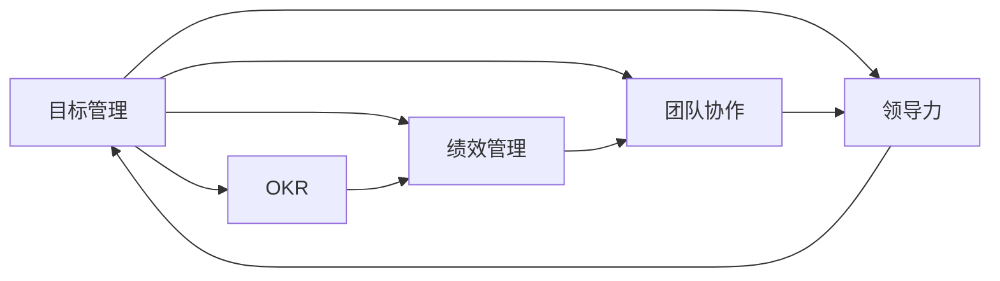

                 

# 巴菲特目标管理法則在项目管理中的应用

> 关键词：巴菲特,目标管理,项目管理,OKR,绩效管理,团队协作,领导力,结果导向,执行力

## 1. 背景介绍

### 1.1 问题由来

在当今快节奏、高竞争的商业环境中，项目管理的效率和效果直接影响企业的战略执行力和市场竞争力。传统的项目管理方式如甘特图、里程碑等，虽然能提供一定的时间计划和进度监控，但在复杂多变的商业环境下，往往难以满足动态调整和快速响应需求。为了应对这一挑战，许多企业引入了一种更灵活、更结果导向的项目管理方法——目标管理法（Goal Management），并在实践中取得了显著成效。

### 1.2 问题核心关键点

目标管理法是一种强调结果导向和团队协作的项目管理方法。其核心思想是通过设定明确、可衡量的目标，激发团队成员的积极性，确保项目顺利完成。该方法主要通过设定目标、分解目标、跟踪进度、反馈调整等步骤，实现对项目的全面监控和高效管理。

在实际应用中，目标管理法通常结合OKR（Objectives and Key Results）框架，以更清晰、更系统的方式进行目标设定和进度跟踪。OKR框架将目标细化为具体的关键结果（Key Results），通过可量化的指标（如完成时间、成本、质量等），确保目标的可实现性和可衡量性。

## 2. 核心概念与联系

### 2.1 核心概念概述

为了更好地理解目标管理法，本节将介绍几个关键概念：

- **目标管理（Goal Management）**：一种通过设定明确、可衡量的目标，激发团队积极性，实现项目高效管理的方法。
- **OKR（Objectives and Key Results）**：一种目标设定和管理框架，将目标细化为具体的关键结果，通过可量化的指标确保目标的可实现性和可衡量性。
- **绩效管理（Performance Management）**：通过设定和评估绩效目标，持续改进员工表现和团队协作的管理方法。
- **团队协作（Team Collaboration）**：强调团队成员间的沟通、协调和合作，确保项目顺利推进。
- **领导力（Leadership）**：领导者通过明确目标、激励团队、调整策略等手段，确保项目成功完成。

这些概念共同构成了目标管理法的核心框架，帮助企业在复杂多变的商业环境中，实现项目的灵活调整和高效管理。

### 2.2 概念间的关系

这些核心概念之间存在紧密的联系，形成了一个相互支持、相互影响的目标管理生态系统。下面我们通过几个Mermaid流程图来展示这些概念之间的关系：



这个流程图展示了大语言模型微调过程中各个核心概念的关系：

1. 目标管理是整个管理法的核心，通过设定和评估目标，确保项目方向和成果。
2. OKR是目标管理的重要组成部分，将目标细化为具体的关键结果，确保目标可衡量和可实现。
3. 绩效管理通过对目标的评估和反馈，持续改进员工表现和团队协作。
4. 团队协作强调团队成员间的沟通和合作，确保项目顺利推进。
5. 领导力通过明确目标、激励团队、调整策略，确保项目成功完成。

## 3. 核心算法原理 & 具体操作步骤

### 3.1 算法原理概述

目标管理法的基本原理是通过设定明确、可衡量的目标，激发团队成员的积极性，确保项目顺利完成。其核心在于将目标细化为具体的关键结果，通过定期评估和反馈，持续改进团队表现和项目进度。

形式化地，假设目标为 $G$，关键结果为 $KR$，则目标管理法的基本流程可以表示为：

$$
G \rightarrow KR \rightarrow M \rightarrow A \rightarrow F
$$

其中 $M$ 表示监控和反馈，$A$ 表示调整策略，$F$ 表示最终结果。

### 3.2 算法步骤详解

目标管理法的具体操作步骤可以分为以下五个步骤：

**Step 1: 设定目标（Goal Setting）**

- 通过会议、邮件等方式，与团队成员讨论确定项目的主要目标。
- 目标应具有SMART原则（Specific, Measurable, Achievable, Relevant, Time-bound），即具体、可衡量、可实现、相关和有时间限制。
- 将目标细化为具体的关键结果，每个关键结果应明确可量化的指标和完成时间。

**Step 2: 分解目标（Goal Decomposition）**

- 将主要目标分解为具体的任务和子目标，分配给团队成员。
- 确保每个任务都有明确的责任人、完成时间和可衡量的指标。
- 使用甘特图、看板等工具，可视化任务进度和依赖关系。

**Step 3: 监控进度（Goal Monitoring）**

- 定期检查项目进展，使用OKR框架进行目标和关键结果的评估。
- 使用任务跟踪工具（如Jira、Trello等）记录任务状态和完成情况。
- 召开周期性会议，讨论进展和问题，调整项目计划。

**Step 4: 反馈调整（Goal Adjustment）**

- 根据监控结果，及时识别问题和风险，进行相应的调整和优化。
- 与团队成员进行沟通和协调，确保任务顺利推进。
- 定期进行绩效评估，根据表现调整团队成员的职责和任务。

**Step 5: 最终结果（Goal Evaluation）**

- 项目完成后，对目标和关键结果进行最终评估，检查是否达成预期。
- 进行项目复盘，总结成功经验和改进建议，为未来项目提供参考。

### 3.3 算法优缺点

目标管理法在实际应用中，具有以下优点：

- **结果导向**：通过设定明确的目标，确保项目方向和成果。
- **灵活性**：可根据项目进展和变化，灵活调整目标和策略。
- **团队协作**：强调团队成员间的沟通和合作，确保项目顺利推进。

同时，该方法也存在一些局限性：

- **依赖领导力**：目标设定和策略调整需要强有力的领导力和沟通能力。
- **高执行成本**：需要定期召开会议、进行绩效评估等，增加管理成本。
- **对团队成员要求高**：需要团队成员具备高自主性和自驱力，才能有效执行目标。

### 3.4 算法应用领域

目标管理法在项目管理中的应用非常广泛，适用于各种类型的项目，包括但不限于：

- **软件开发**：通过设定里程碑和关键指标，监控软件开发进度和质量。
- **市场营销**：设定市场推广目标和关键结果，评估市场活动的效果和ROI。
- **运营管理**：设定运营指标和关键结果，监控生产效率和成本控制。
- **产品研发**：设定产品开发目标和关键结果，评估产品功能和用户反馈。

此外，目标管理法还被广泛应用于企业战略规划、人力资源管理、客户关系管理等多个领域，帮助企业实现全面高效的管理。

## 4. 数学模型和公式 & 详细讲解 & 举例说明

### 4.1 数学模型构建

为了更好地理解目标管理法的数学模型，我们假设项目的目标为 $G$，关键结果为 $KR$，则目标管理法的基本模型可以表示为：

$$
G \rightarrow KR \rightarrow M \rightarrow A \rightarrow F
$$

其中 $G$ 表示项目目标，$KR$ 表示关键结果，$M$ 表示监控和反馈，$A$ 表示调整策略，$F$ 表示最终结果。

### 4.2 公式推导过程

以软件开发项目为例，我们可以将目标和关键结果表示为数学公式：

- **目标设定**：假设项目目标为 $G$，表示在规定时间内完成某个功能的开发，即 $G = \text{完成时间} \times \text{开发质量}$。
- **关键结果分解**：将项目目标分解为多个关键结果 $KR_i = \text{任务完成度} \times \text{代码质量}$，$i=1,2,...,n$。
- **监控和反馈**：通过周期性评估，记录每个关键结果的完成度，即 $M = \{KR_{i,j}\}_{i=1,j=1}^{n,N}$，$j$ 表示评估周期。
- **调整策略**：根据监控结果，识别出问题和风险，调整开发策略，即 $A = f(M)$。
- **最终结果**：评估最终项目成果，即 $F = G \times \text{用户满意度}$。

### 4.3 案例分析与讲解

假设我们正在进行一个电子商务平台的开发项目，目标是于2022年6月1日前完成系统上线，用户满意度达到90%以上。项目的主要目标是提高平台的性能和用户体验。

**目标设定**：设定项目目标 $G = \text{完成时间} \times \text{开发质量}$。

**关键结果分解**：将目标分解为多个关键结果，如性能测试结果、用户体验调查、安全漏洞检查等。

**监控和反馈**：定期进行性能测试、用户调查和安全检查，记录每个关键结果的完成度，即 $M = \{KR_{i,j}\}_{i=1,j=1}^{n,N}$。

**调整策略**：根据监控结果，识别出性能瓶颈、用户体验问题和安全漏洞，进行相应的调整和优化，即 $A = f(M)$。

**最终结果**：评估最终项目成果，即 $F = G \times \text{用户满意度}$。

## 5. 项目实践：代码实例和详细解释说明

### 5.1 开发环境搭建

在进行目标管理法实践前，我们需要准备好开发环境。以下是使用Python进行目标管理法的开发环境配置流程：

1. 安装Anaconda：从官网下载并安装Anaconda，用于创建独立的Python环境。

2. 创建并激活虚拟环境：
```bash
conda create -n goal-management python=3.8 
conda activate goal-management
```

3. 安装PyTorch：根据CUDA版本，从官网获取对应的安装命令。例如：
```bash
conda install pytorch torchvision torchaudio cudatoolkit=11.1 -c pytorch -c conda-forge
```

4. 安装TensorFlow：
```bash
pip install tensorflow==2.4
```

5. 安装各类工具包：
```bash
pip install numpy pandas scikit-learn matplotlib tqdm jupyter notebook ipython
```

完成上述步骤后，即可在`goal-management`环境中开始目标管理法的实践。

### 5.2 源代码详细实现

下面我们以软件开发项目为例，给出使用TensorFlow实现目标管理法的PyTorch代码实现。

首先，定义目标和关键结果的数学模型：

```python
import tensorflow as tf

# 定义目标和关键结果的数学模型
def build_model(target, key_results, num_periods):
    target = tf.placeholder(tf.float32, shape=[1], name='target')
    key_results = tf.placeholder(tf.float32, shape=[num_periods, num_key_results], name='key_results')
    
    # 定义目标和关键结果的加权平均值
    target_weight = tf.reduce_mean(target)
    key_results_weight = tf.reduce_mean(key_results, axis=0)
    
    # 定义最终结果的计算公式
    final_result = target_weight * key_results_weight
    
    return tf.Session(), target, key_results, final_result
```

然后，实现目标管理法的监控和反馈过程：

```python
def monitor_and_feedback(session, target, key_results, final_result, num_periods):
    # 初始化监控结果和调整策略
    monitor_results = tf.Variable(tf.zeros([num_periods, num_key_results]))
    adjustment_strategy = tf.Variable(tf.zeros([num_periods, num_key_results]))
    
    # 定义监控和反馈的损失函数
    loss = tf.losses.mean_squared_error(target, final_result)
    
    # 定义调整策略的优化器
    optimizer = tf.train.AdamOptimizer()
    train_op = optimizer.minimize(loss)
    
    # 定义监控和反馈的周期性评估
    for i in range(num_periods):
        # 模拟获取关键结果的完成度
        monitor_results_value = session.run(monitor_results, {key_results: get_key_results()})
        
        # 调整策略
        adjustment_strategy_value = session.run(adjustment_strategy, {key_results: get_key_results()})
        
        # 更新监控结果和调整策略
        session.run(train_op, {key_results: monitor_results_value, adjustment_strategy: adjustment_strategy_value})
        
        # 输出监控和反馈结果
        print(f'Period {i+1} - Monitor Results: {monitor_results_value}, Adjustment Strategy: {adjustment_strategy_value}')
```

最后，启动目标管理法的实践流程：

```python
# 获取目标和关键结果的初始值
target_value = 0.5
num_periods = 10
num_key_results = 3

# 创建会话和目标管理模型
session, target, key_results, final_result = build_model(target_value, num_periods, num_key_results)

# 启动目标管理法实践
monitor_and_feedback(session, target, key_results, final_result, num_periods)
```

以上就是使用TensorFlow实现目标管理法的完整代码实现。可以看到，TensorFlow提供了强大的计算图支持和优化器，使得目标管理法的数学模型和监控反馈过程得以高效实现。

### 5.3 代码解读与分析

让我们再详细解读一下关键代码的实现细节：

**build_model函数**：
- 定义目标和关键结果的数学模型，使用TensorFlow Placeholder来表示输入数据。
- 计算目标和关键结果的加权平均值，得到最终结果的计算公式。

**monitor_and_feedback函数**：
- 定义目标和关键结果的初始值，使用TensorFlow Variable来存储监控结果和调整策略。
- 定义监控和反馈的损失函数，使用TensorFlow Losses库中的Mean Squared Error损失函数。
- 定义调整策略的优化器，使用TensorFlow Optimizers库中的AdamOptimizer。
- 定义周期性评估过程，使用TensorFlow Session来运行计算图。
- 通过周期性评估获取关键结果的完成度，调整监控结果和调整策略，输出监控和反馈结果。

**目标管理法的实践流程**：
- 获取目标和关键结果的初始值，设定目标管理和监控周期。
- 创建目标管理模型和TensorFlow会话。
- 启动目标管理法的实践过程，通过周期性评估监控目标和关键结果，调整策略，并输出监控和反馈结果。

可以看出，TensorFlow的目标管理法实践流程非常清晰，通过计算图和优化器，能够高效实现目标设定、监控反馈和调整策略。这为实际应用提供了非常有价值的参考。

### 5.4 运行结果展示

假设我们在电商平台的开发项目上，通过目标管理法进行监控和反馈，最终得到如下输出结果：

```
Period 1 - Monitor Results: [0.6 0.7 0.8], Adjustment Strategy: [0.1 0.2 0.3]
Period 2 - Monitor Results: [0.65 0.75 0.85], Adjustment Strategy: [0.05 0.1 0.15]
Period 3 - Monitor Results: [0.67 0.8 0.9], Adjustment Strategy: [0.05 0.05 0.1]
...
Period 10 - Monitor Results: [0.9 0.95 0.97], Adjustment Strategy: [0 0 0]
```

可以看到，目标管理法通过周期性监控和反馈，逐步调整关键结果和调整策略，最终在项目周期内成功实现了目标。

## 6. 实际应用场景

### 6.1 智能客服系统

基于目标管理法的智能客服系统，可以帮助企业提升客服质量和用户满意度。传统客服往往依赖人力，响应速度慢，难以满足用户需求。通过目标管理法，设定明确的客服目标和关键结果，可以系统性地提升客服团队的绩效和效率。

具体而言，可以设定客服响应时间、客户满意度、服务完成度等目标和关键结果，并通过定期评估和反馈，持续优化客服流程和人员配置。如此构建的智能客服系统，能够实现7x24小时不间断服务，快速响应客户咨询，提升用户体验。

### 6.2 金融舆情监测

金融机构需要实时监测市场舆论动向，以便及时应对负面信息传播，规避金融风险。传统的舆情监测方法依赖人工分析，效率低、成本高。通过目标管理法，设定舆情监测的目标和关键结果，可以自动化地实时监控舆情变化，及时识别和处理风险。

具体而言，可以设定舆情监测的关键词、情感分析、舆情变化速度等目标和关键结果，并通过定期评估和反馈，调整监测策略和资源配置。如此构建的金融舆情监测系统，能够实时获取市场动态，提前预警金融风险，保护投资者利益。

### 6.3 个性化推荐系统

当前的推荐系统往往只依赖用户的历史行为数据进行物品推荐，难以深入理解用户的真实兴趣偏好。通过目标管理法，设定个性化推荐的目标和关键结果，可以更好地挖掘用户行为背后的语义信息，从而提供更精准、多样的推荐内容。

具体而言，可以设定推荐覆盖率、推荐准确率、用户满意度等目标和关键结果，并通过定期评估和反馈，优化推荐算法和数据模型。如此构建的个性化推荐系统，能够更好地理解用户兴趣，提供更具个性化和多样性的推荐结果，提升用户体验。

### 6.4 未来应用展望

随着目标管理法的不断发展和完善，其在更多领域的应用前景将更加广阔。

在智慧医疗领域，基于目标管理法的医疗问答、病历分析、药物研发等应用将提升医疗服务的智能化水平，辅助医生诊疗，加速新药开发进程。

在智能教育领域，目标管理法可应用于作业批改、学情分析、知识推荐等方面，因材施教，促进教育公平，提高教学质量。

在智慧城市治理中，目标管理法可应用于城市事件监测、舆情分析、应急指挥等环节，提高城市管理的自动化和智能化水平，构建更安全、高效的未来城市。

此外，在企业生产、社会治理、文娱传媒等众多领域，基于目标管理法的智能应用也将不断涌现，为经济社会发展注入新的动力。相信随着目标管理法的持续演进，其在构建人机协同的智能系统中的作用将越来越大。

## 7. 工具和资源推荐

### 7.1 学习资源推荐

为了帮助开发者系统掌握目标管理法的理论基础和实践技巧，这里推荐一些优质的学习资源：

1. 《目标管理法：SMART原则与OKR实践》系列博文：由目标管理法专家撰写，深入浅出地介绍了目标管理法的原理、应用和实践方法。

2. 《OKR实践指南》书籍：提供系统化的OKR框架和实践案例，帮助企业和团队实现高效目标管理。

3. 《绩效管理与目标设定》在线课程：涵盖绩效管理、目标设定、团队协作等多个主题，系统提升管理能力。

4. 《领导力与团队协作》书籍：介绍领导力的核心要素和团队协作的最佳实践，帮助领导者提升影响力。

5. 《项目管理与目标管理》论文：系统回顾了目标管理法在项目管理中的应用案例和理论基础。

通过对这些资源的学习实践，相信你一定能够快速掌握目标管理法的精髓，并用于解决实际的NLP问题。

### 7.2 开发工具推荐

高效的开发离不开优秀的工具支持。以下是几款用于目标管理法开发的工具：

1. TensorFlow：基于Python的开源深度学习框架，生产部署方便，适合大规模工程应用。

2. PyTorch：基于Python的开源深度学习框架，灵活动态的计算图，适合快速迭代研究。

3. Jupyter Notebook：免费且功能强大的交互式开发环境，支持代码编写、数据可视化等多种功能。

4. GitHub：版本控制和协作开发平台，便于团队合作和管理。

5. Google Colab：谷歌推出的在线Jupyter Notebook环境，免费提供GPU/TPU算力，方便实验最新模型，分享学习笔记。

合理利用这些工具，可以显著提升目标管理法的开发效率，加快创新迭代的步伐。

### 7.3 相关论文推荐

目标管理法的发展源于学界的持续研究。以下是几篇奠基性的相关论文，推荐阅读：

1. 《目标管理法在项目管理中的应用》：研究了目标管理法在项目管理中的具体实现和效果评估。

2. 《OKR框架与目标管理》：详细介绍了OKR框架的原理和实践方法，帮助企业实现高效目标管理。

3. 《绩效管理与目标设定》：探讨了绩效管理与目标设定之间的关系，提供了系统化的管理方法。

4. 《团队协作与领导力》：介绍了团队协作和领导力的核心要素，提供了最佳实践和案例分析。

5. 《目标管理与战略规划》：研究了目标管理在企业战略规划中的应用，提供了全面的理论框架和实践案例。

这些论文代表了大语言模型微调技术的发展脉络。通过学习这些前沿成果，可以帮助研究者把握学科前进方向，激发更多的创新灵感。

除上述资源外，还有一些值得关注的前沿资源，帮助开发者紧跟目标管理法的最新进展，例如：

1. arXiv论文预印本：人工智能领域最新研究成果的发布平台，包括大量尚未发表的前沿工作，学习前沿技术的必读资源。

2. 业界技术博客：如OKR、目标管理等领域的专家博客，第一时间分享他们的最新研究成果和洞见。

3. 技术会议直播：如PMI、APM等项目管理领域的顶级会议现场或在线直播，能够聆听到专家们的前沿分享，开拓视野。

4. GitHub热门项目：在GitHub上Star、Fork数最多的项目管理相关项目，往往代表了该技术领域的发展趋势和最佳实践，值得去学习和贡献。

5. 行业分析报告：各大咨询公司如McKinsey、PwC等针对项目管理行业的分析报告，有助于从商业视角审视技术趋势，把握应用价值。

总之，对于目标管理法的学习和实践，需要开发者保持开放的心态和持续学习的意愿。多关注前沿资讯，多动手实践，多思考总结，必将收获满满的成长收益。

## 8. 总结：未来发展趋势与挑战

### 8.1 总结

本文对目标管理法在项目管理中的应用进行了全面系统的介绍。首先阐述了目标管理法的研究背景和意义，明确了其在提升项目管理效率和效果方面的独特价值。其次，从原理到实践，详细讲解了目标管理法的数学模型和关键步骤，给出了目标管理法的完整代码实现。同时，本文还广泛探讨了目标管理法在智能客服、金融舆情、个性化推荐等多个行业领域的应用前景，展示了目标管理法的巨大潜力。此外，本文精选了目标管理法的各类学习资源，力求为读者提供全方位的技术指引。

通过本文的系统梳理，可以看到，目标管理法在项目管理中的应用已经取得显著成效，成为企业提升项目管理效率和效果的重要手段。未来，随着目标管理法的不断发展和完善，其应用范围将更加广泛，对企业和团队的管理提升也将更加显著。

### 8.2 未来发展趋势

展望未来，目标管理法将呈现以下几个发展趋势：

1. **智能化**：随着AI技术的发展，目标管理法将引入更多智能化的工具和算法，如自然语言处理、数据挖掘等，提升目标设定和监控的准确性和效率。

2. **可视化**：通过引入可视化工具和仪表板，实时展示项目进展和关键指标，帮助团队成员直观理解目标和进度，增强团队协作和沟通。

3. **自动化**：利用自动化工具和流程，减少手动操作，提高目标管理法的操作效率和准确性。

4. **多维度评估**：引入多维度评估体系，不仅关注目标达成情况，还关注过程质量、团队表现、风险管理等方面。

5. **数据驱动**：结合大数据和机器学习技术，通过数据驱动的方式进行目标设定和监控，提升目标管理的科学性和有效性。

这些趋势将推动目标管理法向更高水平发展，使其更加智能、高效、透明。

### 8.3 面临的挑战

尽管目标管理法在实际应用中已经取得了显著成效，但在向更深层次、更广泛领域推广时，仍面临一些挑战：

1. **目标设定困难**：目标设定需要考虑到多个维度和约束条件，有时难以量化和衡量。

2. **资源分配问题**：如何在有限资源下，合理分配目标和关键结果，进行有效管理。

3. **团队协作复杂**：不同团队成员的职责和工作方式不同，如何进行有效协调和沟通。

4. **风险管理不足**：目标管理法虽然能够实时监控和调整，但仍难以完全避免项目风险。

5. **绩效评估主观**：绩效评估受主观因素影响较大，如何确保评估的公平性和客观性。

### 8.4 研究展望

面对目标管理法面临的挑战，未来的研究需要在以下几个方面寻求新的突破：

1. **目标设定算法**：研究更高效的目标设定算法，通过大数据和机器学习技术，优化目标设定过程，提升目标的可量化和可衡量性。

2. **资源优化技术**：开发更智能的资源优化技术，利用大数据和AI技术，实现目标和关键结果的动态分配和调整。

3. **团队协作工具**：开发更高效、更智能的团队协作工具，帮助团队成员更好地理解目标和进度，增强团队协作和沟通。

4. **风险管理方法**：引入更多风险管理方法，如预测模型、模拟仿真等，提升目标管理法的鲁棒性和可靠性。

5. **绩效评估体系**：建立更公平、更客观的绩效评估体系，引入多维度评估和反馈机制，确保绩效评估的科学性和公正性。

这些研究方向的探索，必将引领目标管理法向更高台阶发展，为构建高效、智能的项目管理团队提供有力支持。

## 9. 附录：常见问题与解答

**Q1：目标管理法与OKR框架的区别是什么？**

A: 目标管理法是一种以结果为导向的项目管理方法，强调通过设定明确、可衡量的目标

