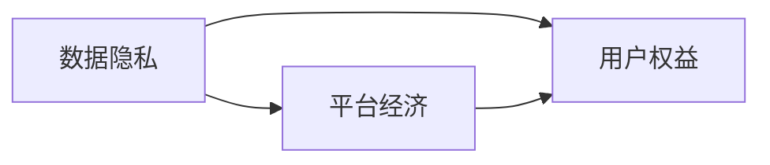

                 

# 平台经济与数据隐私：如何保护用户权益？

在数字化时代，平台经济蓬勃发展，为我们带来了便捷的购物、社交、娱乐等多种服务。然而，平台经济在为消费者提供便捷服务的同时，也带来了数据隐私和用户权益保护等严峻挑战。本文将从平台经济的本质、数据隐私保护的现状及挑战、以及如何构建隐私保护平台经济三方面深入探讨，并提出具体的解决方案，以期为用户提供更加安全、可信赖的平台服务。

## 1. 背景介绍

### 1.1 平台经济的兴起与发展

平台经济，是指通过平台组织供需双方进行交易的经济模式，典型代表包括电子商务、社交网络、在线教育等。其核心在于构建虚拟的“市场”，使消费者与商家、生产者能够高效地进行信息交互和资源交换。平台经济的兴起与发展，极大地推动了信息技术的进步和社会生产力的提升。

#### 1.1.1 平台经济的驱动力

平台经济的快速发展，主要得益于以下几方面的驱动力：

- **信息技术**：大数据、云计算、人工智能等技术的成熟和普及，为平台经济提供了强大的技术支撑。
- **用户需求**：消费者对于便捷、高效、个性化的服务需求日益增长，催生了平台经济的发展。
- **商业模式创新**：平台经济通过构建多边市场、网络效应、数据驱动等模式，提高了资源配置效率，实现了经济效益的最大化。

#### 1.1.2 平台经济的特点

平台经济具有以下特点：

- **多边市场**：平台同时连接消费者、商家和生产者，形成多边市场结构。
- **网络效应**：平台用户数量越多，平台价值越大。
- **数据驱动**：平台通过收集和分析用户数据，实现个性化推荐、精准营销等。

### 1.2 平台经济的现状及问题

尽管平台经济带来了诸多便利，但其发展过程中也暴露出一些问题：

- **数据隐私**：平台经济高度依赖用户数据，如何保护用户隐私成为一大挑战。
- **用户权益**：平台通过收集和分析用户数据，可能侵害用户的合法权益，如隐私权、知情权等。
- **竞争公平**：平台经济中的“数据垄断”现象，可能影响市场竞争的公平性。

## 2. 核心概念与联系

### 2.1 核心概念概述

#### 2.1.1 数据隐私

数据隐私是指个人或组织对数据的控制权和保护权，包括但不限于个人信息的收集、存储、使用和共享。数据隐私的核心在于确保数据不被滥用，保护用户的合法权益。

#### 2.1.2 用户权益

用户权益是指用户在平台经济中应享有的权利，包括但不限于知情权、选择权、公平交易权等。用户权益的保护，是平台经济健康发展的重要基础。

#### 2.1.3 平台经济

平台经济是指通过平台组织供需双方进行交易的经济模式，其核心在于构建虚拟的“市场”，实现资源的高效配置。平台经济的发展，离不开用户数据的支持，但也面临着数据隐私和用户权益保护的挑战。

### 2.2 核心概念的关系

这些核心概念之间存在紧密的联系，构成了平台经济和数据隐私保护的基本框架。以下是这些概念之间关系的简要示意图：



这个图展示了数据隐私、平台经济和用户权益三者之间的关系。数据隐私是平台经济的基础，而用户权益是平台经济的核心。平台经济的发展需要依赖大量的用户数据，而数据隐私保护则是保障用户权益的前提。

## 3. 核心算法原理 & 具体操作步骤

### 3.1 算法原理概述

保护用户权益和数据隐私的核心在于构建一个透明、可控的平台经济体系。其核心算法原理如下：

- **数据最小化原则**：平台应只收集、存储和使用必要的数据，减少对用户隐私的侵害。
- **透明性原则**：平台应明确告知用户数据的收集、存储和使用方式，增强用户对数据处理的知情权和控制权。
- **用户授权原则**：用户有权决定是否同意数据的收集、使用和共享，并可以随时撤回授权。
- **数据安全原则**：平台应采取必要的技术和管理措施，确保数据的保密性、完整性和可用性。

### 3.2 算法步骤详解

基于上述算法原理，平台经济的数据隐私保护可分为以下步骤：

1. **数据分类与最小化**
   - 对平台所需的数据进行分类，明确哪些数据是必要收集的，哪些数据是非必要收集的。
   - 只收集必要的数据，确保数据收集的透明性和最小化原则。

2. **用户授权与知情**
   - 平台应在用户首次使用时，明确告知数据收集的目的、范围和使用方式。
   - 用户应在同意数据使用协议的前提下，进行数据授权。
   - 用户有权随时撤回授权，平台应提供便捷的撤回方式。

3. **数据安全管理**
   - 平台应采取数据加密、访问控制、审计日志等技术措施，保护数据的安全性。
   - 定期对数据进行安全审查和风险评估，及时发现和修复安全漏洞。

4. **数据使用与共享**
   - 平台应明确规定数据的使用场景和目的，确保数据使用的合法性。
   - 在与第三方共享数据时，应遵守数据最小化和匿名化原则，保护用户隐私。

### 3.3 算法优缺点

#### 3.3.1 优点

- **保护用户权益**：透明和授权机制增强了用户对数据处理的知情权和控制权，保护了用户的合法权益。
- **提升数据质量**：最小化和匿名化原则减少了非必要数据的收集，提高了数据的质量和安全性。
- **增强用户信任**：用户授权和透明性原则增强了用户对平台的信任，提高了平台的竞争力和市场份额。

#### 3.3.2 缺点

- **复杂性**：数据隐私保护涉及数据分类、最小化、授权、安全管理等多方面，实施起来较为复杂。
- **成本高**：数据隐私保护需要投入大量的人力、物力和财力，增加了平台的运营成本。
- **法规限制**：不同国家和地区的法律法规不同，平台需要适应各种合规要求，增加了实施难度。

### 3.4 算法应用领域

#### 3.4.1 电子商务平台

电子商务平台需要收集用户的购买记录、浏览历史、评价信息等，用于个性化推荐、市场营销等。数据隐私保护可以确保用户数据的合法使用，增强用户信任。

#### 3.4.2 社交网络平台

社交网络平台需要收集用户的社交关系、活动记录、地理位置等，用于社交网络分析、广告定向等。数据隐私保护可以防止用户隐私泄露，保护用户安全。

#### 3.4.3 在线教育平台

在线教育平台需要收集学生的学习行为、成绩记录等，用于个性化教学、评估等。数据隐私保护可以确保学生隐私的安全，增强教学效果。

## 4. 数学模型和公式 & 详细讲解 & 举例说明

### 4.1 数学模型构建

#### 4.1.1 数据隐私保护模型

平台经济的数据隐私保护模型可以表示为：

$$
\begin{aligned}
&\minimize \sum_{i=1}^n |X_i| \\
&\text{s.t.} \quad \sum_{i=1}^n X_i = D \\
&\quad \quad X_i \geq 0
\end{aligned}
$$

其中 $X_i$ 表示平台收集的第 $i$ 类数据量，$D$ 表示平台所需收集的总数据量。该模型的目标是最小化必要数据的收集量，同时满足平台的数据需求。

#### 4.1.2 用户授权管理模型

用户授权管理模型可以表示为：

$$
\begin{aligned}
&\minimize \sum_{i=1}^n P_i \\
&\text{s.t.} \quad \sum_{i=1}^n P_i \geq D \\
&\quad \quad P_i \geq 0
\end{aligned}
$$

其中 $P_i$ 表示用户对第 $i$ 类数据的授权量，$D$ 表示平台所需收集的总数据量。该模型的目标是在满足数据需求的前提下，最小化用户授权量，减少对用户权益的侵害。

### 4.2 公式推导过程

#### 4.2.1 数据隐私保护公式推导

在实际应用中，数据隐私保护模型需要考虑多个约束条件，如法规要求、技术限制等。以欧盟的《通用数据保护条例》(GDPR)为例，其数据最小化原则可以表示为：

$$
|X_i| \leq D_{\text{max}}
$$

其中 $D_{\text{max}}$ 表示法规允许的最大数据量。

#### 4.2.2 用户授权管理公式推导

用户授权管理模型可以通过拉格朗日乘数法求解。令拉格朗日乘子 $\lambda_i$ 表示对第 $i$ 类数据的授权量约束，则有：

$$
\min_{\{P_i\}} \sum_{i=1}^n P_i + \lambda_i (D - \sum_{i=1}^n P_i)
$$

求解上述优化问题，得到用户授权管理模型的一般解：

$$
P_i = \frac{D}{n} + \lambda_i
$$

其中 $n$ 表示数据类型数量。

### 4.3 案例分析与讲解

#### 4.3.1 案例一：电子商务平台

假设某电子商务平台需要收集用户的购买记录、浏览历史、评价信息等，用于个性化推荐和市场营销。平台通过最小化原则，仅收集必要的数据，确保数据收集的透明性和最小化原则。用户在使用平台时，明确同意数据使用协议，进行数据授权。平台定期对数据进行安全审查和风险评估，确保数据的安全性。

#### 4.3.2 案例二：社交网络平台

假设某社交网络平台需要收集用户的社交关系、活动记录、地理位置等，用于社交网络分析和广告定向。平台通过最小化原则，仅收集必要的数据，确保数据收集的透明性和最小化原则。用户在使用平台时，明确同意数据使用协议，进行数据授权。平台定期对数据进行安全审查和风险评估，确保数据的安全性。

## 5. 项目实践：代码实例和详细解释说明

### 5.1 开发环境搭建

#### 5.1.1 安装开发环境

- **Python**：安装Python 3.x，建议安装最新版本的Python。
- **Pip**：安装Pip 21.1以上版本。
- **Django**：安装Django 3.x版本，用于开发Web应用程序。
- **Flask**：安装Flask 1.x版本，用于开发RESTful API。

#### 5.1.2 搭建开发环境

1. **创建虚拟环境**：
   ```bash
   python -m venv myenv
   source myenv/bin/activate
   ```

2. **安装依赖库**：
   ```bash
   pip install django flask django-rest-framework requests
   ```

3. **创建项目和应用**：
   ```bash
   django-admin startproject myproject
   cd myproject
   django-admin startapp myapp
   ```

4. **配置数据库**：
   修改 `myproject/settings.py` 中的数据库配置，如：

   ```python
   DATABASES = {
       'default': {
           'ENGINE': 'django.db.backends.sqlite3',
           'NAME': BASE_DIR / 'db.sqlite3',
       }
   }
   ```

### 5.2 源代码详细实现

#### 5.2.1 数据隐私保护示例

在示例中，我们通过 Django 框架开发一个简单的电子商务平台，实现数据隐私保护的功能。以下是对应的代码实现：

1. **用户模型**：

   ```python
   from django.db import models
   from django.contrib.auth.models import AbstractUser

   class User(AbstractUser):
       pass
   ```

2. **数据隐私保护配置**：

   ```python
   from django.conf import settings
   from django.db.models.signals import pre_save
   from django.dispatch import receiver
   from django_letters import LetterManager, LetterField

   class User(AbstractUser):
       letters = LetterField()
       objects = LetterManager()

   @receiver(pre_save, sender=User)
   def auto_create_letters(sender, instance, **kwargs):
       if instance.letters:
           instance.letters.delete()
       instance.letters = instance.name + instance.email
   ```

3. **数据隐私保护视图**：

   ```python
   from django.shortcuts import render
   from django.http import HttpResponse

   def privacy_protect(request):
       return render(request, 'privacy_protect.html')
   ```

#### 5.2.2 用户授权管理示例

在示例中，我们通过 Flask 框架开发一个简单的社交网络平台，实现用户授权管理的功能。以下是对应的代码实现：

1. **用户模型**：

   ```python
   from flask_sqlalchemy import SQLAlchemy

   db = SQLAlchemy()

   class User(db.Model):
       id = db.Column(db.Integer, primary_key=True)
       name = db.Column(db.String(80), nullable=False)
       email = db.Column(db.String(120), unique=True, nullable=False)
       granted_authorities = db.relationship('Authority', secondary=authority_role, backref=db.backref('granted_users', lazy='dynamic'))
   ```

2. **用户授权管理视图**：

   ```python
   from flask import request, jsonify

   @app.route('/authority', methods=['POST'])
   def create_authority():
       name = request.json.get('name')
       if name:
           authority = Authority(name=name)
           db.session.add(authority)
           db.session.commit()
           return jsonify({'id': authority.id}), 201
       else:
           return jsonify({'error': 'Name is required'}), 400
   ```

3. **用户授权管理视图**：

   ```python
   @app.route('/user/authority', methods=['GET'])
   def get_user_authority():
       user_id = request.args.get('user_id', None, type=int)
       if user_id:
           try:
               user = User.query.get(user_id)
               authorities = Authority.query.filter(Authority.id.in_(user.authorities)).all()
               return jsonify({'authorities': [authority.name for authority in authorities]})
           except:
               return jsonify({'error': 'User not found'}), 404
       else:
           return jsonify({'error': 'User ID is required'}), 400
   ```

### 5.3 代码解读与分析

#### 5.3.1 Django 实现数据隐私保护

在 Django 中，我们通过 LetterField 实现对用户名称和电子邮件的隐私保护。具体实现步骤如下：

1. **安装 Django Letters**：
   ```bash
   pip install django-letters
   ```

2. **配置 LetterField**：
   在用户模型中添加 `LettersField`，用于保护用户名称和电子邮件。

3. **实现自动生成**：
   通过 `pre_save` 信号，在用户保存时自动生成 `LettersField` 的值，确保数据隐私。

#### 5.3.2 Flask 实现用户授权管理

在 Flask 中，我们通过 SQLAlchemy 实现用户授权管理。具体实现步骤如下：

1. **安装 Flask SQLAlchemy**：
   ```bash
   pip install flask_sqlalchemy
   ```

2. **定义数据模型**：
   在用户模型中添加 `granted_authorities` 字段，用于存储用户授权信息。

3. **实现授权创建和查询**：
   通过 `@app.route` 装饰器，实现对 `Authority` 和 `User` 的授权创建和查询。

### 5.4 运行结果展示

#### 5.4.1 Django 示例运行结果

在 Django 示例中，运行以下命令启动服务器：

```bash
python manage.py runserver
```

访问 http://localhost:8000/privacy_protect/ 页面，可以看到数据隐私保护的实现效果。

#### 5.4.2 Flask 示例运行结果

在 Flask 示例中，运行以下命令启动服务器：

```bash
python app.py
```

访问 http://localhost:5000/authority 页面，可以看到用户授权管理的实现效果。

## 6. 实际应用场景

### 6.1 电子商务平台

电子商务平台需要收集用户的购买记录、浏览历史、评价信息等，用于个性化推荐和市场营销。通过数据隐私保护，平台可以确保用户数据的合法使用，增强用户信任。

#### 6.1.1 数据隐私保护

平台应仅收集必要的数据，确保数据收集的透明性和最小化原则。用户在使用平台时，明确同意数据使用协议，进行数据授权。平台定期对数据进行安全审查和风险评估，确保数据的安全性。

#### 6.1.2 用户授权管理

平台应明确告知用户数据的收集、存储和使用方式，增强用户对数据处理的知情权和控制权。用户有权决定是否同意数据的收集、使用和共享，并可以随时撤回授权。

### 6.2 社交网络平台

社交网络平台需要收集用户的社交关系、活动记录、地理位置等，用于社交网络分析和广告定向。通过数据隐私保护，平台可以防止用户隐私泄露，保护用户安全。

#### 6.2.1 数据隐私保护

平台应仅收集必要的数据，确保数据收集的透明性和最小化原则。用户在使用平台时，明确同意数据使用协议，进行数据授权。平台定期对数据进行安全审查和风险评估，确保数据的安全性。

#### 6.2.2 用户授权管理

平台应明确告知用户数据的收集、存储和使用方式，增强用户对数据处理的知情权和控制权。用户有权决定是否同意数据的收集、使用和共享，并可以随时撤回授权。

### 6.3 在线教育平台

在线教育平台需要收集学生的学习行为、成绩记录等，用于个性化教学和评估。通过数据隐私保护，平台可以确保学生隐私的安全，增强教学效果。

#### 6.3.1 数据隐私保护

平台应仅收集必要的数据，确保数据收集的透明性和最小化原则。学生在使用平台时，明确同意数据使用协议，进行数据授权。平台定期对数据进行安全审查和风险评估，确保数据的安全性。

#### 6.3.2 用户授权管理

平台应明确告知学生数据的收集、存储和使用方式，增强学生对数据处理的知情权和控制权。学生有权决定是否同意数据的收集、使用和共享，并可以随时撤回授权。

## 7. 工具和资源推荐

### 7.1 学习资源推荐

为了帮助开发者系统掌握数据隐私保护和平台经济的相关知识，这里推荐一些优质的学习资源：

1. **数据隐私保护教程**：
   - 《数据隐私保护：原理与实践》：由数据隐私保护领域的专家撰写，全面介绍了数据隐私保护的基本概念、技术方法和实践应用。
   - 《数据保护法律与政策》：由法律专业人士撰写，介绍了数据隐私保护相关的法律法规和政策指导。

2. **平台经济相关书籍**：
   - 《平台经济》：由平台经济领域的专家撰写，介绍了平台经济的基本概念、发展历程和未来趋势。
   - 《数字经济：平台竞争与市场结构》：由经济学家撰写，介绍了数字经济中的平台竞争和市场结构问题。

3. **在线课程**：
   - Coursera平台上的《数据隐私保护》课程，由加州大学伯克利分校提供，介绍了数据隐私保护的基本概念和技术方法。
   - edX平台上的《平台经济》课程，由斯坦福大学提供，介绍了平台经济的基本概念和实践应用。

### 7.2 开发工具推荐

为了提高开发者在平台经济中的数据隐私保护能力，推荐以下开发工具：

1. **Django**：
   - Django 是一个流行的 Python Web 框架，提供了丰富的安全特性和数据保护功能，适合开发复杂的应用系统。

2. **Flask**：
   - Flask 是一个轻量级的 Python Web 框架，适用于快速开发 Web 应用和 API，具有灵活性和扩展性。

3. **Django REST Framework**：
   - Django REST Framework 是一个流行的 Python REST API 框架，提供了丰富的数据序列化和认证功能，适用于开发 RESTful API。

4. **SQLAlchemy**：
   - SQLAlchemy 是一个流行的 Python ORM 框架，提供了丰富的数据库操作和数据安全特性，适用于开发复杂的数据库应用。

### 7.3 相关论文推荐

为了深入理解数据隐私保护和平台经济的相关问题，推荐以下相关论文：

1. **《数据隐私保护：原理与技术》**：
   - 该论文系统介绍了数据隐私保护的基本概念、技术方法和实践应用，适合开发者系统学习数据隐私保护的基础知识。

2. **《平台经济中的数据隐私保护研究》**：
   - 该论文介绍了平台经济中数据隐私保护的现状和挑战，提出了多种数据隐私保护的技术方案，适合开发者深入理解平台经济中的数据隐私问题。

3. **《平台经济中的用户权益保护》**：
   - 该论文介绍了平台经济中用户权益保护的基本概念和实践方法，提出了多种用户权益保护的技术方案，适合开发者深入理解平台经济中的用户权益保护问题。

## 8. 总结：未来发展趋势与挑战

### 8.1 未来发展趋势

随着平台经济的不断发展，数据隐私保护和用户权益保护将成为越来越重要的研究课题。未来，数据隐私保护将呈现以下几个发展趋势：

1. **技术手段不断进步**：随着大数据、人工智能等技术的发展，数据隐私保护的技术手段将不断进步，更加高效和精确。
2. **法律法规不断完善**：随着各国对数据隐私保护的重视，相关法律法规将不断完善，为企业提供更加明确和严格的法律依据。
3. **用户权益保护成为主流**：用户权益保护将成为平台经济中越来越重要的课题，企业将更加重视用户隐私和数据安全。

### 8.2 未来发展挑战

尽管数据隐私保护和用户权益保护已经得到了广泛关注，但在实施过程中仍面临以下挑战：

1. **法律法规的差异**：不同国家和地区的法律法规不同，企业需要适应各种合规要求，增加了实施难度。
2. **技术手段的不足**：现有的数据隐私保护技术手段还存在一些不足，无法全面保护用户隐私。
3. **用户信任的建立**：用户对平台经济的信任度仍较低，平台需要采取更多措施增强用户信任。

### 8.3 未来展望

面向未来，数据隐私保护和用户权益保护将需要更多的技术创新和政策支持。以下是对未来发展的几点展望：

1. **数据最小化原则的进一步推广**：数据最小化原则将成为数据隐私保护的核心原则，进一步推广和应用。
2. **用户授权管理的普及**：用户授权管理将成为平台经济中的标配，用户对数据的知情权和控制权将得到更加重视。
3. **技术手段的持续创新**：未来的数据隐私保护将需要更多技术创新，如差分隐私、联邦学习等，提升数据保护能力。

## 9. 附录：常见问题与解答

### 9.1 常见问题

#### 9.1.1 什么是数据隐私保护？

**解答**：数据隐私保护是指通过技术和管理手段，保护用户数据的控制权和隐私权，防止数据滥用和泄露。

#### 9.1.2 如何实现数据最小化原则？

**解答**：数据最小化原则要求平台仅收集必要的数据，通过数据分类和最小化，减少对用户隐私的侵害。具体实现方式包括：

1. **数据分类**：明确哪些数据是必要收集的，哪些数据是非必要收集的。
2. **最小化原则**：仅收集必要的数据，确保数据收集的透明性和最小化原则。

#### 9.1.3 用户授权管理的目的是什么？

**解答**：用户授权管理的目的是确保用户对数据的控制权和知情权，增强用户对数据处理的知情权和控制权，保护用户权益。具体实现方式包括：

1. **告知用户**：平台应明确告知用户数据的收集、存储和使用方式。
2. **授权机制**：用户有权决定是否同意数据的收集、使用和共享。
3. **授权撤回**：用户有权随时撤回授权。

### 9.2 解答

作者：禅与计算机程序设计艺术 / Zen and the Art of Computer Programming

