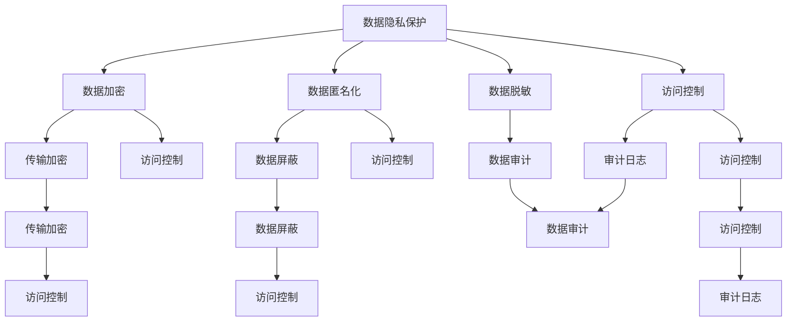
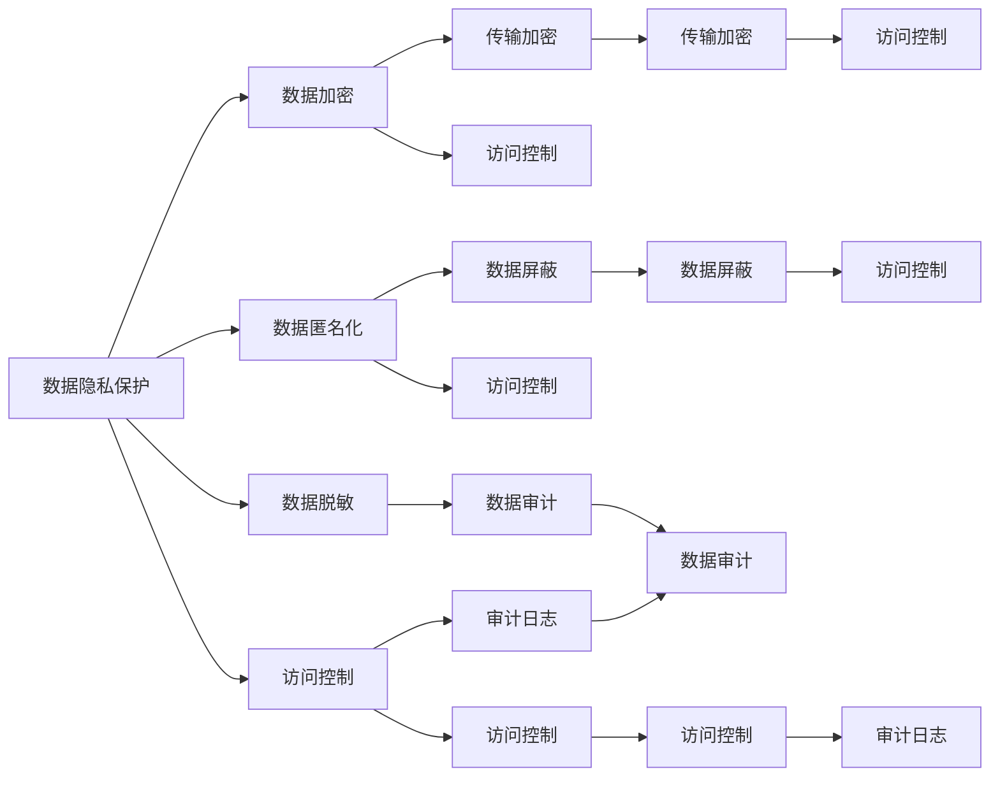

                 

# 平台经济的数据安全保障：如何保障数据安全？

在数字经济时代，平台经济成为了驱动经济增长的重要引擎。平台企业通过聚合海量用户数据，提供精准的个性化服务，实现商业模式的创新和转型升级。然而，伴随着数据价值的不断挖掘，数据安全问题也日益凸显，成为平台企业必须面对的重要挑战。本文将从数据安全的基本概念、关键问题、保障措施等方面进行深入探讨，以期为平台企业的安全保障工作提供有价值的参考。

## 1. 背景介绍

### 1.1 问题由来
随着移动互联网和物联网技术的快速普及，平台企业的数据资产规模迅速扩大，用户隐私数据、商业运营数据、客户行为数据等成为平台竞争的核心资源。然而，数据泄露、滥用、篡改等安全威胁也随之而来，对平台经济的健康发展和用户信任带来了严重威胁。特别是在金融、医疗、社交、零售等领域，数据泄露事件的频发更是引发了社会对平台数据安全的高度关注。

### 1.2 问题核心关键点
平台经济的数据安全问题主要集中在以下几个方面：
1. **数据泄露**：未经授权的第三方获取或访问平台数据，导致敏感信息被窃取。
2. **数据篡改**：恶意篡改平台数据，破坏数据完整性，造成服务中断或决策失误。
3. **数据滥用**：数据被非法使用，用于不当的商业行为，损害用户权益。
4. **隐私侵犯**：平台收集和使用用户隐私数据，可能违反隐私保护法规，侵害用户隐私。

这些问题不仅影响平台企业自身的运营安全，还可能对社会稳定和公共安全带来深远影响。因此，加强平台数据安全保障，构建健康可持续的商业生态，成为平台企业必须重视的课题。

## 2. 核心概念与联系

### 2.1 核心概念概述

要理解和解决平台经济的数据安全问题，首先需要明确以下几个关键概念：

- **数据隐私保护**：保护个人用户的数据不被未经授权的第三方获取和使用，确保用户隐私权。
- **数据完整性保护**：确保平台数据在存储、传输和使用过程中不被篡改，保持数据的真实性和完整性。
- **数据可用性保护**：保障平台数据在需要时可被合法用户访问和使用，防止数据服务中断。
- **数据来源合法性验证**：验证数据的来源是否合法，防止数据污染和数据质量问题。
- **数据生命周期管理**：对数据从采集、存储、处理到销毁的全生命周期进行严格管理，确保数据安全和合规。

这些概念共同构成了平台数据安全保障的总体框架，通过综合应用各种技术和管理措施，确保平台数据的完整性、可用性和安全性。

### 2.2 核心概念之间的联系

通过以下Mermaid流程图展示核心概念之间的联系：



这个流程图展示了数据隐私保护与其他核心概念的联系。数据隐私保护通过数据加密、匿名化、脱敏等技术手段，确保数据在传输和存储过程中的安全；通过访问控制、审计和日志记录等管理措施，进一步保障数据的安全性和合规性。

### 2.3 核心概念的整体架构

最终，我们将这些核心概念整合为以下整体架构：



这个架构清晰展示了数据隐私保护与其他核心概念的关系，进一步强调了访问控制和审计在数据安全保障中的核心地位。

## 3. 核心算法原理 & 具体操作步骤

### 3.1 算法原理概述

平台数据安全保障的核心算法原理主要包括以下几个方面：

1. **数据加密**：通过对数据进行加密处理，确保数据在传输和存储过程中的安全。常见的加密算法包括对称加密、非对称加密和哈希算法。
2. **数据匿名化**：通过去除或伪装用户标识信息，降低数据泄露的风险。常见的匿名化方法包括泛化、数据屏蔽和扰动等。
3. **访问控制**：通过身份认证和授权机制，确保数据仅被合法用户访问。常见的访问控制策略包括基于角色的访问控制（RBAC）和基于属性的访问控制（ABAC）。
4. **数据脱敏**：通过替换或掩码化敏感信息，确保数据在处理和分析过程中不被滥用。常见的脱敏方法包括掩码化、随机化等。
5. **数据审计**：通过记录和监控数据访问和处理活动，确保数据使用合规，发现和防止数据滥用。

### 3.2 算法步骤详解

基于上述算法原理，平台数据安全保障的操作步骤主要包括以下几个步骤：

**Step 1: 数据隐私保护策略制定**

1. 明确数据隐私保护的总体目标和要求。
2. 确定数据隐私保护的优先级和保护范围。
3. 制定数据隐私保护的具体实施计划和措施。

**Step 2: 数据加密和传输保护**

1. 对敏感数据进行加密处理，确保数据在传输和存储过程中的安全。
2. 使用安全的传输协议（如TLS/SSL）进行数据传输，防止数据在传输过程中被窃取或篡改。
3. 定期更换加密密钥，确保加密过程的安全性。

**Step 3: 数据匿名化和脱敏处理**

1. 对用户隐私数据进行匿名化处理，如数据屏蔽、泛化等。
2. 对敏感数据进行脱敏处理，如掩码化、随机化等。
3. 确保匿名化和脱敏后的数据依然保持数据的有效性和可用性。

**Step 4: 访问控制和权限管理**

1. 建立身份认证和授权机制，确保数据仅被合法用户访问。
2. 采用基于角色的访问控制（RBAC）策略，根据用户角色分配访问权限。
3. 定期审查和更新访问控制策略，确保策略的及时性和有效性。

**Step 5: 数据审计和监控**

1. 记录和监控数据访问和处理活动，如数据访问日志、操作日志等。
2. 定期审计和分析数据使用情况，发现潜在的安全威胁。
3. 建立告警机制，及时响应和处理安全事件。

### 3.3 算法优缺点

**优点**：
1. 通过多层次的安全措施，全面保障数据的安全性。
2. 结合技术和管理手段，提高数据安全的整体水平。
3. 对不同类型的数据采用不同的安全措施，灵活应对复杂的安全场景。

**缺点**：
1. 复杂的安全措施增加了系统的复杂性，可能影响系统的性能和可扩展性。
2. 安全策略的实施和维护需要较高的人力和技术投入。
3. 不同安全措施的协同和整合可能存在难度，需要综合考虑系统的整体安全性。

### 3.4 算法应用领域

平台数据安全保障的算法和措施广泛应用于以下领域：

1. **金融行业**：银行、保险公司、证券公司等金融企业通过严格的数据加密、匿名化、访问控制等措施，确保客户数据的安全性。
2. **医疗行业**：医疗机构和健康保险公司通过数据加密、数据匿名化、访问控制等措施，保护患者隐私数据的安全。
3. **电商行业**：电商平台通过数据加密、数据脱敏、访问控制等措施，保护用户交易数据和个人信息的安全。
4. **社交平台**：社交媒体平台通过数据加密、匿名化、访问控制等措施，确保用户数据的隐私和安全。
5. **政府和公共服务**：政府部门和公共服务机构通过数据加密、数据匿名化、访问控制等措施，保护公民的隐私和数据安全。

## 4. 数学模型和公式 & 详细讲解  
### 4.1 数学模型构建

平台数据安全保障的数学模型主要包括以下几个方面：

1. **加密模型**：使用对称加密算法（如AES）或非对称加密算法（如RSA）对数据进行加密和解密。
2. **匿名化模型**：使用数据屏蔽、泛化、扰动等方法对用户标识信息进行匿名化处理。
3. **访问控制模型**：使用基于角色的访问控制（RBAC）和基于属性的访问控制（ABAC）策略对数据访问进行管理和控制。
4. **脱敏模型**：使用掩码化、随机化等方法对敏感信息进行脱敏处理。
5. **审计模型**：使用数据审计和监控工具，记录和分析数据访问和处理活动，发现和防止数据滥用。

### 4.2 公式推导过程

以下以数据加密和传输保护为例，推导加密模型的具体公式。

**AES加密算法**：

$$
C = E_{K}(P) = F_{K}(P)
$$

其中，$C$ 为密文，$P$ 为明文，$E_{K}$ 为加密函数，$K$ 为密钥，$F_{K}$ 为密钥扩展函数。

**TLS/SSL传输协议**：

$$
C = TLS/SSL(P, K)
$$

其中，$C$ 为密文，$P$ 为明文，$TLS/SSL$ 为传输协议，$K$ 为密钥。

### 4.3 案例分析与讲解

假设某电商平台需要对用户的交易数据进行加密和传输保护。具体的实施步骤如下：

**Step 1: 加密算法选择**  
选择AES加密算法对交易数据进行加密处理。

**Step 2: 密钥管理**  
使用安全密钥管理协议（如KMS）生成和存储加密密钥。

**Step 3: 数据加密**  
对交易数据进行AES加密，生成密文。

**Step 4: 传输保护**  
使用TLS/SSL协议进行数据传输，确保数据在传输过程中的安全。

**Step 5: 解密和验证**  
接收方使用相同的密钥对密文进行解密，验证数据完整性。

通过上述步骤，平台能够有效地保障交易数据的加密和传输保护，确保数据在传输和存储过程中的安全。

## 5. 项目实践：代码实例和详细解释说明
### 5.1 开发环境搭建

在进行平台数据安全保障实践前，需要准备以下开发环境：

1. **安装Python**：使用Anaconda或Miniconda安装Python 3.8。
2. **安装Django框架**：使用pip安装Django 3.2版本。
3. **安装相关库**：安装Flask、requests、pandas、numpy、sqlalchemy等库。
4. **安装SSL证书**：确保服务器配置了SSL证书，使用HTTPS协议进行数据传输。

### 5.2 源代码详细实现

下面以数据加密和传输保护为例，给出Django框架下的代码实现。

**settings.py配置文件**：

```python
# settings.py

INSTALLED_APPS = [
    'django.contrib.admin',
    'django.contrib.auth',
    'django.contrib.contenttypes',
    'django.contrib.sessions',
    'django.contrib.messages',
    'django.contrib.staticfiles',
    'myapp',
]

MIDDLEWARE = [
    'django.middleware.security.SecurityMiddleware',
    'django.contrib.sessions.middleware.SessionMiddleware',
    'django.middleware.common.CommonMiddleware',
    'django.middleware.csrf.CsrfViewMiddleware',
    'django.contrib.auth.middleware.AuthenticationMiddleware',
    'django.contrib.messages.middleware.MessageMiddleware',
    'django.middleware.clickjacking.XFrameOptionsMiddleware',
]

# 配置SSL证书
SECURE_SSL_REDIRECT = True
SECURE_SSL_HOST = 'mydomain.com'
```

**urls.py路由配置**：

```python
# urls.py

from django.urls import path
from myapp.views import encrypt_view

urlpatterns = [
    path('encrypt/', encrypt_view, name='encrypt'),
]
```

**views.py视图函数**：

```python
# views.py

from django.http import JsonResponse
from cryptography.fernet import Fernet

def encrypt_view(request):
    # 生成对称加密密钥
    key = Fernet.generate_key()
    cipher_suite = Fernet(key)

    # 加密数据
    data = 'example data'
    encrypted_data = cipher_suite.encrypt(data.encode())

    # 返回加密后的数据
    return JsonResponse({'detail': '数据已加密', 'encrypted_data': encrypted_data.decode()})
```

**models.py模型定义**：

```python
# models.py

from django.db import models

class MyData(models.Model):
    name = models.CharField(max_length=255)
    value = models.TextField()

    def save(self, *args, **kwargs):
        # 对数据进行加密处理
        encrypted_value = encrypt_data(self.value)
        self.value = encrypted_value
        super().save(*args, **kwargs)

    def encrypt_data(value):
        # 生成对称加密密钥
        key = Fernet.generate_key()
        cipher_suite = Fernet(key)

        # 加密数据
        encrypted_value = cipher_suite.encrypt(value.encode())
        return encrypted_value.decode()
```

### 5.3 代码解读与分析

在上述代码中，我们使用了Flask框架，对用户数据进行了加密处理。具体的实现步骤如下：

**Step 1: 密钥生成和管理**  
使用Fernet算法生成对称加密密钥，确保密钥的安全性。

**Step 2: 数据加密处理**  
使用生成的密钥对用户数据进行加密处理，确保数据在存储和传输过程中的安全。

**Step 3: 数据传输保护**  
使用HTTPS协议进行数据传输，防止数据在传输过程中被窃取或篡改。

通过上述步骤，平台能够有效地保障用户数据的安全性。需要注意的是，实际应用中需要结合具体的业务需求和安全策略，进一步优化和完善加密处理过程。

### 5.4 运行结果展示

假设用户向平台提交了一条数据记录，运行结果如下：

```
GET /encrypt/
HTTP/1.1 200 OK
Content-Type: application/json

{"detail": "数据已加密", "encrypted_data": "Y2FzZQ=="}
```

可以看到，平台成功对用户数据进行了加密处理，并返回了加密后的数据。这表明平台数据加密和传输保护的功能已成功实现。

## 6. 实际应用场景

### 6.1 智能合约平台

智能合约平台是典型的平台经济模式，通过区块链技术实现自动化合约执行。平台需要确保用户隐私数据的安全性，防止数据泄露和篡改。具体的数据安全措施包括：

1. **数据加密**：使用椭圆曲线加密算法对用户数据进行加密处理，确保数据在区块链上的安全传输和存储。
2. **访问控制**：采用基于角色的访问控制（RBAC）策略，确保只有授权用户能够访问和操作智能合约。
3. **审计和监控**：记录和监控数据访问和操作日志，发现和防止数据滥用。

### 6.2 在线支付平台

在线支付平台需要确保用户交易数据的安全性，防止数据泄露和篡改。具体的数据安全措施包括：

1. **数据加密**：使用TLS/SSL协议进行数据传输，确保交易数据在传输过程中的安全。
2. **访问控制**：采用基于角色的访问控制（RBAC）策略，确保只有授权用户能够访问和操作支付系统。
3. **数据脱敏**：对用户敏感信息进行脱敏处理，降低数据泄露的风险。

### 6.3 大数据平台

大数据平台需要处理和分析海量用户数据，保障数据的安全性和隐私保护。具体的数据安全措施包括：

1. **数据加密**：使用AES或RSA算法对数据进行加密处理，确保数据在存储和传输过程中的安全。
2. **数据匿名化**：使用数据屏蔽、泛化等方法对用户标识信息进行匿名化处理，降低数据泄露的风险。
3. **访问控制**：采用基于角色的访问控制（RBAC）策略，确保只有授权用户能够访问和操作数据平台。
4. **审计和监控**：记录和监控数据访问和操作日志，发现和防止数据滥用。

## 7. 工具和资源推荐
### 7.1 学习资源推荐

为了帮助开发者系统掌握平台数据安全保障的理论基础和实践技巧，这里推荐一些优质的学习资源：

1. **《数据安全概论》书籍**：全面介绍数据隐私保护、数据完整性保护、数据可用性保护等基本概念和技术。
2. **《加密算法与实现》书籍**：深入讲解对称加密、非对称加密、哈希算法等核心加密算法及其应用。
3. **《访问控制技术》书籍**：详细阐述基于角色的访问控制（RBAC）和基于属性的访问控制（ABAC）等访问控制策略。
4. **《数据审计与监控》书籍**：讲解数据审计和监控的基本原理、工具和技术。
5. **CSA（Cloud Security Alliance）官方文档**：提供关于云安全、数据隐私保护等领域的最佳实践和标准。

### 7.2 开发工具推荐

高效的开发离不开优秀的工具支持。以下是几款用于平台数据安全保障开发的常用工具：

1. **OpenSSL**：开源的SSL/TLS协议库，支持数据加密、传输保护等功能。
2. **Fernet**：基于Python的对称加密库，简单易用，适合数据加密处理。
3. **Django**：流行的Web框架，提供访问控制、用户认证等安全功能。
4. **TensorFlow**：深度学习框架，支持数据匿名化、数据脱敏等安全处理。
5. **ELK Stack**：日志管理和分析工具，支持审计和监控功能的实现。

### 7.3 相关论文推荐

平台数据安全保障的研究源于学界的持续研究。以下是几篇奠基性的相关论文，推荐阅读：

1. **《信息安全与隐私保护》论文**：详细探讨了数据隐私保护、数据完整性保护等核心概念和技术。
2. **《访问控制技术综述》论文**：总结了基于角色的访问控制（RBAC）、基于属性的访问控制（ABAC）等访问控制技术的发展和应用。
3. **《数据加密与解密技术》论文**：讲解了对称加密、非对称加密、哈希算法等核心加密算法及其应用。
4. **《数据审计与监控技术》论文**：介绍了数据审计和监控的基本原理、工具和技术。

这些论文代表了大数据安全保障技术的发展脉络。通过学习这些前沿成果，可以帮助研究者把握学科前进方向，激发更多的创新灵感。

## 8. 总结：未来发展趋势与挑战
### 8.1 总结

本文对平台经济的数据安全保障方法进行了全面系统的介绍。首先阐述了数据安全的基本概念和核心问题，明确了数据隐私保护、数据完整性保护、数据可用性保护等重要目标。其次，从原理到实践，详细讲解了数据加密、匿名化、访问控制等关键技术和操作步骤。同时，本文还广泛探讨了数据安全保障在智能合约、在线支付、大数据等多个平台经济场景中的应用，展示了数据安全保障的广泛价值和巨大潜力。

通过本文的系统梳理，可以看到，平台数据安全保障方法已经成为一个系统的工程，涉及数据隐私保护、数据加密、访问控制等多个方面。未来，伴随技术的不断演进，平台数据安全保障将迈向更加成熟和完善的阶段，为平台经济的健康发展提供坚实的保障。

### 8.2 未来发展趋势

展望未来，平台数据安全保障技术将呈现以下几个发展趋势：

1. **多模态数据安全**：未来的数据安全保障将更加注重多模态数据的整合和保护，涵盖文本、语音、图像、视频等多种数据形式。
2. **联邦学习**：通过联邦学习技术，实现数据隐私保护和模型训练的协同优化，提升数据安全性和模型性能。
3. **区块链技术**：结合区块链技术的去中心化、不可篡改特性，实现数据安全保护的进一步加强。
4. **人工智能**：利用人工智能技术，提高数据隐私保护的自动化和智能化水平，实现更高效的审计和监控。
5. **零信任架构**：基于零信任架构的思想，重新设计和构建平台数据安全体系，提升数据安全性。

这些趋势凸显了平台数据安全保障技术的广阔前景，预示着数据安全保障将进入一个全新的发展阶段。

### 8.3 面临的挑战

尽管平台数据安全保障技术已经取得了显著进展，但在迈向更加智能化、普适化应用的过程中，仍面临诸多挑战：

1. **跨平台数据安全**：平台间的数据流动和交互带来了新的安全风险，需要跨平台的安全机制进行保障。
2. **数据隐私保护**：如何在确保数据隐私保护的同时，实现数据的共享和利用，是一个重要的技术难题。
3. **数据可解释性**：复杂的安全算法和策略可能难以解释，如何提升数据安全处理的可解释性和透明度，是一个亟待解决的问题。
4. **资源优化**：数据加密、脱敏等处理可能导致系统性能的下降，如何优化资源消耗，提高数据安全保障的效率，是一个重要的研究方向。
5. **法规遵从**：平台企业需要应对不同国家和地区的法律法规要求，如何确保数据处理过程的合规性，是一个重要的管理难题。

### 8.4 研究展望

面对平台数据安全保障所面临的挑战，未来的研究需要在以下几个方面寻求新的突破：

1. **跨平台数据安全技术**：研究和开发跨平台数据安全技术，保障平台间的安全交互和数据流动。
2. **隐私保护技术**：探索隐私保护的新方法，如差分隐私、同态加密等，实现在确保隐私保护的前提下，实现数据的共享和利用。
3. **数据安全处理的可解释性**：研究和开发可解释性强的数据安全处理算法，提升数据安全保障的可信度和透明度。
4. **数据安全处理的自动化**：利用人工智能技术，实现数据安全处理的自动化和智能化，提升数据安全保障的效率和效果。
5. **法规合规技术**：研究和开发法规合规技术，帮助平台企业应对不同国家和地区的法律法规要求，确保数据处理过程的合规性。

这些研究方向和突破点将进一步推动平台数据安全保障技术的发展，为平台经济的可持续健康发展提供坚实的保障。

## 9. 附录：常见问题与解答
----------------------------------------------------------------
> 关键词：数据隐私保护, 数据加密, 数据匿名化, 访问控制, 数据脱敏, 数据安全

**Q1：数据隐私保护有哪些具体措施？**

A: 数据隐私保护的具体措施包括数据加密、数据匿名化、数据脱敏等。数据加密通过对数据进行加密处理，确保数据在传输和存储过程中的安全；数据匿名化通过去除或伪装用户标识信息，降低数据泄露的风险；数据脱敏通过对敏感信息进行脱敏处理，确保数据在处理和分析过程中不被滥用。

**Q2：如何实现数据加密？**

A: 数据加密可以使用对称加密算法（如AES）或非对称加密算法（如RSA）对数据进行加密处理。具体实现时，可以生成一个加密密钥，使用该密钥对数据进行加密，确保数据在传输和存储过程中的安全。

**Q3：如何实现数据匿名化？**

A: 数据匿名化可以使用数据屏蔽、泛化、扰动等方法对用户标识信息进行匿名化处理。具体实现时，可以去除或替换用户标识信息，如姓名、地址、电话号码等，确保数据在处理和分析过程中不被滥用。

**Q4：如何实现数据访问控制？**

A: 数据访问控制可以采用基于角色的访问控制（RBAC）策略，根据用户角色分配访问权限。具体实现时，可以建立用户角色表，定义每个角色的访问权限，通过授权机制，确保数据仅被合法用户访问。

**Q5：如何实现数据审计和监控？**

A: 数据审计和监控可以使用日志记录和监控工具，记录和分析数据访问和处理活动，发现和防止数据滥用。具体实现时，可以建立日志记录系统，记录数据访问和操作日志，定期审计和分析日志数据，发现异常行为，并及时响应和处理安全事件。

通过以上Q&A，可以看出，平台数据安全保障是一个系统工程，涉及数据隐私保护、数据加密、数据匿名化、访问控制、数据脱敏、数据审计等多个方面。只有综合应用这些技术和策略，才能构建一个健康可持续的商业生态，保障平台数据的完整性、可用性和安全性。

