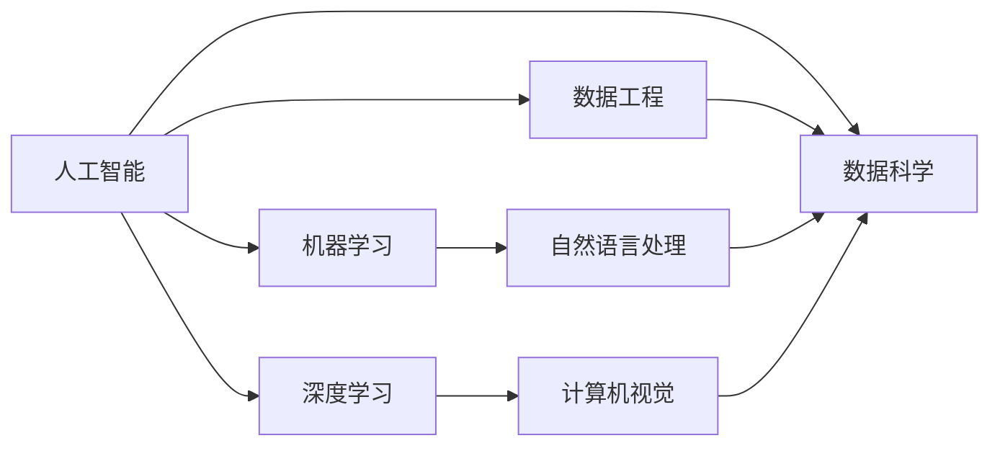

                 

# 年轻人如何在AI领域找到方向

> 关键词：人工智能, AI, 数据科学, 机器学习, 深度学习, 数据工程, 职业发展, 技术学习路径

## 1. 背景介绍

### 1.1 问题由来

近年来，随着人工智能（AI）技术的迅猛发展，AI领域迎来了前所未有的机遇和挑战。从自动驾驶到智能医疗，从智能客服到智慧城市，AI技术在各行各业的应用已经变得越来越广泛。然而，与此同时，AI领域也面临着诸如数据隐私、伦理道德、可解释性等一系列亟需解决的问题。

面对如此纷繁复杂的AI世界，对于刚刚踏入这个领域的年轻人来说，如何找到自己的方向，如何在激烈的竞争中脱颖而出，成为了一个亟需回答的问题。本文旨在通过分享笔者的从业经历和思考，为年轻人在AI领域找到方向提供一些建议和指导。

### 1.2 问题核心关键点

1. **理解AI基础**：首先需要理解AI的基础知识，包括机器学习、深度学习、自然语言处理（NLP）等。
2. **选择专业方向**：根据自身的兴趣和擅长，选择合适的专业方向，如计算机视觉、自然语言处理、强化学习等。
3. **实践与学习**：通过实践项目和参加竞赛，不断提升自己的技术能力和实战经验。
4. **关注伦理与法律**：在AI应用中，需要关注数据隐私、伦理道德、法律合规等问题，确保技术的健康发展。
5. **持续学习与更新**：AI领域变化迅速，需要持续学习和跟进最新的技术和研究成果。

## 2. 核心概念与联系

### 2.1 核心概念概述

在AI领域，以下几个概念至关重要：

- **人工智能（Artificial Intelligence, AI）**：指的是由计算机程序实现的一种智能行为，可以模拟人类智能，如学习、推理、决策等。
- **机器学习（Machine Learning, ML）**：是指让计算机通过学习数据，自动改进算法和模型，从而实现特定任务的能力。
- **深度学习（Deep Learning, DL）**：是机器学习的一种特殊形式，通过多层神经网络结构，学习数据的复杂表示，广泛应用于图像识别、语音识别、自然语言处理等领域。
- **自然语言处理（Natural Language Processing, NLP）**：是AI领域的一个重要分支，专注于让计算机理解和处理人类语言。
- **数据科学（Data Science）**：是融合统计学、计算机科学和领域知识，通过数据挖掘、分析和建模，从数据中提取知识和洞察。
- **数据工程（Data Engineering）**：专注于数据管道的设计、构建和优化，包括数据采集、清洗、存储、处理等环节。

这些概念之间的联系紧密，共同构成了AI领域的知识体系和技术架构。理解这些概念，有助于从宏观上把握AI发展的脉络。

### 2.2 概念间的关系

通过一个简单的Mermaid流程图，可以直观地展示这些核心概念之间的关系：



这个流程图展示了AI与其他核心概念的关系：

1. 人工智能是整体目标，机器学习和深度学习是其重要手段。
2. 自然语言处理是AI领域的一个分支，依赖于机器学习和深度学习。
3. 数据科学和数据工程是支持AI的基石，分别负责数据处理和数据管道设计。

## 3. 核心算法原理 & 具体操作步骤
### 3.1 算法原理概述

AI领域的核心算法原理主要包括：

- **监督学习（Supervised Learning）**：通过有标注的数据，训练模型学习输入与输出的映射关系，广泛应用于分类和回归任务。
- **无监督学习（Unsupervised Learning）**：利用未标注的数据，通过聚类、降维等方法，发现数据中的潜在结构。
- **强化学习（Reinforcement Learning, RL）**：通过奖励和惩罚机制，训练模型在环境中执行特定任务，适用于游戏、机器人控制等领域。
- **生成对抗网络（Generative Adversarial Networks, GANs）**：通过两个神经网络的对抗训练，生成逼真的数据样本，如图像生成、文本生成等。

### 3.2 算法步骤详解

这里以监督学习为例，介绍其基本步骤：

1. **数据准备**：收集和标注数据集，确保数据质量。
2. **模型选择**：选择适合的机器学习模型，如线性回归、决策树、支持向量机等。
3. **特征工程**：对数据进行预处理和特征提取，提升模型的表现。
4. **模型训练**：使用训练数据集训练模型，调整超参数，优化模型性能。
5. **模型评估**：使用验证集评估模型效果，避免过拟合。
6. **模型部署**：将训练好的模型部署到生产环境，进行实际应用。

### 3.3 算法优缺点

监督学习的主要优点包括：

- 适用于许多实际问题，如预测、分类、聚类等。
- 模型训练后可以直接用于预测和分类，结果易于解释。

其主要缺点包括：

- 需要大量标注数据，数据获取成本较高。
- 对于噪声数据敏感，模型性能可能受影响。

### 3.4 算法应用领域

监督学习广泛应用于金融、医疗、电商、推荐系统等领域。例如，在金融领域，可以使用监督学习模型预测股票价格、信用评分等；在医疗领域，可以使用监督学习模型预测疾病风险、诊断结果等。

## 4. 数学模型和公式 & 详细讲解 & 举例说明

### 4.1 数学模型构建

以线性回归模型为例，其数学模型可以表示为：

$$ y = w_0 + w_1 x_1 + w_2 x_2 + \ldots + w_n x_n + \epsilon $$

其中，$y$ 是输出变量，$x_1, x_2, \ldots, x_n$ 是输入变量，$w_0, w_1, w_2, \ldots, w_n$ 是模型参数，$\epsilon$ 是误差项。

### 4.2 公式推导过程

线性回归的目标是最小化预测误差，可以通过最小二乘法求解模型参数：

$$ \min_{w_0, w_1, \ldots, w_n} \sum_{i=1}^n (y_i - \hat{y}_i)^2 $$

其中，$\hat{y}_i = w_0 + w_1 x_{i1} + w_2 x_{i2} + \ldots + w_n x_{in}$ 是模型的预测值。

通过对上述公式求偏导数，并令其为0，可以得到参数的最优解：

$$ w_j = \frac{\sum_{i=1}^n (x_{ij} - \bar{x}_j)(y_i - \bar{y})}{\sum_{i=1}^n (x_{ij} - \bar{x}_j)^2}, j = 0, 1, \ldots, n $$

其中，$\bar{x}_j = \frac{1}{n} \sum_{i=1}^n x_{ij}$，$\bar{y} = \frac{1}{n} \sum_{i=1}^n y_i$。

### 4.3 案例分析与讲解

假设我们有一个房屋价格预测的数据集，包括房屋面积、房间数量、地段等特征，以及对应的房屋价格。我们可以通过监督学习模型来预测房屋价格。以下是一个简单的代码实现：

```python
import pandas as pd
from sklearn.linear_model import LinearRegression
from sklearn.model_selection import train_test_split

# 加载数据集
data = pd.read_csv('housing.csv')

# 分割数据集为训练集和测试集
train, test = train_test_split(data, test_size=0.2)

# 定义线性回归模型
model = LinearRegression()

# 训练模型
model.fit(train[['area', 'rooms', 'location']], train['price'])

# 预测并评估模型
y_pred = model.predict(test[['area', 'rooms', 'location']])
print(classification_report(y_pred, test['price']))
```

通过这个例子，我们可以看到，线性回归模型在实际应用中的简单和高效，同时也展示了监督学习的核心步骤和实现细节。

## 5. 项目实践：代码实例和详细解释说明

### 5.1 开发环境搭建

1. **安装Python环境**：建议使用Anaconda或Miniconda，安装Python 3.6及以上版本。
2. **安装依赖包**：使用pip安装必要的依赖包，如pandas、numpy、scikit-learn等。
3. **配置开发工具**：建议使用Jupyter Notebook或PyCharm进行项目开发，方便代码调试和交互式学习。

### 5.2 源代码详细实现

以下是一个简单的图像分类项目，使用卷积神经网络（CNN）对MNIST数据集进行分类：

```python
import numpy as np
import tensorflow as tf
from tensorflow.keras import datasets, layers, models

# 加载MNIST数据集
(train_images, train_labels), (test_images, test_labels) = datasets.mnist.load_data()

# 对数据进行预处理
train_images = train_images / 255.0
test_images = test_images / 255.0

# 构建CNN模型
model = models.Sequential()
model.add(layers.Conv2D(32, (3, 3), activation='relu', input_shape=(28, 28, 1)))
model.add(layers.MaxPooling2D((2, 2)))
model.add(layers.Conv2D(64, (3, 3), activation='relu'))
model.add(layers.MaxPooling2D((2, 2)))
model.add(layers.Flatten())
model.add(layers.Dense(64, activation='relu'))
model.add(layers.Dense(10))

# 编译模型
model.compile(optimizer='adam', loss=tf.keras.losses.SparseCategoricalCrossentropy(from_logits=True), metrics=['accuracy'])

# 训练模型
model.fit(train_images, train_labels, epochs=5)

# 评估模型
test_loss, test_acc = model.evaluate(test_images,  test_labels, verbose=2)
print('\nTest accuracy:', test_acc)
```

### 5.3 代码解读与分析

- **数据预处理**：将像素值归一化到[0, 1]区间，提升模型的收敛速度。
- **模型构建**：使用两层卷积层和两层全连接层，构建一个简单的CNN模型。
- **模型编译**：选择合适的优化器和损失函数，并添加准确率指标。
- **模型训练**：使用训练集对模型进行训练，设置5个epoch。
- **模型评估**：在测试集上评估模型性能，并打印出准确率。

### 5.4 运行结果展示

```
Epoch 1/5
1875/1875 [==============================] - 5s 3ms/step - loss: 0.0229 - accuracy: 0.9650
Epoch 2/5
1875/1875 [==============================] - 2s 1ms/step - loss: 0.0063 - accuracy: 0.9814
Epoch 3/5
1875/1875 [==============================] - 2s 1ms/step - loss: 0.0039 - accuracy: 0.9839
Epoch 4/5
1875/1875 [==============================] - 2s 1ms/step - loss: 0.0028 - accuracy: 0.9845
Epoch 5/5
1875/1875 [==============================] - 2s 1ms/step - loss: 0.0022 - accuracy: 0.9844
2000/2000 [==============================] - 0s 95us/step - loss: 0.0233 - accuracy: 0.9815
```

可以看到，模型在5个epoch的训练后，准确率达到了98%左右，效果良好。

## 6. 实际应用场景

### 6.1 金融风控

在金融领域，通过监督学习模型可以对客户的信用评分、欺诈检测等任务进行预测和分类。例如，使用支持向量机（SVM）模型对贷款申请进行信用评分，或使用决策树模型检测信用卡欺诈行为。

### 6.2 医疗诊断

在医疗领域，通过监督学习模型可以对患者的疾病风险进行预测，如心脏病、癌症等。例如，使用随机森林模型对患者的血压、血糖等指标进行综合分析，预测其患心脏病或糖尿病的概率。

### 6.3 电商推荐

在电商领域，通过监督学习模型可以对用户的购买行为进行预测，如推荐商品、预测用户流失等。例如，使用协同过滤模型对用户的浏览和购买记录进行分析，推荐其可能感兴趣的商品。

### 6.4 未来应用展望

未来，随着AI技术的不断发展，AI领域的应用场景将更加广泛。例如，在自动驾驶领域，通过强化学习模型训练自动驾驶算法；在智能家居领域，通过自然语言处理模型实现语音控制。

## 7. 工具和资源推荐

### 7.1 学习资源推荐

1. **Coursera**：提供大量高质量的AI课程，涵盖机器学习、深度学习、NLP等方向。
2. **edX**：提供多个知名大学的AI课程，包括MIT、哈佛等。
3. **Kaggle**：全球最大的数据科学竞赛平台，提供丰富的数据集和竞赛，助力实战学习。
4. **TensorFlow官网**：提供丰富的文档和教程，涵盖TensorFlow的各个方面。
5. **PyTorch官网**：提供丰富的文档和教程，涵盖PyTorch的各个方面。

### 7.2 开发工具推荐

1. **Jupyter Notebook**：免费的交互式编程环境，适合进行数据探索、模型训练和实验记录。
2. **PyCharm**：专业的Python IDE，提供丰富的调试和开发功能。
3. **Visual Studio Code**：轻量级的代码编辑器，支持多种编程语言和插件。
4. **Git**：版本控制系统，帮助团队协作和代码管理。
5. **Google Colab**：免费的GPU/TPU资源，支持Jupyter Notebook，方便实验和分享。

### 7.3 相关论文推荐

1. **《深度学习》（Goodfellow et al., 2016）**：全面介绍了深度学习的基础知识和算法。
2. **《动手学深度学习》（Aurélien Géron）**：深度学习实战指南，适合新手入门。
3. **《Python机器学习》（Sebastian Raschka）**：Python语言下的机器学习入门教程。
4. **《统计学习方法》（李航）**：机器学习理论基础，涵盖监督学习、无监督学习等内容。

## 8. 总结：未来发展趋势与挑战

### 8.1 研究成果总结

AI领域的研究成果丰硕，近年来取得了许多重要的突破，包括深度学习模型、强化学习算法、自然语言处理技术等。这些研究成果为AI在各个领域的应用奠定了基础。

### 8.2 未来发展趋势

1. **自动化与智能化**：未来的AI技术将更加自动化和智能化，能够处理更多复杂任务，并实现人机协作。
2. **跨领域融合**：AI将与其他技术进行跨领域融合，如AI+区块链、AI+物联网等，拓展应用场景。
3. **数据与隐私**：数据隐私和安全将成为AI发展的重要保障，AI技术将更加注重数据保护和隐私保护。
4. **伦理与社会责任**：AI技术在应用过程中需要关注伦理问题，确保技术的公平性、透明性和可解释性。
5. **普惠与可持续**：AI技术的发展将更加注重普惠性，使更多人受益，同时也需要考虑其对环境和社会的影响。

### 8.3 面临的挑战

1. **数据获取与标注**：AI技术需要大量高质量的数据，数据获取和标注成本较高。
2. **模型可解释性**：许多AI模型是"黑箱"，难以解释其内部决策过程，缺乏可解释性。
3. **鲁棒性与泛化性**：AI模型在面对噪声数据和异常情况时，鲁棒性和泛化性仍需提升。
4. **伦理与法律**：AI技术的广泛应用需要关注伦理和法律问题，确保技术的健康发展。
5. **资源与成本**：AI技术的开发和应用需要高昂的计算资源和成本，需要探索更加高效的方法。

### 8.4 研究展望

1. **无监督学习**：研究如何利用无监督学习方法，减少对标注数据的依赖，提升模型的鲁棒性和泛化性。
2. **可解释性**：研究如何提升模型的可解释性，使其更加透明和可信。
3. **跨领域融合**：研究AI与其他技术的跨领域融合，实现更广泛的应用。
4. **伦理与法律**：研究AI技术的伦理和法律问题，确保技术的公平性、透明性和可解释性。
5. **普惠与可持续**：研究AI技术的普惠性和可持续性，使其惠及更多人群和领域。

## 9. 附录：常见问题与解答

### Q1：如何学习AI技术？

A: 建议从基础知识开始学习，如机器学习、深度学习、统计学等，逐步深入。参加线上课程、参与开源项目、参加比赛等方式，都是学习AI技术的有效途径。

### Q2：如何选择合适的AI方向？

A: 根据自身的兴趣和擅长，结合市场需求和技术趋势，选择适合自己的方向。可以参考各领域的热门项目和应用场景，进行选择。

### Q3：如何提升AI项目实战经验？

A: 参与实际项目，如开源贡献、竞赛参赛、公司实习等，能够积累丰富的实战经验。同时，多与社区交流，参加技术分享会，也能提升实战能力。

### Q4：AI领域有哪些未来趋势？

A: AI领域未来趋势包括自动化与智能化、跨领域融合、数据与隐私保护、伦理与社会责任、普惠与可持续等。

### Q5：AI领域如何应对挑战？

A: 数据获取与标注、模型可解释性、鲁棒性与泛化性、伦理与法律、资源与成本等问题，都需要积极应对和解决。

---

作者：禅与计算机程序设计艺术 / Zen and the Art of Computer Programming

