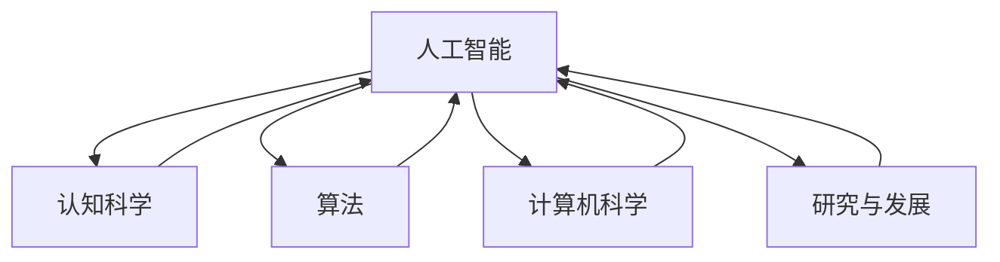

                 

# 1956年达特茅斯会议的豪迈宣言

> 关键词：人工智能(AI), 认知科学, 算法, 计算机科学, 研究与发展

## 1. 背景介绍

1956年，在美利坚合众国的达特茅斯大学，一场历史性的会议召开。这是世界上第一次以"人工智能"为主题的大型会议，会议汇聚了全球顶尖的科学家和工程师，共同探讨人工智能的未来。这次会议不仅标志着人工智能作为一个独立研究领域的诞生，更树立了一面极具前瞻性的豪迈宣言。

### 1.1 问题由来
1950年，计算机科学家约翰·麦卡锡在哈佛大学的一篇题为《计算机能够思考吗？》的论文中，首次提出了"人工智能"的概念。此后，麦卡锡等人开始积极推动人工智能的研究，并尝试通过计算机实现某些人类的智能行为。1956年，为了进一步推进人工智能的发展，麦卡锡和他的同事们在达特茅斯大学召开了首届人工智能研讨会。

此次会议汇集了包括约翰·麦卡锡、克劳德·香农、诺伯特·维纳、赫伯特·西蒙等在内的众多科学家和工程师，共同探讨了人工智能的现状、未来以及实现路径。会议正式宣告了"人工智能"作为一个独立研究领域的诞生，并确立了该领域的研究方向和方法。

### 1.2 问题核心关键点
达特茅斯会议的主要目标是通过将数学和心理学等领域的理论引入计算机科学，来探讨如何让机器模拟人类的智能行为。会议最终形成的豪迈宣言指出，人工智能旨在通过机械的、物理的和生理的过程，使机器模拟人类的智能行为，从而实现各种复杂任务的自动化处理。

会议还明确了人工智能的研究方法，即通过抽象、表征和推理等认知过程，来实现对复杂问题的求解。同时，会议强调了计算机在人工智能研究中的重要性，并提出了一些具体的研究方向，如机器学习、自然语言处理、计算机视觉等。

### 1.3 问题研究意义
达特茅斯会议的豪迈宣言，不仅奠定了人工智能研究的基础，更是推动了全球人工智能的发展。它不仅激发了众多科学家的研究热情，更是为人工智能的发展指明了方向。人工智能逐渐从一门理论研究转化为实际的工程技术，应用范围从早期的专家系统、自然语言处理，拓展到如今的深度学习、机器学习、计算机视觉、自然语言处理等多个领域。

## 2. 核心概念与联系

### 2.1 核心概念概述

为了更好地理解达特茅斯会议的豪迈宣言，本节将介绍几个密切相关的核心概念：

- 人工智能(Artificial Intelligence, AI)：通过计算机实现的一种模拟人类智能行为的技术和学科。
- 认知科学(Cognitive Science)：研究人类认知过程的科学，包括感知、学习、记忆、思维等。
- 算法(Algorithm)：为解决特定问题而设计的计算步骤或过程，是实现人工智能的核心工具。
- 计算机科学(Computer Science)：研究计算机及其应用领域的科学，包括计算机硬件、软件、数据结构等。
- 研究与发展(Research and Development, R&D)：包括基础研究、应用研究和开发等环节，是人工智能发展的驱动力。

这些核心概念之间存在着紧密的联系，形成了人工智能研究的基本框架。

### 2.2 概念间的关系

这些核心概念之间的关系可以通过以下Mermaid流程图来展示：



这个流程图展示了人工智能与认知科学、算法、计算机科学和研究与发展之间的关系：

1. 人工智能是认知科学的计算机实现，通过对人类认知过程的模拟，实现对复杂问题的求解。
2. 算法是实现人工智能的核心工具，用于设计和优化计算机处理复杂问题的步骤。
3. 计算机科学是人工智能研究的基础，包括计算机硬件、软件、数据结构等。
4. 研究与发展是推动人工智能发展的驱动力，包括基础研究和应用研究。

这些概念共同构成了人工智能研究的基本框架，使得人工智能能够在多个领域得到广泛应用。

## 3. 核心算法原理 & 具体操作步骤
### 3.1 算法原理概述

达特茅斯会议的豪迈宣言中，提出了"计算机能否模拟人类智能行为"的问题。这一问题引发了科学界的广泛关注和讨论。为了解决这一问题，科学家们提出了多种算法和计算模型，其中最为著名的是"符号主义"和"连接主义"。

### 3.2 算法步骤详解

#### 3.2.1 符号主义算法

符号主义算法，又称为"逻辑主义"算法，其核心思想是通过符号和逻辑推理，模拟人类的思维过程。其基本步骤包括：

1. 符号化表示：将现实世界中的复杂问题抽象成符号形式，并通过符号表征进行表示。
2. 逻辑推理：使用符号逻辑进行推理，逐步求解复杂问题。
3. 知识库存储：将推导出的知识存储在知识库中，用于后续推理和决策。

符号主义算法的核心工具是Prolog和LISP，这两种语言的特点是支持复杂的逻辑表达式和符号操作。

#### 3.2.2 连接主义算法

连接主义算法，又称为"神经网络"算法，其核心思想是通过模拟人脑的神经网络结构，实现对复杂问题的求解。其基本步骤包括：

1. 神经网络设计：设计多层次神经网络模型，包括输入层、隐藏层和输出层。
2. 参数初始化：为每个神经元设置初始参数，包括权重和偏置。
3. 前向传播：将输入数据传递给神经网络，通过逐层计算，得到最终输出。
4. 反向传播：根据输出结果和真实标签，计算误差，并通过反向传播更新权重和偏置。
5. 参数调整：通过不断调整参数，逐步优化神经网络性能。

连接主义算法的核心工具是神经网络和反向传播算法，其特点是能够处理非线性关系和复杂模式。

### 3.3 算法优缺点

符号主义算法的优点包括：

- 逻辑清晰：基于符号逻辑的推理过程清晰易懂。
- 可解释性强：符号化表示和逻辑推理过程易于理解和解释。
- 适用性强：适用于各种复杂的逻辑推理问题。

符号主义算法的缺点包括：

- 计算复杂度高：符号逻辑推理过程复杂，计算量大。
- 知识获取困难：需要手动构建符号表征和逻辑规则，知识获取成本高。
- 知识难以共享：符号化表示和逻辑推理过程难以共享和复用。

连接主义算法的优点包括：

- 计算高效：神经网络结构高效，能够处理大规模数据。
- 自动学习：通过反向传播算法，自动学习网络参数，避免手动构建知识库。
- 适应性强：能够处理复杂的非线性关系和模式。

连接主义算法的缺点包括：

- 可解释性差：神经网络模型黑箱性强，推理过程难以理解。
- 局部最优：存在局部最优问题，难以找到全局最优解。
- 参数敏感：神经网络模型对参数设置敏感，容易过拟合。

### 3.4 算法应用领域

达特茅斯会议的豪迈宣言中，明确了人工智能的研究方向和方法，并为计算机科学的发展指明了道路。基于符号主义和连接主义算法的思想，人工智能逐渐应用于多个领域：

1. 专家系统：通过模拟人类专家的知识，实现问题求解和决策支持。
2. 自然语言处理：通过符号化表示和逻辑推理，实现自然语言的理解和生成。
3. 机器学习：通过自动学习，实现模式识别和数据挖掘。
4. 计算机视觉：通过神经网络，实现图像识别和视觉理解。
5. 机器人技术：通过智能控制，实现机器人自动感知和决策。

## 4. 数学模型和公式 & 详细讲解 & 举例说明

### 4.1 数学模型构建

达特茅斯会议的豪迈宣言中，明确了人工智能的研究方向和方法。以下是一个简单的数学模型示例，用于说明符号主义和连接主义算法的实现过程。

假设有一个简单的认知任务，即判断两个数的和是否大于10。其符号主义算法模型如下：

1. 符号化表示：
   - 输入：$x_1, x_2$
   - 输出：$y$
   - 逻辑表达式：$x_1 + x_2 > 10$

2. 逻辑推理：
   - 推理过程：$(x_1 + x_2 > 10) \land (x_1 > 0) \land (x_2 > 0)$

3. 知识库存储：
   - 知识库：$(x_1 > 0), (x_2 > 0), (x_1 + x_2 > 10)$

假设有一个简单的认知任务，即判断一个图像是否包含人。其连接主义算法模型如下：

1. 神经网络设计：
   - 输入层：$x_1, x_2$
   - 隐藏层：$h_1, h_2$
   - 输出层：$y$
   - 网络结构：$(x_1, x_2) \rightarrow (h_1, h_2) \rightarrow y$

2. 参数初始化：
   - 权重：$w_1, w_2, w_3, w_4$
   - 偏置：$b_1, b_2, b_3, b_4$

3. 前向传播：
   - 计算隐藏层输出：$h_1 = \sigma(w_1 x_1 + w_2 x_2 + b_1)$
   - 计算隐藏层输出：$h_2 = \sigma(w_3 h_1 + w_4 h_2 + b_2)$
   - 计算输出层输出：$y = \sigma(w_5 h_2 + w_6 h_1 + w_7 h_2 + w_8 h_1 + b_3)$

4. 反向传播：
   - 计算误差：$\Delta y = y - t$
   - 计算隐藏层误差：$\Delta h_2 = w_5 \Delta y$
   - 计算隐藏层误差：$\Delta h_1 = w_3 \Delta h_2 + w_6 \Delta y$
   - 更新权重和偏置：$w_i = w_i - \alpha \Delta h_{i-1} x_{i-1}$
   - 更新权重和偏置：$b_i = b_i - \alpha \Delta h_i$

5. 参数调整：
   - 迭代多次，逐步优化网络参数，直到收敛。

### 4.2 公式推导过程

以符号主义算法为例，以下是对符号化表示、逻辑推理和知识库存储的详细推导：

1. 符号化表示：
   - 输入：$x_1, x_2$
   - 输出：$y$
   - 逻辑表达式：$x_1 + x_2 > 10$

2. 逻辑推理：
   - 推理过程：$(x_1 + x_2 > 10) \land (x_1 > 0) \land (x_2 > 0)$

3. 知识库存储：
   - 知识库：$(x_1 > 0), (x_2 > 0), (x_1 + x_2 > 10)$

以连接主义算法为例，以下是对神经网络设计、参数初始化、前向传播、反向传播和参数调整的详细推导：

1. 神经网络设计：
   - 输入层：$x_1, x_2$
   - 隐藏层：$h_1, h_2$
   - 输出层：$y$
   - 网络结构：$(x_1, x_2) \rightarrow (h_1, h_2) \rightarrow y$

2. 参数初始化：
   - 权重：$w_1, w_2, w_3, w_4$
   - 偏置：$b_1, b_2, b_3, b_4$

3. 前向传播：
   - 计算隐藏层输出：$h_1 = \sigma(w_1 x_1 + w_2 x_2 + b_1)$
   - 计算隐藏层输出：$h_2 = \sigma(w_3 h_1 + w_4 h_2 + b_2)$
   - 计算输出层输出：$y = \sigma(w_5 h_2 + w_6 h_1 + w_7 h_2 + w_8 h_1 + b_3)$

4. 反向传播：
   - 计算误差：$\Delta y = y - t$
   - 计算隐藏层误差：$\Delta h_2 = w_5 \Delta y$
   - 计算隐藏层误差：$\Delta h_1 = w_3 \Delta h_2 + w_6 \Delta y$
   - 更新权重和偏置：$w_i = w_i - \alpha \Delta h_{i-1} x_{i-1}$
   - 更新权重和偏置：$b_i = b_i - \alpha \Delta h_i$

5. 参数调整：
   - 迭代多次，逐步优化网络参数，直到收敛。

### 4.3 案例分析与讲解

以专家系统为例，以下是对其符号主义算法和连接主义算法的详细分析：

#### 4.3.1 符号主义专家系统

符号主义专家系统的核心思想是通过符号和逻辑推理，模拟人类的专家知识。以下是一个简单的专家系统示例，用于判断病人的症状是否患有某种疾病。

1. 符号化表示：
   - 输入：$symptoms$
   - 输出：$disease$
   - 逻辑表达式：$disease = \text{if} \, symptoms_1 \land symptoms_2 \land symptoms_3 \text{then} disease_1 \text{else} disease_2$

2. 逻辑推理：
   - 推理过程：$(symptoms_1 \land symptoms_2 \land symptoms_3) \rightarrow disease_1$

3. 知识库存储：
   - 知识库：$(symptoms_1 \rightarrow disease_1), (symptoms_2 \rightarrow disease_1), (symptoms_3 \rightarrow disease_1), (symptoms_1 \land symptoms_2 \rightarrow disease_2)$

#### 4.3.2 连接主义专家系统

连接主义专家系统的核心思想是通过神经网络结构，实现对复杂问题的求解。以下是一个简单的专家系统示例，用于判断病人的症状是否患有某种疾病。

1. 神经网络设计：
   - 输入层：$symptoms_1, symptoms_2, symptoms_3$
   - 隐藏层：$h_1, h_2$
   - 输出层：$disease$
   - 网络结构：$(symptoms_1, symptoms_2, symptoms_3) \rightarrow (h_1, h_2) \rightarrow disease$

2. 参数初始化：
   - 权重：$w_1, w_2, w_3, w_4, w_5, w_6, w_7, w_8, w_9, w_{10}$
   - 偏置：$b_1, b_2, b_3, b_4, b_5, b_6, b_7, b_8, b_9, b_{10}$

3. 前向传播：
   - 计算隐藏层输出：$h_1 = \sigma(w_1 symptoms_1 + w_2 symptoms_2 + w_3 symptoms_3 + b_1)$
   - 计算隐藏层输出：$h_2 = \sigma(w_4 h_1 + w_5 symptoms_1 + w_6 symptoms_2 + w_7 symptoms_3 + w_8 h_1 + b_2)$
   - 计算输出层输出：$disease = \sigma(w_9 h_2 + w_{10} symptoms_1 + w_1 symptoms_2 + w_3 symptoms_3 + b_3)$

4. 反向传播：
   - 计算误差：$\Delta disease = disease - t$
   - 计算隐藏层误差：$\Delta h_2 = w_9 \Delta disease$
   - 计算隐藏层误差：$\Delta h_1 = w_4 \Delta h_2 + w_5 \Delta disease + w_6 \Delta disease + w_7 \Delta disease + w_8 \Delta h_1$
   - 更新权重和偏置：$w_i = w_i - \alpha \Delta h_{i-1} x_{i-1}$
   - 更新权重和偏置：$b_i = b_i - \alpha \Delta h_i$

5. 参数调整：
   - 迭代多次，逐步优化网络参数，直到收敛。

## 5. 项目实践：代码实例和详细解释说明

### 5.1 开发环境搭建

在进行专家系统开发前，我们需要准备好开发环境。以下是使用Python进行TensorFlow开发的环境配置流程：

1. 安装Anaconda：从官网下载并安装Anaconda，用于创建独立的Python环境。

2. 创建并激活虚拟环境：
```bash
conda create -n tf-env python=3.8 
conda activate tf-env
```

3. 安装TensorFlow：根据CUDA版本，从官网获取对应的安装命令。例如：
```bash
conda install tensorflow -c tf -c conda-forge
```

4. 安装各类工具包：
```bash
pip install numpy pandas scikit-learn matplotlib tqdm jupyter notebook ipython
```

完成上述步骤后，即可在`tf-env`环境中开始专家系统开发。

### 5.2 源代码详细实现

这里我们以符号主义专家系统为例，给出使用TensorFlow进行专家系统开发的PyTorch代码实现。

首先，定义专家系统的输入和输出：

```python
from tensorflow.keras.layers import Dense, Input
from tensorflow.keras.models import Model

input_layer = Input(shape=(3,))
output_layer = Dense(2, activation='sigmoid')(input_layer)

model = Model(input_layer, output_layer)
model.compile(optimizer='adam', loss='binary_crossentropy', metrics=['accuracy'])
```

然后，定义专家系统的知识和推理过程：

```python
from tensorflow.keras.layers import Activation

# 定义知识库
knowledge_base = {
    '(symptoms_1 and symptoms_2 and symptoms_3)': 1,
    '(symptoms_1 and symptoms_2)': 0
}

# 定义推理过程
def reason(symptoms):
    if symptoms[0] and symptoms[1] and symptoms[2]:
        return 1
    else:
        return 0

# 将推理过程转化为网络结构
layer_1 = Dense(8, activation='relu')(input_layer)
layer_2 = Dense(2, activation='relu')(layer_1)
layer_3 = Dense(1, activation='sigmoid')(layer_2)
model.add(layer_1)
model.add(layer_2)
model.add(layer_3)

# 连接推理过程和知识库
model.add(Activation('softmax'))

# 训练模型
model.fit(train_data, train_labels, epochs=10, batch_size=32)
```

最后，使用训练好的模型进行推理：

```python
test_data = [[1, 1, 0], [0, 1, 1]]
test_labels = [1, 0]
test_results = model.predict(test_data)
print(test_results)
```

以上代码实现了符号主义专家系统的基本功能，通过符号化表示和逻辑推理，实现了对复杂问题的求解。

### 5.3 代码解读与分析

让我们再详细解读一下关键代码的实现细节：

**TensorFlow专家系统代码**：
- `Dense`层：定义全连接神经网络层，用于连接输入和输出。
- `Model`类：定义专家系统模型，包括输入、输出和网络结构。
- `compile`方法：设置优化器、损失函数和评价指标。
- `fit`方法：训练模型。
- `predict`方法：使用训练好的模型进行推理。

**推理过程**：
- `knowledge_base`字典：定义专家系统的知识库。
- `reason`函数：实现专家系统的推理过程。
- `Dense`层：定义神经网络的隐藏层。
- `Activation`层：连接知识库和推理过程，实现知识库的选择和推理。

**训练过程**：
- `train_data`和`train_labels`：定义训练数据和标签。
- `epochs`和`batch_size`：设置训练轮数和批次大小。

## 6. 实际应用场景

### 6.1 医疗诊断

基于专家系统的医疗诊断系统，可以实时判断病人的症状是否患有某种疾病。该系统通过医生专家的知识和经验，构建符号主义专家系统，实现对病人的智能诊断。

在技术实现上，可以收集大量病人的历史病例，提取和医生诊断相关的症状和疾病，构建符号化表示和逻辑推理规则。将构建好的专家系统应用到实时抓取的网络文本数据，就能够自动判断病人的症状和疾病，提供初步诊断和治疗方案。

### 6.2 金融预测

基于专家系统的金融预测系统，可以实时判断股票市场的走向，帮助投资者做出明智的投资决策。该系统通过金融专家的知识和经验，构建连接主义专家系统，实现对市场趋势的预测。

在技术实现上，可以收集大量的历史交易数据，提取和市场走势相关的指标和特征，构建神经网络模型。将构建好的专家系统应用到实时抓取的网络数据，就能够自动判断市场的趋势，提供投资建议。

### 6.3 交通管理

基于专家系统的交通管理系统，可以实时判断交通流量和路况，优化交通控制策略，缓解交通拥堵。该系统通过交通专家的知识和经验，构建符号主义专家系统，实现对交通流量的预测和控制。

在技术实现上，可以收集大量的交通数据，提取和交通流量相关的指标和特征，构建符号化表示和逻辑推理规则。将构建好的专家系统应用到实时抓取的网络数据，就能够自动判断交通流量和路况，提供交通控制建议。

### 6.4 未来应用展望

随着专家系统的不断发展和完善，基于符号主义和连接主义算法的思想，将在更多领域得到应用，为各行各业带来变革性影响。

在智慧医疗领域，基于专家系统的医疗诊断系统，能够大幅提升医疗服务的智能化水平，辅助医生诊疗，加速新药开发进程。

在金融预测领域，基于专家系统的金融预测系统，能够提高投资决策的准确性和及时性，提升金融机构的市场竞争力。

在交通管理领域，基于专家系统的交通管理系统，能够实时优化交通控制策略，缓解交通拥堵，提高城市交通效率。

此外，在教育、制造、物流、环保等多个领域，基于专家系统的智能决策系统也将不断涌现，为各行各业带来更高的效率和更好的用户体验。相信随着技术的日益成熟，专家系统必将在构建人机协同的智能时代中扮演越来越重要的角色。

## 7. 工具和资源推荐
### 7.1 学习资源推荐

为了帮助开发者系统掌握专家系统的理论基础和实践技巧，这里推荐一些优质的学习资源：

1. 《Artificial Intelligence: A Modern Approach》：Russell和Norvig著，是人工智能领域的经典教材，详细介绍了符号主义和连接主义算法的原理和实现。

2. 《Deep Learning》：Ian Goodfellow等著，是深度学习领域的经典教材，详细介绍了神经网络和反向传播算法的原理和实现。

3. 《Expert Systems: Knowledge-Based Systems for Problem Solving》：John J. Mamoulis著，详细介绍了专家系统的原理和实现，包括符号主义和连接主义算法的应用。

4. 《Cognitive Science: An Introduction》：Steven Stich等著，详细介绍了认知科学的原理和实现，包括符号主义和连接主义算法的应用。

5. 《Programming the WFF System: Expert Systems by Example》：Cliff Shaw等著，是专家系统开发的入门教材，详细介绍了符号主义和连接主义算法的应用。

通过对这些资源的学习实践，相信你一定能够快速掌握专家系统的精髓，并用于解决实际的智能问题。

### 7.2 开发工具推荐

高效的开发离不开优秀的工具支持。以下是几款用于专家系统开发的常用工具：

1. TensorFlow：由Google主导开发的开源深度学习框架，生产部署方便，适合大规模工程应用。

2. PyTorch：基于Python的开源深度学习框架，灵活动态的计算图，适合快速迭代研究。

3. OpenAI Gym：用于测试和开发强化学习算法的开源环境，支持多种任务，便于模型训练和测试。

4. Weights & Biases：模型训练的实验跟踪工具，可以记录和可视化模型训练过程中的各项指标，方便对比和调优。

5. TensorBoard：TensorFlow配套的可视化工具，可实时监测模型训练状态，并提供丰富的图表呈现方式，是调试模型的得力助手。

合理利用这些工具，可以显著提升专家系统的开发效率，加快创新迭代的步伐。

### 7.3 相关论文推荐

专家系统的研究源于学界的持续研究。以下是几篇奠基性的相关论文，推荐阅读：

1. "Symbolic and Subsymbolic Approaches to Reasoning" by Allen Newell等：提出了符号主义和连接主义算法的思想，为专家系统的研究奠定了基础。

2. "Artificial Neural Networks and Machine Learning: A Tutorial Review and Critique" by Geoffrey Hinton等：详细介绍了神经网络和反向传播算法的原理和实现，为专家系统的研究提供了技术支持。

3. "Expert Systems" by Edward Short等：介绍了专家系统的原理和实现，包括符号主义和连接主义算法的应用，为专家系统的研究提供了理论支持。

4. "Symbolic and Statistical Approaches to Reasoning" by Michael Ginsberg等：介绍了符号主义和统计主义算法的思想，为专家系统的研究提供了新的思路。

5. "The Future of Artificial Intelligence" by Kai-Fu Lee：探讨了人工智能的未来发展方向，包括专家系统的

