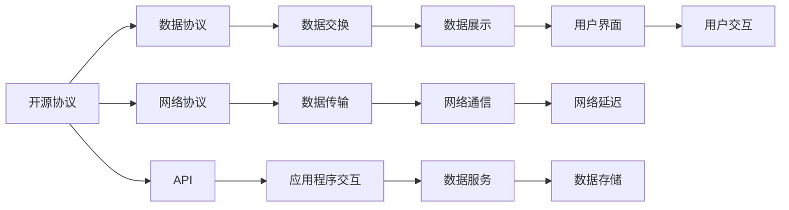

                 

# 广泛使用的开源协议和数据协议

> 关键词：开源协议,数据协议,网络协议,数据格式,API,RESTful API

## 1. 背景介绍

在现代信息化社会中，开源协议和数据协议无处不在，它们是网络通信、数据交换的基础。无论是Web服务、移动应用、还是物联网设备，几乎所有数据交互都依赖于这些协议和格式。因此，理解开源协议和数据协议的重要性不言而喻。本文将详细介绍几种广泛使用的开源协议和数据协议，以及它们的应用场景和技术细节。

## 2. 核心概念与联系

### 2.1 核心概念概述

- **开源协议**：指在互联网上的软件、硬件、数据协议等规范，其代码和规范公开，任何人都可以免费使用、修改和分发。常见的开源协议包括HTTP、HTTPS、SMTP、POP3、IMAP等。

- **数据协议**：指用于数据传输和交换的标准化协议，它定义了数据的格式、编码、传输方式等。常见的数据协议包括JSON、XML、CSV、Protocol Buffers等。

- **网络协议**：指在互联网上通信双方遵循的规则和约定，它定义了数据的格式、传输方式、错误处理等。常见的网络协议包括TCP/IP、UDP、FTP、SSH等。

- **API**：应用程序编程接口，它定义了应用程序之间的交互方式，通过API可以实现不同系统、平台、语言之间的通信和数据交换。常见的API包括RESTful API、SOAP API、gRPC API等。

- **RESTful API**：基于REST架构风格的API，它通过HTTP协议进行通信，支持CRUD（Create、Read、Update、Delete）操作，具有简单易用、可扩展性强等特点。

### 2.2 核心概念的关系

这些核心概念之间的关系可以用以下Mermaid流程图表示：



这个流程图展示了这些概念之间的相互关系：

1. **开源协议**定义了数据传输的标准，是**数据协议**的基础。
2. **网络协议**负责数据的传输，是**数据交换**的前提。
3. **API**定义了应用程序的交互方式，通过**数据协议**实现数据交换。
4. **数据展示**和**用户交互**最终通过**API**与**数据协议**实现数据的展示和处理。

## 3. 核心算法原理 & 具体操作步骤

### 3.1 算法原理概述

开源协议和数据协议的原理主要涉及以下几个方面：

- **数据格式定义**：协议规定了数据在传输时的格式，如JSON、XML等。
- **编码方式**：协议定义了数据的编码方式，如Base64、UTF-8等。
- **传输协议**：协议规定了数据的传输方式，如TCP、UDP等。
- **错误处理**：协议定义了错误处理的机制，如重传、超时等。
- **安全性**：协议确保数据传输的安全性，如HTTPS、SSL/TLS等。

### 3.2 算法步骤详解

以RESTful API为例，其核心步骤包括：

1. **设计API接口**：定义API的URL、请求方式、请求参数、响应格式等。
2. **实现API逻辑**：开发服务器端的API逻辑，处理请求、查询数据库、生成响应等。
3. **部署API服务**：将API部署到服务器上，设置访问权限、负载均衡等。
4. **客户端调用**：客户端通过HTTP协议访问API接口，发送请求，接收响应。

### 3.3 算法优缺点

**优点**：

- **免费使用**：开源协议和数据协议通常免费提供，降低了企业成本。
- **广泛应用**：广泛被业界接受，易于集成和扩展。
- **易学易用**：API设计简洁明了，易于理解和实现。

**缺点**：

- **复杂性**：不同协议之间存在差异，需要开发者有一定的技术储备。
- **安全性问题**：某些协议（如HTTP）存在安全漏洞，需要采取额外的安全措施。
- **兼容性问题**：不同系统之间的兼容性问题可能导致数据传输失败。

### 3.4 算法应用领域

开源协议和数据协议广泛应用于各个领域，包括：

- **Web服务**：如HTTP、HTTPS、RESTful API等。
- **移动应用**：如JSON、XML、SOAP API等。
- **物联网设备**：如MQTT、CoAP、AMQP等。
- **大数据处理**：如HDFS、Hive、Spark等。
- **数据库系统**：如MySQL、PostgreSQL、MongoDB等。

## 4. 数学模型和公式 & 详细讲解 & 举例说明

### 4.1 数学模型构建

以HTTP协议为例，其数学模型可以表示为：

- **请求模型**：
  $$
  R = \{M, H, C, V\}
  $$
  其中 $M$ 表示方法（GET、POST等），$H$ 表示头部信息（Content-Type、Accept等），$C$ 表示请求体，$V$ 表示请求版本。

- **响应模型**：
  $$
  R' = \{S, H', C', V'\}
  $$
  其中 $S$ 表示状态码，$H'$ 表示头部信息，$C'$ 表示响应体，$V'$ 表示响应版本。

### 4.2 公式推导过程

以HTTP请求为例，其公式推导如下：

- **请求体生成**：
  $$
  C = \{e_1, e_2, ..., e_n\}
  $$
  其中 $e_i$ 表示请求体中的元素。

- **头部信息生成**：
  $$
  H = \{K_1, V_1, K_2, V_2, ..., K_m, V_m\}
  $$
  其中 $K_i$ 和 $V_i$ 分别表示头部信息中的键和值。

- **请求模型构建**：
  $$
  R = \{M, H, C, V\}
  $$

### 4.3 案例分析与讲解

以RESTful API为例，其案例分析如下：

- **用户注册API**：
  - **URL**：`/api/users/register`
  - **请求方式**：`POST`
  - **请求参数**：`name, email, password`
  - **请求体格式**：`application/json`
  - **请求示例**：
    ```json
    {
      "name": "张三",
      "email": "zhangsan@example.com",
      "password": "123456"
    }
    ```

- **服务器端处理**：
  - **请求处理**：
    1. 解析请求头、请求体、参数。
    2. 查询数据库，创建用户账户。
    3. 生成响应，包含用户ID、token等信息。
  - **响应格式**：`application/json`
  - **响应示例**：
    ```json
    {
      "userId": 1,
      "token": "eyJhbGciOiJIUzI1NiIsInR5cCI6IkpXVCJ9..."
    }
    ```

## 5. 项目实践：代码实例和详细解释说明

### 5.1 开发环境搭建

以下是在Python环境下搭建RESTful API服务器的示例：

1. 安装Python和Flask：
   ```bash
   pip install flask
   ```

2. 编写服务器代码：
   ```python
   from flask import Flask, request

   app = Flask(__name__)

   @app.route('/api/users/register', methods=['POST'])
   def register():
       name = request.json.get('name')
       email = request.json.get('email')
       password = request.json.get('password')
       # 此处省略具体业务逻辑
       return {'userId': 1, 'token': 'eyJhbGciOiJIUzI1NiIsInR5cCI6IkpXVCJ9...'}, 200
   ```

3. 运行服务器：
   ```bash
   python app.py
   ```

### 5.2 源代码详细实现

以下是一个简单的JSON-RPC客户端代码示例：

```python
import requests

url = 'http://localhost:5000/api/users/register'
data = {
    'name': '张三',
    'email': 'zhangsan@example.com',
    'password': '123456'
}

response = requests.post(url, json=data)
print(response.json())
```

### 5.3 代码解读与分析

- **Flask框架**：Flask是一个轻量级的Python Web框架，用于快速开发Web应用。
- **请求解析**：使用Flask的`request`对象解析请求头、请求体和参数。
- **响应生成**：将响应结果转换为JSON格式，返回HTTP状态码200。

### 5.4 运行结果展示

运行上述代码后，服务器返回的响应为：

```json
{
  "userId": 1,
  "token": "eyJhbGciOiJIUzI1NiIsInR5cCI6IkpXVCJ9..."
}
```

## 6. 实际应用场景

### 6.1 Web服务

- **HTTP协议**：广泛用于Web应用的请求和响应，如HTTPS、RESTful API等。
- **JSON-RPC**：用于远程过程调用，适用于不同语言之间的通信。

### 6.2 移动应用

- **XML-RPC**：用于移动应用中的远程数据交换。
- **SOAP API**：用于企业级应用中的服务调用。

### 6.3 物联网设备

- **MQTT**：轻量级、低带宽、高实时性的消息传输协议，广泛应用于物联网设备。
- **CoAP**：适用于物联网设备的简单、易用的API。

## 7. 工具和资源推荐

### 7.1 学习资源推荐

1. **《HTTP权威指南》**：详细介绍了HTTP协议的各个方面，是HTTP协议学习的经典教材。
2. **《JSON数据格式与解析》**：介绍了JSON格式的基本概念和解析方法，是JSON学习的入门读物。
3. **《RESTful API设计》**：讲解了RESTful API的设计原则和最佳实践，适合API设计初学者。

### 7.2 开发工具推荐

1. **Postman**：常用的API测试工具，支持多种协议和格式的请求和响应。
2. **Swagger**：API文档生成工具，可以自动生成API文档，方便开发者和用户使用。
3. **Visual Studio Code**：轻量级的开发环境，支持Python、JavaScript等多种语言和框架。

### 7.3 相关论文推荐

1. **《RESTful API的设计原则》**：详细介绍了RESTful API的设计原则和最佳实践。
2. **《JSON-RPC协议规范》**：详细介绍了JSON-RPC协议的规范和用法。
3. **《MQTT协议规范》**：详细介绍了MQTT协议的规范和用法。

## 8. 总结：未来发展趋势与挑战

### 8.1 研究成果总结

开源协议和数据协议在现代信息化社会中发挥着重要的作用，其研究和应用不断推进。未来，随着技术的进步，这些协议和格式将进一步发展和完善，为数据传输和交换提供更高效、更安全、更可靠的解决方案。

### 8.2 未来发展趋势

- **安全性提升**：随着网络攻击手段的不断升级，开源协议和数据协议的安全性将得到进一步提升，如HTTPS、SSL/TLS等。
- **跨协议融合**：不同协议之间的融合将更加紧密，如RESTful API与WebSocket、MQTT等协议的结合。
- **边缘计算支持**：随着边缘计算的兴起，开源协议和数据协议将更多地应用于边缘设备，提高数据传输效率。

### 8.3 面临的挑战

- **协议兼容性**：不同协议之间的兼容性问题可能引发数据传输失败。
- **安全漏洞**：某些协议可能存在安全漏洞，需要采取额外的安全措施。
- **协议扩展性**：新的应用场景和需求不断出现，协议需要不断扩展以满足新的需求。

### 8.4 研究展望

- **跨协议通信**：研究不同协议之间的通信机制，实现跨协议的数据交换。
- **协议安全性**：进一步提升协议的安全性，防范网络攻击。
- **协议标准化**：推动协议的标准化工作，促进不同系统之间的互操作性。

## 9. 附录：常见问题与解答

**Q1: 开源协议和数据协议有什么不同？**

A: 开源协议是指在互联网上公开的通信规则和规范，定义了数据传输的格式和方式。而数据协议则是定义了数据交换的标准化格式，如JSON、XML等。

**Q2: RESTful API和JSON-RPC有什么区别？**

A: RESTful API基于HTTP协议，使用标准的CRUD操作，支持多种数据格式。而JSON-RPC则是使用JSON格式进行远程过程调用，适用于不同语言之间的通信。

**Q3: MQTT和CoAP有什么区别？**

A: MQTT是轻量级、低带宽、高实时性的消息传输协议，适用于物联网设备的简单、易用的消息传输。而CoAP则是一种基于HTTP协议的简单、易用的API，适用于物联网设备的简单通信。

---

作者：禅与计算机程序设计艺术 / Zen and the Art of Computer Programming

