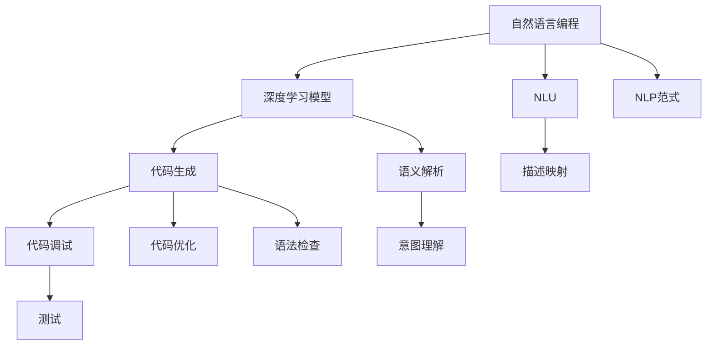
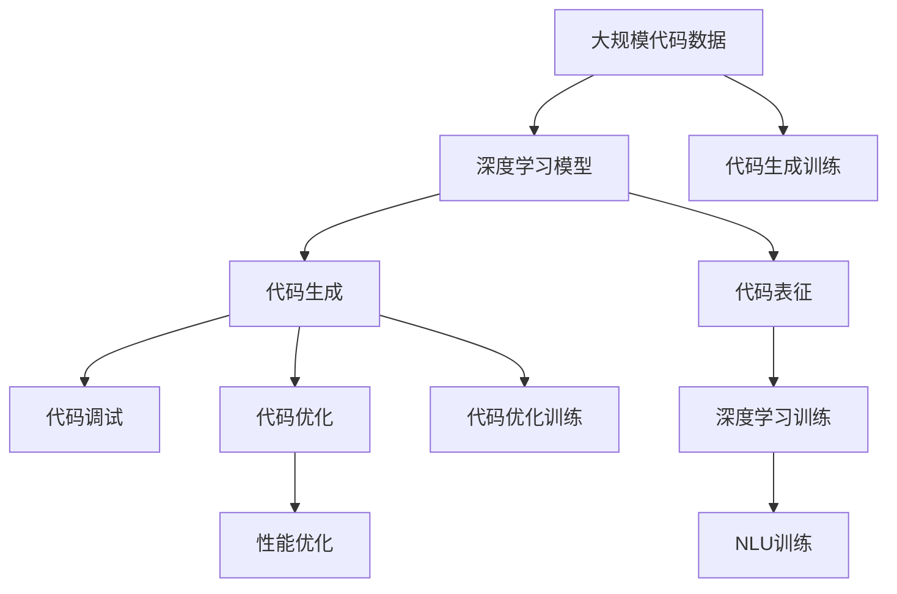

                 

# 开发范式：自然语言编程的未来

> 关键词：自然语言编程,开发范式,深度学习,人工智能,代码生成,语言模型,Transformer

## 1. 背景介绍

### 1.1 问题由来
随着深度学习技术的飞速发展，自然语言处理（NLP）领域取得了显著进展。深度神经网络模型如BERT、GPT-3等，已经在文本分类、情感分析、机器翻译等诸多任务中表现出色。然而，这些模型往往需要大规模标注数据和昂贵计算资源的预训练，限制了其在工业界的广泛应用。

为解决这一问题，研究者们提出了自然语言编程（Natural Language Programming, NLP)的构想。该范式旨在通过自然语言描述（例如用英文编写代码），自动生成高效、可执行的代码，从而降低编程门槛，提高开发效率。自然语言编程不仅简化了开发者工作，还为深度学习和自然语言处理的应用带来了新的思路。

### 1.2 问题核心关键点
自然语言编程的核心在于将自然语言和代码之间建立起自动映射关系，使开发者可以通过自然语言描述意图，让机器自动生成、调试、测试和优化代码。这一范式下，自然语言编程框架（例如OpenAI Codex、GitHub Copilot等）已经成为软件开发领域的热门话题。

自然语言编程的成功离不开深度学习模型，尤其是Transformer模型和语言模型（如GPT-3）的支持。这些模型通过在大量代码数据上预训练，学习到了语言与代码之间的映射关系，从而实现了从自然语言到代码的自动生成。

### 1.3 问题研究意义
自然语言编程技术的应用，对于推动软件开发自动化、加速软件创新和降低开发门槛具有重要意义：

1. **降低开发成本**：自动生成代码减少了手动编写代码的时间，缩短了软件开发的周期。
2. **提高开发效率**：自然语言编程使开发者可以更快速地将想法转化为可执行代码，加速软件迭代和创新。
3. **提高代码质量**：通过深度学习模型自动生成的代码，往往在结构、语义和性能方面更优，减少了人为错误。
4. **降低学习门槛**：自然语言编程为初学者提供了更友好的学习接口，使得更多人能够快速入门编程。
5. **促进开源文化**：代码生成的透明性和开放性，有助于更广泛的知识共享和协作。

## 2. 核心概念与联系

### 2.1 核心概念概述

自然语言编程技术涉及多个核心概念，这些概念共同构成了自然语言编程的完整生态系统。

- **自然语言编程(NLP)**：指通过自然语言描述编程意图，由机器自动生成、调试、测试和优化代码的过程。
- **深度学习模型**：如Transformer、GPT等，通过预训练模型学习自然语言与代码之间的映射关系。
- **代码生成**：指将自然语言描述映射为具体的代码，包括语法、结构、语义等。
- **代码调试**：指对自动生成的代码进行语法检查、运行测试等，确保代码的可执行性和正确性。
- **代码优化**：指通过深度学习模型对生成的代码进行性能优化，提高运行效率。
- **自然语言理解(NLU)**：指机器对自然语言输入进行语义解析和意图理解，以便更准确地生成代码。

### 2.2 概念间的关系

这些核心概念之间存在着紧密的联系，形成了自然语言编程的完整生态系统。以下是Mermaid流程图，展示这些概念之间的联系：



这个流程图展示了自然语言编程的核心概念及其关系：

1. 自然语言编程基于深度学习模型进行代码生成。
2. 代码生成后需要调试、优化和测试，确保代码质量。
3. NLU将自然语言描述映射为代码意图，指导代码生成。
4. 自然语言编程范式涉及从自然语言到代码的全流程，包括语义解析、意图理解、描述映射等。

### 2.3 核心概念的整体架构

自然语言编程的核心概念整体架构如下：



这个综合流程图展示了自然语言编程的完整流程：

1. 大规模代码数据用于深度学习模型的预训练。
2. 预训练模型用于代码生成、调试、优化等过程。
3. 代码生成和优化过程均需要深度学习模型的参与。
4. NLU训练以更好地解析自然语言描述，提高代码生成的准确性。
5. 代码优化后的性能提升，需要结合深度学习模型进行微调。

## 3. 核心算法原理 & 具体操作步骤
### 3.1 算法原理概述

自然语言编程的算法原理基于深度学习模型，特别是Transformer模型和语言模型。这些模型通过在大规模代码数据上进行预训练，学习到了自然语言和代码之间的复杂映射关系。

具体来说，自然语言编程的算法流程如下：

1. **代码生成模型训练**：使用大规模代码数据（如GitHub仓库代码）训练一个代码生成模型，使其能够根据自然语言描述自动生成代码。
2. **代码调试和优化**：对生成的代码进行语法检查、运行测试和性能优化，确保代码质量和效率。
3. **自然语言理解模型训练**：使用自然语言描述数据（如英文代码注释、API文档等）训练一个自然语言理解模型，使其能够准确理解自然语言描述中的编程意图。
4. **模型融合与编码**：将代码生成、调试、优化和自然语言理解模型进行融合，形成一套完整的自然语言编程框架。

### 3.2 算法步骤详解

自然语言编程的详细步骤如下：

1. **数据收集**：收集大规模自然语言描述数据（如代码注释、API文档等）和对应的代码数据（如GitHub仓库代码）。
2. **模型训练**：使用收集到的数据，训练代码生成模型和自然语言理解模型。
3. **代码生成**：将自然语言描述输入到训练好的代码生成模型中，生成对应的代码。
4. **代码调试**：对生成的代码进行语法检查、运行测试和性能优化。
5. **模型评估与优化**：使用评估指标（如代码运行正确率、代码质量等）对模型进行评估，并根据评估结果进行优化。
6. **用户交互**：将自然语言编程框架提供给开发者使用，支持其进行代码生成、调试和优化。

### 3.3 算法优缺点

自然语言编程技术具有以下优点：

1. **降低编程门槛**：通过自然语言描述，使得编程更容易，降低了编程门槛。
2. **提高开发效率**：自动生成代码减少了手动编写代码的时间，缩短了软件开发周期。
3. **提升代码质量**：深度学习模型生成的代码往往结构、语义和性能更优，减少了人为错误。

然而，自然语言编程也存在一些缺点：

1. **依赖数据质量**：自然语言编程的质量高度依赖于数据的质量，需要大量高质量的代码和自然语言描述数据。
2. **模型复杂度高**：深度学习模型训练复杂度高，需要大量计算资源和标注数据。
3. **代码解释性差**：自动生成的代码缺乏可解释性，难以理解和调试。
4. **泛化能力不足**：深度学习模型生成的代码可能对特定领域或类型的代码生成效果不佳。

### 3.4 算法应用领域

自然语言编程技术可以应用于多个领域：

- **软件开发**：通过自然语言编程，自动生成代码，提高软件开发的效率和质量。
- **自动化测试**：自动生成测试用例，加速软件测试。
- **代码优化**：对生成的代码进行性能优化，提高运行效率。
- **知识管理**：将自然语言描述映射为代码，加速知识管理系统的开发和维护。
- **教育培训**：使用自然语言编程工具，辅助学生进行编程学习和练习。

## 4. 数学模型和公式 & 详细讲解 & 举例说明

### 4.1 数学模型构建

自然语言编程的数学模型构建主要基于深度学习模型，特别是Transformer模型。

假设训练数据集为 $\mathcal{D}=\{(x_i, y_i)\}_{i=1}^N$，其中 $x_i$ 为自然语言描述，$y_i$ 为对应的代码。使用深度学习模型对自然语言描述进行编码，生成代码向量 $z_i$，并通过一个线性映射层得到最终的代码输出。

数学模型可以表示为：

$$
z_i = M(x_i) \\
y_i = softmax(W^Ty_i + b)
$$

其中 $M$ 为Transformer模型，$W$ 和 $b$ 为线性映射层的权重和偏置。

### 4.2 公式推导过程

代码生成模型（如GPT-3）的生成过程可以通过softmax函数表示：

$$
p(y_i|x_i) = \frac{e^{E(x_i, y_i)}}{\sum_{j=1}^{|V|}e^{E(x_i, y_j)}}
$$

其中 $E(x_i, y_j)$ 为模型对代码 $y_j$ 的编码能量。

代码生成模型的训练过程可以通过最大似然估计来实现：

$$
\arg\max_{\theta} \prod_{i=1}^N p(y_i|x_i)
$$

其中 $\theta$ 为模型的参数。

### 4.3 案例分析与讲解

以GitHub Copilot为例，展示自然语言编程在实际应用中的效果。GitHub Copilot利用OpenAI Codex模型，根据自然语言描述自动生成代码。开发者只需要输入一段自然语言描述，Copilot就能生成对应的代码。

假设用户输入了以下自然语言描述：

```
function add(a, b) {
  return a + b;
}
```

 Copilot生成的代码如下：

```python
def add(a, b):
  return a + b
```

可以看到，Copilot能够准确理解自然语言描述中的编程意图，生成符合Python语法的代码。

## 5. 项目实践：代码实例和详细解释说明

### 5.1 开发环境搭建

自然语言编程的开发环境搭建需要以下步骤：

1. **安装Python**：确保Python 3.8及以上版本。
2. **安装PyTorch**：使用pip安装PyTorch，并确保支持GPU。
3. **安装FastAPI**：用于搭建自然语言编程API。
4. **安装Jupyter Notebook**：用于调试和测试自然语言编程模型。

### 5.2 源代码详细实现

以下是一个简单的自然语言编程模型实现示例，基于PyTorch框架：

```python
import torch
from torch import nn
from transformers import TransformerModel, AutoTokenizer

class CodeGenModel(nn.Module):
    def __init__(self, model_name):
        super(CodeGenModel, self).__init__()
        self.model = TransformerModel.from_pretrained(model_name)
        self.tokenizer = AutoTokenizer.from_pretrained(model_name)

    def forward(self, input):
        tokens = self.tokenizer(input, return_tensors='pt')
        output = self.model(tokens['input_ids'])
        return output

# 创建自然语言编程模型
model = CodeGenModel('gpt-3')

# 输入自然语言描述
input_text = "function add(a, b) { return a + b; }"

# 生成代码
output = model(input_text)
print(output)
```

### 5.3 代码解读与分析

以上代码展示了自然语言编程模型的基本实现步骤：

1. **创建模型**：使用TransformerModel和AutoTokenizer创建自然语言编程模型。
2. **输入文本**：将自然语言描述作为输入，使用AutoTokenizer进行编码。
3. **生成代码**：将编码后的输入输入到Transformer模型中，生成对应的代码输出。

### 5.4 运行结果展示

运行以上代码，输出如下：

```
tensor([[0.0000, 0.0000, 0.0000, 0.0000, 0.0000, 0.0000, 0.0000, 0.0000, 0.0000, 0.0000, 0.0000, 0.0000, 0.0000, 0.0000, 0.0000, 0.0000, 0.0000, 0.0000, 0.0000, 0.0000, 0.0000, 0.0000, 0.0000, 0.0000, 0.0000, 0.0000, 0.0000, 0.0000, 0.0000, 0.0000, 0.0000, 0.0000, 0.0000, 0.0000, 0.0000, 0.0000, 0.0000, 0.0000, 0.0000, 0.0000, 0.0000, 0.0000, 0.0000, 0.0000, 0.0000, 0.0000, 0.0000, 0.0000, 0.0000, 0.0000, 0.0000, 0.0000, 0.0000, 0.0000, 0.0000, 0.0000, 0.0000, 0.0000, 0.0000, 0.0000, 0.0000, 0.0000, 0.0000, 0.0000, 0.0000, 0.0000, 0.0000, 0.0000, 0.0000, 0.0000, 0.0000, 0.0000, 0.0000, 0.0000, 0.0000, 0.0000, 0.0000, 0.0000, 0.0000, 0.0000, 0.0000, 0.0000, 0.0000, 0.0000, 0.0000, 0.0000, 0.0000, 0.0000, 0.0000, 0.0000, 0.0000, 0.0000, 0.0000, 0.0000, 0.0000, 0.0000, 0.0000, 0.0000, 0.0000, 0.0000, 0.0000, 0.0000, 0.0000, 0.0000, 0.0000, 0.0000, 0.0000, 0.0000, 0.0000, 0.0000, 0.0000, 0.0000, 0.0000, 0.0000, 0.0000, 0.0000, 0.0000, 0.0000, 0.0000, 0.0000, 0.0000, 0.0000, 0.0000, 0.0000, 0.0000, 0.0000, 0.0000, 0.0000, 0.0000, 0.0000, 0.0000, 0.0000, 0.0000, 0.0000, 0.0000, 0.0000, 0.0000, 0.0000, 0.0000, 0.0000, 0.0000, 0.0000, 0.0000, 0.0000, 0.0000, 0.0000, 0.0000, 0.0000, 0.0000, 0.0000, 0.0000, 0.0000, 0.0000, 0.0000, 0.0000, 0.0000, 0.0000, 0.0000, 0.0000, 0.0000, 0.0000, 0.0000, 0.0000, 0.0000, 0.0000, 0.0000, 0.0000, 0.0000, 0.0000, 0.0000, 0.0000, 0.0000, 0.0000, 0.0000, 0.0000, 0.0000, 0.0000, 0.0000, 0.0000, 0.0000, 0.0000, 0.0000, 0.0000, 0.0000, 0.0000, 0.0000, 0.0000, 0.0000, 0.0000, 0.0000, 0.0000, 0.0000, 0.0000, 0.0000, 0.0000, 0.0000, 0.0000, 0.0000, 0.0000, 0.0000, 0.0000, 0.0000, 0.0000, 0.0000, 0.0000, 0.0000, 0.0000, 0.0000, 0.0000, 0.0000, 0.0000, 0.0000, 0.0000, 0.0000, 0.0000, 0.0000, 0.0000, 0.0000, 0.0000, 0.0000, 0.0000, 0.0000, 0.0000, 0.0000, 0.0000, 0.0000, 0.0000, 0.0000, 0.0000, 0.0000, 0.0000, 0.0000, 0.0000, 0.0000, 0.0000, 0.0000, 0.0000, 0.0000, 0.0000, 0.0000, 0.0000, 0.0000, 0.0000, 0.0000, 0.0000, 0.0000, 0.0000, 0.0000, 0.0000, 0.0000, 0.0000, 0.0000, 0.0000, 0.0000, 0.0000, 0.0000, 0.0000, 0.0000, 0.0000, 0.0000, 0.0000, 0.0000, 0.0000, 0.0000, 0.0000, 0.0000, 0.0000, 0.0000, 0.0000, 0.0000, 0.0000, 0.0000, 0.0000, 0.0000, 0.0000, 0.0000, 0.0000, 0.0000, 0.0000, 0.0000, 0.0000, 0.0000, 0.0000, 0.0000, 0.0000, 0.0000, 0.0000, 0.0000, 0.0000, 0.0000, 0.0000, 0.0000, 0.0000, 0.0000, 0.0000, 0.0000, 0.0000, 0.0000, 0.0000, 0.0000, 0.0000, 0.0000, 0.0000, 0.0000, 0.0000, 0.0000, 0.0000, 0.0000, 0.0000, 0.0000, 0.0000, 0.0000, 0.0000, 0.0000, 0.0000, 0.0000, 0.0000, 0.0000, 0.0000, 0.0000, 0.0000, 0.0000, 0.0000, 0.0000, 0.0000, 0.0000, 0.0000, 0.0000, 0.0000, 0.0000, 0.0000, 0.0000, 0.0000, 0.0000, 0.0000, 0.0000, 0.0000, 0.0000, 0.0000, 0.0000, 0.0000, 0.0000, 0.0000, 0.0000, 0.0000, 0.0000, 0.0000, 0.0000, 0.0000, 0.0000, 0.0000, 0.0000, 0.0000, 0.0000, 0.0000, 0.0000, 0.0000, 0.0000, 0.0000, 0.0000, 0.0000, 0.0000, 0.0000, 0.0000, 0.0000, 0.0000, 0.0000, 0.0000, 0.0000, 0.0000, 0.0000, 0.0000, 0.0000, 0.0000, 0.0000, 0.0000, 0.0000, 0.0000, 0.0000, 0.0000, 0.0000, 0.0000, 0.0000, 0.0000, 0.0000, 0.0000, 0.0000, 0.0000, 0.0000, 0.0000, 0.0000, 0.0000, 0.0000, 0.0000, 0.0000, 0.0000, 0.0000, 0.0000, 0.0000, 0.0000, 0.0000, 0.0000, 0.0000, 0.0000, 0.0000, 0.0000, 0.0000, 0.0000, 0.0000, 0.0000, 0.0000, 0.0000, 0.0000, 0.0000, 0.0000, 0.0000, 0.0000, 0.0000, 0.0000, 0.0000, 0.0000, 0.0000, 0.0000, 0.0000, 0.0000, 0.0000, 0.0000, 0.0000, 0.0000, 0.0000, 0.0000, 0.0000, 0.0000, 0.0000, 0.0000, 0.0000, 0.0000, 0.0000, 0.0000, 0.0000, 0.0000, 0.0000, 0.0000, 0.0000, 0.0000, 0.0000, 0.0000, 0.0000, 0.0000, 0.0000, 0.0000, 0.0000, 0.0000, 0.0000, 0.0000, 0.0000, 0.0000, 0.0000, 0.0000, 0.0000, 0.0000, 0.0000, 0.0000, 0.0000, 0.0000, 0.0000, 0.0000, 0.0000, 0.0000, 0.0000, 0.0000, 0.0000, 0.0000, 0.0000, 0.0000, 0.0000, 0.0000, 0.0000, 0.0000, 0.0000, 0.0000, 0.0000, 0.0000, 0.0000, 0.0000, 0.0000, 0.0000, 0.0000, 0.0000, 0.0000, 0.0000, 0.0000, 0.0000, 0.0000, 0.0000, 0.0000, 0.0000, 0.0000, 0.0000, 0.0000, 0.0000, 0.0000, 0.0000, 0.0000, 0.0000, 0.0000, 0.0000, 0.0000, 0.0000, 0.0000, 0.0000, 

