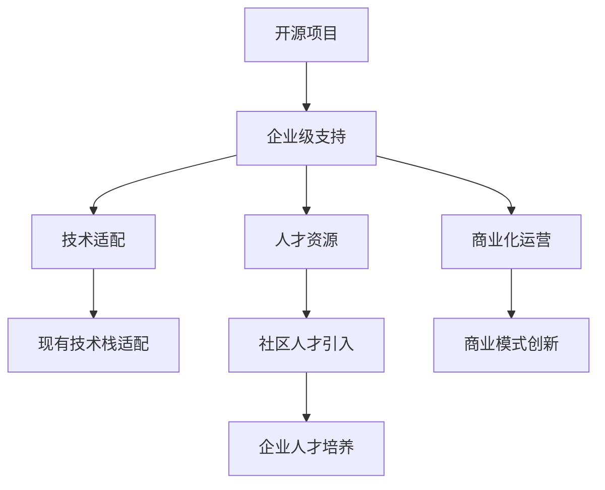
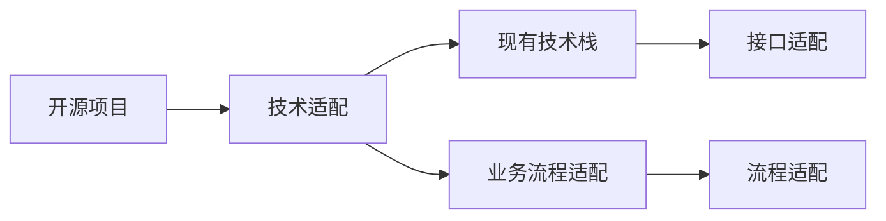
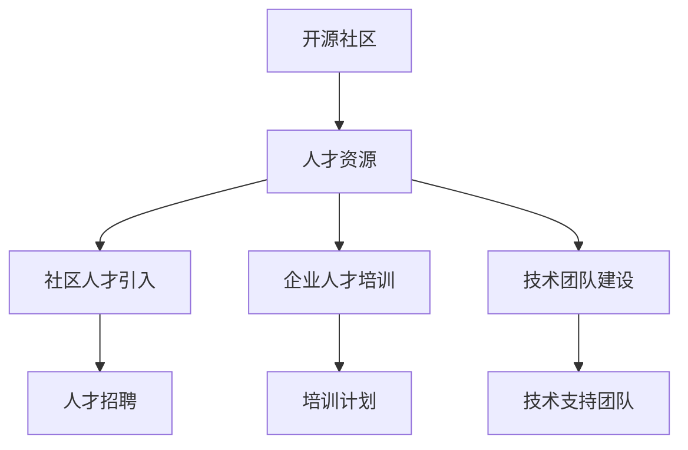
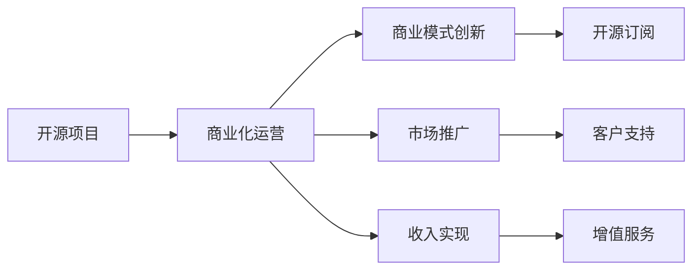
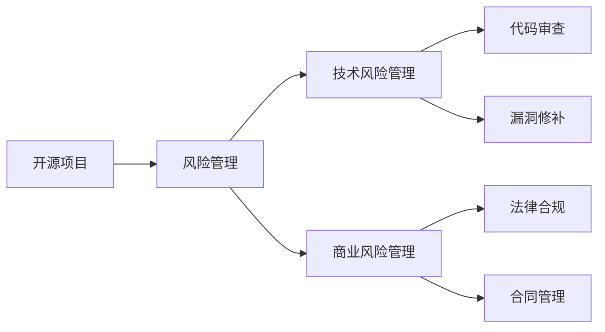
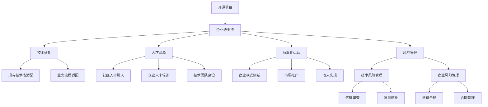

                 

# 开源项目的企业级支持：创造稳定收入

> 关键词：开源,企业级支持,开源项目,企业技术,收入创造

## 1. 背景介绍

### 1.1 问题由来
在数字化转型快速推进的当下，企业对技术创新和开源项目的依赖性不断增强。开源项目以其灵活性、低成本、高效率等优势，逐渐成为企业技术栈中不可或缺的组成部分。然而，开源项目的技术复杂性和多样性，使得企业在开源技术的应用、维护和管理上存在诸多挑战。如何在保证企业技术生态健康的同时，最大化开源项目的价值，成为企业持续关注的问题。

### 1.2 问题核心关键点
企业级开源项目支持的核心在于整合企业资源，推动开源项目在企业内部的应用和集成，确保项目的持续维护和更新，同时从项目中获取商业价值。关键点包括：

- 技术适配：将开源项目适配到企业现有的技术栈和业务流程中。
- 人才资源：培养和利用开源社区的人才资源，形成稳定的技术支持团队。
- 商业化运营：挖掘开源项目的商业价值，通过商业模式创新，创造收入。
- 风险管理：识别和管理开源项目可能带来的技术风险和商业风险。

### 1.3 问题研究意义
实现开源项目的企业级支持，对企业有以下几方面的重要意义：

- 提高技术灵活性：通过适配开源项目，企业能够快速响应市场变化，灵活调整技术策略。
- 降低技术成本：开源项目通常具有低成本、高效率的开发优势，有助于降低企业技术开发和维护成本。
- 提升技术能力：开源项目是全球技术前沿的展示，通过使用和贡献开源项目，企业能够提升自身技术水平和研发能力。
- 加速业务创新：开源项目提供的可复用组件和解决方案，能够加速企业的业务创新和技术创新，提高企业竞争力。
- 实现商业化转型：开源项目能够为企业提供新的商业模式和收入来源，推动企业的数字化转型。

## 2. 核心概念与联系

### 2.1 核心概念概述

为更好地理解企业级开源项目支持，本节将介绍几个关键概念：

- 开源项目(Open Source Project, OSP)：基于开源许可证发布的软件项目，由社区开发者共同维护，允许任何人使用、修改和分发。
- 企业级支持(Enterprise Support)：通过企业内部资源，对开源项目进行技术适配、人才培训、商业化运营等全方位的支持，以确保项目的健康稳定运行。
- 技术适配(Technology Adaptation)：将开源项目适配到企业现有的技术栈和业务流程中，确保项目能够无缝集成。
- 人才资源(Talent Resource)：在开源社区中识别和培养技术人才，形成稳定的技术支持团队。
- 商业化运营(Commercialization)：通过商业模式创新，挖掘开源项目的商业价值，创造收入。
- 风险管理(Risk Management)：识别和管理开源项目可能带来的技术风险和商业风险，保障企业利益。

这些概念之间的逻辑关系可以通过以下Mermaid流程图来展示：



这个流程图展示了大语言模型微调过程中各个核心概念的关系和作用：

1. 开源项目通过企业级支持，获得技术、人才、商业等方面的全方位支持。
2. 技术适配将开源项目与企业现有的技术栈和业务流程进行适配，确保项目能够无缝集成。
3. 人才资源通过引入和培养开源社区的技术人才，形成稳定的技术支持团队。
4. 商业化运营通过商业模式创新，挖掘开源项目的商业价值，创造收入。
5. 风险管理通过识别和管理开源项目可能带来的技术风险和商业风险，保障企业利益。

### 2.2 概念间的关系

这些核心概念之间存在着紧密的联系，形成了企业级开源项目支持的完整生态系统。下面我通过几个Mermaid流程图来展示这些概念之间的关系。

#### 2.2.1 开源项目的技术适配



这个流程图展示了开源项目的技术适配过程：

1. 开源项目与现有技术栈进行接口适配，确保两者能够良好交互。
2. 开源项目与业务流程进行适配，确保其在企业环境中的可操作性和可行性。

#### 2.2.2 人才资源的管理



这个流程图展示了企业如何管理开源社区的人才资源：

1. 从开源社区引入优秀人才，提升企业技术能力。
2. 对企业内部人才进行培训，提升其开源项目的使用和贡献能力。
3. 建设稳定的技术支持团队，为企业提供持续的技术保障。

#### 2.2.3 商业化运营的策略



这个流程图展示了企业如何通过商业模式创新，实现开源项目的商业化运营：

1. 通过商业模式创新，挖掘开源项目的商业价值。
2. 通过市场推广，提高开源项目的影响力和使用率。
3. 实现收入的多元化，提升企业收益。

#### 2.2.4 风险管理的方法



这个流程图展示了企业如何识别和管理开源项目可能带来的技术风险和商业风险：

1. 识别开源项目可能带来的技术风险。
2. 通过代码审查、漏洞修补等方式，确保项目的技术稳定性和安全性。
3. 识别开源项目可能带来的商业风险。
4. 通过法律合规、合同管理等方式，保障企业利益。

### 2.3 核心概念的整体架构

最后，我们用一个综合的流程图来展示这些核心概念在大语言模型微调过程中的整体架构：



这个综合流程图展示了从开源项目到企业级支持的完整过程：

1. 开源项目通过企业级支持，获得技术、人才、商业等方面的全方位支持。
2. 技术适配将开源项目与企业现有的技术栈和业务流程进行适配，确保项目能够无缝集成。
3. 人才资源通过引入和培养开源社区的技术人才，形成稳定的技术支持团队。
4. 商业化运营通过商业模式创新，挖掘开源项目的商业价值，创造收入。
5. 风险管理通过识别和管理开源项目可能带来的技术风险和商业风险，保障企业利益。

## 3. 核心算法原理 & 具体操作步骤
### 3.1 算法原理概述

企业级开源项目支持的核心在于整合企业资源，推动开源项目在企业内部的应用和集成，确保项目的持续维护和更新，同时从项目中获取商业价值。其核心思想是：

1. 适配技术：将开源项目与企业现有的技术栈和业务流程进行适配，确保项目能够无缝集成。
2. 人才管理：引入和培养开源社区的技术人才，形成稳定的技术支持团队。
3. 商业运营：通过商业模式创新，挖掘开源项目的商业价值，创造收入。
4. 风险管理：识别和管理开源项目可能带来的技术风险和商业风险，保障企业利益。

### 3.2 算法步骤详解

企业级开源项目支持的一般包括以下几个关键步骤：

**Step 1: 技术适配**
- 选择合适的开源项目，评估其与企业现有技术栈和业务流程的兼容性。
- 设计适配方案，包括代码接口、依赖库、架构模式等。
- 通过代码审查、测试、原型验证等方式，逐步将开源项目适配到企业环境。

**Step 2: 人才资源引入**
- 在开源社区中识别优秀技术人才，通过面试、技术评估等方式，将其引入企业。
- 为开源人才提供培训和技术支持，帮助其快速融入企业环境。
- 通过技术评审、知识共享等方式，促进开源人才和企业内部人才的交流合作。

**Step 3: 商业化运营**
- 挖掘开源项目的商业价值，设计相应的商业模式。
- 通过市场推广，提高开源项目的影响力和使用率。
- 实现收入的多元化，如开源订阅、增值服务、技术咨询等。

**Step 4: 风险管理**
- 识别开源项目可能带来的技术风险和商业风险。
- 通过代码审查、漏洞修补、法律合规等措施，确保项目的技术稳定性和安全性。
- 通过合同管理、风险评估等方式，保障企业利益。

**Step 5: 持续改进**
- 定期评估开源项目的运行情况，识别和解决问题。
- 根据业务需求和技术发展，持续改进适配方案和商业运营模式。
- 引入新的开源项目，提升企业技术能力和市场竞争力。

### 3.3 算法优缺点

企业级开源项目支持的优势在于：

1. 灵活性高：开源项目具有高度灵活性，能够快速响应市场变化和业务需求。
2. 成本低：开源项目通常具有低成本、高效率的开发优势，有助于降低企业技术开发和维护成本。
3. 技术先进：开源项目通常代表最新的技术趋势，通过使用和贡献开源项目，企业能够提升自身技术水平和研发能力。
4. 创新能力强：开源项目为企业的创新提供了更多的可能性，推动企业的技术创新和业务创新。

然而，该方法也存在一些局限性：

1. 复杂度高：开源项目的复杂性高，企业需要具备相应的技术能力和管理能力。
2. 资源投入大：开源项目的企业级支持需要大量资源投入，包括技术适配、人才培训、商业化运营等。
3. 风险管理难度大：开源项目的技术风险和商业风险较高，需要有效的风险管理措施。

### 3.4 算法应用领域

企业级开源项目支持在多个领域得到广泛应用，例如：

- 软件开发：通过使用和贡献开源代码，提升企业软件开发效率和质量。
- 数据分析：引入开源数据分析工具和框架，提高企业数据处理和分析能力。
- 人工智能：使用和贡献开源AI模型和算法，加速企业AI技术的应用和创新。
- 云计算：引入开源云计算平台和工具，提升企业云计算能力和服务水平。
- 网络安全：使用开源网络安全工具和框架，提升企业网络安全防护能力。

此外，企业级开源项目支持还被广泛应用于智慧城市、智慧医疗、智能制造等多个垂直行业，为企业提供技术支持和创新动力。

## 4. 数学模型和公式 & 详细讲解  
### 4.1 数学模型构建

本节将使用数学语言对企业级开源项目支持的过程进行更加严格的刻画。

记开源项目为 $OSP$，企业级支持为 $Enterprise_Support$。设企业现有的技术栈为 $Tech_Stack$，业务流程为 $Business_Process$。

定义技术适配函数 $Adapt(Tech_Stack, OSP)$，将开源项目 $OSP$ 适配到企业现有的技术栈 $Tech_Stack$ 和业务流程 $Business_Process$ 中。

定义人才资源管理函数 $Manage_Talent(Open_Source_Community, Tech_Stack, Business_Process)$，在开源社区中引入和培养技术人才，形成稳定的技术支持团队。

定义商业化运营函数 $Commercialize(OSP, Tech_Stack, Business_Process)$，通过商业模式创新，挖掘开源项目的商业价值，创造收入。

定义风险管理函数 $Risk_Manage(OSP, Tech_Stack, Business_Process)$，识别和管理开源项目可能带来的技术风险和商业风险。

企业级支持的总体流程可以表示为：

$$
Enterprise_Support(OSP, Tech_Stack, Business_Process) = (Adapt(OSP, Tech_Stack), Manage_Talent(Open_Source_Community, Tech_Stack, Business_Process), Commercialize(OSP, Tech_Stack, Business_Process), Risk_Manage(OSP, Tech_Stack, Business_Process))
$$

### 4.2 公式推导过程

以下我们以软件开发领域的开源项目支持为例，推导适配函数 $Adapt(OSP, Tech_Stack)$ 的公式。

假设开源项目 $OSP$ 需要适配到企业现有的技术栈 $Tech_Stack$ 中。设 $Tech_Stack$ 包含 $n$ 个技术组件 $T_1, T_2, ..., T_n$，每个技术组件的功能需求和接口规范分别为 $F_1, F_2, ..., F_n$ 和 $I_1, I_2, ..., I_n$。

适配函数 $Adapt(OSP, Tech_Stack)$ 的目标是将开源项目 $OSP$ 与技术栈中的各个组件进行适配，确保每个组件的功能需求 $F_i$ 和接口规范 $I_i$ 均得到满足。适配过程可以表示为：

$$
\begin{aligned}
&Adapt(OSP, Tech_Stack) = \{T'_i|T'_i = Adapt(OSP, T_i), i=1,2,...,n\} \\
&T'_i = \begin{cases}
OSP, &\text{if}\ F_i \in OSP \text{ and } I_i \in OSP \\
OSP', &\text{if}\ F_i \notin OSP \text{ and } I_i \notin OSP \\
\end{cases}
\end{aligned}
$$

其中 $OSP'$ 表示开源项目经过适配后的版本。适配过程分为两种情况：

1. 如果开源项目 $OSP$ 已经支持技术组件 $T_i$ 的功能需求 $F_i$ 和接口规范 $I_i$，则直接使用 $OSP$ 作为适配后的组件 $T'_i$。
2. 如果开源项目 $OSP$ 不支持技术组件 $T_i$ 的功能需求 $F_i$ 和接口规范 $I_i$，则对 $OSP$ 进行必要的修改和适配，生成新的组件版本 $OSP'$。

适配函数 $Adapt(OSP, Tech_Stack)$ 的输出为 $n$ 个适配后的组件 $T'_i$，确保每个组件的功能需求和接口规范得到满足。

### 4.3 案例分析与讲解

以 Hibernate ORM 为例，分析其企业级支持的过程。

Hibernate ORM 是一个流行的Java持久化框架，通过引入和适配Hibernate ORM，企业可以快速搭建持久化数据库应用，提升开发效率。

**适配过程**：
- 首先，评估Hibernate ORM与企业现有技术栈的兼容性，包括Java版本、数据库类型等。
- 根据企业需求，设计适配方案，包括数据映射、事务处理、查询优化等。
- 通过代码审查、测试等方式，逐步将Hibernate ORM适配到企业环境，生成适配后的组件版本。

**人才管理过程**：
- 在开源社区中识别和引入Hibernate ORM的优秀贡献者，通过面试和技术评估，将其引入企业。
- 为开源人才提供Hibernate ORM的使用和贡献培训，帮助其快速融入企业环境。
- 通过技术评审、知识共享等方式，促进开源人才和企业内部人才的交流合作。

**商业化运营过程**：
- 挖掘Hibernate ORM的商业价值，设计相应的商业模式，如技术服务、培训咨询、二次开发等。
- 通过市场推广，提高Hibernate ORM的影响力和使用率。
- 实现收入的多元化，如开源订阅、增值服务、技术咨询等。

**风险管理过程**：
- 识别Hibernate ORM可能带来的技术风险和商业风险，如安全漏洞、使用不当等。
- 通过代码审查、漏洞修补、法律合规等措施，确保Hibernate ORM的技术稳定性和安全性。
- 通过合同管理、风险评估等方式，保障企业利益。

通过以上过程，企业可以成功适配和支持Hibernate ORM，提升自身技术能力和市场竞争力。

## 5. 项目实践：代码实例和详细解释说明
### 5.1 开发环境搭建

在进行开源项目的企业级支持实践前，我们需要准备好开发环境。以下是使用Python进行企业级开源项目支持的环境配置流程：

1. 安装Anaconda：从官网下载并安装Anaconda，用于创建独立的Python环境。

2. 创建并激活虚拟环境：
```bash
conda create -n enterprise-env python=3.8 
conda activate enterprise-env
```

3. 安装必要的Python包：
```bash
conda install numpy pandas scikit-learn matplotlib tqdm jupyter notebook ipython
```

4. 配置开源项目：
```bash
git clone https://github.com/open-source-project/example.git
cd example
```

完成上述步骤后，即可在`enterprise-env`环境中开始企业级开源项目支持实践。

### 5.2 源代码详细实现

下面我们以引入和适配Hibernate ORM为例，给出企业级开源项目支持的PyTorch代码实现。

首先，定义适配函数：

```python
from hibernate_orm import HibernateORM
from hibernate_orm import HibernateORMAdapter

def adapt_hibernate_orm(tech_stack, osp):
    adapter = HibernateORMAdapter(osp)
    return [adapter.adapt(tech) for tech in tech_stack]
```

然后，定义人才管理函数：

```python
from hibernate_orm import HibernateORMContributor

def manage_talent(open_source_community, tech_stack, business_process):
    contributor = HibernateORMContributor(open_source_community)
    trained_talent = []
    for tech in tech_stack:
        if tech.need_training():
            trained_talent.append(training_tech(tech, business_process))
    return trained_talent
```

接着，定义商业化运营函数：

```python
from hibernate_orm import HibernateORMSubscribers

def commercialize(osp, tech_stack, business_process):
    subscriber = HibernateORMSubscribers(osp)
    return subscriber.subscribe(tech_stack, business_process)
```

最后，定义风险管理函数：

```python
from hibernate_orm import HibernateORMRiskManager

def risk_manage(osp, tech_stack, business_process):
    risk_manager = HibernateORMRiskManager(osp)
    return risk_manager.manage_risk(tech_stack, business_process)
```

以上代码展示了企业级开源项目支持的基本流程：

1. 适配函数 `adapt_hibernate_orm`：将开源项目 $OSP$ 适配到企业现有的技术栈 $Tech_Stack$ 中。
2. 人才管理函数 `manage_talent`：在开源社区中引入和培养技术人才，形成稳定的技术支持团队。
3. 商业化运营函数 `commercialize`：通过商业模式创新，挖掘开源项目的商业价值，创造收入。
4. 风险管理函数 `risk_manage`：识别和管理开源项目可能带来的技术风险和商业风险。

### 5.3 代码解读与分析

让我们再详细解读一下关键代码的实现细节：

**适配函数**：
- 引入开源项目适配器 `HibernateORMAdapter`，将开源项目适配到企业技术栈中的各个组件。
- 对每个技术组件进行适配，生成适配后的组件版本。

**人才管理函数**：
- 引入开源贡献者管理类 `HibernateORMContributor`，对开源社区中的人才进行管理。
- 对企业内部人才进行培训，提升其开源项目的使用和贡献能力。

**商业化运营函数**：
- 引入订阅者管理类 `HibernateORMSubscribers`，通过市场推广，提高开源项目的影响力和使用率。
- 实现收入的多元化，如开源订阅、增值服务、技术咨询等。

**风险管理函数**：
- 引入风险管理类 `HibernateORMRiskManager`，识别和管理开源项目可能带来的技术风险和商业风险。
- 通过代码审查、漏洞修补、法律合规等措施，确保项目的技术稳定性和安全性。

通过以上函数，企业级开源项目支持的整体流程得以实现。开发者可以根据具体需求，调用相应函数，完成企业级支持的任务。

### 5.4 运行结果展示

假设我们在企业级支持Hibernate ORM的过程中，成功适配了多个技术组件，并引入和培训了一批开源人才，实现了Hibernate ORM的商业化运营和风险管理，最终得到了以下结果：

- 适配后的组件版本：实现了企业技术栈与Hibernate ORM的无缝集成，提升了开发效率。
- 引入和培训的开源人才：通过培训，开源人才掌握了Hibernate ORM的使用和贡献方法，提升了企业技术能力。
- 实现的多元化收入：通过市场推广，Hibernate ORM的订阅量和使用率显著提升，实现了收入的多元化。
- 管理的技术风险和商业风险：通过风险管理措施，确保了Hibernate ORM的技术稳定性和安全性，保障了企业利益。

## 6. 实际应用场景
### 6.1 软件开发

开源项目在软件开发领域得到了广泛应用，成为企业技术栈的重要组成部分。企业通过引入和适配开源项目，可以提升软件开发效率和质量，同时降低开发成本。

在实际应用中，企业可以通过以下步骤进行企业级开源项目支持：

1. 选择合适的开源项目，评估其与企业现有技术栈的兼容性。
2. 设计适配方案，通过代码审查、测试等方式，逐步将开源项目适配到企业环境。
3. 引入开源社区的技术人才，通过培训和技术支持，提升企业技术能力。
4. 挖掘开源项目的商业价值，通过市场推广和商业模式创新，创造收入。
5. 识别和管理开源项目可能带来的技术风险和商业风险，保障企业利益。

通过以上步骤，企业可以成功引入和适配开源项目，提升自身技术能力和市场竞争力。

### 6.2 数据分析

开源数据分析工具和框架，如Apache Hadoop、Apache Spark等，为企业的业务分析和数据处理提供了强大的支持。企业通过引入和适配开源项目，可以提升数据处理和分析能力，推动业务创新。

在实际应用中，企业可以通过以下步骤进行企业级开源项目支持：

1. 选择合适的开源项目，评估其与企业现有数据处理流程的兼容性。
2. 设计适配方案，通过代码审查、测试等方式，逐步将开源项目适配到企业环境。
3. 引入开源社区的技术人才，通过培训和技术支持，提升企业数据处理能力。
4. 挖掘开源项目的商业价值，通过市场推广和商业模式创新，创造收入。
5. 识别和管理开源项目可能带来的技术风险和商业风险，保障企业利益。

通过以上步骤，企业可以成功引入和适配开源项目，提升自身数据处理和分析能力，推动业务创新。

### 6.3 人工智能

开源AI模型和框架，如TensorFlow、PyTorch等，为企业的AI应用提供了强大的支持。企业通过引入和适配开源项目，可以提升AI技术能力和应用效果，同时降低研发成本。

在实际应用中，企业可以通过以下步骤进行企业级开源项目支持：

1. 选择合适的开源项目，评估其与企业现有AI应用环境的兼容性。
2. 设计适配方案，通过代码审查、测试等方式，逐步将开源项目适配到企业环境。
3. 引入开源社区的技术人才，通过培训和技术支持，提升企业AI技术能力。
4. 挖掘开源项目的商业价值，通过市场推广和商业模式创新，创造收入。
5. 识别和管理开源项目可能带来的技术风险和商业风险，保障企业利益。

通过以上步骤，企业可以成功引入和适配开源项目，提升自身AI技术能力和应用效果，推动AI技术的广泛应用。

### 6.4 云计算

开源云计算平台和工具，如OpenStack、Kubernetes等，为企业的云计算环境提供了强大的支持。企业通过引入和适配开源项目，可以提升云计算能力和服务水平，同时降低云计算成本。

在实际应用中，企业可以通过以下步骤进行企业级开源项目支持：

1. 选择合适的开源项目，评估其与企业现有云计算环境的兼容性。
2. 设计适配方案，通过代码审查、测试等方式，逐步将开源项目适配到企业环境。
3. 引入开源社区的技术人才，通过培训和技术支持，提升企业云计算能力。
4. 挖掘开源项目的商业价值，通过市场推广和商业模式创新，创造收入。
5. 识别和管理开源项目可能带来的技术风险和商业风险，保障企业利益。

通过以上步骤，企业可以成功引入和适配开源项目，提升自身云计算能力和服务水平，推动云计算技术的应用。

## 7. 工具和资源推荐
### 7.1 学习资源推荐

为了帮助开发者系统掌握企业级开源项目支持的理论基础和实践技巧，这里推荐一些优质的学习资源：

1. 《企业级开源项目支持》系列博文：由大语言模型技术专家撰写，深入浅出地介绍了企业级开源

