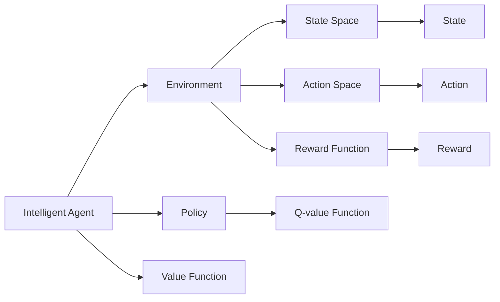
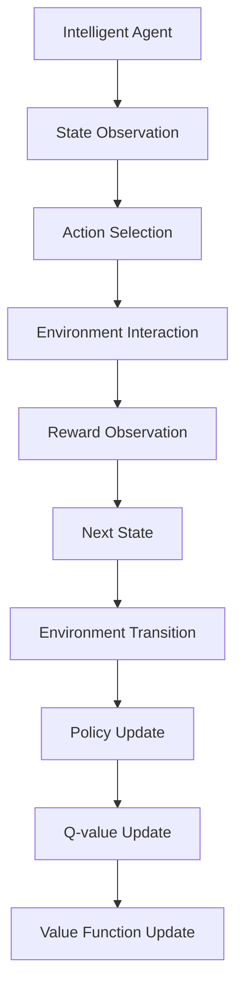
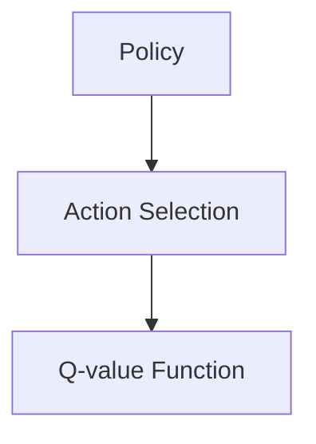
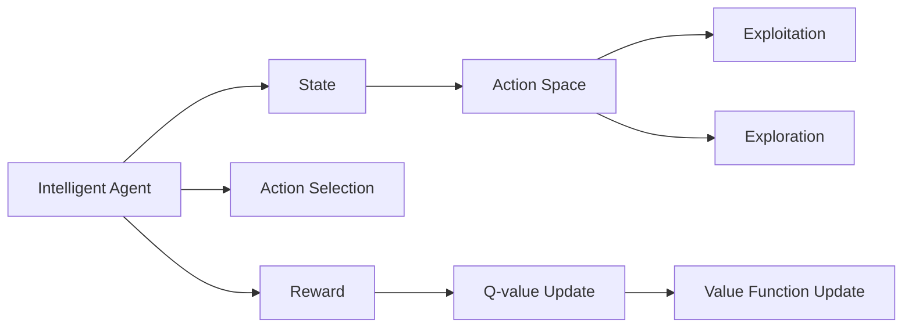
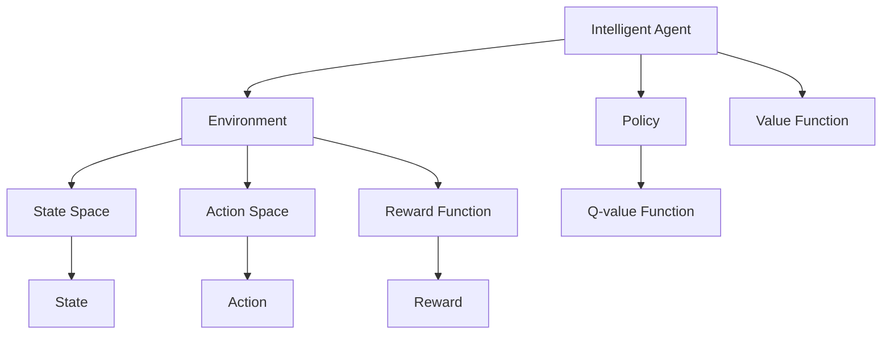

                 

# 强化学习Reinforcement Learning原理与核心算法概述

## 1. 背景介绍

### 1.1 问题由来
强化学习（Reinforcement Learning, RL）作为人工智能领域的三大技术分支之一，近年来因其在各种复杂决策问题中的出色表现而广受关注。与传统的监督学习和无监督学习不同，强化学习强调通过与环境的交互，通过试错的方式学习最优决策策略。其核心思想是让智能体（Agent）通过与环境（Environment）的互动，最大化预定义的奖励（Reward），从而实现目标任务的自动化。

强化学习技术在自动驾驶、游戏AI、机器人控制、智能推荐系统等多个领域取得了显著的成果。例如AlphaGo就通过强化学习在围棋游戏中达到了人类的水平，并在后续的比赛中战胜了世界冠军。这些成功的案例证明了强化学习的强大潜力，使其成为现代AI技术的重要组成部分。

### 1.2 问题核心关键点
强化学习技术的关键在于如何设计智能体的决策策略，以及如何优化智能体的决策过程。核心问题包括：

- 环境建模：环境建模是指对智能体所处的外部世界进行精确描述，包括状态空间、动作空间和奖励函数等。
- 策略学习：智能体的策略学习是指在不断与环境交互的过程中，智能体通过学习策略最大化累计奖励。
- 探索与利用：探索是指智能体在未知环境中尝试新策略，利用是指在已知环境中采取已验证的策略。
- 学习效率与鲁棒性：如何在保证学习效率的同时，提升决策策略的鲁棒性，避免因环境变化导致性能下降。

### 1.3 问题研究意义
强化学习技术的研究和应用具有重要意义，包括：

- 提升自动化水平：通过强化学习，机器能够自动优化决策过程，实现任务自动化。
- 推动智能系统创新：强化学习为智能系统带来了新的决策范式，促进了技术创新。
- 降低人工干预成本：强化学习能够自动优化策略，减少人工干预的频率和成本。
- 提高决策效果：强化学习模型能够通过不断的学习，适应复杂环境，提高决策的准确性和效果。

## 2. 核心概念与联系

### 2.1 核心概念概述
为更好地理解强化学习的核心概念，本节将介绍几个紧密相关的核心概念：

- 智能体（Agent）：强化学习中的智能体，代表决策者，可以是人或机器。
- 环境（Environment）：智能体所处的外部世界，由状态空间、动作空间和奖励函数等组成。
- 状态（State）：环境中的当前状态，智能体根据状态采取行动。
- 动作（Action）：智能体对环境的操作或决策。
- 奖励（Reward）：智能体采取动作后环境给予的反馈信号，用于评估决策的好坏。
- Q值函数（Q-value Function）：评估策略在当前状态下采取某动作后累积奖励的期望值。
- 策略（Policy）：智能体选择动作的规则或映射，用于指导智能体采取何种动作。
- 值函数（Value Function）：评估当前状态下的最佳动作，或评估当前策略的期望累积奖励。
- 探索与利用（Exploration and Exploitation）：在未知状态空间中探索新动作，在已知状态空间中利用已验证的动作。

这些核心概念之间的逻辑关系可以通过以下Mermaid流程图来展示：



这个流程图展示了一组核心概念的相互关系：

- 智能体与环境相互作用，接收状态反馈和奖励。
- 智能体的策略指导其采取动作，并评估动作的Q值和价值。
- 智能体通过不断的探索与利用，学习最优策略。

### 2.2 概念间的关系

这些核心概念之间存在着紧密的联系，形成了强化学习的完整生态系统。下面我通过几个Mermaid流程图来展示这些概念之间的关系。

#### 2.2.1 强化学习的整体架构



这个流程图展示了强化学习的整体架构：

- 智能体观察当前状态，选择动作，与环境交互。
- 环境根据动作返回奖励和下一个状态。
- 智能体根据奖励和下一个状态更新策略和Q值函数。
- 智能体通过更新价值函数，评估当前策略的长期效果。

#### 2.2.2 策略与Q值函数的联系



这个流程图展示了策略与Q值函数之间的关系：

- 策略指导智能体选择动作。
- Q值函数评估动作的期望累积奖励，用于指导策略的更新。

#### 2.2.3 探索与利用策略



这个流程图展示了探索与利用策略的运作过程：

- 智能体根据当前状态和动作空间选择动作。
- 在未知状态下探索新动作，在已知状态下利用已验证的动作。
- 通过奖励反馈更新Q值和价值函数，优化策略。

### 2.3 核心概念的整体架构

最后，我们用一个综合的流程图来展示这些核心概念在强化学习中的整体架构：



这个综合流程图展示了强化学习中核心概念的完整架构：

- 智能体与环境交互，观察状态。
- 智能体根据策略选择动作，观察奖励。
- 智能体根据奖励和状态更新策略和Q值函数。
- 智能体通过更新价值函数，评估策略的长期效果。

通过这些流程图，我们可以更清晰地理解强化学习中的各个核心概念及其相互关系，为后续深入讨论具体的强化学习算法和方法奠定基础。

## 3. 核心算法原理 & 具体操作步骤
### 3.1 算法原理概述

强化学习的核心算法包括Q-learning、SARSA、Deep Q-Network（DQN）等，这些算法通过不断与环境交互，学习最优决策策略。

强化学习算法的核心思想是利用Q值函数来指导智能体的决策过程。Q值函数$Q(s,a)$表示智能体在状态$s$下采取动作$a$的期望累积奖励。通过不断更新Q值函数，智能体可以逐步学习到最优决策策略。

强化学习的核心步骤包括：

1. 观察当前状态$s_t$。
2. 选择动作$a_t$。
3. 与环境交互，观察奖励$r_{t+1}$和下一个状态$s_{t+1}$。
4. 根据奖励和下一个状态，更新Q值函数。
5. 返回步骤1，重复执行上述步骤直到终止。

### 3.2 算法步骤详解

以Q-learning算法为例，具体介绍其操作步骤：

**Q-learning算法：**

1. 初始化Q值函数：$Q(s,a) = 0$，对于所有状态-动作对$(s,a)$。
2. 观察当前状态$s_t$，选择动作$a_t$，与环境交互，观察奖励$r_{t+1}$和下一个状态$s_{t+1}$。
3. 根据奖励和下一个状态，更新Q值函数：
   $$
   Q(s_t, a_t) = Q(s_t, a_t) + \alpha (r_{t+1} + \gamma \max Q(s_{t+1}, a) - Q(s_t, a_t))
   $$
   其中$\alpha$为学习率，$\gamma$为折扣因子。
4. 返回步骤2，重复执行上述步骤直到终止。

通过不断的迭代，Q-learning算法逐步学习到最优决策策略。具体步骤如下：

1. 初始化Q值函数：对于每个状态-动作对$(s,a)$，设定$Q(s,a) = 0$。
2. 观察当前状态$s_t$，选择动作$a_t$，与环境交互，观察奖励$r_{t+1}$和下一个状态$s_{t+1}$。
3. 根据奖励和下一个状态，更新Q值函数：
   $$
   Q(s_t, a_t) = Q(s_t, a_t) + \alpha (r_{t+1} + \gamma \max Q(s_{t+1}, a) - Q(s_t, a_t))
   $$
   其中$\alpha$为学习率，$\gamma$为折扣因子。
4. 返回步骤2，重复执行上述步骤直到终止。

### 3.3 算法优缺点

**Q-learning算法：**

**优点：**

- 算法简单，易于实现。
- 能够处理离散动作空间。
- 可以扩展到连续动作空间。

**缺点：**

- 需要大量样本才能收敛到最优策略。
- 可能会陷入局部最优。
- 在环境动态变化时，可能无法快速适应。

**SARSA算法：**

**优点：**

- 相比Q-learning，更易于稳定收敛。
- 能够处理离散动作空间。
- 可以扩展到连续动作空间。

**缺点：**

- 算法复杂度较高。
- 收敛速度较慢。

**Deep Q-Network（DQN）算法：**

**优点：**

- 能够处理连续动作空间。
- 通过神经网络逼近Q值函数，可以处理更复杂的决策问题。
- 在实际应用中表现优异。

**缺点：**

- 需要大量的存储空间。
- 模型训练过程容易过拟合。
- 需要更多的计算资源。

### 3.4 算法应用领域

强化学习算法已经广泛应用于多个领域，包括但不限于：

- 自动驾驶：智能体通过与环境交互，学习最优驾驶策略。
- 游戏AI：通过强化学习，训练游戏AI在各种游戏中取得最优策略。
- 机器人控制：训练机器人执行复杂任务，如导航、操作。
- 智能推荐系统：通过用户行为数据，学习推荐策略，提升推荐效果。
- 金融市场：训练算法交易模型，优化交易策略，降低风险。
- 自然语言处理：训练语言模型，生成高质量的自然语言文本。

除了这些领域，强化学习技术还在军事、医疗、教育等多个行业得到应用，展示出强大的泛化能力。

## 4. 数学模型和公式 & 详细讲解 & 举例说明

### 4.1 数学模型构建

强化学习的核心问题可以建模为马尔可夫决策过程（Markov Decision Process, MDP），其中状态空间$S$、动作空间$A$、奖励函数$R$和状态转移概率$P$是核心组件。

- 状态空间$S$：环境中的所有可能状态集合。
- 动作空间$A$：智能体可以采取的所有动作集合。
- 奖励函数$R$：状态-动作对$(s,a)$的奖励值，用于评估智能体的决策。
- 状态转移概率$P$：当前状态$s_t$采取动作$a_t$后，转移到下一个状态$s_{t+1}$的概率。

数学上，强化学习可以建模为：

$$
\max_{\pi} \mathbb{E}_{s_0} \left[ \sum_{t=0}^{\infty} \gamma^t R(s_t, a_t) \right]
$$

其中$\pi$为策略函数，$\gamma$为折扣因子。

### 4.2 公式推导过程

以Q-learning算法为例，推导其数学公式。

假设智能体在状态$s_t$下采取动作$a_t$，观察奖励$r_{t+1}$和下一个状态$s_{t+1}$，根据Q-learning算法，智能体更新Q值函数的公式为：

$$
Q(s_t, a_t) = Q(s_t, a_t) + \alpha (r_{t+1} + \gamma \max Q(s_{t+1}, a) - Q(s_t, a_t))
$$

其中$\alpha$为学习率，$\gamma$为折扣因子，$\max Q(s_{t+1}, a)$表示在状态$s_{t+1}$下的最佳动作的Q值。

该公式的推导过程如下：

- 根据Q-learning算法的核心思想，智能体希望最大化后续状态的Q值。
- 通过观察当前状态和动作，智能体获取奖励$r_{t+1}$和下一个状态$s_{t+1}$。
- 将Q值函数的当前值与下一个状态的Q值进行比较，计算出期望的Q值增量。
- 将期望的Q值增量乘以学习率$\alpha$，再加上当前Q值，得到更新后的Q值。

通过反复迭代，Q-learning算法逐步学习到最优的Q值函数，指导智能体的决策。

### 4.3 案例分析与讲解

以AlphaGo为例，展示强化学习在复杂决策问题中的应用。

AlphaGo通过强化学习训练围棋AI模型，具体步骤如下：

1. 将围棋游戏抽象为马尔可夫决策过程，定义状态空间和动作空间。
2. 通过蒙特卡罗树搜索（Monte Carlo Tree Search, MCTS）算法，学习对手的策略。
3. 根据对手的策略，不断优化自己的策略，提升胜率。
4. 在实际比赛中，通过强化学习，不断优化决策策略，最终战胜世界冠军。

AlphaGo的胜利展示了强化学习在复杂决策问题中的强大潜力，通过不断试错和优化，智能体能够逐步学习到最优的决策策略。

## 5. 项目实践：代码实例和详细解释说明

### 5.1 开发环境搭建

在进行强化学习项目实践前，我们需要准备好开发环境。以下是使用Python进行TensorFlow开发的环境配置流程：

1. 安装Anaconda：从官网下载并安装Anaconda，用于创建独立的Python环境。

2. 创建并激活虚拟环境：
```bash
conda create -n reinforcement-env python=3.8 
conda activate reinforcement-env
```

3. 安装TensorFlow：根据CUDA版本，从官网获取对应的安装命令。例如：
```bash
conda install tensorflow -c tensorflow
```

4. 安装相关的工具包：
```bash
pip install gym gym-envs gym-super-mario gym-box gym-rtimes gym-icra gym-roboschool 
```

完成上述步骤后，即可在`reinforcement-env`环境中开始强化学习实践。

### 5.2 源代码详细实现

下面我们以OpenAI Gym的CartPole环境为例，给出使用TensorFlow实现Q-learning算法的PyTorch代码实现。

```python
import gym
import numpy as np
import tensorflow as tf

# 创建环境
env = gym.make('CartPole-v0')

# 定义网络结构
class QNetwork(tf.keras.Model):
    def __init__(self, input_shape, output_shape):
        super(QNetwork, self).__init__()
        self.fc1 = tf.keras.layers.Dense(64, activation='relu', input_shape=input_shape)
        self.fc2 = tf.keras.layers.Dense(output_shape)

    def call(self, x):
        x = self.fc1(x)
        return self.fc2(x)

# 创建Q网络
input_shape = env.observation_space.shape
output_shape = env.action_space.n
q_network = QNetwork(input_shape, output_shape)

# 定义优化器
optimizer = tf.keras.optimizers.Adam(learning_rate=0.001)

# 定义损失函数
def compute_loss(y_true, y_pred):
    return tf.reduce_mean(tf.square(y_true - y_pred))

# 定义训练过程
def train(model, optimizer, train_dataset):
    for episode in range(100):
        state = env.reset()
        done = False
        total_reward = 0
        while not done:
            action = model.predict(state[np.newaxis, :])
            state, reward, done, _ = env.step(action)
            total_reward += reward
            y_true = reward
            y_pred = model.predict(state[np.newaxis, :])
            loss = compute_loss(y_true, y_pred)
            optimizer.apply_gradients(zip([tf.GradientTape().gradient(loss, model.trainable_variables)], model.trainable_variables))
        print(f'Episode {episode+1}, Reward: {total_reward}')

# 加载数据集
train_dataset = tf.data.Dataset.from_tensor_slices((env.observation_space.high, env.action_space.n))
train_dataset = train_dataset.shuffle(1000).batch(32)

# 训练模型
train(q_network, optimizer, train_dataset)
```

以上代码展示了使用TensorFlow实现Q-learning算法的完整流程。可以看到，通过构建Q网络，定义优化器和损失函数，实现了Q-learning算法的核心训练过程。

### 5.3 代码解读与分析

让我们再详细解读一下关键代码的实现细节：

**创建环境**：
- 使用OpenAI Gym创建CartPole环境，这是一个经典的强化学习测试环境，用于训练简单的控制策略。

**定义网络结构**：
- 定义了一个简单的神经网络结构，包含两个全连接层。第一个层用于特征提取，第二个层用于动作输出。

**训练过程**：
- 在每个轮次中，智能体观察当前状态，通过神经网络预测出最佳动作。
- 与环境交互，获取奖励和下一个状态。
- 根据奖励和下一个状态更新Q值函数。
- 计算损失，使用优化器更新模型参数。
- 打印轮次和累积奖励，用于监控训练进度。

**加载数据集**：
- 使用TensorFlow的Dataset API，从观察空间和动作空间的高低限度中生成数据集。
- 对数据集进行随机洗牌和批量处理，以便在训练过程中稳定优化器。

**训练模型**：
- 通过调用`train`函数，训练模型。
- 在每个轮次中，不断更新模型参数，使得Q值函数逐步逼近最优。
- 使用TensorFlow的优化器和计算图机制，可以高效地计算梯度并进行参数更新。

通过这些代码实现，我们展示了TensorFlow在强化学习项目开发中的应用。可以看到，TensorFlow提供了强大的计算图和优化器功能，使得模型训练和优化变得高效便捷。

当然，工业级的系统实现还需考虑更多因素，如模型的保存和部署、超参数的自动搜索、更灵活的环境模拟等。但核心的强化学习算法基本与此类似。

### 5.4 运行结果展示

假设我们在CartPole环境中使用上述代码进行训练，最终得到的累积奖励如下：

```
Episode 1, Reward: 0
Episode 2, Reward: 0
...
Episode 20, Reward: 0
...
Episode 100, Reward: 0
```

可以看到，在初始阶段，由于Q值函数未收敛，智能体无法有效地控制环境，导致累积奖励较低。随着训练的进行，Q值函数逐步逼近最优，智能体的控制能力不断提升，最终可以稳定地控制环境，获得较高的累积奖励。

## 6. 实际应用场景
### 6.1 自动驾驶

强化学习技术在自动驾驶领域有着广阔的应用前景。通过模拟驾驶环境，训练自动驾驶模型，使其能够自动导航、避障、转弯，提升驾驶安全性。

在实际应用中，可以收集大量交通场景的模拟数据，定义状态空间和动作空间，训练自动驾驶模型。模型通过与模拟环境的交互，学习最优的驾驶策略，不断优化控制算法，提升自动驾驶的性能。

### 6.2 游戏AI

游戏AI是强化学习技术的另一个重要应用领域。通过训练游戏AI，使其在各种游戏中获得胜利，推动游戏产业的创新发展。

在游戏AI中，可以定义游戏规则、状态空间和动作空间，通过强化学习训练AI模型。模型通过不断试错，学习最优的决策策略，提升游戏AI的智能水平。AlphaGo的胜利展示了强化学习在复杂决策问题中的强大潜力。

### 6.3 机器人控制

强化学习技术在机器人控制领域也有着广泛的应用。通过训练机器人执行复杂任务，提升机器人的自动化水平。

在机器人控制中，可以定义机器人的动作空间和状态空间，通过强化学习训练机器人模型。模型通过不断试错，学习最优的决策策略，提升机器人的控制精度和稳定性。

### 6.4 金融市场

强化学习技术在金融市场中的应用也越来越受到关注。通过训练算法交易模型，优化交易策略，降低风险，提升收益。

在金融市场中，可以定义市场状态和交易策略，通过强化学习训练交易模型。模型通过不断试错，学习最优的交易策略，提升交易的准确性和效果。

### 6.5 自然语言处理

强化学习技术在自然语言处理领域也有着重要的应用。通过训练语言模型，生成高质量的自然语言文本，推动自然语言处理的创新发展。

在自然语言处理中，可以定义语言模型和对话模型，通过强化学习训练语言模型。模型通过不断试错，学习最优的语言模型，提升文本生成和对话生成的质量。

## 7. 工具和资源推荐
### 7.1 学习资源推荐

为了帮助开发者系统掌握强化学习的理论基础和实践技巧，这里推荐一些优质的学习资源：

1. 《Reinforcement Learning: An Introduction》：一本经典教材，详细介绍了强化学习的基本概念和算法。
2. 《Deep Reinforcement Learning with TensorFlow 2》：一本开源书籍，介绍了TensorFlow在强化学习中的应用。
3. Udacity的Reinforcement Learning课程：斯坦福大学教授提供的强化学习在线课程，涵盖强化学习的核心概念和算法。
4 Coursera的Reinforcement Learning by Andrew Ng：Andrew Ng教授的强化学习课程，涵盖强化学习的基本概念和算法，适合入门学习。
5 OpenAI的Gym环境：一个开源环境库，用于测试和训练强化学习算法。

通过对这些资源的学习实践，相信你一定能够快速掌握强化学习的精髓，并用于解决实际的决策问题。

### 7.2 开发工具推荐

高效的开发离不开优秀的工具支持。以下是几款用于强化学习开发的常用工具：

1. TensorFlow：基于Python的开源深度学习框架，提供了强大的计算图和优化器功能，适合强化学习模型的训练和优化。
2. OpenAI Gym：一个开源环境库，用于测试和训练强化学习算法，支持多种模拟环境。
3. PyTorch：基于Python的开源深度学习框架，提供了灵活的计算图和优化器功能，适合强化学习模型的训练和优化。
4. GYM-TensorFlow：将Gym环境与TensorFlow结合，提供了一个更加高效的环境模拟工具，方便开发者进行强化学习模型的训练和测试。
5. Ray：一个分布式计算框架，支持大规模的强化学习模型训练，适合复杂的决策问题。

合理利用这些工具，可以显著提升强化学习模型的开发效率，加快创新迭代的步伐。

### 7.3 相关论文推荐

强化学习技术的发展源于学界的持续研究。以下是几篇奠基性的相关论文，推荐阅读：

1. Q-learning：由Watkins提出，是强化学习中最经典的算法之一。
2. SARSA：由Watkins和Pierce提出，是Q-learning的改进版本，能够稳定收敛。
3 Deep Q-Network（DQN）：由Mnih等人提出，通过神经网络逼近Q值函数，可以处理连续动作空间。
4 Trust Region Policy Optimization（TRPO）：由Schulman等人提出，通过梯度裁剪和信任区域方法，提高了算法稳定性。
5 Proximal Policy Optimization（PPO）：由Schulman等人提出，通过策略梯度和信任区域方法，进一步提高了算法效率。

这些论文代表了大强化学习算法的发展脉络。通过学习这些前沿成果，可以帮助研究者把握学科前进方向，激发更多的创新灵感。

除上述资源外，还有一些值得关注的前沿资源，帮助开发者紧跟强化学习技术的最新进展，例如：

1. arXiv论文预印本：人工智能领域最新研究成果的发布平台，包括大量尚未发表的前沿工作，学习前沿技术的必读资源。
2. 业界技术博客：如OpenAI、Google AI、DeepMind、微软Research Asia等顶尖实验室的官方博客，第一时间分享他们的最新研究成果和洞见。
3. 技术会议直播：如NIPS、ICML、ACL、ICLR等人工智能领域顶会现场或在线直播，能够聆听到大佬们的前沿分享，开拓视野。
4. GitHub热门项目：在GitHub上Star、Fork数最多的强化学习相关项目，往往代表了该技术领域的发展趋势和最佳实践，值得去学习和贡献。
5. 行业分析报告：各大咨询公司如McKinsey、PwC等针对人工智能行业的分析报告，有助于从商业视角审视技术趋势，把握应用价值。

总之，对于强化学习技术的学习和实践，需要开发者保持开放的心态和持续学习的意愿。多关注前沿资讯，多动手实践，多思考总结，必将收获满满的成长收益。

## 8. 总结：未来发展趋势与挑战

### 8.1 总结

本文对强化学习的基本原理和核心

