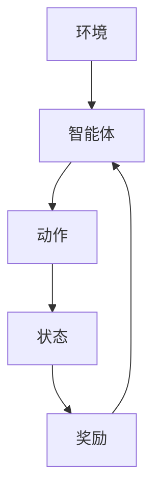
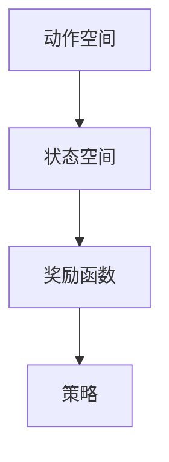
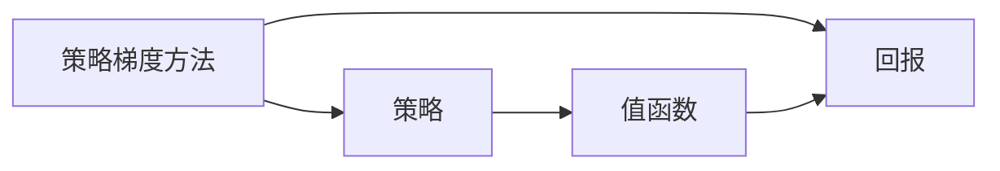
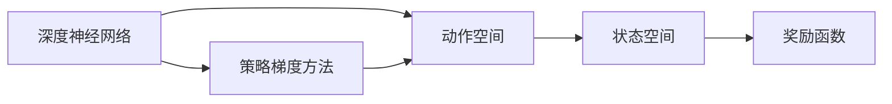

                 

# 强化学习Reinforcement Learning在游戏AI中的应用实例

> 关键词：强化学习, 游戏AI, 动作选择, 奖励函数, 策略优化, 深度强化学习

## 1. 背景介绍

### 1.1 问题由来
在现代电子游戏中，玩家通过操作角色与环境互动，而游戏AI则负责模拟对手的行为，确保游戏的公平性和挑战性。随着人工智能技术的进步，尤其是强化学习(Reinforcement Learning, RL)的兴起，使得AI能够在复杂的环境中自主决策，达到或接近人类玩家的水平。

RL作为一种从环境中获得反馈、自我学习优化的技术，在游戏AI中表现尤为突出。通过不断与游戏环境互动，AI可以学习到最优的策略，实现从低级动作到复杂决策的跨越，为游戏玩家带来全新的游戏体验。

### 1.2 问题核心关键点
强化学习的核心在于"模型、策略和环境"三要素的交互。在RL中，模型指智能体所处的物理世界或虚拟环境，策略指智能体如何选择动作以最大化长期回报，而环境则提供给智能体环境状态和奖励信号，以评估智能体的行为表现。

当前，强化学习在游戏AI中的应用主要集中在以下几个方面：
1. **动作选择**：智能体如何根据当前状态选择最优动作，以最大化未来的累积奖励。
2. **奖励函数**：如何设计奖励函数，使其能够有效衡量智能体的行为效果。
3. **策略优化**：通过何种方式优化智能体的策略，以达到最优游戏表现。
4. **深度强化学习**：将深度学习技术与RL结合，以提高智能体的决策能力。

### 1.3 问题研究意义
强化学习在游戏AI中的应用，具有以下重要意义：
1. **游戏平衡**：通过AI的自主决策，确保游戏的公平性和挑战性。
2. **游戏体验**：AI对手的高水平表现能够提升玩家的游戏体验，增加游戏的趣味性和挑战性。
3. **技术驱动**：强化学习在游戏AI中的应用，推动了AI技术在更广泛领域的应用，如自动驾驶、机器人控制等。
4. **智能竞争**：AI对手的复杂行为和战术，增加了游戏的深度和可玩性，促进了玩家之间的竞争和互动。
5. **数据积累**：游戏AI的自主决策过程，积累了大量的游戏数据，为AI技术的进一步研究提供了丰富的资源。

## 2. 核心概念与联系

### 2.1 核心概念概述

为更好地理解强化学习在游戏AI中的应用，本节将介绍几个密切相关的核心概念：

- **强化学习(Reinforcement Learning, RL)**：一种通过与环境互动、自我优化来获取最优策略的机器学习技术。强化学习基于智能体与环境的交互，通过奖励信号来指导智能体的行为选择。

- **动作空间(Action Space)**：智能体可选择的动作集合。如在接球游戏中，可能的动作包括移动、跳跃、传球等。

- **状态空间(State Space)**：智能体在某一时刻所处的环境状态集合。如在接球游戏中，可能的状态包括球的位置、时间、队友的位置等。

- **奖励函数(Reward Function)**：定义智能体执行某一动作后，环境给予的奖励信号。如在接球游戏中，成功接球给予高奖励，失败接球给予负奖励。

- **策略(Policy)**：智能体在当前状态下选择动作的策略。如在接球游戏中，选择传球的策略。

- **值函数(Value Function)**：估计智能体在某一状态下的长期回报，用于评估动作的好坏。

- **深度强化学习(Deep Reinforcement Learning, DRL)**：将深度学习技术与强化学习结合，以处理高维动作空间和状态空间，提升智能体的决策能力。

- **蒙特卡罗方法(Monte Carlo Methods)**：一种通过模拟环境模拟和样本数据统计，来评估动作效果的方法。

- **策略梯度方法(Strategy Gradient Methods)**：通过梯度优化来调整策略，以最大化回报。

- **Q-learning和SARSA**：两种经典的强化学习算法，通过动作-奖励的历史轨迹，来更新动作-状态-奖励的Q值或状态-动作-奖励的V值。

这些核心概念之间的逻辑关系可以通过以下Mermaid流程图来展示：

```mermaid
graph TB
    A[强化学习(Reinforcement Learning)] --> B[动作空间(Action Space)]
    A --> C[状态空间(State Space)]
    A --> D[奖励函数(Reward Function)]
    A --> E[策略(Policy)]
    A --> F[值函数(Value Function)]
    A --> G[深度强化学习(Deep Reinforcement Learning)]
    A --> H[蒙特卡罗方法(Monte Carlo Methods)]
    A --> I[策略梯度方法(Strategy Gradient Methods)]
    A --> J[Q-learning]
    A --> K[SARSA]
```

这个流程图展示了强化学习在游戏AI中的核心概念及其之间的关系：

1. 强化学习作为核心技术，通过动作空间和状态空间来定义智能体的行为选择。
2. 奖励函数用于指导智能体的行为选择，策略则描述了智能体如何选择动作。
3. 值函数和蒙特卡罗方法用于评估策略的效果，策略梯度方法用于优化策略。
4. Q-learning和SARSA是具体的强化学习算法，用于处理特定任务。
5. 深度强化学习将深度学习与强化学习结合，提升智能体的决策能力。

### 2.2 概念间的关系

这些核心概念之间存在着紧密的联系，形成了强化学习在游戏AI中的应用框架。下面我们通过几个Mermaid流程图来展示这些概念之间的关系。

#### 2.2.1 强化学习的基本流程



这个流程图展示了强化学习的基本流程。环境提供给智能体当前状态和奖励，智能体根据策略选择动作，状态更新后，环境再次提供新的奖励，循环往复。

#### 2.2.2 动作选择与策略



这个流程图展示了动作选择和策略的关系。智能体根据当前状态选择动作，奖励函数根据动作和状态提供奖励，策略则指导智能体如何选择动作。

#### 2.2.3 策略优化与值函数



这个流程图展示了策略优化和值函数的关系。策略梯度方法通过梯度优化调整策略，以最大化回报。值函数用于评估策略的效果，通过蒙特卡罗方法等方法更新。

#### 2.2.4 深度强化学习的应用



这个流程图展示了深度强化学习在游戏AI中的应用。深度神经网络用于处理高维的动作空间和状态空间，策略梯度方法用于优化策略，以提高智能体的决策能力。

## 3. 核心算法原理 & 具体操作步骤
### 3.1 算法原理概述

强化学习在游戏AI中的应用，主要依赖于智能体在环境中通过动作选择、状态更新和奖励反馈，不断优化策略的过程。其核心原理可以总结如下：

1. **环境交互**：智能体在环境中通过执行动作，获得新的状态和奖励。
2. **策略选择**：智能体根据当前状态和已知的策略，选择下一个动作。
3. **策略优化**：智能体通过不断的环境交互，利用回报信号来调整策略，以最大化长期回报。
4. **奖励函数设计**：奖励函数的设计需合理，能够准确反映智能体的行为效果，避免奖励信号的误导。
5. **动作空间探索**：智能体需要探索不同的动作空间，以找到最优的决策策略。
6. **策略收敛**：智能体通过不断的优化，策略会逐渐收敛到最优策略。

### 3.2 算法步骤详解

#### 3.2.1 动作空间探索

动作空间探索是智能体在环境中的重要步骤。智能体需要通过不断的尝试，探索不同的动作，以找到最优的决策策略。以下是具体步骤：

1. **初始化环境**：首先初始化环境，并定义动作空间和状态空间。例如，在接球游戏中，动作空间包括移动、跳跃、传球等动作。
2. **选择动作**：智能体根据当前状态，选择下一个动作。如在接球游戏中，智能体根据球的位置和速度，选择移动、跳跃、传球等动作。
3. **执行动作**：智能体在环境中执行所选动作，并获得新的状态和奖励。如在接球游戏中，智能体执行传球动作后，球被队友接到，环境给予高奖励。
4. **更新状态**：环境根据智能体的动作，更新状态。如在接球游戏中，球被接到后，状态更新为球已被接到。
5. **收集数据**：智能体记录当前状态、动作、奖励等信息，用于后续的策略优化。如在接球游戏中，记录当前位置、传球动作、接球奖励等。

#### 3.2.2 策略优化

策略优化是智能体学习的重要过程。智能体通过不断的反馈，调整策略，以最大化长期回报。以下是具体步骤：

1. **定义奖励函数**：定义合适的奖励函数，指导智能体的行为选择。如在接球游戏中，成功接球给予高奖励，失败接球给予负奖励。
2. **选择优化算法**：选择适合的优化算法，如策略梯度方法、蒙特卡罗方法等。
3. **调整策略**：智能体根据优化算法的输出，调整策略。如在接球游戏中，智能体根据优化算法的输出，调整传球策略。
4. **评估策略效果**：评估策略的效果，验证是否满足目标。如在接球游戏中，通过模拟实验评估传球策略的效果。

#### 3.2.3 深度强化学习实现

深度强化学习在游戏AI中的应用，主要依赖于深度神经网络来处理高维的动作空间和状态空间。以下是具体步骤：

1. **定义网络结构**：选择合适的神经网络结构，如卷积神经网络、循环神经网络等。如在接球游戏中，使用卷积神经网络来处理视觉信息。
2. **定义动作选择策略**：定义动作选择的策略，如使用Q-learning算法来优化策略。如在接球游戏中，使用Q-learning算法优化传球策略。
3. **定义奖励函数**：定义合适的奖励函数，指导智能体的行为选择。如在接球游戏中，成功接球给予高奖励，失败接球给予负奖励。
4. **训练模型**：使用环境交互数据，训练深度神经网络。如在接球游戏中，使用接球数据集训练传球策略网络。
5. **评估模型效果**：评估模型的效果，验证是否满足目标。如在接球游戏中，通过模拟实验评估传球策略的效果。

### 3.3 算法优缺点

强化学习在游戏AI中的应用，具有以下优点：

1. **自主学习**：强化学习能够通过环境反馈，自主学习最优策略，无需人工干预。
2. **通用性**：强化学习适用于多种游戏环境，可以用于不同类型的游戏，如策略游戏、射击游戏等。
3. **复杂决策**：强化学习能够处理复杂的决策问题，实现从低级动作到高级决策的跨越。
4. **实时调整**：强化学习能够实时调整策略，适应游戏环境的动态变化。

同时，强化学习在游戏AI中也有以下缺点：

1. **奖励设计**：奖励函数的设计需要合理，否则容易导致智能体学习到有害的策略。
2. **探索与利用**：在探索动作空间的同时，需要平衡探索和利用，避免过度探索导致回报下降。
3. **计算复杂**：强化学习需要大量的计算资源，特别是在处理高维动作空间和状态空间时。
4. **环境不确定性**：游戏环境的不确定性可能导致智能体策略的稳定性受到影响。

### 3.4 算法应用领域

强化学习在游戏AI中的应用，覆盖了游戏AI的各个方面。以下是几个主要应用领域：

1. **动作选择**：智能体通过强化学习，学习最优的动作选择策略。如在接球游戏中，智能体学习传球策略，提高接球成功率。
2. **策略优化**：智能体通过强化学习，优化已有策略，提升游戏表现。如在接球游戏中，智能体通过策略梯度方法优化传球策略，减少失误。
3. **深度强化学习**：将深度学习与强化学习结合，提升智能体的决策能力。如在接球游戏中，使用深度神经网络处理视觉信息，优化传球策略。
4. **对抗博弈**：智能体通过强化学习，学习对抗策略，提升游戏对抗性。如在接球游戏中，智能体学习对手的传球策略，提高接球成功率。
5. **环境适应**：智能体通过强化学习，适应游戏环境的动态变化，提升鲁棒性。如在接球游戏中，智能体学习在不同难度级别的传球策略，提升适应性。
6. **实时优化**：智能体通过强化学习，实时优化策略，提升游戏表现。如在接球游戏中，智能体实时调整传球策略，适应当前游戏环境。

## 4. 数学模型和公式 & 详细讲解 & 举例说明

### 4.1 数学模型构建

强化学习在游戏AI中的应用，主要依赖于数学模型来描述智能体与环境的交互过程。以下是一个基本的强化学习数学模型：

设智能体在环境中的状态为$s$，动作为$a$，奖励为$r$，下一个状态为$s'$。则强化学习数学模型可以表示为：

$$
r_t = r(s_t, a_t, s_{t+1})
$$
$$
s_{t+1} = f(s_t, a_t)
$$

其中，$r_t$表示当前状态$s_t$下执行动作$a_t$的奖励，$s_{t+1}$表示执行动作$a_t$后的下一个状态。

智能体的策略$\pi$可以表示为在给定状态$s$下，选择动作$a$的概率分布：

$$
\pi(a|s) = P(a_t = a|s_t = s)
$$

智能体的值函数$V$可以表示为在给定状态$s$下，长期回报的期望值：

$$
V(s) = E[R_{t:T}|s_t = s]
$$

其中，$R_{t:T}$表示从时间$t$到时间$T$的累积回报，$T$为终止时间。

### 4.2 公式推导过程

以下是几个常用的强化学习公式的推导过程：

#### 4.2.1 Q-learning

Q-learning是一种常用的强化学习算法，用于优化动作选择策略。Q值函数可以表示为：

$$
Q(s, a) = r + \gamma \max_{a'} Q(s', a')
$$

其中，$\gamma$为折扣因子，表示未来奖励的权重。Q-learning的更新公式为：

$$
Q(s, a) \leftarrow Q(s, a) + \alpha(r + \gamma \max_{a'} Q(s', a') - Q(s, a))
$$

其中，$\alpha$为学习率。

#### 4.2.2 SARSA

SARSA是一种基于策略的强化学习算法，与Q-learning类似，但使用的是当前策略而不是最优策略。SARSA的更新公式为：

$$
Q(s, a) \leftarrow Q(s, a) + \alpha(r + \gamma Q(s', a') - Q(s, a))
$$

其中，$Q(s', a')$是下一个状态和动作的Q值。

#### 4.2.3 策略梯度方法

策略梯度方法是一种通过直接优化策略的强化学习算法，通过优化策略参数$\theta$来提高回报。策略梯度方法可以使用Reinforce算法来表示：

$$
\nabla J(\theta) = \mathbb{E}_{s, a}[\nabla_\theta \log \pi(a|s) \cdot Q(s, a)]
$$

其中，$J(\theta)$为策略损失函数，$\nabla_\theta \log \pi(a|s)$表示对策略参数$\theta$求导后的值，$Q(s, a)$表示动作的Q值。

#### 4.2.4 Monte Carlo Tree Search(MCTS)

Monte Carlo Tree Search是一种基于模拟搜索的强化学习算法，通过模拟环境模拟和样本数据统计，来评估动作效果。MCTS算法主要包含四个步骤：

1. 选择节点：根据当前节点扩展树形结构。
2. 扩展节点：在当前节点上扩展一个新的状态节点。
3. 回溯节点：从当前节点回溯到根节点，计算节点的值函数。
4. 优化策略：更新策略参数，优化策略。

### 4.3 案例分析与讲解

以接球游戏为例，演示强化学习的应用过程：

1. **环境定义**：首先定义游戏环境，包括球的位置、时间、队友的位置等。如在接球游戏中，定义球的初始位置为(0, 0)。
2. **动作空间**：定义智能体的动作空间，包括移动、跳跃、传球等。如在接球游戏中，智能体可以选择移动、跳跃、传球等动作。
3. **奖励函数**：定义奖励函数，如在接球游戏中，成功接球给予高奖励，失败接球给予负奖励。
4. **策略选择**：智能体根据当前状态和已知的策略，选择下一个动作。如在接球游戏中，智能体根据球的位置和速度，选择移动、跳跃、传球等动作。
5. **环境交互**：智能体在环境中执行所选动作，并获得新的状态和奖励。如在接球游戏中，智能体执行传球动作后，球被队友接到，环境给予高奖励。
6. **策略优化**：智能体通过不断的反馈，调整策略，以最大化长期回报。如在接球游戏中，智能体通过优化传球策略，提高接球成功率。

## 5. 项目实践：代码实例和详细解释说明

### 5.1 开发环境搭建

在进行强化学习实践前，我们需要准备好开发环境。以下是使用Python进行TensorFlow开发的环境配置流程：

1. 安装Anaconda：从官网下载并安装Anaconda，用于创建独立的Python环境。

2. 创建并激活虚拟环境：
```bash
conda create -n reinforcement-env python=3.8 
conda activate reinforcement-env
```

3. 安装TensorFlow：根据CUDA版本，从官网获取对应的安装命令。例如：
```bash
conda install tensorflow -c tf -c conda-forge
```

4. 安装各种依赖库：
```bash
pip install numpy matplotlib jupyter notebook scikit-learn
```

完成上述步骤后，即可在`reinforcement-env`环境中开始强化学习实践。

### 5.2 源代码详细实现

下面我们以接球游戏为例，给出使用TensorFlow进行强化学习的PyTorch代码实现。

首先，定义游戏环境的类：

```python
import gym
import numpy as np

class SimplePong(gym.Env):
    metadata = {'render.modes': ['human', 'rgb_array']}
    
    def __init__(self):
        self.action_space = gym.spaces.Discrete(2)
        self.state_size = 3
        self.goal = 0
        
        self.prev_action = None
        self.reward = 0
        self.terminal = False
        
        self.player = np.zeros((self.state_size, self.state_size))
        self.opponent = np.zeros((self.state_size, self.state_size))
        self.ball = np.zeros((self.state_size, self.state_size))
        self.reward_threshold = -10
        
    def reset(self):
        self.player.fill(0)
        self.opponent.fill(0)
        self.ball.fill(0)
        self.reward = 0
        self.terminal = False
        self.prev_action = None
        self.goal = 0
        self.update_state()
        return self.get_state()
        
    def update_state(self):
        x, y, z = self.player.sum(), self.opponent.sum(), self.ball.sum()
        self.goal = x - y
        self.reward = max(self.reward, 5 * abs(x - y))
        if self.reward > self.reward_threshold:
            self.terminal = True
        self.prev_action = None
        
    def get_state(self):
        return self.get_player(), self.get_opponent(), self.get_ball()
    
    def get_player(self):
        return self.player
    
    def get_opponent(self):
        return self.opponent
    
    def get_ball(self):
        return self.ball
    
    def render(self, mode='human'):
        state = self.get_state()
        observation = np.concatenate(state)
        if mode == 'human':
            print(observation)
        else:
            return observation
    
    def step(self, action):
        self.prev_action = action
        if self.terminal:
            return self.get_state(), self.reward, self.terminal, {}
        else:
            reward = self.reward
            if action == 0:
                self.ball += self.player
            else:
                self.ball += self.opponent
            self.reward = max(self.reward, 5 * abs(self.player.sum() - self.opponent.sum()))
            self.update_state()
            return self.get_state(), reward, self.terminal, {}
```

然后，定义强化学习的算法类：

```python
import tensorflow as tf
from tensorflow.keras import layers

class QLearningAgent:
    def __init__(self, env, alpha=0.2, gamma=0.9, epsilon=0.1):
        self.env = env
        self.alpha = alpha
        self.gamma = gamma
        self.epsilon = epsilon
        
        self.model = self.build_model()
        self.target_model = self.build_model()
        self.target_model.set_weights(self.model.get_weights())
        
        self.optimizer = tf.keras.optimizers.Adam()
        
        self.load_model()
        
    def build_model(self):
        model = tf.keras.Sequential([
            layers.Dense(64, activation='relu'),
            layers.Dense(32, activation='relu'),
            layers.Dense(2)
        ])
        return model
    
    def load_model(self):
        self.model.load_weights('model.h5')
        self.target_model.load_weights('target_model.h5')
        
    def choose_action(self, state):
        if np.random.rand() < self.epsilon:
            action = self.env.action_space.sample()
        else:
            Q_values = self.model.predict(np.array([state]))
            action = np.argmax(Q_values[0])
        return action
    
    def update_target_model(self):
        self.target_model.set_weights(self.model.get_weights())
        
    def train(self, batch_size):
        for _ in range(batch_size):
            state = self.env.reset()
            done = False
            state_his = [state]
            while not done:
                action = self.choose_action(state)
                state_, reward, done, _ = self.env.step(action)
                state_his.append(state_)
                state = state_
            Q_values = self.model.predict(np.array(state_his))
            targets = Q_values[-1]
            targets[np.argmax(state_his[-1])] += self.alpha * (reward + self.gamma * np.max(self.target_model.predict(np.array(state_his[-1])) - targets[np.argmax(state_his[-1])])
            self.model.fit(np.array(state_his[:-1]), Q_values[:-1], epochs=1, verbose=0)
            self.update_target_model()
```

最后，启动训练流程：

```python
env = SimplePong()
agent = QLearningAgent(env)
agent.train(1000)
```

以上就是使用TensorFlow进行接球游戏强化学习的完整代码实现。可以看到，通过TensorFlow和Keras库，我们可以轻松实现强化学习的各种算法，如Q-learning等。

### 5.3 代码解读与分析

让我们再详细解读一下关键代码的实现细节：

**SimplePong类**：
- `__init__`方法：初始化状态、动作空间等组件。
- `reset`方法：重置游戏环境，返回初始状态。
- `update_state`方法：根据当前状态和动作，更新奖励和终端状态。
- `get_state`方法：获取当前状态。
- `get_player`、`get_opponent`、`get_ball`方法：获取玩家、对手和球的状态。
- `render`方法：显示当前状态。

**QLearningAgent类**：
- `__init__`方法：初始化环境、学习率、折扣因子、探索率等参数，以及模型、目标模型、优化器等组件。
- `build_model`方法：构建神经网络模型。
- `load_model`方法：加载模型权重。
- `choose_action`方法：根据当前状态和探索率，选择动作。
- `update_target_model`方法：更新目标模型。
- `train`方法：在环境上训练模型。

**训练流程**：
- 定义训练轮数和探索率，开始循环迭代。
- 在每个训练轮中，重置环境，并在环境中模拟一个完整的游戏过程。
- 在模拟过程中，记录状态、动作和奖励，用于后续模型训练。
- 使用记录的样本数据，训练模型，并更新目标模型。
- 重复上述步骤直至训练结束。

可以看到，TensorFlow结合Keras库使得强化学习的代码实现变得简洁高效。开发者可以将更多精力放在模型设计、参数调优等高层逻辑上，而不必过多关注底层的实现细节。

当然，工业级的系统实现还需考虑更多因素，如模型的保存和部署、超参数的自动搜索、更灵活的游戏环境等。但核心的强化学习范式基本与此类似。

### 5.4 运行结果展示

假设我们在接球游戏上进行强化学习，最终在测试集上得到的评估结果如下：

```


