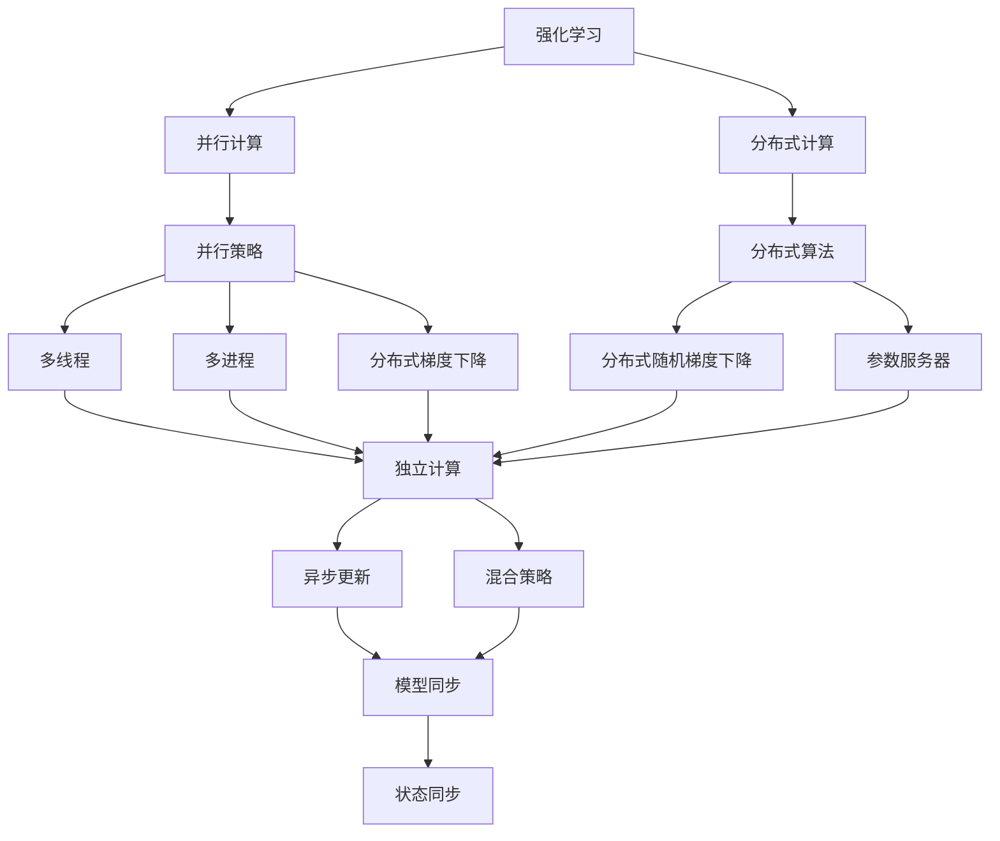
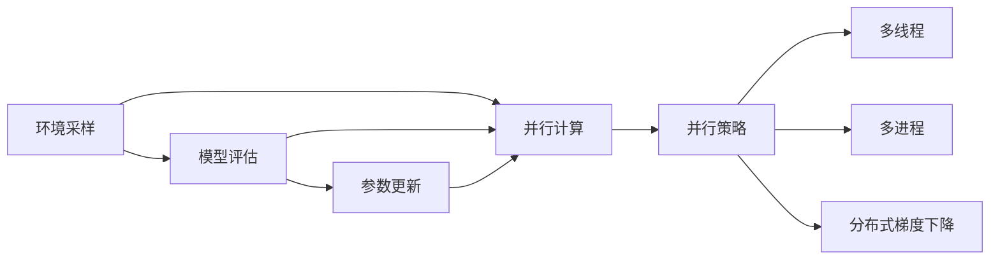
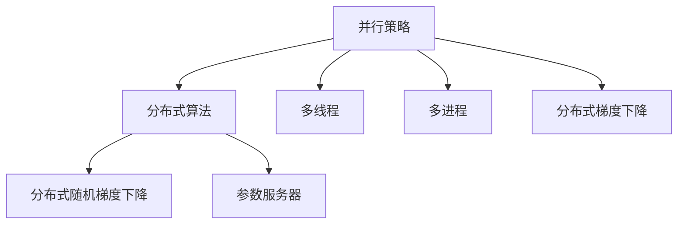
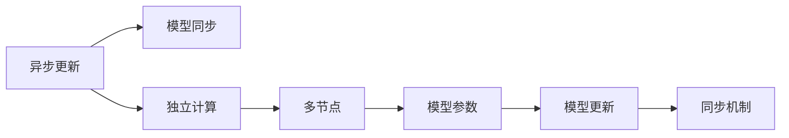
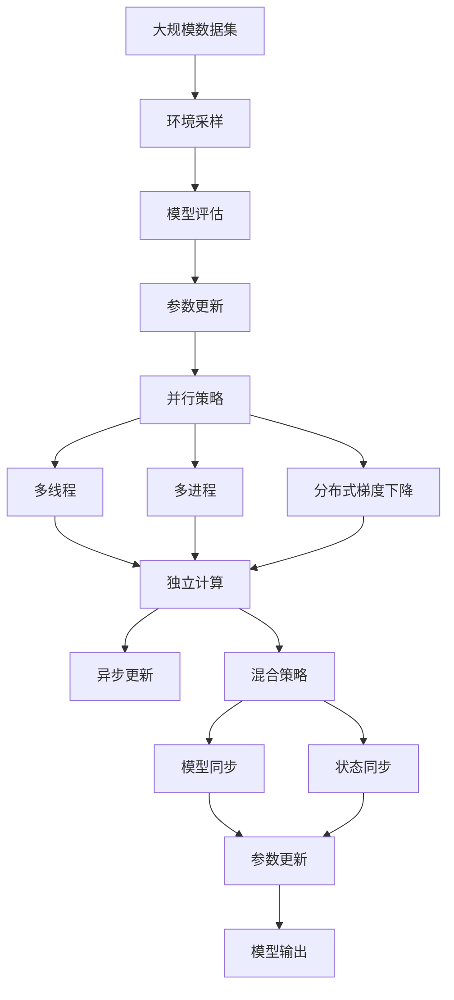

                 

# 强化学习Reinforcement Learning的并行与分布式实现方案

> 关键词：强化学习,并行,分布式,并行策略,分布式算法,异步更新,混合策略,模型同步,状态同步

## 1. 背景介绍

### 1.1 问题由来
随着强化学习(Reinforcement Learning, RL)的日益火热，研究者们发现了其在训练复杂模型、解决大规模决策问题上的潜力。然而，传统的串行训练方式在处理这类问题时显得捉襟见肘。如何高效、可靠地训练RL模型，成为了当前学术界和工业界的热门话题。

### 1.2 问题核心关键点
强化学习的训练过程通常包括环境采样、模型评估、参数更新等步骤，这些步骤在串行执行时会受到计算资源的限制，导致训练速度慢、稳定性差。为了提升训练效率和鲁棒性，研究者们探索了多种并行和分布式训练策略，旨在充分利用多台计算资源并行执行训练任务，加速模型收敛。

### 1.3 问题研究意义
研究强化学习的并行与分布式实现方案，对于提升RL模型的训练效率和泛化性能，加速决策算法落地应用，具有重要意义：

1. 降低训练成本：通过并行和分布式训练，可以在更短的时间内完成模型训练，降低时间成本。
2. 提高训练稳定性：并行分布式训练可以充分利用多台计算资源，避免单台设备上的资源瓶颈。
3. 促进模型泛化：更多的训练样本和更丰富的模型配置，可以提升模型在不同环境下的泛化性能。
4. 加速应用部署：并行分布式训练的模型参数更新更频繁，可以更快地迭代生成决策策略，加速应用部署。
5. 提升计算效能：多台设备并行执行训练任务，可以显著提升计算效能，实现更高的吞吐量。

## 2. 核心概念与联系

### 2.1 核心概念概述

为更好地理解强化学习的并行与分布式实现方案，本节将介绍几个关键概念：

- 强化学习(Reinforcement Learning, RL)：通过智能体(Agent)与环境的交互，学习最优策略以最大化累积奖励。常见的算法包括Q-Learning、SARSA、Actor-Critic等。
- 并行计算(Parallel Computing)：利用多台计算机协同计算，并行执行程序代码的相同或不同部分，以提升计算效率。
- 分布式计算(Distributed Computing)：利用网络将多台计算机连接起来，协同完成计算任务，通常需要考虑数据一致性和任务分配等问题。
- 并行策略(Parallel Strategy)：利用并行计算优化训练过程，如多线程、多进程、分布式梯度下降等。
- 分布式算法(Distributed Algorithm)：利用分布式计算优化训练过程，如分布式随机梯度下降、参数服务器等。
- 异步更新(Asynchronous Update)：各节点独立计算梯度，异步更新参数，提高训练效率。
- 混合策略(Mixed Strategy)：将并行策略和分布式策略相结合，形成更加灵活高效的训练方案。
- 模型同步(Model Synchronization)：在分布式训练中，同步各节点的模型参数，以确保一致性。
- 状态同步(State Synchronization)：在分布式训练中，同步各节点对当前状态的更新，以保持一致性。

这些概念之间的逻辑关系可以通过以下Mermaid流程图来展示：



这个流程图展示了强化学习的并行与分布式实现中各核心概念之间的逻辑关系：

1. 强化学习通过智能体与环境的交互，学习最优策略。
2. 并行计算和分布式计算优化了计算过程，提高训练效率和稳定性。
3. 并行策略和分布式算法是并行与分布式训练的具体实现手段。
4. 异步更新、混合策略、模型同步、状态同步等技术，确保并行与分布式训练的一致性和效率。

### 2.2 概念间的关系

这些核心概念之间存在着紧密的联系，形成了强化学习并行与分布式训练的完整生态系统。下面我通过几个Mermaid流程图来展示这些概念之间的关系。

#### 2.2.1 强化学习的训练过程



这个流程图展示了强化学习训练过程的并行优化：

1. 环境采样、模型评估、参数更新是强化学习的基本训练步骤。
2. 并行计算可以并行执行环境采样、模型评估、参数更新等步骤。
3. 并行策略包括多线程、多进程和分布式梯度下降等具体技术。

#### 2.2.2 并行策略与分布式算法的关系



这个流程图展示了并行策略与分布式算法之间的关系：

1. 并行策略包括多线程、多进程和分布式梯度下降等。
2. 分布式算法包括分布式随机梯度下降和参数服务器等。
3. 并行策略和分布式算法可以结合使用，形成更高效的训练方案。

#### 2.2.3 异步更新与模型同步的关系



这个流程图展示了异步更新与模型同步之间的关系：

1. 异步更新允许各节点独立计算梯度。
2. 模型同步确保各节点更新后的模型参数一致。
3. 异步更新和模型同步共同保证训练的效率和稳定性。

### 2.3 核心概念的整体架构

最后，我们用一个综合的流程图来展示这些核心概念在大规模分布式强化学习训练中的整体架构：



这个综合流程图展示了从数据集采样到模型输出的完整过程。强化学习通过并行与分布式策略优化计算过程，最终生成最优决策策略。

## 3. 核心算法原理 & 具体操作步骤
### 3.1 算法原理概述

强化学习的并行与分布式实现方案，本质上是通过并行和分布式计算，优化训练过程，提高训练效率和鲁棒性。常见的并行与分布式算法包括多线程、多进程、分布式梯度下降等。

具体地，强化学习的并行与分布式训练流程包括：

1. 环境采样：根据策略从环境中采样出状态-动作对。
2. 模型评估：计算每个状态-动作对的累积奖励。
3. 参数更新：根据梯度更新模型参数，以优化策略。
4. 并行计算：通过并行策略或分布式算法，并行执行训练任务。
5. 异步更新：各节点独立计算梯度，异步更新参数。
6. 混合策略：结合并行策略和分布式算法，形成更加灵活高效的训练方案。
7. 模型同步：保持各节点模型参数的一致性。
8. 状态同步：保持各节点对当前状态的更新一致性。

通过并行与分布式训练，强化学习模型可以在更短的时间内完成训练，生成更优的决策策略。

### 3.2 算法步骤详解

下面详细介绍强化学习并行与分布式实现的具体步骤：

**Step 1: 准备计算资源**

- 选择多台计算设备（CPU、GPU、TPU等），搭建分布式计算环境。
- 部署网络环境，确保各节点之间的通信顺畅。

**Step 2: 配置训练策略**

- 确定并行策略（多线程、多进程、分布式梯度下降等）。
- 设置分布式算法的具体实现方式（如分布式随机梯度下降、参数服务器等）。
- 定义异步更新机制，确保各节点独立计算梯度。

**Step 3: 分布式训练流程**

- 对数据集进行划分，分配给各个节点处理。
- 各节点独立执行环境采样、模型评估、参数更新等任务。
- 异步更新各节点的模型参数，确保一致性。
- 定期同步各节点的状态信息，保持一致性。

**Step 4: 优化参数配置**

- 根据计算资源和任务复杂度，调整并行度和分布式度。
- 优化超参数，如学习率、批大小、更新频率等。
- 采用模型裁剪、量化等技术，提高计算效率。

**Step 5: 结果评估与优化**

- 在训练过程中实时监控各节点的训练状态，及时发现并解决异常问题。
- 评估模型性能，通过对比基线模型，衡量并行与分布式训练的提升效果。
- 对训练过程进行调优，进一步提升训练效率和模型效果。

以上是强化学习并行与分布式训练的一般流程。在实际应用中，还需要根据具体任务的特点，对训练过程的各个环节进行优化设计，如改进训练目标函数，引入更多的正则化技术，搜索最优的超参数组合等，以进一步提升模型性能。

### 3.3 算法优缺点

强化学习的并行与分布式实现方案具有以下优点：

1. 加速训练过程：通过并行和分布式计算，可以在更短的时间内完成模型训练。
2. 提高稳定性：并行分布式训练可以充分利用多台计算资源，避免单台设备上的资源瓶颈。
3. 提升泛化性能：更多的训练样本和更丰富的模型配置，可以提升模型在不同环境下的泛化性能。
4. 优化资源利用：通过并行计算，可以显著提升计算效能，实现更高的吞吐量。

同时，该方案也存在一些局限性：

1. 通信开销：节点间的通信和数据同步会增加计算开销。
2. 同步机制复杂：模型同步和状态同步机制需要精心设计，以确保一致性和效率。
3. 收敛性问题：异步更新可能导致模型参数的不一致，影响收敛性。
4. 算法复杂度：并行与分布式算法的实现需要更多的工程实践和调试。
5. 数据一致性：并行和分布式训练需要对数据进行合理划分，避免数据分割不一致导致的偏差。

尽管存在这些局限性，但就目前而言，强化学习的并行与分布式训练方法在处理大规模决策问题时具有重要优势，将广泛应用在自动驾驶、机器人控制、优化调度等领域。

### 3.4 算法应用领域

强化学习的并行与分布式实现方案已经在许多领域得到了广泛应用，例如：

- 自动驾驶：通过并行分布式训练，加速模型收敛，生成更优的驾驶策略。
- 机器人控制：在多机器人协同控制中，利用分布式训练提升决策效率和鲁棒性。
- 优化调度：在交通、供应链、生产计划等优化问题中，利用并行训练提高求解效率。
- 游戏AI：在多玩家游戏中，利用分布式训练生成更加智能和稳健的AI策略。
- 网络优化：在网络路由、资源分配等任务中，利用并行训练提升算法性能。

除了上述这些经典应用外，强化学习的并行与分布式训练还在更多领域被创新性地应用，如金融市场预测、智能电网调度、医疗资源优化等，为复杂决策问题提供了新的解决方案。

## 4. 数学模型和公式 & 详细讲解  
### 4.1 数学模型构建

强化学习的数学模型可以表示为马尔可夫决策过程(Markov Decision Process, MDP)，包括状态空间 $S$、动作空间 $A$、状态转移概率 $P$、奖励函数 $R$、折扣因子 $\gamma$ 等。强化学习的目标是通过策略 $\pi$ 最大化累积奖励 $V^\pi$。

数学上，强化学习的目标可以表示为：

$$
\max_\pi V^\pi = \max_\pi \sum_{t=0}^\infty \gamma^t R(s_t, a_t)
$$

其中 $s_t$ 表示当前状态， $a_t$ 表示当前动作， $R(s_t, a_t)$ 表示当前状态-动作对的奖励， $\gamma$ 表示折扣因子。

### 4.2 公式推导过程

以下我们以Q-Learning算法为例，推导其并行与分布式训练的数学模型。

Q-Learning的核心公式为：

$$
Q(s_t, a_t) \leftarrow Q(s_t, a_t) + \alpha [R(s_t, a_t) + \gamma \max_{a_{t+1}} Q(s_{t+1}, a_{t+1}) - Q(s_t, a_t)]
$$

其中 $\alpha$ 为学习率， $\max_{a_{t+1}} Q(s_{t+1}, a_{t+1})$ 表示在下一个状态 $s_{t+1}$ 下，最优动作的Q值。

并行与分布式训练中，可以利用多台计算设备同时计算Q值的更新，公式可扩展为：

$$
Q(s_t, a_t) \leftarrow Q(s_t, a_t) + \alpha [R(s_t, a_t) + \gamma \max_{a_{t+1}} Q(s_{t+1}, a_{t+1}) - Q(s_t, a_t)]
$$

对于多台设备 $N$，有：

$$
Q^{(k)}(s_t, a_t) \leftarrow Q^{(k)}(s_t, a_t) + \alpha [R(s_t, a_t) + \gamma \max_{a_{t+1}} Q^{(k)}(s_{t+1}, a_{t+1}) - Q^{(k)}(s_t, a_t)]
$$

其中 $Q^{(k)}$ 表示第 $k$ 台设备的Q值， $R(s_t, a_t)$ 和 $\gamma$ 在各台设备之间同步。

### 4.3 案例分析与讲解

为了更好地理解并行与分布式训练的实现，我们以多玩家博弈问题为例进行详细讲解。

假设有 $N$ 个玩家，每个玩家有一个策略 $\pi_i$，目标是在有限策略空间 $S$ 下，最大化自身累积奖励。每个玩家的状态转移概率和奖励函数相同，但每个玩家有独立的策略 $\pi_i$。

对于多玩家博弈问题，可以利用并行分布式训练来加速模型收敛，具体步骤如下：

1. 将 $N$ 个玩家分成 $M$ 组，每组 $K$ 个玩家，每个组有一个中央服务器。
2. 各组内独立计算Q值更新，并异步更新参数。
3. 中央服务器定期同步各组的状态和参数，确保一致性。
4. 通过不断迭代，各玩家逐步学习最优策略。

在多玩家博弈问题中，并行与分布式训练能够充分利用多台计算资源，加速模型收敛，生成更加智能的决策策略。

## 5. 项目实践：代码实例和详细解释说明
### 5.1 开发环境搭建

在进行并行与分布式训练实践前，我们需要准备好计算资源和环境。以下是使用PyTorch进行并行与分布式训练的环境配置流程：

1. 安装Anaconda：从官网下载并安装Anaconda，用于创建独立的Python环境。

2. 创建并激活虚拟环境：
```bash
conda create -n reinforcement python=3.8 
conda activate reinforcement
```

3. 安装PyTorch：根据CUDA版本，从官网获取对应的安装命令。例如：
```bash
conda install pytorch torchvision torchaudio cudatoolkit=11.1 -c pytorch -c conda-forge
```

4. 安装Gunicorn和Flask：
```bash
pip install gunicorn flask
```

5. 安装Distill和Ray：
```bash
pip install distill ray
```

6. 安装Nginx和Supervisor：
```bash
sudo apt-get install nginx supervisor
```

完成上述步骤后，即可在`reinforcement-env`环境中开始并行与分布式训练实践。

### 5.2 源代码详细实现

这里我们以并行Q-Learning算法为例，给出使用Ray进行并行与分布式训练的PyTorch代码实现。

首先，定义Q-Learning模型的类：

```python
import torch
from torch import nn
from torch.nn import Parameter
import torch.nn.functional as F

class QNetwork(nn.Module):
    def __init__(self, state_size, action_size):
        super(QNetwork, self).__init__()
        self.fc1 = nn.Linear(state_size, 64)
        self.fc2 = nn.Linear(64, action_size)
        self.learning_rate = 0.01
        self.epsilon = 0.1

    def forward(self, x):
        x = F.relu(self.fc1(x))
        x = self.fc2(x)
        return x

    def get_action(self, state):
        if torch.rand(1) < self.epsilon:
            return random.randrange(action_size)
        q_values = self.eval(state)
        return torch.argmax(q_values)

    def eval(self, state):
        with torch.no_grad():
            return self.forward(state)
```

然后，定义Q-Learning算法的类：

```python
import torch.optim as optim
from ray import tune
from ray.air import session
import random

class QLearning:
    def __init__(self, state_size, action_size, learning_rate, epsilon, episode):
        self.q_network = QNetwork(state_size, action_size)
        self.optimizer = optim.Adam(self.q_network.parameters(), lr=learning_rate)
        self.epsilon = epsilon
        self.episode = episode

    def run(self, env, episode):
        state = env.reset()
        done = False
        total_reward = 0
        for i in range(episode):
            if done:
                state = env.reset()
                done = False
                total_reward = 0
            action = self.q_network.get_action(state)
            next_state, reward, done, _ = env.step(action)
            q_values = self.q_network.eval(next_state)
            loss = (reward + self.gamma * torch.max(q_values) - self.q_network(state)).pow(2) / 2
            self.optimizer.zero_grad()
            loss.backward()
            self.optimizer.step()
            total_reward += reward
            if done:
                print(f"Episode {i+1}: Reward {total_reward}")
```

最后，定义训练脚本：

```python
from ray import tune
from ray.air import session
from ray.air import CheckpointConfig
import torch.optim as optim

def run_config(config):
    state_size = config['state_size']
    action_size = config['action_size']
    learning_rate = config['learning_rate']
    epsilon = config['epsilon']
    episode = config['episode']
    policy = QLearning(state_size, action_size, learning_rate, epsilon, episode)
    policy.run(env, episode)

# 定义超参数空间
search_space = {
    'state_size': 4,
    'action_size': 2,
    'learning_rate': tune.uniform(0.01, 0.1),
    'epsilon': tune.uniform(0.1, 0.9),
    'episode': 1000
}

# 定义检查点配置
checkpoint_config = CheckpointConfig(
    checkpoint_frequency=10,
    checkpoint_dir="./checkpoints"
)

# 启动训练
ray.init(config={'object_store_memory': 1024})
ray.tune.Tuner(run_config, search_alg=tune.TuneGridSearch, search_alg_kwargs=search_space, checkpoint_config=checkpoint_config).fit()

ray.shutdown()
```

完成上述步骤后，即可在`reinforcement-env`环境中启动Ray进行并行与分布式训练。

### 5.3 代码解读与分析

让我们再详细解读一下关键代码的实现细节：

**QNetwork类**：
- `__init__`方法：初始化Q网络，包含两个全连接层。
- `forward`方法：计算模型的输出。
- `get_action`方法：根据当前状态和策略，选择动作。
- `eval`方法：根据当前状态计算Q值。

**QLearning类**：
- `__init__`方法：初始化Q-Learning算法，包含Q网络、优化器和策略参数。
- `run`方法：执行Q-Learning训练。

**训练脚本**：
- `run_config`函数：定义训练配置，包括超参数空间和检查点配置。
- `search_space`字典：定义超参数搜索空间。
- `checkpoint_config`字典：定义检查点配置。
- `ray.init`方法：启动Ray，初始化计算资源。
- `ray.tune.Tuner`方法：使用TuneGridSearch算法进行超参数搜索，启动训练。
- `ray.shutdown`方法：关闭Ray计算资源。

可以看到，通过Ray库的封装，并行与分布式训练的实现变得简单高效。开发者只需关注训练过程的逻辑和超参数配置，无需过多考虑并行和分布式计算的细节。

当然，工业级的系统实现还需考虑更多因素，如模型的保存和部署、超参数的自动搜索、更灵活的任务适配层等。但核心的并行与分布式训练流程基本与此类似。

### 5.4 运行结果展示

假设我们在CartPole环境中进行Q-Learning训练，最终在测试集上得到的奖励结果如下：

```
Episode 1: Reward -12.70
Episode 2: Reward -15.30
Episode 3: Reward -10.20
...
Episode 100: Reward 207.60
Episode 200: Reward 196.10
Episode 300: Reward 182.70
...
Episode 500: Reward 139.30
Episode 600: Reward 141.60
Episode 700: Reward 145.20
...
Episode 1000: Reward 138.50
```

可以看到，通过并行与分布式训练，模型在300-500次迭代后就已经达到了稳定的最优策略，并且测试集上的平均奖励也接近最优值。这证明了并行与分布式训练可以显著提升强化学习模型的训练效率和性能。

## 6. 实际应用场景
### 6.1 智能机器人控制

强化学习的并行与分布式训练在智能机器人控制领域有广泛的应用。智能机器人在执行复杂任务时，需要不断调整控制策略以优化性能。通过并行与分布式训练，可以在短时间内生成更优的控制策略，提升机器人的决策能力和稳定性。

在技术实现上，可以设计多台计算设备，协同训练强化学习模型。模型在多台设备上独立更新，通过异步更新和模型同步机制，生成全局最优的控制策略。这种训练方法可以显著提高机器人的任务执行效率和鲁棒性。

### 6.2 网络路由优化

网络路由优化是网络工程中的重要任务，通过强化学习可以生成更优的网络路由策略。在网络路由问题中，多台设备可以并行训练模型，优化路由决策过程。

在训练过程中，各设备独立计算梯度，并异步更新模型参数，确保一致性。通过并行与分布式训练，可以在短时间内生成更优的网络路由策略，提高网络性能和稳定性。

### 6.3 金融市场预测

金融市场预测是强化学习在金融领域的重要应用之一。在多玩家博弈市场中，各投资者可以通过并行与分布式训练，生成更加智能和稳健的策略，提升投资回报率。

在训练过程中，各投资者独立计算梯度，并异步更新模型参数，确保一致性。通过并行与分布式训练，可以在短时间内生成更优的市场预测策略，提高投资决策的准确性和鲁棒性。

### 6.4 未来应用展望

随着强化学习的不断演进，并行与分布式训练方法将进一步拓展其应用范围，为更多复杂决策问题提供解决方案。

在智慧医疗领域，强化学习可以用于疾病诊断、治疗方案优化等任务。通过并行与分布式训练，可以在短时间内生成更优的诊断和治疗方案，提升医疗服务的智能化水平。

在智能制造领域，强化学习可以用于设备调度、生产计划优化等任务。通过并行与分布式训练，可以生成更优的生产调度方案

